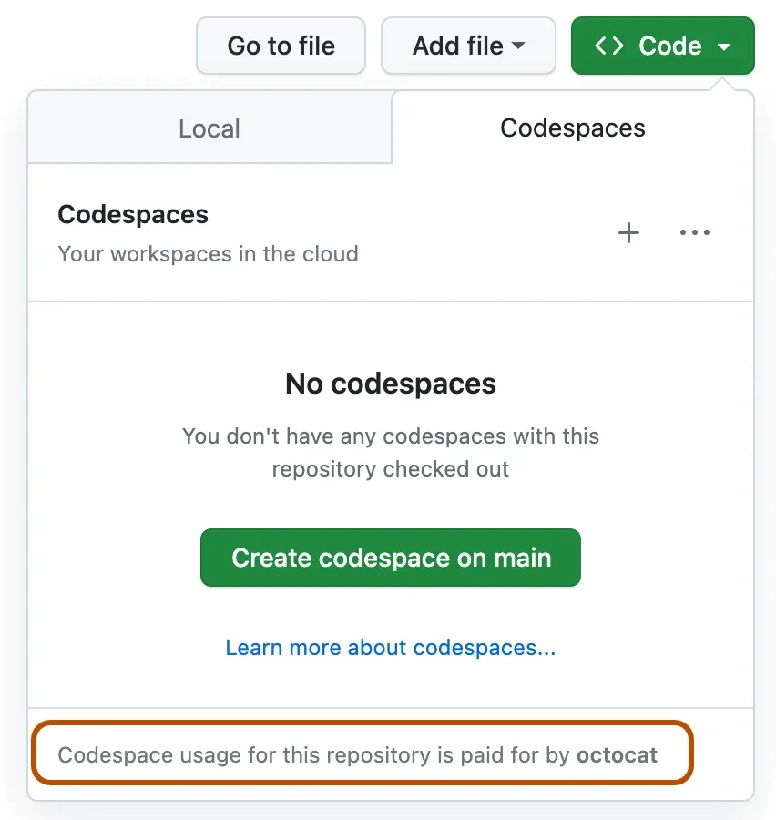

# Початок роботи з цим курсом

Ми дуже раді, що ви починаєте цей курс і побачити, що вас надихне створити за допомогою Генеративного ШІ!

Щоб забезпечити ваш успіх, на цій сторінці наведено кроки налаштування, технічні вимоги та де можна отримати допомогу, якщо це потрібно.

## Кроки налаштування

Щоб почати проходити цей курс, потрібно виконати наступні кроки.

### 1. Форкнути цей репозиторій

[Форкніть увесь цей репозиторій](https://github.com/microsoft/generative-ai-for-beginners/fork?WT.mc_id=academic-105485-koreyst) на свій обліковий запис GitHub, щоб мати можливість змінювати код і виконувати завдання. Ви також можете [поставити зірку (🌟) цьому репозиторію](https://docs.github.com/en/get-started/exploring-projects-on-github/saving-repositories-with-stars?WT.mc_id=academic-105485-koreyst), щоб легше його знаходити разом із пов’язаними репозиторіями.

### 2. Створити codespace

Щоб уникнути проблем із залежностями під час запуску коду, рекомендуємо запускати цей курс у [GitHub Codespaces](https://github.com/features/codespaces?WT.mc_id=academic-105485-koreyst).

У своєму форку: **Code -> Codespaces -> New on main**



#### 2.1 Додати секрет

1. ⚙️ Іконка налаштувань -> Command Pallete-> Codespaces : Manage user secret -> Додати новий секрет.
2. Назва OPENAI_API_KEY, вставте свій ключ, Зберегти.

### 3. Що далі?

| Я хочу…           | Перейти до…                                                             |
|---------------------|-------------------------------------------------------------------------|
| Почати урок 1       | [`01-introduction-to-genai`](../01-introduction-to-genai/README.md)     |
| Працювати офлайн    | [`setup-local.md`](02-setup-local.md)                                   |
| Налаштувати LLM провайдера | [`providers.md`](03-providers.md)                                      |
| Познайомитись з іншими учнями | [Приєднатися до нашого Discord](https://aka.ms/genai-discord?WT.mc_id=academic-105485-koreyst)   |

## Усунення неполадок


| Симптом                                 | Виправлення                                                          |
|-----------------------------------------|---------------------------------------------------------------------|
| Затримка побудови контейнера > 10 хв    | **Codespaces ➜ “Rebuild Container”**                                |
| `python: command not found`             | Терминал не підключився; натисніть **+** ➜ *bash*                   |
| `401 Unauthorized` від OpenAI           | Неправильний / прострочений `OPENAI_API_KEY`                         |
| VS Code показує “Dev container mounting…” | Оновіть вкладку браузера — іноді Codespaces втрачає з’єднання       |
| Відсутнє ядро ноутбука                   | Меню ноутбука ➜ **Kernel ▸ Select Kernel ▸ Python 3**               |

   Unix-подібні системи:

   ```bash
   touch .env
   ```

   Windows:

   ```cmd
   echo . > .env
   ```

3. **Редагуйте файл `.env`**: Відкрийте файл `.env` у текстовому редакторі (наприклад, VS Code, Notepad++ або будь-якому іншому). Додайте до файлу наведені нижче рядки, замінивши заповнювачі на фактичні кінцеві точки та ключі Microsoft Foundry Models (див. [`providers.md`](03-providers.md) як їх отримати):

   > **Примітка:** GitHub Models (та змінна `GITHUB_TOKEN`) будуть виведені з експлуатації наприкінці липня 2026 року. Натомість використовуйте [Microsoft Foundry Models](https://ai.azure.com/catalog/models?WT.mc_id=academic-105485-koreyst).

   ```env
   AZURE_INFERENCE_ENDPOINT=your_foundry_endpoint_here
   AZURE_INFERENCE_CREDENTIAL=your_foundry_api_key_here
   ```

4. **Збережіть файл**: Збережіть зміни і закрийте текстовий редактор.

5. **Встановіть `python-dotenv`**: Якщо ви ще не встановили, потрібно встановити пакет `python-dotenv`, щоб завантажувати змінні середовища з файлу `.env` у ваш Python-додаток. Ви можете встановити його за допомогою `pip`:

   ```bash
   pip install python-dotenv
   ```

6. **Завантажте змінні середовища у ваш Python-скрипт**: У вашому Python-скрипті використовуйте пакет `python-dotenv` для завантаження змінних середовища з файлу `.env`:

   ```python
   from dotenv import load_dotenv
   import os

   # Завантажити змінні середовища з файлу .env
   load_dotenv()

   # Отримати доступ до змінних Microsoft Foundry Models
   endpoint = os.getenv("AZURE_INFERENCE_ENDPOINT")
   token = os.getenv("AZURE_INFERENCE_CREDENTIAL")

   print(endpoint)
   ```

Ось і все! Ви успішно створили файл `.env`, додали свої облікові дані Microsoft Foundry Models і завантажили їх у свій Python-додаток.

## Як запускати локально на вашому комп’ютері

Щоб запускати код локально на комп’ютері, вам потрібно мати встановлену [певну версію Python](https://www.python.org/downloads/?WT.mc_id=academic-105485-koreyst).

Щоб користуватись репозиторієм, його потрібно клонувати:

```shell
git clone https://github.com/microsoft/generative-ai-for-beginners
cd generative-ai-for-beginners
```

Коли все буде скопійовано, ви можете починати!

## Опціональні кроки

### Встановлення Miniconda

[Miniconda](https://conda.io/en/latest/miniconda.html?WT.mc_id=academic-105485-koreyst) — легкий інсталятор для встановлення [Conda](https://docs.conda.io/en/latest?WT.mc_id=academic-105485-koreyst), Python та кількох пакетів.
Conda — це менеджер пакетів, який полегшує налаштування та перемикання між різними Python [віртуальними середовищами](https://docs.python.org/3/tutorial/venv.html?WT.mc_id=academic-105485-koreyst) та пакетами. Він також зручний для встановлення пакетів, які недоступні через `pip`.

Ви можете слідувати [інструкції з встановлення MiniConda](https://docs.anaconda.com/free/miniconda/#quick-command-line-install?WT.mc_id=academic-105485-koreyst) для налаштування.

Після установки Miniconda потрібно клонувати [репозиторій](https://github.com/microsoft/generative-ai-for-beginners/fork?WT.mc_id=academic-105485-koreyst) (якщо ви ще цього не зробили).

Далі, потрібно створити віртуальне середовище. Для цього з Conda створіть новий файл середовища (_environment.yml_). Якщо ви працюєте в Codespaces, створіть цей файл у директорії `.devcontainer`, тобто `.devcontainer/environment.yml`.

Заповніть цей файл наведеним нижче кодом:

```yml
name: <environment-name>
channels:
  - defaults
  - microsoft
dependencies:
  - python=<python-version>
  - openai
  - python-dotenv
  - pip
  - pip:
      - azure-ai-ml
```

Якщо ви отримуєте помилки при використанні conda, можна вручну встановити бібліотеки Microsoft AI за допомогою наступної команди в терміналі.

```
conda install -c microsoft azure-ai-ml
```

Файл середовища містить потрібні залежності. `<environment-name>` — це назва, яку ви хочете використати для свого середовища Conda, а `<python-version>` — версія Python, яку ви хочете використовувати, наприклад `3` — це остання основна версія Python.

Після цього можна створити ваше Conda-середовище, виконавши наведені команди у командному рядку/терміналі

```bash
conda env create --name ai4beg --file .devcontainer/environment.yml # Підшлях .devcontainer застосовується лише до налаштувань Codespace
conda activate ai4beg
```

Якщо виникнуть проблеми, зверніться до [інструкції по середовищам Conda](https://docs.conda.io/projects/conda/en/latest/user-guide/tasks/manage-environments.html?WT.mc_id=academic-105485-koreyst).

### Використання Visual Studio Code із розширенням підтримки Python

Рекомендуємо використовувати редактор [Visual Studio Code (VS Code)](https://code.visualstudio.com/?WT.mc_id=academic-105485-koreyst) із встановленим [розширенням підтримки Python](https://marketplace.visualstudio.com/items?itemName=ms-python.python&WT.mc_id=academic-105485-koreyst) для цього курсу. Проте це більше рекомендація, а не обов’язкова вимога.

> **Примітка**: Відкривши репозиторій курсу у VS Code, у вас є можливість налаштувати проєкт у контейнері. Це можливо завдяки спеціальній директорії [`.devcontainer`](https://code.visualstudio.com/docs/devcontainers/containers?itemName=ms-python.python&WT.mc_id=academic-105485-koreyst) у репозиторії курсу. Детальніше про це пізніше.

> **Примітка**: Після клонування та відкриття директорії у VS Code, він автоматично запропонує встановити розширення підтримки Python.

> **Примітка**: Якщо VS Code запропонує пере-відкрити репозиторій у контейнері, відхиліть цю пропозицію, щоб використовувати локально встановлену версію Python.

### Використання Jupyter в браузері

Ви також можете працювати над проєктом у середовищі [Jupyter](https://jupyter.org?WT.mc_id=academic-105485-koreyst) прямо у вашому браузері. Як класичний Jupyter, так і [Jupyter Hub](https://jupyter.org/hub?WT.mc_id=academic-105485-koreyst) надають зручне середовище розробки з такими функціями, як автозаповнення, підсвічування коду тощо.

Щоб запустити Jupyter локально, відкрийте термінал/командний рядок, перейдіть до директорії курсу і виконайте:

```bash
jupyter notebook
```

або

```bash
jupyterhub
```

Це запустить інстанс Jupyter, а URL для доступу буде показано в терміналі.

Після доступу за URL ви побачите структуру курсу і зможете перейти до будь-якого файлу `*.ipynb`. Наприклад, `08-building-search-applications/python/oai-solution.ipynb`.

### Запуск у контейнері

Альтернативою налаштуванню всього на вашому комп’ютері чи Codespace є використання [контейнера](../../../00-course-setup/<https:/en.wikipedia.org/wiki/Containerization_(computing)?WT.mc_id=academic-105485-koreyst>). Спеціальна папка `.devcontainer` у репозиторії курсу дозволяє VS Code налаштувати проєкт у контейнері. Позa Codespaces це вимагатиме встановлення Docker і досить багато зусиль, тому рекомендуємо це лише тим, хто має досвід у роботі з контейнерами.

Один із найкращих способів убезпечити ваші API-ключі при використанні GitHub Codespaces – це використання таємниць Codespace Secrets. Будь ласка, дотримуйтеся [керівництва з управління секретами Codespaces](https://docs.github.com/en/codespaces/managing-your-codespaces/managing-secrets-for-your-codespaces?WT.mc_id=academic-105485-koreyst), щоб дізнатися більше.


## Уроки та технічні вимоги

У курсі є уроки «Learn», що пояснюють концепції Генеративного ШІ, та уроки «Build» із практичними прикладами коду на **Python** і **TypeScript**, якщо можливо.

Для уроків кодування ми використовуємо Azure OpenAI у Microsoft Foundry. Вам потрібна підписка Azure і API-ключ. Доступ відкритий — заявка не потрібна — тому ви можете [створити ресурс Microsoft Foundry і розгорнути модель](https://learn.microsoft.com/azure/ai-foundry/openai/how-to/create-resource?pivots=web-portal&WT.mc_id=academic-105485-koreyst), щоб отримати свою кінцеву точку та ключ.

Кожен урок із кодування також містить файл `README.md`, де ви можете переглянути код і результати, не запускаючи нічого.

## Використання Azure OpenAI Service уперше

Якщо ви вперше працюєте з Azure OpenAI service, будь ласка, дотримуйтеся цього керівництва, як [створити і розгорнути ресурс Azure OpenAI Service](https://learn.microsoft.com/azure/ai-foundry/openai/how-to/create-resource?pivots=web-portal&WT.mc_id=academic-105485-koreyst)

## Використання OpenAI API вперше

Якщо ви вперше працюєте з OpenAI API, просимо слідувати керівництву про те, як [створити і використовувати Інтерфейс.](https://platform.openai.com/docs/quickstart?context=pythont&WT.mc_id=academic-105485-koreyst)

## Познайомтесь з іншими учнями

Ми створили канали в нашому офіційному [AI Community Discord сервері](https://aka.ms/genai-discord?WT.mc_id=academic-105485-koreyst) для знайомства з іншими учнями. Це чудова можливість налагодити зв’язки з іншими однодумцями — підприємцями, розробниками, студентами та всіма, хто хоче покращити свої навички у Генеративному ШІ.

[](https://aka.ms/genai-discord?WT.mc_id=academic-105485-koreyst)

Команда проєкту також буде на цьому сервері Discord, щоб допомагати учням.

## Внесок

Цей курс — ініціатива з відкритим кодом. Якщо ви бачите області для покращення або проблеми, створіть будь ласка [Pull Request](https://github.com/microsoft/generative-ai-for-beginners/pulls?WT.mc_id=academic-105485-koreyst) або зареєструйте [GitHub issue](https://github.com/microsoft/generative-ai-for-beginners/issues?WT.mc_id=academic-105485-koreyst).

Команда проєкту відслідковуватиме всі внески. Внесок у відкритий код — це чудовий шлях для побудови вашої кар’єри у Генеративному ШІ.

Більшість внесків вимагають погодження з Ліцензійною угодою для учасників (CLA), що підтверджує, що ви маєте право і дійсно надаєте нам права використовувати ваш внесок. Детальніше на сайті [CLA, Contributor License Agreement](https://cla.microsoft.com?WT.mc_id=academic-105485-koreyst).

Важливо: при перекладі текстів у цьому репозиторії переконайтеся, що ви не використовуєте машинний переклад. Переклади перевірятиме спільнота, тому будь ласка, беріть участь лише у перекладах мов, якими ви володієте.


Коли ви надсилаєте pull request, CLA-бот автоматично визначить, чи потрібно вам надати CLA, і відповідним чином позначить PR (наприклад, ярликом, коментарем). Просто дотримуйтеся інструкцій, наданих ботом. Вам потрібно буде зробити це лише один раз для всіх репозиторіїв, які використовують наш CLA.

Цей проект прийняв [Кодекс поведінки відкритого коду Microsoft](https://opensource.microsoft.com/codeofconduct/?WT.mc_id=academic-105485-koreyst). Для отримання додаткової інформації прочитайте FAQ Кодексу поведінки або зв’яжіться за адресою [Email opencode](opencode@microsoft.com) з будь-якими додатковими питаннями чи коментарями.

## Почнемо

Тепер, коли ви виконали необхідні кроки для завершення цього курсу, давайте почнемо з [вступу до генеративного штучного інтелекту та LLM](../01-introduction-to-genai/README.md?WT.mc_id=academic-105485-koreyst).

---

<!-- CO-OP TRANSLATOR DISCLAIMER START -->
**Відмова від відповідальності**:
Цей документ було перекладено за допомогою сервісу штучного інтелекту для перекладу [Co-op Translator](https://github.com/Azure/co-op-translator). Хоча ми прагнемо до точності, будь ласка, майте на увазі, що автоматичні переклади можуть містити помилки або неточності. Оригінальний документ рідною мовою слід вважати авторитетним джерелом. Для критично важливої інформації рекомендується професійний людський переклад. Ми не несемо відповідальності за будь-які непорозуміння або неправильні тлумачення, що виникли внаслідок використання цього перекладу.
<!-- CO-OP TRANSLATOR DISCLAIMER END -->