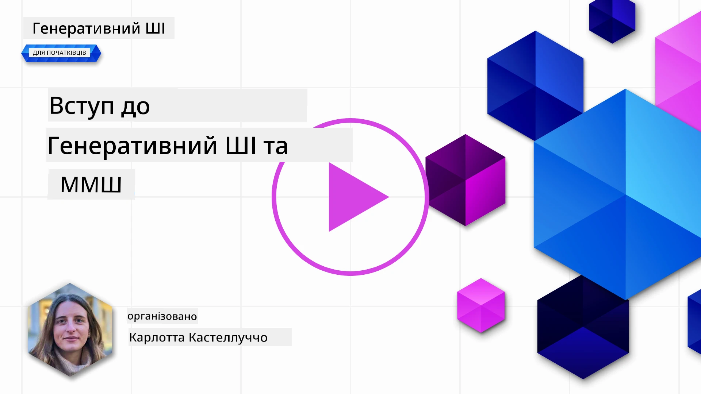
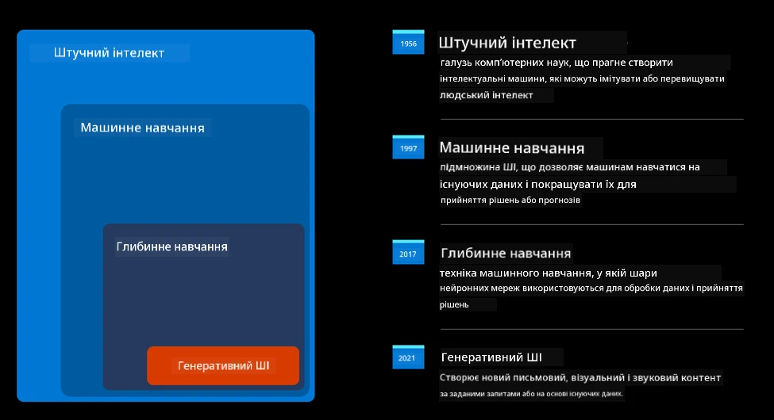
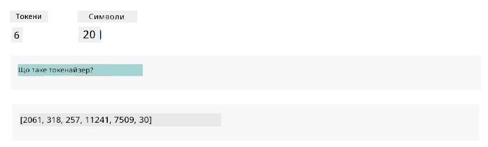
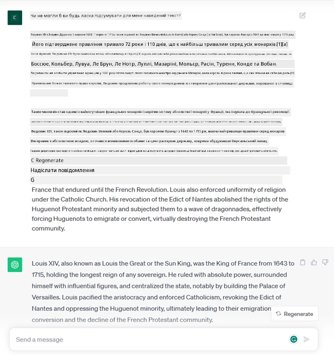
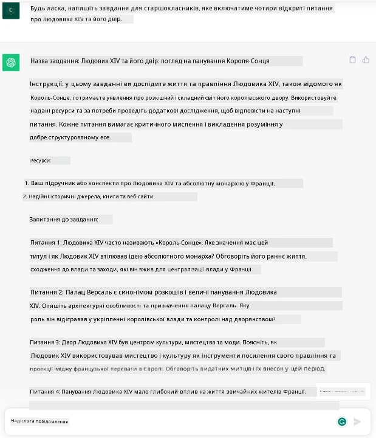
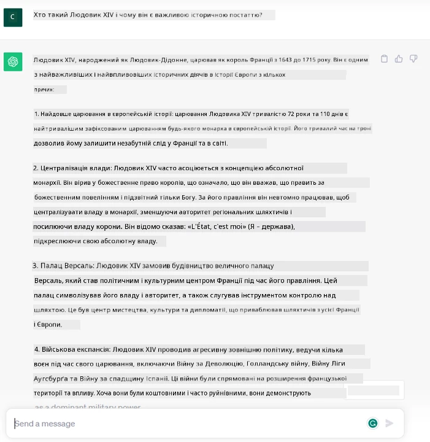
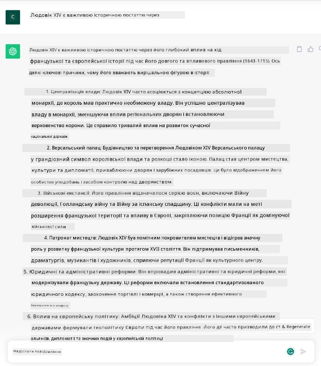
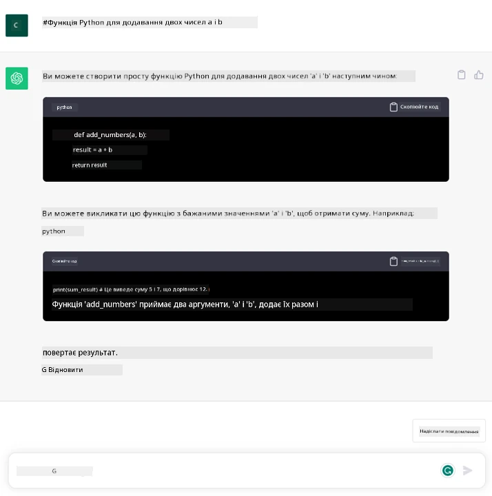

# Вступ до генеративного штучного інтелекту та великих мовних моделей

_(Натисніть на зображення вище для перегляду відео цього уроку)_

Генеративний ШІ — це штучний інтелект, здатний генерувати текст, зображення та інші типи контенту. Що робить цю технологію фантастичною — це те, що вона демократизує ШІ, кожен може її використовувати, маючи лише текстовий запит, речення, написане природною мовою. Вам не потрібно вивчати мови програмування, як Java чи SQL, щоб досягти чогось корисного, усе, що потрібно — це використовувати свою мову, вказати, що ви хочете, і отримати пропозицію від моделі ШІ. Застосування і вплив цього величезні: ви пишете чи розумієте звіти, пишете заявки та багато іншого — усе за секунди.

У цій програмі ми дослідимо, як наш стартап використовує генеративний ШІ для відкриття нових сценаріїв у світі освіти та як ми розв’язуємо неминучі виклики, пов’язані із соціальними наслідками його застосування та технологічними обмеженнями.

## Вступ

У цьому уроці буде розглянуто:

- Вступ до бізнес-сценарію: ідея та місія нашого стартапу.
- Генеративний ШІ та як ми дійшли до сучасного технологічного ландшафту.
- Внутрішній механізм роботи великої мовної моделі.
- Основні можливості та практичні випадки використання великих мовних моделей.

## Цілі навчання

Після завершення цього уроку ви зрозумієте:

- Що таке генеративний ШІ і як працюють великі мовні моделі.
- Як можна використовувати великі мовні моделі для різних випадків, з акцентом на освітні сценарії.

## Сценарій: наш освітній стартап

Генеративний штучний інтелект (ШІ) є вершиною технологій ШІ, розширюючи межі того, що колись вважалося неможливим. Моделі генеративного ШІ мають численні можливості та застосування, але в цій програмі ми дослідимо, як він революціонізує освіту через вигаданий стартап. Ми називатимемо цей стартап _наш стартап_. Наш стартап працює в освітній сфері з амбітною місією

> _покращити доступність навчання в глобальному масштабі, забезпечити рівний доступ до освіти та надавати персоналізований досвід навчання кожному учню відповідно до їхніх потреб_.

Команда нашого стартапу розуміє, що ми не зможемо досягти цієї мети без використання одного з найпотужніших інструментів сучасності – великих мовних моделей (LLM).

Очікується, що генеративний ШІ революціонізує спосіб навчання і викладання сьогодні, коли студенти матимуть у своєму розпорядженні віртуальних вчителів цілодобово, які надають величезну кількість інформації та прикладів, а викладачі зможуть використовувати інноваційні інструменти для оцінювання студентів і надання зворотного зв’язку.

Почнемо з визначення базових понять і термінів, які ми будемо використовувати протягом курсу.

## Як ми отримали генеративний ШІ?

Незважаючи на надзвичайний _шум_ навколо оголошення моделей генеративного ШІ, ця технологія створювалася десятиліттями, з перших досліджень ще у 60-х роках. Зараз ми маємо ШІ з людськими когнітивними здібностями, такими як ведення розмови, що демонструє, наприклад, [OpenAI ChatGPT](https://openai.com/chatgpt) або [Microsoft Copilot](https://copilot.microsoft.com/?WT.mc_id=academic-105485-koreyst), який також використовує модель GPT для пошукового досвіду в веб-розмові.

Згадаємо трохи назад: перші прототипи ШІ складалися з чат-ботів з фіксованим набором відповідей, які базувалися на базі знань, отриманій від групи експертів і представленій у комп’ютері. Відповіді в базі запускалися ключовими словами, що з’являлися у вхідному тексті.
Проте незабаром стало зрозуміло, що такий підхід із чат-ботами не має гарної масштабованості.

### Статистичний підхід до ШІ: машинне навчання

Поворотний момент настав у 90-х роках із застосуванням статистичного підходу до аналізу тексту. Це призвело до розробки нових алгоритмів — машинного навчання — здатних навчатися шаблонам із даних без явного програмування. Цей підхід дозволяє машинам імітувати розуміння людської мови: статистична модель навчається на парах текст-маркери, що дозволяє моделі класифікувати невідомий текст з попередньо визначеним маркером, що виражає намір повідомлення.

### Нейронні мережі та сучасні віртуальні помічники

Останніми роками технічний розвиток апаратного забезпечення, здатного обробляти більші обсяги даних і складніші обчислення, стимулював дослідження в галузі ШІ, що призвело до розробки передових алгоритмів машинного навчання, відомих як нейронні мережі або алгоритми глибокого навчання.

Нейронні мережі (особливо рекурентні нейронні мережі – RNN) значно покращили обробку природньої мови, дозволяючи краще відображати значення тексту, враховуючи контекст слова в реченні.

Саме ця технологія живила віртуальних помічників, що з’явилися у першому десятилітті нової ери, дуже вправних у розумінні людської мови, визначенні потреби та виконанні дії для її задоволення — наприклад, відповіді за унікальним сценарієм чи використання сторонніх сервісів.

### Сучасність, генеративний ШІ

Таким чином, ми дійшли до генеративного ШІ, який можна вважати підмножиною глибокого навчання.

Після десятиліть досліджень у сфері ШІ нова архітектура моделі – під назвою _Transformer_ – подолала обмеження RNN, ставши здатною обробляти набагато довші послідовності тексту на вході. Трансформери базуються на механізмі уваги, який дозволяє моделі присвоювати різну вагу отриманим входам, «звертаючи більше уваги» там, де зосереджена найбільш релевантна інформація, незалежно від їхнього порядку у текстовій послідовності.

Більшість сучасних моделей генеративного ШІ – також відомих як великі мовні моделі (LLM), оскільки вони працюють із текстовими вхідними та вихідними даними – базуються саме на цій архітектурі. Цікавим в цих моделях, навчених на величезній кількості немаркованих даних з різноманітних джерел, таких як книги, статті та вебсайти, є те, що їх можна адаптувати до великої різноманітності завдань і генерувати граматично правильний текст з ознаками творчості. Отже, вони не лише надзвичайно покращили здатність машини «розуміти» вхідний текст, але й дали змогу генерувати оригінальні відповіді людською мовою.

## Як працюють великі мовні моделі?

У наступному розділі ми дослідимо різні типи моделей генеративного ШІ, а зараз подивимось, як працюють великі мовні моделі, з акцентом на моделі OpenAI GPT (Generative Pre-trained Transformer).

- **Токенізатор, текст у числа**: Великі мовні моделі приймають текст на вході та генерують текст на виході. Проте, будучи статистичними моделями, вони значно краще працюють із числами, ніж із текстовими послідовностями. Тому кожен вхідний текст обробляється токенізатором до використання в основній моделі. Токен — це фрагмент тексту, який складається з змінної кількості символів; основне завдання токенізатора — розбити вхідні дані на масив токенів. Потім кожен токен відображається в індекс токена, який є цілочисельним кодуванням оригінального текстового фрагмента.

- **Передбачення вихідних токенів**: Маючи n токенів на вході (максимальне n варіюється в залежності від моделі), модель може передбачити один токен на виході. Цей токен потім включається у вхід наступної ітерації за зростаючим шаблоном вікна, що поліпшує досвід користувача, дозволяючи отримати одну (або кілька) речень як відповідь. Це пояснює, чому, якщо ви колись користувалися ChatGPT, інколи здається, ніби він зупиняється посеред речення.

- **Процес вибору, розподіл ймовірності**: Вихідний токен обирається моделлю відповідно до ймовірності його появи після поточної текстової послідовності. Це тому, що модель прогнозує розподіл ймовірностей для всіх можливих «наступних токенів», обчислюваний на основі навчання. Проте не завжди вибирається токен із найвищою ймовірністю. До вибору додається ступінь випадковості так, щоб модель діяла не детермінованим чином — для однакового запиту вихід може відрізнятися. Цей ступінь випадковості додається для імітації процесу творчого мислення і його можна регулювати параметром моделі, який називається температурою.

## Як наш стартап може використовувати великі мовні моделі?

Тепер, коли ми краще розуміємо внутрішній механізм роботи великої мовної моделі, давайте розглянемо кілька практичних прикладів найпоширеніших завдань, які вони добре виконують, з оглядом на наш бізнес-сценарій.
Ми сказали, що головна здатність великої мовної моделі — _генерувати текст із нуля, починаючи з текстового запиту, написаного природною мовою_.

Але який це має бути текстовий вхід та вихід?
Вхід великої мовної моделі відомий як запит (prompt), а вихід — як доповнення (completion), термін, що стосується механізму моделі генерації наступного токена для завершення поточного вводу. Ми глибоко зануримось у те, що таке prompt і як його проєктувати, щоб отримати максимум від нашої моделі. Перш за все, скажемо, що prompt може включати:

- **Інструкцію**, що визначає тип очікуваного від моделі виходу. Ця інструкція іноді може містити приклади або додаткові дані.

  1. Резюмування статті, книги, оглядів продукту та інше, а також виділення важливих ідей із неструктурованих даних.
    
    
  
  2. Креативне генерування ідей та написання статті, ессе, завдання тощо.
      
     

- **Питання**, задане у формі розмови з агентом.
  
  

- Фрагмент **тексту для доповнення**, що фактично є запитом на допомогу у написанні.
  
  

- Фрагмент **коду** разом із проханням пояснити його і задокументувати, або коментар, що просить згенерувати код для виконання конкретного завдання.
  
  

Наведені вище приклади досить прості і не призначені бути вичерпною демонстрацією можливостей великих мовних моделей. Вони покликані показати потенціал використання генеративного ШІ, зокрема, але не виключно, в освітніх контекстах.

Також результат роботи генеративної моделі ШІ не є досконалим і іноді творчість моделі може йти проти неї, призводячи до виходу, що є поєднанням слів, яке користувач може інтерпретувати як спотворення реальності або навіть образливе. Генеративний ШІ не є інтелектуальним — принаймні в більш широкому розумінні інтелекту, що включає критичне та творче мислення або емоційний інтелект; він не є детермінованим і не є надійним, оскільки вигадки, такі як помилкові посилання, контент і заяви, можуть комбінуватися з правильною інформацією і подаватися переконливо та впевнено. У наступних уроках ми розглянемо всі ці обмеження і побачимо, що можна зробити для їх пом’якшення.

## Завдання

Ваше завдання — більше прочитати про [генеративний ШІ](https://en.wikipedia.org/wiki/Generative_artificial_intelligence?WT.mc_id=academic-105485-koreyst) і спробувати визначити сферу, де ви додали б генеративний ШІ сьогодні, де його ще немає. Як відрізнявся б вплив від "старого" способу? Чи могли б ви зробити щось, чого раніше не могли, або робили б це швидше? Напишіть 300 слів резюме про те, яким би був ваш ідеальний AI-стартап та включіть заголовки на кшталт "Проблема", "Як я б використовував AI", "Вплив" та опційно бізнес-план.

Якщо ви виконаєте це завдання, ви навіть можете бути готові подати заявку до інкубатора Microsoft, [Microsoft for Startups Founders Hub](https://www.microsoft.com/startups?WT.mc_id=academic-105485-koreyst) — ми пропонуємо кредити для Azure, OpenAI, менторство і багато іншого, подивіться!

## Перевірка знань

Що з наведеного є правдою про великі мовні моделі?

1. Ви отримуєте точну таку ж відповідь щоразу.
1. Вони роблять усе ідеально, чудово додають числа, генерують працездатний код тощо.
1. Відповідь може варіюватися, навіть при однаковому запиті. Вони також чудово підходять для створення першого варіанту чогось, будь то текст або код. Але ви повинні покращувати результати.

Відповідь: 3, LLM є недетермінованим, відповідь змінюється, проте ви можете контролювати її варіативність за допомогою налаштування температури. Також не слід очікувати ідеальності — їхня задача робити основну роботу, що часто означає отримати гарний перший варіант, який потрібно поступово покращувати.

## Відмінна робота! Продовжуйте шлях

Після завершення цього уроку перегляньте нашу [колекцію для навчання генеративного ШІ](https://aka.ms/genai-collection?WT.mc_id=academic-105485-koreyst), щоб продовжувати вдосконалювати свої знання про генеративний ШІ!

Перейдіть до Уроку 2, де ми розглянемо, як [досліджувати та порівнювати різні типи LLM](../02-exploring-and-comparing-different-llms/README.md?WT.mc_id=academic-105485-koreyst)!

---

<!-- CO-OP TRANSLATOR DISCLAIMER START -->
**Відмова від відповідальності**:
Цей документ було перекладено за допомогою сервісу штучного інтелекту для перекладу [Co-op Translator](https://github.com/Azure/co-op-translator). Хоча ми прагнемо до точності, будь ласка, майте на увазі, що автоматичні переклади можуть містити помилки або неточності. Оригінальний документ рідною мовою слід вважати авторитетним джерелом. Для критично важливої інформації рекомендується професійний людський переклад. Ми не несемо відповідальності за будь-які непорозуміння або неправильні тлумачення, що виникли внаслідок використання цього перекладу.
<!-- CO-OP TRANSLATOR DISCLAIMER END -->