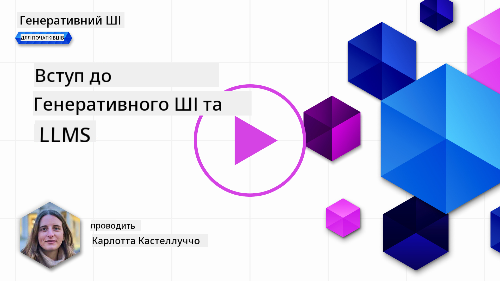
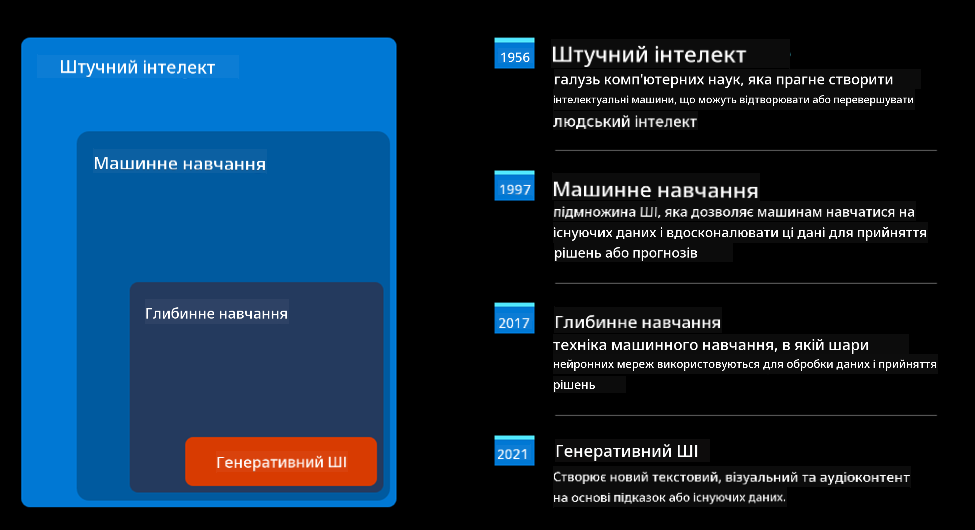
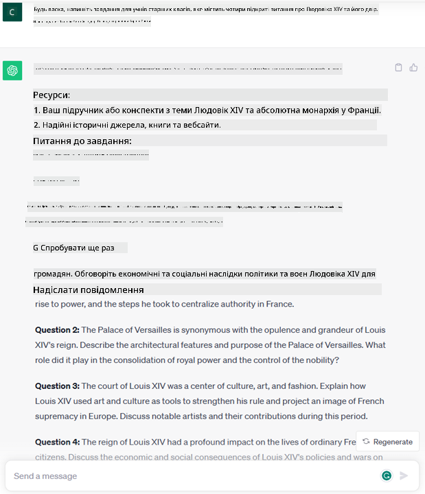
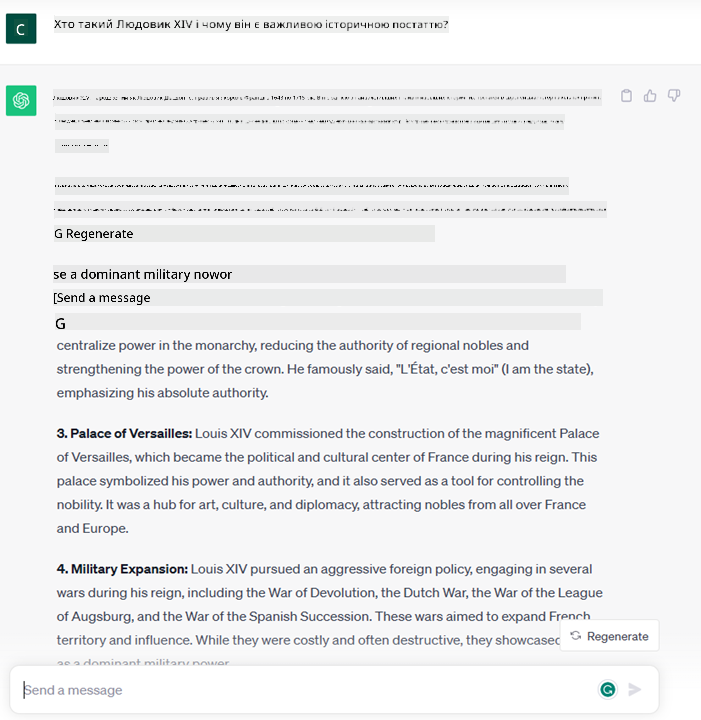
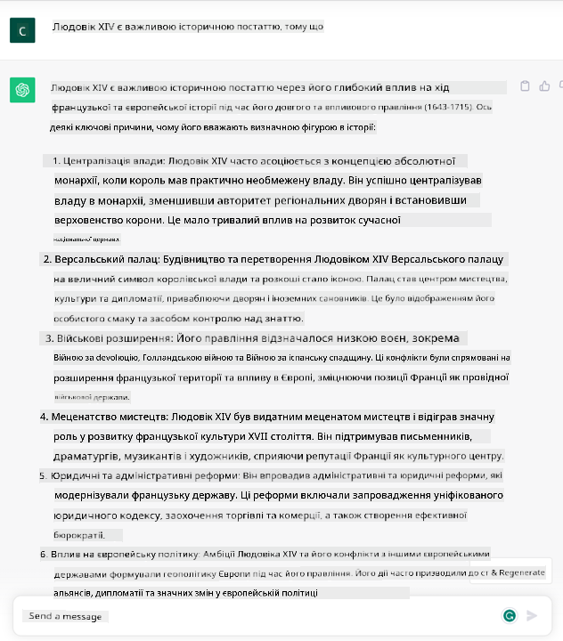

<!--
CO_OP_TRANSLATOR_METADATA:
{
  "original_hash": "bfb7901bdbece1ba3e9f35c400ca33e8",
  "translation_date": "2025-10-18T02:18:26+00:00",
  "source_file": "01-introduction-to-genai/README.md",
  "language_code": "uk"
}
-->
# Вступ до генеративного штучного інтелекту та великих мовних моделей

_(Натисніть на зображення вище, щоб переглянути відео цього уроку)_

Генеративний штучний інтелект — це штучний інтелект, здатний створювати текст, зображення та інші типи контенту. Що робить його фантастичною технологією, так це те, що він демократизує штучний інтелект: кожен може використовувати його, просто ввівши текстовий запит, речення, написане природною мовою. Вам не потрібно вивчати мови програмування, такі як Java чи SQL, щоб досягти чогось значущого, достатньо лише використати свою мову, сформулювати бажане, і модель штучного інтелекту запропонує вам варіант. Застосування та вплив цієї технології величезні: ви можете писати або розуміти звіти, створювати додатки та багато іншого всього за кілька секунд.

У цьому курсі ми дослідимо, як наш стартап використовує генеративний штучний інтелект для відкриття нових сценаріїв у світі освіти, а також як ми вирішуємо неминучі виклики, пов’язані із соціальними наслідками його застосування та обмеженнями технології.

## Вступ

Цей урок охоплює:

- Вступ до бізнес-сценарію: ідея та місія нашого стартапу.
- Генеративний штучний інтелект і як ми дійшли до сучасного технологічного ландшафту.
- Внутрішній механізм роботи великих мовних моделей.
- Основні можливості та практичні випадки використання великих мовних моделей.

## Цілі навчання

Після завершення цього уроку ви зрозумієте:

- Що таке генеративний штучний інтелект і як працюють великі мовні моделі.
- Як можна використовувати великі мовні моделі для різних випадків, з акцентом на освітні сценарії.

## Сценарій: наш освітній стартап

Генеративний штучний інтелект (ШІ) представляє вершину технологій штучного інтелекту, розширюючи межі того, що колись вважалося неможливим. Генеративні моделі ШІ мають багато можливостей і застосувань, але в рамках цього курсу ми дослідимо, як вони революціонізують освіту через вигаданий стартап. Ми будемо називати цей стартап _наш стартап_. Наш стартап працює в освітній сфері з амбітною місією:

> _покращення доступності навчання у глобальному масштабі, забезпечення рівного доступу до освіти та надання персоналізованих навчальних досвідів кожному учню відповідно до його потреб_.

Команда нашого стартапу усвідомлює, що ми не зможемо досягти цієї мети без використання одного з найпотужніших інструментів сучасності – великих мовних моделей (LLMs).

Очікується, що генеративний ШІ революціонізує спосіб, яким ми навчаємося і викладаємо сьогодні, надаючи студентам віртуальних викладачів, доступних 24 години на добу, які пропонують величезну кількість інформації та прикладів, а викладачам – інноваційні інструменти для оцінювання своїх учнів і надання зворотного зв’язку.

Для початку давайте визначимо деякі основні поняття та терміни, які ми будемо використовувати протягом курсу.

## Як ми отримали генеративний ШІ?

Незважаючи на надзвичайний _хайп_, створений останнім часом завдяки оголошенню про генеративні моделі ШІ, ця технологія розроблялася десятиліттями, починаючи з перших досліджень у 60-х роках. Зараз ми досягли точки, коли ШІ має когнітивні здібності, схожі на людські, наприклад, ведення розмов, як це демонструють [OpenAI ChatGPT](https://openai.com/chatgpt) або [Bing Chat](https://www.microsoft.com/edge/features/bing-chat?WT.mc_id=academic-105485-koreyst), який також використовує модель GPT для пошуку в Інтернеті.

Повертаючись трохи назад, перші прототипи ШІ складалися з друкованих чат-ботів, які покладалися на базу знань, отриману від групи експертів і представлену в комп’ютері. Відповіді в базі знань активувалися ключовими словами, що з’являлися у введеному тексті. Однак незабаром стало зрозуміло, що такий підхід, який використовує друковані чат-боти, не є масштабованим.

### Статистичний підхід до ШІ: машинне навчання

Переломний момент настав у 90-х роках із застосуванням статистичного підходу до аналізу тексту. Це призвело до розробки нових алгоритмів – відомих як машинне навчання – здатних вивчати шаблони з даних без явного програмування. Цей підхід дозволив машинам імітувати розуміння людської мови: статистична модель навчалася на парах текст-мітка, що дозволяло моделі класифікувати невідомий текстовий ввід за попередньо визначеною міткою, яка представляє намір повідомлення.

### Нейронні мережі та сучасні віртуальні асистенти

Останніми роками технологічна еволюція апаратного забезпечення, здатного обробляти більші обсяги даних і складніші обчислення, стимулювала дослідження в галузі ШІ, що призвело до розробки передових алгоритмів машинного навчання, відомих як нейронні мережі або алгоритми глибокого навчання.

Нейронні мережі (а зокрема рекурентні нейронні мережі – RNNs) значно покращили обробку природної мови, дозволяючи представляти значення тексту більш змістовно, враховуючи контекст слова в реченні.

Ця технологія стала основою для віртуальних асистентів, які з’явилися в першому десятилітті нового століття, дуже вправних у інтерпретації людської мови, визначенні потреби та виконанні дії для її задоволення – наприклад, відповіді за попередньо визначеним сценарієм або використання стороннього сервісу.

### Сьогодення, генеративний ШІ

Так ми дійшли до сучасного генеративного ШІ, який можна розглядати як підмножину глибокого навчання.

Після десятиліть досліджень у галузі ШІ нова архітектура моделі – названа _Transformer_ – подолала обмеження RNNs, дозволяючи обробляти набагато довші текстові послідовності як ввід. Transformers базуються на механізмі уваги, що дозволяє моделі надавати різну вагу вхідним даним, «приділяючи більше уваги» там, де зосереджена найбільш релевантна інформація, незалежно від її порядку в текстовій послідовності.

Більшість сучасних генеративних моделей ШІ – також відомих як великі мовні моделі (LLMs), оскільки вони працюють із текстовими ввідними та вихідними даними – дійсно базуються на цій архітектурі. Цікаво, що ці моделі – навчені на величезній кількості немаркованих даних із різноманітних джерел, таких як книги, статті та вебсайти – можуть бути адаптовані до широкого спектру завдань і генерувати граматично правильний текст із елементами творчості. Тож вони не лише неймовірно покращили здатність машини «розуміти» ввідний текст, але й дозволили їй генерувати оригінальну відповідь людською мовою.

## Як працюють великі мовні моделі?

У наступному розділі ми дослідимо різні типи генеративних моделей ШІ, але наразі давайте розглянемо, як працюють великі мовні моделі, з акцентом на моделях OpenAI GPT (Generative Pre-trained Transformer).

- **Токенізатор, текст у числа**: Великі мовні моделі отримують текст як ввід і генерують текст як вихід. Однак, будучи статистичними моделями, вони працюють набагато краще з числами, ніж із текстовими послідовностями. Ось чому кожен ввід моделі обробляється токенізатором перед використанням основною моделлю. Токен – це частина тексту, що складається з змінної кількості символів, тому основне завдання токенізатора – розділити ввід на масив токенів. Потім кожен токен зіставляється з індексом токена, який є цілим числом, що кодує оригінальний текстовий фрагмент.

- **Прогнозування вихідних токенів**: Враховуючи n токенів як ввід (з максимальним n, що варіюється від однієї моделі до іншої), модель здатна передбачити один токен як вихід. Цей токен потім включається у ввід наступної ітерації, у розширюваному віконному шаблоні, що забезпечує кращий користувацький досвід отримання одного (або кількох) речень як відповіді. Це пояснює, чому, якщо ви коли-небудь гралися з ChatGPT, ви могли помітити, що іноді він ніби зупиняється на півслові.

- **Процес вибору, розподіл ймовірностей**: Вихідний токен обирається моделлю відповідно до його ймовірності виникнення після поточної текстової послідовності. Це тому, що модель прогнозує розподіл ймовірностей для всіх можливих «наступних токенів», розрахований на основі її навчання. Однак не завжди обирається токен із найвищою ймовірністю з отриманого розподілу. До цього вибору додається певний ступінь випадковості, щоб модель діяла в недетермінованій манері – ми не отримуємо точно той самий вихід для одного й того ж вводу. Цей ступінь випадковості додається для імітації процесу творчого мислення, і його можна налаштувати за допомогою параметра моделі, який називається температурою.

## Як наш стартап може використовувати великі мовні моделі?

Тепер, коли ми краще розуміємо внутрішній механізм роботи великої мовної моделі, давайте розглянемо кілька практичних прикладів найпоширеніших завдань, які вони можуть виконувати досить добре, з акцентом на наш бізнес-сценарій. Ми сказали, що основна можливість великої мовної моделі – це _генерація тексту з нуля, починаючи з текстового вводу, написаного природною мовою_.

Але який саме текстовий ввід і вихід?
Ввід великої мовної моделі відомий як запит, тоді як вихід називається завершенням, термін, який стосується механізму моделі для генерування наступного токена для завершення поточного вводу. Ми детально розглянемо, що таке запит і як його розробити, щоб отримати максимум від нашої моделі. Але наразі скажемо лише, що запит може включати:

- **Інструкцію**, яка визначає тип виходу, який ми очікуємо від моделі. Ця інструкція іноді може містити приклади або додаткові дані.

  1. Резюме статті, книги, відгуків про продукт тощо, а також витяг інсайтів із неструктурованих даних.
    
    
  
  2. Творче генерування ідей та написання статті, есе, завдання тощо.
      
     

- **Питання**, поставлене у формі розмови з агентом.
  
  

- Фрагмент **тексту для завершення**, який імпліцитно є запитом на допомогу в написанні.
  
  

- Фрагмент **коду** разом із запитом на пояснення та документування його, або коментар із проханням згенерувати фрагмент коду для виконання конкретного завдання.
  
  

Наведені вище приклади досить прості і не призначені для вичерпної демонстрації можливостей великих мовних моделей. Вони покликані показати потенціал використання генеративного ШІ, зокрема, але не обмежуючись освітніми контекстами.

Також вихід генеративної моделі ШІ не є ідеальним, і іноді творчість моделі може працювати проти неї, що призводить до виходу, який є комбінацією слів, які людський користувач може інтерпретувати як спотворення реальності, або він може бути образливим. Генеративний ШІ не є інтелектуальним – принаймні в більш всеосяжному визначенні інтелекту, включаючи критичне та творче мислення або емоційний інтелект; він не є детермінованим і не є надійним, оскільки вигадки, такі як помилкові посилання, контент і твердження, можуть бути поєднані з правильною інформацією і представлені переконливо та впевнено. У наступних уроках ми будемо розглядати всі ці обмеження і побачимо, що ми можемо зробити, щоб їх мінімізувати.

## Завдання

Ваше завдання – прочитати більше про [генеративний ШІ](https://en.wikipedia.org/wiki/Generative_artificial_intelligence?WT.mc_id=academic-105485-koreyst) і спробувати визначити область, де ви б додали генеративний ШІ сьогодні, де його ще немає. Як би вплив відрізнявся від виконання завдання «старим способом», чи можете ви зробити щось, чого раніше не могли, або чи стали ви швидшими? Напишіть короткий огляд на 300 слів про те, як виглядав би ваш ідеальний стартап ШІ, і включіть заголовки, такі як "Проблема", "Як я б використав ШІ", "Вплив" і, за бажанням, бізнес-план.

Якщо ви виконаєте це завдання, можливо, ви навіть будете готові подати заявку до інкубатора Microsoft, [Microsoft for Startups Founders Hub](https://www.microsoft.com/startups?WT.mc_id=academic-105485-koreyst), де ми пропонуємо кредити для Azure, OpenAI, наставництво та багато іншого, ознайомтеся!

## Перевірка знань

Що є правдою про великі мовні моделі?

1. Ви отримуєте однакову відповідь кожного разу.
1. Вони виконують завдання ідеально, добре додають числа, створюють робочий код тощо.
1. Відповідь може змінюватися, незважаючи на використання одного й того ж запиту. Вони також чудово підходять для створення першого варіанту чогось, будь то текст чи код. Але вам потрібно покращити результати.

Відповідь: 3, LLM є недетермінованими, відповідь змін
Перейдіть до Уроку 2, де ми розглянемо, як [досліджувати та порівнювати різні типи LLM](../02-exploring-and-comparing-different-llms/README.md?WT.mc_id=academic-105485-koreyst)!

---

**Відмова від відповідальності**:  
Цей документ був перекладений за допомогою сервісу автоматичного перекладу [Co-op Translator](https://github.com/Azure/co-op-translator). Хоча ми прагнемо до точності, будь ласка, майте на увазі, що автоматичні переклади можуть містити помилки або неточності. Оригінальний документ на його рідній мові слід вважати авторитетним джерелом. Для критичної інформації рекомендується професійний людський переклад. Ми не несемо відповідальності за будь-які непорозуміння або неправильні тлумачення, що виникають внаслідок використання цього перекладу.