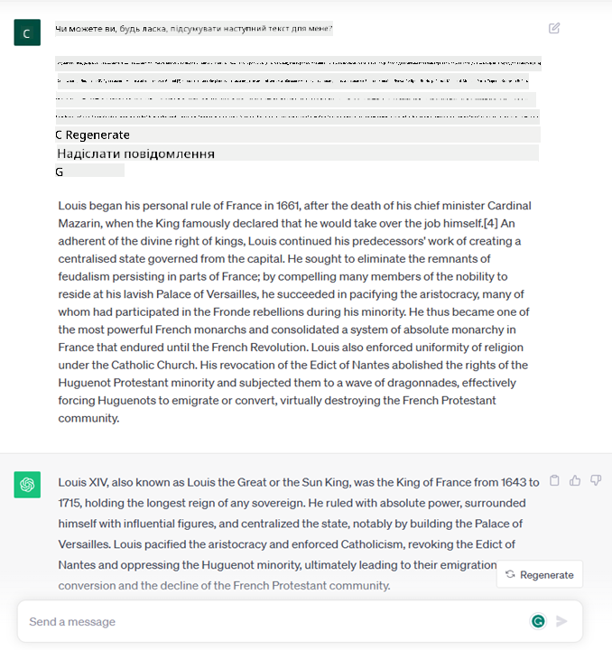

<!--
CO_OP_TRANSLATOR_METADATA:
{
  "original_hash": "f53ba0fa49164f9323043f1c6b11f2b1",
  "translation_date": "2025-07-09T08:06:11+00:00",
  "source_file": "01-introduction-to-genai/README.md",
  "language_code": "uk"
}
-->
# Вступ до генеративного ШІ та великих мовних моделей

_(Натисніть на зображення вище, щоб переглянути відео цього уроку)_

Генеративний ШІ — це штучний інтелект, здатний створювати текст, зображення та інші типи контенту. Що робить цю технологію унікальною — це її демократичність: будь-хто може скористатися нею, маючи лише текстовий запит, речення, написане природною мовою. Вам не потрібно вивчати мови програмування, як-от Java чи SQL, щоб досягти чогось корисного, достатньо просто використати свою мову, сформулювати бажане, і модель ШІ запропонує варіанти. Застосування та вплив цієї технології величезні: ви можете писати або розуміти звіти, створювати додатки та багато іншого — усе це за лічені секунди.

У цій навчальній програмі ми розглянемо, як наш стартап використовує генеративний ШІ для відкриття нових можливостей у сфері освіти, а також як ми долаємо неминучі виклики, пов’язані з соціальними наслідками застосування технології та її обмеженнями.

## Вступ

У цьому уроці ми розглянемо:

- Вступ до бізнес-сценарію: ідея та місія нашого стартапу.
- Генеративний ШІ та сучасний технологічний ландшафт.
- Внутрішній устрій великої мовної моделі.
- Основні можливості та практичні випадки використання великих мовних моделей.

## Цілі навчання

Після проходження цього уроку ви зрозумієте:

- Що таке генеративний ШІ і як працюють великі мовні моделі.
- Як можна використовувати великі мовні моделі для різних завдань, з акцентом на освітні сценарії.

## Сценарій: наш освітній стартап

Генеративний штучний інтелект (ШІ) — це вершина розвитку технологій ШІ, що розсуває межі можливого. Генеративні моделі ШІ мають багато можливостей і застосувань, але в цій програмі ми розглянемо, як вони революціонізують освіту через вигаданий стартап, який ми називатимемо _наш стартап_. Наш стартап працює в освітній сфері з амбітною місією:

> _покращення доступності навчання у всьому світі, забезпечення рівних можливостей для освіти та надання персоналізованого навчального досвіду кожному учню відповідно до його потреб_.

Наша команда розуміє, що досягти цієї мети без використання одного з найпотужніших інструментів сучасності — великих мовних моделей (LLM) — не вдасться.

Очікується, що генеративний ШІ революціонізує спосіб навчання і викладання сьогодні: студенти матимуть віртуальних викладачів 24 години на добу, які надаватимуть величезний обсяг інформації та прикладів, а вчителі зможуть використовувати інноваційні інструменти для оцінювання учнів і надання зворотного зв’язку.

Для початку визначимо основні поняття та терміни, які ми будемо використовувати протягом курсу.

## Як з’явився генеративний ШІ?

Попри величезний _хайп_, що виник останнім часом навколо генеративних моделей ШІ, ця технологія розвивалась десятиліттями, перші дослідження датуються 60-ми роками. Сьогодні ми маємо ШІ з когнітивними здібностями, близькими до людських, наприклад, у вигляді [OpenAI ChatGPT](https://openai.com/chatgpt) або [Bing Chat](https://www.microsoft.com/edge/features/bing-chat?WT.mc_id=academic-105485-koreyst), який також використовує модель GPT для пошуку в Bing.

Повернемося трохи назад: перші прототипи ШІ були чатботами на основі набору правил, які спиралися на базу знань, створену експертами і закодовану в комп’ютері. Відповіді в базі знань активувалися за ключовими словами, що з’являлися у вхідному тексті. Однак швидко стало зрозуміло, що такий підхід не масштабується.

### Статистичний підхід до ШІ: машинне навчання

Поворотним моментом у 90-х став застосунок статистичного підходу до аналізу тексту. Це призвело до створення нових алгоритмів — машинного навчання — які можуть вивчати закономірності з даних без явного програмування. Такий підхід дозволяє машинам імітувати розуміння людської мови: статистична модель навчається на парах текст-мітка, що дає змогу класифікувати невідомий вхідний текст за заздалегідь визначеною міткою, яка відображає намір повідомлення.

### Нейронні мережі та сучасні віртуальні помічники

Останніми роками розвиток апаратного забезпечення, здатного обробляти великі обсяги даних і складні обчислення, стимулював дослідження в галузі ШІ, що призвело до створення просунутих алгоритмів машинного навчання — нейронних мереж або алгоритмів глибокого навчання.

Нейронні мережі (особливо рекурентні нейронні мережі — RNN) значно покращили обробку природної мови, дозволяючи краще відображати значення тексту, враховуючи контекст слова у реченні.

Ця технологія лежить в основі віртуальних помічників, які з’явилися в перше десятиліття нового століття, і які добре розуміють людську мову, визначають потребу та виконують дії для її задоволення — наприклад, відповідають за заздалегідь заданим сценарієм або використовують сторонні сервіси.

### Сучасність, генеративний ШІ

Отже, так ми дійшли до генеративного ШІ, який можна розглядати як підмножину глибокого навчання.

Після десятиліть досліджень у галузі ШІ з’явилася нова архітектура моделей — _Transformer_, яка подолала обмеження RNN, дозволяючи обробляти значно довші послідовності тексту. Трансформери базуються на механізмі уваги, що дає змогу моделі надавати різну вагу вхідним даним, «зосереджуючись» на найбільш релевантній інформації, незалежно від її порядку у тексті.

Більшість сучасних генеративних моделей ШІ — також відомих як великі мовні моделі (LLM), оскільки вони працюють з текстовими вхідними та вихідними даними — побудовані саме на цій архітектурі. Цікаво, що ці моделі, навчені на величезній кількості немаркованих даних з різних джерел, як-от книги, статті та вебсайти, можуть адаптуватися до широкого спектра завдань і генерувати граматично правильний текст із натяком на креативність. Вони не лише значно покращили здатність машини «розуміти» вхідний текст, а й дали змогу створювати оригінальні відповіді людською мовою.

## Як працюють великі мовні моделі?

У наступному розділі ми розглянемо різні типи генеративних моделей ШІ, а поки що зосередимося на роботі великих мовних моделей, зокрема моделей OpenAI GPT (Generative Pre-trained Transformer).

- **Токенізатор, текст у числа**: Великі мовні моделі отримують на вхід текст і генерують текст на виході. Однак, будучи статистичними моделями, вони краще працюють із числами, ніж із текстовими послідовностями. Тому кожен вхідний текст спочатку обробляється токенізатором. Токен — це фрагмент тексту, що складається з різної кількості символів, тому основне завдання токенізатора — розбити вхідний текст на масив токенів. Потім кожен токен відображається у числовий індекс — цілочисельне кодування оригінального текстового фрагмента.

- **Прогнозування вихідних токенів**: Маючи n токенів на вході (максимальне n варіюється залежно від моделі), модель прогнозує один токен на виході. Цей токен додається до вхідних даних наступної ітерації у розширюваному вікні, що забезпечує кращий користувацький досвід, дозволяючи отримувати одну або кілька речень у відповіді. Саме тому, якщо ви колись користувалися ChatGPT, могли помітити, що іноді він ніби зупиняється посеред речення.

- **Процес вибору, розподіл ймовірностей**: Вихідний токен обирається моделлю відповідно до ймовірності його появи після поточної текстової послідовності. Модель прогнозує розподіл ймовірностей для всіх можливих «наступних токенів» на основі свого навчання. Однак не завжди вибирається токен із найвищою ймовірністю. До вибору додається елемент випадковості, завдяки чому модель працює недетерміновано — для одного й того ж запиту можна отримати різні відповіді. Цей рівень випадковості імітує процес креативного мислення і регулюється параметром моделі, який називається temperature.

## Як наш стартап може використовувати великі мовні моделі?

Тепер, коли ми краще розуміємо внутрішній устрій великої мовної моделі, розглянемо кілька практичних прикладів найпоширеніших завдань, які вони можуть виконувати, з огляду на наш бізнес-сценарій.
Головна здатність великої мовної моделі — _генерувати текст з нуля, починаючи з текстового вхідного запиту, написаного природною мовою_.

А який саме вхідний і вихідний текст?
Вхід великої мовної моделі називається prompt (запит), а вихід — completion (завершення), що відображає механізм моделі генерувати наступний токен для доповнення поточного вводу. Ми детально розглянемо, що таке prompt і як його правильно формувати, щоб отримати максимум від моделі. А поки що скажемо, що prompt може містити:

- **Інструкцію**, яка вказує тип очікуваного результату. Іноді інструкція може містити приклади або додаткові дані.

  1. Резюмування статей, книг, відгуків про продукти та інше, а також вилучення інсайтів із неструктурованих даних.
    
    
  
  2. Креативне генерування ідей і написання статей, есе, завдань тощо.
      
     

- **Питання**, задане у формі розмови з агентом.
  
  

- Фрагмент **тексту для доповнення**, що фактично є запитом на допомогу у написанні.
  
  

- Фрагмент **коду** з проханням пояснити та задокументувати його, або коментар, що просить згенерувати код для виконання конкретного завдання.
  
  

Наведенi приклади досить прості і не претендують на вичерпне демонстрування можливостей великих мовних моделей. Вони покликані показати потенціал генеративного ШІ, зокрема, але не виключно, в освітньому контексті.

Також варто пам’ятати, що вихідні дані генеративної моделі не ідеальні, і іноді креативність моделі може призводити до результатів, які користувач може сприймати як спотворення реальності або навіть образливі. Генеративний ШІ не є інтелектуальним у повному розумінні цього слова — він не володіє критичним чи творчим мисленням, емоційним інтелектом; він недетермінований і не завжди надійний, оскільки помилкові посилання, контент і твердження можуть поєднуватися з правильними даними і подаватися впевнено та переконливо. У наступних уроках ми розглянемо всі ці обмеження і способи їх пом’якшення.

## Завдання

Ваше завдання — докладніше ознайомитися з [генеративним ШІ](https://en.wikipedia.org/wiki/Generative_artificial_intelligence?WT.mc_id=academic-105485-koreyst) і спробувати визначити сферу, де ви б сьогодні додали генеративний ШІ, якщо його там немає. Як би відрізнявся вплив порівняно з «старим» способом? Чи зможете ви зробити те, що раніше було неможливо, або працюватимете швидше? Напишіть 300-слівний опис вашого ідеального AI-стартапу, включивши заголовки «Проблема», «Як я використав би ШІ», «Вплив» і, за бажанням, бізнес-план.

Якщо ви виконаєте це завдання, можливо, будете готові подати заявку до інкубатора Microsoft — [Microsoft for Startups Founders Hub](https://www.microsoft.com/startups?WT.mc_id=academic-105485-koreyst). Ми пропонуємо кредити для Azure, OpenAI, менторство та багато іншого — ознайомтеся!

## Перевірка знань

Що є правдою про великі мовні моделі?

1. Ви отримуєте однакову відповідь щоразу.
1. Вони виконують завдання ідеально, добре додають числа, генерують робочий код тощо.
1. Відповідь може відрізнятися, навіть якщо використовувати той самий prompt. Вони також добре підходять для створення першого варіанту тексту чи коду, але результати потрібно покращувати.

Відповідь: 3, LLM є недетермінованими, відповіді варіюються, але ви можете контролювати цю варіативність за допомогою параметра temperature. Не варто очікувати ідеальності — модель допомагає виконати основну роботу, даючи хороший початковий результат, який потрібно поступово вдосконалювати.

## Чудова робота! Продовжуйте навчання

Після завершення цього уроку перегляньте нашу [колекцію навчальних матеріалів з генеративного ШІ](https://aka.ms/genai-collection?WT.mc_id=academic-105485-koreyst), щоб продовжити підвищувати свої знання у цій сфері!
Перейдіть до Уроку 2, де ми розглянемо, як [досліджувати та порівнювати різні типи LLM](../02-exploring-and-comparing-different-llms/README.md?WT.mc_id=academic-105485-koreyst)!

**Відмова від відповідальності**:  
Цей документ було перекладено за допомогою сервісу автоматичного перекладу [Co-op Translator](https://github.com/Azure/co-op-translator). Хоча ми прагнемо до точності, будь ласка, майте на увазі, що автоматичні переклади можуть містити помилки або неточності. Оригінальний документ рідною мовою слід вважати авторитетним джерелом. Для критично важливої інформації рекомендується звертатися до професійного людського перекладу. Ми не несемо відповідальності за будь-які непорозуміння або неправильні тлумачення, що виникли внаслідок використання цього перекладу.