<!--
CO_OP_TRANSLATOR_METADATA:
{
  "original_hash": "e2f686f2eb794941761252ac5e8e090b",
  "translation_date": "2025-07-09T08:44:55+00:00",
  "source_file": "02-exploring-and-comparing-different-llms/README.md",
  "language_code": "uk"
}
-->
# Дослідження та порівняння різних LLM

[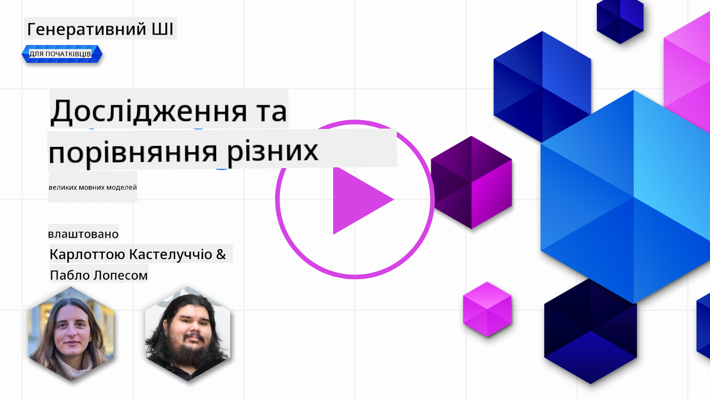](https://aka.ms/gen-ai-lesson2-gh?WT.mc_id=academic-105485-koreyst)

> _Натисніть на зображення вище, щоб переглянути відео цього уроку_

У попередньому уроці ми побачили, як генеративний ШІ змінює технологічний ландшафт, як працюють великі мовні моделі (LLM) і як бізнес — як наш стартап — може застосовувати їх для своїх кейсів і розвиватися! У цій главі ми порівнюємо різні типи великих мовних моделей (LLM), щоб зрозуміти їхні переваги та недоліки.

Наступний крок у подорожі нашого стартапу — дослідити сучасний ландшафт LLM і зрозуміти, які з них підходять для нашого кейсу.

## Вступ

У цьому уроці розглянемо:

- Різні типи LLM у сучасному ландшафті.
- Тестування, ітерації та порівняння різних моделей для вашого кейсу в Azure.
- Як розгорнути LLM.

## Цілі навчання

Після проходження цього уроку ви зможете:

- Вибрати правильну модель для вашого кейсу.
- Розуміти, як тестувати, ітерувати та покращувати продуктивність моделі.
- Знати, як бізнеси розгортають моделі.

## Розуміння різних типів LLM

LLM можна класифікувати за архітектурою, навчальними даними та сферою застосування. Розуміння цих відмінностей допоможе нашому стартапу обрати правильну модель для конкретного сценарію, а також зрозуміти, як тестувати, ітерувати та покращувати продуктивність.

Існує багато різних типів LLM, вибір моделі залежить від того, для чого ви плануєте їх використовувати, які у вас дані, скільки ви готові платити тощо.

Залежно від того, чи плануєте ви використовувати моделі для тексту, аудіо, відео, генерації зображень тощо, ви можете обрати різні типи моделей.

- **Аудіо та розпізнавання мови**. Для цього чудовим вибором є моделі типу Whisper, оскільки вони універсальні та орієнтовані на розпізнавання мови. Вони навчені на різноманітних аудіоданих і можуть виконувати багатомовне розпізнавання мови. Детальніше про [моделі типу Whisper тут](https://platform.openai.com/docs/models/whisper?WT.mc_id=academic-105485-koreyst).

- **Генерація зображень**. Для генерації зображень добре відомі DALL-E та Midjourney. DALL-E доступний через Azure OpenAI. [Детальніше про DALL-E тут](https://platform.openai.com/docs/models/dall-e?WT.mc_id=academic-105485-koreyst) та також у розділі 9 цього курсу.

- **Генерація тексту**. Більшість моделей навчені для генерації тексту, і у вас є широкий вибір — від GPT-3.5 до GPT-4. Вони мають різну вартість, при цьому GPT-4 є найдорожчим. Варто ознайомитися з [Azure OpenAI playground](https://oai.azure.com/portal/playground?WT.mc_id=academic-105485-koreyst), щоб оцінити, які моделі найкраще відповідають вашим потребам за можливостями та вартістю.

- **Мультимодальність**. Якщо ви хочете працювати з різними типами даних на вході та виході, зверніть увагу на моделі, як-от [gpt-4 turbo з візією або gpt-4o](https://learn.microsoft.com/azure/ai-services/openai/concepts/models#gpt-4-and-gpt-4-turbo-models?WT.mc_id=academic-105485-koreyst) — останні релізи моделей OpenAI, які поєднують обробку природної мови з візуальним розумінням, дозволяючи взаємодіяти через мультимодальні інтерфейси.

Вибір моделі означає отримання базових можливостей, яких іноді може бути недостатньо. Часто у вас є специфічні дані компанії, про які потрібно якось повідомити LLM. Існує кілька способів це зробити, про які ми розповімо у наступних розділах.

### Foundation Models проти LLM

Термін Foundation Model був [введений дослідниками зі Стенфорда](https://arxiv.org/abs/2108.07258?WT.mc_id=academic-105485-koreyst) і визначається як модель ШІ, що відповідає певним критеріям, таким як:

- **Вони навчені за допомогою безконтрольного або самоконтрольного навчання**, тобто на неанотованих мультимодальних даних, без потреби в людській анотації чи маркуванні даних.
- **Вони дуже великі**, базуються на глибоких нейронних мережах, навчених на мільярдах параметрів.
- **Зазвичай призначені слугувати «фундаментом» для інших моделей**, тобто можуть використовуватися як базова модель для подальшого донавчання.

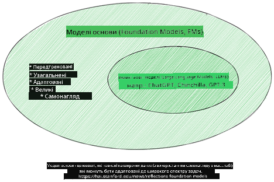

Джерело зображення: [Essential Guide to Foundation Models and Large Language Models | by Babar M Bhatti | Medium](https://thebabar.medium.com/essential-guide-to-foundation-models-and-large-language-models-27dab58f7404)

Щоб краще зрозуміти цю різницю, візьмемо ChatGPT як приклад. Для створення першої версії ChatGPT модель GPT-3.5 слугувала foundation model. Це означає, що OpenAI використала спеціалізовані дані для чатів, щоб створити налаштовану версію GPT-3.5, оптимізовану для розмовних сценаріїв, таких як чат-боти.

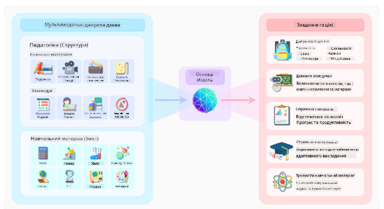

Джерело зображення: [2108.07258.pdf (arxiv.org)](https://arxiv.org/pdf/2108.07258.pdf?WT.mc_id=academic-105485-koreyst)

### Відкриті проти пропрієтарних моделей

Ще один спосіб класифікації LLM — за типом ліцензії: відкриті або пропрієтарні.

Відкриті моделі — це моделі, доступні для публіки і можуть використовуватися будь-ким. Їх часто надають компанії, що їх створили, або дослідницька спільнота. Ці моделі можна переглядати, модифікувати та адаптувати під різні кейси. Однак вони не завжди оптимізовані для виробничого використання і можуть поступатися пропрієтарним моделям за продуктивністю. Крім того, фінансування відкритих моделей може бути обмеженим, і вони не завжди підтримуються або оновлюються відповідно до останніх досліджень. Прикладами популярних відкритих моделей є [Alpaca](https://crfm.stanford.edu/2023/03/13/alpaca.html?WT.mc_id=academic-105485-koreyst), [Bloom](https://huggingface.co/bigscience/bloom) та [LLaMA](https://llama.meta.com).

Пропрієтарні моделі — це моделі, що належать компанії і не доступні публічно. Вони часто оптимізовані для виробничого використання. Однак їх не можна переглядати, модифікувати або адаптувати під різні кейси. Також вони не завжди безкоштовні і можуть вимагати підписки або оплати. Користувачі не контролюють дані, на яких навчається модель, тому повинні довіряти власнику моделі щодо дотримання конфіденційності та відповідального використання ШІ. Прикладами популярних пропрієтарних моделей є [OpenAI models](https://platform.openai.com/docs/models/overview?WT.mc_id=academic-105485-koreyst), [Google Bard](https://sapling.ai/llm/bard?WT.mc_id=academic-105485-koreyst) або [Claude 2](https://www.anthropic.com/index/claude-2?WT.mc_id=academic-105485-koreyst).

### Вбудовування (Embedding) проти генерації зображень проти генерації тексту та коду

LLM також можна класифікувати за типом вихідних даних.

Вбудовування — це моделі, які перетворюють текст у числовий формат, званий embedding, що є числовим поданням вхідного тексту. Вбудовування полегшують машинам розуміння зв’язків між словами чи реченнями і можуть використовуватися як вхідні дані для інших моделей, наприклад, класифікаційних або кластеризаційних, які краще працюють з числовими даними. Моделі вбудовування часто застосовують для трансферного навчання, коли модель навчають на допоміжному завданні з великою кількістю даних, а потім ваги (embedding) використовують для інших завдань. Приклад такої категорії — [OpenAI embeddings](https://platform.openai.com/docs/models/embeddings?WT.mc_id=academic-105485-koreyst).

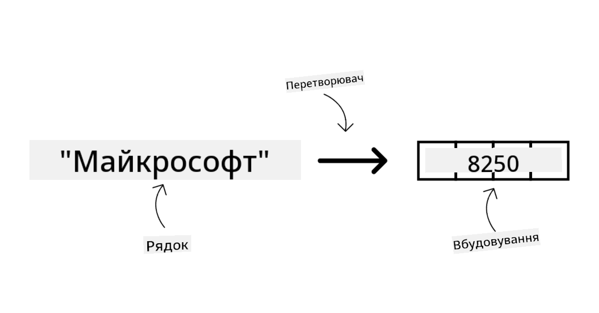

Моделі генерації зображень створюють зображення. Їх часто використовують для редагування, синтезу та трансляції зображень. Такі моделі навчаються на великих наборах зображень, наприклад, [LAION-5B](https://laion.ai/blog/laion-5b/?WT.mc_id=academic-105485-koreyst), і можуть генерувати нові зображення або редагувати існуючі за допомогою інпейнтингу, суперроздільної здатності та колоризації. Приклади: [DALL-E-3](https://openai.com/dall-e-3?WT.mc_id=academic-105485-koreyst) та [Stable Diffusion models](https://github.com/Stability-AI/StableDiffusion?WT.mc_id=academic-105485-koreyst).

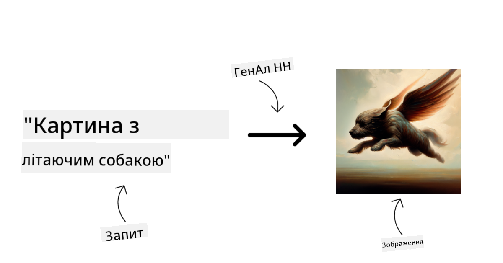

Моделі генерації тексту та коду створюють текст або код. Їх часто застосовують для підсумовування тексту, перекладу та відповіді на запитання. Моделі генерації тексту навчаються на великих текстових наборах, таких як [BookCorpus](https://www.cv-foundation.org/openaccess/content_iccv_2015/html/Zhu_Aligning_Books_and_ICCV_2015_paper.html?WT.mc_id=academic-105485-koreyst), і можуть генерувати новий текст або відповідати на запитання. Моделі генерації коду, як-от [CodeParrot](https://huggingface.co/codeparrot?WT.mc_id=academic-105485-koreyst), навчаються на великих наборах коду, наприклад, GitHub, і можуть створювати новий код або виправляти помилки в існуючому.

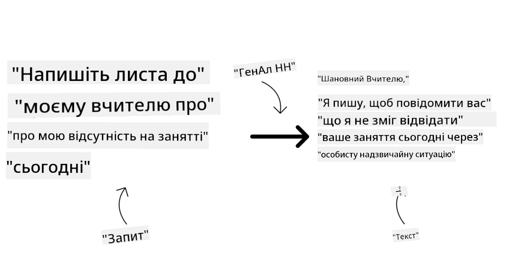

### Encoder-Decoder проти Decoder-only

Щоб пояснити різні архітектури LLM, використаємо аналогію.

Уявіть, що ваш менеджер дав вам завдання написати вікторину для студентів. У вас є двоє колег: один відповідає за створення контенту, інший — за його перевірку.

Творець контенту — це як модель типу Decoder only, він дивиться на тему і те, що ви вже написали, і створює курс на цій основі. Вони дуже добре пишуть захопливий і інформативний контент, але не дуже добре розуміють тему та навчальні цілі. Прикладами моделей Decoder є сімейство GPT, наприклад GPT-3.

Перевіряючий — це як модель типу Encoder only, він дивиться на написаний курс і відповіді, помічає зв’язки між ними та розуміє контекст, але не вміє генерувати контент. Прикладом Encoder only моделі є BERT.

Уявіть, що є хтось, хто може і створювати, і перевіряти вікторину — це модель Encoder-Decoder. Прикладами є BART і T5.

### Сервіс проти моделі

Тепер поговоримо про різницю між сервісом і моделлю. Сервіс — це продукт, який пропонує хмарний провайдер, і зазвичай це комбінація моделей, даних та інших компонентів. Модель — це основний компонент сервісу, часто foundation model, наприклад LLM.

Сервіси зазвичай оптимізовані для виробничого використання і простіші у використанні, часто через графічний інтерфейс. Однак сервіси не завжди безкоштовні і можуть вимагати підписки або оплати, натомість користувачі отримують доступ до обладнання та ресурсів власника сервісу, оптимізуючи витрати та масштабування. Приклад сервісу — [Azure OpenAI Service](https://learn.microsoft.com/azure/ai-services/openai/overview?WT.mc_id=academic-105485-koreyst), який пропонує тариф за фактом використання, тобто користувачі платять пропорційно до обсягу використання. Крім того, Azure OpenAI Service забезпечує корпоративний рівень безпеки та відповідальну рамку ШІ поверх можливостей моделей.

Моделі — це лише нейронна мережа з параметрами, вагами тощо. Компанії можуть запускати їх локально, але для цього потрібно придбати обладнання, побудувати інфраструктуру для масштабування та купити ліцензію або використовувати відкриту модель. Наприклад, модель LLaMA доступна для використання, але потребує обчислювальних ресурсів для запуску.

## Як тестувати та ітерувати різні моделі для оцінки продуктивності в Azure

Після того, як наша команда дослідила сучасний ландшафт LLM і визначила кілька підходящих кандидатів для своїх сценаріїв, наступним кроком є тестування їх на власних даних і робочому навантаженні. Це ітеративний процес, що здійснюється через експерименти та вимірювання.
Більшість моделей, які ми згадували в попередніх параграфах (моделі OpenAI, відкриті моделі, такі як Llama2, та трансформери Hugging Face), доступні в [Каталозі моделей](https://learn.microsoft.com/azure/ai-studio/how-to/model-catalog-overview?WT.mc_id=academic-105485-koreyst) у [Azure AI Studio](https://ai.azure.com/?WT.mc_id=academic-105485-koreyst).

[Azure AI Studio](https://learn.microsoft.com/azure/ai-studio/what-is-ai-studio?WT.mc_id=academic-105485-koreyst) — це хмарна платформа, створена для розробників, щоб будувати генеративні AI-додатки та керувати повним циклом розробки — від експериментів до оцінки — об’єднуючи всі сервіси Azure AI в єдиний центр із зручним графічним інтерфейсом. Каталог моделей в Azure AI Studio дозволяє користувачеві:

- Знайти потрібну Foundation Model у каталозі — власницьку або відкриту, відфільтрувавши за завданням, ліцензією чи назвою. Для зручності пошуку моделі організовані в колекції, наприклад, колекція Azure OpenAI, колекція Hugging Face та інші.

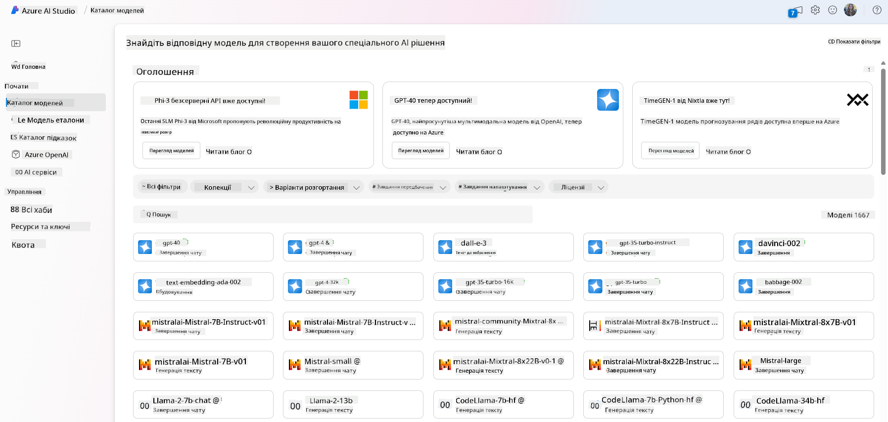

- Ознайомитись із карткою моделі, яка містить детальний опис призначення та даних для навчання, приклади коду та результати оцінювання з внутрішньої бібліотеки оцінок.

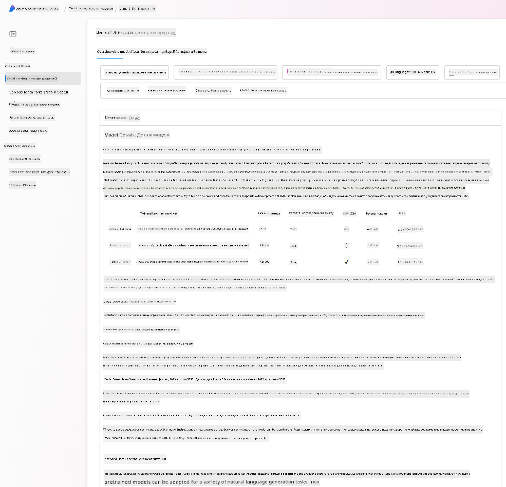

- Порівняти бенчмарки між моделями та наборами даних, доступними в індустрії, щоб визначити, яка модель найкраще підходить для бізнес-сценарію, через панель [Model Benchmarks](https://learn.microsoft.com/azure/ai-studio/how-to/model-benchmarks?WT.mc_id=academic-105485-koreyst).

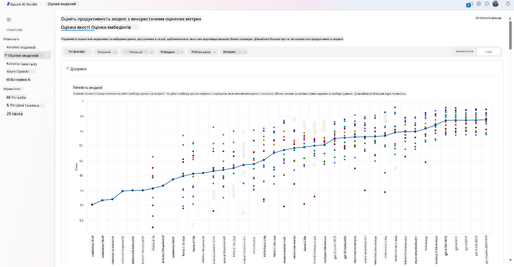

- Виконати донавчання моделі на власних даних, щоб покращити її продуктивність для конкретного навантаження, використовуючи можливості експериментування та відстеження в Azure AI Studio.

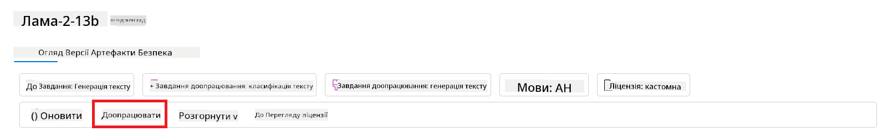

- Розгорнути оригінальну попередньо навчену модель або донавчену версію на віддаленому real-time inference — керованому обчисленні — або безсерверному API-ендпоінті — [оплата за використання](https://learn.microsoft.com/azure/ai-studio/how-to/model-catalog-overview#model-deployment-managed-compute-and-serverless-api-pay-as-you-go?WT.mc_id=academic-105485-koreyst) — щоб додатки могли її використовувати.

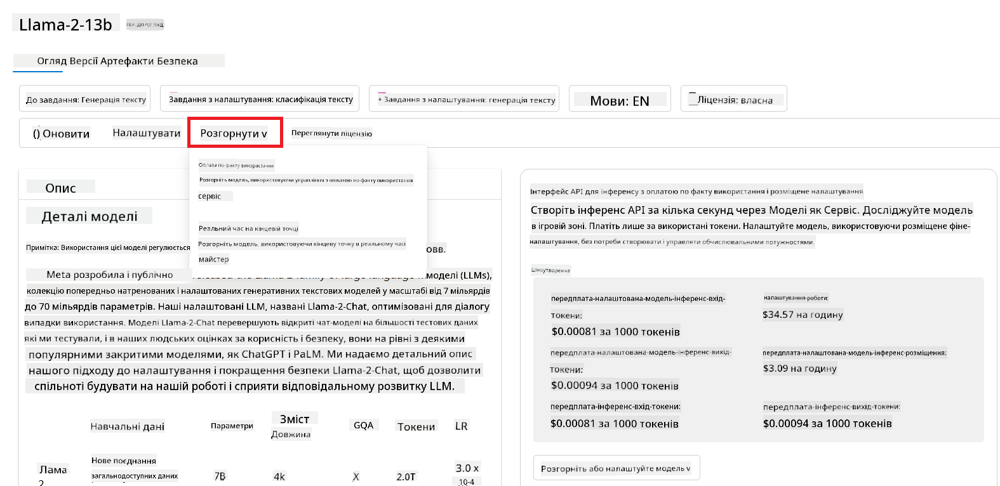

> [!NOTE]
> Не всі моделі в каталозі наразі доступні для донавчання та/або розгортання з оплатою за використання. Перевірте картку моделі для деталей про її можливості та обмеження.

## Покращення результатів LLM

Ми разом із нашою стартап-командою досліджували різні типи LLM та хмарну платформу (Azure Machine Learning), яка дозволяє порівнювати різні моделі, оцінювати їх на тестових даних, покращувати продуктивність і розгортати на inference-ендпоінтах.

Але коли варто розглядати донавчання моделі замість використання попередньо навченого варіанту? Чи існують інші підходи для покращення продуктивності моделі на конкретних завданнях?

Існує кілька підходів, які бізнес може використати, щоб отримати потрібні результати від LLM. Ви можете обирати різні типи моделей із різним ступенем навчання при розгортанні LLM у продакшн, з різним рівнем складності, вартості та якості. Ось деякі з них:

- **Prompt engineering з контекстом**. Ідея полягає в тому, щоб надати достатньо контексту під час запиту, щоб отримати потрібні відповіді.

- **Retrieval Augmented Generation, RAG**. Ваші дані можуть зберігатися в базі даних або на веб-ендпоінті, наприклад, щоб забезпечити включення цих даних або їх підмножини під час запиту, ви можете отримати релевантні дані та додати їх до запиту користувача.

- **Донавчена модель**. Тут ви додатково навчаєте модель на власних даних, що робить її більш точною та чутливою до ваших потреб, але це може бути дорого.

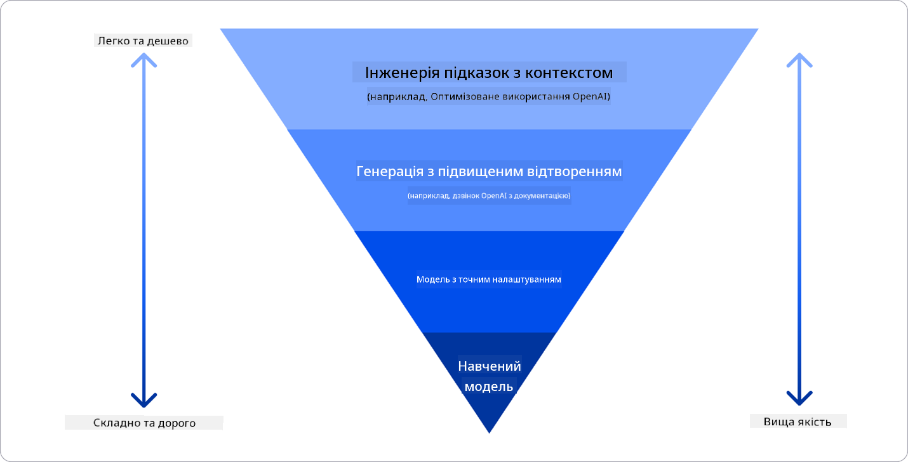

Джерело зображення: [Four Ways that Enterprises Deploy LLMs | Fiddler AI Blog](https://www.fiddler.ai/blog/four-ways-that-enterprises-deploy-llms?WT.mc_id=academic-105485-koreyst)

### Prompt Engineering з контекстом

Попередньо навчені LLM добре працюють із загальними завданнями обробки природної мови, навіть якщо викликати їх коротким запитом, наприклад, реченням для доповнення або питанням — так зване “zero-shot” навчання.

Однак, чим більше користувач може конкретизувати свій запит, надаючи детальний опис і приклади — Контекст — тим точнішою і ближчою до очікувань користувача буде відповідь. У цьому випадку говорять про “one-shot” навчання, якщо запит містить лише один приклад, і “few-shot” навчання, якщо прикладів кілька.
Prompt engineering з контекстом — це найекономніший спосіб почати роботу.

### Retrieval Augmented Generation (RAG)

LLM мають обмеження, що вони можуть використовувати лише ті дані, на яких були навчені, для генерації відповіді. Це означає, що вони не знають про події, які сталися після їхнього навчання, і не мають доступу до непублічної інформації (наприклад, даних компанії).
Це можна подолати за допомогою RAG — техніки, яка доповнює запит зовнішніми даними у вигляді фрагментів документів, враховуючи обмеження на довжину запиту. Це підтримується інструментами векторних баз даних (наприклад, [Azure Vector Search](https://learn.microsoft.com/azure/search/vector-search-overview?WT.mc_id=academic-105485-koreyst)), які витягують корисні фрагменти з різних заздалегідь визначених джерел і додають їх до контексту запиту.

Ця техніка дуже корисна, коли бізнес не має достатньо даних, часу або ресурсів для донавчання LLM, але хоче покращити продуктивність на конкретному завданні та зменшити ризики вигадок, тобто спотворення реальності або шкідливого контенту.

### Донавчена модель

Донавчання — це процес, який використовує трансферне навчання для «адаптації» моделі до конкретного завдання або проблеми. На відміну від few-shot навчання та RAG, він призводить до створення нової моделі з оновленими вагами та зміщеннями. Для цього потрібен набір навчальних прикладів, що складаються з одного вхідного запиту (prompt) та відповідного виходу (completion).
Цей підхід буде кращим, якщо:

- **Використовувати донавчені моделі**. Бізнес хоче застосовувати донавчені менш потужні моделі (наприклад, embedding-моделі) замість високопродуктивних, що дає більш економне та швидке рішення.

- **Враховувати затримку (latency)**. Затримка важлива для конкретного випадку використання, тому не можна використовувати дуже довгі запити або кількість прикладів, які модель має вивчити, не відповідає обмеженню довжини запиту.

- **Підтримувати актуальність**. Бізнес має багато якісних даних і міток істини (ground truth) та ресурси для їх постійного оновлення.

### Навчена модель

Навчання LLM з нуля — без сумніву, найскладніший і найресурсомісткий підхід, що вимагає величезних обсягів даних, кваліфікованих фахівців і потужних обчислювальних ресурсів. Цей варіант слід розглядати лише у випадку, коли бізнес має специфічне доменне завдання та великий обсяг доменно орієнтованих даних.

## Перевірка знань

Який підхід може бути хорошим для покращення результатів завершення LLM?

1. Prompt engineering з контекстом  
2. RAG  
3. Донавчена модель

Відповідь: 3, якщо у вас є час, ресурси та якісні дані, донавчання — кращий варіант для підтримки актуальності. Однак, якщо ви хочете покращити результати, але бракує часу, варто спочатку розглянути RAG.

## 🚀 Виклик

Дізнайтеся більше про те, як ви можете [використовувати RAG](https://learn.microsoft.com/azure/search/retrieval-augmented-generation-overview?WT.mc_id=academic-105485-koreyst) для свого бізнесу.

## Чудова робота, продовжуйте навчання

Після завершення цього уроку ознайомтеся з нашою [колекцією з генеративного AI](https://aka.ms/genai-collection?WT.mc_id=academic-105485-koreyst), щоб продовжувати підвищувати свої знання у сфері генеративного AI!

Перейдіть до Уроку 3, де ми розглянемо, як [відповідально працювати з генеративним AI](../03-using-generative-ai-responsibly/README.md?WT.mc_id=academic-105485-koreyst)!

**Відмова від відповідальності**:  
Цей документ було перекладено за допомогою сервісу автоматичного перекладу [Co-op Translator](https://github.com/Azure/co-op-translator). Хоча ми прагнемо до точності, будь ласка, майте на увазі, що автоматичні переклади можуть містити помилки або неточності. Оригінальний документ рідною мовою слід вважати авторитетним джерелом. Для критично важливої інформації рекомендується звертатися до професійного людського перекладу. Ми не несемо відповідальності за будь-які непорозуміння або неправильні тлумачення, що виникли внаслідок використання цього перекладу.