# Вивчення і порівняння різних LLM

[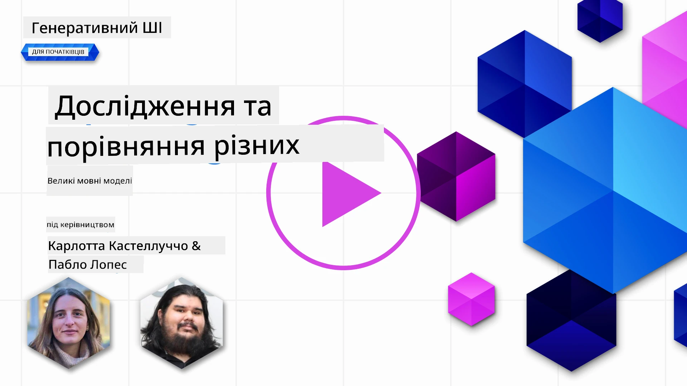](https://youtu.be/KIRUeDKscfI?si=8BHX1zvwzQBn-PlK)

> _Натисніть на зображення вище, щоб переглянути відео цього уроку_

У попередньому уроці ми побачили, як Генеративний ШІ змінює технологічний ландшафт, як працюють великі мовні моделі (LLM) і як бізнес — як наш стартап — може застосовувати їх для своїх випадків використання та розвиватися! У цьому розділі ми прагнемо порівняти різні типи великих мовних моделей (LLM), щоб зрозуміти їхні переваги та недоліки.

Наступним кроком у подорожі нашого стартапу є вивчення сучасного ландшафту LLM і розуміння, які з них підходять для нашого випадку використання.

## Вступ

У цьому уроці будуть розглянуті:

- Різні типи LLM у сучасному ландшафті.
- Тестування, ітерації та порівняння різних моделей для вашого випадку в Azure.
- Як розгорнути LLM.

## Цілі навчання

Після завершення цього уроку ви зможете:

- Вибрати правильну модель для вашого випадку використання.
- Зрозуміти, як тестувати, ітерувати і покращувати продуктивність вашої моделі.
- Знати, як бізнеси розгортають моделі.

## Розуміння різних типів LLM

LLM можна класифікувати за їх архітектурою, навчальними даними та випадками використання. Розуміння цих відмінностей допоможе нашому стартапу вибрати правильну модель для сценарію, а також зрозуміти, як тестувати, ітерувати та покращувати продуктивність.

Існує багато різних типів моделей LLM, ваш вибір моделі залежить від того, для чого ви плануєте їх використовувати, ваших даних, того, скільки ви готові заплатити, і іншого.

Залежно від того, чи плануєте ви використовувати моделі для тексту, аудіо, відео, генерації зображень тощо, ви можете обрати різні типи моделей.

- **Розпізнавання аудіо і мовлення**. Моделі стилю Whisper все ще корисні як універсальні моделі розпізнавання мовлення, але для виробництва наразі вибір також включає нові моделі speech-to-text, такі як `gpt-4o-transcribe`, `gpt-4o-mini-transcribe` та варіанти диаризації. Оцініть охоплення мов, диаризацію, підтримку в реальному часі, затримку та вартість для вашого сценарію. Дізнайтеся більше в [документації OpenAI щодо конвертації мовлення в текст](https://platform.openai.com/docs/guides/speech-to-text?WT.mc_id=academic-105485-koreyst).

- **Генерація зображень**. DALL-E і Midjourney — добре відомі опції для генерації зображень, але сучасні API OpenAI для зображень зосереджені на GPT Image моделях, таких як `gpt-image-2`, тоді як Stable Diffusion, Imagen, Flux та інші сімейства моделей також є частими виборами. Порівняйте відповідність підказці, підтримку редагування, контроль стилю, вимоги до безпеки та ліцензування. Дізнайтеся більше в [керівництві OpenAI щодо генерації зображень](https://platform.openai.com/docs/guides/images?WT.mc_id=academic-105485-koreyst) та в Розділі 9 цієї навчальної програми.

- **Генерація тексту**. Текстові моделі тепер охоплюють передові моделі, моделі для логіки, менші моделі з низькою затримкою та відкриті за вагою моделі. Сучасні приклади включають моделі OpenAI GPT-5.x, моделі Anthropic Claude 4.x, моделі Google Gemini 3.x, моделі Meta Llama 4 та моделі Mistral. Не обирайте лише за датою випуску чи ціною; порівнюйте якість виконання завдань, затримку, контекстне вікно, використання інструментів, безпеку поведінки, регіональну доступність і загальну вартість. [Каталог моделей Microsoft Foundry](https://ai.azure.com/catalog?WT.mc_id=academic-105485-koreyst) є гарним місцем для порівняння моделей, доступних в Azure.

- **Мультимодальність**. Багато сучасних моделей можуть обробляти не лише текст. Деякі приймають як вхідні дані зображення, аудіо або відео; деякі можуть викликати інструменти; а спеціалізовані моделі можуть генерувати зображення, аудіо чи відео. Наприклад, сучасні моделі OpenAI підтримують текст і зображення на вхід, моделі Gemini можуть підтримувати текст, код, зображення, аудіо та відео залежно від варіанту, а Llama 4 Scout і Maverick — це відкриті за вагою нативно мультимодальні моделі. Завжди перевіряйте кожну картку моделі на підтримку вхідних та вихідних модальностей перед побудовою навколо неї робочого процесу.

Вибір моделі означає отримання базових можливостей, але їх може бути недостатньо. Часто у вас є специфічні дані компанії, про які ви якимось чином повинні повідомити LLM. Існує декілька варіантів, як це зробити, про це буде далі в наступних розділах.

### Фундаментальні моделі проти LLM

Термін Foundation Model був [введений дослідниками Стенфордського університету](https://arxiv.org/abs/2108.07258?WT.mc_id=academic-105485-koreyst) і визначається як модель ШІ, яка відповідає певним критеріям, таким як:

- **Їх навчають за допомогою безконтрольного або самоконтрольного навчання**, що означає, що їх тренують на немаркованих мультимодальних даних, і вони не потребують ручного анотування чи маркування даних для процесу навчання.
- **Це дуже великі моделі**, побудовані на основі глибоких нейронних мереж, що тренуються на мільярдах параметрів.
- **Вони зазвичай призначені служити ‘фундаментом’ для інших моделей**, тобто їх можна використовувати як початкову точку створення інших моделей за допомогою донавчання.

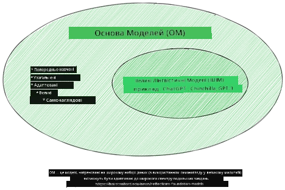

Джерело зображення: [Essential Guide to Foundation Models and Large Language Models | by Babar M Bhatti | Medium
](https://thebabar.medium.com/essential-guide-to-foundation-models-and-large-language-models-27dab58f7404)

Щоб додатково пояснити це розрізнення, візьмемо ChatGPT як історичний приклад. Ранні версії ChatGPT використовували GPT-3.5 як фундаментальну модель. OpenAI тоді використали чат-специфічні дані та техніки вирівнювання, щоб створити налаштовану версію, яка краще працює в розмовних сценаріях, таких як чат-боти. Сучасні сервіси ІІ часто переключаються між кількома варіантами моделей, тому ім’я сервісу та назва основної моделі не завжди співпадають.

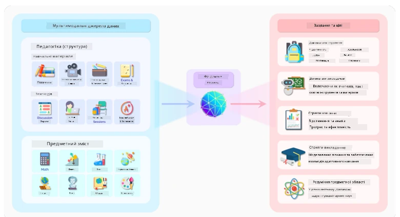

Джерело зображення: [2108.07258.pdf (arxiv.org)](https://arxiv.org/pdf/2108.07258.pdf?WT.mc_id=academic-105485-koreyst)

### Моделі з відкритою вагою/відкритим кодом проти пропрієтарних моделей

Ще один спосіб класифікувати LLM — чи є вони з відкритою вагою, відкритим кодом чи пропрієтарними.

Моделі з відкритим кодом і відкритою вагою надають артефакти моделі для перевірки, завантаження чи налаштування, але їх ліцензії різні. Деякі є повністю відкритим кодом, а інші — відкритою вагою з обмеженнями використання. Вони корисні, коли бізнес потребує більшого контролю над розгортанням, локалізацією даних, витратами чи налаштуванням. Проте командам все одно потрібно перевіряти умови ліцензії, витрати на обслуговування, оновлення безпеки та якість оцінки перед використанням у продуктиві. Приклади включають [Meta Llama 4](https://ai.meta.com/blog/llama-4-multimodal-intelligence/?WT.mc_id=academic-105485-koreyst), деякі [моделі Mistral](https://docs.mistral.ai/models/overview?WT.mc_id=academic-105485-koreyst) та багато моделей, розміщених на [Hugging Face](https://huggingface.co/models?WT.mc_id=academic-105485-koreyst).

Пропрієтарні моделі належать і хостяться провайдером. Ці моделі часто оптимізовані для керованого виробничого використання і можуть пропонувати потужну підтримку, системи безпеки, інтеграцію інструментів і масштабування. Однак клієнти зазвичай не можуть переглядати або змінювати ваги моделей і повинні вивчати умови провайдера щодо конфіденційності, зберігання, відповідності та дозволеного використання. Приклади включають [OpenAI моделі](https://platform.openai.com/docs/models?WT.mc_id=academic-105485-koreyst), [Google Gemini](https://deepmind.google/models/gemini/pro/?WT.mc_id=academic-105485-koreyst) та [Anthropic Claude](https://platform.claude.com/docs/en/about-claude/models/overview?WT.mc_id=academic-105485-koreyst).

### Вбудування проти генерації зображень проти генерації тексту і коду

LLM також можна класифікувати за типом генерації виходу.

Вбудування — це набір моделей, які можуть перетворювати текст у числову форму, так зване вбудування, яке є числовим представленням вхідного тексту. Вбудування полегшують машинам розуміння відносин між словами або реченнями і можуть використовуватись як вхідні дані для інших моделей, наприклад моделей класифікації чи кластеризації, які краще працюють із числовими даними. Моделі вбудування часто використовуються для трансферного навчання, коли модель створюється для допоміжного завдання, для якого є велика кількість даних, а потім ваги моделі (вбудування) повторно використовуються для інших завдань. Прикладом цієї категорії є [OpenAI embeddings](https://platform.openai.com/docs/models/embeddings?WT.mc_id=academic-105485-koreyst).

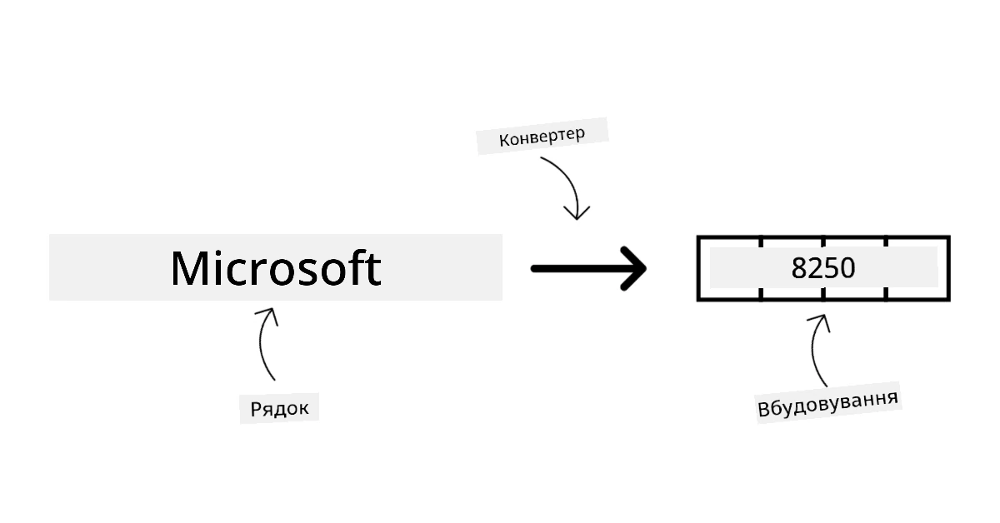

Моделі генерації зображень створюють зображення. Ці моделі часто використовують для редагування зображень, синтезу зображень та їх трансформації. Моделі генерації зображень часто навчаються на великих наборах зображень, таких як [LAION-5B](https://laion.ai/blog/laion-5b/?WT.mc_id=academic-105485-koreyst), і можуть використовуватись для створення нових зображень або редагування існуючих з допомогою технік Інпейнтингу, суперроздільної здатності та кольоризації. Прикладами є [GPT Image models](https://platform.openai.com/docs/guides/images?WT.mc_id=academic-105485-koreyst), [Stable Diffusion models](https://github.com/Stability-AI/StableDiffusion?WT.mc_id=academic-105485-koreyst) та Imagen models.

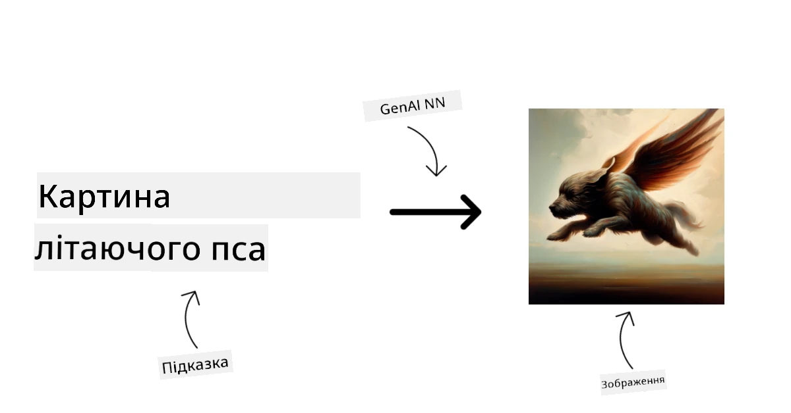

Моделі генерації тексту і коду генерують текст або код. Зазвичай їх використовують для узагальнення тексту, перекладу та відповіді на питання. Моделі генерації тексту часто тренуються на великих наборах тексту, таких як [BookCorpus](https://www.cv-foundation.org/openaccess/content_iccv_2015/html/Zhu_Aligning_Books_and_ICCV_2015_paper.html?WT.mc_id=academic-105485-koreyst), і можуть використовуватись для створення нового тексту або надання відповідей на питання. Моделі генерації коду, як-от [CodeParrot](https://huggingface.co/codeparrot?WT.mc_id=academic-105485-koreyst), зазвичай навчаються на великих наборах коду, таких як GitHub, і можуть створювати новий код або виправляти помилки в існуючому коді.

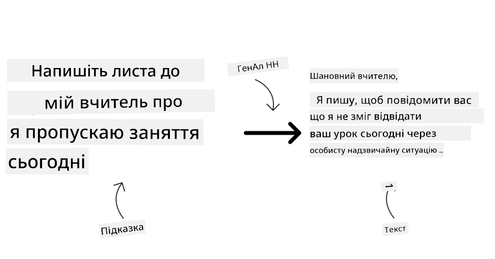

### Encoder-Decoder проти Decoder-only

Щоб пояснити різні типи архітектур LLM, використаємо аналогію.

Уявіть, що ваш менеджер дав вам завдання написати тест для студентів. У вас двоє колег; один відповідає за створення контенту, інший — за його перевірку.

Той, хто створює контент, схожий на модель лише з декодером: він може дивитися на тему, бачити, що ви вже написали, а потім продовжувати генерувати контент на основі цього контексту. Він дуже гарний у написанні цікавого та інформативного контенту, але не завжди є найкращим вибором, коли завданням є лише класифікація, пошук або кодування інформації. Прикладами сімейств моделей лише з декодером є GPT та Llama.

Той, хто перевіряє, схожий на модель лише з енкодером: він дивиться на написаний курс і відповіді, помічає взаємозв’язки між ними і розуміє контекст, але він не вміє генерувати контент. Приклад моделі лише з енкодером — BERT.

Уявіть, що у нас є хтось, хто міг би і створити, і перевірити тест, це модель Encoder-Decoder. Приклади: BART і T5.

### Сервіс проти моделі

Тепер поговоримо про різницю між сервісом і моделлю. Сервіс — це продукт, який пропонує провайдер хмарних послуг, і часто є комбінацією моделей, даних та інших компонентів. Модель — це основний компонент сервісу, зазвичай фундаментальна модель, така як LLM.

Сервіси часто оптимізовані для виробничого використання і зазвичай легші у використанні за допомогою графічного інтерфейсу. Але сервіси не завжди безкоштовні і можуть вимагати підписки чи оплати, обмінюючи це на використання обладнання та ресурсів власника сервісу, оптимізацію витрат та легке масштабування. Приклад сервісу — [Azure OpenAI Service](https://learn.microsoft.com/azure/ai-foundry/openai/overview?WT.mc_id=academic-105485-koreyst), який пропонує тарифний план pay-as-you-go, тобто користувачі платять пропорційно до використання сервісу. Azure OpenAI Service також пропонує корпоративний рівень безпеки та відповідальний фреймворк штучного інтелекту поверх можливостей моделей.

Моделі — це артефакти нейронної мережі: параметри, ваги, архітектура, токенізатор та підтримуюча конфігурація. Запуск моделі локально або у приватному середовищі вимагає відповідного обладнання, інфраструктури обслуговування, моніторингу та сумісної ліцензії з відкритим кодом/вагою або комерційної ліцензії. Моделі з відкритою вагою, такі як Llama 4 або моделі Mistral, можна розгортати самостійно, але вони все одно потребують обчислювальної потужності та операційної експертизи.

## Як тестувати і ітерувати різні моделі для розуміння продуктивності в Azure

Коли наша команда дослідила сучасний ландшафт LLM і визначила кілька хороших кандидатів для їхніх сценаріїв, наступним кроком є тестування їх на власних даних і робочому навантаженні. Це ітеративний процес, що виконується експериментами та вимірюваннями.
Більшість моделей, які ми згадували у попередніх параграфах (моделі OpenAI, моделі з відкритою вагою, такі як Llama 4 і Mistral, а також моделі Hugging Face), доступні в [Microsoft Foundry Models](https://learn.microsoft.com/azure/foundry/concepts/foundry-models-overview?WT.mc_id=academic-105485-koreyst).

[Microsoft Foundry](https://learn.microsoft.com/azure/foundry/what-is-foundry?WT.mc_id=academic-105485-koreyst), раніше Azure AI Studio/Azure AI Foundry, — це уніфікована платформа Azure для створення додатків і агентів штучного інтелекту. Вона допомагає розробникам керувати життєвим циклом від експериментування та оцінки до розгортання, моніторингу й управління. Каталог моделей у Microsoft Foundry дозволяє користувачам:

- Знайти фундаментальну модель, що цікавить, у каталозі, включно з моделями, які продає Azure, а також моделями партнерів і постачальників спільноти. Користувачі можуть відфільтрувати за завданням, постачальником, ліцензією, варіантом розгортання або назвою.

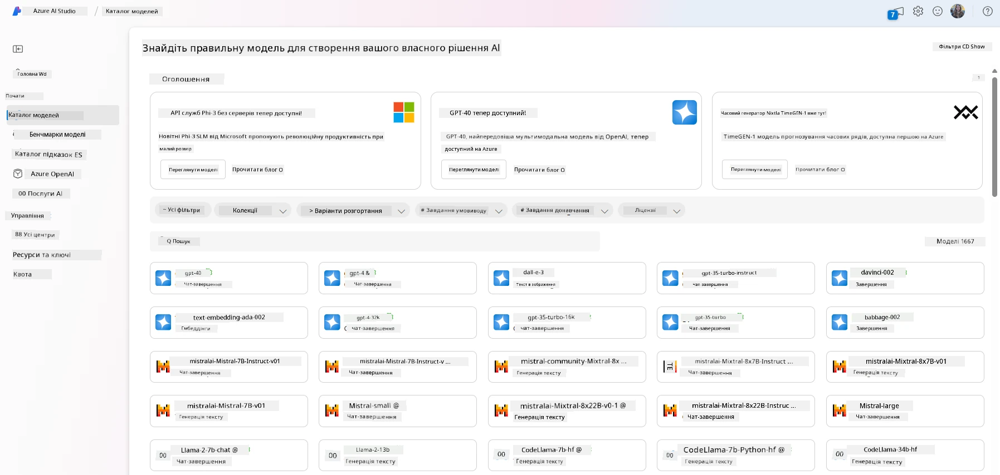

- Переглянути картку моделі, включно з детальним описом призначення та навчальних даних, прикладами коду та результатами оцінки у внутрішній бібліотеці оцінок.

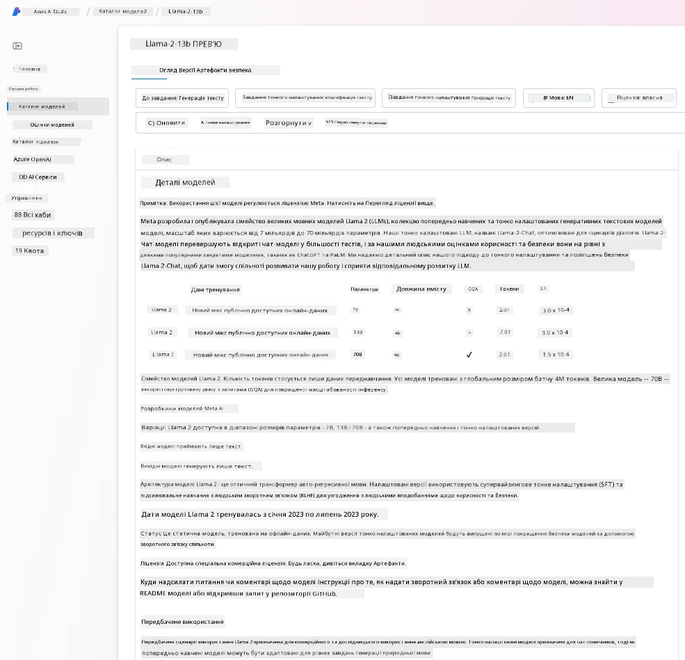

- Порівняти бенчмарки для моделей і наборів даних, доступних у галузі, щоб оцінити, яка з них краще відповідає бізнес-сценарію, через панель [Model Benchmarks](https://learn.microsoft.com/azure/ai-foundry/concepts/model-benchmarks?WT.mc_id=academic-105485-koreyst).

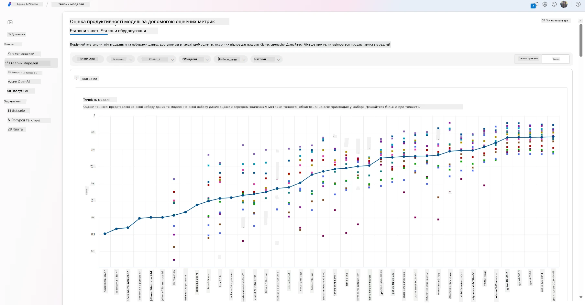

- Налаштовувати підтримувані моделі на спеціальних навчальних даних для покращення продуктивності моделі в певному робочому навантаженні, використовуючи можливості експериментування і відстеження Microsoft Foundry.

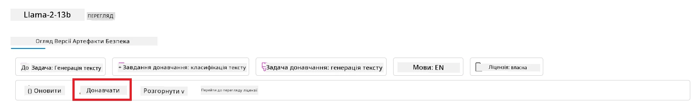

- Розгортати оригінальну попередньо навчальну модель або її налаштовану версію на віддаленому реальному часі через кінцеву точку для висновків, використовуючи керовані обчислювальні або безсерверні варіанти розгортання, щоб додатки могли її використовувати.

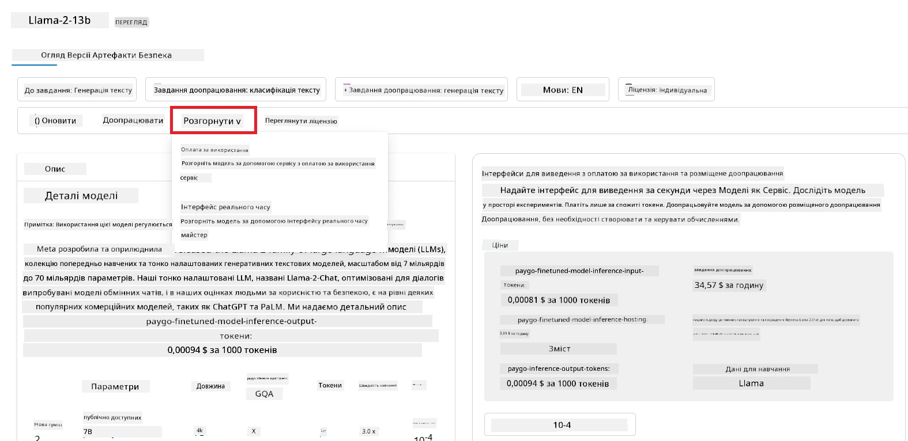

> [!NOTE]
> Не всі моделі в каталозі наразі доступні для тонкого налаштування і/або розгортання за моделлю оплати за використання. Перевірте картку моделі для деталей щодо можливостей і обмежень моделі.

## Покращення результатів LLM

Ми дослідили з командою стартапу різні види LLM і хмарну платформу (Microsoft Foundry), що дозволяє порівнювати різні моделі, оцінювати їх на тестових даних, покращувати продуктивність і розгортати на кінцевих точках для висновків.

Але коли їм варто розглянути налаштування моделі, а не використання попередньо навченої? Чи існують інші підходи для покращення продуктивності моделі на специфічних робочих навантаженнях?

Існує кілька підходів, які бізнес може використовувати, щоб отримати необхідні результати від LLM. Можна обирати різні типи моделей з різним рівнем навчання при розгортанні LLM у виробництві, з різною складністю, вартістю та якістю. Ось деякі з підходів:

- **Проектування запитів з контекстом**. Ідея полягає в тому, щоб надати достатньо контексту під час запиту, щоб забезпечити потрібні відповіді.

- **Retrieval Augmented Generation, RAG**. Ваші дані можуть зберігатися у базі даних або веб-кінцевій точці, наприклад, щоб забезпечити включення цих даних або їх частини в момент запиту, ви можете отримати релевантні дані і додати їх у запит користувача.

- **Налаштована модель**. Тут ви донавчили модель на власних даних, що призвело до більш точної і чутливої моделі до ваших потреб, але це може бути дорого.

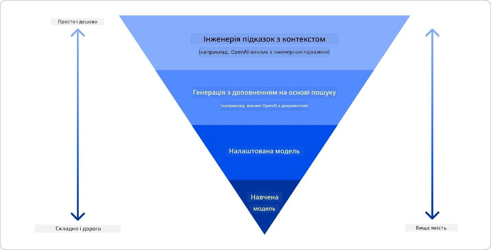

Джерело зображення: [Four Ways that Enterprises Deploy LLMs | Fiddler AI Blog](https://www.fiddler.ai/blog/four-ways-that-enterprises-deploy-llms?WT.mc_id=academic-105485-koreyst)

### Проектування запитів з контекстом

Попередньо навчені LLM дуже добре працюють із загальними завданнями обробки природної мови, навіть викликаючи їх коротким запитом, як речення для доповнення або запитання – так зване «нульовий крок» навчання.

Однак, чим більше користувач формує свій запит, з детальним запитом і прикладами – Контекстом – тим точнішою і ближчою до очікувань користувача буде відповідь. У цьому випадку ми говоримо про «одинокий» (one-shot) навчання, якщо запит містить лише один приклад, і «few shot learning», якщо кілька прикладів.
Проектування запитів з контекстом є найефективнішим з точки зору вартості підходом для початку роботи.

### Retrieval Augmented Generation (RAG)

LLM мають обмеження, що можуть використовувати лише дані, на яких їх навчали, для генерації відповіді. Це означає, що вони нічого не знають про факти, що сталися після процесу навчання, і не можуть отримувати доступ до непублічної інформації (як-от дані компанії).
Це можна подолати за допомогою RAG – техніки, що доповнює запит зовнішніми даними у вигляді шматків документів з урахуванням обмежень довжини запиту. Це підтримується інструментами векторної бази даних (як [Azure Vector Search](https://learn.microsoft.com/azure/search/vector-search-overview?WT.mc_id=academic-105485-koreyst)), які отримують корисні шматки з різних попередньо визначених джерел даних і додають їх до контексту запиту.

Ця техніка дуже допомагає, коли у бізнесу недостатньо даних, часу або ресурсів для тонкого налаштування LLM, але все ж хочеться покращити продуктивність на специфічному робочому навантаженні і знизити ризики хибних, застарілих або непідтримуваних відповідей.

### Налаштована модель

Тонке налаштування — це процес, що використовує передачу навчання для «адаптації» моделі до подальшого завдання або для розв’язання конкретної проблеми. На відміну від навчання з кількох прикладів та RAG, воно призводить до створення нової моделі з оновленими вагами та зсувами. Потрібний набір навчальних прикладів, який складається з одного входу (запиту) та відповідного виходу (завершення).
Цей підхід переважно вибирають, якщо:

- **Використання менших моделей для конкретних завдань**. Бізнес бажає налаштувати меншу модель для вузького завдання, а не багаторазово викликати більшу модель, що дає більш економне і швидке рішення.

- **Врахування затримки**. Затримка є важливою для певного випадку використання, тому неможливо використовувати дуже довгі запити або кількість прикладів, які модель має вивчити, не відповідає обмеженню довжини запиту.

- **Адаптація стійкої поведінки**. Бізнес має багато якісних прикладів і хоче, щоб модель послідовно дотримувалась шаблону завдання, формату виводу, тону або стилю, специфічного для домену. Якщо головна проблема — це свіжі факти або приватні знання, які часто змінюються, слід використовувати RAG замість покладання лише на тонке налаштування.

### Навчена модель

Навчання LLM з нуля – без сумніву, найскладніший і найвитратніший підхід, що вимагає величезної кількості даних, кваліфікованих ресурсів і відповідної обчислювальної потужності. Цей варіант слід розглядати лише у випадку, якщо бізнес має використання, специфічне для домену, і велику кількість доменно-центричних даних.

## Перевірка знань

Який підхід може бути хорошим для покращення результатів завершення LLM?

1. Проектування запитів з контекстом
1. RAG
1. Налаштована модель

В: Всі три можуть допомогти. Почніть із проектування запитів і контексту для швидких покращень, використовуйте RAG, коли моделі потрібні актуальні факти або приватні бізнес-дані. Обирайте тонке налаштування, коли маєте достатньо якісних прикладів і потрібно, щоб модель послідовно дотримувалась завдання, формату, тону чи зразка домену.

## 🚀 Виклик

Докладніше дізнайтеся, як ви можете [використовувати RAG](https://learn.microsoft.com/azure/search/retrieval-augmented-generation-overview?WT.mc_id=academic-105485-koreyst) для свого бізнесу.

## Чудова робота, продовжуйте навчання

Після завершення цього уроку ознайомтеся з нашим [збірником навчання з генеративного штучного інтелекту](https://aka.ms/genai-collection?WT.mc_id=academic-105485-koreyst), щоб продовжувати підвищувати свої знання про генеративний ШІ!

Перейдіть до уроку 3, де ми розглянемо, як [відповідально працювати з генеративним ШІ](../03-using-generative-ai-responsibly/README.md?WT.mc_id=academic-105485-koreyst)!

---

<!-- CO-OP TRANSLATOR DISCLAIMER START -->
**Відмова від відповідальності**:
Цей документ було перекладено за допомогою сервісу штучного інтелекту для перекладу [Co-op Translator](https://github.com/Azure/co-op-translator). Хоча ми прагнемо до точності, будь ласка, майте на увазі, що автоматичні переклади можуть містити помилки або неточності. Оригінальний документ рідною мовою слід вважати авторитетним джерелом. Для критично важливої інформації рекомендується професійний людський переклад. Ми не несемо відповідальності за будь-які непорозуміння або неправильні тлумачення, що виникли внаслідок використання цього перекладу.
<!-- CO-OP TRANSLATOR DISCLAIMER END -->