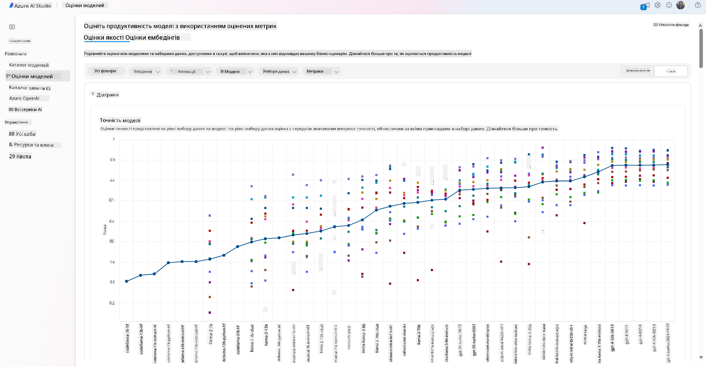
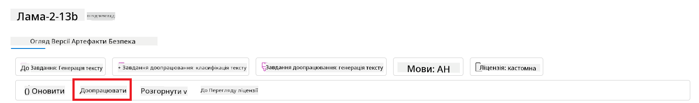
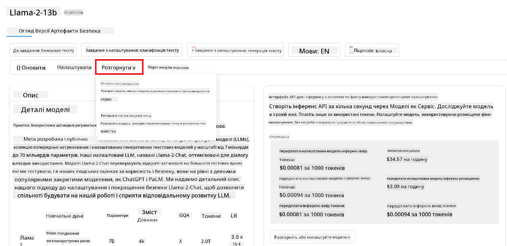
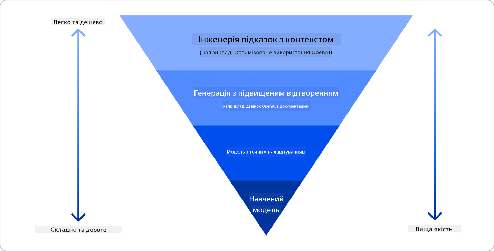

<!--
CO_OP_TRANSLATOR_METADATA:
{
  "original_hash": "e2f686f2eb794941761252ac5e8e090b",
  "translation_date": "2025-06-25T11:08:30+00:00",
  "source_file": "02-exploring-and-comparing-different-llms/README.md",
  "language_code": "uk"
}
-->
# Дослідження та порівняння різних LLM

> _Натисніть на зображення вище, щоб переглянути відео цього уроку_

У попередньому уроці ми побачили, як генеративний AI змінює технологічний ландшафт, як працюють великі мовні моделі (LLM) та як бізнес, наприклад, наш стартап, може застосувати їх до своїх випадків використання та зростати! У цьому розділі ми будемо порівнювати різні типи великих мовних моделей (LLM), щоб зрозуміти їхні переваги та недоліки.

Наступним кроком на шляху нашого стартапу є дослідження поточного ландшафту LLM та розуміння, які з них підходять для нашого випадку використання.

## Вступ

Цей урок охоплює:

- Різні типи LLM у поточному ландшафті.
- Тестування, ітерацію та порівняння різних моделей для вашого випадку використання в Azure.
- Як розгорнути LLM.

## Навчальні цілі

Після завершення цього уроку ви зможете:

- Вибрати правильну модель для вашого випадку використання.
- Зрозуміти, як тестувати, ітерувати та покращувати продуктивність вашої моделі.
- Знати, як бізнеси розгортають моделі.

## Розуміння різних типів LLM

LLM можуть мати різні категорії залежно від їхньої архітектури, навчальних даних та випадку використання. Розуміння цих відмінностей допоможе нашому стартапу вибрати правильну модель для сценарію та зрозуміти, як тестувати, ітерувати та покращувати продуктивність.

Існує багато різних типів моделей LLM, ваш вибір моделі залежить від того, для чого ви плануєте їх використовувати, ваших даних, скільки ви готові заплатити тощо.

Залежно від того, чи плануєте ви використовувати моделі для тексту, аудіо, відео, генерації зображень тощо, ви можете обрати інший тип моделі.

- **Аудіо та розпізнавання мови**. Для цієї мети моделі типу Whisper є чудовим вибором, оскільки вони загального призначення та спрямовані на розпізнавання мови. Вони навчені на різноманітному аудіо та можуть виконувати багатомовне розпізнавання мови. Дізнайтеся більше про [моделі типу Whisper тут](https://platform.openai.com/docs/models/whisper?WT.mc_id=academic-105485-koreyst).

- **Генерація зображень**. Для генерації зображень DALL-E та Midjourney є двома дуже відомими виборами. DALL-E пропонується Azure OpenAI. [Детальніше про DALL-E тут](https://platform.openai.com/docs/models/dall-e?WT.mc_id=academic-105485-koreyst) та також у розділі 9 цієї програми.

- **Генерація тексту**. Більшість моделей навчені на генерації тексту, і у вас є великий вибір від GPT-3.5 до GPT-4. Вони мають різну вартість, причому GPT-4 є найдорожчим. Варто ознайомитися з [Azure OpenAI playground](https://oai.azure.com/portal/playground?WT.mc_id=academic-105485-koreyst), щоб оцінити, які моделі найкраще відповідають вашим потребам у плані можливостей та вартості.

- **Мультимодальність**. Якщо ви шукаєте можливість обробляти різні типи даних на вході та виході, можливо, вам варто звернути увагу на моделі, такі як [gpt-4 turbo з можливістю обробки зображень або gpt-4o](https://learn.microsoft.com/azure/ai-services/openai/concepts/models#gpt-4-and-gpt-4-turbo-models?WT.mc_id=academic-105485-koreyst) - останні випуски моделей OpenAI - які здатні поєднувати обробку природної мови з візуальним розумінням, що дозволяє взаємодію через мультимодальні інтерфейси.

Вибір моделі означає, що ви отримуєте базові можливості, які, можливо, не будуть достатніми. Часто у вас є специфічні дані компанії, які якимось чином потрібно передати LLM. Існує кілька різних варіантів підходу до цього, більше про це в наступних розділах.

### Базові моделі проти LLM

Термін Базова Модель був [введений дослідниками зі Стенфорду](https://arxiv.org/abs/2108.07258?WT.mc_id=academic-105485-koreyst) і визначений як AI-модель, яка відповідає деяким критеріям, таким як:

- **Вони навчаються за допомогою неконтрольованого навчання або самонавчання**, тобто вони навчаються на ненадісланих мультимодальних даних і не потребують людської анотації або маркування даних для свого навчального процесу.
- **Вони дуже великі моделі**, засновані на дуже глибоких нейронних мережах, навчених на мільярдах параметрів.
- **Вони зазвичай призначені для служби як "основа" для інших моделей**, тобто вони можуть бути використані як відправна точка для побудови інших моделей, що може бути зроблено шляхом налаштування.

Щоб ще більше прояснити це розрізнення, візьмемо ChatGPT як приклад. Для створення першої версії ChatGPT, модель під назвою GPT-3.5 служила базовою моделлю. Це означає, що OpenAI використала деякі специфічні дані чату для створення налаштованої версії GPT-3.5, яка була спеціалізована на хорошій продуктивності в розмовних сценаріях, таких як чат-боти.

### Відкриті моделі проти власницьких моделей

Інший спосіб категоризації LLM - це чи вони відкриті чи власницькі.

Відкриті моделі - це моделі, які робляться доступними для публіки та можуть бути використані будь-ким. Вони часто робляться доступними компанією, яка їх створила, або дослідницькою спільнотою. Ці моделі дозволено перевіряти, модифікувати та налаштовувати для різних випадків використання в LLM. Однак вони не завжди оптимізовані для використання у виробництві та можуть бути менш продуктивними, ніж власницькі моделі. Крім того, фінансування відкритих моделей може бути обмеженим, і вони можуть не підтримуватися довгостроково або не оновлюватися з останніми дослідженнями. Прикладами популярних відкритих моделей є [Alpaca](https://crfm.stanford.edu/2023/03/13/alpaca.html?WT.mc_id=academic-105485-koreyst), [Bloom](https://huggingface.co/bigscience/bloom) та [LLaMA](https://llama.meta.com).

Власницькі моделі - це моделі, які належать компанії і не робляться доступними для публіки. Ці моделі часто оптимізовані для використання у виробництві. Однак їх не дозволено перевіряти, модифікувати або налаштовувати для різних випадків використання. Крім того, вони не завжди доступні безкоштовно і можуть вимагати підписки або оплати за використання. Також користувачі не мають контролю над даними, які використовуються для навчання моделі, що означає, що вони повинні довіряти власнику моделі забезпечення дотримання конфіденційності даних та відповідального використання AI. Прикладами популярних власницьких моделей є [OpenAI models](https://platform.openai.com/docs/models/overview?WT.mc_id=academic-105485-koreyst), [Google Bard](https://sapling.ai/llm/bard?WT.mc_id=academic-105485-koreyst) або [Claude 2](https://www.anthropic.com/index/claude-2?WT.mc_id=academic-105485-koreyst).

### Вбудовування проти генерації зображень проти генерації тексту та коду

LLM також можуть бути категоризовані за виходом, який вони генерують.

Вбудовування - це набір моделей, які можуть перетворювати текст у числову форму, яка називається вбудовуванням, що є числовим представленням вхідного тексту. Вбудовування полегшує машинам розуміння відносин між словами або реченнями і може бути використано як вхідні дані для інших моделей, таких як класифікаційні моделі або моделі кластеризації, які мають кращу продуктивність на числових даних. Моделі вбудовування часто використовуються для перенесення навчання, коли модель будується для сурогатного завдання, для якого є багато даних, а потім ваги моделі (вбудовування) повторно використовуються для інших завдань. Прикладом цієї категорії є [OpenAI embeddings](https://platform.openai.com/docs/models/embeddings?WT.mc_id=academic-105485-koreyst).

Моделі генерації зображень - це моделі, які генерують зображення. Ці моделі часто використовуються для редагування зображень, синтезу зображень та перекладу зображень. Моделі генерації зображень часто навчаються на великих наборах даних зображень, таких як [LAION-5B](https://laion.ai/blog/laion-5b/?WT.mc_id=academic-105485-koreyst), і можуть використовуватися для генерації нових зображень або для редагування існуючих зображень за допомогою технік малювання, суперроздільної здатності та колоризації. Прикладами є [DALL-E-3](https://openai.com/dall-e-3?WT.mc_id=academic-105485-koreyst) та [Stable Diffusion models](https://github.com/Stability-AI/StableDiffusion?WT.mc_id=academic-105485-koreyst).

Моделі генерації тексту та коду - це моделі, які генерують текст або код. Ці моделі часто використовуються для узагальнення тексту, перекладу та відповідей на запитання. Моделі генерації тексту часто навчаються на великих наборах даних тексту, таких як [BookCorpus](https://www.cv-foundation.org/openaccess/content_iccv_2015/html/Zhu_Aligning_Books_and_ICCV_2015_paper.html?WT.mc_id=academic-105485-koreyst), і можуть використовуватися для генерації нового тексту або для відповідей на запитання. Моделі генерації коду, такі як [CodeParrot](https://huggingface.co/codeparrot?WT.mc_id=academic-105485-koreyst), часто навчаються на великих наборах даних коду, таких як GitHub, і можуть використовуватися для генерації нового коду або для виправлення помилок у існуючому коді.

### Енкодер-декодер проти лише декодера

Щоб поговорити про різні типи архітектур LLM, давайте використаємо аналогію.

Уявіть, що ваш менеджер дав вам завдання написати вікторину для студентів. У вас є два колеги; один відповідає за створення контенту, а інший - за їх перегляд.

Творець контенту подібний до моделі лише декодера, вони можуть подивитися на тему і побачити, що ви вже написали, а потім вони можуть написати курс на основі цього. Вони дуже добре пишуть захоплюючий та інформативний контент, але не дуже добре розуміють тему та навчальні цілі. Деякі приклади моделей декодера - це моделі сімейства GPT, такі як GPT-3.

Рецензент подібний до моделі лише енкодера, вони дивляться на написаний курс та відповіді, помічаючи зв'язок між ними та розуміючи контекст, але вони не добрі у генерації контенту. Прикладом моделі лише енкодера є BERT.

Уявіть, що у нас також може бути хтось, хто міг би створити та переглянути вікторину, це модель енкодер-декодер. Деякі приклади - це BART та T5.

### Сервіс проти моделі

Тепер давайте поговоримо про різницю між сервісом та моделлю. Сервіс - це продукт, який пропонується постачальником хмарних послуг і зазвичай є комбінацією моделей, даних та інших компонентів. Модель - це основний компонент сервісу і зазвичай є базовою моделлю, такою як LLM.

Сервіси часто оптимізовані для використання у виробництві і часто простіші у використанні, ніж моделі, через графічний інтерфейс користувача. Однак сервіси не завжди доступні безкоштовно і можуть вимагати підписки або оплати за використання, в обмін на використання обладнання та ресурсів власника сервісу, оптимізацію витрат та легке масштабування. Прикладом сервісу є [Azure OpenAI Service](https://learn.microsoft.com/azure/ai-services/openai/overview?WT.mc_id=academic-105485-koreyst), який пропонує тарифний план "плати за використання", тобто користувачі оплачують пропорційно до того, скільки вони використовують сервіс. Також, Azure OpenAI Service пропонує корпоративну безпеку та відповідальну AI-рамку поверх можливостей моделей.

Моделі - це просто нейронна мережа з параметрами, вагами та іншими елементами. Це дозволяє компаніям запускати їх локально, однак, потрібно буде купити обладнання, побудувати структуру для масштабування та купити ліцензію або використовувати відкриту модель. Модель, така як LLaMA, доступна для використання, вимагаючи обчислювальної потужності для запуску моделі.

## Як тестувати та ітерувати з різними моделями для розуміння продуктивності на Azure

Коли наша команда дослідила поточний ландшафт LLM і визначила кілька хороших кандидатів для своїх сценаріїв, наступним кроком є тестування їх на своїх даних та робочому навантаженні. Це ітераційний процес, що виконується шляхом експериментів та вимірювань. Більшість моделей, які ми згадували в попередніх параграфах (моделі OpenAI, відкриті моделі, такі як Llama2, та перетворювачі Hugging Face), доступні в [Каталозі моделей](https://learn.microsoft.com/azure/ai-studio/how-to/model-catalog-overview?WT.mc_id=academic-105485-koreyst) у [Azure AI Studio](https://ai.azure.com/?WT.mc_id=academic-105485-koreyst).

[Azure AI Studio](https://learn.microsoft.com/azure/ai-studio/what-is-ai-studio?WT.mc_id=academic-105485-koreyst) - це хмарна платформа, розроблена для розробників, щоб будувати генеративні AI-додатки та керувати всім життєвим циклом розробки - від експериментування до оцінки - об'єднуючи всі служби Azure AI в одному центрі з зручним графічним інтерфейсом користувача. Каталог моделей в Azure AI Studio дозволяє користувачеві:

- Знайти базову модель, що цікавить, у каталозі - або власницьку, або відкриту, фільтруючи за завданням, ліцензією або назвою. Для покращення пошуку моделі організовані в колекції, такі як колекція Azure OpenAI, колекція Hugging Face тощо.

- Переглянути карту моделі, включаючи детальний опис передбачуваного використання та навчальних даних, зразки коду та результати оцінки у внутрішній бібліотеці оцінок.
- Порівнюйте еталонні показники моделей та наборів даних, доступних в індустрії, щоб оцінити, яка з них відповідає бізнес-сценарію, через панель [Model Benchmarks](https://learn.microsoft.com/azure/ai-studio/how-to/model-benchmarks?WT.mc_id=academic-105485-koreyst).

- Налаштовуйте модель на основі спеціальних навчальних даних, щоб покращити її продуктивність у конкретному робочому навантаженні, використовуючи можливості експериментування та відстеження Azure AI Studio.

- Розгорніть оригінальну попередньо навчену модель або версію з тонким налаштуванням для віддаленого реального часу прогнозування - керовані обчислення - або безсерверного API кінцевої точки - [оплата по мірі використання](https://learn.microsoft.com/azure/ai-studio/how-to/model-catalog-overview#model-deployment-managed-compute-and-serverless-api-pay-as-you-go?WT.mc_id=academic-105485-koreyst) - щоб додатки могли її використовувати.

> [!NOTE]
> Не всі моделі в каталозі наразі доступні для тонкого налаштування та/або розгортання за схемою оплати по мірі використання. Перевірте картку моделі для отримання інформації про її можливості та обмеження.

## Покращення результатів LLM

Ми дослідили з нашою командою стартапу різні типи LLM і хмарну платформу (Azure Machine Learning), що дозволяє нам порівнювати різні моделі, оцінювати їх на тестових даних, покращувати продуктивність і розгортати їх на кінцевих точках прогнозування.

Але коли варто розглядати можливість тонкого налаштування моделі замість використання попередньо навченої? Чи є інші підходи для покращення продуктивності моделі в конкретних робочих навантаженнях?

Існує кілька підходів, які бізнес може використовувати, щоб отримати потрібні результати від LLM. Ви можете вибрати різні типи моделей з різними ступенями навчання під час розгортання LLM у виробництві, з різними рівнями складності, вартості та якості. Ось деякі різні підходи:

- **Інженерія підказок з контекстом**. Ідея полягає в тому, щоб надати достатньо контексту, коли ви надаєте підказку, щоб забезпечити отримання потрібних відповідей.

- **Збагачена генерація з отриманням, RAG**. Ваші дані можуть існувати в базі даних або на веб-кінечній точці, наприклад, щоб забезпечити включення цих даних або їх підмножини під час надання підказки, ви можете отримати відповідні дані і зробити їх частиною підказки користувача.

- **Тонко налаштована модель**. Тут ви додатково навчали модель на своїх даних, що привело до того, що модель стала більш точною і відповідною вашим потребам, але може бути дорогою.

Джерело зображення: [Чотири способи, якими підприємства розгортають LLM | Fiddler AI Blog](https://www.fiddler.ai/blog/four-ways-that-enterprises-deploy-llms?WT.mc_id=academic-105485-koreyst)

### Інженерія підказок з контекстом

Попередньо навчені LLM дуже добре працюють на узагальнених завданнях природної мови, навіть коли їх викликають з короткою підказкою, наприклад, реченням для завершення або питанням – так зване "нульове навчання".

Однак, чим більше користувач може сформулювати свій запит з детальним запитом і прикладами – Контекст – тим точнішою і ближчою до очікувань користувача буде відповідь. У цьому випадку ми говоримо про "одноразове навчання", якщо підказка містить лише один приклад, і "кількаразове навчання", якщо вона містить кілька прикладів. Інженерія підказок з контекстом є найбільш економічно ефективним підходом для початку роботи.

### Збагачена генерація з отриманням (RAG)

LLM мають обмеження, що вони можуть використовувати лише дані, які були використані під час їх навчання, щоб згенерувати відповідь. Це означає, що вони не знають нічого про факти, що сталися після процесу їх навчання, і не можуть отримати доступ до непублічної інформації (наприклад, даних компанії). Це можна подолати за допомогою RAG, техніки, яка доповнює підказку зовнішніми даними у вигляді фрагментів документів, враховуючи обмеження довжини підказки. Це підтримується інструментами векторної бази даних (як [Azure Vector Search](https://learn.microsoft.com/azure/search/vector-search-overview?WT.mc_id=academic-105485-koreyst)), які отримують корисні фрагменти з різноманітних заздалегідь визначених джерел даних і додають їх до Контексту підказки.

Ця техніка дуже корисна, коли у бізнесу немає достатньо даних, часу або ресурсів для тонкого налаштування LLM, але все ще є бажання покращити продуктивність у конкретному робочому навантаженні і зменшити ризики вигадок, тобто містифікації реальності або шкідливого контенту.

### Тонко налаштована модель

Тонке налаштування – це процес, який використовує трансферне навчання для "адаптації" моделі до задачі низхідного потоку або для вирішення конкретної проблеми. На відміну від кількаразового навчання та RAG, це призводить до створення нової моделі з оновленими вагами та зміщеннями. Це вимагає набору навчальних прикладів, що складаються з одного вхідного (підказка) та пов’язаного з ним виходу (завершення). Це буде кращим підходом, якщо:

- **Використання тонко налаштованих моделей**. Бізнес хотів би використовувати тонко налаштовані менш потужні моделі (наприклад, моделі вбудовування), а не високопродуктивні моделі, що призводить до більш економічно ефективного і швидкого рішення.

- **Розгляд затримки**. Затримка важлива для конкретного випадку використання, тому неможливо використовувати дуже довгі підказки або кількість прикладів, які повинні бути вивчені моделлю, не відповідає обмеженню довжини підказки.

- **Залишатися в курсі**. У бізнесу є багато високоякісних даних і еталонних міток, а також ресурси, необхідні для підтримки цих даних в актуальному стані з часом.

### Навчена модель

Навчання LLM з нуля без сумніву є найскладнішим і найскладнішим підходом, який вимагає величезних обсягів даних, кваліфікованих ресурсів і відповідної обчислювальної потужності. Цей варіант слід розглядати лише в сценарії, коли у бізнесу є специфічний для домену випадок використання і велика кількість доменно-центричних даних.

## Перевірка знань

Який підхід може бути хорошим для покращення результатів завершення LLM?

1. Інженерія підказок з контекстом
1. RAG
1. Тонко налаштована модель

A:3, якщо у вас є час і ресурси та високоякісні дані, тонке налаштування є кращим варіантом, щоб залишатися в курсі. Однак, якщо ви намагаєтеся покращити ситуацію і вам не вистачає часу, варто спочатку розглянути RAG.

## 🚀 Виклик

Дізнайтеся більше про те, як ви можете [використовувати RAG](https://learn.microsoft.com/azure/search/retrieval-augmented-generation-overview?WT.mc_id=academic-105485-koreyst) для вашого бізнесу.

## Відмінна робота, продовжуйте навчання

Після завершення цього уроку перегляньте нашу [колекцію навчальних матеріалів з генеративного AI](https://aka.ms/genai-collection?WT.mc_id=academic-105485-koreyst), щоб продовжувати підвищувати свої знання в області генеративного AI!

Перейдіть до Уроку 3, де ми розглянемо, як [відповідально працювати з генеративним AI](../03-using-generative-ai-responsibly/README.md?WT.mc_id=academic-105485-koreyst)!

**Відмова від відповідальності**:  
Цей документ був перекладений за допомогою сервісу автоматичного перекладу [Co-op Translator](https://github.com/Azure/co-op-translator). Хоча ми прагнемо до точності, зверніть увагу, що автоматизовані переклади можуть містити помилки або неточності. Оригінальний документ на його рідній мові слід вважати авторитетним джерелом. Для критично важливої інформації рекомендується професійний людський переклад. Ми не несемо відповідальності за будь-які непорозуміння або неправильні тлумачення, що виникають у результаті використання цього перекладу.