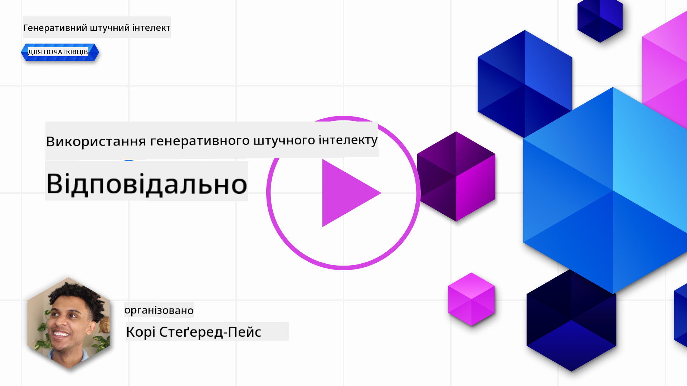
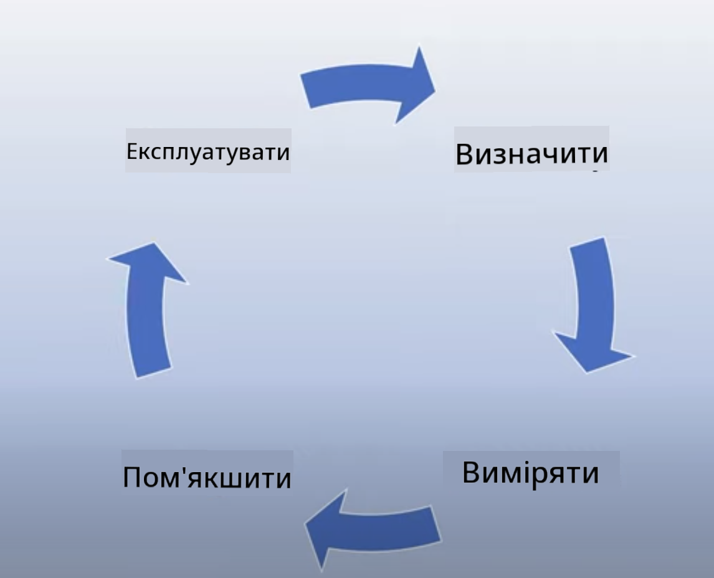
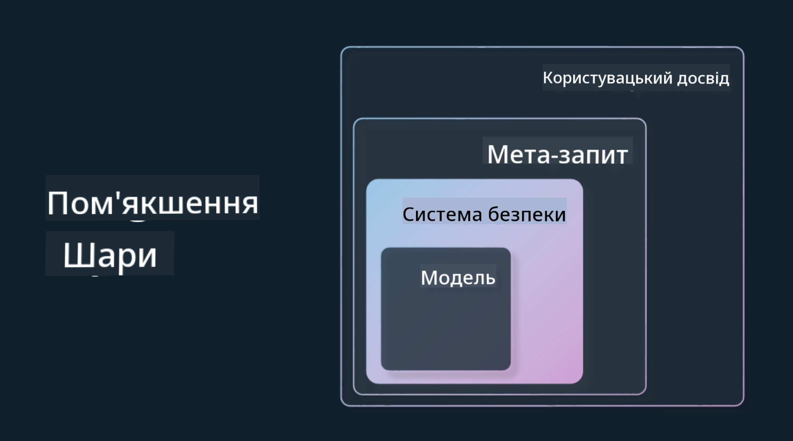

<!--
CO_OP_TRANSLATOR_METADATA:
{
  "original_hash": "7f8f4c11f8c1cb6e1794442dead414ea",
  "translation_date": "2025-07-09T09:06:04+00:00",
  "source_file": "03-using-generative-ai-responsibly/README.md",
  "language_code": "uk"
}
-->
# Відповідальне використання генеративного ШІ

> _Натисніть на зображення вище, щоб переглянути відео цього уроку_

Легко захопитися ШІ, особливо генеративним ШІ, але важливо подумати, як використовувати його відповідально. Потрібно враховувати, як забезпечити справедливість, безпеку та інші аспекти результатів. Цей розділ має на меті надати контекст, на що звертати увагу та як активно покращувати використання ШІ.

## Вступ

У цьому уроці розглянемо:

- Чому варто ставити пріоритет на Відповідальний ШІ при створенні генеративних ШІ-додатків.
- Основні принципи Відповідального ШІ та їхній зв’язок із генеративним ШІ.
- Як застосувати ці принципи на практиці через стратегії та інструменти.

## Цілі навчання

Після проходження уроку ви дізнаєтеся:

- Чому Відповідальний ШІ важливий при створенні генеративних ШІ-додатків.
- Коли і як застосовувати основні принципи Відповідального ШІ у роботі з генеративним ШІ.
- Які інструменти та стратегії допоможуть впровадити концепцію Відповідального ШІ на практиці.

## Принципи Відповідального ШІ

Зацікавленість генеративним ШІ ніколи не була такою високою. Це привернуло багато нових розробників, уваги та фінансування. Хоча це позитивно для тих, хто створює продукти та компанії на основі генеративного ШІ, важливо рухатися відповідально.

У цьому курсі ми зосереджуємося на створенні нашого стартапу та освітнього продукту з ШІ. Ми використовуємо принципи Відповідального ШІ: Справедливість, Інклюзивність, Надійність/Безпека, Захист і Конфіденційність, Прозорість та Відповідальність. Розглянемо, як ці принципи пов’язані з використанням генеративного ШІ у наших продуктах.

## Чому варто ставити пріоритет на Відповідальний ШІ

При створенні продукту орієнтація на людину та інтереси користувача дає найкращі результати.

Унікальність генеративного ШІ полягає в його здатності створювати корисні відповіді, інформацію, поради та контент для користувачів. Це можна зробити без багатьох ручних кроків, що дає вражаючі результати. Але без належного планування та стратегій це може призвести до шкідливих наслідків для користувачів, продукту та суспільства загалом.

Розглянемо деякі (але не всі) потенційно шкідливі наслідки:

### Галюцинації

Галюцинації — це термін, який описує випадки, коли LLM генерує контент, що є повністю безглуздим або фактично неправильним на основі інших джерел інформації.

Наприклад, у нашому стартапі ми створюємо функцію, що дозволяє студентам ставити історичні питання моделі. Студент запитує: `Хто був єдиним вижившим на Титаніку?`

Модель дає відповідь, як на зображенні нижче:

> _(Джерело: [Flying bisons](https://flyingbisons.com?WT.mc_id=academic-105485-koreyst))_

Це дуже впевнена і детальна відповідь. На жаль, вона неправильна. Навіть мінімальне дослідження покаже, що виживших на Титаніку було більше одного. Для студента, який тільки починає вивчати цю тему, така відповідь може здатися переконливою і сприйматися як факт. Це може зробити систему ШІ ненадійною і негативно вплинути на репутацію нашого стартапу.

З кожним новим поколінням LLM ми бачимо покращення у зменшенні галюцинацій. Але навіть з цим покращенням розробники та користувачі повинні усвідомлювати ці обмеження.

### Шкідливий контент

У попередньому розділі ми розглянули випадки, коли LLM генерує неправильні або безглузді відповіді. Інший ризик — це коли модель відповідає шкідливим контентом.

Шкідливий контент можна визначити як:

- Надання інструкцій або заохочення до самошкодження чи шкоди певним групам.
- Ненависницький або принизливий контент.
- Планування будь-яких атак або насильницьких дій.
- Інструкції щодо пошуку незаконного контенту або вчинення злочинів.
- Показ сексуально відвертого контенту.

Для нашого стартапу важливо мати правильні інструменти та стратегії, щоб запобігти появі такого контенту для студентів.

### Відсутність справедливості

Справедливість означає «забезпечення відсутності упереджень і дискримінації в системі ШІ, а також рівне і справедливе ставлення до всіх». У світі генеративного ШІ ми хочемо гарантувати, що виключні світогляди маргіналізованих груп не посилюються через результати моделі.

Такі результати не лише руйнують позитивний досвід користувачів, а й завдають шкоди суспільству. Розробники повинні завжди пам’ятати про широку та різноманітну аудиторію при створенні рішень на основі генеративного ШІ.

## Як відповідально використовувати генеративний ШІ

Тепер, коли ми визначили важливість Відповідального генеративного ШІ, розглянемо 4 кроки для відповідального створення ШІ-рішень:

### Вимірюйте потенційні шкоди

У тестуванні програмного забезпечення ми перевіряємо очікувані дії користувача. Аналогічно, тестування різноманітних запитів, які користувачі найімовірніше використовуватимуть, допомагає оцінити потенційну шкоду.

Оскільки наш стартап створює освітній продукт, варто підготувати список запитів, пов’язаних з освітою. Це можуть бути питання з певних предметів, історичні факти або теми студентського життя.

### Пом’якшення потенційних шкод

Настав час знайти способи запобігти або обмежити потенційну шкоду від моделі та її відповідей. Розглянемо це на 4 рівнях:

- **Модель**. Вибір правильної моделі для конкретного випадку використання. Великі та складні моделі, як GPT-4, можуть нести більший ризик шкідливого контенту при застосуванні у вузьких сферах. Навчання на власних даних також знижує ризик шкідливого контенту.

- **Система безпеки**. Це набір інструментів і налаштувань на платформі, що обслуговує модель, які допомагають зменшити шкоду. Наприклад, система фільтрації контенту в Azure OpenAI. Системи також мають виявляти атаки на обхід обмежень і небажану активність, як-от запити від ботів.

- **Метазапит**. Метазапити та заземлення — це способи спрямувати або обмежити модель на основі певних поведінкових правил і інформації. Це може бути використання системних вхідних даних для визначення меж моделі. Також — надання відповідей, більш релевантних до сфери чи домену системи.

Можна також застосовувати техніки, як Retrieval Augmented Generation (RAG), щоб модель брала інформацію лише з обраних надійних джерел. У цьому курсі є урок про [створення пошукових додатків](../08-building-search-applications/README.md?WT.mc_id=academic-105485-koreyst).

- **Користувацький досвід**. Останній рівень — це взаємодія користувача з моделлю через інтерфейс нашого додатку. Тут ми можемо спроектувати UI/UX так, щоб обмежити типи запитів, які користувач може надсилати, а також текст чи зображення, що відображаються. При запуску ШІ-додатку важливо бути прозорими щодо можливостей і обмежень генеративного ШІ.

Ми маємо окремий урок про [Проєктування UX для ШІ-додатків](../12-designing-ux-for-ai-applications/README.md?WT.mc_id=academic-105485-koreyst).

- **Оцінка моделі**. Робота з LLM складна, бо ми не завжди контролюємо дані, на яких модель навчалася. Проте завжди потрібно оцінювати продуктивність і результати моделі. Важливо вимірювати точність, схожість, обґрунтованість і релевантність відповідей. Це допомагає забезпечити прозорість і довіру користувачів та зацікавлених сторін.

### Керування відповідальним генеративним ШІ-рішенням

Створення операційної практики навколо ваших ШІ-додатків — це останній етап. Він включає співпрацю з іншими відділами стартапу, як-от юридичним і безпекою, щоб дотримуватися всіх нормативних вимог. Перед запуском також потрібно розробити плани доставки, реагування на інциденти та відкату, щоб запобігти шкоді користувачам.

## Інструменти

Хоча розробка Відповідальних ШІ-рішень може здаватися складною, це варта зусиль робота. З розвитком генеративного ШІ з’являтиметься більше інструментів, які допоможуть розробникам ефективно інтегрувати відповідальність у робочі процеси. Наприклад, [Azure AI Content Safety](https://learn.microsoft.com/azure/ai-services/content-safety/overview?WT.mc_id=academic-105485-koreyst) допомагає виявляти шкідливий контент і зображення через API-запити.

## Перевірка знань

Що потрібно враховувати, щоб забезпечити відповідальне використання ШІ?

1. Щоб відповідь була правильною.  
2. Щоб ШІ не використовувався у злочинних цілях.  
3. Щоб ШІ був вільним від упереджень і дискримінації.

Відповідь: правильні пункти 2 і 3. Відповідальний ШІ допомагає враховувати, як пом’якшувати шкідливі наслідки, упередження та інше.

## 🚀 Виклик

Ознайомтеся з [Azure AI Content Safety](https://learn.microsoft.com/azure/ai-services/content-safety/overview?WT.mc_id=academic-105485-koreyst) і подивіться, що можна застосувати у вашій роботі.

## Чудова робота, продовжуйте навчання

Після проходження цього уроку перегляньте нашу [колекцію навчання з генеративного ШІ](https://aka.ms/genai-collection?WT.mc_id=academic-105485-koreyst), щоб продовжити підвищувати свої знання!

Перейдіть до уроку 4, де ми розглянемо [Основи створення запитів (Prompt Engineering)](../04-prompt-engineering-fundamentals/README.md?WT.mc_id=academic-105485-koreyst)!

**Відмова від відповідальності**:  
Цей документ було перекладено за допомогою сервісу автоматичного перекладу [Co-op Translator](https://github.com/Azure/co-op-translator). Хоча ми прагнемо до точності, будь ласка, майте на увазі, що автоматичні переклади можуть містити помилки або неточності. Оригінальний документ рідною мовою слід вважати авторитетним джерелом. Для критично важливої інформації рекомендується звертатися до професійного людського перекладу. Ми не несемо відповідальності за будь-які непорозуміння або неправильні тлумачення, що виникли внаслідок використання цього перекладу.