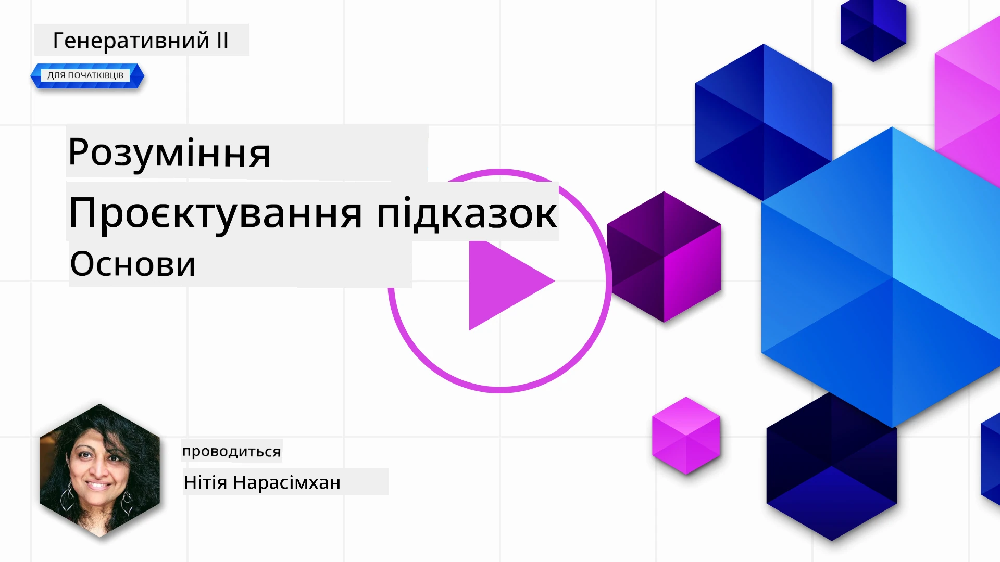
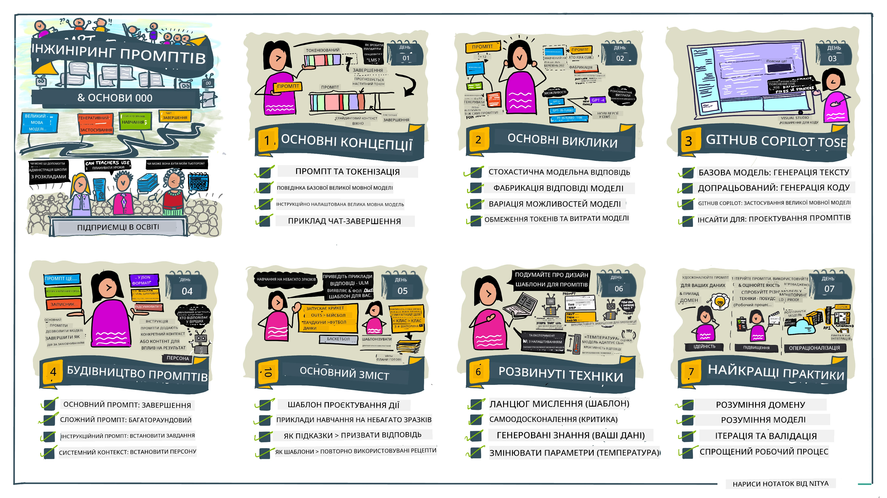
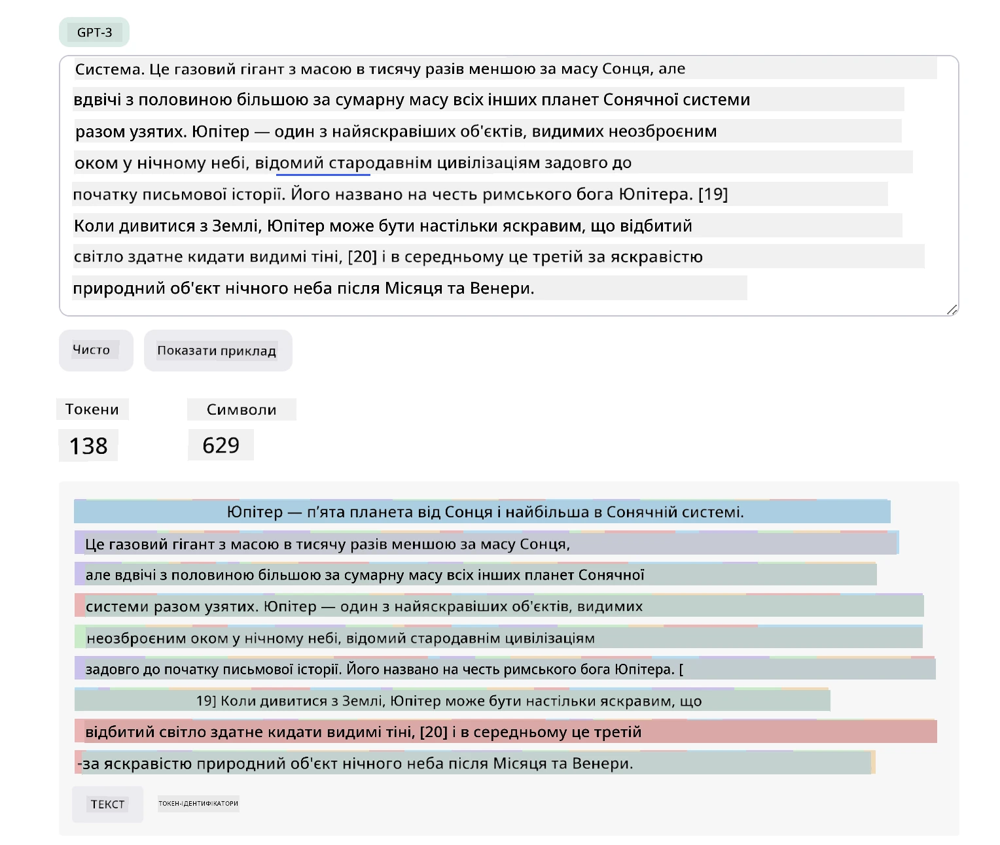
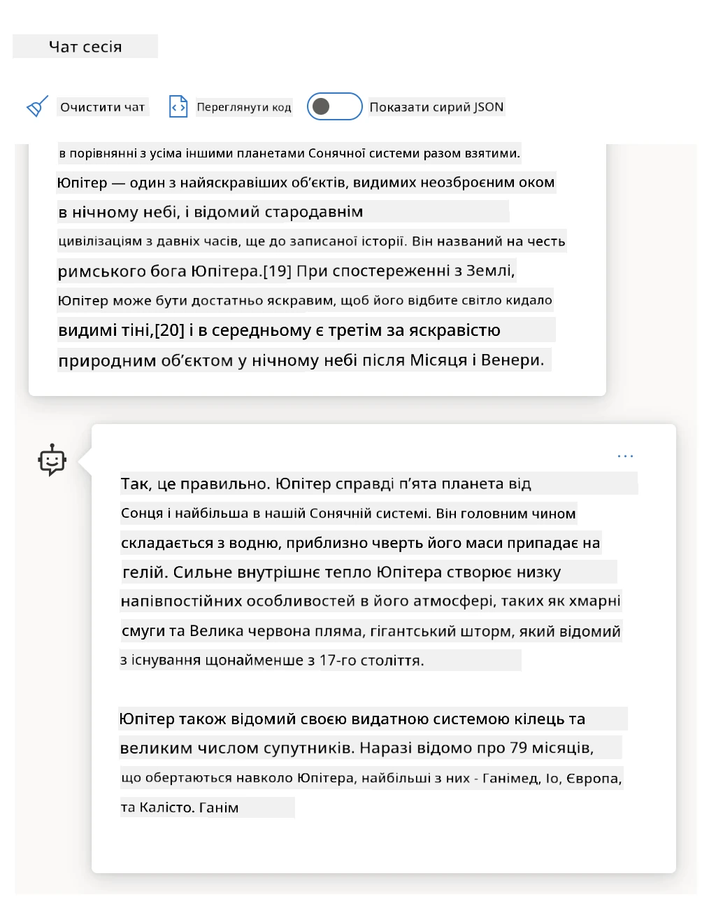
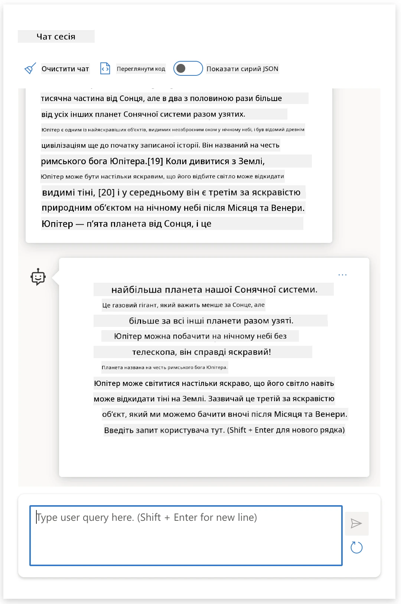
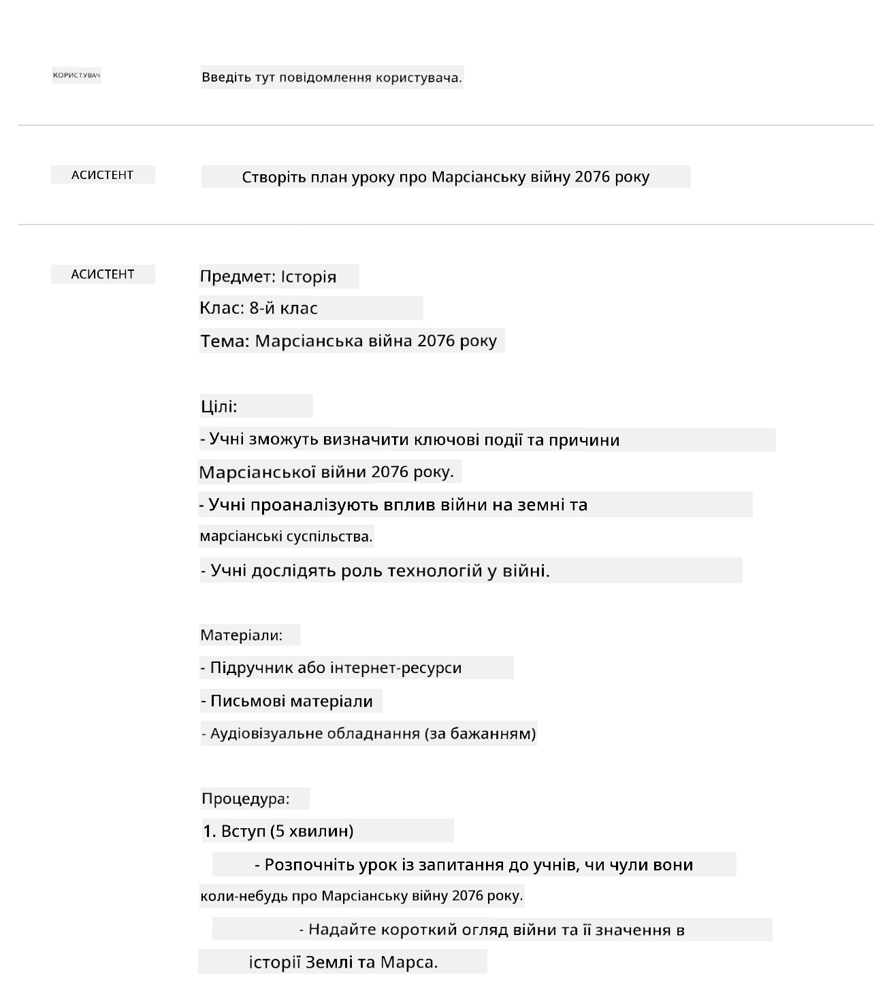
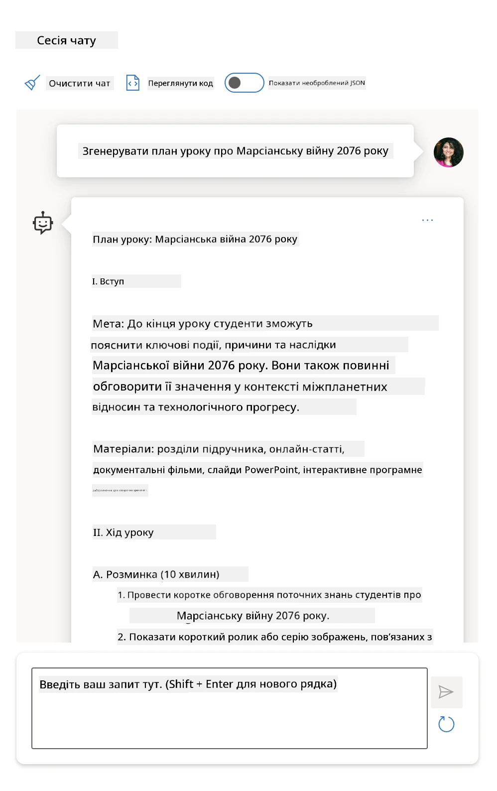
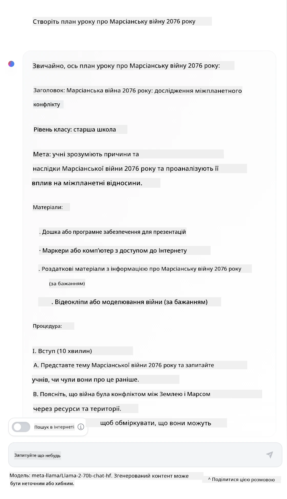

# Основи проектування промптів

[](https://youtu.be/GElCu2kUlRs?si=qrXsBvXnCW12epb8)

## Вступ
Цей модуль охоплює основні поняття та методи створення ефективних промптів для генеративних моделей ШІ. Важливо, як ви формулюєте свій промпт для LLM. Ретельно складений промпт може забезпечити кращу якість відповіді. Але що саме означають терміни _промпт_ і _інженерія промптів_? І як покращити _вхідний_ промпт, який я надсилаю LLM? Саме на ці питання ми спробуємо відповісти в цій та наступній главі.

_Генеративний ШІ_ здатен створювати новий контент (наприклад, текст, зображення, аудіо, код тощо) у відповідь на запити користувача. Це досягається за допомогою _Великих мовних моделей_ (Large Language Models, LLM), таких як серія GPT від OpenAI ("Generative Pre-trained Transformer"), що навчені працювати з природною мовою та кодом.

Користувачі тепер можуть взаємодіяти з цими моделями у звичних форматах, таких як чат, не потребуючи технічних знань або навчання. Моделі є _промпт-залежними_ — користувачі надсилають текстовий вхід (промпт) і отримують у відповідь відповідь ШІ (завершення). Вони можуть "спілкуватися з ШІ" ітеративно, у багатокрокових розмовах, удосконалюючи свій промпт поки відповідь не відповідатиме очікуванням.

Тепер "промпти" стають основним _інтерфейсом програмування_ для додатків генеративного ШІ, вказуючи моделям, що робити, та впливаючи на якість отриманих відповідей. "Інженерія промптів" — це швидкозростаюча галузь, яка зосереджена на _проектуванні та оптимізації_ промптів для досягнення послідовних і якісних відповідей у масштабах.

## Цілі навчання

У цьому уроці ми дізнаємось, що таке інженерія промптів, чому це важливо, і як створювати більш ефективні промпти для певної моделі та цілі застосування. Ми зрозуміємо основні поняття та найкращі практики інженерії промптів — та ознайомимось із інтерактивним середовищем Jupyter Notebooks, де можна побачити застосування цих концепцій на реальних прикладах.

Наприкінці уроку ми зможемо:

1. Пояснити, що таке інженерія промптів і чому це важливо.
2. Описати компоненти промпта та як вони використовуються.
3. Вивчити найкращі практики та методи інженерії промптів.
4. Застосувати вивчені методи на реальних прикладах, використовуючи кінцеву точку OpenAI.

## Ключові терміни

Інженерія промптів: Практика розробки та вдосконалення вхідних даних, щоб направити моделі ШІ на створення бажаних результатів.  
Токенізація: Процес перетворення тексту на менші одиниці, звані токенами, які модель може розуміти та обробляти.  
Інструкційно-підлаштовані LLM: Великі мовні моделі, які пройшли додаткове налаштування за допомогою конкретних інструкцій для покращення точності і релевантності відповідей.

## Навчальне середовище

Інженерія промптів поки що більше мистецтво, ніж наука. Найкращий шлях удосконалити інтуїцію тут — це _практикуватися більше_ та застосовувати метод проб і помилок, що поєднує експертизу в предметній області зі рекомендованими техніками та оптимізаціями, специфічними для моделі.

Jupyter Notebook, що супроводжує цей урок, надає _пісочницю_, де ви можете випробувати отримані знання — під час навчання або як частину код-челенджу в кінці. Щоб виконувати вправи, вам знадобляться:

1. **Ключ API Azure OpenAI** — кінцева точка служби для розгорнутої LLM.  
2. **Середовище запуску Python** — для виконання ноутбука.  
3. **Локальні змінні оточення** — _завершіть кроки з [Налаштування](./../00-course-setup/02-setup-local.md?WT.mc_id=academic-105485-koreyst), щоб бути готовими_.

Ноутбук містить _стартові_ вправи — але ви можете додавати власні секції з _Markdown_ (опис) і _Code_ (запити промптів), щоб випробувати більше прикладів чи ідей — і розвивати своє відчуття дизайну промптів.

## Ілюстрований гід

Хочете отримати загальне уявлення про теми цього уроку, перш ніж заглиблюватись? Оцініть цей ілюстрований гід, що подає основні теми та ключові висновки для роздумів у кожній. Дорожня карта уроку веде вас від розуміння основних концепцій і викликів до їх розв’язання за допомогою відповідних технік та найкращих практик інженерії промптів. Зверніть увагу, що розділ "Розширені техніки" у цьому гіді належить до матеріалів _наступної_ глави курсу.



## Наш стартап

Тепер розглянемо, як _ця тема_ пов’язана з місією нашого стартапу — [впроваджувати інновації ШІ в освіту](https://educationblog.microsoft.com/2023/06/collaborating-to-bring-ai-innovation-to-education?WT.mc_id=academic-105485-koreyst). Ми хочемо створювати додатки з ШІ для _персоналізованого навчання_ — тож подумаймо, як різні користувачі нашого застосунку можуть "проектувати" промпти:

- **Адміністратори** можуть просити ШІ _проаналізувати дані навчальної програми, щоб виявити прогалини у викладанні_. ШІ може підсумувати результати або візуалізувати їх за допомогою коду.  
- **Викладачі** можуть просити ШІ _створити план уроку для цільової аудиторії та теми_. ШІ формує персоналізований план у заданому форматі.  
- **Студенти** можуть просити ШІ _наставляти їх з складного предмета_. ШІ керує студентами, надаючи уроки, підказки та приклади, адаптовані до їх рівня.

Це лише верхівка айсберга. Ознайомтесь із [Промптами для освіти](https://github.com/microsoft/prompts-for-edu/tree/main?WT.mc_id=academic-105485-koreyst) — відкритою бібліотекою промптів, створеною експертами освіти — щоб отримати ширше уявлення про можливості! _Спробуйте запустити деякі з цих промптів у пісочниці або через OpenAI Playground, щоб побачити, що станеться!_

<!--
LESSON TEMPLATE:
This unit should cover core concept #1.
Reinforce the concept with examples and references.

CONCEPT #1:
Prompt Engineering.
Define it and explain why it is needed.
-->

## Що таке інженерія промптів?

Ми почали урок з визначення **Інженерії промптів** як процесу _проектування та оптимізації_ текстових вхідних даних (промптів), щоб забезпечити послідовні та якісні відповіді (завершення) для конкретної цілі застосування та моделі. Це можна розглядати як двоетапний процес:

- _проектування_ початкового промпта для заданої моделі і цілі  
- _покращення_ промпта ітеративно для підвищення якості відповіді

Це неодмінно процес методом проб і помилок, що вимагає інтуїції та зусиль користувача для отримання оптимальних результатів. Чому це важливо? Щоб відповісти, потрібно розуміти три поняття:

- _Токенізація_ = як модель "бачить" промпт  
- _Базові LLM_ = як базова модель "обробляє" промпт  
- _Інструкційно-підлаштовані LLM_ = як модель тепер розуміє "завдання"

### Токенізація

LLM бачать промпти як _послідовність токенів_, де різні моделі (чи версії моделі) можуть токенізувати той самий промпт по-різному. Оскільки LLM навчаються на токенах (а не на сирому тексті), спосіб токенізації промптів безпосередньо впливає на якість згенерованої відповіді.

Щоб зрозуміти, як працює токенізація, спробуйте інструменти на кшталт [OpenAI Tokenizer](https://platform.openai.com/tokenizer?WT.mc_id=academic-105485-koreyst), показаний нижче. Скопіюйте ваш промпт і подивіться, як він конвертується у токени, звертаючи увагу на те, як обробляються пропуски та розділові знаки. Зверніть увагу, що приклад показує старішу модель (GPT-3), тому новіша може дати інший результат.



### Концепція: базові моделі

Після токенізації промпта основна функція ["Базової LLM"](https://blog.gopenai.com/an-introduction-to-base-and-instruction-tuned-large-language-models-8de102c785a6?WT.mc_id=academic-105485-koreyst) (або фундаментальної моделі) — передбачати наступний токен у послідовності. Оскільки LLM навчаються на величезних текстових корпусах, вони добре розуміють статистичні зв’язки між токенами і можуть робити цю передбачення з певним ступенем впевненості. Зверніть увагу, що вони не розуміють _значення_ слів у промпті чи токені — вони просто бачать зразок, який можуть "заповнити" наступним передбаченням. Вони продовжують передбачати до припинення за командою користувача або за визначеною умовою.

Хочете побачити, як працює завершення на основі промптів? Введіть наведений вище промпт у Azure OpenAI Studio [_Chat Playground_](https://oai.azure.com/playground?WT.mc_id=academic-105485-koreyst) із налаштуваннями за замовчуванням. Система налаштована трактувати промпти як запити інформації — тож ви побачите відповідь, що відповідає цьому контексту.

Але що, якщо користувач хоче отримати щось конкретне, що задовольняє певні критерії чи завдання? Тут на сцену виходять _інструкційно-підлаштовані_ LLM.



### Концепція: інструкційно-підлаштовані LLM

[Інструкційно-підлаштована LLM](https://blog.gopenai.com/an-introduction-to-base-and-instruction-tuned-large-language-models-8de102c785a6?WT.mc_id=academic-105485-koreyst) починається з фундаментальної моделі, а потім додатково налаштовується за допомогою прикладів або пар "вхід/вихід" (наприклад, багатокрокових "повідомлень"), які містять чіткі інструкції — і модель намагається слідувати цим інструкціям у відповіді.

Це використовує такі методи, як навчання з підкріпленням із людським зворотнім зв’язком (RLHF), що дозволяє моделі _слідувати інструкціям_ та _вчитися на відгуках_, щоб виробляти відповіді, які краще підходять для практичних застосувань і релевантні цільовим задачам користувача.

Спробуємо — знову введіть наведену вище підказку, але тепер змініть _системне повідомлення_, додавши таку інструкцію як контекст:

> _Підсумуйте наданий вам зміст для учня другого класу. Тримайте результат в одному абзаці з 3-5 ключовими пунктами._

Подивіться, як відповідь тепер пристосована до бажаної мети і формату? Викладач може безпосередньо використати цю відповідь у своїх слайдах для цього уроку.



## Чому нам потрібна інженерія промптів?

Тепер, коли ми знаємо, як LLM обробляють промпти, поговоримо про те, _чому_ потрібна інженерія промптів. Відповідь полягає в тому, що сучасні LLM мають низку викликів, які ускладнюють отримання _надійних і послідовних відповідей_ без зусиль із конструювання та оптимізації промптів. Наприклад:

1. **Відповіді моделей є стохастичними.** _Той самий промпт_ ймовірно дасть різні відповіді на різних моделях або версіях моделі. І навіть може давати різні результати з _однією й тією ж_ моделлю у різний час. _Методи інженерії промптів допомагають зменшити ці варіації, забезпечуючи кращі рамки контролю_.

1. **Моделі можуть вигадувати відповіді.** Моделі навчені на _великих, але обмежених_ наборах даних, тому не мають знань про концепції поза рамками цього тренування. Тож вони можуть генерувати неточні, уявні або навіть прямо протилежні відомим фактам завершення. _Інженерія промптів допомагає виявляти і мінімізувати такі вигадки, наприклад, запитуючи ШІ про посилання чи логіку_.

1. **Можливості моделей відрізняються.** Новіші моделі або покоління мають багатші можливості, але також мають унікальні особливості, компроміси в вартості й складності. _Інженерія промптів допомагає розробляти найкращі практики та робочі процеси, які приховують відмінності і адаптуються до вимог конкретних моделей, масштабуючись і працюючи безшовно_.

Погляньте, як це працює на практиці в OpenAI або Azure OpenAI Playground:

- Використайте один і той самий промпт із різними розгортаннями LLM (наприклад, OpenAI, Azure OpenAI, Hugging Face) — чи помітили ви відмінності?  
- Використайте один і той самий промпт повторно з _тим же_ розгортанням LLM (наприклад, Azure OpenAI playground) — як відрізнялися відповіді?

### Приклад вигадок

У цьому курсі ми вживаємо термін **"вигадки"** для явища, коли LLM іноді генерують фактично некоректну інформацію через обмеження тренування чи інші фактори. Ви могли чути в популярних статтях чи дослідницьких роботах термін _"галюцинації"_. Однак ми наполегливо рекомендуємо використовувати _"вигадки"_, щоб уникнути антропоморфізації поведінки, не приписуючи машині людські якості. Це також підтримує [керівництво з відповідального ШІ](https://www.microsoft.com/ai/responsible-ai?WT.mc_id=academic-105485-koreyst) з точки зору термінології, уникаючи слів, які можуть вважатися образливими або неінклюзивними у деяких контекстах.

Хочете зрозуміти, як виникають вигадки? Подумайте про промпт, що наказує ШІ створити контент на неіснуючу тему (щоб гарантувати її відсутність у тренувальному наборі). Наприклад — я спробував цей промпт:

> **Промпт:** створіть план уроку про Марсіанську війну 2076 року.
Веб-пошук показав, що існували художні оповідання (наприклад, телевізійні серіали або книги) про марсіанські війни — але жодних у 2076 році. Здоровий глузд також підказує, що 2076 — це _майбутнє_ і тому не може бути пов’язане з реальною подією.

То що ж станеться, якщо запустити цей запит у різних провайдерів LLM?

> **Відповідь 1**: OpenAI Playground (GPT-35)



> **Відповідь 2**: Azure OpenAI Playground (GPT-35)



> **Відповідь 3**: : Hugging Face Chat Playground (LLama-2)



Як і очікувалось, кожна модель (або версія моделі) генерує трохи різні відповіді завдяки стохастичній поведінці та відмінностям у можливостях моделі. Наприклад, одна модель орієнтована на аудиторію восьмого класу, тоді як інша припускає, що користувач — учень старшої школи. Але всі три моделі згенерували відповіді, які могли переконати необізнаного користувача, що подія є реальною.

Техніки проєктування запитів, такі як _метазапити_ та _налаштування температури_, можуть частково зменшити вигадки моделі. Нові _архітектури_ проєктування запитів також безшовно інтегрують нові інструменти та техніки у потік запиту, щоб зменшити або пом’якшити деякі з цих ефектів.

## Кейс-дослідження: GitHub Copilot

Підсумуємо цей розділ, розглянувши, як застосовується проєктування запитів у реальних рішеннях на прикладі кейс-дослідження: [GitHub Copilot](https://github.com/features/copilot?WT.mc_id=academic-105485-koreyst).

GitHub Copilot — це ваш "партнер-програміст на основі ШІ" — він перетворює текстові підказки у кодові доповнення й інтегрований у ваше середовище розробки (наприклад, Visual Studio Code) для безперебійної роботи. Як задокументовано в серії блогів нижче, найперша версія базувалася на моделі OpenAI Codex — інженери швидко усвідомили необхідність донавчання моделі та розробки кращих технік проєктування запитів, щоб покращити якість коду. У липні вони [представили покращену модель ШІ, що виходить за межі Codex](https://github.blog/2023-07-28-smarter-more-efficient-coding-github-copilot-goes-beyond-codex-with-improved-ai-model/?WT.mc_id=academic-105485-koreyst) для ще швидших підказок.

Читайте публікації в порядку, щоб простежити їхній шлях навчання.

- **Травень 2023** | [GitHub Copilot став краще розуміти ваш код](https://github.blog/2023-05-17-how-github-copilot-is-getting-better-at-understanding-your-code/?WT.mc_id=academic-105485-koreyst)
- **Травень 2023** | [З середини GitHub: робота з LLM за GitHub Copilot](https://github.blog/2023-05-17-inside-github-working-with-the-llms-behind-github-copilot/?WT.mc_id=academic-105485-koreyst)
- **Червень 2023** | [Як писати кращі підказки для GitHub Copilot](https://github.blog/2023-06-20-how-to-write-better-prompts-for-github-copilot/?WT.mc_id=academic-105485-koreyst)
- **Липень 2023** | [.. GitHub Copilot виходить за межі Codex з покращеною моделлю ШІ](https://github.blog/2023-07-28-smarter-more-efficient-coding-github-copilot-goes-beyond-codex-with-improved-ai-model/?WT.mc_id=academic-105485-koreyst)
- **Липень 2023** | [Посібник розробника з проєктування запитів і LLM](https://github.blog/2023-07-17-prompt-engineering-guide-generative-ai-llms/?WT.mc_id=academic-105485-koreyst)
- **Вересень 2023** | [Як створити корпоративний додаток на LLM: уроки GitHub Copilot](https://github.blog/2023-09-06-how-to-build-an-enterprise-llm-application-lessons-from-github-copilot/?WT.mc_id=academic-105485-koreyst)

Ви також можете переглянути їхній [Інженерний блог](https://github.blog/category/engineering/?WT.mc_id=academic-105485-koreyst) для інших публікацій, як-от [ось цю](https://github.blog/2023-09-27-how-i-used-github-copilot-chat-to-build-a-reactjs-gallery-prototype/?WT.mc_id=academic-105485-koreyst), яка показує, як ці моделі та техніки _застосовуються_ для реальних проєктів.

---

<!--
LESSON TEMPLATE:
This unit should cover core concept #2.
Reinforce the concept with examples and references.

CONCEPT #2:
Prompt Design.
Illustrated with examples.
-->

## Побудова запиту

Ми побачили, чому інженерія запитів є важливою — тепер давайте розберемося, як запити _побудовані_, щоб ми могли оцінити різні техніки для більш ефективного проєктування запитів.

### Базовий запит

Почнемо з базового запиту: текстового введення, відправленого моделі без додаткового контексту. Ось приклад — коли ми надсилаємо перші кілька слів національного гімну США до OpenAI [Completion API](https://platform.openai.com/docs/api-reference/completions?WT.mc_id=academic-105485-koreyst), він миттєво _завершує_ відповідь наступними рядками, ілюструючи базову поведінку передбачення.

| Запит (Вхід)       | Завершення (Вихід)                                                                                                                                |
| :----------------- | :------------------------------------------------------------------------------------------------------------------------------------------------ |
| Oh say can you see | Схоже, ви починаєте слова "The Star-Spangled Banner" — національного гімну Сполучених Штатів. Повний текст такий ...                             |

### Складний запит

Тепер додамо контекст і інструкції до базового запиту. [Chat Completion API](https://learn.microsoft.com/azure/ai-services/openai/how-to/chatgpt?WT.mc_id=academic-105485-koreyst) дозволяє будувати складний запит як колекцію _повідомлень_ з:

- парами введення/виведення, що відображають ввід користувача та відповідь асистента,
- повідомленням системи, що встановлює контекст поведінки або особистості асистента.

Запит має такий формат, де _токенізація_ ефективно захоплює актуальну інформацію з контексту та розмови. Зміна системного контексту може бути настільки ж впливовою на якість відповідей, як і надані користувацькі введення.

```python
response = openai.chat.completions.create(
    model="gpt-3.5-turbo",
    messages=[
        {"role": "system", "content": "You are a helpful assistant."},
        {"role": "user", "content": "Who won the world series in 2020?"},
        {"role": "assistant", "content": "The Los Angeles Dodgers won the World Series in 2020."},
        {"role": "user", "content": "Where was it played?"}
    ]
)
```

### Інструктивний запит

У наведених вище прикладах запит користувача був простим текстовим запитом, який можна інтерпретувати як запит інформації. За допомогою _інструктивних_ запитів ми можемо використати цей текст для вказівки завдання детальніше, надаючи ШІ кращі вказівки. Ось приклад:

| Запит (Вхід)                                                                                                                                                                                                                         | Завершення (Вихід)                                                                                                | Тип інструкції    |
| :----------------------------------------------------------------------------------------------------------------------------------------------------------------------------------------------------------------------------------- | :---------------------------------------------------------------------------------------------------------------- | :---------------- |
| Напишіть опис Громадянської війни                                                                                                                                                                                                   | _повернув простий абзац_                                                                                           | Проста            |
| Напишіть опис Громадянської війни. Наведіть ключові дати та події і опишіть їхнє значення                                                                                                                                            | _повернув абзац, за яким слідує список ключових дат з описами_                                                    | Складна           |
| Напишіть опис Громадянської війни в 1 абзаці. Надішліть 3 марковані пункти з ключовими датами і їх значенням. Надішліть ще 3 марковані пункти з основними історичними особами та їх внеском. Поверніть результат у вигляді JSON-файлу | _повертає детальний текст у форматі JSON, який можна скопіювати, вставити у файл і при потребі перевірити_          | Складна. Форматована.|

## Основний вміст

У наведених вище прикладах запит був досить відкритим, що дозволяло LLM визначати, яка частина його попередньо навченої бази даних є релевантною. За патерном _основний вміст_ текст введення розбивається на дві частини:

- інструкція (дія)
- релевантний вміст (який впливає на дію)

Ось приклад, де інструкція — «підсумуйте це у 2 речення».

| Запит (Вхід)                                                                                                                                                                                                                                                                                                                                                                                                                                                                                                                                                                                                                                                                                     | Завершення (Вихід)                                                                                                                                                                                                                                                                            |
| :------------------------------------------------------------------------------------------------------------------------------------------------------------------------------------------------------------------------------------------------------------------------------------------------------------------------------------------------------------------------------------------------------------------------------------------------------------------------------------------------------------------------------------------------------------------------------------------------------------------------------------------------------------------------------------------------ | :--------------------------------------------------------------------------------------------------------------------------------------------------------------------------------------------------------------------------------------------------------------------------------------------- |
| Юпітер — п’ята планета від Сонця й найбільша у Сонячній системі. Це газовий гігант з масою у тисячу разів меншою за сонячну, але вдвічі з половиною більшою за сумарну масу усіх інших планет Сонячної системи. Юпітер — один з найяскравіших об’єктів, видимих неозброєним оком в нічному небі, і відомий древнім цивілізаціям ще задовго до історичних записів. Ім’я він отримав на честь римського бога Юпітера.[19] Коли дивитися з Землі, Юпітер може бути настільки яскравим, що його відбитке світло кидає видимі тіні,[20] і за середньою яскравістю він — третій природний об’єкт ночі після Місяця й Венери. <br/> **Підсумуйте це у 2 коротких речення**                        | Юпітер, п’ята планета від Сонця, є найбільшою у Сонячній системі та відомий як один із найяскравіших об’єктів у нічному небі. Названий на честь римського бога Юпітера, це газовий гігант із масою у двічі з половиною більшу за сумарну масу всіх інших планет Сонячної системи. |

Сегмент основного вмісту можна використовувати різними способами для ефективнішого керування інструкціями:

- **Приклади** — замість прямої вказівки моделі, що робити, дайте їй приклади бажаного результату і дозвольте вивести шаблон.
- **Підказки** — додайте до інструкції «підказку», що спрямовує завершення, направляючи модель до більш релевантної відповіді.
- **Шаблони** — це повторювані «рецепти» запитів із заповнювачами (змінними), які можна налаштовувати під конкретні дані або задачі.

Давайте розглянемо це на практиці.

### Використання прикладів

Це підхід, коли ви передаєте модель приклади бажаного результату для певної інструкції, щоб вона вивела шаблон для подальших відповідей. Залежно від кількості прикладів, можна мати zero-shot prompting, one-shot prompting, few-shot prompting тощо.

Запит тепер складається з трьох складових:

- Опис завдання
- Декілька прикладів бажаного результату
- Початок нового прикладу (який фактично є підказкою для завдання)

| Тип навчання | Запит (Вхід)                                                                                                                             | Завершення (Вихід)        |
| :----------- | :--------------------------------------------------------------------------------------------------------------------------------------- | :-------------------------|
| Zero-shot    | "The Sun is Shining". Перекласти іспанською                                                                                            | "El Sol está brillando".   |
| One-shot     | "The Sun is Shining" => ""El Sol está brillando". <br> "It's a Cold and Windy Day" =>                                                      | "Es un día frío y ventoso".|
| Few-shot     | Гравець пробіг бази => бейсбол <br/> Гравець зробив ейс => теніс <br/> Гравець пробив шістку => крикет <br/> Гравець зробив слем-данк => | баскетбол                  |
|              |                                                                                                                                          |                           |

Зауважте, що в zero-shot prompting довелося явно давати інструкцію ("Перекласти іспанською"), а в one-shot вона виводиться з прикладу. У few-shot додавання більше прикладів дає змогу моделям робити точніші висновки без додаткових пояснень.

### Підказки (Cues)

Інша техніка використання основного вмісту — давати _підказки_ замість прикладів. У цьому випадку ми ненав’язливо починаємо відповідь уривком у потрібному форматі. Модель "приймає підказку" і продовжує у цьому ж стилі.

| Кількість підказок | Запит (Вхід)                                                                                                                                                                                                                                                                                                                                                                                                                                 | Завершення (Вихід)                                                                                                                                                                                                                                                                                         |
| :----------------- | :------------------------------------------------------------------------------------------------------------------------------------------------------------------------------------------------------------------------------------------------------------------------------------------------------------------------------------------------------------------------------------------------------------------------------------------- | :---------------------------------------------------------------------------------------------------------------------------------------------------------------------------------------------------------------------------------------------------------------------------------------------------------- |
| 0                  | Юпітер — п’ята планета від Сонця і найбільша у Сонячній системі. Це газовий гігант з масою в тисячу разів меншою за сонячну, але вдвічі з половиною більшою за сумарну масу усіх інших планет Сонячної системи. Юпітер — один з найяскравіших об’єктів, видимих неозброєним оком у нічному небі, і відомий стародавнім цивілізаціям задовго до історії. <br/>**Підсумуйте це**                                         | Юпітер — найбільша планета у нашій Сонячній системі та п’ята від Сонця. Це газовий гігант із масою 1/1000 від маси Сонця, але за масою він важчий за всі інші планети разом узяті. Стародавні цивілізації знали про Юпітер вже давно, і він легко видно в нічному небі.                                   |
| 1              | Юпітер — це п’ята планета від Сонця і найбільша в Сонячній системі. Це газовий гігант з масою, що становить одну тисячну частину від маси Сонця, але вдвічі півтора більше за сумарну масу всіх інших планет Сонячної системи разом. Юпітер є одним із найяскравіших об’єктів, що видно неозброєним оком на нічному небі, і відомий давнім цивілізаціям ще до історії записів. <br/>**Підсумуйте це** <br/> Що ми дізналися, так це те, що Юпітер | є п’ятою планетою від Сонця і найбільшою в Сонячній системі. Це газовий гігант з масою, що становить одну тисячну від маси Сонця, але вдвічі півтора більше за сумарну масу всіх інших планет разом. Його легко видно неозброєним оком, і він відомий з давніх часів.                        |
| 2              | Юпітер — це п’ята планета від Сонця і найбільша в Сонячній системі. Це газовий гігант з масою, що становить одну тисячну частину від маси Сонця, але вдвічі півтора більше за сумарну масу всіх інших планет Сонячної системи разом. Юпітер є одним із найяскравіших об’єктів, що видно неозброєним оком на нічному небі, і відомий давнім цивілізаціям ще до історії записів. <br/>**Підсумуйте це** <br/> Топ-3 факти, які ми дізналися:         | 1. Юпітер є п’ятою планетою від Сонця і найбільшою в Сонячній системі. <br/> 2. Це газовий гігант з масою, що становить одну тисячну від маси Сонця...<br/> 3. Юпітер видно неозброєним оком з давніх часів ...                                                                       |
|                |                                                                                                                                                                                                                                                                                                                                                                                                                                                              |                                                                                                                                                                                                                                                                                                           |

### Шаблони підказок

Шаблон підказки — це _попередньо визначений рецепт для підказки_, який можна зберігати і повторно використовувати для забезпечення більш послідовного користувацького досвіду в масштабі. У найпростішій формі це просто збірка прикладів підказок, як [цей з OpenAI](https://platform.openai.com/examples?WT.mc_id=academic-105485-koreyst), які надають як інтерактивні компоненти підказок (повідомлення користувача та системи), так і формат запиту, заснований на API — для підтримки повторного використання.

У більш складній формі, як [цей приклад від LangChain](https://python.langchain.com/docs/concepts/prompt_templates/?WT.mc_id=academic-105485-koreyst), він містить _заповнювачі_, які можна замінити даними з різних джерел (вхід користувача, системний контекст, зовнішні джерела даних тощо) для динамічного формування підказки. Це дозволяє створювати бібліотеку багаторазових підказок, які можна використовувати для забезпечення послідовного користувацького досвіду **програмно** в масштабі.

Нарешті, справжня цінність шаблонів полягає у здатності створювати і публікувати _бібліотеки підказок_ для окремих вертикальних сфер застосування — де шаблон підказки тепер _оптимізований_ з урахуванням контексту застосування або прикладів, що робить відповіді більш релевантними та точними для цільової аудиторії користувачів. Репозиторій [Prompts For Edu](https://github.com/microsoft/prompts-for-edu?WT.mc_id=academic-105485-koreyst) є чудовим прикладом цього підходу, кураторською бібліотекою підказок для освітньої сфери з акцентом на ключові цілі, такі як планування уроків, розробка навчальних програм, репетиторство студентів тощо.

## Підтримка змісту

Якщо ми розглядаємо конструювання підказки як наявність інструкції (завдання) та цільового (головного) контенту, то _додатковий контент_ — це щось на кшталт додаткового контексту, який ми надаємо, щоб **впливати на результат певним чином**. Це може бути налаштування параметрів, інструкції щодо форматування, таксономії тем тощо, що допомагає моделі _пристосовувати_ відповідь для досягнення бажаних цілей користувача чи очікувань.

Наприклад: маючи каталог курсів з великим набором метаданих (назва, опис, рівень, метатеги, викладач тощо) для всіх доступних курсів у навчальній програмі:

- ми можемо визначити інструкцію "підсумувати каталог курсів на осінь 2023"
- ми можемо використати головний контент для надання кількох прикладів бажаного результату
- ми можемо використати додатковий контент для визначення топ-5 "тегів" інтересу.

Тепер модель може надати підсумок у форматі, показаному кількома прикладами — але якщо результат має кілька тегів, вона може віддавати пріоритет 5 тегам, визначеним у додатковому контенті.

---

<!--
LESSON TEMPLATE:
This unit should cover core concept #1.
Reinforce the concept with examples and references.

CONCEPT #3:
Prompt Engineering Techniques.
What are some basic techniques for prompt engineering?
Illustrate it with some exercises.
-->

## Кращі практики формування підказок

Тепер, коли ми знаємо, як підказки можуть бути _побудовані_, ми можемо почати думати про те, як їх _проектувати_ з урахуванням кращих практик. Ми можемо розглянути це у двох частинах — мати правильний _містайндсет_ і застосовувати правильні _техніки_.

### Містайндсет інжинірингу підказок

Інжиніринг підказок — це процес методом спроб і помилок, тому тримайте на увазі три широкі керівні принципи:

1. **Розуміння домену має значення.** Точність і релевантність відповіді залежить від _сфери_, в якій працює ця програма або користувач. Застосовуйте свою інтуїцію та експертність домену, щоб **додатково налаштовувати техніки**. Наприклад, визначайте _персоналії, специфічні для домену_ у системних підказках або використовуйте _доменно-специфічні шаблони_ у користувацьких підказках. Надавайте додатковий контент, що відображає контексти домену, або використовуйте _вказівки та приклади_, специфічні для домену, щоб спрямувати модель до знайомих патернів використання.

2. **Розуміння моделі має значення.** Ми знаємо, що моделі за своєю природою стохастичні. Але реалізації моделей можуть також відрізнятися за набором тренувальних даних (попередньо навчені знання), функціоналом (наприклад, через API або SDK) та типом контенту, для якого вони оптимізовані (код, зображення, текст). Розумійте сильні та слабкі сторони моделі, що ви використовуєте, і використовуйте це знання, щоб _пріоритезувати завдання_ або створювати _кастомізовані шаблони_, оптимізовані під можливості моделі.

3. **Ітерація й валідація мають значення.** Моделі швидко розвиваються, як і техніки інжинірингу підказок. Як експерт домену, у вас може бути інший контекст або критерії для _вашого_ конкретного застосування, які не обов’язково підходять широкій спільноті. Використовуйте інструменти і техніки інжинірингу підказок, щоб "дати старт" формуванню підказки, потім ітеруйте і перевіряйте результати, керуючись своєю інтуїцією та експертизою домену. Записуйте свої спостереження та створюйте **базу знань** (наприклад, бібліотеки підказок), яку інші можуть використовувати як новий орієнтир для швидших ітерацій у майбутньому.

## Кращі практики

Тепер подивимося на загальні кращі практики, які рекомендують практики [OpenAI](https://help.openai.com/en/articles/6654000-best-practices-for-prompt-engineering-with-openai-api?WT.mc_id=academic-105485-koreyst) та [Azure OpenAI](https://learn.microsoft.com/azure/ai-services/openai/concepts/prompt-engineering#best-practices?WT.mc_id=academic-105485-koreyst).

| Що                              | Чому                                                                                                                                                                                                                                               |
| :-------------------------------- | :------------------------------------------------------------------------------------------------------------------------------------------------------------------------------------------------------------------------------------------------ |
| Оцінюйте останні моделі.       | Нові покоління моделей, ймовірно, мають покращені функції та якість — але можуть генерувати вищі витрати. Оцініть їхній вплив, а потім приймайте рішення щодо міграції.                                                                                |
| Відокремлюйте інструкції і контекст   | Перевірте, чи визначає ваша модель/провайдер _роздільники_, щоб чіткіше відокремлювати інструкції, основний і додатковий контент. Це допомагає моделям точніше призначати ваги токенам.                                                         |
| Будьте конкретні та чіткі             | Надавайте більше деталей про бажаний контекст, результат, довжину, формат, стиль тощо. Це покращить і якість, і послідовність відповідей. Фіксуйте рецепти в багаторазових шаблонах.                                                          |
| Будьте описовими, використовуйте приклади      | Моделі можуть краще реагувати на підхід "показати і розповісти". Почніть з `zero-shot` — інструкції без прикладів, потім спробуйте `few-shot` як доопрацювання, надаючи кілька прикладів бажаного результату. Використовуйте аналогії. |
| Використовуйте підказки для старту завершень | Підштовхуйте модель до бажаного результату, даючи кілька початкових слів або фраз, які вона може використати як відправну точку для відповіді.                                                                                                               |
| Подвойте зусилля                       | Іноді потрібно повторити інструкції моделі. Давайте інструкції перед і після основного контенту, використовуйте інструкцію і підказку тощо. Ітеруйте та перевіряйте, що працює.                                                         |
| Порядок має значення                     | Порядок подання інформації моделі може впливати на результат, у тому числі й у навчальних прикладах, через ефект свіжості. Пробуйте різні варіанти, щоб побачити, що найкраще.                                                               |
| Дайте моделі "вихід"           | Дайте моделі _резервну_ відповідь, яку вона може надати, якщо не зможе виконати завдання з будь-якої причини. Це знижує ймовірність генерації хибних або сфабрикованих відповідей.                                                         |
|                                   |                                                                                                                                                                                                                                                   |

Як і з будь-якою практикою, пам’ятайте, що _ваш досвід може відрізнятися_ залежно від моделі, завдання та домену. Використовуйте це як відправну точку та ітеруйте, щоб знайти найкраще для себе. Постійно переоцінюйте свій процес інжинірингу підказок із появою нових моделей і інструментів, звертаючи увагу на масштабованість процесу і якість відповідей.

<!--
LESSON TEMPLATE:
This unit should provide a code challenge if applicable

CHALLENGE:
Link to a Jupyter Notebook with only the code comments in the instructions (code sections are empty).

SOLUTION:
Link to a copy of that Notebook with the prompts filled in and run, showing what one example could be.
-->

## Завдання

Вітаємо! Ви дійшли до кінця уроку! Час випробувати деякі з цих концепцій і технік на реальних прикладах!

Для нашого завдання ми будемо використовувати Jupyter Notebook з вправами, які ви можете виконувати інтерактивно. Ви також можете розширювати Notebook власними Markdown та кодовими осередками, щоб досліджувати ідеї і техніки самостійно.

### Щоб почати, форкуйте репозиторій, потім

- (Рекомендується) Запустіть GitHub Codespaces
- (Або) Клонуйте репозиторій на свій локальний пристрій і використовуйте його з Docker Desktop
- (Або) Відкрийте Notebook у вподобаному середовищі запуску ноутбуків.

### Далі, налаштуйте змінні оточення

- Скопіюйте файл `.env.copy` з кореня репозиторію у `.env` і заповніть значення для `AZURE_OPENAI_API_KEY`, `AZURE_OPENAI_ENDPOINT` і `AZURE_OPENAI_DEPLOYMENT`. Поверніться до розділу [Learning Sandbox](../../../04-prompt-engineering-fundamentals), щоб дізнатися як.

### Далі відкрийте Jupyter Notebook

- Виберіть середовище виконання (kernel). Якщо ви використовуєте варіанти 1 або 2, просто виберіть за замовчуванням ядро Python 3.10.x, яке надає дев-контейнер.

Ви готові запускати вправи. Зауважте, що тут немає _правильних і неправильних_ відповідей — це дослідження варіантів методом спроб і помилок із розробкою інтуїції, що працює для конкретної моделі та домену застосування.

_З цієї причини в цьому уроці немає сегментів “Рішення коду”. Натомість у Notebook будуть Markdown-осередки з назвою "Моє рішення:", які показують один приклад відповіді для довідки._

 <!--
LESSON TEMPLATE:
Wrap the section with a summary and resources for self-guided learning.
-->

## Перевірка знань

Яка з наступних підказок є хорошою і відповідає розумним кращим практикам?

1. Покажи мені зображення червоного автомобіля
2. Покажи мені зображення червоного автомобіля марки Volvo та моделі XC90, припаркованого біля скелі під час заходу сонця
3. Покажи мені зображення червоного автомобіля марки Volvo та моделі XC90

Відповідь: 2, це найкраща підказка, оскільки вона надає деталі щодо "чого" і конкретизує (не просто автомобіль, а конкретна марка і модель), а також описує загальне оточення. 3 наступна за якістю, оскільки також містить багато опису.

## 🚀 Виклик

Спробуйте застосувати техніку "підказки" з підказкою: Доповніть речення "Покажи мені зображення червоного автомобіля марки Volvo та ". Що вона відповість і як би ви її покращили?

## Відмінна робота! Продовжуйте навчання

Хотіли б дізнатися більше про різні концепції інжинірингу підказок? Перейдіть на [сторінку продовженого навчання](https://aka.ms/genai-collection?WT.mc_id=academic-105485-koreyst), щоб знайти інші чудові ресурси на цю тему.

Рушайте до Уроку 5, де ми розглянемо [розширені техніки підказок](../05-advanced-prompts/README.md?WT.mc_id=academic-105485-koreyst)!

---

<!-- CO-OP TRANSLATOR DISCLAIMER START -->
**Відмова від відповідальності**:  
Цей документ було перекладено за допомогою сервісу автоматичного перекладу [Co-op Translator](https://github.com/Azure/co-op-translator). Хоч ми і прагнемо до точності, будь ласка, майте на увазі, що автоматичні переклади можуть містити помилки або неточності. Оригінальний документ його рідною мовою слід вважати авторитетним джерелом. Для критично важливої інформації рекомендується звертатися до професійного людського перекладу. Ми не несемо відповідальності за будь-які непорозуміння чи неправильні тлумачення, що виникли внаслідок використання цього перекладу.
<!-- CO-OP TRANSLATOR DISCLAIMER END -->