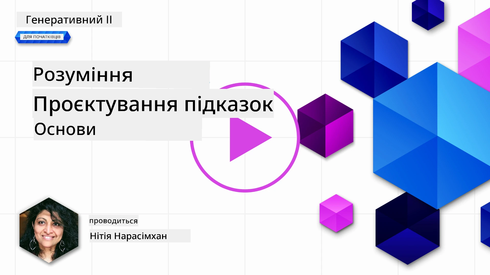
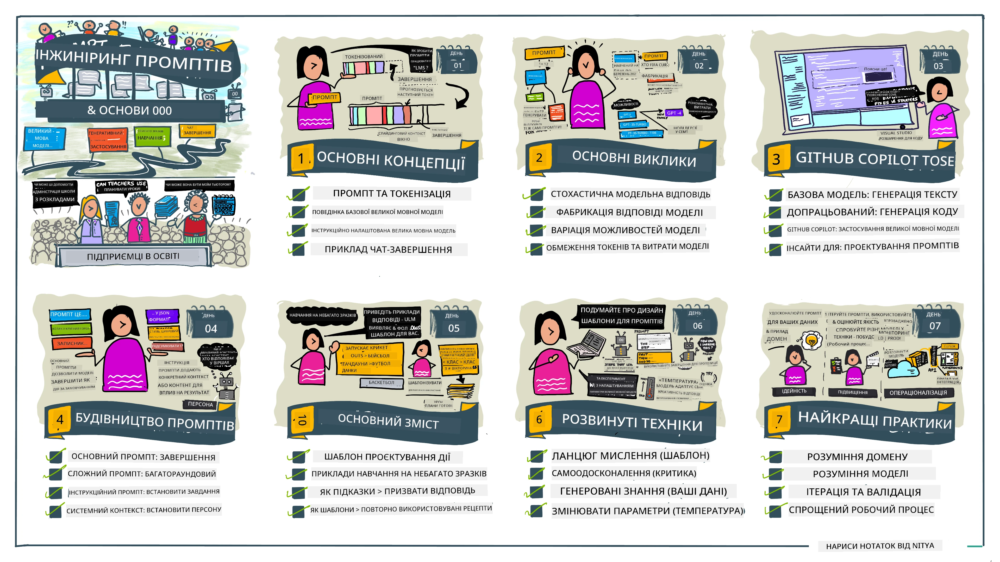
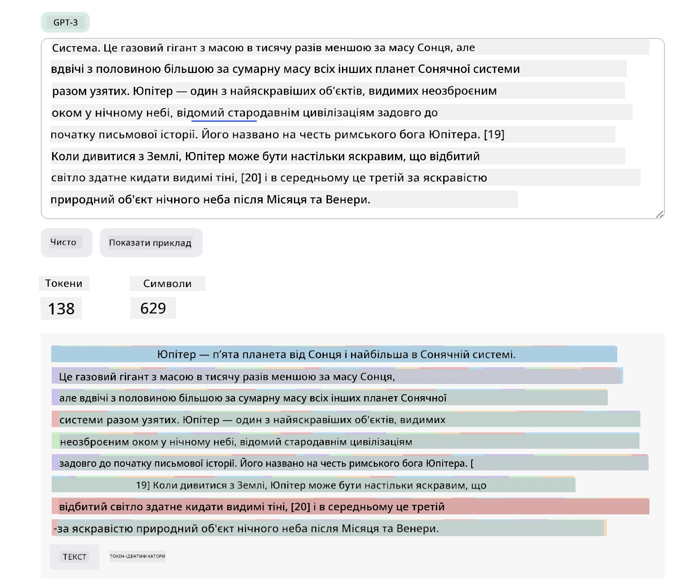
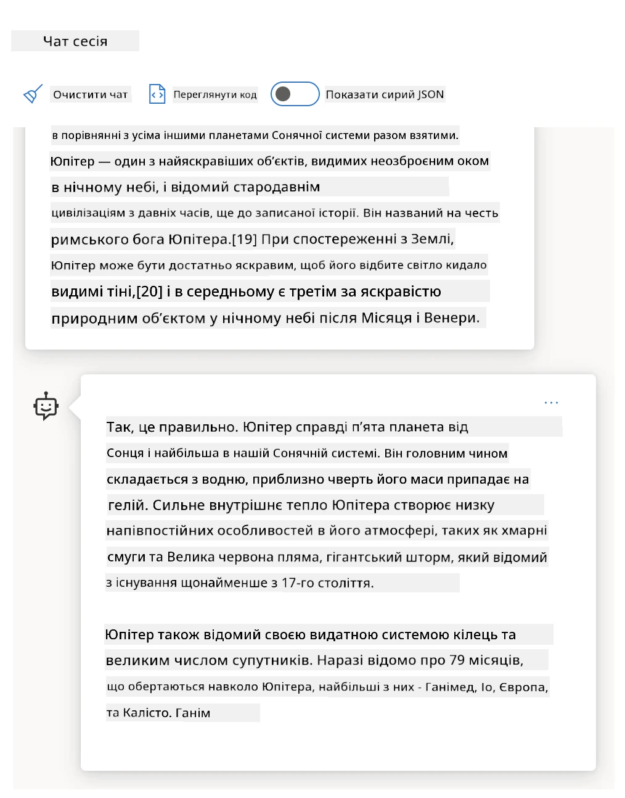
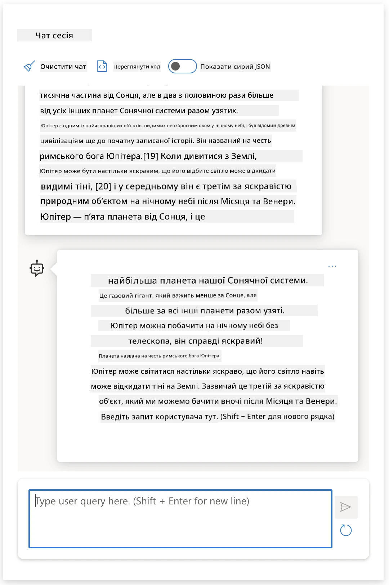
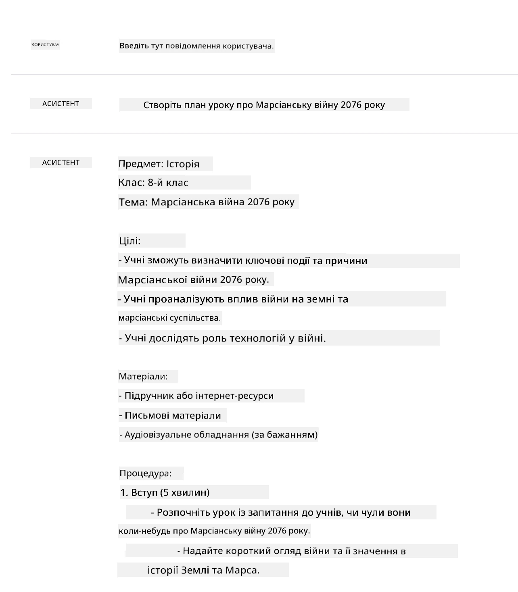
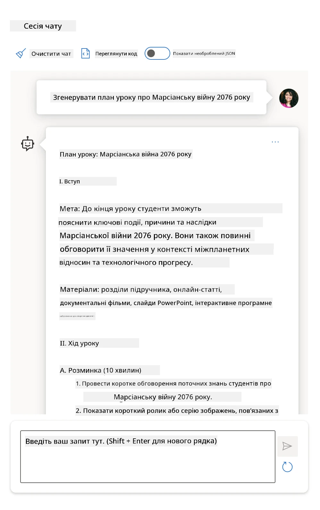
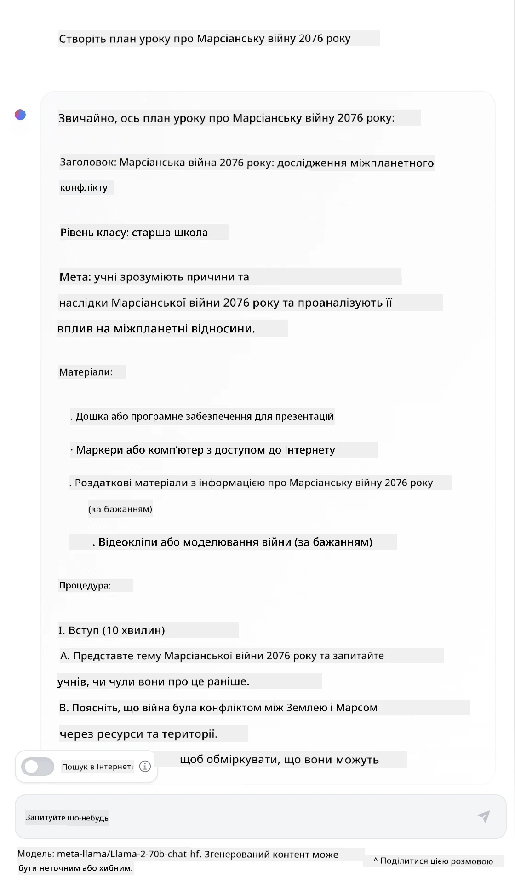

# Основи проєктування запитів

[](https://youtu.be/GElCu2kUlRs?si=qrXsBvXnCW12epb8)

## Вступ
У цьому модулі розглядаються основні поняття та техніки створення ефективних запитів у генеративних моделях штучного інтелекту. Те, як ви формулюєте свій запит до великої мовної моделі (LLM), також має значення. Ретельно продуманий запит може забезпечити кращу якість відповіді. Але що саме означають такі терміни, як _запит_ та _проєктування запитів_? І як покращити вхідний _запит_, який я надсилаю до LLM? На ці питання ми спробуємо відповісти в цій та наступній главі.

_Генеративний ШІ_ здатний створювати новий контент (наприклад, текст, зображення, аудіо, код тощо) у відповідь на запити користувача. Це досягається за допомогою _великих мовних моделей_ (LLM), таких як серія GPT від OpenAI ("Generative Pre-trained Transformer"), які навчалися використовувати природну мову та код.

Користувачі тепер можуть взаємодіяти з цими моделями за допомогою знайомих парадигм, таких як чат, без необхідності технічних знань або навчання. Моделі є _заснованими на запитах_ – користувачі надсилають текстовий вхід (запит) і отримують у відповідь реакцію ШІ (завершення). Потім вони можуть ітеративно "спілкуватися з ШІ" у багатотурових діалогах, уточнюючи свій запит, доки відповідь не відповідатиме їхнім очікуванням.

"Запити" тепер стають основним _програмним інтерфейсом_ для генеративних додатків із ШІ, вказуючи моделям, що робити, і впливаючи на якість отриманих відповідей. "Проєктування запитів" – це швидкозростаюча галузь досліджень, що зосереджена на _проєктуванні й оптимізації_ запитів для забезпечення послідовних і якісних відповідей у масштабі.

## Навчальні цілі

У цьому уроці ми дізнаємося, що таке проєктування запитів, чому це важливо та як створювати більш ефективні запити для конкретної моделі та мети застосування. Ми зрозуміємо основні поняття та найкращі практики проєктування запитів – і познайомимося з інтерактивним середовищем Jupyter Notebooks "пісочниці", де зможемо побачити, як ці концепції застосовуються на реальних прикладах.

До кінця цього уроку ми зможемо:

1. Пояснити, що таке проєктування запитів і чому це важливо.
2. Описати компоненти запиту і як вони використовуються.
3. Вивчити найкращі практики та техніки проєктування запитів.
4. Застосувати вивчені техніки на реальних прикладах, використовуючи OpenAI endpoint.

## Ключові терміни

Проєктування запитів: Практика проєктування та вдосконалення вхідних даних, щоб спрямувати моделі ШІ на отримання бажаних результатів.
Токенізація: Процес перетворення тексту на менші одиниці, звані токенами, які модель може розуміти і обробляти.
Модель Instruction-Tuned LLM: Великі мовні моделі (LLM), які були адаптовані з використанням конкретних інструкцій для покращення точності та релевантності відповідей.

## Навчальна пісочниця

Проєктування запитів наразі більше схоже на мистецтво, ніж на науку. Найкращий спосіб покращити нашу інтуїцію — це _практикуватися більше_ й використовувати підхід проб та помилок, що поєднує експертизу у предметній області з рекомендованими техніками та оптимізаціями, специфічними для моделі.

Jupyter Notebook, який супроводжує цей урок, надає _пісочницю_, де ви можете випробувати те, що вивчаєте — під час уроку або як частину кодувального завдання в кінці. Для виконання вправ вам знадобиться:

1. **API-ключ Azure OpenAI** – сервісний endpoint для розгорнутої LLM.
2. **Середовище виконання Python** – у якому можна запускати Notebook.
3. **Локальні змінні середовища** – _завершіть кроки [SETUP](./../00-course-setup/02-setup-local.md?WT.mc_id=academic-105485-koreyst) зараз, щоб бути готовими_.

Notebook містить _початкові_ вправи — але рекомендуємо додавати власні розділи _Markdown_ (опис) та _Код_ (запити), щоб випробувати більше прикладів або ідей — і розвивати інтуїцію для проєктування запитів.

## Ілюстрований посібник

Хочете отримати загальне уявлення про те, що охоплює цей урок, перш ніж заглиблюватися? Перегляньте цей ілюстрований посібник, який дає уявлення про основні теми та ключові висновки, над якими варто подумати в кожній. Дорожня карта уроку проведе вас від розуміння ключових концепцій і викликів до їх розв’язання з використанням відповідних технік проєктування запитів і найкращих практик. Зверніть увагу, що розділ "Розширені техніки" в цьому посібнику стосується матеріалу, опрацьованого у _наступній_ главі цього курсу.



## Наша стартап-компанія

Тепер поговоримо про те, як _ця тема_ пов’язана з місією нашого стартапу — [привнести інновації ШІ в освіту](https://educationblog.microsoft.com/2023/06/collaborating-to-bring-ai-innovation-to-education?WT.mc_id=academic-105485-koreyst). Ми хочемо створювати додатки на базі ШІ для _персоналізованого навчання_ — тож давайте подумаємо, як різні користувачі нашого додатку можуть "проєктувати" запити:

- **Адміністратори** можуть попросити ШІ _проаналізувати дані навчальної програми для виявлення прогалин у охопленні_. ШІ може підсумувати результати або візуалізувати їх за допомогою коду.
- **Викладачі** можуть попросити ШІ _згенерувати план уроку для цільової аудиторії та теми_. ШІ може побудувати персоналізований план у заданому форматі.
- **Студенти** можуть попросити ШІ _пояснити їм складну тему_. ШІ зараз може допомагати студентам із уроками, підказками та прикладами, адаптованими до їх рівня.

Ось і лише вершина айсберга. Перегляньте [Prompts For Education](https://github.com/microsoft/prompts-for-edu/tree/main?WT.mc_id=academic-105485-koreyst) — бібліотеку відкритих запитів, підібраних експертами в галузі освіти — щоб отримати ширше уявлення про можливості! _Спробуйте запустити деякі з цих запитів у пісочниці або в OpenAI Playground, щоб побачити, що станеться!_

<!--
ШАБЛОН УРОКУ:
Цей розділ має охоплювати основну концепцію №1.
Підкріпіть концепцію прикладами та посиланнями.

КОНЦЕПЦІЯ №1:
Проєктування запитів.
Визначте її та поясніть, чому вона потрібна.
-->

## Що таке проєктування запитів?

Ми почали цей урок із визначення **проєктування запитів** як процесу _проєктування та оптимізації_ текстових вхідних даних (запитів) для отримання послідовних і якісних відповідей (завершень) для конкретної мети застосування та моделі. Ми можемо розглядати це як процес із двох кроків:

- _проектування_ початкового запиту для певної моделі та мети
- _покращення_ запиту ітеративно для підвищення якості відповіді

Це неминуче процес проб і помилок, що вимагає інтуїції користувача і зусиль для досягнення оптимальних результатів. Тож чому це важливо? Щоб відповісти на це питання, спершу потрібно зрозуміти три поняття:

- _Токенізація_ = як модель "бачить" запит
- _Базові LLM_ = як основна модель "обробляє" запит
- _Моделі Instruction-Tuned_ = як модель тепер сприймає "завдання"

### Токенізація

LLM бачить запити як _послідовність токенів_, де різні моделі (або версії однієї моделі) можуть токенізувати той самий запит по-різному. Оскільки LLM навчаються на токенах (а не на сирому тексті), спосіб токенізації запитів безпосередньо впливає на якість згенерованої відповіді.

Щоб відчути, як працює токенізація, спробуйте інструменти, такі як [OpenAI Tokenizer](https://platform.openai.com/tokenizer?WT.mc_id=academic-105485-koreyst), показаний нижче. Скопіюйте свій запит — і побачте, як він конвертується в токени, звертаючи увагу на обробку пробілів і розділових знаків. Зверніть увагу, що в цьому прикладі використовується стара LLM (GPT-3) — тому спроба з новішою моделлю може дати інший результат.



### Концепція: Фундаментальні моделі

Після токенізації основна функція ["Базової LLM"](https://blog.gopenai.com/an-introduction-to-base-and-instruction-tuned-large-language-models-8de102c785a6?WT.mc_id=academic-105485-koreyst) (або фундаментальної моделі) полягає в передбаченні токена в цій послідовності. Оскільки LLM навчаються на величезних текстових масивах, вони добре розуміють статистичні взаємозв’язки між токенами і можуть зробити це передбачення з певною впевненістю. Зверніть увагу, що вони не розуміють _значення_ слів у запиті або токені; вони просто бачать шаблон, який можуть "завершити" наступним передбаченням. Вони можуть продовжувати передбачати послідовність до її припинення користувачем або за деякою заздалегідь встановленою умовою.

Хочете побачити, як працює завершення на основі запиту? Введіть наведений вище запит у [Microsoft Foundry playground](https://ai.azure.com?WT.mc_id=academic-105485-koreyst) зі стандартними налаштуваннями. Система налаштована трактувати запити як інформаційні запити — тож ви повинні побачити відповідь, що відповідає цьому контексту.

Але що, якщо користувач хоче побачити щось конкретне, що відповідає певним критеріям або меті завдання? Тут на сцену виходять _моделі Instruction-Tuned_.



### Концепція: Моделі Instruction Tuned

[Модель Instruction Tuned](https://blog.gopenai.com/an-introduction-to-base-and-instruction-tuned-large-language-models-8de102c785a6?WT.mc_id=academic-105485-koreyst) починається з фундаментальної моделі і донавчається за допомогою прикладів або входів/виходів (наприклад, багатоходових "повідомлень"), які можуть містити чіткі інструкції — і відповідь ШІ намагається слідувати цим інструкціям.

Це використовує техніки, такі як навчання з підкріпленням за участю людини (RLHF), яке може навчити модель _слухатися інструкцій_ і _навчатися з відгуків_, щоб вона виробляла відповіді, краще пристосовані до практичних застосувань і відповідали цілям користувача.

Спробуймо це — поверніться до наведеного вище запиту, але тепер змініть _системне повідомлення_, щоб воно містило таку інструкцію в контексті:

> _Стисло викладіть наданий вам матеріал для учня другого класу. Тримайте результат у одному абзаці з 3-5 пунктами._

Подивіться, як результат тепер налаштований відповідно до бажаної мети та формату? Викладач може тепер безпосередньо використовувати цю відповідь у своїх слайдах для цього уроку.



## Чому нам потрібне проєктування запитів?

Тепер, коли ми знаємо, як LLM обробляють запити, поговоримо про те, _чому_ нам потрібно проєктування запитів. Відповідь полягає в тому, що нинішні LLM мають ряд проблем, які ускладнюють досягнення _надійних і послідовних завершень_ без докладання зусиль до конструювання та оптимізації запитів. Наприклад:

1. **Відповіді моделі є стохастичними.** _Один і той же запит_ ймовірно дасть різні відповіді з різними моделями або версіями моделей. І він навіть може давати різні результати з _однією й тією ж моделлю_ у різний час. _Техніки проєктування запитів допомагають мінімізувати ці варіації, забезпечуючи кращі обмеження_.

1. **Моделі можуть вигадувати відповіді.** Моделі попередньо навчені на _великих, але обмежених_ наборах даних, тому їм бракує знань про поняття поза межами цієї області тренування. В результаті вони можуть видавати неточні, вигадані або безпосередньо суперечливі відомим фактам відповіді. _Техніки проєктування запитів допомагають користувачам виявляти та зменшувати такі вигадки, наприклад, запитуючи ШІ джерела або логіку_.

1. **Можливості моделей будуть різнитися.** Новіші моделі або покоління моделей матимуть більш розвинені можливості, але також унікальні особливості та компроміси в вартості та складності. _Проєктування запитів може допомогти розробити найкращі практики і робочі процеси, які абстрагують ці відмінності та адаптуються до специфіки конкретної моделі масштабовано і безперебійно_.

Погляньмо на це в дії в OpenAI або Azure OpenAI Playground:

- Використайте один і той же запит з різними розгортаннями LLM (наприклад, OpenAI, Azure OpenAI, Hugging Face) – чи бачили ви варіації?
- Використовуйте один і той же запит багато разів з _тим самим_ розгортанням LLM (наприклад, Azure OpenAI playground) – як відрізнялися ці варіації?

### Приклад вигадок

В цьому курсі ми використовуємо термін **"вигадка"** для позначення явища, коли LLM іноді виробляють фактично неправильну інформацію через обмеження у їхньому навчанні або інші обставини. Ви, мабуть, чули про це як про _"галюцинації"_ у популярних статтях чи наукових роботах. Однак ми наполегливо рекомендуємо використовувати _"вигадка"_ як термін, щоб уникнути ненавмисної апріоризації поведінки, надаючи їй людську рису в машинному результаті. Це також посилює [керівництво щодо відповідального ШІ](https://www.microsoft.com/ai/responsible-ai?WT.mc_id=academic-105485-koreyst) з точки зору термінології, виключаючи терміни, які в деяких контекстах можуть бути образливими або недостатньо інклюзивними.

Хочете зрозуміти, як працюють вигадки? Подумайте про запит, який наказує ШІ створити контент на неіснуючу тему (щоб гарантовано, що її немає в навчальному наборі). Наприклад — я спробував цей запит:

> **Запит:** створіть план уроку про Війну на Марсі 2076 року.

Веб-пошук показав, що існують вигадані розповіді (наприклад, телесеріали чи книги) про марсіанські війни — але жодних про 2076 рік. Здоровий глузд теж каже, що 2076 – це _майбутнє_ і тому не може бути пов’язане з реальною подією.


То що ж відбувається, коли ми запускаємо цей запит із різними провайдерами LLM?

> **Відповідь 1**: OpenAI Playground (GPT-35)



> **Відповідь 2**: Azure OpenAI Playground (GPT-35)



> **Відповідь 3**: : Hugging Face Chat Playground (LLama-2)



Як і очікувалося, кожна модель (або версія моделі) дає трохи різні відповіді завдяки стохастичній поведінці та варіаціям можливостей моделі. Наприклад, одна модель орієнтується на аудиторію восьмого класу, тоді як інша вважає, що користувач — учень старшої школи. Але всі три моделі згенерували відповіді, які могли переконати необізнаного користувача, що подія була реальною.

Техніки інженерії підказок, такі як _метапрамптинг_ і _налаштування температури_, можуть у деякій мірі зменшити вигадки моделі. Нові _архітектури_ інженерії підказок також безперешкодно включають нові інструменти та методи у потік підказок, щоб пом’якшити або зменшити деякі з цих ефектів.

## Кейс-стаді: GitHub Copilot

Завершимо цей розділ, ознайомившись із тим, як інженерія підказок використовується в реальних рішеннях на прикладі одного кейс-стаді: [GitHub Copilot](https://github.com/features/copilot?WT.mc_id=academic-105485-koreyst).

GitHub Copilot — це ваш "Штучний інтелект-партнер програміста" — він перетворює текстові підказки на завершення коду і інтегрований у ваше середовище розробки (наприклад, Visual Studio Code) для безперебійного користувацького досвіду. Як задокументовано у серії блогів нижче, найраніша версія базувалася на моделі OpenAI Codex — інженери швидко зрозуміли необхідність донавчання моделі та розробки кращих технік інженерії підказок, щоб покращити якість коду. У липні вони [представили покращену AI-модель, яка виходить за межі Codex](https://github.blog/2023-07-28-smarter-more-efficient-coding-github-copilot-goes-beyond-codex-with-improved-ai-model/?WT.mc_id=academic-105485-koreyst) для ще швидших пропозицій.

Читайте публікації послідовно, щоб стежити за їхнім навчальним шляхом.

- **Травень 2023** | [GitHub Copilot покращує розуміння вашого коду](https://github.blog/2023-05-17-how-github-copilot-is-getting-better-at-understanding-your-code/?WT.mc_id=academic-105485-koreyst)
- **Травень 2023** | [Внутрішній погляд на GitHub: робота з LLM за GitHub Copilot](https://github.blog/2023-05-17-inside-github-working-with-the-llms-behind-github-copilot/?WT.mc_id=academic-105485-koreyst).
- **Червень 2023** | [Як писати кращі підказки для GitHub Copilot](https://github.blog/2023-06-20-how-to-write-better-prompts-for-github-copilot/?WT.mc_id=academic-105485-koreyst).
- **Липень 2023** | [.. GitHub Copilot виходить за межі Codex із покращеною AI-моделлю](https://github.blog/2023-07-28-smarter-more-efficient-coding-github-copilot-goes-beyond-codex-with-improved-ai-model/?WT.mc_id=academic-105485-koreyst)
- **Липень 2023** | [Посібник розробника з інженерії підказок і LLM](https://github.blog/2023-07-17-prompt-engineering-guide-generative-ai-llms/?WT.mc_id=academic-105485-koreyst)
- **Вересень 2023** | [Як створити корпоративний додаток на основі LLM: уроки GitHub Copilot](https://github.blog/2023-09-06-how-to-build-an-enterprise-llm-application-lessons-from-github-copilot/?WT.mc_id=academic-105485-koreyst)

Ви також можете переглянути їхній [Інженерний блог](https://github.blog/category/engineering/?WT.mc_id=academic-105485-koreyst) для інших публікацій, таких як [ця](https://github.blog/2023-09-27-how-i-used-github-copilot-chat-to-build-a-reactjs-gallery-prototype/?WT.mc_id=academic-105485-koreyst), яка показує, як ці моделі та техніки _застосовуються_ для реалізації реальних проєктів.

---

<!--
ШАБЛОН УРОКУ:
Цей розділ повинен охоплювати основну концепцію №2.
Підкріпити концепцію прикладами та посиланнями.

КОНЦЕПЦІЯ №2:
Проєктування підказок.
Пояснюється прикладами.
-->

## Конструювання підказок

Ми вже знаємо, чому інженерія підказок важлива — тепер давайте зрозуміємо, як підказки _конструюються_, щоб ми могли оцінити різні техніки для ефективнішого проєктування підказок.

### Базова підказка

Почнемо з базової підказки: текстового вводу, надісланого моделі без іншого контексту. Ось приклад — коли ми надсилаємо перші кілька слів національного гімну США до OpenAI [Completion API](https://platform.openai.com/docs/api-reference/completions?WT.mc_id=academic-105485-koreyst), він миттєво _доповнює_ відповідь наступними кількома рядками, ілюструючи базову поведінку передбачення.

| Підказка (вхід)      | Завершення (вихід)                                                                                                                        |
| :----------------- | :----------------------------------------------------------------------------------------------------------------------------------------- |
| Oh say can you see | Схоже, ви починаєте співати "The Star-Spangled Banner", національний гімн Сполучених Штатів. Повний текст звучить ...                         |

### Складна підказка

Тепер додамо контекст і інструкції до цієї базової підказки. [Chat Completion API](https://learn.microsoft.com/azure/ai-services/openai/how-to/chatgpt?WT.mc_id=academic-105485-koreyst) дозволяє конструювати складну підказку як колекцію _повідомлень_ з:

- парами вводу/виводу, що відображають введення _користувача_ і відповідь _асистента_.
- Системним повідомленням, що встановлює контекст поведінки або особистості асистента.

Запит тепер має вигляд нижче — де _токенізація_ ефективно захоплює релевантну інформацію з контексту та розмови. Тепер зміна системного контексту може бути такою ж впливовою на якість завершень, як і введення користувача.

```python
response = client.responses.create(
    model="gpt-4o-mini",
    input=[
        {"role": "system", "content": "You are a helpful assistant."},
        {"role": "user", "content": "Who won the world series in 2020?"},
        {"role": "assistant", "content": "The Los Angeles Dodgers won the World Series in 2020."},
        {"role": "user", "content": "Where was it played?"}
    ]
)
```

### Інструктивна підказка

У наведених вище прикладах підказка користувача була простим текстовим запитом, який можна інтерпретувати як запит на інформацію. З _інструктивними_ підказками ми можемо використовувати цей текст для більш детального уточнення завдання, даючи кращі вказівки ШІ. Ось приклад:

| Підказка (вхід)                                                                                                                                                                                                                         | Завершення (вихід)                                                                                                        | Тип інструкції      |
| :------------------------------------------------------------------------------------------------------------------------------------------------------------------------------------------------------------------------------------- | :------------------------------------------------------------------------------------------------------------------------- | :------------------ |
| Напишіть опис Громадянської війни                                                                                                                                                                                                     | _повернув простий абзац_                                                                                                  | Простий             |
| Напишіть опис Громадянської війни. Наведіть ключові дати та події і опишіть їх значення                                                                                                                                                | _повернув абзац з переліком ключових дат із описом_                                                                       | Складний            |
| Напишіть опис Громадянської війни в 1 абзаці. Наведіть 3 тези з ключовими датами і їх значенням. Наведіть ще 3 тези з ключовими історичними постатями та їх внеском. Поверніть результат у вигляді JSON-файлу                       | _повертає все більш детально у текстовому блоці, відформатованому як JSON, який можна скопіювати у файл і перевірити за потреби_ | Складний. Форматований. |

## Основний вміст

У наведених вище прикладах підказка була ще досить відкритою, дозволяючи LLM самостійно вирішувати, яка частина його попередньо навченої бази даних релевантна. Використовуючи патерн проєктування _основного вмісту_, вхідний текст поділяють на дві частини:

- інструкція (дія)
- релевантний вміст (який впливає на дію)

Ось приклад, де інструкція — "підсумуйте це у 2 речення".

| Підказка (вхід)                                                                                                                                                                                                                                                                                                                                                                                                                                                                                                                                                                                                                                                                                      | Завершення (вихід)                                                                                                                                                                                                                                                                             |
| :-------------------------------------------------------------------------------------------------------------------------------------------------------------------------------------------------------------------------------------------------------------------------------------------------------------------------------------------------------------------------------------------------------------------------------------------------------------------------------------------------------------------------------------------------------------------------------------------------------------------------------------------------------------------------------------------------- | :---------------------------------------------------------------------------------------------------------------------------------------------------------------------------------------------------------------------------------------------------------------------------------------------- |
| Юпітер — п'ята планета від Сонця і найбільша в Сонячній системі. Це газовий гігант із масою в одну тисячну маси Сонця, але у два з половиною рази більше маси всіх інших планет Сонячної системи разом узятих. Юпітер один із найяскравіших об’єктів, видимих неозброєним оком у нічному небі, відомий стародавнім цивілізаціям ще з документованої історії. Він названий на честь римського бога Юпітера.[19] Коли дивитися з Землі, Юпітер може бути настільки яскравим, що його відбите світло кидає видимі тіні,[20] і в середньому він є третім за яскравістю природним об’єктом на нічному небі після Місяця і Венери. <br/> **Підсумуйте це у 2 короткі речення** | Юпітер, п'ята планета від Сонця, є найбільшою в Сонячній системі і відомий як один із найяскравіших об’єктів нічного неба. Названий на честь римського бога Юпітера, це газовий гігант, маса якого у два з половиною рази більша за сумарну масу інших планет Сонячної системи. |

Сегмент основного вмісту можна використовувати різними способами для ефективнішого керування інструкціями:

- **Приклади** — замість того, щоб прямо говорити моделі, що робити, дайте їй приклади, і вона здогадається про схему.
- **Підказки** — слідуйте інструкції додаванням "підказки", яка налаштовує завершення, спрямовуючи модель до більш релевантних відповідей.
- **Шаблони** — це повторювані «рецепти» підказок із заповнювачами (змінними), які можна налаштувати даними для конкретних випадків використання.

Давайте дослідимо це на практиці.

### Використання прикладів

Це підхід, де ви використовуєте основний вміст, щоб «нагодувати модель» прикладами бажаного результату для певної інструкції, і вона сама виводить шаблон для бажаного результату. Залежно від кількості наданих прикладів, існують zero-shot, one-shot, few-shot prompting тощо.

Підказка тепер складається з трьох компонентів:

- Опису завдання
- Декількох прикладів потрібного результату
- Початку нового прикладу (який стає неявним описом завдання)

| Тип навчання | Підказка (вхід)                                                                                                                                        | Завершення (вихід)         |
| :------------ | :---------------------------------------------------------------------------------------------------------------------------------------------------- | :-------------------------- |
| Zero-shot     | "The Sun is Shining". Перекласти іспанською                                                                                                          | "El Sol está brillando".    |
| One-shot      | "The Sun is Shining" => ""El Sol está brillando". <br> "It's a Cold and Windy Day" =>                                                                 | "Es un día frío y ventoso". |
| Few-shot      | Гравець біг базами => Бейсбол <br/> Гравець подав грою "ace" => Теніс <br/> Гравець подав шість => Крікет <br/> Гравець зробив слем-данк =>             | Баскетбол                  |
|               |                                                                                                                                                       |                             |

Зверніть увагу, що у zero-shot prompting потрібно було надавати явну інструкцію ("Перекласти іспанською"), але в прикладі one-shot цього вже не потрібно — це виводиться само. Приклад few-shot показує, як додавання більшої кількості прикладів дозволяє моделям робити точніші висновки без додаткових інструкцій.

### Підказки (Cues)

Інша техніка використання основного вмісту — це надання _підказок_ замість прикладів. У цьому випадку ми даємо моделі натяк у правильному напрямку, _починаючи_ її з фрагмента, який відображає потрібний формат відповіді. Модель потім «ловить підказку» і продовжує у тому ж стилі.

| Кількість підказок | Підказка (вхід)                                                                                                                                                                                                                                                                                                                                                                                                                                               | Завершення (вихід)                                                                                                                                                                                                                                                                                       |
| :------------- | :----------------------------------------------------------------------------------------------------------------------------------------------------------------------------------------------------------------------------------------------------------------------------------------------------------------------------------------------------------------------------------------------------------------------------------------------------------- | :-------------------------------------------------------------------------------------------------------------------------------------------------------------------------------------------------------------------------------------------------------------------------------------------------------- |
| 0              | Юпітер — п'ята планета від Сонця і найбільша в Сонячній системі. Це газовий гігант із масою в одну тисячну маси Сонця, але у два з половиною рази більше маси всіх інших планет Сонячної системи разом узятих. Юпітер один із найяскравіших об’єктів, видимих неозброєним оком у нічному небі, відомий стародавнім цивілізаціям ще з документованої історії. <br/>**Підсумуйте це**                                       | Юпітер — найбільша планета нашої Сонячної системи і п'ята за рахунком від Сонця. Це газовий гігант із масою, що становить 1/1000 маси Сонця, але він важчий за всі інші планети разом узяті. Стародавні цивілізації знали про Юпітер уже давно, і він легко помітний на нічному небі.. |
| 1              | Юпітер — п'ята планета від Сонця і найбільша в Сонячній системі. Це газовий гігант із масою в одну тисячну маси Сонця, але у два з половиною рази більше маси всіх інших планет Сонячної системи разом узятих. Юпітер один із найяскравіших об’єктів, видимих неозброєним оком у нічному небі, відомий стародавнім цивілізаціям ще з документованої історії. <br/>**Підсумуйте це** <br/> Що ми дізналися, що Юпітер | це п'ята планета від Сонця і найбільша в Сонячній системі. Це газовий гігант із масою в одну тисячну маси Сонця, але у два з половиною рази більше маси всіх інших планет разом узятих. Він легко помітний неозброєним оком і відомий з давніх часів.                        |

| 2              | Юпітер — п’ята планета від Сонця і найбільша в Сонячній системі. Це газовий гігант з масою, що становить одну тисячну від маси Сонця, але у два з половиною рази більший за сумарну масу всіх інших планет Сонячної системи разом узятих. Юпітер — один із найяскравіших об’єктів, видимих неозброєним оком у нічному небі, і він відомий древнім цивілізаціям з часів до ведення писемних записів. <br/>**Підсумуйте це** <br/> Топ-3 факти, які ми дізналися:         | 1. Юпітер — п’ята планета від Сонця і найбільша в Сонячній системі. <br/> 2. Це газовий гігант з масою, що становить одну тисячну від маси Сонця...<br/> 3. Юпітер був видимий неозброєним оком з давніх часів ...                                                                       |
|                |                                                                                                                                                                                                                                                                                                                                                                                                                                                              |                                                                                                                                                                                                                                                                                                           |

### Шаблони Запитів

Шаблон запиту — це _заздалегідь визначений рецепт запиту_, який можна зберігати та повторно використовувати за потреби для створення більш послідовного досвіду користувача в масштабі. У найпростішій формі це просто збірка прикладів запитів, як-от [цей від OpenAI](https://cookbook.openai.com/examples/gpt4-1_prompting_guide?WT.mc_id=academic-105485-koreyst), який надає інтерактивні компоненти запиту (повідомлення користувача та системи) і формат запиту, керований через API — щоб підтримати повторне використання.

У більш складній формі, як [цей приклад від LangChain](https://python.langchain.com/docs/concepts/prompt_templates/?WT.mc_id=academic-105485-koreyst), він містить _заповнювачі_, які можна замінити даними з різних джерел (вхід користувача, контекст системи, зовнішні джерела даних тощо) для динамічного генерування запиту. Це дозволяє створювати бібліотеку багаторазових запитів, які можна використовувати для створення послідовного досвіду користувача **програмно** в масштабі.

Нарешті, справжня цінність шаблонів полягає в можливості створення та публікації _бібліотек запитів_ для вертикальних предметних областей — де шаблон запиту тепер _оптимізований_ з урахуванням контексту чи прикладів, специфічних для застосування, що робить відповіді більш релевантними й точними для цільової аудиторії користувачів. Репозиторій [Prompts For Edu](https://github.com/microsoft/prompts-for-edu?WT.mc_id=academic-105485-koreyst) — чудовий приклад такого підходу, який збирає бібліотеку запитів для освітньої сфери з акцентом на ключові цілі, як-от планування уроків, розробка навчальної програми, студентське наставництво тощо.

## Додатковий Контент

Якщо розглядати конструкцію запиту як наявність інструкції (завдання) та цілі (основного контенту), то _додатковий контент_ — це як додатковий контекст, який ми надаємо, щоб **вплинути на результат певним чином**. Це можуть бути параметри налаштування, інструкції щодо форматування, таксономії тем тощо, які допомагають моделі _налаштувати_ свою відповідь так, щоб вона відповідала бажаним цілям або очікуванням користувача.

Наприклад: маючи каталог курсів із розгорнутою метаданими (назва, опис, рівень, теги метаданих, викладач і т.д.) для всіх доступних курсів у навчальній програмі:

- ми можемо визначити інструкцію «підсумувати каталог курсів на осінь 2023 року»
- ми можемо використати основний контент, щоб надати кілька прикладів бажаного результату
- ми можемо використати додатковий контент, щоб визначити топ-5 «тагів» інтересу.

Тепер модель може надати підсумок у форматі, показаному кількома прикладами, — але якщо результат має кілька тегів, вона може пріоритезувати 5 тегів, визначених у додатковому контенті.

---

<!--
ШАБЛОН УРОКУ:
Цей блок має охоплювати основну концепцію №1.
Підкріпіть концепцію прикладами та посиланнями.

КОНЦЕПЦІЯ №3:
Техніки Prompt Engineering.
Які базові техніки для інженерії запитів?
Поясніть їх на прикладах вправ.
-->

## Найкращі практики промптингу

Тепер, коли ми знаємо, як можна _конструювати_ запити, можна починати думати про те, як _проектувати_ їх так, щоб вони відображали найкращі практики. Це можна розглядати у двох аспектах — мати правильний _менталітет_ і застосовувати правильні _техніки_.

### Менталітет Prompt Engineering

Інженерія запитів — це процес проб і помилок, тож тримайте на увазі три широкі керівні фактори:

1. **Важливе розуміння домену.** Точність і релевантність відповіді залежать від _доменної області_, в якій застосунок або користувач працює. Застосовуйте свою інтуїцію та експертизу домену, щоб **додатково налаштовувати техніки**. Наприклад, визначайте _доменно-специфічні особистості_ у системних запитах або використовуйте _доменно-специфічні шаблони_ у користувацьких запитах. Надавайте додатковий контент, який відображає доменно-специфічний контекст, або використовуйте _доменно-специфічні підказки та приклади_, щоб спрямувати модель на знайомі шаблони використання.

2. **Важливе розуміння моделі.** Ми знаємо, що моделі за своєю природою стохастичні. Але імплементації моделей можуть також відрізнятися за тренувальним набором даних (предтренованими знаннями), функціоналом (наприклад, через API чи SDK) та типом контенту, для якого вони оптимізовані (код, зображення, текст). Розумійте сильні та слабкі сторони моделі, яку ви використовуєте, і застосовуйте ці знання для _пріоритизації завдань_ або створення _персоналізованих шаблонів_, оптимізованих під можливості моделі.

3. **Важливі ітерації й перевірка.** Моделі швидко розвиваються, так само як і техніки інженерії запитів. Як експерт у домені, у вас можуть бути інші контексти чи критерії для _вашого_ конкретного застосування, які можуть не підходити ширшій спільноті. Використовуйте інструменти та техніки инженерії запитів, щоб «дати поштовх» конструюванню запиту, а потім ітеруйте та перевіряйте результати, використовуючи власну інтуїцію й експертизу домену. Фіксуйте свої спостереження й створюйте **базу знань** (наприклад, бібліотеки запитів), яку інші можуть використати як нову базову лінію для швидших ітерацій у майбутньому.

## Найкращі практики

Тепер розглянемо загальні найкращі практики, рекомендовані практиками [OpenAI](https://help.openai.com/en/articles/6654000-best-practices-for-prompt-engineering-with-openai-api?WT.mc_id=academic-105485-koreyst) та [Azure OpenAI](https://learn.microsoft.com/azure/ai-services/openai/concepts/prompt-engineering#best-practices?WT.mc_id=academic-105485-koreyst).

| Що                              | Чому                                                                                                                                                                                                                                               |
| :-------------------------------- | :------------------------------------------------------------------------------------------------------------------------------------------------------------------------------------------------------------------------------------------------ |
| Оцінюйте найновіші моделі.       | Нові покоління моделей мають покращені функції та якість — але можуть також бути дорожчими. Оцінюйте їх за впливом і приймайте рішення про міграцію.                                                                                                |
| Розділяйте інструкції та контекст   | Перевірте, чи ваша модель/провайдер визначає _роздільники_ для чіткого розмежування інструкцій, основного та додаткового контенту. Це допомагає моделям точніше розподіляти ваги токенів.                                                         |
| Будьте специфічними й чіткими        | Надавайте більше деталей про бажаний контекст, результат, довжину, формат, стиль тощо. Це покращить як якість, так і послідовність відповідей. Фіксуйте рецепти у багаторазових шаблонах.                                                          |
| Будьте описовими, використовуйте приклади      | Моделі можуть краще відповідати на підхід «показати і розповісти». Починайте з `zero-shot` підходу, де дається інструкція (без прикладів), а потім спробуйте `few-shot` — для уточнення з кількома прикладами бажаного виходу. Використовуйте аналогії. |
| Використовуйте підказки для запуску завершень | Скеровуйте модель до бажаного результату, даючи їй провідні слова або фрази, які вона може використати як відправну точку для відповіді.                                                                                                               |
| Подвійний акцент                       | Іноді треба повторити інструкції моделі. Давати інструкції до та після основного контенту, використовувати інструкцію і підказку тощо. Ітеруйте й перевіряйте, що працює найкраще.                                                         |
| Порядок має значення                     | Порядок, у якому ви подаєте інформацію моделі, може впливати на результат, навіть у навчальних прикладах, через упередження недавності. Спробуйте різні варіанти, щоб знайти найкращий.                                                               |
| Дайте моделі можливість «відступити»           | Надайте моделі _запасний варіант відповіді_, який вона може використати, якщо не зможе виконати завдання з будь-якої причини. Це знижує ймовірність генерації хибних або вигаданих відповідей.                                                         |
|                                   |                                                                                                                                                                                                                                                   |

Як і у випадку з будь-якою найкращою практикою, пам’ятайте, що _у вас може бути свій досвід_ залежно від моделі, завдання та домену. Використовуйте ці рекомендації як відправну точку і ітеруйте, щоб знайти те, що працює саме для вас. Постійно переоцінюйте свій процес інженерії запитів із появою нових моделей і інструментів, зосереджуючись на масштабованості процесу та якості відповідей.

<!--
ШАБЛОН УРОКУ:
Цей блок має містити виклик-код, якщо це доцільно

ВИКЛИК:
Посилання на Jupyter Notebook з коментарями коду в інструкціях (розділи коду порожні).

РІШЕННЯ:
Посилання на копію того ноутбука з заповненими і запущеними промптами, що демонструє приклад.
-->

## Завдання

Вітаємо! Ви дійшли до кінця уроку! Час випробувати деякі з цих концепцій і технік на реальних прикладах!

Для нашого завдання ми будемо використовувати Jupyter Notebook із вправами, які ви можете виконувати інтерактивно. Ви також можете розширювати ноутбук власними Markdown та кодовими секціями для самостійного дослідження ідей і технік.

### Щоб почати, форкніть репозиторій, потім

- (Рекомендується) Запустіть GitHub Codespaces
- (Альтернативно) Клонуйте репозиторій на свій локальний пристрій і використовуйте з Docker Desktop
- (Альтернативно) Відкрийте ноутбук у вашому улюбленому середовищі виконання ноутбуків.

### Далі налаштуйте свої змінні середовища

- Скопіюйте файл `.env.copy` в корені репозиторію до `.env` та заповніть значення `AZURE_OPENAI_API_KEY`, `AZURE_OPENAI_ENDPOINT` і `AZURE_OPENAI_DEPLOYMENT`. Поверніться до розділу [Learning Sandbox](#навчальна-пісочниця), щоб дізнатись як.

### Потім відкрийте Jupyter Notebook

- Виберіть ядро виконання. Якщо використовуйте варіанти 1 або 2, просто виберіть стандартне ядро Python 3.10.x, яке надає контейнер розробника.

Ви готові виконувати вправи. Зверніть увагу, що тут немає _правильних чи неправильних_ відповідей — просто дослідження варіантів методом проб і помилок і формування інтуїції щодо того, що працює для певної моделі та предметної області.

_З цієї причини в цьому уроці немає сегментів з кодовими рішеннями. Натомість у ноутбуку будуть Markdown-ячейки з назвою "Моє Рішення:", яке демонструє приклад відповіді для довідки._

 <!--
ШАБЛОН УРОКУ:
Завершіть розділ підсумком і ресурсами для самостійного навчання.
-->

## Перевірка знань

Який із наведених запитів є хорошим, дотримуючись деяких розумних найкращих практик?

1. Покажи мені зображення червоного автомобіля
2. Покажи мені зображення червоного автомобіля марки Volvo, моделі XC90, припаркованого біля обриву на заході сонця
3. Покажи мені зображення червоного автомобіля марки Volvo, моделі XC90

Відповідь: 2 — це найкращий запит, оскільки він надає деталі про «що» і заходить у специфіку (не просто автомобіль, а конкретна марка і модель), а також описує загальну обстановку. 3 наступний за якістю, оскільки також містить багато опису.

## 🚀 Виклик

Спробуйте використати техніку «підказки» з запитом: Завершіть речення «Покажи мені зображення червоного автомобіля марки Volvo і ...». Що вона відповість, і як би ви це покращили?

## Чудова робота! Продовжуйте навчання

Хочете дізнатися більше про різні концепції інженерії запитів? Перейдіть на [сторінку продовження навчання](https://aka.ms/genai-collection?WT.mc_id=academic-105485-koreyst), щоб знайти інші чудові ресурси з цієї теми.

Перейдіть до уроку 5, де ми розглянемо [просунуті техніки промптингу](../05-advanced-prompts/README.md?WT.mc_id=academic-105485-koreyst)!

---

<!-- CO-OP TRANSLATOR DISCLAIMER START -->
**Відмова від відповідальності**:
Цей документ було перекладено за допомогою сервісу штучного інтелекту для перекладу [Co-op Translator](https://github.com/Azure/co-op-translator). Хоча ми прагнемо до точності, будь ласка, майте на увазі, що автоматичні переклади можуть містити помилки або неточності. Оригінальний документ рідною мовою слід вважати авторитетним джерелом. Для критично важливої інформації рекомендується професійний людський переклад. Ми не несемо відповідальності за будь-які непорозуміння або неправильні тлумачення, що виникли внаслідок використання цього перекладу.
<!-- CO-OP TRANSLATOR DISCLAIMER END -->