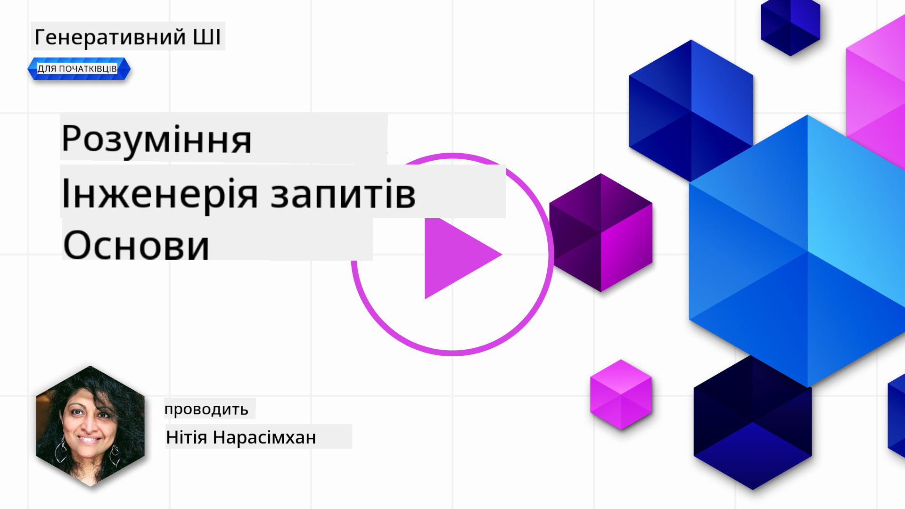
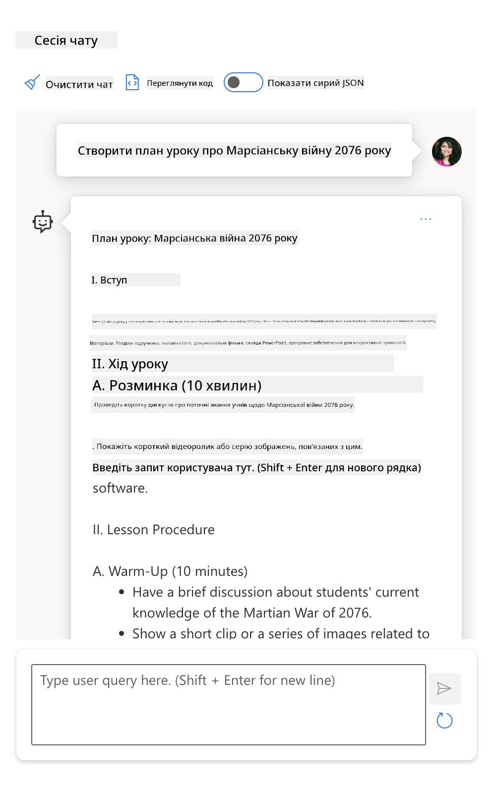
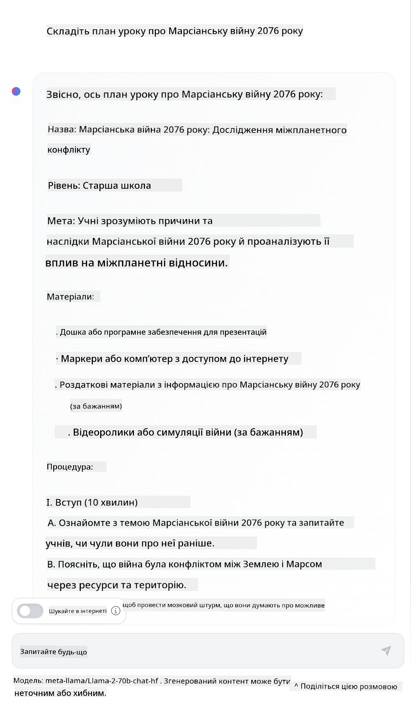

<!--
CO_OP_TRANSLATOR_METADATA:
{
  "original_hash": "a45c318dc6ebc2604f35b8b829f93af2",
  "translation_date": "2025-07-09T11:20:34+00:00",
  "source_file": "04-prompt-engineering-fundamentals/README.md",
  "language_code": "uk"
}
-->
# Основи проєктування підказок

[](https://aka.ms/gen-ai-lesson4-gh?WT.mc_id=academic-105485-koreyst)

## Вступ  
Цей модуль охоплює основні поняття та техніки створення ефективних підказок для генеративних моделей ШІ. Важливо, як саме ви формулюєте підказку для LLM. Ретельно продумана підказка може забезпечити кращу якість відповіді. Але що саме означають терміни _підказка_ та _проєктування підказок_? І як покращити вхідні дані підказки, які я надсилаю LLM? Саме на ці питання ми спробуємо відповісти в цій та наступній главі.

_Генеративний ШІ_ здатен створювати новий контент (наприклад, текст, зображення, аудіо, код тощо) у відповідь на запити користувачів. Це досягається за допомогою _Великих мовних моделей_ (LLM), таких як серія GPT від OpenAI ("Generative Pre-trained Transformer"), які навчені працювати з природною мовою та кодом.

Користувачі тепер можуть взаємодіяти з цими моделями через знайомі інтерфейси, наприклад чат, без необхідності технічної підготовки. Моделі працюють на основі _підказок_ — користувачі надсилають текстовий запит (підказку) і отримують відповідь ШІ (завершення). Вони можуть вести "розмову з ШІ" ітеративно, у кілька кроків, уточнюючи підказку, доки відповідь не відповідатиме їхнім очікуванням.

"Підказки" тепер стали основним _інтерфейсом програмування_ для генеративних додатків ШІ, вони вказують моделям, що робити, і впливають на якість отриманих відповідей. "Проєктування підказок" — це швидкозростаюча галузь, що зосереджена на _розробці та оптимізації_ підказок для забезпечення стабільних і якісних відповідей у масштабі.

## Цілі навчання

У цьому уроці ми дізнаємося, що таке проєктування підказок, чому це важливо і як створювати більш ефективні підказки для конкретної моделі та цілей застосування. Ми розглянемо основні поняття та найкращі практики проєктування підказок, а також познайомимося з інтерактивним середовищем Jupyter Notebook, де можна побачити застосування цих концепцій на реальних прикладах.

До кінця уроку ви зможете:

1. Пояснити, що таке проєктування підказок і чому це важливо.
2. Описати компоненти підказки та як їх використовувати.
3. Вивчити найкращі практики та техніки проєктування підказок.
4. Застосувати набуті навички на реальних прикладах, використовуючи OpenAI endpoint.

## Ключові терміни

Проєктування підказок: Практика розробки та вдосконалення вхідних даних для керування моделями ШІ з метою отримання бажаних результатів.  
Токенізація: Процес перетворення тексту на менші одиниці — токени, які модель може розпізнавати та обробляти.  
LLM з налаштуванням за інструкціями: Великі мовні моделі, які були додатково навчені на основі конкретних інструкцій для підвищення точності та релевантності відповідей.

## Навчальне середовище

Проєктування підказок наразі більше мистецтво, ніж наука. Найкращий спосіб покращити інтуїцію — це _практикуватися більше_ та застосовувати підхід проб і помилок, поєднуючи експертизу в предметній області з рекомендованими техніками та оптимізаціями, специфічними для моделі.

Jupyter Notebook, що супроводжує цей урок, надає _пісочницю_, де ви можете випробувати набуті знання — під час навчання або в рамках кодового завдання наприкінці. Для виконання вправ вам знадобиться:

1. **Ключ API Azure OpenAI** — кінцева точка сервісу для розгорнутої LLM.  
2. **Середовище виконання Python** — для запуску ноутбука.  
3. **Локальні змінні середовища** — _завершіть кроки [SETUP](./../00-course-setup/SETUP.md?WT.mc_id=academic-105485-koreyst), щоб підготуватися_.

Ноутбук містить _стартові_ вправи, але вам рекомендується додавати власні розділи _Markdown_ (опис) та _Code_ (запити підказок), щоб спробувати більше прикладів або ідей і розвивати інтуїцію у проєктуванні підказок.

## Ілюстрований посібник

Хочете отримати загальне уявлення про теми уроку перед тим, як зануритися в деталі? Перегляньте цей ілюстрований посібник, який дає уявлення про основні теми та ключові висновки для роздумів. Дорожня карта уроку проведе вас від розуміння базових концепцій і викликів до їх вирішення за допомогою відповідних технік проєктування підказок і найкращих практик. Зверніть увагу, що розділ "Розширені техніки" в цьому посібнику стосується матеріалу, який розглядається у _наступній_ главі курсу.


## Наш стартап

Тепер поговоримо, як _ця тема_ пов’язана з місією нашого стартапу — [привнести інновації ШІ в освіту](https://educationblog.microsoft.com/2023/06/collaborating-to-bring-ai-innovation-to-education?WT.mc_id=academic-105485-koreyst). Ми хочемо створювати додатки на основі ШІ для _персоналізованого навчання_ — тож давайте подумаємо, як різні користувачі нашого додатку можуть "проєктувати" підказки:

- **Адміністратори** можуть попросити ШІ _проаналізувати дані навчальної програми, щоб виявити прогалини у покритті_. ШІ може підсумувати результати або візуалізувати їх за допомогою коду.  
- **Викладачі** можуть попросити ШІ _створити план уроку для цільової аудиторії та теми_. ШІ може побудувати персоналізований план у заданому форматі.  
- **Студенти** можуть попросити ШІ _пояснити складний предмет_. ШІ тепер може допомагати студентам уроками, підказками та прикладами, адаптованими до їхнього рівня.

Це лише верхівка айсберга. Ознайомтеся з [Prompts For Education](https://github.com/microsoft/prompts-for-edu/tree/main?WT.mc_id=academic-105485-koreyst) — відкритою бібліотекою підказок, створеною експертами в освіті, щоб отримати ширше уявлення про можливості! _Спробуйте запустити деякі з цих підказок у пісочниці або в OpenAI Playground, щоб побачити, що вийде!_

<!--  
Шаблон уроку:  
Цей розділ має охоплювати основну концепцію №1.  
Підкріпіть концепцію прикладами та посиланнями.  

КОНЦЕПЦІЯ №1:  
Проєктування підказок.  
Визначте її та поясніть, чому вона потрібна.  
-->

## Що таке проєктування підказок?

Ми почали цей урок з визначення **проєктування підказок** як процесу _розробки та оптимізації_ текстових вхідних даних (підказок) для отримання стабільних і якісних відповідей (завершень) відповідно до цілей застосування та моделі. Це можна уявити як двоетапний процес:

- _розробка_ початкової підказки для конкретної моделі та мети  
- _покращення_ підказки ітеративно для підвищення якості відповіді

Це обов’язково процес проб і помилок, що вимагає інтуїції користувача та зусиль для досягнення оптимальних результатів. Чому це важливо? Щоб відповісти на це, спочатку потрібно зрозуміти три поняття:

- _Токенізація_ = як модель "бачить" підказку  
- _Базові LLM_ = як основна модель "обробляє" підказку  
- _LLM з налаштуванням за інструкціями_ = як модель тепер може розуміти "завдання"

### Токенізація

LLM сприймає підказки як _послідовність токенів_, причому різні моделі (або версії однієї моделі) можуть токенізувати одну й ту саму підказку по-різному. Оскільки LLM навчаються на токенах (а не на сирому тексті), спосіб токенізації підказки безпосередньо впливає на якість згенерованої відповіді.

Щоб зрозуміти, як працює токенізація, спробуйте інструменти на кшталт [OpenAI Tokenizer](https://platform.openai.com/tokenizer?WT.mc_id=academic-105485-koreyst), показаний нижче. Скопіюйте вашу підказку і подивіться, як вона перетворюється на токени, звертаючи увагу на обробку пробілів і розділових знаків. Зверніть увагу, що цей приклад показує старішу модель LLM (GPT-3), тому спроба з новішою моделлю може дати інший результат.


### Концепція: Основні моделі

Після токенізації підказки основна функція ["Базової LLM"](https://blog.gopenai.com/an-introduction-to-base-and-instruction-tuned-large-language-models-8de102c785a6?WT.mc_id=academic-105485-koreyst) (або основної моделі) — передбачити наступний токен у послідовності. Оскільки LLM навчаються на величезних текстових наборах даних, вони добре розуміють статистичні зв’язки між токенами і можуть робити це передбачення з певною впевненістю. Важливо, що вони не розуміють _значення_ слів у підказці чи токені; вони просто бачать шаблон, який можуть "завершити" наступним передбаченням. Вони можуть продовжувати передбачати послідовність, доки користувач не припинить процес або не спрацює заздалегідь встановлена умова.

Хочете побачити, як працює завершення на основі підказки? Введіть наведену вище підказку в Azure OpenAI Studio [_Chat Playground_](https://oai.azure.com/playground?WT.mc_id=academic-105485-koreyst) з налаштуваннями за замовчуванням. Система налаштована сприймати підказки як запити інформації — тож ви побачите завершення, яке відповідає цьому контексту.

Але що, якщо користувач хоче отримати щось конкретне, що відповідає певним критеріям або завданню? Тут на допомогу приходять _LLM з налаштуванням за інструкціями_.


### Концепція: LLM з налаштуванням за інструкціями

[LLM з налаштуванням за інструкціями](https://blog.gopenai.com/an-introduction-to-base-and-instruction-tuned-large-language-models-8de102c785a6?WT.mc_id=academic-105485-koreyst) починається з основної моделі, яку додатково навчають на прикладах або парах вхід/вихід (наприклад, багатокрокові "повідомлення"), що містять чіткі інструкції — і відповідь ШІ намагається слідувати цим інструкціям.

Це використовує техніки, такі як навчання з підкріпленням на основі людського зворотного зв’язку (RLHF), що дозволяє моделі _дотримуватися інструкцій_ та _вчитися на відгуках_, щоб генерувати відповіді, які краще підходять для практичних застосувань і більш релевантні цілям користувача.

Спробуємо — поверніться до наведеного вище запиту, але тепер змініть _системне повідомлення_, додавши таку інструкцію як контекст:

> _Підсумуйте наданий контент для учня другого класу. Залиште результат у вигляді одного абзацу з 3-5 пунктами._

Бачите, як результат тепер налаштований відповідно до бажаної мети та формату? Викладач може безпосередньо використати цю відповідь у своїх слайдах для уроку.


## Чому нам потрібне проєктування підказок?

Тепер, коли ми знаємо, як LLM обробляють підказки, поговоримо про те, _чому_ потрібне проєктування підказок. Відповідь полягає в тому, що сучасні LLM мають низку викликів, які ускладнюють отримання _надійних і послідовних завершень_ без зусиль щодо побудови та оптимізації підказок. Наприклад:

1. **Відповіді моделей є стохастичними.** _Одна й та сама підказка_ може давати різні відповіді на різних моделях або їх версіях. І навіть на _одній і тій самій моделі_ у різний час результати можуть відрізнятися. _Техніки проєктування підказок допомагають мінімізувати ці варіації, забезпечуючи кращі обмеження_.

2. **Моделі можуть вигадувати відповіді.** Моделі навчені на _великих, але обмежених_ наборах даних, тому їм бракує знань про поняття поза межами цих даних. Внаслідок цього вони можуть генерувати неточні, вигадані або прямо суперечливі відомим фактам відповіді. _Техніки проєктування підказок допомагають користувачам виявляти та зменшувати такі вигадки, наприклад, запитуючи у ШІ посилання або логіку_.

3. **Можливості моделей відрізняються.** Новіші моделі або покоління моделей мають ширші можливості, але також мають унікальні особливості та компроміси щодо вартості та складності. _Проєктування підказок допомагає розробляти найкращі практики та робочі процеси, які абстрагують відмінності та адаптуються до вимог конкретної моделі у масштабованому та безшовному режимі_.

Перевірте це на практиці в OpenAI або Azure OpenAI Playground:

- Використайте одну й ту саму підказку з різними розгортаннями LLM (наприклад, OpenAI, Azure OpenAI, Hugging Face) — чи помітили ви відмінності?  
- Використайте одну й ту саму підказку багаторазово з _одним_ розгортанням LLM (наприклад, Azure OpenAI playground) — як відрізнялися результати?

### Приклад вигадок

У цьому курсі ми використовуємо термін **"вигадка"** для позначення явища, коли LLM іноді генерують фактично неправильну інформацію через обмеження у навчанні або інші фактори. Ви могли чути цей феномен під назвою _"галюцинації"_ у популярних статтях чи наукових роботах. Проте ми наполегливо рекомендуємо використовувати термін _"вигадка"_, щоб уникнути випадкового
# План уроку: Війна на Марсі 2076 року

## Мета уроку
- Ознайомити учнів з подіями Війни на Марсі 2076 року
- Розглянути причини, хід та наслідки конфлікту
- Розвивати навички критичного мислення через аналіз історичних подій

## План заняття

### Вступ (10 хв)
- Короткий огляд історії освоєння Марса до 2076 року
- Обговорення причин, які призвели до конфлікту

### Основна частина (30 хв)
- Хронологія подій Війни на Марсі 2076 року
- Основні учасники конфлікту
- Технології та зброя, що використовувалися під час війни
- Вплив війни на людство та колонії на Марсі

### Обговорення (15 хв)
- Аналіз причин війни: політичні, економічні, соціальні фактори
- Обговорення можливих альтернативних сценаріїв розвитку подій
- Роль міжнародної спільноти у врегулюванні конфлікту

### Підсумок (5 хв)
- Висновки щодо значення Війни на Марсі 2076 року для майбутнього освоєння космосу
- Відповіді на запитання учнів

## Домашнє завдання
- Написати коротке есе на тему: «Як Війна на Марсі 2076 року вплинула на розвиток людства»
- Підготувати презентацію про одну з ключових подій війни або технологій, що використовувалися

## Ресурси
- Документальні матеріали та статті про Війну на Марсі 2076 року
- Відео з реконструкціями подій
- Інтерактивні карти та хронології конфлікту
Веб-пошук показав, що існують вигадані оповідання (наприклад, телевізійні серіали чи книги) про марсіанські війни — але жодних у 2076 році. Здоровий глузд також підказує, що 2076 — це _майбутнє_, і тому це не може бути пов’язано з реальною подією.

Отже, що станеться, якщо запустити цей запит у різних провайдерів LLM?

> **Відповідь 1**: OpenAI Playground (GPT-35)


> **Відповідь 2**: Azure OpenAI Playground (GPT-35)



> **Відповідь 3**: : Hugging Face Chat Playground (LLama-2)



Як і очікувалося, кожна модель (або її версія) дає трохи різні відповіді завдяки стохастичній поведінці та відмінностям у можливостях моделей. Наприклад, одна модель орієнтована на аудиторію 8-го класу, тоді як інша припускає, що користувач — старшокласник. Але всі три моделі згенерували відповіді, які могли б переконати необізнаного користувача, що подія була реальною.

Техніки prompt engineering, такі як _метапромптинг_ і _налаштування температури_, можуть у певній мірі зменшити вигадки моделей. Нові _архітектури_ prompt engineering також безшовно інтегрують нові інструменти та методи у потік запиту, щоб пом’якшити або зменшити деякі з цих ефектів.

## Кейс-стаді: GitHub Copilot

Завершимо цей розділ, розглянувши, як prompt engineering використовується у реальних рішеннях, на прикладі одного кейс-стаді: [GitHub Copilot](https://github.com/features/copilot?WT.mc_id=academic-105485-koreyst).

GitHub Copilot — це ваш «AI-партнер по програмуванню» — він перетворює текстові запити на доповнення коду і інтегрований у ваше середовище розробки (наприклад, Visual Studio Code) для безшовного користувацького досвіду. Як описано у серії блогів нижче, найперша версія базувалася на моделі OpenAI Codex — інженери швидко усвідомили необхідність донавчання моделі та розробки кращих технік prompt engineering для покращення якості коду. У липні вони [представили покращену AI-модель, що виходить за межі Codex](https://github.blog/2023-07-28-smarter-more-efficient-coding-github-copilot-goes-beyond-codex-with-improved-ai-model/?WT.mc_id=academic-105485-koreyst) для ще швидших пропозицій.

Читайте пости послідовно, щоб простежити їхній шлях навчання.

- **Травень 2023** | [GitHub Copilot стає кращим у розумінні вашого коду](https://github.blog/2023-05-17-how-github-copilot-is-getting-better-at-understanding-your-code/?WT.mc_id=academic-105485-koreyst)
- **Травень 2023** | [Всередині GitHub: робота з LLM за GitHub Copilot](https://github.blog/2023-05-17-inside-github-working-with-the-llms-behind-github-copilot/?WT.mc_id=academic-105485-koreyst)
- **Червень 2023** | [Як писати кращі запити для GitHub Copilot](https://github.blog/2023-06-20-how-to-write-better-prompts-for-github-copilot/?WT.mc_id=academic-105485-koreyst)
- **Липень 2023** | [GitHub Copilot виходить за межі Codex з покращеною AI-моделлю](https://github.blog/2023-07-28-smarter-more-efficient-coding-github-copilot-goes-beyond-codex-with-improved-ai-model/?WT.mc_id=academic-105485-koreyst)
- **Липень 2023** | [Посібник розробника з prompt engineering та LLM](https://github.blog/2023-07-17-prompt-engineering-guide-generative-ai-llms/?WT.mc_id=academic-105485-koreyst)
- **Вересень 2023** | [Як створити корпоративний додаток на базі LLM: уроки від GitHub Copilot](https://github.blog/2023-09-06-how-to-build-an-enterprise-llm-application-lessons-from-github-copilot/?WT.mc_id=academic-105485-koreyst)

Ви також можете переглянути їхній [інженерний блог](https://github.blog/category/engineering/?WT.mc_id=academic-105485-koreyst) для інших публікацій, як-от [цей](https://github.blog/2023-09-27-how-i-used-github-copilot-chat-to-build-a-reactjs-gallery-prototype/?WT.mc_id=academic-105485-koreyst), який показує, як ці моделі та техніки _застосовуються_ для створення реальних додатків.

---

<!--
LESSON TEMPLATE:
Цей розділ має охоплювати основну концепцію #2.
Підкріпіть концепцію прикладами та посиланнями.

CONCEPT #2:
Проєктування запитів.
Ілюстровано прикладами.
-->

## Побудова запиту

Ми вже зрозуміли, чому prompt engineering важливий — тепер давайте розберемося, як саме _будуються_ запити, щоб ми могли оцінити різні техніки для ефективнішого проєктування запитів.

### Базовий запит

Почнемо з базового запиту: текстового вводу, надісланого моделі без додаткового контексту. Ось приклад — коли ми надсилаємо перші кілька слів національного гімну США до OpenAI [Completion API](https://platform.openai.com/docs/api-reference/completions?WT.mc_id=academic-105485-koreyst), він миттєво _завершує_ відповідь наступними рядками, ілюструючи базову поведінку передбачення.

| Запит (Вхід)       | Відповідь (Вихід)                                                                                                                        |
| :----------------- | :----------------------------------------------------------------------------------------------------------------------------------------- |
| Oh say can you see | Схоже, ви починаєте співати слова "The Star-Spangled Banner" — національного гімну США. Повний текст такий... |

### Складний запит

Тепер додамо контекст і інструкції до базового запиту. [Chat Completion API](https://learn.microsoft.com/azure/ai-services/openai/how-to/chatgpt?WT.mc_id=academic-105485-koreyst) дозволяє створювати складний запит як колекцію _повідомлень_ з:

- парами вводу/виводу, що відображають _користувацький_ ввід і _відповідь асистента_
- системним повідомленням, яке задає контекст поведінки або особистості асистента

Запит тепер має форму, де _токенізація_ ефективно захоплює релевантну інформацію з контексту та розмови. Зміна системного контексту може бути такою ж впливовою на якість відповідей, як і самі користувацькі запити.

```python
response = openai.chat.completions.create(
    model="gpt-3.5-turbo",
    messages=[
        {"role": "system", "content": "You are a helpful assistant."},
        {"role": "user", "content": "Who won the world series in 2020?"},
        {"role": "assistant", "content": "The Los Angeles Dodgers won the World Series in 2020."},
        {"role": "user", "content": "Where was it played?"}
    ]
)
```

### Інструктивний запит

У наведених вище прикладах користувацький запит був простим текстовим запитом, який можна інтерпретувати як прохання надати інформацію. З _інструктивними_ запитами ми можемо використовувати цей текст, щоб детальніше вказати завдання, даючи кращі вказівки ШІ. Ось приклад:

| Запит (Вхід)                                                                                                                                                                                                                         | Відповідь (Вихід)                                                                                                        | Тип інструкції     |
| :------------------------------------------------------------------------------------------------------------------------------------------------------------------------------------------------------------------------------------- | :------------------------------------------------------------------------------------------------------------------------- | :----------------- |
| Напишіть опис Громадянської війни                                                                                                                                                                                                   | _повернув простий абзац_                                                                                                 | Простий            |
| Напишіть опис Громадянської війни. Наведіть ключові дати та події і опишіть їхнє значення                                                                                                                                             | _повернув абзац, за яким іде список ключових дат подій із описами_                                                       | Складний           |
| Напишіть опис Громадянської війни в 1 абзаці. Наведіть 3 марковані пункти з ключовими датами та їхнім значенням. Наведіть ще 3 марковані пункти з ключовими історичними особами та їхнім внеском. Поверніть результат у форматі JSON | _повертає більш детальну інформацію у текстовому полі, відформатовану як JSON, яку можна скопіювати у файл і за потреби перевірити_ | Складний. Форматований. |

## Основний контент

У наведених прикладах запит був досить відкритим, дозволяючи LLM самостійно визначати, яка частина його попередньо навчених даних є релевантною. З патерном _основного контенту_ вхідний текст ділиться на дві частини:

- інструкція (дія)
- релевантний контент (що впливає на дію)

Ось приклад, де інструкція — «підсумуй це у 2 речення».

| Запит (Вхід)                                                                                                                                                                                                                                                                                                                                                                                                                                                                                                                                                                                                                                                                                      | Відповідь (Вихід)                                                                                                                                                                                                                                                                             |
| :-------------------------------------------------------------------------------------------------------------------------------------------------------------------------------------------------------------------------------------------------------------------------------------------------------------------------------------------------------------------------------------------------------------------------------------------------------------------------------------------------------------------------------------------------------------------------------------------------------------------------------------------------------------------------------------------------- | :---------------------------------------------------------------------------------------------------------------------------------------------------------------------------------------------------------------------------------------------------------------------------------------------- |
| Юпітер — п’ята планета від Сонця і найбільша в Сонячній системі. Це газовий гігант із масою, що становить одну тисячну від маси Сонця, але вдвічі з половиною більша за сумарну масу всіх інших планет Сонячної системи разом узятих. Юпітер — один із найяскравіших об’єктів, видимих неозброєним оком у нічному небі, і відомий давнім цивілізаціям ще до початку історичних записів. Він названий на честь римського бога Юпітера.[19] Коли дивитися з Землі, Юпітер може бути настільки яскравим, що його відбите світло кидає видимі тіні,[20] і в середньому це третій за яскравістю природний об’єкт у нічному небі після Місяця та Венери. <br/> **Підсумуйте це у 2 коротких речення** | Юпітер, п’ята планета від Сонця, є найбільшою в Сонячній системі і відомий як один із найяскравіших об’єктів нічного неба. Названий на честь римського бога Юпітера, це газовий гігант із масою вдвічі з половиною більшою за сумарну масу всіх інших планет Сонячної системи. |

Сегмент основного контенту можна використовувати різними способами для ефективнішого керування інструкціями:

- **Приклади** — замість того, щоб прямо казати моделі, що робити, дайте їй приклади того, що потрібно зробити, і дозвольте вивести закономірність.
- **Підказки** — після інструкції додайте «підказку», яка налаштовує завершення, спрямовуючи модель до більш релевантних відповідей.
- **Шаблони** — це повторювані «рецепти» запитів із заповнювачами (змінними), які можна налаштовувати даними для конкретних випадків.

Давайте розглянемо це на практиці.

### Використання прикладів

Це підхід, коли ви використовуєте основний контент, щоб «підгодувати модель» прикладами бажаного результату для певної інструкції і дозволити їй вивести закономірність для потрібного виводу. Залежно від кількості прикладів, можна мати zero-shot prompting, one-shot prompting, few-shot prompting тощо.

Запит тепер складається з трьох компонентів:

- опис завдання
- кілька прикладів бажаного результату
- початок нового прикладу (який стає неявним описом завдання)

| Тип навчання | Запит (Вхід)                                                                                                                                        | Відповідь (Вихід)         |
| :------------ | :---------------------------------------------------------------------------------------------------------------------------------------------------- | :-------------------------- |
| Zero-shot     | "The Sun is Shining". Перекласти іспанською                                                                                                         | "El Sol está brillando".    |
| One-shot      | "The Sun is Shining" => "El Sol está brillando". <br> "It's a Cold and Windy Day" =>                                                                 | "Es un día frío y ventoso". |
| Few-shot      | Гравець пробіг бази => Бейсбол <br/> Гравець зробив ейс => Теніс <br/> Гравець зробив шістку => Крикет <br/> Гравець зробив слем-данк =>                | Баскетбол                  |
|               |                                                                                                                                                       |                             |

Зверніть увагу, що в zero-shot prompting ми мусили явно вказати інструкцію («Перекласти іспанською»), але в one-shot prompting це вже виводиться з прикладу. Few-shot приклад показує, як додавання більшої кількості прикладів дозволяє моделям робити точніші висновки без додаткових інструкцій.

### Підказки для запиту

Інша техніка використання основного контенту — надавати _підказки_ замість прикладів. У цьому випадку ми даємо моделі легкий поштовх у правильному напрямку, _починаючи_ з фрагмента, який відображає бажаний формат відповіді. Модель «ловить підказку» і продовжує у тому ж стилі.

| Кількість підказок | Запит (Вхід)                                                                                                                                                                                                                                                                                                                                                                                                                                               | Відповідь (Вихід)                                                                                                                                                                                                                                                                                       |
| :----------------- | :----------------------------------------------------------------------------------------------------------------------------------------------------------------------------------------------------------------------------------------------------------------------------------------------------------------------------------------------------------------------------------------------------------------------------------------------------------- | :-------------------------------------------------------------------------------------------------------------------------------------------------------------------------------------------------------------------------------------------------------------------------------------------------------- |
| 0                  | Юпітер — п’ята планета від Сонця і найбільша в Сонячній системі. Це газовий гігант із масою, що становить одну тисячну від маси Сонця, але вдвічі з половиною більша за сумарну масу всіх інших планет Сонячної системи разом узятих. Юпітер — один із найяскравіших об’єктів, видимих неозброєним оком у нічному небі, і відомий давнім цивілізаціям ще до початку історичних записів.

**Підсумуйте це**                                       | Юпітер — найбільша планета в нашій Сонячній системі і п’ята за віддаленістю від Сонця. Це газовий гігант з масою, що становить 1/1000 маси Сонця, але він важчий за всі інші планети разом узяті. Стародавні цивілізації знали про Юпітер давно, і він легко помітний на нічному небі. |
| 1              | Юпітер — п’ята планета від Сонця і найбільша в Сонячній системі. Це газовий гігант з масою, що становить одну тисячну частину маси Сонця, але вдвічі з половиною більший за сумарну масу всіх інших планет Сонячної системи. Юпітер — один із найяскравіших об’єктів, видимих неозброєним оком на нічному небі, і він відомий стародавнім цивілізаціям ще з доісторичних часів. <br/>**Підсумуйте це** <br/> Що ми дізналися, так це те, що Юпітер | є п’ятою планетою від Сонця і найбільшою в Сонячній системі. Це газовий гігант з масою, що становить одну тисячну частину маси Сонця, але вдвічі з половиною більший за сумарну масу всіх інших планет. Він легко помітний неозброєним оком і відомий з давніх часів.                        |
| 2              | Юпітер — п’ята планета від Сонця і найбільша в Сонячній системі. Це газовий гігант з масою, що становить одну тисячну частину маси Сонця, але вдвічі з половиною більший за сумарну масу всіх інших планет Сонячної системи. Юпітер — один із найяскравіших об’єктів, видимих неозброєним оком на нічному небі, і він відомий стародавнім цивілізаціям ще з доісторичних часів. <br/>**Підсумуйте це** <br/> Топ-3 факти, які ми дізналися:         | 1. Юпітер — п’ята планета від Сонця і найбільша в Сонячній системі. <br/> 2. Це газовий гігант з масою, що становить одну тисячну частину маси Сонця...<br/> 3. Юпітер видно неозброєним оком з давніх часів ...                                                                       |
|                |                                                                                                                                                                                                                                                                                                                                                                                                                                                              |                                                                                                                                                                                                                                                                                                           |

### Шаблони підказок

Шаблон підказки — це _заздалегідь визначений рецепт для підказки_, який можна зберігати та повторно використовувати за потреби, щоб забезпечити більш послідовний користувацький досвід у великому масштабі. У найпростішій формі це просто збірка прикладів підказок, як-от [цей від OpenAI](https://platform.openai.com/examples?WT.mc_id=academic-105485-koreyst), що містить як інтерактивні компоненти підказки (повідомлення користувача та системи), так і формат запиту через API — для підтримки повторного використання.

У більш складній формі, як [цей приклад від LangChain](https://python.langchain.com/docs/concepts/prompt_templates/?WT.mc_id=academic-105485-koreyst), він містить _заповнювачі_, які можна замінити даними з різних джерел (вхід користувача, контекст системи, зовнішні джерела даних тощо) для динамічного створення підказки. Це дозволяє створити бібліотеку багаторазових підказок, які можна використовувати для програмного забезпечення послідовного користувацького досвіду **на великому масштабі**.

Насправді ж цінність шаблонів полягає у можливості створювати та публікувати _бібліотеки підказок_ для вертикальних сфер застосування — де шаблон підказки _оптимізований_ для відображення контексту або прикладів, специфічних для застосування, що робить відповіді більш релевантними та точними для цільової аудиторії користувачів. Репозиторій [Prompts For Edu](https://github.com/microsoft/prompts-for-edu?WT.mc_id=academic-105485-koreyst) є чудовим прикладом такого підходу, збираючи бібліотеку підказок для освітньої сфери з акцентом на ключові цілі, такі як планування уроків, розробка навчальних програм, репетиторство тощо.

## Додатковий контент

Якщо розглядати побудову підказки як наявність інструкції (завдання) та цільового (основного) контенту, то _додатковий контент_ — це як додатковий контекст, який ми надаємо, щоб **вплинути на результат певним чином**. Це можуть бути параметри налаштування, інструкції з форматування, таксономії тем тощо, які допомагають моделі _підлаштувати_ відповідь під бажані цілі або очікування користувача.

Наприклад: маючи каталог курсів з розгорнутими метаданими (назва, опис, рівень, теги, викладач тощо) для всіх доступних курсів у навчальній програмі:

- ми можемо задати інструкцію "підсумувати каталог курсів на осінь 2023"
- ми можемо використати основний контент, щоб надати кілька прикладів бажаного результату
- ми можемо використати додатковий контент, щоб визначити топ-5 "тегів" інтересу.

Тепер модель може надати підсумок у форматі, показаному в прикладах — але якщо результат має кілька тегів, вона може віддати пріоритет 5 тегам, визначеним у додатковому контенті.

---

<!--
ШАБЛОН УРОКУ:
Цей розділ має охоплювати основну концепцію №1.
Підкріпіть концепцію прикладами та посиланнями.

КОНЦЕПЦІЯ №3:
Техніки створення підказок.
Які базові техніки існують для створення підказок?
Ілюструйте це вправами.
-->

## Кращі практики створення підказок

Тепер, коли ми знаємо, як підказки можна _створювати_, можемо почати думати, як їх _проектувати_ з урахуванням кращих практик. Це можна розглядати у двох аспектах — правильний _настрій_ і застосування правильних _технік_.

### Мислення інженера підказок

Створення підказок — це процес проб і помилок, тому тримайте на увазі три основні керівні принципи:

1. **Важливість розуміння домену.** Точність і релевантність відповіді залежать від _доменної_ сфери, в якій працює застосунок або користувач. Використовуйте інтуїцію та експертизу домену, щоб **додатково налаштовувати техніки**. Наприклад, визначайте _доменно-специфічні особистості_ у системних підказках або використовуйте _доменно-специфічні шаблони_ у підказках користувача. Надавайте додатковий контент, що відображає контексти домену, або використовуйте _доменно-специфічні сигнали та приклади_, щоб спрямувати модель на знайомі шаблони використання.

2. **Важливість розуміння моделі.** Ми знаємо, що моделі за своєю природою стохастичні. Але реалізації моделей можуть відрізнятися за тренувальним набором даних (попередньо навчені знання), можливостями (наприклад, через API або SDK) та типом контенту, для якого вони оптимізовані (код, зображення, текст). Розумійте сильні та слабкі сторони моделі, яку ви використовуєте, і застосовуйте ці знання, щоб _пріоритезувати завдання_ або створювати _налаштовані шаблони_, оптимізовані під можливості моделі.

3. **Важливість ітерацій та валідації.** Моделі швидко розвиваються, так само як і техніки створення підказок. Як експерт у домені, у вас може бути власний контекст або критерії для _вашого_ конкретного застосунку, які не завжди підходять для ширшої спільноти. Використовуйте інструменти та техніки створення підказок, щоб "швидко стартувати" побудову підказок, потім ітеруйте та перевіряйте результати, спираючись на власну інтуїцію та експертизу. Записуйте свої спостереження і створюйте **базу знань** (наприклад, бібліотеки підказок), яку інші зможуть використовувати як нову відправну точку для швидших ітерацій у майбутньому.

## Кращі практики

Розглянемо поширені кращі практики, рекомендовані фахівцями [OpenAI](https://help.openai.com/en/articles/6654000-best-practices-for-prompt-engineering-with-openai-api?WT.mc_id=academic-105485-koreyst) та [Azure OpenAI](https://learn.microsoft.com/azure/ai-services/openai/concepts/prompt-engineering#best-practices?WT.mc_id=academic-105485-koreyst).

| Що                              | Чому                                                                                                                                                                                                                                               |
| :-------------------------------- | :------------------------------------------------------------------------------------------------------------------------------------------------------------------------------------------------------------------------------------------------ |
| Оцінюйте найновіші моделі.       | Нові покоління моделей, ймовірно, мають покращені функції та якість — але можуть також бути дорожчими. Оцініть їхній вплив, а потім приймайте рішення про міграцію.                                                                                |
| Розділяйте інструкції та контекст   | Перевірте, чи ваша модель/провайдер визначає _розмежувачі_ для чіткого розділення інструкцій, основного та додаткового контенту. Це допомагає моделям точніше розподіляти ваги токенів.                                                         |
| Будьте конкретними та чіткими             | Надавайте більше деталей про бажаний контекст, результат, довжину, формат, стиль тощо. Це покращить якість і послідовність відповідей. Фіксуйте рецепти у багаторазових шаблонах.                                                          |
| Будьте описовими, використовуйте приклади      | Моделі можуть краще реагувати на підхід "показати і розповісти". Починайте з `zero-shot` (інструкція без прикладів), потім пробуйте `few-shot` — з кількома прикладами бажаного результату. Використовуйте аналогії. |
| Використовуйте сигнали для запуску завершень | Підштовхуйте модель до бажаного результату, даючи їй початкові слова або фрази, які вона може використати як стартову точку для відповіді.                                                                                                               |
| Подвоюйте зусилля                       | Іноді потрібно повторити інструкції моделі. Давайте інструкції до і після основного контенту, використовуйте інструкцію і сигнал, тощо. Ітеруйте та перевіряйте, що працює найкраще.                                                         |
| Порядок має значення                     | Порядок подачі інформації моделі може впливати на результат, навіть у прикладах для навчання, через ефект свіжості. Спробуйте різні варіанти, щоб побачити, що працює найкраще.                                                               |
| Дайте моделі "вихід"           | Надайте моделі _резервний_ варіант відповіді, який вона може використати, якщо не зможе виконати завдання з будь-якої причини. Це зменшує ймовірність хибних або вигаданих відповідей.                                                         |
|                                   |                                                                                                                                                                                                                                                   |

Як і з будь-якою кращою практикою, пам’ятайте, що _ваші результати можуть відрізнятися_ залежно від моделі, завдання та домену. Використовуйте це як відправну точку і ітеруйте, щоб знайти найкраще для себе. Постійно переоцінюйте процес створення підказок у міру появи нових моделей і інструментів, зосереджуючись на масштабованості процесу та якості відповідей.

<!--
ШАБЛОН УРОКУ:
Цей розділ має містити кодове завдання, якщо це доречно

ЗАВДАННЯ:
Посилання на Jupyter Notebook з коментарями в інструкціях (кодові блоки порожні).

РІШЕННЯ:
Посилання на копію цього Notebook з заповненими підказками і виконаним кодом, що демонструє один приклад.
-->

## Завдання

Вітаємо! Ви дійшли до кінця уроку! Час застосувати деякі з цих концепцій і технік на практиці з реальними прикладами!

Для нашого завдання ми будемо використовувати Jupyter Notebook з вправами, які ви можете виконувати інтерактивно. Ви також можете розширювати Notebook власними Markdown та кодовими блоками, щоб досліджувати ідеї та техніки самостійно.

### Щоб почати, зробіть форк репозиторію, а потім

- (Рекомендовано) Запустіть GitHub Codespaces
- (Альтернативно) Клонуйте репозиторій на свій локальний пристрій і використовуйте його з Docker Desktop
- (Альтернативно) Відкрийте Notebook у вашому улюбленому середовищі виконання Notebook.

### Далі налаштуйте змінні середовища

- Скопіюйте файл `.env.copy` з кореня репозиторію у `.env` і заповніть значення `AZURE_OPENAI_API_KEY`, `AZURE_OPENAI_ENDPOINT` та `AZURE_OPENAI_DEPLOYMENT`. Поверніться до розділу [Learning Sandbox](../../../04-prompt-engineering-fundamentals/04-prompt-engineering-fundamentals), щоб дізнатися як.

### Потім відкрийте Jupyter Notebook

- Виберіть ядро виконання. Якщо ви використовуєте варіанти 1 або 2, просто виберіть стандартне ядро Python 3.10.x, яке надається контейнером розробника.

Ви готові запускати вправи. Зверніть увагу, що тут немає _правильних чи неправильних_ відповідей — це дослідження варіантів методом проб і помилок і формування інтуїції щодо того, що працює для конкретної моделі та домену застосування.

_З цієї причини в цьому уроці немає сегментів з рішеннями коду. Натомість у Notebook будуть Markdown-клітинки з назвою "Моє рішення:", які показують один приклад відповіді для довідки._

 <!--
ШАБЛОН УРОКУ:
Підсумуйте розділ і надайте ресурси для самостійного навчання.
-->

## Перевірка знань

Яка з наведених підказок є доброю, з урахуванням розумних кращих практик?

1. Покажи мені зображення червоного автомобіля  
2. Покажи мені зображення червоного автомобіля марки Volvo, моделі XC90, припаркованого біля скелі на заході сонця  
3. Покажи мені зображення червоного автомобіля марки Volvo, моделі XC90

Відповідь: 2 — це найкраща підказка, оскільки вона надає деталі про "що" і конкретизує (не просто будь-який автомобіль, а конкретна марка і модель), а також описує загальне оточення. 3 — наступна за якістю, бо також містить багато опису.

## 🚀 Виклик

Спробуйте застосувати техніку "сигналу" з підказкою: Завершіть речення "Покажи мені зображення червоного автомобіля марки Volvo і ". Що модель відповість і як би ви це покращили?

## Чудова робота! Продовжуйте навчання

Хочете дізнатися більше про різні концепції інженерії підказок? Перейдіть на [сторінку продовження навчання](https://aka.ms/genai-collection?WT.mc_id=academic-105485-koreyst), щоб знайти інші чудові ресурси з цієї теми.

Перейдіть до Уроку 5, де ми розглянемо [просунуті техніки створення підказок](../05-advanced-prompts/README.md?WT.mc_id=academic-105485-koreyst)!

**Відмова від відповідальності**:  
Цей документ було перекладено за допомогою сервісу автоматичного перекладу [Co-op Translator](https://github.com/Azure/co-op-translator). Хоча ми прагнемо до точності, будь ласка, майте на увазі, що автоматичні переклади можуть містити помилки або неточності. Оригінальний документ рідною мовою слід вважати авторитетним джерелом. Для критично важливої інформації рекомендується звертатися до професійного людського перекладу. Ми не несемо відповідальності за будь-які непорозуміння або неправильні тлумачення, що виникли внаслідок використання цього перекладу.