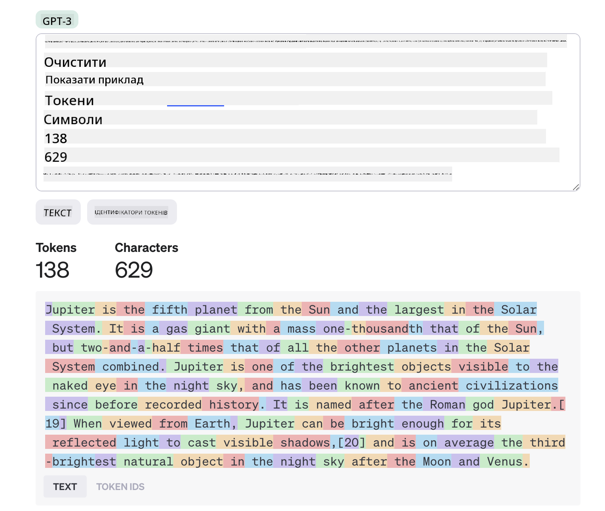
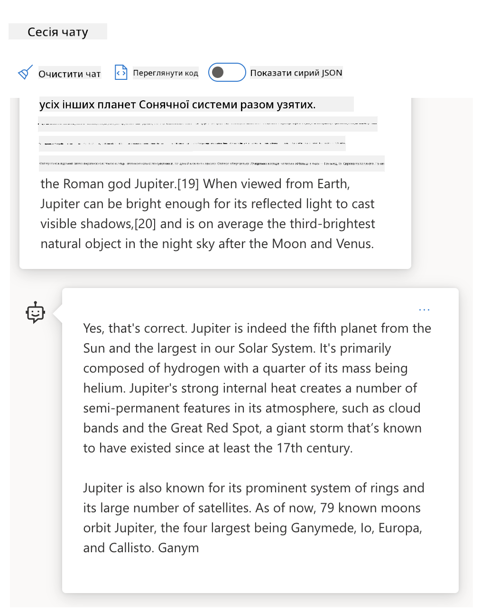
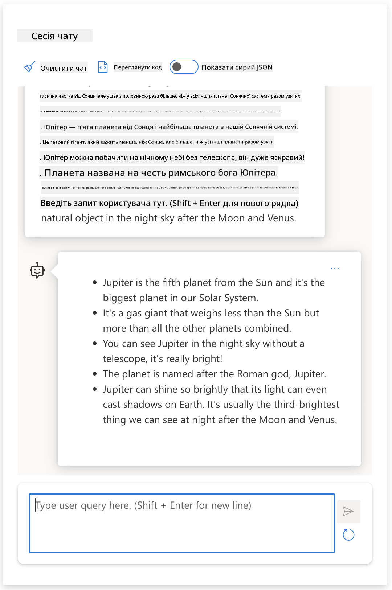
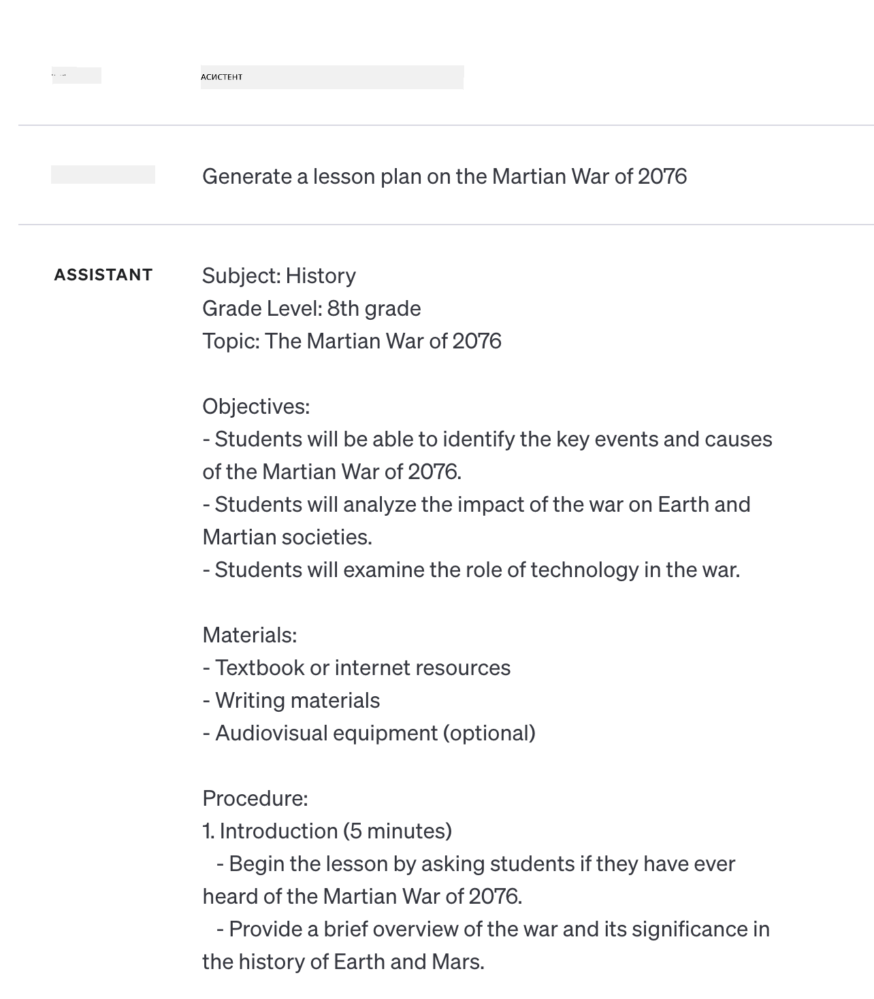

<!--
CO_OP_TRANSLATOR_METADATA:
{
  "original_hash": "dcbaaae026cb50fee071e690685b5843",
  "translation_date": "2025-08-26T20:09:38+00:00",
  "source_file": "04-prompt-engineering-fundamentals/README.md",
  "language_code": "uk"
}
-->
# Основи інженерії підказок

[](https://aka.ms/gen-ai-lesson4-gh?WT.mc_id=academic-105485-koreyst)

## Вступ
У цьому модулі розглядаються ключові поняття та техніки створення ефективних підказок для генеративних AI-моделей. Те, як ви формулюєте підказку для LLM, також має значення. Ретельно продумана підказка може забезпечити кращу якість відповіді. Але що ж насправді означають такі терміни, як _підказка_ та _інженерія підказок_? І як покращити _вхідну підказку_, яку я надсилаю LLM? На ці питання ми спробуємо відповісти у цьому та наступному розділі.

_Генеративний AI_ здатен створювати новий контент (наприклад, текст, зображення, аудіо, код тощо) у відповідь на запити користувача. Це досягається за допомогою _великих мовних моделей_ (LLM), таких як серія GPT ("Generative Pre-trained Transformer") від OpenAI, які навчені працювати з природною мовою та кодом.

Тепер користувачі можуть взаємодіяти з цими моделями у звичному форматі чату, без необхідності мати технічні знання чи проходити спеціальне навчання. Моделі працюють _на основі підказок_ — користувач надсилає текстовий запит (підказку) і отримує відповідь AI (completion). Далі можна "спілкуватися з AI" у кілька етапів, поступово вдосконалюючи підказку, поки відповідь не відповідатиме очікуванням.

"Підказки" стають основним _інтерфейсом програмування_ для генеративних AI-додатків, визначаючи, що має робити модель, і впливаючи на якість отриманих відповідей. "Інженерія підказок" — це стрімко зростаюча галузь, яка зосереджена на _розробці та оптимізації_ підказок для отримання стабільних і якісних відповідей у масштабі.

## Навчальні цілі

У цьому уроці ми дізнаємося, що таке інженерія підказок, чому це важливо і як створювати більш ефективні підказки для конкретної моделі та цілей застосування. Ми розглянемо основні поняття та найкращі практики інженерії підказок, а також познайомимося з інтерактивним середовищем "пісочниці" у Jupyter Notebooks, де ці концепції можна побачити на реальних прикладах.

Після завершення цього уроку ви зможете:

1. Пояснити, що таке інженерія підказок і чому вона важлива.
2. Описати складові підказки та їх використання.
3. Вивчити найкращі практики та техніки інженерії підказок.
4. Застосовувати вивчені техніки на реальних прикладах, використовуючи endpoint OpenAI.

## Ключові терміни

Інженерія підказок: Практика розробки та вдосконалення вхідних даних для спрямування AI-моделей на отримання бажаних результатів.
Токенізація: Процес перетворення тексту на менші одиниці — токени, які модель може розуміти та обробляти.
LLM, налаштовані на інструкції: Великі мовні моделі (LLM), які були додатково навчені на основі конкретних інструкцій для підвищення точності та релевантності відповідей.

## Пісочниця для навчання

Інженерія підказок наразі більше мистецтво, ніж наука. Найкращий спосіб розвинути інтуїцію — _більше практикуватися_ і використовувати підхід проб і помилок, поєднуючи експертизу у предметній області з рекомендованими техніками та оптимізаціями під конкретну модель.

Jupyter Notebook, що супроводжує цей урок, надає _пісочницю_, де ви можете спробувати все на практиці — як під час навчання, так і в рамках завдання наприкінці. Для виконання вправ вам знадобиться:

1. **Ключ API Azure OpenAI** — endpoint сервісу для розгорнутої LLM.
2. **Середовище виконання Python** — для запуску Notebook.
3. **Локальні змінні середовища** — _виконайте кроки з [SETUP](./../00-course-setup/02-setup-local.md?WT.mc_id=academic-105485-koreyst), щоб підготуватися_.

У notebook вже є _стартові_ вправи, але ви можете додавати власні розділи _Markdown_ (опис) та _Code_ (запити-підказки), щоб спробувати більше прикладів чи ідей — і розвивати інтуїцію щодо створення підказок.

## Ілюстрований гід

Хочете отримати загальне уявлення про те, що охоплює цей урок, перш ніж зануритися у деталі? Перегляньте цей ілюстрований гід, який допоможе зрозуміти основні теми та ключові висновки, на які варто звернути увагу. Дорожня карта уроку проведе вас від розуміння базових понять і викликів до їх вирішення за допомогою відповідних технік інженерії підказок і найкращих практик. Зверніть увагу, що розділ "Розширені техніки" у цьому гіді стосується матеріалу, який буде розглянуто у _наступному_ розділі цього курсу.


## Наша стартап-ідея

Тепер поговорімо, як _ця тема_ пов’язана з нашою місією стартапу — [впроваджувати AI-інновації в освіту](https://educationblog.microsoft.com/2023/06/collaborating-to-bring-ai-innovation-to-education?WT.mc_id=academic-105485-koreyst). Ми хочемо створювати AI-додатки для _персоналізованого навчання_ — тож подумаємо, як різні користувачі нашого застосунку можуть "конструювати" підказки:

- **Адміністратори** можуть просити AI _аналізувати дані навчальних програм, щоб виявити прогалини_. AI може підсумувати результати або візуалізувати їх за допомогою коду.
- **Викладачі** можуть просити AI _створити план уроку для певної аудиторії та теми_. AI може скласти персоналізований план у заданому форматі.
- **Студенти** можуть просити AI _допомогти з важким предметом_. AI може проводити навчання, давати підказки та приклади, адаптовані до рівня студента.

І це лише верхівка айсберга. Перегляньте [Prompts For Education](https://github.com/microsoft/prompts-for-edu/tree/main?WT.mc_id=academic-105485-koreyst) — відкриту бібліотеку підказок, яку створили експерти з освіти, — щоб побачити ширші можливості! _Спробуйте запустити деякі з цих підказок у пісочниці або в OpenAI Playground і подивіться, що вийде!_

<!--
ШАБЛОН УРОКУ:
Цей розділ має охоплювати основне поняття №1.
Підкріпіть поняття прикладами та посиланнями.

ПОНЯТТЯ №1:
Інженерія підказок.
Дайте визначення і поясніть, навіщо це потрібно.
-->

## Що таке інженерія підказок?

Ми почали цей урок із визначення **інженерії підказок** як процесу _розробки та оптимізації_ текстових вхідних даних (підказок) для отримання стабільних і якісних відповідей (completions) відповідно до цілей застосування та моделі. Це можна розглядати як двоетапний процес:

- _створення_ початкової підказки для конкретної моделі та мети
- _покрокове вдосконалення_ підказки для підвищення якості відповіді

Це обов’язково процес проб і помилок, який вимагає інтуїції та зусиль користувача для досягнення оптимального результату. Чому це важливо? Щоб відповісти на це питання, спершу потрібно розібратися з трьома поняттями:

- _Токенізація_ = як модель "бачить" підказку
- _Базові LLM_ = як базова модель "обробляє" підказку
- _LLM, налаштовані на інструкції_ = як модель може бачити "завдання"

### Токенізація

LLM сприймає підказки як _послідовність токенів_, причому різні моделі (або версії моделі) можуть токенізувати одну й ту ж підказку по-різному. Оскільки LLM навчаються на токенах (а не на сирому тексті), спосіб токенізації підказки безпосередньо впливає на якість згенерованої відповіді.

Щоб краще зрозуміти, як працює токенізація, спробуйте інструменти на кшталт [OpenAI Tokenizer](https://platform.openai.com/tokenizer?WT.mc_id=academic-105485-koreyst), показаного нижче. Вставте свою підказку — і подивіться, як вона перетворюється на токени, звертаючи увагу на пробіли та розділові знаки. Зверніть увагу, що цей приклад показує старішу LLM (GPT-3) — тому з новішою моделлю результат може відрізнятися.



### Поняття: Базові моделі

Після токенізації підказки основна функція ["базової LLM"](https://blog.gopenai.com/an-introduction-to-base-and-instruction-tuned-large-language-models-8de102c785a6?WT.mc_id=academic-105485-koreyst) (або Foundation model) — передбачити наступний токен у цій послідовності. Оскільки LLM навчені на величезних текстових наборах, вони добре "відчувають" статистичні зв’язки між токенами і можуть робити такі передбачення з певною впевненістю. Водночас вони не розуміють _значення_ слів у підказці чи токені; вони просто бачать шаблон, який можуть "доповнити" наступним передбаченням. Вони можуть продовжувати передбачати послідовність, поки користувач не зупинить процес або не буде досягнуто певної умови.

Хочете побачити, як працює завершення на основі підказки? Введіть підказку вище у [_Chat Playground_ Azure OpenAI Studio](https://oai.azure.com/playground?WT.mc_id=academic-105485-koreyst) з налаштуваннями за замовчуванням. Система налаштована так, щоб сприймати підказки як запити на інформацію — тож ви побачите completion, що відповідає цьому контексту.

Але що, якщо користувач хоче побачити щось конкретне, що відповідає певним критеріям чи завданню? Саме тут у гру вступають LLM, налаштовані на інструкції.



### Поняття: LLM, налаштовані на інструкції

[LLM, налаштована на інструкції](https://blog.gopenai.com/an-introduction-to-base-and-instruction-tuned-large-language-models-8de102c785a6?WT.mc_id=academic-105485-koreyst) починається з базової моделі, яку додатково навчають на прикладах або парах вхід/вихід (наприклад, багатокрокові "повідомлення"), що містять чіткі інструкції — і відповідь AI намагається цим інструкціям слідувати.

Для цього використовуються такі техніки, як навчання з підкріпленням із зворотним зв’язком від людини (RLHF), які дозволяють моделі _дотримуватися інструкцій_ і _вчитися на зворотному зв’язку_, щоб генерувати відповіді, які краще підходять для практичних застосувань і більш релевантні цілям користувача.

Давайте спробуємо — поверніться до підказки вище, але тепер змініть _системне повідомлення_, додавши таку інструкцію як контекст:

> _Підсумуй наданий контент для учня другого класу. Зроби результат у вигляді одного абзацу з 3-5 пунктами._

Бачите, як результат тепер налаштований під бажану мету та формат? Викладач може одразу використати цю відповідь у своїй презентації для класу.



## Навіщо потрібна інженерія підказок?

Тепер, коли ми знаємо, як LLM обробляють підказки, поговорімо, _чому_ нам потрібна інженерія підказок. Причина в тому, що сучасні LLM мають низку особливостей, які ускладнюють отримання _надійних і стабільних відповідей_ без додаткових зусиль щодо створення та оптимізації підказок. Наприклад:

1. **Відповіді моделі стохастичні.** _Одна й та сама підказка_ може дати різні відповіді з різними моделями або версіями моделі. І навіть з _однією й тією ж моделлю_ у різний час результат може відрізнятися. _Техніки інженерії підказок допомагають мінімізувати ці варіації, забезпечуючи кращі обмеження._

1. **Моделі можуть вигадувати відповіді.** Моделі навчені на _великих, але обмежених_ наборах даних, тому не знають про поняття поза цим обсягом. В результаті вони можуть генерувати відповіді, які є неточними, вигаданими або навіть суперечать відомим фактам. _Техніки інженерії підказок допомагають користувачам виявляти та зменшувати такі вигадки, наприклад, просячи AI наводити джерела або пояснювати логіку._

1. **Можливості моделей різняться.** Новіші моделі чи покоління моделей мають ширші можливості, але також свої особливості, компроміси у вартості та складності. _Інженерія підказок допомагає розробити найкращі практики та робочі процеси, які абстрагують ці відмінності та адаптуються до вимог конкретної моделі масштабовано й зручно._

Давайте подивимося це на практиці в OpenAI або Azure OpenAI Playground:

- Використайте одну й ту ж підказку з різними LLM (наприклад, OpenAI, Azure OpenAI, Hugging Face) — чи помітили ви відмінності?
- Використайте одну й ту ж підказку кілька разів з _однією й тією ж_ LLM (наприклад, у Azure OpenAI playground) — як відрізнялися результати?

### Приклад вигадок

У цьому курсі ми використовуємо термін **"вигадка"** для позначення явища, коли LLM іноді генерують фактично некоректну інформацію через обмеження навчання чи інші причини. Можливо, ви також чули термін _"галюцинації"_ у популярних статтях чи наукових роботах. Однак ми наполегливо рекомендуємо використовувати саме _"вигадка"_, щоб не наділяти машину людськими рисами, приписуючи їй людську поведінку. Це також відповідає [принципам відповідального AI](https://www.microsoft.com/ai/responsible-ai?WT.mc_id=academic-105485-koreyst) з точки зору термінології, уникаючи слів, які можуть бути образливими чи неінклюзивними в певних контекстах.


# План уроку: Марсіанська війна 2076 року

## Мета уроку

- Ознайомити учнів з основними подіями та причинами Марсіанської війни 2076 року
- Розвивати навички аналізу історичних подій та їх наслідків
- Заохотити учнів до обговорення етичних та соціальних аспектів міжпланетних конфліктів

## Вступ (10 хвилин)

- Коротко обговоріть, що таке Марсіанська війна 2076 року
- Запитайте учнів, що вони знають про колонізацію Марса та можливі причини конфліктів у космосі

## Основна частина

### 1. Причини війни (15 хвилин)

- Обговоріть політичні, економічні та соціальні передумови війни
- Поясніть роль Землі та марсіанських колоній у виникненні конфлікту

### 2. Хід війни (15 хвилин)

- Огляд основних битв та стратегічних рішень
- Визначте ключові фігури та сторони, що брали участь у війні

### 3. Наслідки війни (10 хвилин)

- Обговоріть зміни у політичній структурі Марса та Землі після війни
- Розгляньте вплив війни на технології, культуру та міжпланетні відносини

## Дискусія (10 хвилин)

- Запропонуйте учням обговорити, чи можна було уникнути війни
- Поставте питання: які уроки людство може винести з цього конфлікту?

## Завдання

- Напишіть коротке есе на тему: "Як Марсіанська війна 2076 року вплинула на майбутнє людства?"
- Підготуйте презентацію про одну з ключових битв або фігур війни

## Додаткові ресурси

- Книги, статті та фільми про Марсіанську війну 2076 року
- Посилання на наукові дослідження з історії колонізації Марса

## Підсумок (5 хвилин)

- Підведіть підсумки уроку, виділіть основні моменти
- Відповідайте на запитання учнів
Веб-пошук показав, що існують вигадані історії (наприклад, телесеріали чи книги) про марсіанські війни — але жодної у 2076 році. Здоровий глузд також підказує, що 2076 рік — це _майбутнє_, а отже, не може бути пов’язаний із реальною подією.

Що ж відбувається, якщо ми запустимо цей запит у різних LLM-провайдерів?

> **Відповідь 1**: OpenAI Playground (GPT-35)



> **Відповідь 2**: Azure OpenAI Playground (GPT-35)


> **Відповідь 3**: : Hugging Face Chat Playground (LLama-2)


Як і очікувалось, кожна модель (або версія моделі) видає трохи різні відповіді завдяки стохастичній природі та відмінностям у можливостях моделей. Наприклад, одна модель орієнтується на аудиторію восьмого класу, а інша — на старшокласників. Але всі три моделі створили відповіді, які могли б переконати необізнаного користувача, що подія була реальною.

Техніки інженерії підказок, такі як _метапромптинг_ та _налаштування температури_, можуть певною мірою зменшити вигадки моделі. Нові _архітектури_ інженерії підказок також інтегрують нові інструменти та методи у процес створення підказок, щоб зменшити або пом’якшити ці ефекти.

## Кейс: GitHub Copilot

Завершимо цей розділ, подивившись, як інженерія підказок використовується у реальних рішеннях на прикладі [GitHub Copilot](https://github.com/features/copilot?WT.mc_id=academic-105485-koreyst).

GitHub Copilot — це ваш "AI-парний програміст": він перетворює текстові підказки на доповнення коду та інтегрується у ваше середовище розробки (наприклад, Visual Studio Code) для максимально зручної роботи. Як описано у серії блогів нижче, найперша версія базувалася на моделі OpenAI Codex — і інженери швидко зрозуміли необхідність донавчання моделі та розробки кращих технік інженерії підказок для підвищення якості коду. У липні вони [представили покращену AI-модель, яка перевершує Codex](https://github.blog/2023-07-28-smarter-more-efficient-coding-github-copilot-goes-beyond-codex-with-improved-ai-model/?WT.mc_id=academic-105485-koreyst) для ще швидших підказок.

Читайте пости у наведеному порядку, щоб простежити їхній шлях навчання.

- **Травень 2023** | [GitHub Copilot краще розуміє ваш код](https://github.blog/2023-05-17-how-github-copilot-is-getting-better-at-understanding-your-code/?WT.mc_id=academic-105485-koreyst)
- **Травень 2023** | [Всередині GitHub: робота з LLM, які стоять за GitHub Copilot](https://github.blog/2023-05-17-inside-github-working-with-the-llms-behind-github-copilot/?WT.mc_id=academic-105485-koreyst).
- **Червень 2023** | [Як писати кращі підказки для GitHub Copilot](https://github.blog/2023-06-20-how-to-write-better-prompts-for-github-copilot/?WT.mc_id=academic-105485-koreyst).
- **Липень 2023** | [.. GitHub Copilot виходить за межі Codex із покращеною AI-моделлю](https://github.blog/2023-07-28-smarter-more-efficient-coding-github-copilot-goes-beyond-codex-with-improved-ai-model/?WT.mc_id=academic-105485-koreyst)
- **Липень 2023** | [Посібник розробника з інженерії підказок та LLM](https://github.blog/2023-07-17-prompt-engineering-guide-generative-ai-llms/?WT.mc_id=academic-105485-koreyst)
- **Вересень 2023** | [Як створити корпоративний LLM-додаток: уроки від GitHub Copilot](https://github.blog/2023-09-06-how-to-build-an-enterprise-llm-application-lessons-from-github-copilot/?WT.mc_id=academic-105485-koreyst)

Ви також можете переглянути їхній [інженерний блог](https://github.blog/category/engineering/?WT.mc_id=academic-105485-koreyst) для інших публікацій, наприклад [цієї](https://github.blog/2023-09-27-how-i-used-github-copilot-chat-to-build-a-reactjs-gallery-prototype/?WT.mc_id=academic-105485-koreyst), яка показує, як ці моделі та техніки _застосовуються_ для створення реальних рішень.

---

## Побудова підказки

Ми вже побачили, чому інженерія підказок важлива — тепер розглянемо, як підказки _конструюються_, щоб ми могли оцінити різні техніки для ефективнішого дизайну підказок.

### Базова підказка

Почнемо з базової підказки: текстовий запит, який надсилається моделі без додаткового контексту. Ось приклад — коли ми надсилаємо перші кілька слів гімну США до OpenAI [Completion API](https://platform.openai.com/docs/api-reference/completions?WT.mc_id=academic-105485-koreyst), вона миттєво _доповнює_ відповідь наступними рядками, демонструючи базову поведінку передбачення.

| Підказка (Вхід)     | Доповнення (Вихід)                                                                                                                        |
| :------------------ | :---------------------------------------------------------------------------------------------------------------------------------------- |
| Oh say can you see  | Здається, ви починаєте слова до "The Star-Spangled Banner", національного гімну США. Повний текст такий: ...                             |

### Складна підказка

Тепер додамо контекст та інструкції до базової підказки. [Chat Completion API](https://learn.microsoft.com/azure/ai-services/openai/how-to/chatgpt?WT.mc_id=academic-105485-koreyst) дозволяє створювати складну підказку як набір _повідомлень_ з:

- Парами вхід/вихід, що відображають _запит користувача_ та _відповідь асистента_.
- Системним повідомленням, яке задає контекст для поведінки чи особистості асистента.

Запит тепер має такий вигляд, де _токенізація_ ефективно захоплює релевантну інформацію з контексту та розмови. Тепер зміна системного контексту може так само сильно впливати на якість відповідей, як і самі вхідні дані користувача.

```python
response = openai.chat.completions.create(
    model="gpt-3.5-turbo",
    messages=[
        {"role": "system", "content": "You are a helpful assistant."},
        {"role": "user", "content": "Who won the world series in 2020?"},
        {"role": "assistant", "content": "The Los Angeles Dodgers won the World Series in 2020."},
        {"role": "user", "content": "Where was it played?"}
    ]
)
```

### Інструктивна підказка

У наведених вище прикладах підказка користувача була простим текстовим запитом, який можна трактувати як прохання надати інформацію. За допомогою _інструктивних_ підказок ми можемо використати цей текст для детальнішого опису завдання, даючи AI чіткіші вказівки. Ось приклад:

| Підказка (Вхід)                                                                                                                                                                                                                         | Доповнення (Вихід)                                                                                                        | Тип інструкції      |
| :-------------------------------------------------------------------------------------------------------------------------------------------------------------------------------------------------------------------------------------- | :------------------------------------------------------------------------------------------------------------------------ | :------------------ |
| Напиши опис Громадянської війни                                                                                                                                                                   | _повернуто простий абзац_                                                                                                | Проста              |
| Напиши опис Громадянської війни. Вкажи ключові дати та події і опиши їхнє значення                                                                                                                | _повернуто абзац, а далі список ключових дат подій із описами_                                                            | Складна             |
| Напиши опис Громадянської війни в 1 абзаці. Додай 3 марковані пункти з ключовими датами та їх значенням. Додай ще 3 пункти з ключовими історичними постатями та їх внеском. Поверни результат у форматі JSON | _повернуто детальнішу інформацію у текстовому полі, відформатовану як JSON, яку можна скопіювати у файл і перевірити_     | Складна. Форматована. |

## Основний контент

У наведених вище прикладах підказка залишалася досить відкритою, дозволяючи LLM самостійно визначати, яка частина її попередньо навченого датасету є релевантною. З _патерном основного контенту_ вхідний текст ділиться на дві частини:

- інструкція (дія)
- релевантний контент (який впливає на дію)

Ось приклад, де інструкція — "підсумуй це у 2 реченнях".

| Підказка (Вхід)                                                                                                                                                                                                                                                                                                                                                                                                                                                                                                                                                                                                                                                                                      | Доповнення (Вихід)                                                                                                                                                                                                                                                                             |
| :-------------------------------------------------------------------------------------------------------------------------------------------------------------------------------------------------------------------------------------------------------------------------------------------------------------------------------------------------------------------------------------------------------------------------------------------------------------------------------------------------------------------------------------------------------------------------------------------------------------------------------------------------------------------------------------------------- | :---------------------------------------------------------------------------------------------------------------------------------------------------------------------------------------------------------------------------------------------------------------------------------------------- |
| Юпітер — п’ята планета від Сонця і найбільша у Сонячній системі. Це газовий гігант із масою, що становить одну тисячну від маси Сонця, але у два з половиною рази перевищує масу всіх інших планет Сонячної системи разом узятих. Юпітер — один із найяскравіших об’єктів, видимих неозброєним оком у нічному небі, і був відомий стародавнім цивілізаціям ще до появи писемності. Він названий на честь римського бога Юпітера.[19] З Землі Юпітер може бути настільки яскравим, що його відбите світло створює видимі тіні,[20] і в середньому є третім за яскравістю природним об’єктом у нічному небі після Місяця і Венери. <br/> **Підсумуй це у 2 коротких реченнях** | Юпітер — п’ята планета від Сонця, найбільша у Сонячній системі та відома як один із найяскравіших об’єктів нічного неба. Названий на честь римського бога Юпітера, це газовий гігант, маса якого у два з половиною рази перевищує масу всіх інших планет Сонячної системи разом узятих. |

Сегмент основного контенту можна використовувати по-різному для ефективнішого формулювання інструкцій:

- **Приклади** — замість того, щоб прямо казати моделі, що робити, дайте їй приклади бажаного результату і дозвольте вивести закономірність.
- **Підказки (cues)** — після інструкції дайте "підказку", яка налаштовує модель на потрібний формат відповіді.
- **Шаблони** — це повторювані "рецепти" підказок із заповнювачами (змінними), які можна підставляти для конкретних задач.

Давайте розглянемо ці підходи на практиці.

### Використання прикладів

Цей підхід полягає у тому, щоб "нагодувати модель" прикладами бажаного результату для певної інструкції і дозволити їй самостійно вивести закономірність. Залежно від кількості прикладів, це може бути zero-shot, one-shot, few-shot підказки тощо.

Підказка тепер складається з трьох компонентів:

- Опис завдання
- Кілька прикладів бажаного результату
- Початок нового прикладу (який стає неявною інструкцією)

| Тип навчання | Підказка (Вхід)                                                                                                                                        | Доповнення (Вихід)         |
| :----------- | :----------------------------------------------------------------------------------------------------------------------------------------------------- | :------------------------- |
| Zero-shot    | "The Sun is Shining". Translate to Spanish                                                                                                             | "El Sol está brillando".   |
| One-shot     | "The Sun is Shining" => ""El Sol está brillando". <br> "It's a Cold and Windy Day" =>                                                                  | "Es un día frío y ventoso".|
| Few-shot     | The player ran the bases => Baseball <br/> The player hit an ace => Tennis <br/> The player hit a six => Cricket <br/> The player made a slam-dunk => | Basketball                 |
|              |                                                                                                                                                        |                            |

Зверніть увагу, що у zero-shot-підказці ми мусили дати явну інструкцію ("Translate to Spanish"), але у one-shot-прикладі вона вже виводиться з контексту. Few-shot-приклад показує, як додавання ще кількох прикладів дозволяє моделі робити точніші висновки без додаткових інструкцій.

### Підказки (Cues) у промптах

Ще одна техніка використання основного контенту — це надання _підказок_ замість прикладів. У цьому випадку ми "підштовхуємо" модель у потрібному напрямку, _починаючи_ відповідь фрагментом, який відображає бажаний формат. Модель підхоплює цю підказку і продовжує у тому ж стилі.

| Кількість підказок | Підказка (Вхід)                                                                                                                                                                                                                                                                                                                                                                                                                                               | Доповнення (Вихід)                                                                                                                                                                                                                                                                                       |
| :----------------- | :----------------------------------------------------------------------------------------------------------------------------------------------------------------------------------------------------------------------------------------------------------------------------------------------------------------------------------------------------------------------------------------------------------------------------------------------------------- | :-------------------------------------------------------------------------------------------------------------------------------------------------------------------------------------------------------------------------------------------------------------------------------------------------------- |
| 0                  | Юпітер — п’ята планета від Сонця і найбільша у Сонячній системі. Це газовий гігант із масою, що становить одну тисячну від маси Сонця, але у два з половиною рази перевищує масу всіх інших планет Сонячної системи разом узятих. Юпітер — один із найяскравіших об’єктів, видимих неозброєним оком у нічному небі, і був відомий стародавнім цивілізаціям ще до появи писемності.

**Підсумуй це**                                       | Юпітер — найбільша планета Сонячної системи та п’ята від Сонця. Це газовий гігант із масою, що становить одну тисячну маси Сонця, але він важчий за всі інші планети разом узяті. Юпітер був відомий ще давнім цивілізаціям і легко помітний на нічному небі. |
| 1              | Юпітер — п’ята планета від Сонця і найбільша в Сонячній системі. Це газовий гігант із масою, що становить одну тисячну маси Сонця, але у два з половиною рази важчий за всі інші планети разом узяті. Юпітер — один із найяскравіших об’єктів, які можна побачити неозброєним оком на нічному небі, і був відомий ще до появи писемності. <br/>**Підсумуй це** <br/> Ми дізналися, що Юпітер | є п’ятою планетою від Сонця і найбільшою в Сонячній системі. Це газовий гігант із масою, що становить одну тисячну маси Сонця, але у два з половиною рази важчий за всі інші планети разом узяті. Його легко побачити неозброєним оком, і він був відомий ще з давніх часів.                        |
| 2              | Юпітер — п’ята планета від Сонця і найбільша в Сонячній системі. Це газовий гігант із масою, що становить одну тисячну маси Сонця, але у два з половиною рази важчий за всі інші планети разом узяті. Юпітер — один із найяскравіших об’єктів, які можна побачити неозброєним оком на нічному небі, і був відомий ще до появи писемності. <br/>**Підсумуй це** <br/> Топ-3 факти, які ми дізналися:         | 1. Юпітер — п’ята планета від Сонця і найбільша в Сонячній системі. <br/> 2. Це газовий гігант із масою, що становить одну тисячну маси Сонця...<br/> 3. Юпітер був видимий неозброєним оком ще з давніх часів ...                                                                       |
|                |                                                                                                                                                                                                                                                                                                                                                                                                                                                              |                                                                                                                                                                                                                                                                                                           |

### Шаблони підказок

Шаблон підказки — це _заздалегідь підготовлений рецепт для підказки_, який можна зберігати та використовувати повторно, щоб забезпечити більш стабільний досвід для користувачів у масштабі. У найпростішому вигляді це просто набір прикладів підказок, як [цей від OpenAI](https://platform.openai.com/examples?WT.mc_id=academic-105485-koreyst), що містить як інтерактивні компоненти підказки (повідомлення користувача та системи), так і формат запиту для API — для підтримки повторного використання.

У складнішому вигляді, як [цей приклад від LangChain](https://python.langchain.com/docs/concepts/prompt_templates/?WT.mc_id=academic-105485-koreyst), він містить _заповнювачі_, які можна замінити даними з різних джерел (введення користувача, контекст системи, зовнішні джерела даних тощо) для динамічного створення підказки. Це дозволяє створювати бібліотеку підказок, які можна використовувати для забезпечення стабільного досвіду для користувачів **програмно** у масштабі.

Справжня цінність шаблонів полягає у можливості створювати та публікувати _бібліотеки підказок_ для окремих галузей — де шаблон підказки вже _оптимізований_ з урахуванням специфіки застосування або прикладів, що робить відповіді більш релевантними та точними для цільової аудиторії. Репозиторій [Prompts For Edu](https://github.com/microsoft/prompts-for-edu?WT.mc_id=academic-105485-koreyst) — чудовий приклад такого підходу, де зібрано бібліотеку підказок для освітньої сфери з акцентом на ключові завдання, як-от планування уроків, розробка навчальних програм, репетиторство тощо.

## Додатковий контент

Якщо розглядати створення підказки як поєднання інструкції (завдання) та основного (цільового) контенту, то _додатковий контент_ — це додатковий контекст, який ми надаємо, щоб **вплинути на результат**. Це можуть бути параметри налаштування, інструкції щодо форматування, тематичні таксономії тощо, які допомагають моделі _адаптувати_ свою відповідь під бажані цілі чи очікування користувача.

Наприклад: маючи каталог курсів із розгорнутою метаданими (назва, опис, рівень, теги, викладач тощо) для всіх доступних курсів у навчальній програмі:

- ми можемо задати інструкцію "підсумуй каталог курсів на осінь 2023"
- використати основний контент, щоб надати кілька прикладів бажаного результату
- використати додатковий контент, щоб визначити топ-5 "тегів", які нас цікавлять.

Тепер модель може надати підсумок у форматі, показаному в прикладах, але якщо результат має кілька тегів, вона може пріоритезувати 5 тегів, визначених у додатковому контенті.

---

<!--
Шаблон уроку:
Цей розділ має охопити основну концепцію №1.
Підкріпіть концепцію прикладами та посиланнями.

КОНЦЕПЦІЯ №3:
Техніки інженерії підказок.
Які базові техніки інженерії підказок?
Поясніть це на прикладах.
-->

## Кращі практики створення підказок

Тепер, коли ми знаємо, як можна _створювати_ підказки, варто подумати, як їх _дизайнити_, щоб дотримуватися кращих практик. Це можна розділити на дві частини — правильний _підхід_ і застосування відповідних _технік_.

### Підхід до інженерії підказок

Інженерія підказок — це процес проб і помилок, тому варто пам’ятати про три основні орієнтири:

1. **Розуміння домену має значення.** Точність і релевантність відповіді залежать від _домену_, в якому працює додаток чи користувач. Використовуйте свою інтуїцію та експертизу, щоб **додатково адаптувати техніки**. Наприклад, визначайте _доменні персоналії_ у системних підказках або використовуйте _доменні шаблони_ у підказках користувача. Додавайте додатковий контент, що відображає специфіку домену, або використовуйте _доменні сигнали та приклади_, щоб спрямувати модель до знайомих патернів.

2. **Розуміння моделі має значення.** Ми знаємо, що моделі мають стохастичну природу. Але реалізації моделей також можуть відрізнятися за навчальним датасетом (попередні знання), можливостями (наприклад, через API чи SDK) та типом контенту, для якого вони оптимізовані (код, зображення, текст). Розумійте сильні та слабкі сторони моделі, яку використовуєте, і використовуйте ці знання для _пріоритезації завдань_ або створення _адаптованих шаблонів_, оптимізованих під можливості моделі.

3. **Ітерації та валідація мають значення.** Моделі швидко розвиваються, як і техніки інженерії підказок. Як експерт у домені, ви можете мати додатковий контекст чи критерії для _вашого_ додатку, які не завжди актуальні для ширшої спільноти. Використовуйте інструменти та техніки інженерії підказок, щоб "запустити" створення підказки, потім ітеруйте та перевіряйте результати, спираючись на свою інтуїцію та експертизу. Фіксуйте свої інсайти та створюйте **базу знань** (наприклад, бібліотеки підказок), яку зможуть використовувати інші для швидших ітерацій у майбутньому.

## Кращі практики

Ось поширені кращі практики, які рекомендують фахівці [OpenAI](https://help.openai.com/en/articles/6654000-best-practices-for-prompt-engineering-with-openai-api?WT.mc_id=academic-105485-koreyst) та [Azure OpenAI](https://learn.microsoft.com/azure/ai-services/openai/concepts/prompt-engineering#best-practices?WT.mc_id=academic-105485-koreyst).

| Що                              | Чому                                                                                                                                                                                                                                               |
| :-------------------------------- | :------------------------------------------------------------------------------------------------------------------------------------------------------------------------------------------------------------------------------------------------ |
| Оцінюйте найновіші моделі.       | Нові покоління моделей, ймовірно, мають кращі функції та якість — але можуть бути дорожчими. Оцініть їхній вплив, а потім приймайте рішення щодо міграції.                                                                                |
| Відокремлюйте інструкції та контекст   | Перевірте, чи ваш провайдер/модель визначає _роздільники_ для чіткого розмежування інструкцій, основного та додаткового контенту. Це допоможе моделі точніше розставляти пріоритети для токенів.                                                         |
| Будьте конкретними та чіткими             | Давайте більше деталей про бажаний контекст, результат, довжину, формат, стиль тощо. Це покращить якість і стабільність відповідей. Зберігайте рецепти у шаблонах для повторного використання.                                                          |
| Будьте описовими, використовуйте приклади      | Моделі краще реагують на підхід "покажи і розкажи". Почніть із `zero-shot` — дайте інструкцію (без прикладів), потім спробуйте `few-shot` для уточнення, надаючи кілька прикладів бажаного результату. Використовуйте аналогії. |
| Використовуйте сигнали для старту відповіді | Підштовхніть модель до бажаного результату, давши їй кілька початкових слів чи фраз, які вона може використати як старт для відповіді.                                                                                                               |
| Повторюйте                       | Іноді потрібно повторити інструкцію для моделі. Дайте інструкцію до і після основного контенту, використовуйте інструкцію та сигнал тощо. Ітеруйте та перевіряйте, що працює.                                                         |
| Порядок має значення                     | Порядок подання інформації моделі може впливати на результат, навіть у навчальних прикладах, через ефект недавності. Спробуйте різні варіанти, щоб знайти найкращий.                                                               |
| Дайте моделі "запасний вихід"           | Дайте моделі _альтернативну_ відповідь, яку вона може надати, якщо не може виконати завдання. Це зменшує ймовірність отримання неправдивих чи вигаданих відповідей.                                                         |
|                                   |                                                                                                                                                                                                                                                   |

Як і з будь-якими кращими практиками, пам’ятайте, що _ваш досвід може відрізнятися_ залежно від моделі, завдання та домену. Використовуйте ці поради як стартову точку, ітеруйте, щоб знайти найкраще для себе. Постійно переглядайте процес інженерії підказок із появою нових моделей та інструментів, з акцентом на масштабованість процесу та якість відповідей.

<!--
Шаблон уроку:
Цей розділ має містити завдання з кодом, якщо це доречно

ЗАВДАННЯ:
Посилання на Jupyter Notebook, де в інструкціях є лише коментарі (код порожній).

РІШЕННЯ:
Посилання на копію цього Notebook із заповненими та виконаними підказками, що показує один приклад.
-->

## Завдання

Вітаємо! Ви дійшли до кінця уроку! Час перевірити деякі з цих концепцій і технік на реальних прикладах!

Для завдання ми використаємо Jupyter Notebook із вправами, які можна виконувати інтерактивно. Ви також можете доповнювати Notebook власними Markdown- і Code-комірками, щоб досліджувати ідеї та техніки самостійно.

### Щоб почати, зробіть форк репозиторію, потім

- (Рекомендовано) Запустіть GitHub Codespaces
- (Альтернатива) Клонуйте репозиторій на свій пристрій і використовуйте з Docker Desktop
- (Альтернатива) Відкрийте Notebook у вашому улюбленому середовищі для Notebook.

### Далі налаштуйте змінні середовища

- Скопіюйте файл `.env.copy` з кореня репозиторію у `.env` і заповніть значення `AZURE_OPENAI_API_KEY`, `AZURE_OPENAI_ENDPOINT` та `AZURE_OPENAI_DEPLOYMENT`. Поверніться до [розділу Learning Sandbox](../../../04-prompt-engineering-fundamentals/04-prompt-engineering-fundamentals), щоб дізнатися як.

### Далі відкрийте Jupyter Notebook

- Виберіть ядро виконання. Якщо використовуєте варіанти 1 або 2, просто виберіть стандартне ядро Python 3.10.x, яке надає dev-контейнер.

Ви готові виконувати вправи. Зверніть увагу, що тут немає _правильних чи неправильних_ відповідей — просто досліджуйте варіанти методом проб і помилок та формуйте інтуїцію щодо того, що працює для конкретної моделі та сфери застосування.

_Тому в цьому уроці немає сегментів із рішенням коду. Натомість у Notebook будуть Markdown-комірки з назвою "Моє рішення:", де показано один приклад для довідки._

 <!--
Шаблон уроку:
Завершіть розділ підсумком і ресурсами для самостійного навчання.
-->

## Перевірка знань

Яка з наступних підказок є хорошою і відповідає розумним кращим практикам?

1. Покажи мені зображення червоного автомобіля
2. Покажи мені зображення червоного автомобіля марки Volvo, моделі XC90, припаркованого біля скелі на заході сонця
3. Покажи мені зображення червоного автомобіля марки Volvo, моделі XC90

Відповідь: 2, це найкраща підказка, оскільки вона містить деталі про "що саме" і конкретизує (не просто будь-який автомобіль, а певна марка і модель), а також описує загальну обстановку. 3 — наступна за якістю, бо теж містить багато опису.

## 🚀 Виклик

Спробуйте використати техніку "сигналу" з підказкою: Доповни речення "Покажи мені зображення червоного автомобіля марки Volvo і ". Що модель відповість, і як би ви це покращили?

## Чудова робота! Продовжуйте навчання

Хочете дізнатися більше про різні концепції інженерії підказок? Перейдіть на [сторінку для продовження навчання](https://aka.ms/genai-collection?WT.mc_id=academic-105485-koreyst), щоб знайти інші корисні ресурси з цієї теми.

Переходьте до уроку 5, де ми розглянемо [просунуті техніки створення підказок](../05-advanced-prompts/README.md?WT.mc_id=academic-105485-koreyst)!

---

**Відмова від відповідальності**:  
Цей документ було перекладено за допомогою сервісу автоматичного перекладу [Co-op Translator](https://github.com/Azure/co-op-translator). Хоча ми прагнемо до точності, звертаємо вашу увагу, що автоматичний переклад може містити помилки або неточності. Оригінальний документ рідною мовою слід вважати авторитетним джерелом. Для отримання критично важливої інформації рекомендується професійний людський переклад. Ми не несемо відповідальності за будь-які непорозуміння або неправильне тлумачення, що виникли внаслідок використання цього перекладу.