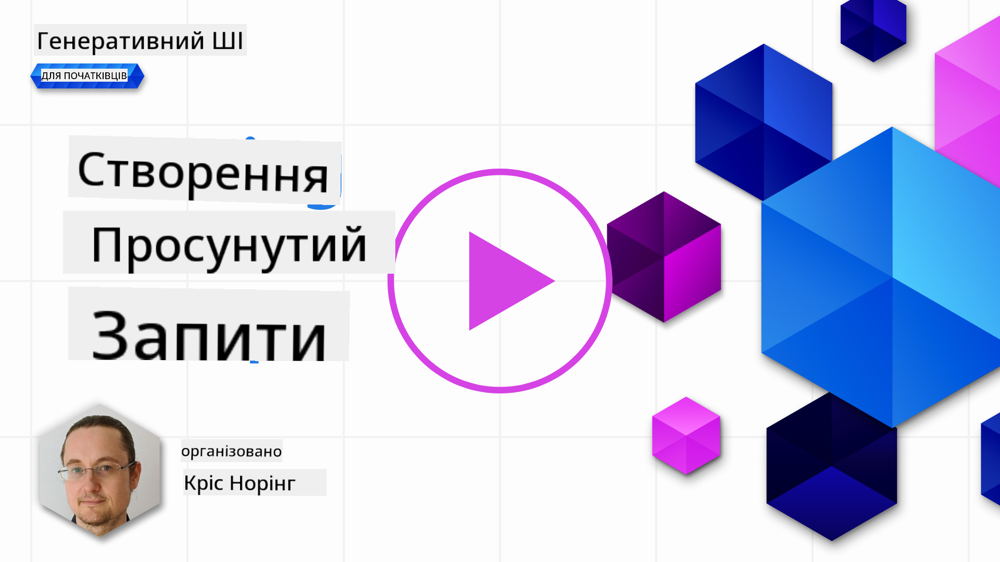

<!--
CO_OP_TRANSLATOR_METADATA:
{
  "original_hash": "b2651fb16bcfbc62b8e518751ed90fdb",
  "translation_date": "2025-10-18T02:10:05+00:00",
  "source_file": "05-advanced-prompts/README.md",
  "language_code": "uk"
}
-->
# Створення розширених підказок

[](https://youtu.be/BAjzkaCdRok?si=NmUIyRf7-cDgbjtt)

Давайте згадаємо деякі уроки з попереднього розділу:

> Інженерія підказок — це процес, за допомогою якого ми **спрямовуємо модель до більш релевантних відповідей**, надаючи корисніші інструкції або контекст.

Також є два етапи написання підказок: створення підказки, надаючи релевантний контекст, і _оптимізація_, тобто поступове покращення підказки.

На цьому етапі ми маємо базове розуміння того, як писати підказки, але нам потрібно заглибитися. У цьому розділі ви перейдете від спроб створення різних підказок до розуміння, чому одна підказка краща за іншу. Ви дізнаєтеся, як створювати підказки, дотримуючись основних технік, які можна застосувати до будь-якої LLM.

## Вступ

У цьому розділі ми розглянемо такі теми:

- Розширення знань про інженерію підказок, застосовуючи різні техніки до ваших підказок.
- Налаштування ваших підказок для варіації результатів.

## Навчальні цілі

Після завершення цього уроку ви зможете:

- Застосовувати техніки інженерії підказок, які покращують результати ваших підказок.
- Виконувати підказки, які є або варіативними, або детермінованими.

## Інженерія підказок

Інженерія підказок — це процес створення підказок, які дадуть бажаний результат. Інженерія підказок — це не просто написання текстової підказки. Це не стільки інженерна дисципліна, скільки набір технік, які можна застосувати для досягнення бажаного результату.

### Приклад підказки

Візьмемо базову підказку, наприклад:

> Згенеруйте 10 запитань з географії.

У цій підказці ви фактично застосовуєте набір різних технік підказок.

Розглянемо це детальніше.

- **Контекст**, ви вказуєте, що це має бути про "географію".
- **Обмеження результату**, ви хочете отримати не більше 10 запитань.

### Обмеження простих підказок

Можливо, ви отримаєте бажаний результат, а можливо, й ні. Ви отримаєте згенеровані запитання, але географія — це велика тема, і ви можете не отримати те, що хочете, через такі причини:

- **Велика тема**, ви не знаєте, чи це буде про країни, столиці, річки тощо.
- **Формат**, що, якщо ви хочете, щоб запитання були відформатовані певним чином?

Як бачите, є багато аспектів, які слід враховувати при створенні підказок.

Досі ми бачили простий приклад підказки, але генеративний штучний інтелект здатний на набагато більше, щоб допомогти людям у різних ролях і галузях. Давайте розглянемо деякі базові техніки далі.

### Техніки створення підказок

Спочатку нам потрібно зрозуміти, що створення підказок є _виникаючою_ властивістю LLM, тобто це не функція, яка вбудована в модель, а те, що ми відкриваємо, використовуючи модель.

Існує кілька базових технік, які ми можемо використовувати для створення підказок для LLM. Давайте їх розглянемо.

- **Zero-shot підказки**, це найпростіша форма підказок. Це одна підказка, яка запитує відповідь у LLM, базуючись виключно на її навчальних даних.
- **Few-shot підказки**, цей тип підказок спрямовує LLM, надаючи 1 або більше прикладів, на які вона може спиратися для генерації відповіді.
- **Ланцюжок думок**, цей тип підказок вчить LLM розбивати проблему на кроки.
- **Згенеровані знання**, для покращення відповіді на підказку ви можете додатково надати згенеровані факти або знання.
- **Від простого до складного**, як і ланцюжок думок, ця техніка полягає в розбитті проблеми на серію кроків і подальшому виконанні цих кроків у порядку.
- **Самоудосконалення**, ця техніка полягає в критиці відповіді LLM і подальшому запиті на її покращення.
- **Маєвтична підказка**. Тут ви хочете переконатися, що відповідь LLM є правильною, і просите її пояснити різні частини відповіді. Це форма самоудосконалення.

### Zero-shot підказки

Цей стиль підказок дуже простий, він складається з однієї підказки. Ця техніка, ймовірно, є тим, що ви використовуєте, коли починаєте вивчати LLM. Ось приклад:

- Підказка: "Що таке алгебра?"
- Відповідь: "Алгебра — це розділ математики, який вивчає математичні символи та правила для маніпулювання цими символами."

### Few-shot підказки

Цей стиль підказок допомагає моделі, надаючи кілька прикладів разом із запитом. Він складається з однієї підказки з додатковими даними, специфічними для завдання. Ось приклад:

- Підказка: "Напишіть вірш у стилі Шекспіра. Ось кілька прикладів шекспірівських сонетів:
  Сонет 18: 'Чи порівняю тебе з літнім днем? Ти прекрасніший і лагідніший...'
  Сонет 116: 'Не дозволю шлюбу справжніх сердець перешкоджати. Любов — не любов, яка змінюється, коли змінюється...'
  Сонет 132: 'Твої очі я люблю, і вони, як жаліючи мене, Знаючи твоє серце, мучать мене зневагою,...'
  Тепер напишіть сонет про красу місяця."
- Відповідь: "На небі місяць м'яко сяє, У сріблястому світлі, що ніжно сяє,..."

Приклади надають LLM контекст, формат або стиль бажаного результату. Вони допомагають моделі зрозуміти конкретне завдання та генерувати більш точні та релевантні відповіді.

### Ланцюжок думок

Ланцюжок думок — це дуже цікава техніка, оскільки вона полягає в тому, щоб провести LLM через серію кроків. Ідея полягає в тому, щоб інструктувати LLM таким чином, щоб вона зрозуміла, як щось зробити. Розглянемо наступний приклад, з ланцюжком думок і без нього:

    - Підказка: "У Аліси 5 яблук, вона викидає 3 яблука, дає 2 Бобу, а Боб повертає одне, скільки яблук залишилося у Аліси?"
    - Відповідь: 5

LLM відповідає 5, що є неправильним. Правильна відповідь — 1 яблуко, враховуючи розрахунок (5 - 3 - 2 + 1 = 1).

Як ми можемо навчити LLM робити це правильно?

Спробуємо ланцюжок думок. Застосування ланцюжка думок означає:

1. Надати LLM схожий приклад.
1. Показати розрахунок і як його правильно виконати.
1. Надати оригінальну підказку.

Ось як це виглядає:

- Підказка: "У Лізи 7 яблук, вона викидає 1 яблуко, дає 4 яблука Барту, а Барт повертає одне:
  7 - 1 = 6
  6 - 4 = 2
  2 + 1 = 3  
  У Аліси 5 яблук, вона викидає 3 яблука, дає 2 Бобу, а Боб повертає одне, скільки яблук залишилося у Аліси?"
  Відповідь: 1

Зверніть увагу, як ми пишемо значно довші підказки з іншим прикладом, розрахунком, а потім оригінальною підказкою, і ми отримуємо правильну відповідь 1.

Як бачите, ланцюжок думок — це дуже потужна техніка.

### Згенеровані знання

Часто, коли ви хочете створити підказку, ви хочете зробити це, використовуючи дані вашої компанії. Ви хочете, щоб частина підказки була від компанії, а інша частина — це власне підказка, яка вас цікавить.

Наприклад, ось як може виглядати ваша підказка, якщо ви працюєте в страховому бізнесі:

```text
{{company}}: {{company_name}}
{{products}}:
{{products_list}}
Please suggest an insurance given the following budget and requirements:
Budget: {{budget}}
Requirements: {{requirements}}
```

Вище ви бачите, як підказка створюється за допомогою шаблону. У шаблоні є кілька змінних, позначених `{{variable}}`, які будуть замінені фактичними значеннями з API компанії.

Ось приклад того, як підказка може виглядати після заміни змінних на вміст вашої компанії:

```text
Insurance company: ACME Insurance
Insurance products (cost per month):
- Car, cheap, 500 USD
- Car, expensive, 1100 USD
- Home, cheap, 600 USD
- Home, expensive, 1200 USD
- Life, cheap, 100 USD

Please suggest an insurance given the following budget and requirements:
Budget: $1000
Requirements: Car, Home, and Life insurance
```

Запуск цієї підказки через LLM дасть відповідь на кшталт:

```output
Given the budget and requirements, we suggest the following insurance package from ACME Insurance:
- Car, cheap, 500 USD
- Home, cheap, 600 USD
- Life, cheap, 100 USD
Total cost: $1,200 USD
```

Як бачите, вона також пропонує страхування життя, чого не повинно бути. Цей результат свідчить про те, що нам потрібно оптимізувати підказку, зробивши її чіткішою щодо того, що дозволено. Після кількох _спроб і помилок_ ми приходимо до наступної підказки:

```text
Insurance company: ACME Insurance
Insurance products (cost per month):
- type: Car, cheap, cost: 500 USD
- type: Car, expensive, cost: 1100 USD
- type: Home, cheap, cost: 600 USD
- type: Home, expensive, cost: 1200 USD
- type: Life, cheap, cost: 100 USD

Please suggest an insurance given the following budget and requirements:
Budget: $1000 restrict choice to types: Car, Home
```

Зверніть увагу, як додавання _типу_ і _вартості_, а також використання ключового слова _обмежити_ допомагає LLM зрозуміти, чого ми хочемо.

Тепер ми отримуємо наступну відповідь:

```output
Given the budget and requirements, we suggest the Car, Cheap insurance product which costs 500 USD per month.
```

Мета цього прикладу полягала в тому, щоб показати, що навіть якщо ми використовуємо базову техніку, як _згенеровані знання_, у більшості випадків нам все одно потрібно оптимізувати підказку, щоб отримати бажаний результат.

### Від простого до складного

Ідея техніки "Від простого до складного" полягає в тому, щоб розбити більшу проблему на підпроблеми. Таким чином, ви допомагаєте LLM "подолати" більшу проблему. Хорошим прикладом може бути завдання з аналізу даних, де ви можете попросити LLM розділити проблему таким чином:

> Підказка: Як виконати аналіз даних у 5 кроків?

Ваш AI-асистент відповість:

1. Збір даних  
2. Очищення даних  
3. Аналіз даних  
4. Візуалізація даних  
5. Презентація даних  

### Самоудосконалення, критика результатів

З генеративними AI та LLM не можна повністю довіряти результатам. Їх потрібно перевіряти. Адже LLM просто пропонує те, що, на її думку, є найбільш вірогідним наступним кроком, а не те, що є правильним. Тому гарною ідеєю є попросити LLM критикувати саму себе, що приводить нас до техніки самоудосконалення.

Як це працює:

1. Початкова підказка з проханням до LLM вирішити проблему.  
1. LLM відповідає.  
1. Ви критикуєте відповідь і просите AI покращити її.  
1. LLM відповідає знову, цього разу враховуючи критику і пропонуючи рішення, які вона придумала.  

Цей процес можна повторювати стільки разів, скільки потрібно.

Ось приклад використання цієї техніки:

> Підказка: "Створіть Python Web API з маршрутами для продуктів і клієнтів"

Відповідь AI:

```python
import flask
app = Flask(__name__)

@app.route('/products')
def products():
    return 'Products'

@app.route('/customers')
def customers():
    return 'Customers'
```

> Підказка: запропонуйте 3 покращення для наведеного коду

Відповідь AI:

```text
Sure, here are three suggestions to improve the code:

Import the correct module: The first line should import Flask instead of flask. The correct import statement should be from flask import Flask.

Add a main function: Add a if __name__ == '__main__': block to the end of the file to run the application when the file is executed.

Use f-strings: Use f-strings to format the return statements in the route functions. For example, return 'Products' can be changed to return f'This is the {request.path} page'.
```

```python
from flask import Flask, request

app = Flask(__name__)

@app.route('/products')
def products():
    return f'This is the {request.path} page'

@app.route('/customers')
def customers():
    return f'This is the {request.path} page'

if __name__ == '__main__':
    app.run()
```

Як бачите, наведена вище відповідь AI покращує перший запропонований код завдяки критиці першої відповіді.

### Маєвтична підказка

Маєвтична підказка — це техніка, схожа на самоудосконалення, але більше спрямована на те, щоб попросити LLM пояснити себе. Мета полягає в тому, щоб зменшити невідповідності у відповіді LLM, щоб переконатися, що вона приходить до правильної відповіді. Алгоритм дій:

1. Попросіть LLM відповісти на запитання.  
1. Для кожної частини відповіді попросіть LLM пояснити її детальніше.  
1. Якщо є невідповідності, відкиньте частини, які не відповідають дійсності.  

Повторюйте кроки 2 і 3, поки не переглянете всі частини і не будете задоволені відповіддю.

Ось приклад підказки:

> Підказка: Як створити план дій у разі пандемії у 5 кроків?  
> Відповідь LLM:

```text
1. Identify the risks
1. Identify the stakeholders
1. Identify the resources
1. Identify the actions
1. Identify the communication channels
```

Вона визначила 5 кроків, але чи можемо ми визначити, чи це правильно? Давайте попросимо LLM пояснити кожен крок детальніше:

> Підказка: Поясніть перший крок детальніше, які ризики детально пов'язані з пандемією?

```text
The risks are the following:

- Loss of life
- Loss of business
- Loss of reputation
- Loss of customers
- Loss of employees
```

На цьому етапі ми хочемо переконатися, що LLM права, тому ми просимо її пояснити перший ризик детальніше і сподіваємося, що це буде узгоджено з попередньою відповіддю:

> Підказка: У пандемії, який найбільший ризик і чому?

```text
The biggest risk is loss of life because it's the most important thing to protect.
```

> Які два найбільші ризики у пандемії?

```text
The two biggest risks are loss of life and loss of business.
```

На цьому етапі LLM узгоджена і згадує "життя" та "бізнес" як два найбільші ризики. Тепер ми можемо перейти до наступного кроку і бути досить впевненими. Однак ми не повинні сліпо довіряти LLM, завжди слід перевіряти результат.

## Варіюйте ваші результати

LLM за своєю природою є недетермінованими, тобто ви отримаєте різні результати щоразу, коли запускаєте одну й ту ж підказку. Спробуйте наступну підказку, наприклад:

> "Згенеруйте код для Python Web API"

```python
# Import necessary modules
import flask
from flask import request, jsonify

# Create a Flask app
app = flask.Flask(__name__)

# Create a route for the API
@app.route('/api', methods=['GET'])
def api():
    # Get the data from the request
    data = request.args

    # Process the data
    result = process_data(data)

    # Return the result as JSON
    return jsonify(result)

# Function to process the data
def process_data(data):
    # Do something with the data
    result = data + 1

    # Return the result
    return result

# Run the app
if __name__ == '__main__':
    app.run()

```

Запуск тієї ж підказки знову генерує трохи іншу відповідь:

```python
#import necessary packages
import flask
from flask import request, jsonify

#create the Flask application
app = flask.Flask(__name__)
app.config["DEBUG"] = True

#create a list of books
books = [
    {'id': 0,
     'title': 'A Fire Upon the Deep',
     'author': 'Vernor Vinge',
     'first_sentence': 'The coldsleep itself was dreamless.',
     'year_published': '1992'},
    {'id': 1,
     'title': 'The Ones Who Walk Away From Omelas',
     'author': 'Ursula K. Le Guin',
     'first_sentence': 'With a clamor of bells that set the swallows soaring, the Festival of Summer came to the city Omelas, bright-towered by the sea.',
     'published': '1973'},
    {'id': 2,
     'title': 'Dhalgren',
     'author': 'Samuel R. Delany',
     'first_sentence': 'to wound the autumnal city.',
     'published': '1975'}
]

#create an endpoint for the API
@app.route('/', methods=['GET'])
def home():
    return '''<h1>Books API</h1>
<p>A prototype API for retrieving books.</p>'''

#create an endpoint to return all books
@app.route('/api/v1/resources/books/all', methods=['GET'])
def api_all():
    return jsonify(books)

#create an endpoint to return a single book
@app.route('/api/v1/resources/books', methods=['GET'])
def api_id():
    #check if an ID was provided as part of the URL
    #if ID is provided, assign it to a variable
    #if no ID is provided, display an error
    if 'id' in request.args:
        id = int(request.args['id'])
    else:
        return "Error: No id field provided. Please specify an id."

    #create an empty list for our results
    results = []

    #loop through the data and match results that fit the requested ID
    #IDs are unique, but other fields might return many results
    for book in books:
        if book['id'] == id:
            results.append(book)

    #use the jsonify function from Flask to convert our list of
    #Python dictionaries to the JSON format
    return jsonify(results)

app.run()
```

> Чи є проблема у варіативності результатів?

Залежить від того, що ви намагаєтесь зробити. Якщо вам потрібна конкретна відповідь, то це проблема. Якщо вас влаштовує варіативний результат, наприклад, "Згенеруйте будь-які 3 запитання з географії", то це не проблема.

### Використання температури для варіювання результатів

Отже, ми вирішили, що хочемо обмежити результат, щоб він був більш передбачуваним, тобто більш детермінованим. Як це зробити?

Температура — це значення між 0 і 1, де 0 є найбільш детермінованим, а 1 — найбільш варіативним. Значення за замовчуванням — 0.7. Давайте подивимося, що станеться з двома запусками однієї й тієї ж підказки з температурою, встановленою на 0.1:

> "Згенеруйте код для Python Web API"

```python
#import necessary libraries
import flask
from flask import request, jsonify

#create an instance of the Flask class
app = flask.Flask(__name__)

#create an endpoint for the API
@app.route('/api/v1/endpoint', methods=['GET'])
def api_endpoint():
    #get the request data
    data = request.get_json()

    #process the data
    result = process_data(data)

    #return the result
    return jsonify(result)

#function to process the data
def process_data(data):
    #process the data
    result = {'result': 'success'}

    #return the result
    return result

#run the Flask app
if __name__ == '__main__':
    app.run()

```

Запуск підказки знову дає нам такий результат:

```python
#import necessary libraries
import flask
from flask import request, jsonify

#create a Flask app
app = flask.Flask(__name__)

#create a route for the API
@app.route('/api', methods=['GET'])
def api_call():
    #get the data from the request
    data = request.get_json()

    #process the data
    result = process_data(data)

    #return the result
    return jsonify(result)

#define the process_data function
def process_data(data):
    #do something with the data
    result = data + 1

    #return the result
    return result

#run the app
if __name__ == '__main__':
    app.run()

```

Різниця між цими двома результатами мінімальна. Тепер зробимо протилежне, встанов
Як ви бачите, результати не могли бути більш різноманітними.

> Зверніть увагу, що є більше параметрів, які ви можете змінити, щоб варіювати вихідні дані, як-от top-k, top-p, штраф за повторення, штраф за довжину та штраф за різноманітність, але вони виходять за рамки цього курсу.

## Хороші практики

Існує багато практик, які ви можете застосувати, щоб отримати бажаний результат. Ви знайдете свій власний стиль, коли будете все більше використовувати підказки.

На додаток до технік, які ми розглянули, є кілька хороших практик, які варто враховувати при створенні підказок для LLM.

Ось кілька хороших практик, які варто врахувати:

- **Уточнюйте контекст**. Контекст має значення, чим більше ви можете уточнити, як-от домен, тема тощо, тим краще.
- Обмежуйте вихідні дані. Якщо вам потрібна певна кількість елементів або певна довжина, уточніть це.
- **Уточнюйте і що, і як**. Не забувайте згадувати як те, що ви хочете, так і те, як ви цього хочете, наприклад: "Створіть Python Web API з маршрутами products і customers, розділіть його на 3 файли".
- **Використовуйте шаблони**. Часто вам потрібно буде збагачувати свої підказки даними вашої компанії. Використовуйте шаблони для цього. Шаблони можуть містити змінні, які ви замінюєте фактичними даними.
- **Пишіть правильно**. LLM може надати вам правильну відповідь, але якщо ви пишете правильно, ви отримаєте кращу відповідь.

## Завдання

Ось код на Python, який показує, як створити простий API за допомогою Flask:

```python
from flask import Flask, request

app = Flask(__name__)

@app.route('/')
def hello():
    name = request.args.get('name', 'World')
    return f'Hello, {name}!'

if __name__ == '__main__':
    app.run()
```

Використовуйте AI-помічника, як-от GitHub Copilot або ChatGPT, і застосуйте техніку "самовдосконалення" для покращення коду.

## Рішення

Спробуйте виконати завдання, додавши відповідні підказки до коду.

> [!TIP]
> Сформулюйте підказку, щоб попросити покращити, це гарна ідея обмежити кількість покращень. Ви також можете попросити покращити в певний спосіб, наприклад архітектуру, продуктивність, безпеку тощо.

[Рішення](../../../05-advanced-prompts/python/aoai-solution.py)

## Перевірка знань

Чому я б використовував підказки "ланцюг думок"? Покажіть мені 1 правильну відповідь і 2 неправильні.

1. Щоб навчити LLM вирішувати проблему.
1. B, Щоб навчити LLM знаходити помилки в коді.
1. C, Щоб інструктувати LLM придумати різні рішення.

A: 1, тому що "ланцюг думок" полягає в тому, щоб показати LLM, як вирішити проблему, надаючи йому серію кроків, а також схожі проблеми і те, як вони були вирішені.

## 🚀 Виклик

Ви щойно використали техніку "самовдосконалення" у завданні. Візьміть будь-яку програму, яку ви створили, і подумайте, які покращення ви хотіли б застосувати до неї. Тепер використовуйте техніку "самовдосконалення", щоб застосувати запропоновані зміни. Що ви думаєте про результат, краще чи гірше?

## Чудова робота! Продовжуйте навчання

Після завершення цього уроку перегляньте нашу [колекцію навчальних матеріалів з генеративного AI](https://aka.ms/genai-collection?WT.mc_id=academic-105485-koreyst), щоб продовжити вдосконалювати свої знання про генеративний AI!

Перейдіть до уроку 6, де ми застосуємо наші знання про інженерію підказок, [створюючи додатки для генерації тексту](../06-text-generation-apps/README.md?WT.mc_id=academic-105485-koreyst).

---

**Відмова від відповідальності**:  
Цей документ був перекладений за допомогою сервісу автоматичного перекладу [Co-op Translator](https://github.com/Azure/co-op-translator). Хоча ми прагнемо до точності, будь ласка, майте на увазі, що автоматичні переклади можуть містити помилки або неточності. Оригінальний документ на його рідній мові слід вважати авторитетним джерелом. Для критичної інформації рекомендується професійний людський переклад. Ми не несемо відповідальності за будь-які непорозуміння або неправильні тлумачення, що виникають внаслідок використання цього перекладу.