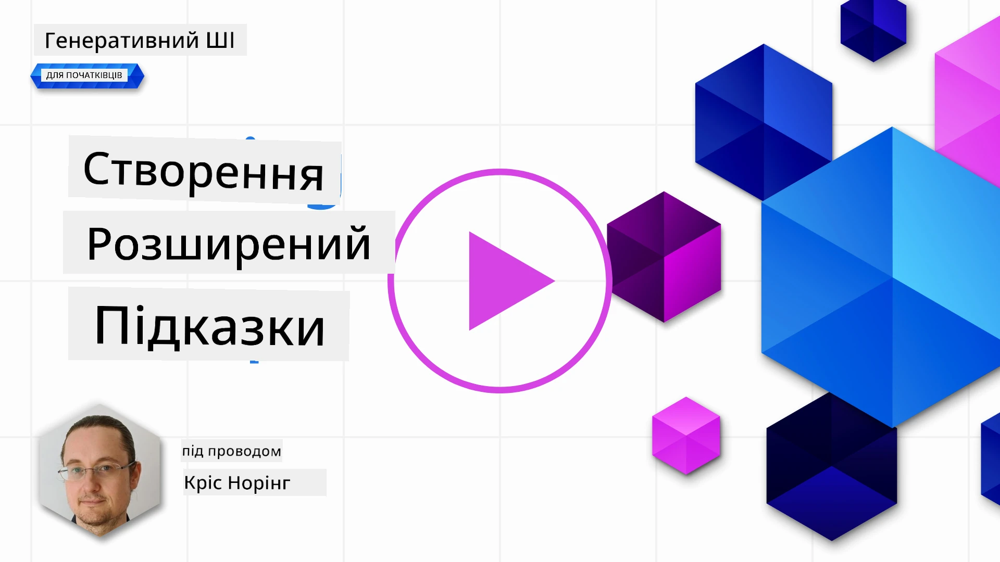

# Створення просунутих підказок

[](https://youtu.be/BAjzkaCdRok?si=NmUIyRf7-cDgbjtt)

Давайте підсумуємо деякі уроки з попередньої глави:

> Інженерія підказок — це процес, за допомогою якого ми **керуємо моделлю до більш релевантних відповідей**, надаючи корисніші інструкції або контекст.

Існує також два етапи написання підказок: побудова підказки шляхом надання релевантного контексту і _оптимізація_ — як поступово покращувати підказку.

На цьому етапі ми маємо базове розуміння того, як писати підказки, але потрібно заглибитися. У цій главі ви перейдете від спроб різних підказок до розуміння, чому одна підказка краща за іншу. Ви навчитеся будувати підказки, дотримуючись базових технік, які можна застосувати до будь-якої LLM.

## Вступ

У цій главі ми розглянемо такі теми:

- Розширення знань з інженерії підказок шляхом застосування різних технік до ваших підказок.
- Налаштування ваших підказок для варіативності відповіді.

## Навчальні цілі

Після проходження цього уроку ви зможете:

- Застосовувати техніки інженерії підказок, які покращують результат ваших підказок.
- Виконувати підказки, які можуть бути або варіативними, або детермінованими.

## Інженерія підказок

Інженерія підказок — це процес створення підказок, які дадуть бажаний результат. Інженерія підказок – це не просто написання текстової підказки. Це не інженерна дисципліна, а скоріше набір технік, які можна застосувати для отримання потрібного результату.

### Приклад підказки

Візьмемо базову підказку такого типу:

> Згенеруй 10 запитань з географії.

У цій підказці ви фактично застосовуєте кілька різних технік.

Розберемо це.

- **Контекст** — ви вказуєте, що це має бути про "географію".
- **Обмеження виводу** — ви хочете не більше ніж 10 запитань.

### Обмеження простих підказок

Ви можете як отримати бажаний результат, так і ні. Вам згенерують запитання, але географія — це велика тема, і ви можете не отримати те, що хочете через такі причини:

- **Велика тема** — невідомо, чи це будуть країни, столиці, річки тощо.
- **Формат** — а що, якщо ви хочете, щоб запитання були відформатовані певним чином?

Як бачите, при створенні підказок потрібно враховувати багато аспектів.

Ми побачили базовий приклад підказки, але генеративний ШІ здатен набагато більше, щоб допомагати людям у різноманітних ролях і галузях. Далі розглянемо базові техніки.

### Техніки підказок

Спочатку потрібно зрозуміти, що підказка є _емергентною_ властивістю LLM, тобто це не вбудована функція моделі, а щось, що ми виявляємо під час її використання.

Існують базові техніки, які ми можемо застосовувати для підказок LLM. Розглянемо їх.

- **Zero-shot prompting** — найпростіший тип підказок. Одна підказка, яка просить відповідь від LLM, базуючись лише на тренувальних даних.
- **Few-shot prompting** — цей тип підказок направляє LLM, надаючи 1 або більше прикладів, на які модель може орієнтуватися для формування відповіді.
- **Chain-of-thought** — ця техніка допомагає LLM розбити проблему на кроки.
- **Generated knowledge** — щоб покращити відповідь, можна додатково надати створені факти чи знання до підказки.
- **Least to most** — схожа на chain-of-thought, ця техніка полягає у поступовому розв’язанні проблеми по кроках у певному порядку.
- **Self-refine** — ця техніка полягає у критиці результату LLM та подальшому запиті покращень.
- **Maieutic prompting** — тут ви хочете переконатися, що відповідь LLM правильна, і просите його пояснити різні частини відповіді. Це форма self-refine.

### Zero-shot prompting

Цей стиль підказок дуже простий, складається з однієї підказки. Ймовірно, саме цю техніку ви використовуєте на початку ознайомлення з LLM. Приклад:

- Підказка: "Що таке алгебра?"
- Відповідь: "Алгебра – це розділ математики, що вивчає математичні символи та правила їх оперування."

### Few-shot prompting

Цей стиль допомагає моделі, надаючи кілька прикладів разом із запитом. Складається з однієї підказки з додатковими прикладами для конкретного завдання. Приклад:

- Підказка: "Напиши вірш у стилі Шекспіра. Ось кілька прикладів шекспірівських сонетів:
  Сонет 18: 'Чи порівняти тебе з літнім днем? Ти миліша і лагідніша...'
  Сонет 116: 'Нехай не стане завадою союз душ...'
  Сонет 132: 'Люблю я очі твої, що жаліють мене, знаючи, що серце болить...'
  Тепер напиши сонет про красу місяця."
- Відповідь: "На небі місяць м’яко світить, в сріблястім сяйві, що ніжність дарує..."

Приклади дають LLM контекст, формат чи стиль бажаного результату. Вони допомагають моделі краще зрозуміти конкретне завдання та згенерувати більш точні і релевантні відповіді.

### Chain-of-thought

Chain-of-thought — дуже цікава техніка, яка полягає у тому, щоб провести LLM через кроки розв’язання проблеми. Ідея в тому, щоб навчити LLM робити щось поетапно. Розглянемо приклад з такий варіант:

    - Підказка: "Аліса має 5 яблук, викидає 3, дає 2 Бобу, а Боб повертає одне, скільки яблук у Аліси?"
    - Відповідь: 5

LLM відповідає 5, що невірно. Правильна відповідь — 1 яблуко, за розрахунком (5 - 3 - 2 + 1 = 1).

Як навчити LLM робити це правильно?

Спробуємо chain-of-thought, що означає:

1. Надати LLM схожий приклад.
1. Показати розрахунок і як його правильно зробити.
1. Надати оригінальну підказку.

Отже:

- Підказка: "Ліза має 7 яблук, викидає 1, дає 4 Барту, а Барт повертає одне:
  7 - 1 = 6
  6 - 4 = 2
  2 + 1 = 3  
  Аліса має 5 яблук, викидає 3, дає 2 Бобу, а Боб повертає одне, скільки яблук у Аліси?"
  Відповідь: 1

Зверніть увагу, що ми пишемо значно довші підказки з прикладом, розрахунком і потім оригінальним запитом — і отримуємо правильну відповідь 1.

Як бачите, chain-of-thought — дуже потужна техніка.

### Generated knowledge

Часто, коли ви хочете створити підказку, ви бажаєте використати дані вашої компанії. Частина підказки має бути з компанії, інша — безпосередньо підказкою.

Наприклад, так ваша підказка може виглядати, якщо ви в страховому бізнесі:

```text
{{company}}: {{company_name}}
{{products}}:
{{products_list}}
Please suggest an insurance given the following budget and requirements:
Budget: {{budget}}
Requirements: {{requirements}}
```

Вгорі бачите, як підказка формується за допомогою шаблону. У шаблоні є змінні, позначені як `{{variable}}`, які будуть замінені реальними значеннями з API компанії.

Ось приклад, як підказка може виглядати після заміни змінних контентом вашої компанії:

```text
Insurance company: ACME Insurance
Insurance products (cost per month):
- Car, cheap, 500 USD
- Car, expensive, 1100 USD
- Home, cheap, 600 USD
- Home, expensive, 1200 USD
- Life, cheap, 100 USD

Please suggest an insurance given the following budget and requirements:
Budget: $1000
Requirements: Car, Home, and Life insurance
```

Проведення такої підказки через LLM дасть відповідь:

```output
Given the budget and requirements, we suggest the following insurance package from ACME Insurance:
- Car, cheap, 500 USD
- Home, cheap, 600 USD
- Life, cheap, 100 USD
Total cost: $1,200 USD
```

Як бачите, модель пропонує також страхування життя, чого не повинно бути. Це вказує, що потрібно оптимізувати підказку, зробити її яснішою щодо того, що дозволено. Після кількох _спроб і помилок_ ми приходимо до наступної підказки:

```text
Insurance company: ACME Insurance
Insurance products (cost per month):
- type: Car, cheap, cost: 500 USD
- type: Car, expensive, cost: 1100 USD
- type: Home, cheap, cost: 600 USD
- type: Home, expensive, cost: 1200 USD
- type: Life, cheap, cost: 100 USD

Please suggest an insurance given the following budget and requirements:
Budget: $1000 restrict choice to types: Car, Home
```

Зверніть увагу, що додавання _type_ і _cost_, а також використання ключового слова _restrict_ допомагає LLM краще зрозуміти наші вимоги.

Тепер отримуємо таку відповідь:

```output
Given the budget and requirements, we suggest the Car, Cheap insurance product which costs 500 USD per month.
```

Суть прикладу в тому, що навіть використовуючи базову техніку, як _generated knowledge_, ми найчастіше повинні оптимізувати підказку, щоб досягти бажаного результату.

### Least-to-most

Ідея Least-to-most полягає в тому, щоб розбити велику проблему на підзадачі. Таким чином, ви допомагаєте LLM послідовно "подолати" більшу проблему. Наприклад, для дата-сайєнс можна попросити LLM розбити процес на етапи:

> Підказка: Як виконати дата-сайєнс у 5 кроків?

Асистент, наприклад, відповість так:

1. Збір даних
1. Очистка даних
1. Аналіз даних
1. Візуалізація даних
1. Представлення даних

### Self-refine, критика результатів

З генеративними AI і LLM не можна довіряти відповіді беззастережно. Потрібно її перевіряти. Адже LLM просто дає найвірогіднішу наступну відповідь, а не гарантує правильність. Тому хороша ідея — просити LLM критично оцінити власну відповідь, що веде нас до техніки self-refine.

Як це працює:

1. Спершу підказка з проханням розв’язати задачу.
1. LLM дає відповідь.
1. Ви критикуєте відповідь і просите покращення.
1. LLM відповідає з врахуванням критики та пропонує покращення.

Цей процес можна повторювати скільки завгодно разів.

Ось приклад застосування цієї техніки:

> Підказка: "Створи Python Web API з маршрутами products і customers"

Відповідь AI:

```python
import flask
app = Flask(__name__)

@app.route('/products')
def products():
    return 'Products'

@app.route('/customers')
def customers():
    return 'Customers'
```

> Підказка: запропонуй 3 покращення до коду вище

Відповідь AI:

```text
Sure, here are three suggestions to improve the code:

Import the correct module: The first line should import Flask instead of flask. The correct import statement should be from flask import Flask.

Add a main function: Add a if __name__ == '__main__': block to the end of the file to run the application when the file is executed.

Use f-strings: Use f-strings to format the return statements in the route functions. For example, return 'Products' can be changed to return f'This is the {request.path} page'.
```

```python
from flask import Flask, request

app = Flask(__name__)

@app.route('/products')
def products():
    return f'This is the {request.path} page'

@app.route('/customers')
def customers():
    return f'This is the {request.path} page'

if __name__ == '__main__':
    app.run()
```

Як бачимо, ця відповідь покращує початковий код завдяки критиці першої відповіді.

### Maieutic prompting

Maieutic prompting — це техніка, подібна до self-refine, але більше про те, щоб змусити LLM пояснити власну відповідь. Мета — зменшити суперечності і досягти правильної відповіді. Послідовність дій:

1. Попросити LLM дати відповідь на питання.
1. Попросити ЛЛМ детальніше пояснити кожну частину відповіді.
1. Якщо виникають суперечності, відкинути ті частини, які суперечливі.

Повторювати кроки 2 і 3, доки не пройдете всі частини і будете задоволені відповіддю.

Приклад запиту:

> підказка: Як створити план дій у кризовій ситуації для пом’якшення наслідків пандемії у 5 кроках?
> Відповідь LLM:

```text
1. Identify the risks
1. Identify the stakeholders
1. Identify the resources
1. Identify the actions
1. Identify the communication channels
```

Визначено 5 кроків, але чи можна визначити, чи це вірно? Попросимо LLM пояснити кожен крок:

> підказка: Поясни перший крок докладніше, які ризики з пандемією детально?

```text
The risks are the following:

- Loss of life
- Loss of business
- Loss of reputation
- Loss of customers
- Loss of employees
```

На цьому етапі хочемо переконатися, що LLM правильний, тому питаємо про перший ризик докладніше та сподіваємось, що він узгоджується з відповіддю вище:

> підказка: Який найбільший ризик під час пандемії і чому?

```text
The biggest risk is loss of life because it's the most important thing to protect.
```

> Які два найбільші ризики під час пандемії?

```text
The two biggest risks are loss of life and loss of business.
```

Тепер LLM узгоджений і згадує "життя" і "бізнес" як два найголовніші ризики. Можна продовжити до наступного кроку та відчувати довіру. Однак не варто сліпо довіряти LLM — завжди перевіряйте результат.

## Варіюйте ваш вивід

LLM за природою недетерміновані, тобто ви отримаєте різні результати щоразу, коли запускаєте ту ж підказку. Ось приклад:

> "Згенеруй код для Python Web API"

```python
# Імпортувати необхідні модулі
import flask
from flask import request, jsonify

# Створити додаток Flask
app = flask.Flask(__name__)

# Створити маршрут для API
@app.route('/api', methods=['GET'])
def api():
    # Отримати дані з запиту
    data = request.args

    # Обробити дані
    result = process_data(data)

    # Повернути результат у форматі JSON
    return jsonify(result)

# Функція для обробки даних
def process_data(data):
    # Зробити щось з даними
    result = data + 1

    # Повернути результат
    return result

# Запустити додаток
if __name__ == '__main__':
    app.run()

```

Запуск тої ж підказки знову дає трохи іншу відповідь:

```python
#імпортувати необхідні пакети
import flask
from flask import request, jsonify

#створити застосунок Flask
app = flask.Flask(__name__)
app.config["DEBUG"] = True

#створити список книг
books = [
    {'id': 0,
     'title': 'A Fire Upon the Deep',
     'author': 'Vernor Vinge',
     'first_sentence': 'The coldsleep itself was dreamless.',
     'year_published': '1992'},
    {'id': 1,
     'title': 'The Ones Who Walk Away From Omelas',
     'author': 'Ursula K. Le Guin',
     'first_sentence': 'With a clamor of bells that set the swallows soaring, the Festival of Summer came to the city Omelas, bright-towered by the sea.',
     'published': '1973'},
    {'id': 2,
     'title': 'Dhalgren',
     'author': 'Samuel R. Delany',
     'first_sentence': 'to wound the autumnal city.',
     'published': '1975'}
]

#створити кінцеву точку для API
@app.route('/', methods=['GET'])
def home():
    return '''<h1>Books API</h1>
<p>A prototype API for retrieving books.</p>'''

#створити кінцеву точку для повернення всіх книг
@app.route('/api/v1/resources/books/all', methods=['GET'])
def api_all():
    return jsonify(books)

#створити кінцеву точку для повернення однієї книги
@app.route('/api/v1/resources/books', methods=['GET'])
def api_id():
    #перевірити, чи надано ID як частину URL
    #якщо ID надано, присвоїти його змінній
    #якщо ID не надано, показати помилку
    if 'id' in request.args:
        id = int(request.args['id'])
    else:
        return "Error: No id field provided. Please specify an id."

    #створити порожній список для наших результатів
    results = []

    #пройтися по даних і знайти результати, що відповідають запитаному ID
    #ID унікальні, але інші поля можуть повертати багато результатів
    for book in books:
        if book['id'] == id:
            results.append(book)

    #використовувати функцію jsonify із Flask, щоб конвертувати наш список
    #словників Python у формат JSON
    return jsonify(results)

app.run()
```

> Чи є варіативність виводу проблемою?

Залежить від того, що ви хочете. Якщо вам потрібна специфічна відповідь — це проблема. Якщо вас влаштовує варіативність, наприклад, "Згенеруй будь-які 3 запитання з географії", — то ні.

### Використання temperature для варіації результату

Отже, ми вирішили обмежити вивід, щоб він був більш передбачуваним, тобто детермінованим. Як це зробити?

Temperature — це значення від 0 до 1, де 0 — найбільш детермінований, а 1 — найбільш варіативний. Значення за замовчуванням — 0.7. Подивимось, що відбувається при двох запусках тієї ж підказки з temperature = 0.1:

> "Згенеруй код для Python Web API"

```python
#імпортувати необхідні бібліотеки
import flask
from flask import request, jsonify

#створити екземпляр класу Flask
app = flask.Flask(__name__)

#створити кінцеву точку для API
@app.route('/api/v1/endpoint', methods=['GET'])
def api_endpoint():
    #отримати дані запиту
    data = request.get_json()

    #обробити дані
    result = process_data(data)

    #повернути результат
    return jsonify(result)

#функція для обробки даних
def process_data(data):
    #обробити дані
    result = {'result': 'success'}

    #повернути результат
    return result

#запустити додаток Flask
if __name__ == '__main__':
    app.run()

```

Запуск знову дає таку відповідь:

```python
#імпортувати необхідні бібліотеки
import flask
from flask import request, jsonify

#створити Flask додаток
app = flask.Flask(__name__)

#створити маршрут для API
@app.route('/api', methods=['GET'])
def api_call():
    #отримати дані з запиту
    data = request.get_json()

    #обробити дані
    result = process_data(data)

    #повернути результат
    return jsonify(result)

#визначити функцію process_data
def process_data(data):
    #щось зробити з даними
    result = data + 1

    #повернути результат
    return result

#запустити додаток
if __name__ == '__main__':
    app.run()

```

Різниця між цими двома відповідями мінімальна. Тепер зробимо навпаки — поставимо temperature 0.9:

```python
# Імпортувати необхідні бібліотеки
import flask
from flask import request, jsonify

# Створити додаток Flask
app = flask.Flask(__name__)

# Створити маршрут для API
@app.route('/api', methods=['GET'])
def api_call():
    # Отримати дані з запиту
    data = request.args

    # Обробити дані
    result = process_data(data)

    # Повернути результат
    return jsonify(result)

# Функція для обробки даних
def process_data(data):
    # Зробити щось з даними
    result = data + 1

    # Повернути результат
    return result

# Запустити додаток
if __name__ == '__main__':
    app.run()

```

Другий запуск з temperature = 0.9:

```python
import flask
from flask import request, jsonify

# створити Flask додаток
app = flask.Flask(__name__)
app.config['DEBUG'] = True

# створити деякі тестові дані
books = [
    {'id': 0, 'title': 'A Fire Upon The Deep', 'author': 'Vernor Vinge', 'first_sentence': 'The coldsleep itself was dreamless.', 'year_published': '1992'},
    {'id': 1, 'title': 'The Ones Who Walk Away From Omelas', 'author': 'Ursula K. Le Guin', 'first_sentence': 'With a clamor of bells that set the swallows soaring, the Festival of Summer came to the city Omelas, bright-towered by the sea.', 'published': '1973'},
    {'id': 2, 'title': 'Dhalgren', 'author': 'Samuel R. Delany', 'first_sentence': 'to wound the autumnal city.', 'published': '1975'}
]

# створити кінцеву точку
@app.route('/', methods=['GET'])
def home():
    return '''<h1>Welcome to our book API!</h1>'''

@app.route('/api/v1/resources/books

```

Як бачите, результати дуже різняться.
> Зверніть увагу, що є ще більше параметрів, які ви можете змінити, щоб варіювати результат, такі як top-k, top-p, штраф за повторення, штраф за довжину та штраф за різноманітність, але вони виходять за межі цієї навчальної програми.

## Хороші практики

Існує багато практик, які ви можете застосувати, щоб отримати те, що хочете. Ви знайдете свій власний стиль, використовуючи prompting все більше і більше.

Окрім технік, які ми розглянули, є деякі хороші практики, які варто враховувати при роботі з LLM.

Ось деякі хороші практики, які варто врахувати:

- **Вказуйте контекст**. Контекст важливий, чим більше ви можете вказати, наприклад домен, тему тощо, тим краще.
- Обмежуйте вивід. Якщо ви хочете певну кількість елементів або певну довжину, вкажіть це.
- **Вказуйте як що, так і як**. Не забувайте зазначати і що ви хочете, і як ви цього хочете, наприклад: "Створіть Python Web API з маршрутами products і customers, розділіть його на 3 файли".
- **Використовуйте шаблони**. Часто ви захочете збагачувати свої підказки даними своєї компанії. Використовуйте шаблони для цього. Шаблони можуть містити змінні, які ви замінюєте на фактичні дані.
- **Правильно пишіть**. LLM можуть дати вам правильну відповідь, але якщо ви правильно пишете, відповідь буде кращою.

## Завдання

Ось код на Python, який показує, як побудувати простий API за допомогою Flask:

```python
from flask import Flask, request

app = Flask(__name__)

@app.route('/')
def hello():
    name = request.args.get('name', 'World')
    return f'Hello, {name}!'

if __name__ == '__main__':
    app.run()
```

Використайте AI-помічника, наприклад GitHub Copilot або ChatGPT, та застосуйте техніку "self-refine" для покращення коду.

## Розв’язок

Спробуйте розв’язати завдання, додавши відповідні підказки до коду.

> [!TIP]
> Сформулюйте підказку з проханням покращити, корисно обмежити кількість покращень. Ви також можете попросити покращити код у певному напрямку, наприклад архітектура, продуктивність, безпека тощо.

[Розв’язок](../../../05-advanced-prompts/python/aoai-solution.py)

## Перевірка знань

Чому варто використовувати prompting з ланцюжком міркувань? Наведіть 1 правильну відповідь і 2 неправильні.

1. Щоб навчити LLM вирішувати проблему.
1. B, Щоб навчити LLM знаходити помилки в коді.
1. C, Щоб доручити LLM запропонувати різні рішення.

Відповідь: 1, тому що ланцюжок міркувань полягає в тому, щоб показати LLM, як розв’язувати проблему, надаючи серію кроків та приклади подібних проблем і їх рішень.

## 🚀 Виклик

Ви щойно використали техніку self-refine у завданні. Візьміть будь-яку програму, яку ви створили, і подумайте, які покращення ви хотіли б у неї внести. Тепер застосуйте техніку self-refine, щоб внести запропоновані зміни. Що ви думаєте про результат — кращий він чи гірший?

## Відмінна робота! Продовжуйте навчання

Після завершення цього уроку перегляньте нашу [колекцію Generative AI Learning](https://aka.ms/genai-collection?WT.mc_id=academic-105485-koreyst), щоб продовжувати підвищувати свої знання з галузі Generative AI!

Перейдіть до Уроку 6, де ми застосуємо наші знання з Prompt Engineering, [створюючи додатки для генерації тексту](../06-text-generation-apps/README.md?WT.mc_id=academic-105485-koreyst)

---

<!-- CO-OP TRANSLATOR DISCLAIMER START -->
**Відмова від відповідальності**:
Цей документ було перекладено за допомогою сервісу штучного інтелекту для перекладу [Co-op Translator](https://github.com/Azure/co-op-translator). Хоча ми прагнемо до точності, будь ласка, майте на увазі, що автоматичні переклади можуть містити помилки або неточності. Оригінальний документ рідною мовою слід вважати авторитетним джерелом. Для критично важливої інформації рекомендується професійний людський переклад. Ми не несемо відповідальності за будь-які непорозуміння або неправильні тлумачення, що виникли внаслідок використання цього перекладу.
<!-- CO-OP TRANSLATOR DISCLAIMER END -->