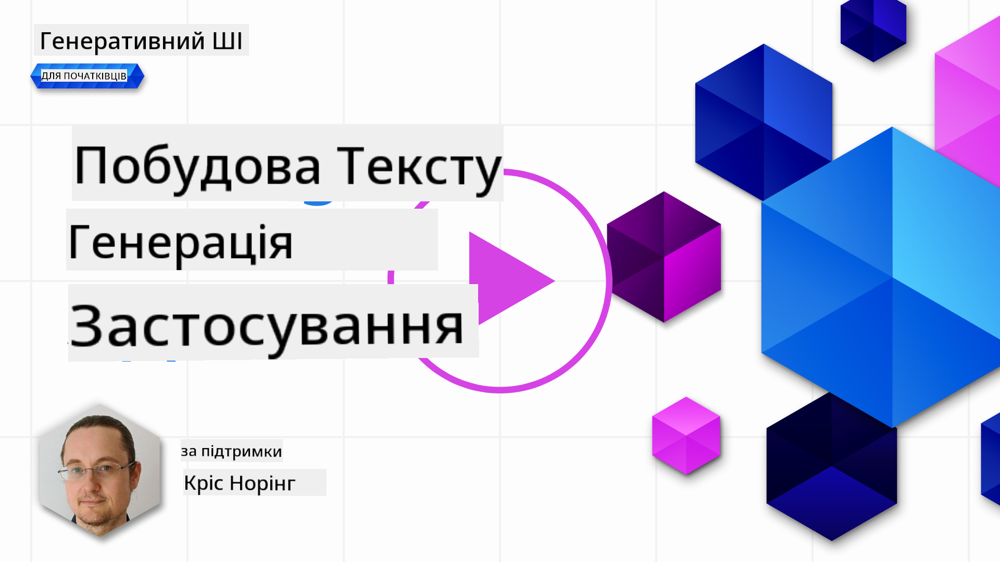

<!--
CO_OP_TRANSLATOR_METADATA:
{
  "original_hash": "ce8224073b86b728ed52b19bed7932fd",
  "translation_date": "2025-07-09T12:12:52+00:00",
  "source_file": "06-text-generation-apps/README.md",
  "language_code": "uk"
}
-->
# Створення додатків для генерації тексту

[](https://aka.ms/gen-ai-lesson6-gh?WT.mc_id=academic-105485-koreyst)

> _(Натисніть на зображення вище, щоб переглянути відео цього уроку)_

Ви вже бачили в цьому курсі, що існують основні поняття, такі як промпти, і навіть ціла дисципліна під назвою "prompt engineering". Багато інструментів, з якими ви можете взаємодіяти, як-от ChatGPT, Office 365, Microsoft Power Platform та інші, підтримують використання промптів для досягнення певної мети.

Щоб додати такий досвід у додаток, потрібно розуміти поняття промптів, завершень (completions) і вибрати бібліотеку для роботи. Саме цьому ви навчитеся в цій главі.

## Вступ

У цій главі ви:

- Дізнаєтеся про бібліотеку openai та її основні поняття.
- Створите додаток для генерації тексту за допомогою openai.
- Зрозумієте, як використовувати такі поняття, як prompt, temperature і tokens для створення додатку генерації тексту.

## Цілі навчання

Після завершення цього уроку ви зможете:

- Пояснити, що таке додаток для генерації тексту.
- Створити додаток для генерації тексту за допомогою openai.
- Налаштувати додаток для використання більшої або меншої кількості токенів, а також змінювати temperature для різноманітного результату.

## Що таке додаток для генерації тексту?

Зазвичай, коли ви створюєте додаток, він має якийсь інтерфейс, наприклад:

- Командний інтерфейс. Консольні додатки — це типові програми, де ви вводите команду, і вона виконує завдання. Наприклад, `git` — це додаток з командним інтерфейсом.
- Користувацький інтерфейс (UI). Деякі додатки мають графічний інтерфейс (GUI), де ви натискаєте кнопки, вводите текст, обираєте опції тощо.

### Консольні та UI-додатки мають обмеження

Порівняйте це з командним додатком, де ви вводите команду:

- **Обмеження**. Ви не можете вводити будь-яку команду, лише ті, які підтримує додаток.
- **Мовна специфіка**. Деякі додатки підтримують багато мов, але за замовчуванням вони створені для конкретної мови, навіть якщо можна додати підтримку інших.

### Переваги додатків для генерації тексту

Чим же відрізняється додаток для генерації тексту?

У такому додатку ви маєте більше гнучкості, вас не обмежують набір команд або конкретна мова введення. Натомість ви можете використовувати природну мову для взаємодії з додатком. Ще одна перевага — ви працюєте з джерелом даних, яке навчено на величезному корпусі інформації, тоді як традиційний додаток може бути обмежений даними в базі.

### Що можна створити за допомогою додатку для генерації тексту?

Можна створити багато різних речей. Наприклад:

- **Чатбот**. Чатбот, який відповідає на питання про вашу компанію та її продукти, може бути дуже корисним.
- **Помічник**. Великі мовні моделі (LLM) чудово підходять для таких завдань, як підсумовування тексту, отримання інсайтів, створення текстів, наприклад резюме, і багато іншого.
- **Асистент коду**. Залежно від мовної моделі, можна створити асистента для написання коду. Наприклад, можна використовувати GitHub Copilot або ChatGPT для допомоги у написанні коду.

## Як почати?

Вам потрібно знайти спосіб інтегруватися з LLM, що зазвичай передбачає два підходи:

- Використання API. Ви формуєте веб-запити з вашим промптом і отримуєте згенерований текст у відповідь.
- Використання бібліотеки. Бібліотеки допомагають інкапсулювати виклики API і роблять їх простішими у використанні.

## Бібліотеки/SDK

Існує кілька відомих бібліотек для роботи з LLM, наприклад:

- **openai** — ця бібліотека полегшує підключення до вашої моделі та надсилання промптів.

Також є бібліотеки, які працюють на вищому рівні, наприклад:

- **Langchain**. Langchain добре відомий і підтримує Python.
- **Semantic Kernel**. Semantic Kernel — бібліотека від Microsoft, що підтримує мови C#, Python і Java.

## Перший додаток з openai

Давайте подивимося, як створити наш перший додаток, які бібліотеки потрібні, скільки потрібно налаштувань тощо.

### Встановлення openai

Існує багато бібліотек для взаємодії з OpenAI або Azure OpenAI. Можна використовувати різні мови програмування, такі як C#, Python, JavaScript, Java та інші. Ми обрали бібліотеку `openai` для Python, тому встановимо її за допомогою `pip`.

```bash
pip install openai
```

### Створення ресурсу

Вам потрібно виконати такі кроки:

- Створити обліковий запис на Azure [https://azure.microsoft.com/free/](https://azure.microsoft.com/free/?WT.mc_id=academic-105485-koreyst).
- Отримати доступ до Azure OpenAI. Перейдіть за посиланням [https://learn.microsoft.com/azure/ai-services/openai/overview#how-do-i-get-access-to-azure-openai](https://learn.microsoft.com/azure/ai-services/openai/overview#how-do-i-get-access-to-azure-openai?WT.mc_id=academic-105485-koreyst) і подайте заявку на доступ.

  > [!NOTE]
  > На момент написання потрібно подати заявку на доступ до Azure OpenAI.

- Встановити Python <https://www.python.org/>
- Створити ресурс Azure OpenAI Service. Дивіться інструкцію, як [створити ресурс](https://learn.microsoft.com/azure/ai-services/openai/how-to/create-resource?pivots=web-portal?WT.mc_id=academic-105485-koreyst).

### Знайти API ключ і endpoint

Тепер потрібно повідомити бібліотеці `openai`, який API ключ використовувати. Щоб знайти ключ, перейдіть у розділ "Keys and Endpoint" вашого ресурсу Azure OpenAI і скопіюйте значення "Key 1".


Тепер, коли ця інформація скопійована, давайте налаштуємо бібліотеки для її використання.

> [!NOTE]
> Варто відокремити ваш API ключ від коду. Це можна зробити за допомогою змінних середовища.
>
> - Встановіть змінну середовища `OPENAI_API_KEY` зі значенням вашого API ключа.
>   `export OPENAI_API_KEY='sk-...'`

### Налаштування конфігурації Azure

Якщо ви використовуєте Azure OpenAI, ось як налаштувати конфігурацію:

```python
openai.api_type = 'azure'
openai.api_key = os.environ["OPENAI_API_KEY"]
openai.api_version = '2023-05-15'
openai.api_base = os.getenv("API_BASE")
```

Тут ми встановлюємо:

- `api_type` в `azure`. Це вказує бібліотеці використовувати Azure OpenAI, а не OpenAI.
- `api_key` — ваш API ключ, знайдений в Azure Portal.
- `api_version` — версія API, яку ви хочете використовувати. На момент написання остання версія — `2023-05-15`.
- `api_base` — endpoint API. Його можна знайти в Azure Portal поруч з вашим API ключем.

> [!NOTE] > `os.getenv` — це функція, яка читає змінні середовища. Ви можете використовувати її для читання змінних, таких як `OPENAI_API_KEY` і `API_BASE`. Встановіть ці змінні у вашому терміналі або за допомогою бібліотеки, наприклад `dotenv`.

## Генерація тексту

Для генерації тексту використовується клас `Completion`. Ось приклад:

```python
prompt = "Complete the following: Once upon a time there was a"

completion = openai.Completion.create(model="davinci-002", prompt=prompt)
print(completion.choices[0].text)
```

У наведеному коді ми створюємо об’єкт completion, передаємо модель, яку хочемо використати, і промпт. Потім виводимо згенерований текст.

### Чат-завершення

До цього ви бачили, як ми використовували `Completion` для генерації тексту. Але є ще один клас — `ChatCompletion`, який краще підходить для чатботів. Ось приклад його використання:

```python
import openai

openai.api_key = "sk-..."

completion = openai.ChatCompletion.create(model="gpt-3.5-turbo", messages=[{"role": "user", "content": "Hello world"}])
print(completion.choices[0].message.content)
```

Більше про цю функціональність у наступній главі.

## Вправа — ваш перший додаток для генерації тексту

Тепер, коли ми навчилися налаштовувати openai, час створити ваш перший додаток для генерації тексту. Для цього виконайте такі кроки:

1. Створіть віртуальне середовище і встановіть openai:

   ```bash
   python -m venv venv
   source venv/bin/activate
   pip install openai
   ```

   > [!NOTE]
   > Якщо ви використовуєте Windows, введіть `venv\Scripts\activate` замість `source venv/bin/activate`.

   > [!NOTE]
   > Знайдіть ваш ключ Azure OpenAI, перейшовши на [https://portal.azure.com/](https://portal.azure.com/?WT.mc_id=academic-105485-koreyst), знайдіть `Open AI`, оберіть `Open AI resource`, потім `Keys and Endpoint` і скопіюйте значення `Key 1`.

1. Створіть файл _app.py_ і додайте в нього наступний код:

   ```python
   import openai

   openai.api_key = "<replace this value with your open ai key or Azure OpenAI key>"

   openai.api_type = 'azure'
   openai.api_version = '2023-05-15'
   openai.api_base = "<endpoint found in Azure Portal where your API key is>"
   deployment_name = "<deployment name>"

   # add your completion code
   prompt = "Complete the following: Once upon a time there was a"
   messages = [{"role": "user", "content": prompt}]

   # make completion
   completion = openai.chat.completions.create(model=deployment_name, messages=messages)

   # print response
   print(completion.choices[0].message.content)
   ```

   > [!NOTE]
   > Якщо ви використовуєте Azure OpenAI, потрібно встановити `api_type` в `azure` і задати `api_key` вашим ключем Azure OpenAI.

   Ви повинні побачити приблизно такий результат:

   ```output
    very unhappy _____.

   Once upon a time there was a very unhappy mermaid.
   ```

## Різні типи промптів для різних завдань

Тепер ви знаєте, як генерувати текст за допомогою промпту. У вас навіть є програма, яку можна змінювати, щоб створювати різні типи тексту.

Промпти можна використовувати для різних завдань. Наприклад:

- **Генерація певного типу тексту**. Наприклад, можна згенерувати вірш, питання для вікторини тощо.
- **Пошук інформації**. Можна використовувати промпти для пошуку інформації, наприклад: «Що означає CORS у веб-розробці?».
- **Генерація коду**. Можна генерувати код, наприклад, регулярний вираз для перевірки email або навіть цілу програму, наприклад веб-додаток.

## Практичний приклад: генератор рецептів

Уявіть, що у вас вдома є інгредієнти, і ви хочете щось приготувати. Для цього потрібен рецепт. Знайти рецепт можна через пошукову систему або за допомогою LLM.

Ви можете написати промпт так:

> "Покажи мені 5 рецептів страви з наступними інгредієнтами: курка, картопля та морква. Для кожного рецепту вкажи всі використані інгредієнти."

За таким промптом ви можете отримати відповідь на кшталт:

```output
1. Roasted Chicken and Vegetables:
Ingredients:
- 4 chicken thighs
- 2 potatoes, cut into cubes
- 2 carrots, cut into cubes
- 2 tablespoons olive oil
- 2 cloves garlic, minced
- 1 teaspoon dried thyme
- 1 teaspoon dried oregano
- Salt and pepper, to taste

2. Chicken and Potato Stew:
Ingredients:
- 2 tablespoons olive oil
- 1 onion, diced
- 2 cloves garlic, minced
- 2 chicken breasts, cut into cubes
- 2 potatoes, cut into cubes
- 2 carrots, cut into cubes
- 1 teaspoon dried oregano
- 1 teaspoon dried thyme
- 1 cup chicken broth
- Salt and pepper, to taste

3. Chicken and Potato Bake:
Ingredients:
- 2 tablespoons olive oil
- 2 chicken breasts, cut into cubes
- 2 potatoes, cut into cubes
- 2 carrots, cut into cubes
- 1 onion, diced
- 2 cloves garlic, minced
- 1 teaspoon dried oregano
- 1 teaspoon dried thyme
- 1 cup chicken broth
- Salt and pepper, to taste

4. Chicken and Potato Soup:
Ingredients:
- 2 tablespoons olive oil
- 1 onion, diced
- 2 cloves garlic, minced
- 2 chicken breasts, cut into cubes
- 2 potatoes, cut into cubes
- 2 carrots, cut into cubes
- 1 teaspoon dried oregano
- 1 teaspoon dried thyme
- 4 cups chicken broth
- Salt and pepper, to taste

5. Chicken and Potato Hash:
Ingredients:
- 2 tablespoons olive oil
- 2 chicken breasts, cut into cubes
- 2 potatoes, cut into cubes
- 2 carrots, cut into cubes
- 1 onion, diced
- 2 cloves garlic, minced
- 1 teaspoon dried oregano
```

Цей результат чудовий, я знаю, що приготувати. На цьому етапі корисними покращеннями можуть бути:

- Фільтрація інгредієнтів, які мені не подобаються або на які у мене алергія.
- Створення списку покупок, якщо вдома немає всіх інгредієнтів.

Для цих випадків додамо додатковий промпт:

> "Будь ласка, виключи рецепти з часником, бо у мене алергія, і заміни його на щось інше. Також, будь ласка, створи список покупок для рецептів, враховуючи, що вдома вже є курка, картопля і морква."

Тепер ви отримаєте новий результат, а саме:

```output
1. Roasted Chicken and Vegetables:
Ingredients:
- 4 chicken thighs
- 2 potatoes, cut into cubes
- 2 carrots, cut into cubes
- 2 tablespoons olive oil
- 1 teaspoon dried thyme
- 1 teaspoon dried oregano
- Salt and pepper, to taste

2. Chicken and Potato Stew:
Ingredients:
- 2 tablespoons olive oil
- 1 onion, diced
- 2 chicken breasts, cut into cubes
- 2 potatoes, cut into cubes
- 2 carrots, cut into cubes
- 1 teaspoon dried oregano
- 1 teaspoon dried thyme
- 1 cup chicken broth
- Salt and pepper, to taste

3. Chicken and Potato Bake:
Ingredients:
- 2 tablespoons olive oil
- 2 chicken breasts, cut into cubes
- 2 potatoes, cut into cubes
- 2 carrots, cut into cubes
- 1 onion, diced
- 1 teaspoon dried oregano
- 1 teaspoon dried thyme
- 1 cup chicken broth
- Salt and pepper, to taste

4. Chicken and Potato Soup:
Ingredients:
- 2 tablespoons olive oil
- 1 onion, diced
- 2 chicken breasts, cut into cubes
- 2 potatoes, cut into cubes
- 2 carrots, cut into cubes
- 1 teaspoon dried oregano
- 1 teaspoon dried thyme
- 4 cups chicken broth
- Salt and pepper, to taste

5. Chicken and Potato Hash:
Ingredients:
- 2 tablespoons olive oil
- 2 chicken breasts, cut into cubes
- 2 potatoes, cut into cubes
- 2 carrots, cut into cubes
- 1 onion, diced
- 1 teaspoon dried oregano

Shopping List:
- Olive oil
- Onion
- Thyme
- Oregano
- Salt
- Pepper
```

Ось ваші п’ять рецептів без часнику, а також список покупок з урахуванням того, що вже є вдома.

## Вправа — створіть генератор рецептів

Тепер, коли ми розіграли сценарій, давайте напишемо код, який відповідає цьому прикладу. Для цього виконайте такі кроки:

1. Використайте існуючий файл _app.py_ як відправну точку.
1. Знайдіть змінну `prompt` і замініть її код на наступний:

   ```python
   prompt = "Show me 5 recipes for a dish with the following ingredients: chicken, potatoes, and carrots. Per recipe, list all the ingredients used"
   ```

   Якщо тепер запустити код, ви побачите приблизно такий результат:

   ```output
   -Chicken Stew with Potatoes and Carrots: 3 tablespoons oil, 1 onion, chopped, 2 cloves garlic, minced, 1 carrot, peeled and chopped, 1 potato, peeled and chopped, 1 bay leaf, 1 thyme sprig, 1/2 teaspoon salt, 1/4 teaspoon black pepper, 1 1/2 cups chicken broth, 1/2 cup dry white wine, 2 tablespoons chopped fresh parsley, 2 tablespoons unsalted butter, 1 1/2 pounds boneless, skinless chicken thighs, cut into 1-inch pieces
   -Oven-Roasted Chicken with Potatoes and Carrots: 3 tablespoons extra-virgin olive oil, 1 tablespoon Dijon mustard, 1 tablespoon chopped fresh rosemary, 1 tablespoon chopped fresh thyme, 4 cloves garlic, minced, 1 1/2 pounds small red potatoes, quartered, 1 1/2 pounds carrots, quartered lengthwise, 1/2 teaspoon salt, 1/4 teaspoon black pepper, 1 (4-pound) whole chicken
   -Chicken, Potato, and Carrot Casserole: cooking spray, 1 large onion, chopped, 2 cloves garlic, minced, 1 carrot, peeled and shredded, 1 potato, peeled and shredded, 1/2 teaspoon dried thyme leaves, 1/4 teaspoon salt, 1/4 teaspoon black pepper, 2 cups fat-free, low-sodium chicken broth, 1 cup frozen peas, 1/4 cup all-purpose flour, 1 cup 2% reduced-fat milk, 1/4 cup grated Parmesan cheese

   -One Pot Chicken and Potato Dinner: 2 tablespoons olive oil, 1 pound boneless, skinless chicken thighs, cut into 1-inch pieces, 1 large onion, chopped, 3 cloves garlic, minced, 1 carrot, peeled and chopped, 1 potato, peeled and chopped, 1 bay leaf, 1 thyme sprig, 1/2 teaspoon salt, 1/4 teaspoon black pepper, 2 cups chicken broth, 1/2 cup dry white wine

   -Chicken, Potato, and Carrot Curry: 1 tablespoon vegetable oil, 1 large onion, chopped, 2 cloves garlic, minced, 1 carrot, peeled and chopped, 1 potato, peeled and chopped, 1 teaspoon ground coriander, 1 teaspoon ground cumin, 1/2 teaspoon ground turmeric, 1/2 teaspoon ground ginger, 1/4 teaspoon cayenne pepper, 2 cups chicken broth, 1/2 cup dry white wine, 1 (15-ounce) can chickpeas, drained and rinsed, 1/2 cup raisins, 1/2 cup chopped fresh cilantro
   ```

   > NOTE, ваша LLM є недетермінованою, тому результати можуть відрізнятися при кожному запуску.

   Чудово, давайте подивимося, як можна покращити програму. Щоб зробити її гнучкішою, потрібно, щоб кількість рецептів і інгредієнти можна було змінювати.

1. Змініть код таким чином:

   ```python
   no_recipes = input("No of recipes (for example, 5): ")

   ingredients = input("List of ingredients (for example, chicken, potatoes, and carrots): ")

   # interpolate the number of recipes into the prompt an ingredients
   prompt = f"Show me {no_recipes} recipes for a dish with the following ingredients: {ingredients}. Per recipe, list all the ingredients used"
   ```

   Тестовий запуск коду може виглядати так:

   ```output
   No of recipes (for example, 5): 3
   List of ingredients (for example, chicken, potatoes, and carrots): milk,strawberries

   -Strawberry milk shake: milk, strawberries, sugar, vanilla extract, ice cubes
   -Strawberry shortcake: milk, flour, baking powder, sugar, salt, unsalted butter, strawberries, whipped cream
   -Strawberry milk: milk, strawberries, sugar, vanilla extract
   ```

### Покращення: додавання фільтрації та списку покупок

Тепер у нас є робочий додаток, який може створювати рецепти, і він гнучкий, бо залежить від введених користувачем даних — кількості рецептів і інгредієнтів.

Щоб покращити його, додамо наступне:

- **Фільтрація інгредієнтів**. Ми хочемо мати можливість виключати інгредієнти, які не подобаються або викликають алергію. Для цього відредагуємо наш промпт, додавши умову фільтрації в кінець, наприклад:

  ```python
  filter = input("Filter (for example, vegetarian, vegan, or gluten-free): ")

  prompt = f"Show me {no_recipes} recipes for a dish with the following ingredients: {ingredients}. Per recipe, list all the ingredients used, no {filter}"
  ```

  Тут ми додаємо `{filter}` у кінець промпту і також отримуємо значення фільтра від користувача.

  Приклад введення під час запуску програми може виглядати так:

  ```output
  No of recipes (for example, 5): 3
  List of ingredients (for example, chicken, potatoes, and carrots): onion,milk
  Filter (for example, vegetarian, vegan, or gluten-free): no milk

  1. French Onion Soup

  Ingredients:

  -1 large onion, sliced
  -3 cups beef broth
  -1 cup milk
  -6 slices french bread
  -1/4 cup shredded Parmesan cheese
  -1 tablespoon butter
  -1 teaspoon dried thyme
  -1/4 teaspoon salt
  -1/4 teaspoon black pepper

  Instructions:

  1. In a large pot, sauté onions in butter until golden brown.
  2. Add beef broth, milk, thyme, salt, and pepper. Bring to a boil.
  3. Reduce heat and simmer for 10 minutes.
  4. Place french bread slices on soup bowls.
  5. Ladle soup over bread.
  6. Sprinkle with Parmesan cheese.

  2. Onion and Potato Soup

  Ingredients:

  -1 large onion, chopped
  -2 cups potatoes, diced
  -3 cups vegetable broth
  -1 cup milk
  -1/4 teaspoon black pepper

  Instructions:

  1. In a large pot, sauté onions in butter until golden brown.
  2. Add potatoes, vegetable broth, milk, and pepper. Bring to a boil.
  3. Reduce heat and simmer for 10 minutes.
  4. Serve hot.

  3. Creamy Onion Soup

  Ingredients:

  -1 large onion, chopped
  -3 cups vegetable broth
  -1 cup milk
  -1/4 teaspoon black pepper
  -1/4 cup all-purpose flour
  -1/2 cup shredded Parmesan cheese

  Instructions:

  1. In a large pot, sauté onions in butter until golden brown.
  2. Add vegetable broth, milk, and pepper. Bring to a boil.
  3. Reduce heat and simmer for 10 minutes.
  4. In a small bowl, whisk together flour and Parmesan cheese until smooth.
  5. Add to soup and simmer for an additional 5 minutes, or until soup has thickened.
  ```

  Як бачите, рецепти з молоком були відфільтровані. Але якщо у вас непереносимість лактози, можливо, захочеться виключити також рецепти з сиром, тому важливо чітко вказувати.

- **Створення списку покупок**. Ми хочемо створити список покупок, враховуючи, що вдома вже є деякі інгредієнти.

  Для цього можна спробувати вирішити все одним промптом або розбити на два. Спробуємо другий варіант. Пропонуємо додати додатковий промпт, але для цього потрібно передати результат першого промпту як контекст для другого.

  Знайдіть у коді місце, де виводиться результат першого промпту, і додайте нижче такий код:

  ```python
  old_prompt_result = completion.choices[0].message.content
  prompt = "Produce a shopping list for the generated recipes and please don't include ingredients that I already have."

  new_prompt = f"{old_prompt_result} {prompt}"
  messages = [{"role": "user", "content": new_prompt}]
  completion = openai.Completion.create(engine=deployment_name, messages=messages, max_tokens=1200)

  # print response
  print("Shopping list:")
  print(completion.choices[0].message.content)
  ```

  Зверніть увагу на наступне:

  1. Ми формуємо новий промпт, додаючи результат першого промпту до нового:

     ```python
     new_prompt = f"{old_prompt_result} {prompt}"
     ```
  1. Ми робимо новий запит, але також враховуємо кількість токенів, яку ми вказали в першому запиті, тому цього разу встановлюємо `max_tokens` рівним 1200.

     ```python
     completion = openai.Completion.create(engine=deployment_name, prompt=new_prompt, max_tokens=1200)
     ```

     Запустивши цей код, ми отримуємо наступний результат:

     ```output
     No of recipes (for example, 5): 2
     List of ingredients (for example, chicken, potatoes, and carrots): apple,flour
     Filter (for example, vegetarian, vegan, or gluten-free): sugar


     -Apple and flour pancakes: 1 cup flour, 1/2 tsp baking powder, 1/2 tsp baking soda, 1/4 tsp salt, 1 tbsp sugar, 1 egg, 1 cup buttermilk or sour milk, 1/4 cup melted butter, 1 Granny Smith apple, peeled and grated
     -Apple fritters: 1-1/2 cups flour, 1 tsp baking powder, 1/4 tsp salt, 1/4 tsp baking soda, 1/4 tsp nutmeg, 1/4 tsp cinnamon, 1/4 tsp allspice, 1/4 cup sugar, 1/4 cup vegetable shortening, 1/4 cup milk, 1 egg, 2 cups shredded, peeled apples
     Shopping list:
     -Flour, baking powder, baking soda, salt, sugar, egg, buttermilk, butter, apple, nutmeg, cinnamon, allspice
     ```

## Покращуйте своє налаштування

Те, що ми маємо наразі — це робочий код, але є кілька моментів, які варто підкоригувати, щоб зробити його ще кращим. Ось що варто зробити:

- **Відокремити секрети від коду**, наприклад, API-ключ. Секрети не повинні зберігатися в коді, їх слід тримати у безпечному місці. Щоб відокремити секрети від коду, можна використовувати змінні середовища та бібліотеки на кшталт `python-dotenv` для завантаження їх з файлу. Ось як це виглядає у коді:

  1. Створіть файл `.env` з таким вмістом:

     ```bash
     OPENAI_API_KEY=sk-...
     ```

     
> Зверніть увагу, для Azure потрібно встановити такі змінні середовища:

     ```bash
     OPENAI_API_TYPE=azure
     OPENAI_API_VERSION=2023-05-15
     OPENAI_API_BASE=<replace>
     ```

     У коді змінні середовища можна завантажити так:

     ```python
     from dotenv import load_dotenv

     load_dotenv()

     openai.api_key = os.environ["OPENAI_API_KEY"]
     ```

- **Слово про довжину токенів**. Варто враховувати, скільки токенів потрібно для генерації потрібного тексту. Токени коштують грошей, тому де можливо, слід економити їх використання. Наприклад, чи можна сформулювати запит так, щоб використати менше токенів?

  Щоб змінити кількість токенів, використовуйте параметр `max_tokens`. Наприклад, якщо потрібно використати 100 токенів, зробіть так:

  ```python
  completion = client.chat.completions.create(model=deployment, messages=messages, max_tokens=100)
  ```

- **Експерименти з temperature**. Temperature — це параметр, про який ми ще не згадували, але він важливий для того, як працює наша програма. Чим вищий temperature, тим більш випадковим буде результат. Навпаки, чим нижчий temperature, тим передбачуванішим буде вивід. Подумайте, чи хочете ви отримувати різноманітні варіанти, чи більш стабільний результат.

  Щоб змінити temperature, використовуйте параметр `temperature`. Наприклад, щоб встановити temperature 0.5, зробіть так:

  ```python
  completion = client.chat.completions.create(model=deployment, messages=messages, temperature=0.5)
  ```

  > Зверніть увагу, чим ближче до 1.0, тим різноманітніший результат.

## Завдання

Для цього завдання ви можете обрати, що створити.

Ось кілька ідей:

- Покращити додаток генератора рецептів. Пограйтеся зі значеннями temperature та запитами, щоб побачити, що вийде.
- Створити "помічника для навчання". Цей додаток має відповідати на питання з певної теми, наприклад Python. Можна зробити запити на кшталт "Що таке певна тема в Python?" або "Покажи код для певної теми" тощо.
- Історичний бот — оживіть історію, попросіть бота зіграти роль певної історичної особи та ставте йому питання про її життя і часи.

## Розв’язок

### Помічник для навчання

Нижче наведено стартовий запит, подивіться, як його можна використати і налаштувати під себе.

```text
- "You're an expert on the Python language

    Suggest a beginner lesson for Python in the following format:

    Format:
    - concepts:
    - brief explanation of the lesson:
    - exercise in code with solutions"
```

### Історичний бот

Ось кілька запитів, які ви можете використовувати:

```text
- "You are Abe Lincoln, tell me about yourself in 3 sentences, and respond using grammar and words like Abe would have used"
- "You are Abe Lincoln, respond using grammar and words like Abe would have used:

   Tell me about your greatest accomplishments, in 300 words"
```

## Перевірка знань

Що робить параметр temperature?

1. Він контролює, наскільки випадковим буде результат.
1. Він контролює, наскільки великим буде відповідь.
1. Він контролює, скільки токенів буде використано.

## 🚀 Виклик

Працюючи над завданням, спробуйте змінювати temperature, встановіть його на 0, 0.5 і 1. Пам’ятайте, що 0 — це найменш варіативний результат, а 1 — найбільш. Яке значення найкраще підходить для вашого додатку?

## Чудова робота! Продовжуйте навчання

Після завершення цього уроку перегляньте нашу [колекцію Generative AI Learning](https://aka.ms/genai-collection?WT.mc_id=academic-105485-koreyst), щоб продовжувати розвивати свої знання у сфері генеративного ШІ!

Перейдіть до Уроку 7, де ми розглянемо, як [створювати чат-додатки](../07-building-chat-applications/README.md?WT.mc_id=academic-105485-koreyst)!

**Відмова від відповідальності**:  
Цей документ було перекладено за допомогою сервісу автоматичного перекладу [Co-op Translator](https://github.com/Azure/co-op-translator). Хоча ми прагнемо до точності, будь ласка, майте на увазі, що автоматичні переклади можуть містити помилки або неточності. Оригінальний документ рідною мовою слід вважати авторитетним джерелом. Для критично важливої інформації рекомендується звертатися до професійного людського перекладу. Ми не несемо відповідальності за будь-які непорозуміння або неправильні тлумачення, що виникли внаслідок використання цього перекладу.