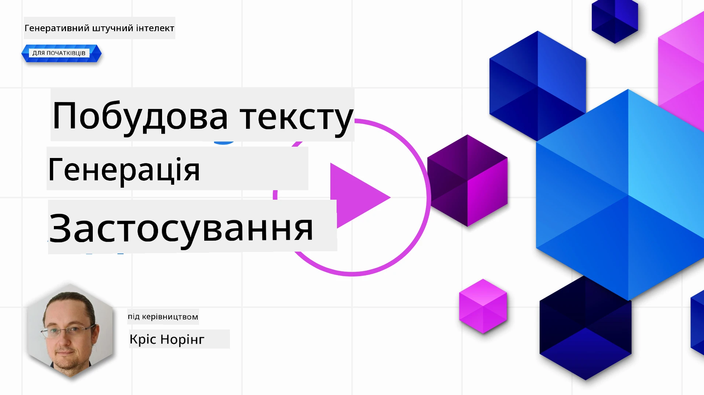

# Створення додатків для генерації тексту

[](https://youtu.be/0Y5Luf5sRQA?si=t_xVg0clnAI4oUFZ)

> _(Клацніть на зображення вище, щоб переглянути відео цього уроку)_

Ви вже бачили в цьому навчальному плані, що є основні поняття, такі як підказки (prompts), і навіть ціла дисципліна під назвою "інженерія підказок". Багато інструментів, з якими ви можете взаємодіяти, як-от ChatGPT, Office 365, Microsoft Power Platform та інші, підтримують роботу за допомогою підказок для досягнення цілей.

Щоб додати такий досвід у свій додаток, вам потрібно розуміти такі поняття, як підказки, завершення та обрати бібліотеку для роботи. Саме цьому ви навчитеся в цьому розділі.

## Вступ

У цьому розділі ви:

- Дізнаєтеся про бібліотеку openai та її основні поняття.
- Побудуєте додаток для генерації тексту за допомогою openai.
- Зрозумієте, як використовувати поняття, такі як підказка, температура та токени, для створення додатку генерації тексту.

## Цілі навчання

По завершенню цього уроку ви зможете:

- Пояснити, що таке додаток для генерації тексту.
- Побудувати додаток для генерації тексту за допомогою openai.
- Налаштувати ваш додаток так, щоб використовувати більше або менше токенів, а також регулювати температуру для варіації результатів.

## Що таке додаток для генерації тексту?

Зазвичай, коли ви створюєте додаток, він має певний інтерфейс, наприклад:

- Командний інтерфейс. Консольні додатки — це типові програми, де ви вводите команду, і вона виконує задачу. Наприклад, `git` — це додаток з командним інтерфейсом.
- Користувацький інтерфейс (UI). Деякі додатки мають графічний інтерфейс користувача (GUI), де ви натискаєте кнопки, вводите текст, обираєте опції і т.д.

### Консольні та UI-додатки мають обмеження

Порівняйте це з командним додатком, в якому ви вводите команду:

- **Він обмежений**. Ви не можете просто так вводити будь-які команди, лише ті, які підтримує додаток.
- **Специфічність мови**. Деякі додатки підтримують багато мов, але за замовчуванням додаток створено для конкретної мови, навіть якщо можна додати підтримку інших мов.

### Переваги додатків для генерації тексту

То чим відрізняється додаток для генерації тексту?

У додатку для генерації тексту у вас більше гнучкості — ви не обмежені набором команд чи конкретною мовою введення. Замість цього ви можете використовувати природну мову для взаємодії з додатком. Ще одна перевага — ви вже працюєте з джерелом даних, яке навчено на величезному корпусі інформації, тоді як традиційний додаток може бути обмежений вмістом бази даних.

### Що я можу створити за допомогою додатку генерації тексту?

Існує багато речей, які ви можете створити. Наприклад:

- **Чатбот**. Чатбот, що відповідає на запитання про теми, наприклад про вашу компанію та її продукти, може бути гарним варіантом.
- **Помічник**. Величезні мовні моделі (LLM) чудово підходять до завдань на кшталт підсумовування тексту, отримання інсайтів, створення текстів, наприклад резюме і більше.
- **Помічник із коду**. Залежно від мовної моделі, яку ви використовуєте, можна створити помічника по коду, що допомагає писати код. Наприклад, ви можете використовувати GitHub Copilot або ChatGPT для допомоги в написанні коду.

## Як почати?

Для цього вам потрібно інтегруватися з LLM, що зазвичай здійснюється двома способами:

- Використати API. Ви конструюєте веб-запити з підказками і отримуєте згенерований текст у відповідь.
- Використати бібліотеку. Бібліотеки допомагають обгорнути виклики API і спрощують їхню роботу.

## Бібліотеки/SDK

Існує декілька відомих бібліотек для роботи з LLM, наприклад:

- **openai** — ця бібліотека полегшує підключення до вашої моделі та надсилання підказок.

Є також бібліотеки, що працюють на вищому рівні, наприклад:

- **Langchain**. Langchain добре відомий і підтримує Python.
- **Semantic Kernel**. Semantic Kernel — бібліотека від Microsoft, яка підтримує мови C#, Python і Java.

## Перший додаток з використанням openai

Давайте подивимося, як ми можемо побудувати наш перший додаток, які бібліотеки нам потрібні, скільки роботи це викликає і так далі.

### Встановлення openai

Існує багато бібліотек для роботи з OpenAI або Azure OpenAI. Можна використовувати різні мови програмування: C#, Python, JavaScript, Java і більше. Ми обрали бібліотеку `openai` для Python, тому використаємо `pip` для її встановлення.

```bash
pip install openai
```

### Створення ресурсу

Вам потрібно виконати такі кроки:

- Створити обліковий запис на Azure [https://azure.microsoft.com/free/](https://azure.microsoft.com/free/?WT.mc_id=academic-105485-koreyst).
- Отримати доступ до Azure OpenAI. Перейдіть на [https://learn.microsoft.com/azure/ai-foundry/openai/overview#how-do-i-get-access-to-azure-openai](https://learn.microsoft.com/azure/ai-foundry/openai/overview#how-do-i-get-access-to-azure-openai?WT.mc_id=academic-105485-koreyst) і запросіть доступ.

  > [!NOTE]
  > На момент написання потрібно подавати заявку на доступ до Azure OpenAI.

- Встановити Python <https://www.python.org/>
- Створити ресурс Azure OpenAI Service. Дивіться цей посібник, як [створити ресурс](https://learn.microsoft.com/azure/ai-foundry/openai/how-to/create-resource?pivots=web-portal?WT.mc_id=academic-105485-koreyst).

### Знаходження ключа API та кінцевої точки

На цьому етапі потрібно повідомити бібліотеці `openai`, який API-ключ використовувати. Щоб знайти свій ключ API, перейдіть у розділ "Keys and Endpoint" у вашому ресурсі Azure OpenAI і скопіюйте значення "Key 1".


Тепер, коли ця інформація скопійована, давайте налаштуємо бібліотеки на її використання.

> [!NOTE]
> Варто відокремити свій ключ API від коду. Це можна зробити за допомогою змінних середовища.
>
> - Встановіть змінну середовища `OPENAI_API_KEY` у значення вашого API-ключа.
>   `export OPENAI_API_KEY='sk-...'`

### Налаштування конфігурації для Azure

Якщо ви використовуєте Azure OpenAI (тепер частина Microsoft Foundry), ось як слід налаштувати конфігурацію. Ми використовуємо стандартний клієнт `OpenAI`, орієнтований на кінцеву точку Azure OpenAI `/openai/v1/`, яка працює з API Responses і не потребує вказання `api_version`:

```python
import os
from openai import OpenAI

client = OpenAI(
    api_key=os.environ["AZURE_OPENAI_API_KEY"],
    base_url=f"{os.environ['AZURE_OPENAI_ENDPOINT'].rstrip('/')}/openai/v1/",
)
```

Вище ми встановлюємо наступне:

- `api_key` — це ваш ключ API, який ви знайшли в порталі Azure або Microsoft Foundry.
- `base_url` — це кінцева точка вашого ресурсу Foundry з доданим `/openai/v1/`. Стабільна кінцева точка v1 працює як для OpenAI, так і для Azure OpenAI без керування `api_version`.

> [!NOTE] > `os.environ` читає змінні середовища. Можна використовувати його для читання змінних середовища, таких як `AZURE_OPENAI_API_KEY` і `AZURE_OPENAI_ENDPOINT`. Встановіть ці змінні середовища у вашому терміналі або за допомогою бібліотеки, наприклад `dotenv`.

## Генерація тексту

Спосіб генерації тексту — використати API Responses через метод `responses.create`. Ось приклад:

```python
prompt = "Complete the following: Once upon a time there was a"

response = client.responses.create(
    model="gpt-5-mini",  # це назва вашого розгортання моделі
    input=prompt,
    store=False,
)
print(response.output_text)
```

У наведеному коді ми створюємо відповідь і передаємо модель, яку хочемо використати, і підказку. Потім виводимо згенерований текст через `response.output_text`.

### Багатокрокові розмови

API Responses підходить і для одноразової генерації тексту, і для багатокрокових чатботів — ви передаєте список повідомлень у `input` для побудови розмови:

```python
from openai import OpenAI

client = OpenAI(api_key="sk-...")

response = client.responses.create(model="gpt-5-mini", input="Hello world", store=False)
print(response.output_text)
```

Детальніше про цю функціональність буде у наступному розділі.

## Вправа — ваш перший додаток генерації тексту

Тепер, коли ми навчилися налаштовувати і конфігурувати openai, настав час створити ваш перший додаток для генерації тексту. Щоб побудувати додаток, виконайте наступні кроки:

1. Створіть віртуальне середовище і встановіть openai:

   ```bash
   python -m venv venv
   source venv/bin/activate
   pip install openai
   ```

   > [!NOTE]
   > Якщо ви користуєтеся Windows, введіть `venv\Scripts\activate` замість `source venv/bin/activate`.

   > [!NOTE]
   > Знайдіть ключ Azure OpenAI, перейшовши на [https://portal.azure.com/](https://portal.azure.com/?WT.mc_id=academic-105485-koreyst), пошукайте `Open AI`, виберіть ресурс `Open AI resource`, потім оберіть `Keys and Endpoint` і скопіюйте значення `Key 1`.

1. Створіть файл _app.py_ та вставте наступний код:

   ```python
   import os
   from openai import OpenAI

   client = OpenAI(
       api_key="<replace this value with your Azure OpenAI key>",
       base_url="<endpoint found in Azure Portal>/openai/v1/",
   )
   deployment_name = "<deployment name>"

   # додайте свій код завершення
   prompt = "Complete the following: Once upon a time there was a"

   # зробіть запит, використовуючи Responses API
   response = client.responses.create(model=deployment_name, input=prompt, store=False)

   # виведіть відповідь
   print(response.output_text)
   ```

   > [!NOTE]
   > Якщо ви користуєтеся звичайним OpenAI (не Azure), використовуйте `client = OpenAI(api_key="<замість цього вставте ваш ключ OpenAI>")` (без `base_url`) і замість імені розгортання передавайте назву моделі, наприклад `gpt-5-mini`.

   Ви повинні побачити вивід на кшталт такого:

   ```output
    very unhappy _____.

   Once upon a time there was a very unhappy mermaid.
   ```

## Різні типи підказок для різних задач

Тепер ви бачили, як генерувати текст за допомогою підказки. У вас є програма, яка працює, і яку ви можете змінювати, щоб отримувати різні типи тексту.

Підказки можна використовувати для різних завдань. Наприклад:

- **Генерація типу тексту**. Наприклад, згенерувати вірш, питання для вікторини тощо.
- **Пошук інформації**. Можна використовувати підказки для пошуку інформації, наприклад: 'Що означає CORS у веб-розробці?'.
- **Генерація коду**. Можна використовувати підказки для генерації коду, наприклад формування регулярних виразів для перевірки електронних адрес або навіть створення цілого додатку, наприклад веб-додатку.

## Практичний приклад: генератор рецептів

Уявіть, що у вас вдома є інгредієнти і ви хочете щось приготувати. Для цього вам потрібен рецепт. Спосіб знайти рецепти — скористатися пошуковою системою або LLM.

Ви можете написати підказку так:

> "Покажи мені 5 рецептів страви з наступними інгредієнтами: курка, картопля і морква. Для кожного рецепту перерахуйте усі використані інгредієнти"

Отримавши таку підказку, можна отримати результат, подібний до:

```output
1. Roasted Chicken and Vegetables:
Ingredients:
- 4 chicken thighs
- 2 potatoes, cut into cubes
- 2 carrots, cut into cubes
- 2 tablespoons olive oil
- 2 cloves garlic, minced
- 1 teaspoon dried thyme
- 1 teaspoon dried oregano
- Salt and pepper, to taste

2. Chicken and Potato Stew:
Ingredients:
- 2 tablespoons olive oil
- 1 onion, diced
- 2 cloves garlic, minced
- 2 chicken breasts, cut into cubes
- 2 potatoes, cut into cubes
- 2 carrots, cut into cubes
- 1 teaspoon dried oregano
- 1 teaspoon dried thyme
- 1 cup chicken broth
- Salt and pepper, to taste

3. Chicken and Potato Bake:
Ingredients:
- 2 tablespoons olive oil
- 2 chicken breasts, cut into cubes
- 2 potatoes, cut into cubes
- 2 carrots, cut into cubes
- 1 onion, diced
- 2 cloves garlic, minced
- 1 teaspoon dried oregano
- 1 teaspoon dried thyme
- 1 cup chicken broth
- Salt and pepper, to taste

4. Chicken and Potato Soup:
Ingredients:
- 2 tablespoons olive oil
- 1 onion, diced
- 2 cloves garlic, minced
- 2 chicken breasts, cut into cubes
- 2 potatoes, cut into cubes
- 2 carrots, cut into cubes
- 1 teaspoon dried oregano
- 1 teaspoon dried thyme
- 4 cups chicken broth
- Salt and pepper, to taste

5. Chicken and Potato Hash:
Ingredients:
- 2 tablespoons olive oil
- 2 chicken breasts, cut into cubes
- 2 potatoes, cut into cubes
- 2 carrots, cut into cubes
- 1 onion, diced
- 2 cloves garlic, minced
- 1 teaspoon dried oregano
```

Цей результат чудовий, я знаю, що приготувати. На цьому етапі корисними могли б бути:

- Фільтрація інгредієнтів, які мені не подобаються або на які у мене алергія.
- Створення списку покупок, якщо вдома не всі інгредієнти.

Для цих випадків додамо додаткову підказку:

> "Будь ласка, виключи рецепти з часником, бо у мене алергія, та заміни його на щось інше. А також створи список покупок для рецептів, з урахуванням того, що вдома у мене вже є курка, картопля та морква."

Тепер одержуємо новий результат, а саме:

```output
1. Roasted Chicken and Vegetables:
Ingredients:
- 4 chicken thighs
- 2 potatoes, cut into cubes
- 2 carrots, cut into cubes
- 2 tablespoons olive oil
- 1 teaspoon dried thyme
- 1 teaspoon dried oregano
- Salt and pepper, to taste

2. Chicken and Potato Stew:
Ingredients:
- 2 tablespoons olive oil
- 1 onion, diced
- 2 chicken breasts, cut into cubes
- 2 potatoes, cut into cubes
- 2 carrots, cut into cubes
- 1 teaspoon dried oregano
- 1 teaspoon dried thyme
- 1 cup chicken broth
- Salt and pepper, to taste

3. Chicken and Potato Bake:
Ingredients:
- 2 tablespoons olive oil
- 2 chicken breasts, cut into cubes
- 2 potatoes, cut into cubes
- 2 carrots, cut into cubes
- 1 onion, diced
- 1 teaspoon dried oregano
- 1 teaspoon dried thyme
- 1 cup chicken broth
- Salt and pepper, to taste

4. Chicken and Potato Soup:
Ingredients:
- 2 tablespoons olive oil
- 1 onion, diced
- 2 chicken breasts, cut into cubes
- 2 potatoes, cut into cubes
- 2 carrots, cut into cubes
- 1 teaspoon dried oregano
- 1 teaspoon dried thyme
- 4 cups chicken broth
- Salt and pepper, to taste

5. Chicken and Potato Hash:
Ingredients:
- 2 tablespoons olive oil
- 2 chicken breasts, cut into cubes
- 2 potatoes, cut into cubes
- 2 carrots, cut into cubes
- 1 onion, diced
- 1 teaspoon dried oregano

Shopping List:
- Olive oil
- Onion
- Thyme
- Oregano
- Salt
- Pepper
```

Це ваші п’ять рецептів без згадки часнику, а також список покупок з урахуванням того, що вже є вдома.

## Вправа — створення генератора рецептів

Тепер, коли ми пройшли сценарій, напишемо код для реалізації показаного сценарію. Для цього виконайте такі кроки:

1. Використайте існуючий файл _app.py_ як початкову точку
1. Знайдіть змінну `prompt` і змініть її код на наступний:

   ```python
   prompt = "Show me 5 recipes for a dish with the following ingredients: chicken, potatoes, and carrots. Per recipe, list all the ingredients used"
   ```

   Якщо зараз запустити код, ви побачите щось подібне:

   ```output
   -Chicken Stew with Potatoes and Carrots: 3 tablespoons oil, 1 onion, chopped, 2 cloves garlic, minced, 1 carrot, peeled and chopped, 1 potato, peeled and chopped, 1 bay leaf, 1 thyme sprig, 1/2 teaspoon salt, 1/4 teaspoon black pepper, 1 1/2 cups chicken broth, 1/2 cup dry white wine, 2 tablespoons chopped fresh parsley, 2 tablespoons unsalted butter, 1 1/2 pounds boneless, skinless chicken thighs, cut into 1-inch pieces
   -Oven-Roasted Chicken with Potatoes and Carrots: 3 tablespoons extra-virgin olive oil, 1 tablespoon Dijon mustard, 1 tablespoon chopped fresh rosemary, 1 tablespoon chopped fresh thyme, 4 cloves garlic, minced, 1 1/2 pounds small red potatoes, quartered, 1 1/2 pounds carrots, quartered lengthwise, 1/2 teaspoon salt, 1/4 teaspoon black pepper, 1 (4-pound) whole chicken
   -Chicken, Potato, and Carrot Casserole: cooking spray, 1 large onion, chopped, 2 cloves garlic, minced, 1 carrot, peeled and shredded, 1 potato, peeled and shredded, 1/2 teaspoon dried thyme leaves, 1/4 teaspoon salt, 1/4 teaspoon black pepper, 2 cups fat-free, low-sodium chicken broth, 1 cup frozen peas, 1/4 cup all-purpose flour, 1 cup 2% reduced-fat milk, 1/4 cup grated Parmesan cheese

   -One Pot Chicken and Potato Dinner: 2 tablespoons olive oil, 1 pound boneless, skinless chicken thighs, cut into 1-inch pieces, 1 large onion, chopped, 3 cloves garlic, minced, 1 carrot, peeled and chopped, 1 potato, peeled and chopped, 1 bay leaf, 1 thyme sprig, 1/2 teaspoon salt, 1/4 teaspoon black pepper, 2 cups chicken broth, 1/2 cup dry white wine

   -Chicken, Potato, and Carrot Curry: 1 tablespoon vegetable oil, 1 large onion, chopped, 2 cloves garlic, minced, 1 carrot, peeled and chopped, 1 potato, peeled and chopped, 1 teaspoon ground coriander, 1 teaspoon ground cumin, 1/2 teaspoon ground turmeric, 1/2 teaspoon ground ginger, 1/4 teaspoon cayenne pepper, 2 cups chicken broth, 1/2 cup dry white wine, 1 (15-ounce) can chickpeas, drained and rinsed, 1/2 cup raisins, 1/2 cup chopped fresh cilantro
   ```

   > ЗАУВАЖЕННЯ, ваша LLM є недетермінованою, тому результати можуть відрізнятися кожного разу, коли ви запускаєте програму.

   Чудово, давайте подивимося, як покращити додаток. Щоб зробити додаток гнучкішим, хочемо, щоб інгредієнти та кількість рецептів можна було змінювати.

1. Змініть код таким чином:

   ```python
   no_recipes = input("No of recipes (for example, 5): ")

   ingredients = input("List of ingredients (for example, chicken, potatoes, and carrots): ")

   # інтерполювати кількість рецептів у запиті та інгредієнти
   prompt = f"Show me {no_recipes} recipes for a dish with the following ingredients: {ingredients}. Per recipe, list all the ingredients used"
   ```

   Запуск тестового коду може виглядати так:

   ```output
   No of recipes (for example, 5): 3
   List of ingredients (for example, chicken, potatoes, and carrots): milk,strawberries

   -Strawberry milk shake: milk, strawberries, sugar, vanilla extract, ice cubes
   -Strawberry shortcake: milk, flour, baking powder, sugar, salt, unsalted butter, strawberries, whipped cream
   -Strawberry milk: milk, strawberries, sugar, vanilla extract
   ```

### Покращення: додавання фільтру та списку покупок

Тепер у нас є робочий додаток, який може створювати рецепти, і він гнучкий, оскільки залежить від введення користувача, як щодо кількості рецептів, так і інгредієнтів.

Щоб покращити його, додамо таке:

- **Фільтрування інгредієнтів**. Ми хочемо мати можливість виключати інгредієнти, які нам не подобаються або на які у нас алергія. Для цього відредагуємо нашу підказку та додамо умовий фільтр у кінець, наприклад:

  ```python
  filter = input("Filter (for example, vegetarian, vegan, or gluten-free): ")

  prompt = f"Show me {no_recipes} recipes for a dish with the following ingredients: {ingredients}. Per recipe, list all the ingredients used, no {filter}"
  ```

  Вище ми додаємо `{filter}` у кінець підказки і також отримуємо значення фільтру від користувача.

  Приклад введення при запуску програми тепер може виглядати так:

  ```output
  No of recipes (for example, 5): 3
  List of ingredients (for example, chicken, potatoes, and carrots): onion,milk
  Filter (for example, vegetarian, vegan, or gluten-free): no milk

  1. French Onion Soup

  Ingredients:

  -1 large onion, sliced
  -3 cups beef broth
  -1 cup milk
  -6 slices french bread
  -1/4 cup shredded Parmesan cheese
  -1 tablespoon butter
  -1 teaspoon dried thyme
  -1/4 teaspoon salt
  -1/4 teaspoon black pepper

  Instructions:

  1. In a large pot, sauté onions in butter until golden brown.
  2. Add beef broth, milk, thyme, salt, and pepper. Bring to a boil.
  3. Reduce heat and simmer for 10 minutes.
  4. Place french bread slices on soup bowls.
  5. Ladle soup over bread.
  6. Sprinkle with Parmesan cheese.

  2. Onion and Potato Soup

  Ingredients:

  -1 large onion, chopped
  -2 cups potatoes, diced
  -3 cups vegetable broth
  -1 cup milk
  -1/4 teaspoon black pepper

  Instructions:

  1. In a large pot, sauté onions in butter until golden brown.
  2. Add potatoes, vegetable broth, milk, and pepper. Bring to a boil.
  3. Reduce heat and simmer for 10 minutes.
  4. Serve hot.

  3. Creamy Onion Soup

  Ingredients:

  -1 large onion, chopped
  -3 cups vegetable broth
  -1 cup milk
  -1/4 teaspoon black pepper
  -1/4 cup all-purpose flour
  -1/2 cup shredded Parmesan cheese

  Instructions:

  1. In a large pot, sauté onions in butter until golden brown.
  2. Add vegetable broth, milk, and pepper. Bring to a boil.
  3. Reduce heat and simmer for 10 minutes.
  4. In a small bowl, whisk together flour and Parmesan cheese until smooth.
  5. Add to soup and simmer for an additional 5 minutes, or until soup has thickened.
  ```

  Як бачите, рецепти з молоком відфільтровані. Але якщо у вас є лактозна непереносимість, можливо, ви також захочете виключити рецепти з сиром, тож важливо бути чітким.


- **Створіть список покупок**. Ми хочемо створити список покупок, враховуючи те, що у нас уже є вдома.

  Для цієї функції ми можемо або спробувати вирішити все в одному запиті, або розбити це на два запити. Спробуємо другий підхід. Тут ми пропонуємо додати додатковий запит, але для цього нам потрібно додати результат першого запиту як контекст до другого.

  Знайдіть частину коду, яка виводить результат першого запиту, і додайте наступний код нижче:

  ```python
  old_prompt_result = response.output_text
  prompt = "Produce a shopping list for the generated recipes and please don't include ingredients that I already have."

  new_prompt = f"{old_prompt_result} {prompt}"
  response = client.responses.create(model=deployment_name, input=new_prompt, max_output_tokens=1200, store=False)

  # надрукувати відповідь
  print("Shopping list:")
  print(response.output_text)
  ```

  Зверніть увагу на наступне:

  1. Ми створюємо новий запит, додаючи результат з першого запиту до нового:

     ```python
     new_prompt = f"{old_prompt_result} {prompt}"
     ```

  1. Робимо новий запит, враховуючи кількість токенів, про яку ми просили у першому запиті, тому цього разу ми встановлюємо `max_output_tokens` рівним 1200.

     ```python
     response = client.responses.create(model=deployment_name, input=new_prompt, max_output_tokens=1200, store=False)
     ```

     Запустивши цей код, ми отримуємо наступний результат:

     ```output
     No of recipes (for example, 5): 2
     List of ingredients (for example, chicken, potatoes, and carrots): apple,flour
     Filter (for example, vegetarian, vegan, or gluten-free): sugar


     -Apple and flour pancakes: 1 cup flour, 1/2 tsp baking powder, 1/2 tsp baking soda, 1/4 tsp salt, 1 tbsp sugar, 1 egg, 1 cup buttermilk or sour milk, 1/4 cup melted butter, 1 Granny Smith apple, peeled and grated
     -Apple fritters: 1-1/2 cups flour, 1 tsp baking powder, 1/4 tsp salt, 1/4 tsp baking soda, 1/4 tsp nutmeg, 1/4 tsp cinnamon, 1/4 tsp allspice, 1/4 cup sugar, 1/4 cup vegetable shortening, 1/4 cup milk, 1 egg, 2 cups shredded, peeled apples
     Shopping list:
     -Flour, baking powder, baking soda, salt, sugar, egg, buttermilk, butter, apple, nutmeg, cinnamon, allspice
     ```

## Покращіть вашу налаштування

Те, що ми маємо наразі, це працюючий код, але є деякі поліпшення, які варто зробити для кращої роботи. Ось деякі речі, які варто виконати:

- **Відокремлюйте секрети від коду**, наприклад, API-ключ. Секрети не повинні бути у коді, їх слід зберігати у безпечному місці. Для відокремлення секретів від коду можна використовувати змінні середовища і бібліотеки, як-от `python-dotenv`, щоб завантажувати їх з файлу. Ось як це виглядає в коді:

  1. Створіть файл `.env` з таким вмістом:

     ```bash
     OPENAI_API_KEY=sk-...
     ```

     > Зверніть увагу, для Azure OpenAI в Microsoft Foundry потрібно встановити такі змінні середовища:

     ```bash
     AZURE_OPENAI_API_KEY=<replace>
     AZURE_OPENAI_ENDPOINT=<replace>
     AZURE_OPENAI_API_VERSION=2024-10-21
     ```

     У коді змінні середовища завантажують так:

     ```python
     import os
     from dotenv import load_dotenv
     from openai import OpenAI

     load_dotenv()

     client = OpenAI(api_key=os.environ["OPENAI_API_KEY"])
     ```

- **Слово про довжину токенів**. Ми повинні враховувати, скільки токенів потрібно, щоб згенерувати потрібний текст. Токени коштують грошей, тому там, де можливо, потрібно економити на кількості токенів. Наприклад, чи можемо ми сформулювати запит так, щоб використовувати менше токенів?

  Щоб змінити кількість використовуваних токенів, можна використовувати параметр `max_output_tokens`. Наприклад, якщо ви хочете використати 100 токенів, треба зробити так:

  ```python
  response = client.responses.create(model=deployment, input=prompt, max_output_tokens=100, store=False)
  ```

- **Експерименти з температурою**. Температура — це те, про що ми ще не згадували, але це важливий параметр для роботи нашої програми. Чим вище значення температури, тим більш випадковий буде результат. Чим нижче — тим результат більш передбачуваний. Подумайте, чи хочете ви варіативність у своєму виводі.

  Для зміни температури можна використовувати параметр `temperature`. Наприклад, щоб встановити температуру 0.5, треба зробити так:

  ```python
  response = client.responses.create(model=deployment, input=prompt, temperature=0.5, store=False)
  ```

  > Зверніть увагу, що ближче до 1.0 — вивід стає більш різноманітним.

- **Моделі для розумових операцій не використовують `temperature`**. Це важливий тренд 2026 року. Поточні, не застарілі моделі на Microsoft Foundry — це **моделі для розумових операцій** (сімейство GPT-5, o-series), і вони **не підтримують `temperature` чи `top_p`** (також не підтримують `max_tokens`; використовуйте `max_output_tokens`). Якщо відправити `temperature` до `gpt-5-mini`, отримаєте помилку "параметр не підтримується". Щоб спробувати приклад з температурою, використовуйте модель, що досі підтримує параметри вибірки — наприклад, відкриту модель **Llama** `Llama-3.3-70B-Instruct` з [каталогу моделей Microsoft Foundry](https://ai.azure.com/catalog/models?WT.mc_id=academic-105485-koreyst), викликану через кінцеву точку Foundry Models / Azure AI Inference (так само, як приклади з `githubmodels-*`). Для моделей розумових операцій, як GPT-5, керування виводом відбувається інакше:
  - **Інженерія запитів** — чіткі інструкції, приклади та структурований вихід (див. урок [04 - Prompt Engineering](../04-prompt-engineering-fundamentals/README.md?WT.mc_id=academic-105485-koreyst)) роблять роботу замість регуляторів вибірки.
  - **Керування розумовими операціями** — параметри типу докладання зусиль/розгорнутості розуміння балансують глибину розумових процесів із затримкою та вартістю.

  Коротко: `temperature`/`top_p` все ще діють на багатьох моделях (Llama, Mistral, Phi і сімейство GPT-4.x — хоча GPT-4.x застаріває), але тенденція рухається до інженерії запитів + керування розумовими операціями на моделях на кшталт GPT-5.

## Завдання

Для цього завдання ви можете обрати, що створювати.

Ось кілька ідей:

- Покращіть додаток генератора рецептів. Пограйте з параметрами температури та запитами, щоб подивитися, що можна отримати.
- Створіть "навчального помічника". Цей додаток повинен вміти відповідати на питання з певної теми, наприклад Python, можна мати запити на кшталт "Що таке певна тема у Python?", або запити показати код по певній темі тощо.
- Бот з історії, оживіть історію, дайте боту виконати роль певної історичної особи та ставте йому питання про її життя та часи.

## Розв’язок

### Навчальний помічник

Нижче наведено початковий запит, подивіться, як його можна використовувати та налаштовувати на свій смак.

```text
- "You're an expert on the Python language

    Suggest a beginner lesson for Python in the following format:

    Format:
    - concepts:
    - brief explanation of the lesson:
    - exercise in code with solutions"
```

### Історичний бот

Ось кілька запитів, які можна використовувати:

```text
- "You are Abe Lincoln, tell me about yourself in 3 sentences, and respond using grammar and words like Abe would have used"
- "You are Abe Lincoln, respond using grammar and words like Abe would have used:

   Tell me about your greatest accomplishments, in 300 words"
```

## Перевірка знань

Що робить параметр температура?

1. Контролює, наскільки випадковий буде вивід.
1. Контролює, наскільки великий буде відповідь.
1. Контролює, скільки токенів використовується.

## 🚀 Виклик

Працюючи над завданням, варіюйте температуру, пробуйте встановити її на 0, 0.5 і 1. Пам’ятайте, що 0 — це найменш варіативно, а 1 — найбільш. Яке значення найкраще працює для вашого додатку?

## Відмінна робота! Продовжуйте навчання

Після завершення цього уроку перегляньте нашу [колекцію навчальних матеріалів про генеративний ШІ](https://aka.ms/genai-collection?WT.mc_id=academic-105485-koreyst), щоб розвивати свої знання про генеративний ШІ!

Перейдіть до уроку 7, де ми розглянемо, як [створювати чат-додатки](../07-building-chat-applications/README.md?WT.mc_id=academic-105485-koreyst)!

---

<!-- CO-OP TRANSLATOR DISCLAIMER START -->
**Відмова від відповідальності**:
Цей документ було перекладено за допомогою сервісу штучного інтелекту для перекладу [Co-op Translator](https://github.com/Azure/co-op-translator). Хоча ми прагнемо до точності, будь ласка, майте на увазі, що автоматичні переклади можуть містити помилки або неточності. Оригінальний документ рідною мовою слід вважати авторитетним джерелом. Для критично важливої інформації рекомендується професійний людський переклад. Ми не несемо відповідальності за будь-які непорозуміння або неправильні тлумачення, що виникли внаслідок використання цього перекладу.
<!-- CO-OP TRANSLATOR DISCLAIMER END -->