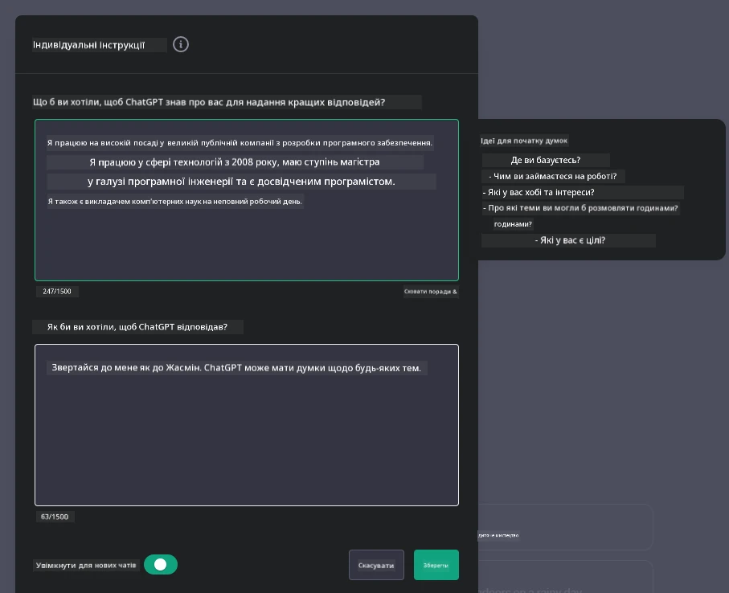
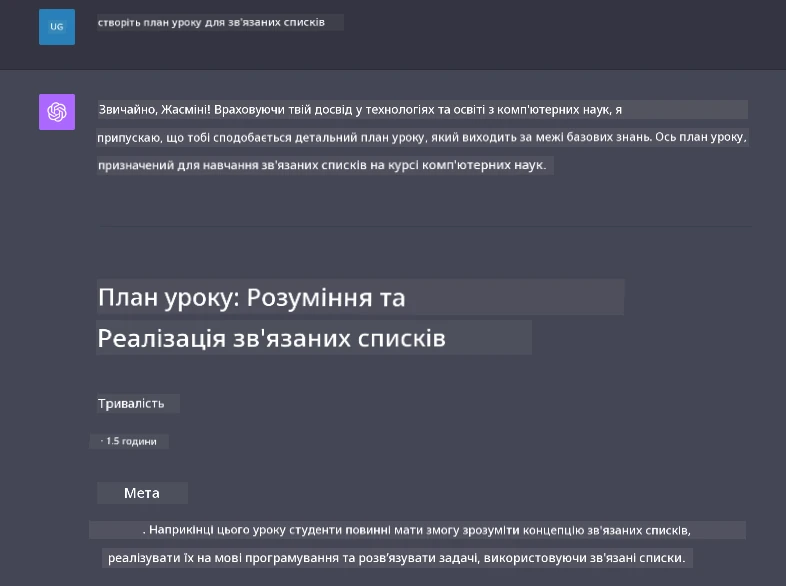

# Створення чат-застосунків на базі генеративного штучного інтелекту

[](https://youtu.be/R9V0ZY1BEQo?si=IHuU-fS9YWT8s4sA)

> _(Натисніть на зображення вище, щоб переглянути відео цього уроку)_

Тепер, коли ми побачили, як можна створювати застосунки для генерації тексту, давайте розглянемо чат-застосунки.

Чат-застосунки стали невід'ємною частиною нашого повсякденного життя, пропонуючи більше, ніж просто засіб для неформального спілкування. Вони є ключовими складовими обслуговування клієнтів, технічної підтримки та навіть складних консультаційних систем. Імовірно, що нещодавно ви отримували допомогу від чат-застосунку. Зі впровадженням більш просунутих технологій, таких як генеративний ШІ, в ці платформи зростає їх складність та супутні виклики.

Деякі питання, які потрібно розглянути:

- **Створення застосунку**. Як ефективно створювати та безперешкодно інтегрувати такі застосунки зі ШІ для конкретних випадків використання?
- **Моніторинг**. Після розгортання, як моніторити та забезпечувати найвищу якість роботи застосунків, як у функціональному плані, так і у відповідності до [шести принципів відповідального ШІ](https://www.microsoft.com/ai/responsible-ai?WT.mc_id=academic-105485-koreyst)?

У міру просування до епохи автоматизації та безшовної взаємодії людини й машини, стає необхідно розуміти, як генеративний ШІ змінює масштаб, глибину та адаптивність чат-застосунків. У цьому уроці буде досліджено аспекти архітектури, що підтримують такі складні системи, методи їх налаштування для доменно-специфічних завдань, а також оцінка показників та міркувань для забезпечення відповідального застосування ШІ.

## Вступ

У цьому уроці розглядається:

- Техніки для ефективного створення та інтеграції чат-застосунків.
- Як застосовувати кастомізацію та тонке налаштування застосунків.
- Стратегії та міркування для ефективного моніторингу чат-застосунків.

## Цілі навчання

Наприкінці цього уроку ви зможете:

- Описати питання, які слід враховувати при створенні та інтеграції чат-застосунків у існуючі системи.
- Налаштовувати чат-застосунки для конкретних випадків використання.
- Ідентифікувати ключові метрики та міркування для ефективного моніторингу та підтримки якості чат-застосунків на основі ШІ.
- Забезпечити відповідальне використання ШІ в чат-застосунках.

## Інтеграція генеративного ШІ в чат-застосунки

Підвищення можливостей чат-застосунків за допомогою генеративного ШІ стосується не лише їх «розумнішості», але й оптимізації архітектури, продуктивності та інтерфейсу користувача для забезпечення якісного досвіду. Це включає вивчення архітектурних основ, інтеграцій API та особливостей UI. Ця частина покликана надати вам комплексний план для орієнтації у цих складних сферах, чи то для інтеграції у існуючі системи, чи створення автономних платформ.

Наприкінці цього розділу ви будете оснащені знаннями для ефективного створення та інтеграції чат-застосунків.

### Чат-бот чи чат-застосунок?

Перш ніж зануритись у створення чат-застосунків, порівняймо «чат-ботів» із «чат-застосунками на базі ШІ», які виконують різні ролі і функціональність. Основна мета чат-бота — автоматизувати специфічні розмовні завдання, наприклад, відповідати на поширені питання або відстежувати посилку. Він зазвичай керується на основі правил або складних алгоритмів ШІ. У протилежність цьому, чат-застосунок на базі ШІ — це значно ширше середовище, призначене для різних форм цифрової комунікації, таких як текстові, голосові чи відеочати між користувачами. Головна особливість — інтеграція генеративної моделі ШІ, яка імітує тонкі, подібні до людських розмови, генеруючи відповіді на основі різноманітних вхідних даних та контексту. Чат-застосунок з генеративним ШІ може вести відкриті дискусії, адаптуватись до змін контексту та навіть створювати креативний чи складний діалог.

Нижче наведена таблиця ключових відмінностей та подібностей, щоб допомогти зрозуміти їхні унікальні ролі у цифровій комунікації.

| Чат-бот                             | Чат-застосунок на базі генеративного ШІ    |
| --------------------------------- | ------------------------------------------- |
| Зосереджений на завданнях, базується на правилах | Усвідомлює контекст                          |
| Часто інтегрований у більші системи | Може містити один або кілька чат-ботів      |
| Обмежений запрограмованими функціями | Включає генеративні моделі ШІ               |
| Спеціалізовані та структуровані взаємодії | Здатний до відкритих дискусій                 |

### Використання попередньо створених функціональностей за допомогою SDK та API

При створенні чат-застосунку чудовим першим кроком є оцінка того, що вже існує. Використання SDK та API для створення чат-застосунків — вигідна стратегія з кількох причин. Інтегруючи добре документовані SDK та API, ви стратегічно позиціонуєте ваш застосунок для довгострокового успіху, враховуючи масштабованість і підтримку.

- **Прискорює процес розробки та зменшує навантаження**: Використання готових функцій замість дорогої розробки дозволяє зосередитись на інших аспектах застосунку, таких як бізнес-логіка.
- **Краща продуктивність**: При розробці з нуля з'являються питання: “Чи масштабується це? Чи здатен застосунок обробити раптовий приріст користувачів?” Добре підтримувані SDK та API часто мають вбудовані рішення для цих питань.
- **Простіша підтримка**: Оновлення та покращення легше керувати, оскільки більшість API та SDK вимагають лише оновлення бібліотеки при випуску нової версії.
- **Доступ до передових технологій**: Використання моделей, які були тонко налаштовані та навчені на великих наборах даних, надає вашому застосунку можливості природної мови.

Доступ до функціональності SDK або API зазвичай вимагає отримання дозволу на використання послуг, зазвичай через унікальний ключ або токен аутентифікації. Ми використаємо бібліотеку OpenAI для Python, щоб продемонструвати це. Ви також можете спробувати самостійно в наступних [ноутбуках для OpenAI](./python/oai-assignment.ipynb?WT.mc_id=academic-105485-koreyst) або [Azure OpenAI Services](./python/aoai-assignment.ipynb?WT.mc_id=academic-105485-koreys) для цього уроку.

```python
import os
from openai import OpenAI

API_KEY = os.getenv("OPENAI_API_KEY","")

client = OpenAI(
    api_key=API_KEY
    )

response = client.responses.create(model="gpt-5-mini", input="Suggest two titles for an instructional lesson on chat applications for generative AI.", store=False)
print(response.output_text)
```

Наведений приклад використовує модель GPT-5 mini з API Responses для завершення підказки, але зверніть увагу, що ключ API встановлюється перед цим. Ви отримаєте помилку, якщо не встановите ключ.

## Користувацький досвід (UX)

Загальні принципи UX застосовуються до чат-застосунків, але тут є додаткові міркування, які стають особливо важливими через компоненти машинного навчання.

- **Механізм для розв’язання неоднозначностей**: Генеративні моделі ШІ іноді генерують неоднозначні відповіді. Функція, що дозволяє користувачам запитувати уточнення, може бути корисною за таких випадків.
- **Збереження контексту**: Просунуті генеративні моделі ШІ можуть пам’ятати контекст розмови, що є важливим для користувацького досвіду. Надання користувачам можливості керувати контекстом покращує UX, але створює ризик збереження чутливої інформації. Питання зберігання, наприклад, введення політики збереження, можуть збалансувати потребу в контексті та конфіденційність.
- **Персоналізація**: Завдяки здатності навчатися і адаптуватися ШІ-моделі пропонують індивідуалізований досвід. Налаштування UX через профілі користувачів не лише допомагає користувачу відчувати себе зрозумілим, а й сприяє більш ефективній взаємодії.

Один із прикладів персоналізації — налаштування "Custom instructions" в ChatGPT від OpenAI. Це дозволяє надати інформацію про себе, що може важити для контексту ваших запитів. Ось приклад такої інструкції.



Цей "профіль" спонукає ChatGPT створити план уроку про зв’язані списки. Зауважте, що ChatGPT враховує, що користувач хоче більш детальний план, базуючись на її досвіді.



### Microsoft System Message Framework для великих мовних моделей

[Microsoft надала рекомендації](https://learn.microsoft.com/azure/ai-foundry/openai/concepts/system-message#define-the-models-output-format?WT.mc_id=academic-105485-koreyst) щодо створення ефективних системних повідомлень для генерації відповідей від LLM, розділені на 4 напрямки:

1. Визначення для кого модель, а також її можливостей і обмежень.
2. Визначення формату вихідних даних моделі.
3. Надання конкретних прикладів, що демонструють бажану поведінку моделі.
4. Надання додаткових засобів контролю поведінки.

### Доступність

Незалежно від того, чи має користувач порушення зору, слуху, моторики чи когнітивні порушення, добре розроблений чат-застосунок має бути доступним для всіх. Наступний список розглядає конкретні функції, спрямовані на покращення доступності для різних типів порушень.

- **Функції для порушень зору**: Теми з високою контрастністю, масштабований текст, сумісність з читачами екрану.
- **Функції для порушень слуху**: Текст у мовлення та мовлення у текст, візуальні сповіщення про аудіо.
- **Функції для порушень моторики**: Підтримка навігації клавіатурою, голосові команди.
- **Функції для когнітивних порушень**: Спрощені мовні опції.

## Кастомізація та тонке налаштування для доменно-специфічних мовних моделей

Уявіть чат-застосунок, що розуміє жаргон вашої компанії і передбачає специфічні запити її користувачів. Існують кілька підходів, які варто розглянути:

- **Використання DSL-моделей**. DSL означає доменно-специфічну мову. Ви можете використовувати так звану DSL-модель, навчену на певній доменній області, щоб розуміти її концепції та сценарії.
- **Застосування тонкого налаштування**. Тонке налаштування — це процес додаткового тренування моделі на специфічних даних.

## Кастомізація: Використання DSL

Використання доменно-специфічних мовних моделей (DSL Моделі) може покращити залученість користувачів, надаючи спеціалізовані, контекстно-релевантні взаємодії. Це модель, натренована або тонко налаштована для розуміння і генерації тексту, пов’язаного з конкретною сферою, галуззю чи темою. Варіанти використання DSL-моделі можуть включати навчання з нуля, використання вже існуючих через SDK та API, або тонке налаштування, яке передбачає адаптацію існуючої попередньо навченої моделі для конкретного домену.

## Кастомізація: Застосування тонкого налаштування

Тонке налаштування часто застосовується тоді, коли попередньо навчена модель недостатньо ефективна у спеціалізованій області або для конкретного завдання.

Наприклад, медичні запити є складними і вимагають багато контексту. Коли медичний спеціаліст ставить діагноз, він спирається на різноманітні фактори, такі як спосіб життя чи наявність супутніх захворювань, а також може враховувати свіжі медичні публікації для підтвердження діагнозу. У таких тонких випадках загального застосунку ШІ для чатів не можна довіряти як надійному джерелу.

### Приклад: медичний застосунок

Розглянемо чат-застосунок, орієнтований на допомогу медичним працівникам, забезпечуючи швидкий доступ до керівництв з лікування, взаємодії лікарських засобів або останніх наукових досліджень.

Загальна модель може бути достатньою для відповідей на базові запитання чи загальні поради, але може мати труднощі з наступним:

- **Дуже специфічні або складні випадки**. Наприклад, невролог може запитати: "Які найкращі практики для лікування резистентної до препаратів епілепсії у дітей?"
- **Відсутність останніх новинок**. Загальна модель може не надати актуальної відповіді із урахуванням останніх досягнень неврології чи фармакології.

У таких випадках тонке налаштування моделі на спеціалізованому медичному датасеті може значно покращити її здатність обробляти складні медичні запити точніше і надійніше. Для цього потрібен великий релевантний датасет, що відображає доменно-специфічні виклики та питання, які потрібно вирішувати.

## Міркування для якісного ШІ-чат досвіду

У цьому розділі викладено критерії для «високоякісних» чат-застосунків, що включають збір вимірювань та дотримання рамок відповідального використання технологій ШІ.

### Ключові метрики

Для підтримання високої якості роботи застосунку важливо відстежувати ключові метрики та міркування. Ці показники не лише гарантують функціональність застосунку, а й оцінюють якість моделі ШІ та користувацький досвід. Нижче наведено список базових, AI та UX метрик, які слід враховувати.

| Метрика                      | Визначення                                                                                                       | Міркування для розробника чат-застосунку                 |
| ---------------------------- | ---------------------------------------------------------------------------------------------------------------- | --------------------------------------------------------- |
| **Uptime**                  | Вимірює час, коли застосунок працює та доступний користувачам.                                                   | Як ви мінімізуватимете час простою?                        |
| **Час відповіді**           | Час, який витрачає застосунок на відповідь користувачу.                                                         | Як ви можете оптимізувати обробку запитів для покращення часу відповіді? |
| **Точність (Precision)**     | Відношення істинно позитивних прогнозів до загальної кількості позитивних прогнозів.                            | Як ви перевірите точність вашої моделі?                     |
| **Повнота (Recall, чутливість)** | Відношення істинно позитивних прогнозів до фактичної кількості позитивів.                                      | Як ви вимірюватимете і покращуватимете повноту?            |
| **F1 Score**                | Гармонічне середнє точності і повноти, що збалансовує компроміс між ними.                                      | Яка ваша цільова оцінка F1? Як ви збалансуєте точність і повноту? |
| **Перплексія (Perplexity)**  | Вимірює, наскільки розподіл ймовірностей, передбачений моделлю, відповідає фактичному розподілу даних.           | Як ви мінімізуватимете перплексію?                         |
| **Метрики задоволення користувача** | Відображають сприйняття користувачем застосунку. Зазвичай збираються через опитування.                           | Як часто ви збираєте відгуки користувачів? Як ви адаптуєтесь на основі цього? |
| **Рівень помилок**           | Частка помилок моделі у розумінні чи виводі.                                                                    | Які стратегії у вас є для зниження рівня помилок?          |
| **Цикли повторного навчання** | Частота оновлення моделі для врахування нових даних і знань.                                                    | Як часто ви повторно навчатимете модель? Що спонукає до повторного навчання? |

| **Виявлення аномалій**    | Інструменти та методи для виявлення незвичайних шаблонів, які не відповідають очікуваній поведінці. | Як ви реагуватимете на аномалії?                                        |

### Впровадження відповідальних практик штучного інтелекту у чат-додатках

Підхід Microsoft до відповідального ШІ визначив шість принципів, які повинні керувати розробкою та використанням ШІ. Нижче наведено принципи, їх визначення та речі, які розробник чату повинен враховувати і чому він повинен їх серйозно сприймати.

| Принципи              | Визначення Microsoft                               | Роздуми для розробника чату                                          | Чому це важливо                                                                    |
| ---------------------- | ------------------------------------------------- | -------------------------------------------------------------------- | ---------------------------------------------------------------------------------- |
| Справедливість         | Системи ШІ повинні ставитися до всіх людей справедливо. | Забезпечити, щоб чат-додаток не дискримінував на основі даних користувача. | Для встановлення довіри і включності серед користувачів; запобігає юридичним наслідкам. |
| Надійність і безпека   | Системи ШІ повинні працювати надійно і безпечно.  | Впровадити тестування та засоби безвідмовної роботи для мінімізації помилок і ризиків. | Забезпечує задоволеність користувачів і запобігає потенційній шкоді.               |
| Конфіденційність і безпека | Системи ШІ мають бути безпечними і поважати приватність. | Впровадити сильне шифрування та заходи захисту даних.                | Для захисту конфіденційних даних користувачів і дотримання законів про приватність. |
| Інклюзивність          | Системи ШІ мають надавати можливості всім і залучати людей. | Проектувати UI/UX, що є доступним і простим у використанні для різноманітної аудиторії. | Забезпечує ефективне використання додатка ширшим колом людей.                      |
| Прозорість             | Системи ШІ мають бути зрозумілими.                 | Надавати чітку документацію та обґрунтування відповідей ШІ.           | Користувачі більше довіряють системі, якщо вони розуміють, як приймаються рішення.  |
| Відповідальність       | Люди повинні нести відповідальність за системи ШІ. | Встановити чіткий процес аудиту та вдосконалення рішень ШІ.           | Забезпечує постійне покращення і коригувальні заходи у разі помилок.               |

## Завдання

Перегляньте [завдання](../../../07-building-chat-applications/python). Воно проведе вас через серію вправ — від запуску перших чат-запитів до класифікації та підсумовування тексту й інших завдань. Зверніть увагу, що завдання доступні різними мовами програмування!

## Відмінна робота! Продовжуйте навчання

Після завершення цього уроку ознайомтеся з нашим [набором для вивчення генеративного ШІ](https://aka.ms/genai-collection?WT.mc_id=academic-105485-koreyst), щоб продовжити підвищувати свої знання з генеративного ШІ!

Перейдіть до Уроку 8, щоб дізнатися, як ви можете почати [створювати пошукові додатки](../08-building-search-applications/README.md?WT.mc_id=academic-105485-koreyst)!

---

<!-- CO-OP TRANSLATOR DISCLAIMER START -->
**Відмова від відповідальності**:
Цей документ було перекладено за допомогою сервісу штучного інтелекту для перекладу [Co-op Translator](https://github.com/Azure/co-op-translator). Хоча ми прагнемо до точності, будь ласка, майте на увазі, що автоматичні переклади можуть містити помилки або неточності. Оригінальний документ рідною мовою слід вважати авторитетним джерелом. Для критично важливої інформації рекомендується професійний людський переклад. Ми не несемо відповідальності за будь-які непорозуміння або неправильні тлумачення, що виникли внаслідок використання цього перекладу.
<!-- CO-OP TRANSLATOR DISCLAIMER END -->