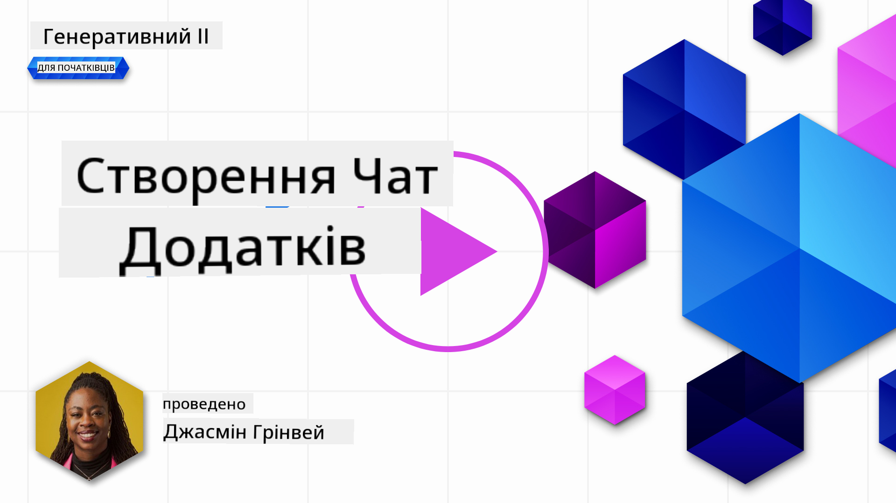
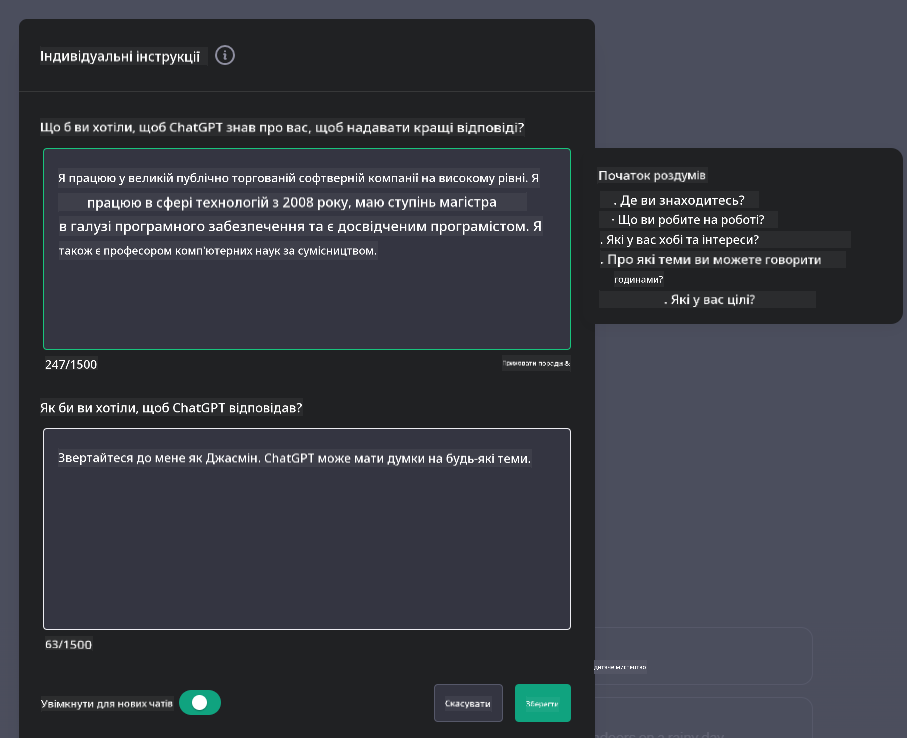
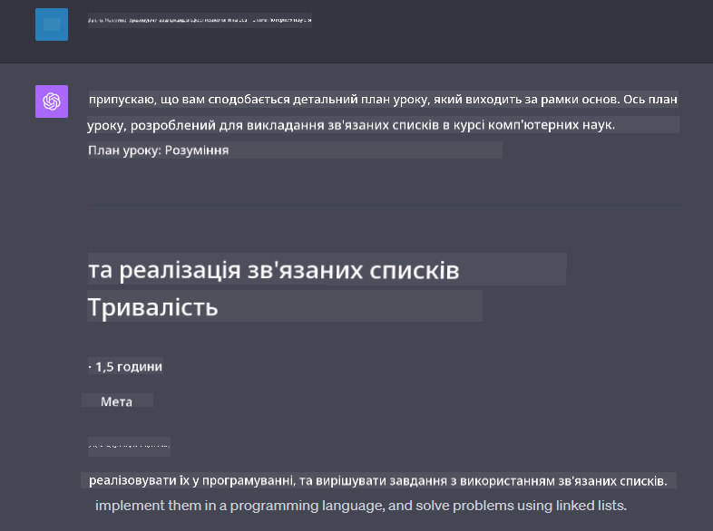

<!--
CO_OP_TRANSLATOR_METADATA:
{
  "original_hash": "ea4bbe640847aafbbba14dae4625e9af",
  "translation_date": "2025-06-25T16:07:13+00:00",
  "source_file": "07-building-chat-applications/README.md",
  "language_code": "uk"
}
-->
# Створення чат-додатків на основі генеративного штучного інтелекту

[](https://aka.ms/gen-ai-lessons7-gh?WT.mc_id=academic-105485-koreyst)

> _(Натисніть на зображення вище, щоб переглянути відео цього уроку)_

Тепер, коли ми розглянули, як можна створювати додатки для генерації тексту, давайте подивимося на чат-додатки.

Чат-додатки стали невід'ємною частиною нашого повсякденного життя, пропонуючи більше, ніж просто засіб для невимушеного спілкування. Вони є важливими елементами обслуговування клієнтів, технічної підтримки і навіть складних консультаційних систем. Ймовірно, ви нещодавно отримали допомогу від чат-додатку. Коли ми інтегруємо більш просунуті технології, такі як генеративний ШІ, у ці платформи, складність зростає, так само як і виклики.

Деякі питання, на які потрібно відповісти:

- **Створення додатку**. Як ефективно створити та безперешкодно інтегрувати ці додатки на основі ШІ для конкретних випадків використання?
- **Моніторинг**. Після розгортання, як ми можемо відстежувати та забезпечувати, що додатки працюють на найвищому рівні якості, як з точки зору функціональності, так і дотримання [шести принципів відповідального ШІ](https://www.microsoft.com/ai/responsible-ai?WT.mc_id=academic-105485-koreyst)?

У міру того, як ми рухаємося далі в епоху, визначену автоматизацією та безперешкодними взаємодіями людини і машини, розуміння того, як генеративний ШІ трансформує обсяг, глибину та адаптивність чат-додатків, стає необхідним. Цей урок досліджуватиме аспекти архітектури, що підтримують ці складні системи, заглиблюватиметься в методології їх налаштування для завдань, специфічних для домену, і оцінюватиме метрики та міркування, що стосуються забезпечення відповідального розгортання ШІ.

## Вступ

Цей урок охоплює:

- Техніки ефективного створення та інтеграції чат-додатків.
- Як застосовувати налаштування та тонке налаштування до додатків.
- Стратегії та міркування для ефективного моніторингу чат-додатків.

## Цілі навчання

До кінця цього уроку ви зможете:

- Описати міркування для створення та інтеграції чат-додатків у існуючі системи.
- Налаштувати чат-додатки для конкретних випадків використання.
- Визначити ключові метрики та міркування для ефективного моніторингу та підтримки якості чат-додатків на основі ШІ.
- Забезпечити, щоб чат-додатки відповідально використовували ШІ.

## Інтеграція генеративного ШІ у чат-додатки

Покращення чат-додатків за допомогою генеративного ШІ не лише зосереджено на тому, щоб зробити їх розумнішими; це також оптимізація їх архітектури, продуктивності та інтерфейсу користувача для надання якісного досвіду користувача. Це включає дослідження архітектурних основ, інтеграцій API та міркувань щодо інтерфейсу користувача. Цей розділ має на меті надати вам всебічну дорожню карту для навігації цими складними ландшафтами, незалежно від того, чи ви підключаєте їх до існуючих систем, чи створюєте їх як окремі платформи.

До кінця цього розділу ви будете оснащені знаннями, необхідними для ефективного створення та впровадження чат-додатків.

### Чат-бот чи чат-додаток?

Перш ніж ми перейдемо до створення чат-додатків, давайте порівняємо 'чат-ботів' з 'чат-додатками на основі ШІ', які виконують різні ролі та функції. Основна мета чат-бота - автоматизувати певні розмовні завдання, такі як відповіді на часто задавані питання або відстеження посилки. Зазвичай він керується логікою, заснованою на правилах, або складними алгоритмами ШІ. На відміну від цього, чат-додаток на основі ШІ є набагато ширшим середовищем, призначеним для полегшення різних форм цифрового спілкування, таких як текстові, голосові та відеочати серед людських користувачів. Його визначальною рисою є інтеграція генеративної моделі ШІ, яка імітує нюансовані, схожі на людські розмови, генеруючи відповіді на основі різноманітних вхідних даних та контекстних підказок. Чат-додаток на основі генеративного ШІ може брати участь у відкритих обговореннях, адаптуватися до змінюваних контекстів розмови та навіть створювати творчі або складні діалоги.

Нижче наведено таблицю, що описує ключові відмінності та подібності, які допоможуть нам зрозуміти їх унікальні ролі в цифровому спілкуванні.

| Чат-бот                               | Чат-додаток на основі генеративного ШІ |
| ------------------------------------- | -------------------------------------- |
| Зосереджений на завданні та заснований на правилах | Контекстно-обізнаний                    |
| Часто інтегрований у більші системи  | Може містити один або кілька чат-ботів |
| Обмежений запрограмованими функціями | Включає моделі генеративного ШІ        |
| Спеціалізовані та структуровані взаємодії | Здатний до відкритих обговорень        |

### Використання готових функціональностей за допомогою SDK та API

При створенні чат-додатку чудовим першим кроком є оцінка того, що вже існує. Використання SDK та API для створення чат-додатків є вигідною стратегією з різних причин. Інтегруючи добре задокументовані SDK та API, ви стратегічно позиціонуєте свій додаток для довгострокового успіху, вирішуючи питання масштабованості та підтримки.

- **Прискорює процес розробки та зменшує витрати**: Використання готових функціональностей замість витратного процесу їх створення самостійно дозволяє зосередитися на інших аспектах вашого додатку, які можуть бути для вас більш важливими, таких як бізнес-логіка.
- **Краща продуктивність**: Коли ви створюєте функціональність з нуля, ви рано чи пізно запитаєте себе: "Як це масштабується? Чи здатен цей додаток впоратися з раптовим напливом користувачів?" Добре підтримувані SDK та API часто мають вбудовані рішення для цих питань.
- **Легше обслуговування**: Оновлення та покращення легше управляти, оскільки більшість API та SDK вимагають лише оновлення бібліотеки, коли виходить нова версія.
- **Доступ до передових технологій**: Використання моделей, які були налаштовані та навчені на великих наборах даних, надає вашому додатку можливості обробки природної мови.

Доступ до функціональності SDK або API зазвичай передбачає отримання дозволу на використання наданих послуг, що часто здійснюється за допомогою унікального ключа або токена аутентифікації. Ми використаємо бібліотеку OpenAI Python, щоб дослідити, як це виглядає. Ви також можете спробувати це самостійно у наступному [ноутбуці для OpenAI](../../../07-building-chat-applications/python/oai-assignment.ipynb) або [ноутбуці для Azure OpenAI Services](../../../07-building-chat-applications/python/aoai-assignment.ipynb) для цього уроку.

```python
import os
from openai import OpenAI

API_KEY = os.getenv("OPENAI_API_KEY","")

client = OpenAI(
    api_key=API_KEY
    )

chat_completion = client.chat.completions.create(model="gpt-3.5-turbo", messages=[{"role": "user", "content": "Suggest two titles for an instructional lesson on chat applications for generative AI."}])
```

У наведеному вище прикладі використовується модель GPT-3.5 Turbo для завершення запиту, але зверніть увагу, що ключ API встановлюється перед цим. Ви отримаєте помилку, якщо не встановите ключ.

## Досвід користувача (UX)

Загальні принципи UX застосовуються до чат-додатків, але ось деякі додаткові міркування, які стають особливо важливими через компоненти машинного навчання, що використовуються.

- **Механізм для вирішення неоднозначності**: Генеративні моделі ШІ іноді генерують неоднозначні відповіді. Функція, яка дозволяє користувачам просити роз'яснень, може бути корисною, якщо вони стикаються з цією проблемою.
- **Збереження контексту**: Розширені генеративні моделі ШІ мають здатність запам'ятовувати контекст у розмові, що може бути необхідним активом для досвіду користувача. Надання користувачам можливості контролювати та керувати контекстом покращує досвід користувача, але вводить ризик збереження конфіденційної інформації користувача. Розгляньте, як довго ця інформація зберігається, наприклад, введення політики збереження, щоб збалансувати потребу в контексті проти конфіденційності.
- **Персоналізація**: З можливістю навчатися та адаптуватися, моделі ШІ пропонують індивідуальний досвід для користувача. Налаштування досвіду користувача за допомогою таких функцій, як профілі користувачів, не лише змушує користувача відчувати себе зрозумілим, але й допомагає йому в пошуку конкретних відповідей, створюючи більш ефективну та задовольняючу взаємодію.

Одним із прикладів персоналізації є налаштування "Користувацькі інструкції" в ChatGPT від OpenAI. Воно дозволяє вам надати інформацію про себе, яка може бути важливим контекстом для ваших запитів. Ось приклад користувацької інструкції.



Цей "профіль" спонукає ChatGPT створити план уроку з пов'язаних списків. Зверніть увагу, що ChatGPT бере до уваги, що користувач може захотіти більш глибокий план уроку, виходячи з її досвіду.



### Системна повідомлення від Microsoft для великих мовних моделей

[Microsoft надає керівництво](https://learn.microsoft.com/azure/ai-services/openai/concepts/system-message#define-the-models-output-format?WT.mc_id=academic-105485-koreyst) для написання ефективних системних повідомлень при генерації відповідей від LLM, розбите на 4 області:

1. Визначення, для кого призначена модель, а також її можливості та обмеження.
2. Визначення формату виходу моделі.
3. Надання конкретних прикладів, які демонструють передбачувану поведінку моделі.
4. Надання додаткових обмежень поведінки.

### Доступність

Незалежно від того, чи має користувач візуальні, слухові, моторні чи когнітивні порушення, добре розроблений чат-додаток повинен бути доступним для всіх. Наступний список розбиває конкретні функції, спрямовані на покращення доступності для різних порушень користувачів.

- **Функції для порушень зору**: Теми з високою контрастністю та можливість зміни розміру тексту, сумісність з екранними читачами.
- **Функції для порушень слуху**: Функції перетворення тексту в мову та мови в текст, візуальні підказки для аудіо сповіщень.
- **Функції для моторних порушень**: Підтримка навігації клавіатурою, голосові команди.
- **Функції для когнітивних порушень**: Опції спрощеної мови.

## Налаштування та тонке налаштування для мовних моделей, специфічних для домену

Уявіть собі чат-додаток, який розуміє жаргон вашої компанії та передбачає конкретні запити, які зазвичай має його користувацька база. Є кілька підходів, які варто згадати:

- **Використання моделей DSL**. DSL означає мова, специфічна для домену. Ви можете використовувати так звану модель DSL, навчену на певному домені, щоб розуміти її концепції та сценарії.
- **Застосування тонкого налаштування**. Тонке налаштування - це процес подальшого навчання вашої моделі за допомогою конкретних даних.

## Налаштування: Використання DSL

Використання моделей мови, специфічних для домену (DSL Models), може покращити залученість користувачів, надаючи спеціалізовані, контекстно релевантні взаємодії. Це модель, яка навчена або тонко налаштована для розуміння та генерації тексту, пов'язаного з певною галуззю, індустрією або предметом. Варіанти використання моделі DSL можуть варіюватися від навчання з нуля до використання вже існуючих через SDK та API. Інший варіант - тонке налаштування, яке передбачає адаптацію вже існуючої попередньо навченої моделі для конкретного домену.

## Налаштування: Застосування тонкого налаштування

Тонке налаштування часто розглядається, коли попередньо навчена модель не відповідає вимогам у спеціалізованому домені або конкретному завданні.

Наприклад, медичні запити є складними і вимагають багато контексту. Коли медичний працівник діагностує пацієнта, це засновано на різноманітних факторах, таких як спосіб життя або існуючі захворювання, і може навіть покладатися на недавні медичні журнали для підтвердження свого діагнозу. У таких нюансованих сценаріях загальнопризначений чат-додаток ШІ не може бути надійним джерелом.

### Сценарій: медичний додаток

Розгляньте чат-додаток, розроблений для допомоги медичним працівникам, надаючи швидкі посилання на керівництва з лікування, взаємодії з ліками або недавні наукові дослідження.

Загальнопризначена модель може бути адекватною для відповіді на основні медичні питання або надання загальних порад, але може мати труднощі з наступним:

- **Дуже специфічні або складні випадки**. Наприклад, невролог може запитати додаток: "Які поточні найкращі практики управління резистентною до ліків епілепсією у дітей?"
- **Відсутність останніх досягнень**. Загальнопризначена модель може мати труднощі з наданням актуальної відповіді, яка враховує останні досягнення в неврології та фармакології.

У таких випадках тонке налаштування моделі за допомогою спеціалізованого медичного набору даних може значно покращити її здатність справлятися з цими складними медичними запитами більш точно та надійно. Це вимагає доступу до великого та релевантного набору даних, який представляє доменно-специфічні виклики та питання, які потрібно вирішити.

## Міркування для високоякісного досвіду роботи з чатами на основі ШІ

Цей розділ описує критерії "високоякі

**Відмова від відповідальності**:  
Цей документ було перекладено за допомогою служби автоматичного перекладу [Co-op Translator](https://github.com/Azure/co-op-translator). Хоча ми прагнемо до точності, зверніть увагу, що автоматичні переклади можуть містити помилки або неточності. Оригінальний документ на його рідній мові слід вважати авторитетним джерелом. Для критичної інформації рекомендується професійний людський переклад. Ми не несемо відповідальності за будь-які непорозуміння або неправильні тлумачення, що виникають внаслідок використання цього перекладу.