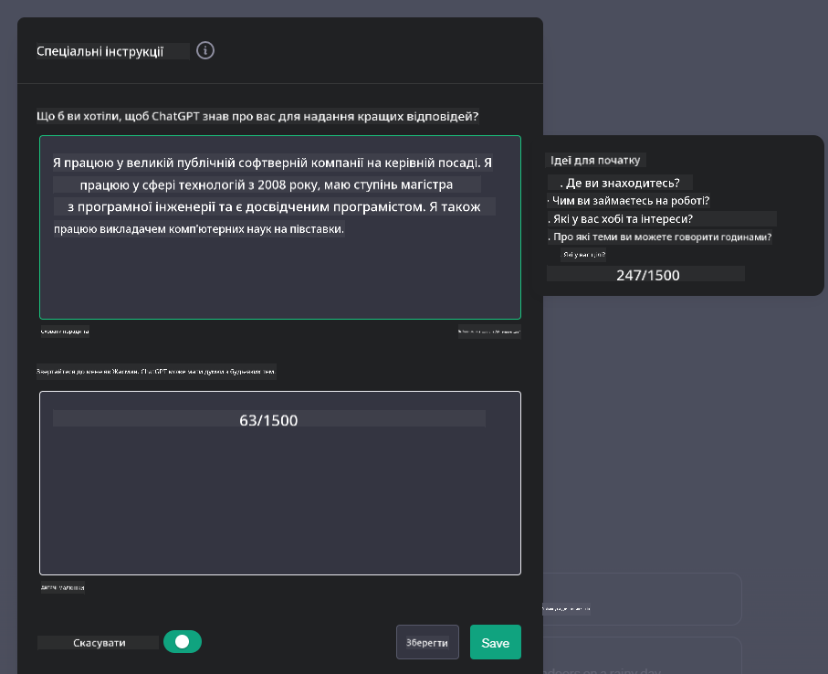

<!--
CO_OP_TRANSLATOR_METADATA:
{
  "original_hash": "ea4bbe640847aafbbba14dae4625e9af",
  "translation_date": "2025-07-09T12:44:36+00:00",
  "source_file": "07-building-chat-applications/README.md",
  "language_code": "uk"
}
-->
# Створення чат-додатків на основі генеративного ШІ

[](https://aka.ms/gen-ai-lessons7-gh?WT.mc_id=academic-105485-koreyst)

> _(Натисніть на зображення вище, щоб переглянути відео цього уроку)_

Тепер, коли ми побачили, як можна створювати додатки для генерації тексту, давайте розглянемо чат-додатки.

Чат-додатки стали невід’ємною частиною нашого повсякденного життя, пропонуючи не лише засіб для неформального спілкування. Вони є ключовими елементами обслуговування клієнтів, технічної підтримки та навіть складних консультативних систем. Ймовірно, ви нещодавно отримували допомогу через чат-додаток. Зі впровадженням більш просунутих технологій, таких як генеративний ШІ, у ці платформи, зростає складність і виклики.

Деякі питання, на які нам потрібно знайти відповіді:

- **Створення додатку**. Як ефективно розробити та безшовно інтегрувати ці додатки на основі ШІ для конкретних випадків використання?
- **Моніторинг**. Після розгортання, як ми можемо контролювати та забезпечувати найвищу якість роботи додатків, як з точки зору функціональності, так і дотримання [шести принципів відповідального ШІ](https://www.microsoft.com/ai/responsible-ai?WT.mc_id=academic-105485-koreyst)?

У міру того, як ми рухаємося в епоху автоматизації та безшовної взаємодії людини і машини, розуміння того, як генеративний ШІ змінює масштаб, глибину та адаптивність чат-додатків, стає надзвичайно важливим. Цей урок розгляне архітектурні аспекти, що підтримують ці складні системи, методи їх тонкого налаштування для специфічних завдань, а також оцінить метрики та фактори, що забезпечують відповідальне впровадження ШІ.

## Вступ

У цьому уроці розглядаються:

- Техніки ефективного створення та інтеграції чат-додатків.
- Як застосовувати налаштування та тонке налаштування додатків.
- Стратегії та рекомендації для ефективного моніторингу чат-додатків.

## Цілі навчання

Після завершення цього уроку ви зможете:

- Описати особливості створення та інтеграції чат-додатків у існуючі системи.
- Налаштовувати чат-додатки для конкретних випадків використання.
- Визначати ключові метрики та фактори для ефективного моніторингу та підтримки якості чат-додатків на основі ШІ.
- Забезпечувати відповідальне використання ШІ у чат-додатках.

## Інтеграція генеративного ШІ у чат-додатки

Покращення чат-додатків за допомогою генеративного ШІ — це не лише про те, щоб зробити їх розумнішими; це про оптимізацію архітектури, продуктивності та інтерфейсу користувача для забезпечення якісного досвіду. Це включає вивчення архітектурних основ, інтеграції API та особливостей інтерфейсу користувача. Цей розділ має на меті надати вам комплексний план дій для орієнтації у цих складних питаннях, незалежно від того, чи інтегруєте ви їх у існуючі системи, чи створюєте окремі платформи.

Після цього розділу ви матимете необхідні знання для ефективного створення та впровадження чат-додатків.

### Чатбот чи чат-додаток?

Перш ніж перейти до створення чат-додатків, давайте порівняємо «чатботи» та «чат-додатки на основі ШІ», які виконують різні ролі та функції. Основна мета чатбота — автоматизувати конкретні розмовні завдання, наприклад, відповідати на поширені запитання або відстежувати посилку. Зазвичай він керується логікою на основі правил або складними алгоритмами ШІ. Натомість чат-додаток на основі ШІ — це значно ширше середовище, призначене для різних форм цифрового спілкування, таких як текстові, голосові та відеочати між користувачами. Його ключова особливість — інтеграція генеративної моделі ШІ, яка імітує тонкі, схожі на людські, розмови, генеруючи відповіді на основі різноманітних вхідних даних і контексту. Чат-додаток на основі генеративного ШІ може вести відкриті дискусії, адаптуватися до змін у контексті розмови та навіть створювати креативний або складний діалог.

Таблиця нижче підкреслює основні відмінності та схожості, щоб краще зрозуміти їхні унікальні ролі у цифровому спілкуванні.

| Чатбот                              | Чат-додаток на основі генеративного ШІ |
| ---------------------------------- | -------------------------------------- |
| Орієнтований на завдання та базується на правилах | Усвідомлює контекст                     |
| Часто інтегрований у більші системи | Може містити один або кілька чатботів  |
| Обмежений запрограмованими функціями | Включає генеративні моделі ШІ          |
| Спеціалізовані та структуровані взаємодії | Здатний до відкритих дискусій           |

### Використання готових функцій через SDK та API

При створенні чат-додатку гарним першим кроком є оцінка наявних рішень. Використання SDK та API для розробки чат-додатків — це вигідна стратегія з кількох причин. Інтегруючи добре документовані SDK та API, ви стратегічно налаштовуєте свій додаток на довгостроковий успіх, враховуючи масштабованість і підтримку.

- **Прискорює процес розробки та знижує навантаження**: Використання готових функцій замість дорогого створення їх з нуля дозволяє зосередитися на інших важливих аспектах додатку, наприклад, бізнес-логіці.
- **Краща продуктивність**: При розробці функціоналу з нуля ви рано чи пізно запитаєте себе: «Як це масштабується? Чи зможе додаток впоратися з раптовим напливом користувачів?» Добре підтримувані SDK та API часто мають вбудовані рішення для цих питань.
- **Легше обслуговування**: Оновлення та покращення простіше керувати, оскільки більшість API та SDK вимагають лише оновлення бібліотеки при виході нової версії.
- **Доступ до передових технологій**: Використання моделей, які були тонко налаштовані та навчені на великих наборах даних, надає вашому додатку можливості природної мови.

Доступ до функціоналу SDK або API зазвичай вимагає отримання дозволу на використання сервісів, що часто здійснюється через унікальний ключ або токен автентифікації. Ми використаємо бібліотеку OpenAI для Python, щоб показати, як це виглядає. Ви також можете спробувати це самостійно у наступних [ноутбуках для OpenAI](python/oai-assignment.ipynb) або [ноутбуках для Azure OpenAI Services](python/aoai-assignment.ipynb) для цього уроку.

```python
import os
from openai import OpenAI

API_KEY = os.getenv("OPENAI_API_KEY","")

client = OpenAI(
    api_key=API_KEY
    )

chat_completion = client.chat.completions.create(model="gpt-3.5-turbo", messages=[{"role": "user", "content": "Suggest two titles for an instructional lesson on chat applications for generative AI."}])
```

У наведеному прикладі використовується модель GPT-3.5 Turbo для завершення запиту, але зверніть увагу, що ключ API встановлюється перед цим. Якщо ключ не встановити, ви отримаєте помилку.

## Користувацький досвід (UX)

Загальні принципи UX застосовуються до чат-додатків, але є додаткові аспекти, які стають особливо важливими через компоненти машинного навчання.

- **Механізм для усунення неоднозначності**: Генеративні моделі ШІ іноді створюють неоднозначні відповіді. Функція, що дозволяє користувачам запитувати уточнення, може бути корисною у таких випадках.
- **Збереження контексту**: Просунуті генеративні моделі ШІ можуть запам’ятовувати контекст розмови, що є важливим для користувацького досвіду. Надання користувачам можливості контролювати та керувати контекстом покращує досвід, але водночас створює ризик збереження конфіденційної інформації. Варто враховувати, як довго зберігати ці дані, наприклад, впроваджуючи політику збереження, щоб збалансувати потребу в контексті та конфіденційність.
- **Персоналізація**: Завдяки здатності навчатися та адаптуватися, моделі ШІ пропонують індивідуальний досвід для користувача. Налаштування досвіду через функції, як-от профілі користувачів, не лише допомагає користувачу відчувати себе зрозумілим, а й сприяє більш ефективному та задовільному пошуку конкретних відповідей.

Прикладом персоналізації є налаштування "Custom instructions" у ChatGPT від OpenAI. Вони дозволяють надати інформацію про себе, яка може бути важливим контекстом для ваших запитів. Ось приклад такої інструкції.



Цей "профіль" підказує ChatGPT створити план уроку з пов’язаних списків. Зверніть увагу, що ChatGPT враховує, що користувач може хотіти більш глибокий план уроку, виходячи з її досвіду.


### Система повідомлень Microsoft для великих мовних моделей

[Microsoft надала рекомендації](https://learn.microsoft.com/azure/ai-services/openai/concepts/system-message#define-the-models-output-format?WT.mc_id=academic-105485-koreyst) щодо написання ефективних системних повідомлень при генерації відповідей від LLM, розбиті на 4 напрямки:

1. Визначення, для кого призначена модель, а також її можливостей і обмежень.
2. Визначення формату виводу моделі.
3. Надання конкретних прикладів, що демонструють бажану поведінку моделі.
4. Забезпечення додаткових обмежень поведінки.

### Доступність

Незалежно від того, чи має користувач порушення зору, слуху, моторики або когнітивні порушення, добре спроектований чат-додаток має бути доступним для всіх. Нижче наведено перелік функцій, спрямованих на покращення доступності для різних типів порушень.

- **Функції для порушень зору**: Теми з високою контрастністю та масштабований текст, сумісність з екранними читалками.
- **Функції для порушень слуху**: Функції перетворення тексту в мову та мови в текст, візуальні сповіщення про аудіо.
- **Функції для порушень моторики**: Підтримка навігації клавіатурою, голосові команди.
- **Функції для когнітивних порушень**: Варіанти спрощеної мови.

## Налаштування та тонке налаштування для доменно-специфічних мовних моделей

Уявіть чат-додаток, який розуміє жаргон вашої компанії та передбачає типові запити користувачів. Існує кілька підходів, які варто розглянути:

- **Використання DSL-моделей**. DSL означає доменно-специфічна мова. Ви можете використовувати так звану DSL-модель, навчену на конкретній доменній області, щоб розуміти її концепції та сценарії.
- **Застосування тонкого налаштування**. Тонке налаштування — це процес подальшого навчання вашої моделі на специфічних даних.

## Налаштування: Використання DSL

Використання доменно-специфічних мовних моделей (DSL-моделей) може підвищити залученість користувачів, забезпечуючи спеціалізовані, контекстно релевантні взаємодії. Це модель, навчена або тонко налаштована для розуміння та генерації тексту, пов’язаного з певною галуззю, індустрією чи темою. Варіанти використання DSL-моделі можуть варіюватися від навчання з нуля до використання вже існуючих через SDK та API. Інший варіант — тонке налаштування, що передбачає адаптацію існуючої попередньо навчену модель для конкретної доменної області.

## Налаштування: Застосування тонкого налаштування

Тонке налаштування часто розглядають, коли попередньо навчена модель не справляється з завданнями у спеціалізованій доменній області або конкретному завданні.

Наприклад, медичні запити є складними і вимагають великого контексту. Коли медичний фахівець ставить діагноз, він базується на різних факторах, таких як спосіб життя або наявність хронічних захворювань, а також може покладатися на останні медичні публікації для підтвердження діагнозу. У таких тонких випадках загального чат-додатку на основі ШІ недостатньо.

### Приклад: медичний додаток

Розглянемо чат-додаток, створений для допомоги медичним працівникам, який надає швидкий доступ до рекомендацій з лікування, взаємодії ліків або останніх досліджень.

Загальна модель може бути достатньою для відповіді на базові медичні питання або надання загальних порад, але вона може мати труднощі з такими випадками:

- **Вкрай специфічні або складні випадки**. Наприклад, невролог може запитати: «Які нинішні найкращі практики лікування медикаментозно-резистентної епілепсії у дітей?»
- **Відсутність останніх досягнень**. Загальна модель може не надати актуальну відповідь, що враховує найновіші досягнення в неврології та фармакології.

У таких випадках тонке налаштування моделі на спеціалізованому медичному наборі даних значно покращує її здатність точно і надійно обробляти складні медичні запити. Для цього потрібен великий і релевантний набір даних, що відображає доменно-специфічні виклики та питання.

## Вимоги до високоякісного досвіду чат-додатків на основі ШІ

У цьому розділі описуються критерії «високоякісних» чат-додатків, які включають збір корисних метрик та дотримання рамок, що відповідально використовують технології ШІ.

### Ключові метрики

Для підтримки високої якості роботи додатку важливо відстежувати ключові метрики та фактори. Ці показники не лише забезпечують функціональність додатку, а й оцінюють якість моделі ШІ та користувацький досвід. Нижче наведено список базових, AI- та UX-метрик, які варто враховувати.

| Метрика                      | Визначення                                                                                                            | Рекомендації для розробника чат-додатків                          |
| ---------------------------- | --------------------------------------------------------------------------------------------------------------------- | ----------------------------------------------------------------- |
| **Час безвідмовної роботи (Uptime)** | Вимірює час, протягом якого додаток працює та доступний користувачам.                                               | Як ви мінімізуватимете час простою?                              |
| **Час відповіді**            | Час, який потрібен додатку для відповіді на запит користувача.                                                        | Як оптим
| **Виявлення аномалій**         | Інструменти та методи для ідентифікації незвичних патернів, які не відповідають очікуваній поведінці.                        | Як ви реагуватимете на аномалії?                                        |

### Впровадження відповідальних практик штучного інтелекту в чат-додатках

Підхід Microsoft до відповідального ШІ визначив шість принципів, які мають керувати розробкою та використанням ШІ. Нижче наведено принципи, їх визначення, а також те, що розробник чат-додатків повинен враховувати і чому це важливо.

| Принципи               | Визначення Microsoft                                | Рекомендації для розробника чат-додатків                              | Чому це важливо                                                                     |
| ---------------------- | -------------------------------------------------- | --------------------------------------------------------------------- | ----------------------------------------------------------------------------------- |
| Справедливість          | Системи ШІ повинні справедливо ставитися до всіх.  | Переконайтеся, що чат-додаток не дискримінує користувачів за даними. | Для формування довіри та інклюзивності серед користувачів; уникнення юридичних наслідків. |
| Надійність і безпека   | Системи ШІ повинні працювати надійно та безпечно.  | Впроваджуйте тестування та захисні механізми для мінімізації помилок і ризиків. | Забезпечує задоволення користувачів і запобігає потенційній шкоді.                  |
| Конфіденційність і безпека | Системи ШІ повинні бути захищеними та поважати приватність. | Використовуйте надійне шифрування та заходи захисту даних.            | Для захисту чутливих даних користувачів і дотримання законів про приватність.      |
| Інклюзивність          | Системи ШІ повинні надавати можливості всім і залучати людей. | Розробляйте UI/UX, доступний і зручний для різних аудиторій.          | Забезпечує ефективне використання додатка ширшим колом користувачів.               |
| Прозорість             | Системи ШІ повинні бути зрозумілими.                | Надавайте чітку документацію та пояснення щодо відповідей ШІ.         | Користувачі більше довіряють системі, якщо розуміють, як приймаються рішення.       |
| Відповідальність       | Люди повинні нести відповідальність за системи ШІ. | Встановіть чіткий процес аудиту та покращення рішень ШІ.              | Забезпечує постійне вдосконалення та можливість виправлення помилок.                |

## Завдання

Перегляньте [завдання](../../../07-building-chat-applications/python) — воно проведе вас через серію вправ: від запуску перших чат-запитів до класифікації, підсумовування тексту та іншого. Зверніть увагу, що завдання доступні різними мовами програмування!

## Відмінна робота! Продовжуйте навчання

Після завершення цього уроку ознайомтеся з нашою [колекцією з навчання генеративного ШІ](https://aka.ms/genai-collection?WT.mc_id=academic-105485-koreyst), щоб продовжити підвищувати свої знання у цій сфері!

Перейдіть до Уроку 8, щоб дізнатися, як почати [створювати пошукові додатки](../08-building-search-applications/README.md?WT.mc_id=academic-105485-koreyst)!

**Відмова від відповідальності**:  
Цей документ було перекладено за допомогою сервісу автоматичного перекладу [Co-op Translator](https://github.com/Azure/co-op-translator). Хоча ми прагнемо до точності, будь ласка, майте на увазі, що автоматичні переклади можуть містити помилки або неточності. Оригінальний документ рідною мовою слід вважати авторитетним джерелом. Для критично важливої інформації рекомендується звертатися до професійного людського перекладу. Ми не несемо відповідальності за будь-які непорозуміння або неправильні тлумачення, що виникли внаслідок використання цього перекладу.