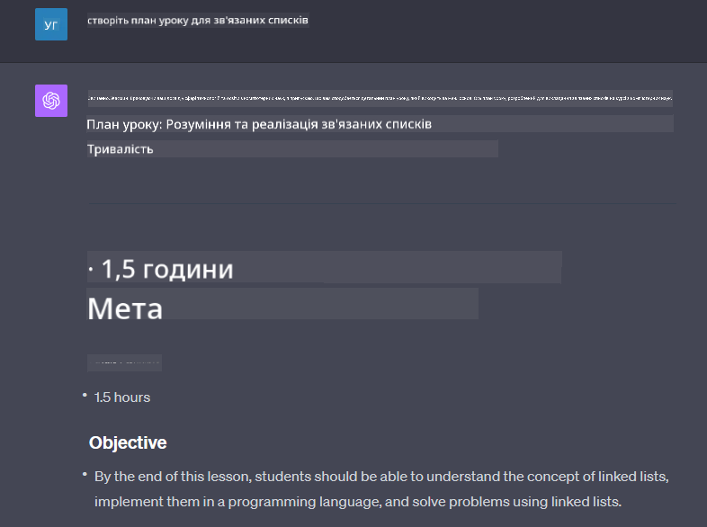

<!--
CO_OP_TRANSLATOR_METADATA:
{
  "original_hash": "a5308963a56cfbad2d73b0fa99fe84b3",
  "translation_date": "2025-10-18T02:17:49+00:00",
  "source_file": "07-building-chat-applications/README.md",
  "language_code": "uk"
}
-->
# Створення чат-додатків на основі генеративного штучного інтелекту

[](https://youtu.be/R9V0ZY1BEQo?si=IHuU-fS9YWT8s4sA)

> _(Натисніть на зображення вище, щоб переглянути відео цього уроку)_

Тепер, коли ми розглянули, як створювати додатки для генерації тексту, давайте перейдемо до чат-додатків.

Чат-додатки стали невід'ємною частиною нашого повсякденного життя, пропонуючи більше, ніж просто засіб для неформального спілкування. Вони є важливими елементами обслуговування клієнтів, технічної підтримки та навіть складних консультаційних систем. Ймовірно, ви нещодавно отримували допомогу від чат-додатка. З інтеграцією більш просунутих технологій, таких як генеративний штучний інтелект, складність цих платформ зростає, як і виклики.

Деякі питання, на які потрібно знайти відповіді:

- **Створення додатка**. Як ефективно створити та безперешкодно інтегрувати ці додатки на основі штучного інтелекту для конкретних випадків використання?
- **Моніторинг**. Після впровадження, як ми можемо контролювати та забезпечувати, щоб додатки працювали на найвищому рівні якості, як з точки зору функціональності, так і дотримання [шести принципів відповідального штучного інтелекту](https://www.microsoft.com/ai/responsible-ai?WT.mc_id=academic-105485-koreyst)?

У міру того, як ми рухаємося до епохи, визначеної автоматизацією та безперешкодною взаємодією між людьми та машинами, розуміння того, як генеративний штучний інтелект трансформує масштаб, глибину та адаптивність чат-додатків, стає важливим. У цьому уроці ми розглянемо аспекти архітектури, які підтримують ці складні системи, дослідимо методології для їх налаштування під конкретні завдання та оцінюємо метрики та аспекти, важливі для забезпечення відповідального впровадження штучного інтелекту.

## Вступ

Цей урок охоплює:

- Техніки ефективного створення та інтеграції чат-додатків.
- Як застосовувати налаштування та тонке налаштування до додатків.
- Стратегії та аспекти ефективного моніторингу чат-додатків.

## Цілі навчання

До кінця цього уроку ви зможете:

- Описати аспекти створення та інтеграції чат-додатків у існуючі системи.
- Налаштовувати чат-додатки для конкретних випадків використання.
- Визначати ключові метрики та аспекти для ефективного моніторингу та підтримки якості чат-додатків на основі штучного інтелекту.
- Забезпечувати відповідальне використання штучного інтелекту в чат-додатках.

## Інтеграція генеративного штучного інтелекту в чат-додатки

Покращення чат-додатків за допомогою генеративного штучного інтелекту полягає не лише в тому, щоб зробити їх розумнішими; це також оптимізація їхньої архітектури, продуктивності та інтерфейсу користувача для забезпечення якісного користувацького досвіду. Це включає дослідження основ архітектури, інтеграції API та аспектів інтерфейсу користувача. Цей розділ має на меті надати вам всебічну дорожню карту для навігації цими складними ландшафтами, незалежно від того, чи інтегруєте ви їх у існуючі системи, чи створюєте як автономні платформи.

До кінця цього розділу ви будете оснащені знаннями, необхідними для ефективного створення та інтеграції чат-додатків.

### Чат-бот чи чат-додаток?

Перш ніж перейти до створення чат-додатків, давайте порівняємо "чат-ботів" із "чат-додатками на основі штучного інтелекту", які виконують різні функції. Основна мета чат-бота — автоматизувати конкретні завдання спілкування, такі як відповіді на часто задавані питання або відстеження посилки. Зазвичай він керується логікою на основі правил або складними алгоритмами штучного інтелекту. Натомість чат-додаток на основі штучного інтелекту — це набагато ширше середовище, призначене для сприяння різним формам цифрового спілкування, таким як текстові, голосові та відеочати між користувачами. Його визначальною особливістю є інтеграція генеративної моделі штучного інтелекту, яка імітує тонкі, людські розмови, генеруючи відповіді на основі різноманітних вхідних даних і контексту.

Таблиця нижче показує ключові відмінності та схожості, щоб допомогти нам зрозуміти їхні унікальні ролі в цифровому спілкуванні.

| Чат-бот                            | Чат-додаток на основі генеративного ШІ |
| ----------------------------------- | -------------------------------------- |
| Орієнтований на завдання, базується на правилах | Контекстуально обізнаний               |
| Часто інтегрований у більші системи | Може містити один або кілька чат-ботів |
| Обмежений запрограмованими функціями | Інтегрує моделі генеративного ШІ       |
| Спеціалізовані та структуровані взаємодії | Здатний до відкритих дискусій          |

### Використання готових функцій за допомогою SDK та API

Під час створення чат-додатка чудовим першим кроком є оцінка того, що вже доступно. Використання SDK та API для створення чат-додатків — це вигідна стратегія з кількох причин. Інтегруючи добре документовані SDK та API, ви стратегічно позиціонуєте свій додаток для довгострокового успіху, вирішуючи питання масштабованості та обслуговування.

- **Прискорює процес розробки та зменшує витрати**: Використання готових функцій замість дорогого процесу їх створення дозволяє зосередитися на інших аспектах вашого додатка, які можуть бути важливішими, наприклад, бізнес-логіці.
- **Краща продуктивність**: Під час створення функціоналу з нуля ви рано чи пізно запитаєте себе: "Як це масштабувати? Чи здатний цей додаток обробляти раптовий наплив користувачів?" Добре підтримувані SDK та API часто мають вбудовані рішення для цих питань.
- **Простота обслуговування**: Оновлення та покращення легше управляти, оскільки більшість API та SDK просто потребують оновлення бібліотеки при виході нової версії.
- **Доступ до передових технологій**: Використання моделей, які були тонко налаштовані та навчені на великих наборах даних, забезпечує ваш додаток можливостями обробки природної мови.

Доступ до функціоналу SDK або API зазвичай передбачає отримання дозволу на використання наданих послуг, що часто здійснюється через використання унікального ключа або токена автентифікації. Ми використаємо бібліотеку OpenAI Python, щоб дослідити, як це виглядає. Ви також можете спробувати це самостійно у наступному [ноутбуці для OpenAI](./python/oai-assignment.ipynb?WT.mc_id=academic-105485-koreyst) або [ноутбуці для Azure OpenAI Services](./python/aoai-assignment.ipynb?WT.mc_id=academic-105485-koreys) для цього уроку.

```python
import os
from openai import OpenAI

API_KEY = os.getenv("OPENAI_API_KEY","")

client = OpenAI(
    api_key=API_KEY
    )

chat_completion = client.chat.completions.create(model="gpt-3.5-turbo", messages=[{"role": "user", "content": "Suggest two titles for an instructional lesson on chat applications for generative AI."}])
```

У наведеному вище прикладі використовується модель GPT-3.5 Turbo для завершення запиту, але зверніть увагу, що ключ API встановлюється перед виконанням. Ви отримаєте помилку, якщо не встановите ключ.

## Користувацький досвід (UX)

Загальні принципи UX застосовуються до чат-додатків, але є деякі додаткові аспекти, які стають особливо важливими через компоненти машинного навчання.

- **Механізм вирішення неоднозначності**: Генеративні моделі штучного інтелекту іноді генерують неоднозначні відповіді. Функція, яка дозволяє користувачам запитувати уточнення, може бути корисною у таких випадках.
- **Збереження контексту**: Просунуті генеративні моделі штучного інтелекту мають здатність запам'ятовувати контекст у розмові, що може бути необхідним для користувацького досвіду. Надання користувачам можливості контролювати та управляти контекстом покращує користувацький досвід, але вводить ризик збереження конфіденційної інформації користувача. Розгляд того, як довго ця інформація зберігається, наприклад, введення політики збереження, може збалансувати потребу в контексті з питаннями конфіденційності.
- **Персоналізація**: Завдяки здатності навчатися та адаптуватися, моделі штучного інтелекту пропонують індивідуалізований досвід для користувача. Налаштування користувацького досвіду через функції, такі як профілі користувачів, не тільки робить користувача зрозумілим, але також допомагає йому знайти конкретні відповіді, створюючи більш ефективну та задовільну взаємодію.

Одним із прикладів персоналізації є налаштування "Custom instructions" у ChatGPT від OpenAI. Воно дозволяє надати інформацію про себе, яка може бути важливим контекстом для ваших запитів. Ось приклад налаштування.


Цей "профіль" спонукає ChatGPT створити план уроку про зв'язані списки. Зверніть увагу, що ChatGPT враховує, що користувач може хотіти більш детальний план уроку, виходячи з її досвіду.



### Система повідомлень Microsoft для великих мовних моделей

[Microsoft надала рекомендації](https://learn.microsoft.com/azure/ai-services/openai/concepts/system-message#define-the-models-output-format?WT.mc_id=academic-105485-koreyst) щодо написання ефективних системних повідомлень для генерації відповідей від великих мовних моделей, розділених на 4 області:

1. Визначення, для кого призначена модель, а також її можливостей і обмежень.
2. Визначення формату вихідних даних моделі.
3. Надання конкретних прикладів, які демонструють бажану поведінку моделі.
4. Надання додаткових обмежень для поведінки.

### Доступність

Незалежно від того, чи має користувач порушення зору, слуху, моторики чи когнітивні порушення, добре спроєктований чат-додаток має бути доступним для всіх. Наступний список розбиває конкретні функції, спрямовані на покращення доступності для різних порушень користувачів.

- **Функції для порушень зору**: Теми з високим контрастом і масштабований текст, сумісність зі скрінрідерами.
- **Функції для порушень слуху**: Функції перетворення тексту в мовлення та мовлення в текст, візуальні підказки для аудіо-сповіщень.
- **Функції для порушень моторики**: Підтримка навігації за допомогою клавіатури, голосові команди.
- **Функції для когнітивних порушень**: Спрощені варіанти мови.

## Налаштування та тонке налаштування для моделей мов, специфічних для домену

Уявіть чат-додаток, який розуміє жаргон вашої компанії та передбачає конкретні запити, які зазвичай виникають у її користувачів. Є кілька підходів, які варто згадати:

- **Використання моделей DSL**. DSL означає мову, специфічну для домену. Ви можете використовувати так звану модель DSL, навчену на конкретному домені, щоб зрозуміти його концепції та сценарії.
- **Застосування тонкого налаштування**. Тонке налаштування — це процес подальшого навчання вашої моделі на конкретних даних.

## Налаштування: Використання DSL

Використання моделей мов, специфічних для домену (DSL Models), може підвищити залученість користувачів, забезпечуючи спеціалізовані, контекстно релевантні взаємодії. Це модель, яка навчена або тонко налаштована для розуміння та генерації тексту, пов'язаного з конкретною галуззю, індустрією або темою. Варіанти використання моделі DSL можуть варіюватися від навчання з нуля до використання вже існуючих через SDK та API. Інший варіант — тонке налаштування, яке передбачає адаптацію вже навчених моделей для конкретного домену.

## Налаштування: Застосування тонкого налаштування

Тонке налаштування часто розглядається, коли попередньо навчена модель не справляється з завданнями у спеціалізованому домені або конкретному завданні.

Наприклад, медичні запити є складними і потребують багато контексту. Коли медичний працівник ставить діагноз пацієнту, він базується на різних факторах, таких як спосіб життя або попередні захворювання, і може навіть покладатися на останні медичні журнали для підтвердження свого діагнозу. У таких складних сценаріях загальнопрофільний чат-додаток на основі штучного інтелекту не може бути надійним джерелом.

### Сценарій: медичний додаток

Розглянемо чат-додаток, призначений для допомоги медичним працівникам, надаючи швидкі посилання на рекомендації щодо лікування, взаємодії ліків або останні дослідження.

Загальнопрофільна модель може бути достатньою для відповіді на базові медичні питання або надання загальних порад, але вона може мати труднощі з наступним:

- **Дуже специфічні або складні випадки**. Наприклад, невролог може запитати додаток: "Які сучасні найкращі практики для лікування резистентної до ліків епілепсії у дітей?"
- **Відсутність останніх досягнень**. Загальнопрофільна модель може мати труднощі з наданням актуальної відповіді, яка враховує найновіші досягнення в неврології та фармакології.

У таких випадках тонке налаштування моделі за допомогою спеціалізованого медичного набору даних може значно покращити її здатність справлятися з цими складними медичними запитами більш точно та надійно. Це вимагає доступу до великого та релевантного набору даних, який представляє домен-специфічні виклики та запитання, які потрібно вирішити.

## Аспекти високоякісного чат-додатка на основі штучного інтелекту

Цей розділ окреслює критерії "високоякісних" чат-додатків, які включають збір дієвих метрик та дотримання рамок, що відповідально використовують технології штучного інтелекту.

### Ключові метрики

Для підтримки високоякісної продуктивності додатка важливо відстежувати ключові метрики та аспекти. Ці вимірювання не тільки забезпечують функціональність дод
| **Виявлення аномалій**         | Інструменти та техніки для ідентифікації незвичайних шаблонів, які не відповідають очікуваній поведінці.                        | Як ви будете реагувати на аномалії?                                        |

### Впровадження відповідальних практик штучного інтелекту в чат-додатках

Підхід Microsoft до Відповідального ШІ визначив шість принципів, які повинні керувати розробкою та використанням ШІ. Нижче наведені ці принципи, їх визначення, а також те, що повинен враховувати розробник чату і чому це важливо.

| Принципи              | Визначення Microsoft                                   | Що врахувати розробнику чату                                           | Чому це важливо                                                                       |
| --------------------- | ----------------------------------------------------- | ---------------------------------------------------------------------- | ------------------------------------------------------------------------------------- |
| Справедливість        | Системи ШІ повинні ставитися до всіх людей справедливо. | Переконайтеся, що чат-додаток не дискримінує на основі даних користувача. | Для створення довіри та інклюзивності серед користувачів; уникнення юридичних наслідків. |
| Надійність і безпека  | Системи ШІ повинні працювати надійно та безпечно.      | Впроваджуйте тестування та механізми захисту для мінімізації помилок і ризиків. | Забезпечує задоволення користувачів і запобігає потенційній шкоді.                     |
| Конфіденційність і безпека | Системи ШІ повинні бути безпечними та поважати конфіденційність. | Впроваджуйте надійне шифрування та заходи захисту даних.              | Для захисту чутливих даних користувачів і дотримання законів про конфіденційність.     |
| Інклюзивність         | Системи ШІ повинні надавати можливості всім і залучати людей. | Розробляйте інтерфейс користувача/досвід користувача, доступний і зручний для різноманітної аудиторії. | Забезпечує, що ширше коло людей зможе ефективно користуватися додатком.               |
| Прозорість            | Системи ШІ повинні бути зрозумілими.                   | Надавайте чітку документацію та пояснення відповідей ШІ.               | Користувачі більше довіряють системі, якщо розуміють, як приймаються рішення.          |
| Відповідальність      | Люди повинні нести відповідальність за системи ШІ.     | Встановіть чіткий процес аудиту та вдосконалення рішень ШІ.            | Забезпечує постійне вдосконалення та коригувальні заходи у разі помилок.               |

## Завдання

Дивіться [завдання](../../../07-building-chat-applications/python). Воно проведе вас через серію вправ: від запуску ваших перших чат-запитів до класифікації та підсумовування тексту і багато іншого. Зверніть увагу, що завдання доступні різними мовами програмування!

## Чудова робота! Продовжуйте навчання

Після завершення цього уроку ознайомтеся з нашою [колекцією навчальних матеріалів з генеративного ШІ](https://aka.ms/genai-collection?WT.mc_id=academic-105485-koreyst), щоб продовжити вдосконалювати свої знання про генеративний ШІ!

Перейдіть до Уроку 8, щоб дізнатися, як почати [створювати пошукові додатки](../08-building-search-applications/README.md?WT.mc_id=academic-105485-koreyst)!

---

**Відмова від відповідальності**:  
Цей документ був перекладений за допомогою сервісу автоматичного перекладу [Co-op Translator](https://github.com/Azure/co-op-translator). Хоча ми прагнемо до точності, будь ласка, майте на увазі, що автоматичні переклади можуть містити помилки або неточності. Оригінальний документ на його рідній мові слід вважати авторитетним джерелом. Для критичної інформації рекомендується професійний людський переклад. Ми не несемо відповідальності за будь-які непорозуміння або неправильні тлумачення, що виникають внаслідок використання цього перекладу.