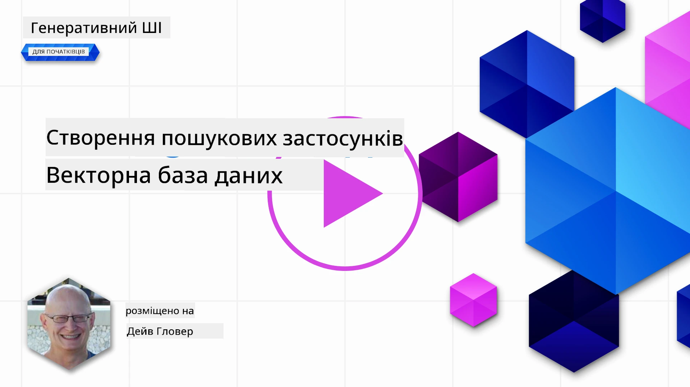
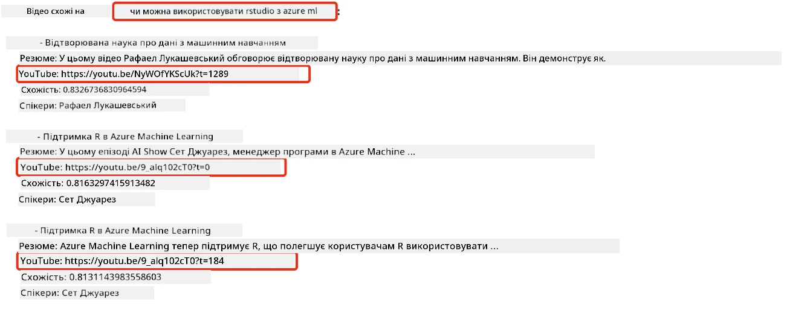
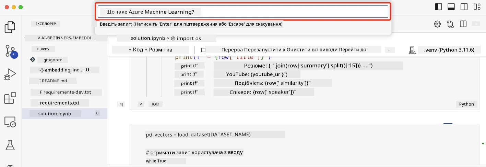

# Створення пошукових застосунків

[](https://youtu.be/W0-nzXjOjr0?si=GcsqiTTvd7RKbo7V)

> > _Клікніть на зображення вище, щоб переглянути відео цього уроку_

В великих мовних моделях є більше, ніж чат-боти та генерація тексту. Також можливо створювати пошукові застосунки використовуючи Embeddings. Embeddings — це числові подання даних, також відомі як вектори, їх можна використовувати для семантичного пошуку даних.

У цьому уроці ви створите пошуковий застосунок для нашого стартапу в освіті. Наш стартап — неприбуткова організація, що надає безкоштовну освіту студентам у країнах, що розвиваються. У нашому стартапі є велика кількість відео на YouTube, які студенти можуть використовувати для навчання про ШІ. Наш стартап хоче створити пошуковий застосунок, який дозволить студентам шукати відео на YouTube, вводячи запитання.

Наприклад, студент може ввести "Що таке Jupyter Notebooks?" або "Що таке Azure ML", і пошуковий застосунок поверне список відео на YouTube, що відповідають запитанню, а ще краще — пошуковий застосунок поверне посилання на місце у відео, де знаходиться відповідь на запитання.

## Вступ

У цьому уроці ми розглянемо:

- Семантичний пошук проти пошуку за ключовими словами.
- Що таке текстові embeddings.
- Створення індексу текстових embeddings.
- Пошук в індексі текстових embeddings.

## Мети навчання

Після завершення цього уроку ви зможете:

- Відрізнити семантичний пошук від пошуку за ключовими словами.
- Пояснити, що таке текстові embeddings.
- Створити застосунок з використанням Embeddings для пошуку даних.

## Чому варто створити пошуковий застосунок?

Створення пошукового застосунку допоможе вам зрозуміти, як використовувати Embeddings для пошуку даних. Ви також навчитеся створювати пошуковий застосунок, який можуть використовувати студенти для швидкого знаходження інформації.

Урок включає індекс embeddings із транскриптів YouTube для каналу Microsoft [AI Show](https://www.youtube.com/playlist?list=PLlrxD0HtieHi0mwteKBOfEeOYf0LJU4O1). AI Show — це канал на YouTube, що навчає вас про ШІ та машинне навчання. Індекс embeddings містить embeddings для кожного транскрипта YouTube до жовтня 2023 року. Ви використаєте індекс embeddings для створення пошукового застосунку для нашого стартапу. Пошуковий застосунок повертає посилання на місце відео, де знаходиться відповідь на запитання. Це чудовий спосіб для студентів швидко знаходити потрібну інформацію.

Нижче наведено приклад семантичного запиту для питання "чи можна використовувати rstudio з azure ml?". Перегляньте URL YouTube, ви побачите, що URL містить часову позначку, яка веде вас на місце відео, де знаходиться відповідь на запитання.



## Що таке семантичний пошук?

Ви, мабуть, запитуєте, що таке семантичний пошук? Семантичний пошук — це метод пошуку, що використовує семантику, або значення слів у запиті, щоб повернути релевантні результати.

Ось приклад семантичного пошуку. Припустимо, ви шукаєте машину, можливо, ви введете "моє мрія авто". Семантичний пошук розуміє, що ви не `мрієте` про авто, а шукаєте ваше `ідеальне` авто. Семантичний пошук розуміє ваш намір і повертає релевантні результати. Альтернатива — це `пошук за ключовими словами`, який буквально шукав би "мрії про авто" і часто повертає нерелевантні результати.

## Що таке текстові embeddings?

[Текстові embeddings](https://en.wikipedia.org/wiki/Word_embedding?WT.mc_id=academic-105485-koreyst) — це техніка представлення тексту, що використовується у [обробці природної мови](https://en.wikipedia.org/wiki/Natural_language_processing?WT.mc_id=academic-105485-koreyst). Текстові embeddings — це семантичні числові подання тексту. Embeddings використовуються, щоб представити дані у форматі, зручному для розуміння машиною. Існує багато моделей для створення текстових embeddings, у цьому уроці ми зосередимось на генерації embeddings за допомогою моделі OpenAI Embedding.

Ось приклад, уявіть, що наведений нижче текст був у транскрипті одного з випусків каналу AI Show на YouTube:

```text
Today we are going to learn about Azure Machine Learning.
```

Ми передаємо текст до OpenAI Embedding API, і він повертає наступний embedding, що складається з 1536 чисел, тобто вектора. Кожне число у векторі представляє різний аспект тексту. Для стислості наведені перші 10 чисел у векторі.

```python
[-0.006655829958617687, 0.0026128944009542465, 0.008792596869170666, -0.02446001023054123, -0.008540431968867779, 0.022071078419685364, -0.010703742504119873, 0.003311325330287218, -0.011632772162556648, -0.02187200076878071, ...]
```

## Як створюється індекс embedding?

Індекс embedding для цього уроку був створений серією скриптів на Python. Ви знайдете скрипти разом з інструкціями у [README](./scripts/README.md?WT.mc_id=academic-105485-koreyst) у папці "scripts" для цього уроку. Вам не потрібно запускати ці скрипти, щоб завершити урок, адже індекс embeddings уже наданий.

Скрипти виконують наступні операції:

1. Завантажується транскрипт для кожного відео на YouTube із плейлісту [AI Show](https://www.youtube.com/playlist?list=PLlrxD0HtieHi0mwteKBOfEeOYf0LJU4O1).
2. Використовуючи [OpenAI Functions](https://learn.microsoft.com/azure/ai-foundry/openai/how-to/function-calling?WT.mc_id=academic-105485-koreyst), робиться спроба визначити ім’я доповідача з перших 3 хвилин транскрипта YouTube. Ім’я доповідача для кожного відео зберігається в індексі Embedding з назвою `embedding_index_3m.json`.
3. Текст транскрипта ділиться на **текстові сегменти по 3 хвилини**. Сегмент містить близько 20 слів, що перекриваються з наступним сегментом, щоб Embedding для сегмента не обривався і забезпечував кращий контекст пошуку.
4. Кожен текстовий сегмент передається в API OpenAI Chat для підсумовування тексту до 60 слів. Резюме також зберігається в індексі Embedding `embedding_index_3m.json`.
5. Нарешті, текст сегмента передається до OpenAI Embedding API. API Embedding повертає вектор з 1536 чисел, що представляють семантичне значення сегмента. Сегмент разом із вектором OpenAI Embedding зберігається в індексі Embedding `embedding_index_3m.json`.

### Векторні бази даних

Для простоти уроку індекс Embedding зберігається у JSON-файлі з назвою `embedding_index_3m.json` і завантажується у Pandas DataFrame. Однак у продуктивному середовищі індекс Embedding зберігається у векторній базі даних, такій як [Azure Cognitive Search](https://learn.microsoft.com/training/modules/improve-search-results-vector-search?WT.mc_id=academic-105485-koreyst), [Redis](https://cookbook.openai.com/examples/vector_databases/redis/readme?WT.mc_id=academic-105485-koreyst), [Pinecone](https://cookbook.openai.com/examples/vector_databases/pinecone/readme?WT.mc_id=academic-105485-koreyst), [Weaviate](https://cookbook.openai.com/examples/vector_databases/weaviate/readme?WT.mc_id=academic-105485-koreyst), щоб назвати лише кілька.

## Розуміння косинусної схожості

Ми дізналися про текстові embeddings, наступним кроком є навчитися використовувати текстові embeddings для пошуку даних, а саме знаходити найбільш схожі embeddings на певний запит за допомогою косинусної схожості.

### Що таке косинусна схожість?

Косинусна схожість — це міра схожості між двома векторами, це також називають `пошуком найближчих сусідів`. Щоб виконати пошук за косинусною схожістю, вам потрібно _векторизувати_ текст _запиту_ за допомогою OpenAI Embedding API. Потім обчислити _косинусну схожість_ між вектором запиту та кожним вектором в індексі Embedding. Пам’ятайте, що індекс Embedding має вектор для кожного текстового сегмента транскрипта YouTube. Нарешті, відсортуйте результати за косинусною схожістю, і текстові сегменти з найвищою косинусною схожістю є найбільш схожими на запит.

З математичної точки зору, косинусна схожість вимірює косинус кута між двома векторами, спроєктованими у багатовимірному просторі. Це вимірювання корисне, тому що якщо два документи розташовані далеко один від одного за евклідовою відстанню через розмір, вони все одно можуть мати менший кут між собою і, отже, вищу косинусну схожість. Для більш докладної інформації про формули косинусної схожості дивіться [Cosine similarity](https://en.wikipedia.org/wiki/Cosine_similarity?WT.mc_id=academic-105485-koreyst).

## Створення вашого першого пошукового застосунку

Наступним ми навчимося створювати пошуковий застосунок за допомогою Embeddings. Пошуковий застосунок дозволить студентам знаходити відео, вводячи запитання. Застосунок поверне список відео, релевантних до запитання. Також він поверне посилання на місце відео, де розміщена відповідь на запитання.

Це рішення було створене та протестоване на Windows 11, macOS та Ubuntu 22.04 з використанням Python 3.10 і новіших версій. Python можна завантажити з [python.org](https://www.python.org/downloads/?WT.mc_id=academic-105485-koreyst).

## Завдання — створення пошукового застосунку для студентів

Ми представили наш стартап на початку уроку. Тепер настав час надати студентам можливість створити пошуковий застосунок для їхніх оцінювань.

У цьому завданні ви створите служби Azure OpenAI, які будуть використовуватися для створення пошукового застосунку. Ви створите такі служби Azure OpenAI. Для завершення завдання вам потрібна підписка Azure.

### Запуск Azure Cloud Shell

1. Увійдіть у [Azure портал](https://portal.azure.com/?WT.mc_id=academic-105485-koreyst).
2. Виберіть іконку Cloud Shell у верхньому правому куті Azure порталу.
3. Оберіть **Bash** як тип середовища.

#### Створення групи ресурсів

> Для цих інструкцій ми використовуємо групу ресурсів з назвою "semantic-video-search" у регіоні East US.
> Ви можете змінити назву групи ресурсів, але при зміні розташування ресурсів,
> перевірте [таблицю доступності моделей](https://aka.ms/oai/models?WT.mc_id=academic-105485-koreyst).

```shell
az group create --name semantic-video-search --location eastus
```

#### Створення ресурсу Azure OpenAI Service

У Azure Cloud Shell виконайте наступну команду для створення ресурсу Azure OpenAI Service.

```shell
az cognitiveservices account create --name semantic-video-openai --resource-group semantic-video-search \
    --location eastus --kind OpenAI --sku s0
```

#### Отримання кінцевої точки та ключів для використання у цьому застосунку

У Azure Cloud Shell виконайте наступні команди, щоб отримати кінцеву точку та ключі для ресурсу Azure OpenAI Service.

```shell
az cognitiveservices account show --name semantic-video-openai \
   --resource-group  semantic-video-search | jq -r .properties.endpoint
az cognitiveservices account keys list --name semantic-video-openai \
   --resource-group semantic-video-search | jq -r .key1
```

#### Розгортання моделі OpenAI Embedding

У Azure Cloud Shell виконайте наступну команду для розгортання моделі OpenAI Embedding.

```shell
az cognitiveservices account deployment create \
    --name semantic-video-openai \
    --resource-group  semantic-video-search \
    --deployment-name text-embedding-ada-002 \
    --model-name text-embedding-ada-002 \
    --model-version "2"  \
    --model-format OpenAI \
    --sku-capacity 100 --sku-name "Standard"
```

## Рішення

Відкрийте [solution notebook](./python/aoai-solution.ipynb?WT.mc_id=academic-105485-koreyst) у GitHub Codespaces і виконуйте інструкції у Jupyter Notebook.

Коли ви запускаєте ноутбук, вам буде запропоновано ввести запит. Вікно введення виглядатиме так:



## Відмінна робота! Продовжуйте навчання

Після завершення цього уроку перегляньте нашу [колекцію навчання з генеративного ШІ](https://aka.ms/genai-collection?WT.mc_id=academic-105485-koreyst), щоб продовжити підвищувати свої знання про генеративний ШІ!

Перейдіть до уроку 9, де ми розглянемо, як [створювати застосунки для генерації зображень](../09-building-image-applications/README.md?WT.mc_id=academic-105485-koreyst)!

---

<!-- CO-OP TRANSLATOR DISCLAIMER START -->
**Відмова від відповідальності**:
Цей документ було перекладено за допомогою сервісу штучного інтелекту для перекладу [Co-op Translator](https://github.com/Azure/co-op-translator). Хоча ми прагнемо до точності, будь ласка, майте на увазі, що автоматичні переклади можуть містити помилки або неточності. Оригінальний документ рідною мовою слід вважати авторитетним джерелом. Для критично важливої інформації рекомендується професійний людський переклад. Ми не несемо відповідальності за будь-які непорозуміння або неправильні тлумачення, що виникли внаслідок використання цього перекладу.
<!-- CO-OP TRANSLATOR DISCLAIMER END -->