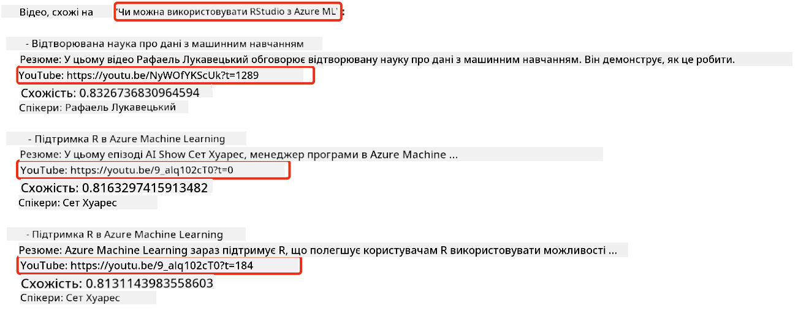
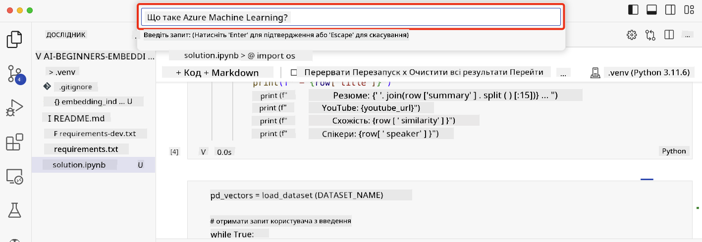

<!--
CO_OP_TRANSLATOR_METADATA:
{
  "original_hash": "d46aad0917a1a342d613e2c13d457da5",
  "translation_date": "2025-06-25T16:48:26+00:00",
  "source_file": "08-building-search-applications/README.md",
  "language_code": "uk"
}
-->
# Створення пошукових додатків

[](https://aka.ms/gen-ai-lesson8-gh?WT.mc_id=academic-105485-koreyst)

> > _Клацніть на зображення вище, щоб переглянути відео цього уроку_

LLM - це не лише чат-боти та генерація тексту. Можна також створювати пошукові додатки, використовуючи вбудовування. Вбудовування - це числові представлення даних, також відомі як вектори, які можна використовувати для семантичного пошуку даних.

У цьому уроці ви створите пошуковий додаток для нашого освітнього стартапу. Наш стартап - це неприбуткова організація, яка надає безкоштовну освіту студентам у країнах, що розвиваються. Наш стартап має велику кількість відео на YouTube, які студенти можуть використовувати для вивчення AI. Наш стартап хоче створити пошуковий додаток, який дозволяє студентам шукати відео на YouTube, вводячи питання.

Наприклад, студент може ввести 'Що таке Jupyter Notebooks?' або 'Що таке Azure ML', і пошуковий додаток поверне список відео на YouTube, які є релевантними до питання, а ще краще, додаток поверне посилання на місце у відео, де знаходиться відповідь на питання.

## Вступ

У цьому уроці ми розглянемо:

- Семантичний vs пошук за ключовими словами.
- Що таке текстові вбудовування.
- Створення індексу текстових вбудовувань.
- Пошук в індексі текстових вбудовувань.

## Цілі навчання

Після завершення цього уроку ви зможете:

- Відрізняти семантичний пошук від пошуку за ключовими словами.
- Пояснити, що таке текстові вбудовування.
- Створити додаток, використовуючи вбудовування для пошуку даних.

## Чому варто створювати пошуковий додаток?

Створення пошукового додатку допоможе вам зрозуміти, як використовувати вбудовування для пошуку даних. Ви також навчитеся створювати пошуковий додаток, який студенти можуть використовувати для швидкого знаходження інформації.

Урок включає індекс вбудовувань транскрипцій YouTube для каналу Microsoft [AI Show](https://www.youtube.com/playlist?list=PLlrxD0HtieHi0mwteKBOfEeOYf0LJU4O1). AI Show - це YouTube канал, який навчає про AI та машинне навчання. Індекс вбудовувань містить вбудовування для кожної з транскрипцій YouTube до жовтня 2023 року. Ви використаєте індекс вбудовувань для створення пошукового додатку для нашого стартапу. Пошуковий додаток повертає посилання на місце у відео, де знаходиться відповідь на питання. Це чудовий спосіб для студентів швидко знаходити потрібну інформацію.

Ось приклад семантичного запиту на питання 'чи можна використовувати rstudio з azure ml?'. Перегляньте url YouTube, ви побачите, що url містить часову мітку, яка перенесе вас до місця у відео, де знаходиться відповідь на питання.



## Що таке семантичний пошук?

Можливо, ви задаєтеся питанням, що таке семантичний пошук? Семантичний пошук - це техніка пошуку, яка використовує семантику, або значення слів у запиті, для повернення релевантних результатів.

Ось приклад семантичного пошуку. Припустимо, ви шукаєте купити автомобіль, ви можете пошукати 'мій автомобіль мрії', семантичний пошук розуміє, що ви не `dreaming` про автомобіль, а скоріше шукаєте купити ваш `ideal` автомобіль. Семантичний пошук розуміє ваш намір і повертає релевантні результати. Альтернативою є `keyword search`, який буквально шукав би мрії про автомобілі і часто повертає нерелевантні результати.

## Що таке текстові вбудовування?

[Текстові вбудовування](https://en.wikipedia.org/wiki/Word_embedding?WT.mc_id=academic-105485-koreyst) - це техніка представлення тексту, яка використовується в [обробці природної мови](https://en.wikipedia.org/wiki/Natural_language_processing?WT.mc_id=academic-105485-koreyst). Текстові вбудовування - це семантичні числові представлення тексту. Вбудовування використовуються для представлення даних у спосіб, який легко зрозуміти машині. Існує багато моделей для створення текстових вбудовувань, у цьому уроці ми зосередимося на генерації вбудовувань за допомогою моделі OpenAI Embedding.

Ось приклад, уявіть, що наступний текст знаходиться у транскрипції одного з епізодів на YouTube каналі AI Show:

```text
Today we are going to learn about Azure Machine Learning.
```

Ми передамо текст до API вбудовування OpenAI, і він поверне наступне вбудовування, яке складається з 1536 чисел, також відоме як вектор. Кожне число у векторі представляє різний аспект тексту. Для стислості, ось перші 10 чисел у векторі.

```python
[-0.006655829958617687, 0.0026128944009542465, 0.008792596869170666, -0.02446001023054123, -0.008540431968867779, 0.022071078419685364, -0.010703742504119873, 0.003311325330287218, -0.011632772162556648, -0.02187200076878071, ...]
```

## Як створюється індекс вбудовувань?

Індекс вбудовувань для цього уроку був створений за допомогою серії скриптів на Python. Ви знайдете скрипти разом з інструкціями у [README](./scripts/README.md?WT.mc_id=academic-105485-koreyst) у папці 'scripts' для цього уроку. Вам не потрібно запускати ці скрипти, щоб завершити цей урок, оскільки індекс вбудовувань надається для вас.

Скрипти виконують наступні операції:

1. Транскрипція для кожного відео на YouTube у списку відтворення [AI Show](https://www.youtube.com/playlist?list=PLlrxD0HtieHi0mwteKBOfEeOYf0LJU4O1) завантажується.
2. Використовуючи [функції OpenAI](https://learn.microsoft.com/azure/ai-services/openai/how-to/function-calling?WT.mc_id=academic-105485-koreyst), робиться спроба витягнути ім'я спікера з перших 3 хвилин транскрипції YouTube. Ім'я спікера для кожного відео зберігається в індексі вбудовувань під назвою `embedding_index_3m.json`.
3. Текст транскрипції розбивається на **текстові сегменти по 3 хвилини**. Сегмент включає приблизно 20 слів, що перекриваються з наступним сегментом, щоб забезпечити, що вбудовування для сегмента не буде відрізано і щоб надати кращий контекст для пошуку.
4. Кожен текстовий сегмент передається до API OpenAI Chat для узагальнення тексту до 60 слів. Узагальнення також зберігається в індексі вбудовувань `embedding_index_3m.json`.
5. Нарешті, текст сегмента передається до API вбудовування OpenAI. API вбудовування повертає вектор з 1536 чисел, який представляє семантичне значення сегмента. Сегмент разом з вектором вбудовування OpenAI зберігається в індексі вбудовувань `embedding_index_3m.json`.

### Векторні бази даних

Для простоти уроку індекс вбудовувань зберігається у файлі JSON під назвою `embedding_index_3m.json` і завантажується в Pandas DataFrame. Однак у виробництві індекс вбудовувань буде зберігатися у векторній базі даних, такій як [Azure Cognitive Search](https://learn.microsoft.com/training/modules/improve-search-results-vector-search?WT.mc_id=academic-105485-koreyst), [Redis](https://cookbook.openai.com/examples/vector_databases/redis/readme?WT.mc_id=academic-105485-koreyst), [Pinecone](https://cookbook.openai.com/examples/vector_databases/pinecone/readme?WT.mc_id=academic-105485-koreyst), [Weaviate](https://cookbook.openai.com/examples/vector_databases/weaviate/readme?WT.mc_id=academic-105485-koreyst), щоб назвати лише кілька.

## Розуміння косинусної схожості

Ми дізналися про текстові вбудовування, наступний крок - навчитися використовувати текстові вбудовування для пошуку даних і, зокрема, знаходити найбільш схожі вбудовування до заданого запиту, використовуючи косинусну схожість.

### Що таке косинусна схожість?

Косинусна схожість - це міра схожості між двома векторами, ви також почуєте, як це називають `nearest neighbor search`. Щоб виконати пошук за косинусною схожістю, потрібно _векторизувати_ текст _запиту_ за допомогою API вбудовування OpenAI. Потім обчислити _косинусну схожість_ між вектором запиту і кожним вектором в індексі вбудовувань. Пам'ятайте, індекс вбудовувань має вектор для кожного текстового сегмента транскрипції YouTube. Нарешті, відсортуйте результати за косинусною схожістю, і текстові сегменти з найвищою косинусною схожістю є найбільш схожими на запит.

З математичної точки зору, косинусна схожість вимірює косинус кута між двома векторами, проекційованими в багатовимірному просторі. Це вимірювання корисне, оскільки якщо два документи далеко один від одного за евклідовою відстанню через розмір, вони все ще можуть мати менший кут між ними і, отже, вищу косинусну схожість. Для отримання додаткової інформації про рівняння косинусної схожості, дивіться [Косинусна схожість](https://en.wikipedia.org/wiki/Cosine_similarity?WT.mc_id=academic-105485-koreyst).

## Створення вашого першого пошукового додатку

Далі ми дізнаємося, як створити пошуковий додаток, використовуючи вбудовування. Пошуковий додаток дозволить студентам шукати відео, вводячи питання. Пошуковий додаток поверне список відео, які є релевантними до питання. Пошуковий додаток також поверне посилання на місце у відео, де знаходиться відповідь на питання.

Це рішення було створено і протестовано на Windows 11, macOS та Ubuntu 22.04, використовуючи Python 3.10 або пізнішу версію. Ви можете завантажити Python з [python.org](https://www.python.org/downloads/?WT.mc_id=academic-105485-koreyst).

## Завдання - створення пошукового додатку, щоб допомогти студентам

Ми представили наш стартап на початку цього уроку. Тепер настав час допомогти студентам створити пошуковий додаток для їх оцінок.

У цьому завданні ви створите сервіси Azure OpenAI, які будуть використовуватися для створення пошукового додатку. Ви створите наступні сервіси Azure OpenAI. Вам знадобиться підписка Azure, щоб завершити це завдання.

### Запуск Azure Cloud Shell

1. Увійдіть до [порталу Azure](https://portal.azure.com/?WT.mc_id=academic-105485-koreyst).
2. Виберіть іконку Cloud Shell у верхньому правому куті порталу Azure.
3. Виберіть **Bash** для типу середовища.

#### Створення групи ресурсів

> Для цих інструкцій ми використовуємо групу ресурсів з назвою "semantic-video-search" у східному регіоні США.
> Ви можете змінити назву групи ресурсів, але при зміні місця розташування ресурсів,
> перевірте [таблицю доступності моделей](https://aka.ms/oai/models?WT.mc_id=academic-105485-koreyst).

```shell
az group create --name semantic-video-search --location eastus
```

#### Створення ресурсу сервісу Azure OpenAI

З Azure Cloud Shell, запустіть наступну команду, щоб створити ресурс сервісу Azure OpenAI.

```shell
az cognitiveservices account create --name semantic-video-openai --resource-group semantic-video-search \
    --location eastus --kind OpenAI --sku s0
```

#### Отримання кінцевої точки та ключів для використання в цьому додатку

З Azure Cloud Shell, запустіть наступні команди, щоб отримати кінцеву точку та ключі для ресурсу сервісу Azure OpenAI.

```shell
az cognitiveservices account show --name semantic-video-openai \
   --resource-group  semantic-video-search | jq -r .properties.endpoint
az cognitiveservices account keys list --name semantic-video-openai \
   --resource-group semantic-video-search | jq -r .key1
```

#### Розгортання моделі вбудовування OpenAI

З Azure Cloud Shell, запустіть наступну команду, щоб розгорнути модель вбудовування OpenAI.

```shell
az cognitiveservices account deployment create \
    --name semantic-video-openai \
    --resource-group  semantic-video-search \
    --deployment-name text-embedding-ada-002 \
    --model-name text-embedding-ada-002 \
    --model-version "2"  \
    --model-format OpenAI \
    --sku-capacity 100 --sku-name "Standard"
```

## Рішення

Відкрийте [ноутбук рішення](../../../08-building-search-applications/python/aoai-solution.ipynb) у GitHub Codespaces і дотримуйтесь інструкцій у Jupyter Notebook.

Коли ви запустите ноутбук, вам буде запропоновано ввести запит. Вхідне поле буде виглядати так:



## Чудова робота! Продовжуйте навчання

Після завершення цього уроку перегляньте нашу [колекцію навчання генеративного AI](https://aka.ms/genai-collection?WT.mc_id=academic-105485-koreyst), щоб продовжити підвищувати свої знання про генеративний AI!

Перейдіть до уроку 9, де ми розглянемо, як [створювати додатки для генерації зображень](../09-building-image-applications/README.md?WT.mc_id=academic-105485-koreyst)!

**Відмова від відповідальності**:  
Цей документ був перекладений за допомогою сервісу AI перекладу [Co-op Translator](https://github.com/Azure/co-op-translator). Хоча ми прагнемо до точності, будь ласка, зверніть увагу, що автоматичні переклади можуть містити помилки або неточності. Оригінальний документ на його рідній мові слід вважати авторитетним джерелом. Для критичної інформації рекомендується професійний людський переклад. Ми не несемо відповідальності за будь-які непорозуміння або неправильні інтерпретації, що виникають внаслідок використання цього перекладу.