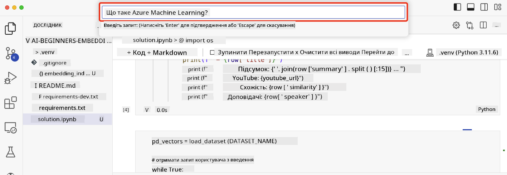

<!--
CO_OP_TRANSLATOR_METADATA:
{
  "original_hash": "d46aad0917a1a342d613e2c13d457da5",
  "translation_date": "2025-07-09T13:05:37+00:00",
  "source_file": "08-building-search-applications/README.md",
  "language_code": "uk"
}
-->
# Створення пошукових додатків

[](https://aka.ms/gen-ai-lesson8-gh?WT.mc_id=academic-105485-koreyst)

> > _Натисніть на зображення вище, щоб переглянути відео цього уроку_

LLM — це не лише чат-боти та генерація тексту. Також можна створювати пошукові додатки за допомогою Embeddings. Embeddings — це числові представлення даних, також відомі як вектори, які можна використовувати для семантичного пошуку інформації.

У цьому уроці ви створите пошуковий додаток для нашого освітнього стартапу. Наш стартап — це неприбуткова організація, яка надає безкоштовну освіту студентам у країнах, що розвиваються. У нашого стартапу є велика кількість відео на YouTube, які студенти можуть використовувати для вивчення ШІ. Ми хочемо створити пошуковий додаток, який дозволить студентам шукати відео на YouTube, вводячи запитання.

Наприклад, студент може ввести «Що таке Jupyter Notebooks?» або «Що таке Azure ML», і пошуковий додаток поверне список відео на YouTube, які відповідають на це запитання, а ще краще — додаток надасть посилання на ту частину відео, де знаходиться відповідь.

## Вступ

У цьому уроці ми розглянемо:

- Семантичний пошук проти пошуку за ключовими словами.
- Що таке текстові Embeddings.
- Створення індексу текстових Embeddings.
- Пошук у індексі текстових Embeddings.

## Цілі навчання

Після проходження цього уроку ви зможете:

- Відрізняти семантичний пошук від пошуку за ключовими словами.
- Пояснити, що таке текстові Embeddings.
- Створити додаток, який використовує Embeddings для пошуку даних.

## Чому варто створювати пошуковий додаток?

Створення пошукового додатка допоможе вам зрозуміти, як використовувати Embeddings для пошуку даних. Ви також навчитеся створювати додаток, який допоможе студентам швидко знаходити потрібну інформацію.

Урок містить індекс Embeddings для транскриптів YouTube-каналу Microsoft [AI Show](https://www.youtube.com/playlist?list=PLlrxD0HtieHi0mwteKBOfEeOYf0LJU4O1). AI Show — це канал на YouTube, який навчає ШІ та машинному навчанню. Індекс Embeddings містить Embeddings для кожного транскрипту відео до жовтня 2023 року. Ви використаєте цей індекс для створення пошукового додатка для нашого стартапу. Пошуковий додаток повертатиме посилання на ту частину відео, де знаходиться відповідь на запитання. Це чудовий спосіб для студентів швидко знаходити потрібну інформацію.

Нижче наведено приклад семантичного запиту на запитання «чи можна використовувати rstudio з azure ml?». Зверніть увагу на URL YouTube — він містить часову позначку, яка веде до тієї частини відео, де знаходиться відповідь.


## Що таке семантичний пошук?

Можливо, ви запитаєте, що таке семантичний пошук? Семантичний пошук — це метод пошуку, який використовує значення слів у запиті, щоб повернути релевантні результати.

Ось приклад семантичного пошуку. Припустимо, ви шукаєте автомобіль і вводите «мій автомобіль мрії». Семантичний пошук розуміє, що ви не просто «мрієте» про автомобіль, а шукаєте свій «ідеальний» автомобіль. Семантичний пошук розуміє ваш намір і повертає релевантні результати. Альтернатива — це пошук за ключовими словами, який буквально шукає слова «мрії» та «автомобілі» і часто повертає нерелевантні результати.

## Що таке текстові Embeddings?

[Текстові embeddings](https://en.wikipedia.org/wiki/Word_embedding?WT.mc_id=academic-105485-koreyst) — це техніка представлення тексту, що використовується в [обробці природної мови](https://en.wikipedia.org/wiki/Natural_language_processing?WT.mc_id=academic-105485-koreyst). Текстові embeddings — це семантичні числові представлення тексту. Embeddings використовуються для подання даних у форматі, зрозумілому для машини. Існує багато моделей для створення текстових embeddings, у цьому уроці ми зосередимося на генерації embeddings за допомогою моделі OpenAI Embedding.

Ось приклад: уявіть, що наступний текст — це частина транскрипту одного з епізодів каналу AI Show на YouTube:

```text
Today we are going to learn about Azure Machine Learning.
```

Ми передаємо текст до OpenAI Embedding API, і він повертає embedding, що складається з 1536 чисел, тобто вектор. Кожне число у векторі представляє різний аспект тексту. Для стислості наведено перші 10 чисел у векторі.

```python
[-0.006655829958617687, 0.0026128944009542465, 0.008792596869170666, -0.02446001023054123, -0.008540431968867779, 0.022071078419685364, -0.010703742504119873, 0.003311325330287218, -0.011632772162556648, -0.02187200076878071, ...]
```

## Як створюється індекс Embedding?

Індекс Embedding для цього уроку створено за допомогою серії скриптів на Python. Ви знайдете скрипти разом з інструкціями у файлі [README](./scripts/README.md?WT.mc_id=academic-105485-koreyst) у папці `scripts` цього уроку. Вам не потрібно запускати ці скрипти, щоб завершити урок, оскільки індекс Embedding надається готовим.

Скрипти виконують такі операції:

1. Завантажується транскрипт для кожного відео з плейлиста [AI Show](https://www.youtube.com/playlist?list=PLlrxD0HtieHi0mwteKBOfEeOYf0LJU4O1).
2. За допомогою [OpenAI Functions](https://learn.microsoft.com/azure/ai-services/openai/how-to/function-calling?WT.mc_id=academic-105485-koreyst) намагаються витягти ім’я доповідача з перших 3 хвилин транскрипту відео. Ім’я доповідача для кожного відео зберігається в індексі Embedding з назвою `embedding_index_3m.json`.
3. Текст транскрипту розбивається на **текстові сегменти по 3 хвилини**. Сегмент включає близько 20 слів перекриття з наступним сегментом, щоб embedding сегмента не обрізався і забезпечував кращий контекст для пошуку.
4. Кожен текстовий сегмент передається до OpenAI Chat API для створення резюме обсягом 60 слів. Резюме також зберігається в індексі Embedding `embedding_index_3m.json`.
5. Нарешті, текст сегмента передається до OpenAI Embedding API. API повертає вектор з 1536 чисел, що представляють семантичне значення сегмента. Сегмент разом із вектором OpenAI Embedding зберігається в індексі Embedding `embedding_index_3m.json`.

### Векторні бази даних

Для простоти уроку індекс Embedding зберігається у JSON-файлі з назвою `embedding_index_3m.json` і завантажується у Pandas DataFrame. Однак у виробничому середовищі індекс Embedding зберігатиметься у векторній базі даних, наприклад, [Azure Cognitive Search](https://learn.microsoft.com/training/modules/improve-search-results-vector-search?WT.mc_id=academic-105485-koreyst), [Redis](https://cookbook.openai.com/examples/vector_databases/redis/readme?WT.mc_id=academic-105485-koreyst), [Pinecone](https://cookbook.openai.com/examples/vector_databases/pinecone/readme?WT.mc_id=academic-105485-koreyst), [Weaviate](https://cookbook.openai.com/examples/vector_databases/weaviate/readme?WT.mc_id=academic-105485-koreyst) та інші.

## Розуміння косинусної схожості

Ми дізналися про текстові embeddings, наступний крок — навчитися використовувати їх для пошуку даних, зокрема знаходити найбільш схожі embeddings для заданого запиту за допомогою косинусної схожості.

### Що таке косинусна схожість?

Косинусна схожість — це міра схожості між двома векторами, також відома як `пошук найближчих сусідів`. Щоб виконати пошук за косинусною схожістю, потрібно _векторизувати_ текст запиту за допомогою OpenAI Embedding API. Потім обчислити _косинусну схожість_ між вектором запиту та кожним вектором в індексі Embedding. Пам’ятайте, що індекс Embedding містить вектор для кожного текстового сегмента транскрипту YouTube. Нарешті, відсортуйте результати за косинусною схожістю — текстові сегменти з найвищим значенням будуть найбільш схожими на запит.

З математичної точки зору, косинусна схожість вимірює косинус кута між двома векторами, спроєктованими у багатовимірному просторі. Це корисно, бо навіть якщо два документи далеко один від одного за евклідовою відстанню через розмір, вони можуть мати менший кут між векторами і, відповідно, вищу косинусну схожість. Для детальнішої інформації про формули косинусної схожості дивіться [Cosine similarity](https://en.wikipedia.org/wiki/Cosine_similarity?WT.mc_id=academic-105485-koreyst).

## Створення вашого першого пошукового додатка

Далі ми навчимося створювати пошуковий додаток за допомогою Embeddings. Додаток дозволить студентам шукати відео, вводячи запитання. Пошуковий додаток поверне список відео, які відповідають на запитання, а також посилання на ту частину відео, де знаходиться відповідь.

Це рішення було створено та протестовано на Windows 11, macOS та Ubuntu 22.04 з Python 3.10 або новішою версією. Ви можете завантажити Python з [python.org](https://www.python.org/downloads/?WT.mc_id=academic-105485-koreyst).

## Завдання — створення пошукового додатка для студентів

На початку уроку ми познайомили вас із нашим стартапом. Тепер настав час допомогти студентам створити пошуковий додаток для їхніх завдань.

У цьому завданні ви створите Azure OpenAI Services, які будуть використовуватися для побудови пошукового додатка. Вам потрібно створити такі сервіси Azure OpenAI. Для виконання завдання потрібна підписка Azure.

### Запуск Azure Cloud Shell

1. Увійдіть у [Azure портал](https://portal.azure.com/?WT.mc_id=academic-105485-koreyst).
2. Виберіть іконку Cloud Shell у верхньому правому куті порталу Azure.
3. Виберіть **Bash** як тип середовища.

#### Створення групи ресурсів

> Для цих інструкцій ми використовуємо групу ресурсів з назвою "semantic-video-search" у регіоні East US.
> Ви можете змінити назву групи ресурсів, але при зміні розташування ресурсів
> перевірте [таблицю доступності моделей](https://aka.ms/oai/models?WT.mc_id=academic-105485-koreyst).

```shell
az group create --name semantic-video-search --location eastus
```

#### Створення ресурсу Azure OpenAI Service

У Azure Cloud Shell виконайте наступну команду для створення ресурсу Azure OpenAI Service.

```shell
az cognitiveservices account create --name semantic-video-openai --resource-group semantic-video-search \
    --location eastus --kind OpenAI --sku s0
```

#### Отримання кінцевої точки та ключів для використання в додатку

У Azure Cloud Shell виконайте наступні команди, щоб отримати кінцеву точку та ключі для ресурсу Azure OpenAI Service.

```shell
az cognitiveservices account show --name semantic-video-openai \
   --resource-group  semantic-video-search | jq -r .properties.endpoint
az cognitiveservices account keys list --name semantic-video-openai \
   --resource-group semantic-video-search | jq -r .key1
```

#### Розгортання моделі OpenAI Embedding

У Azure Cloud Shell виконайте наступну команду для розгортання моделі OpenAI Embedding.

```shell
az cognitiveservices account deployment create \
    --name semantic-video-openai \
    --resource-group  semantic-video-search \
    --deployment-name text-embedding-ada-002 \
    --model-name text-embedding-ada-002 \
    --model-version "2"  \
    --model-format OpenAI \
    --sku-capacity 100 --sku-name "Standard"
```

## Рішення

Відкрийте [ноутбук з рішенням](../../../08-building-search-applications/python/aoai-solution.ipynb) у GitHub Codespaces та дотримуйтесь інструкцій у Jupyter Notebook.

Під час запуску ноутбука вам буде запропоновано ввести запит. Поле введення виглядатиме так:



## Чудова робота! Продовжуйте навчання

Після завершення цього уроку ознайомтеся з нашою [колекцією навчальних матеріалів з генеративного ШІ](https://aka.ms/genai-collection?WT.mc_id=academic-105485-koreyst), щоб продовжити підвищувати свої знання у цій галузі!

Перейдіть до уроку 9, де ми розглянемо, як [створювати додатки для генерації зображень](../09-building-image-applications/README.md?WT.mc_id=academic-105485-koreyst)!

**Відмова від відповідальності**:  
Цей документ було перекладено за допомогою сервісу автоматичного перекладу [Co-op Translator](https://github.com/Azure/co-op-translator). Хоча ми прагнемо до точності, будь ласка, майте на увазі, що автоматичні переклади можуть містити помилки або неточності. Оригінальний документ рідною мовою слід вважати авторитетним джерелом. Для критично важливої інформації рекомендується звертатися до професійного людського перекладу. Ми не несемо відповідальності за будь-які непорозуміння або неправильні тлумачення, що виникли внаслідок використання цього перекладу.