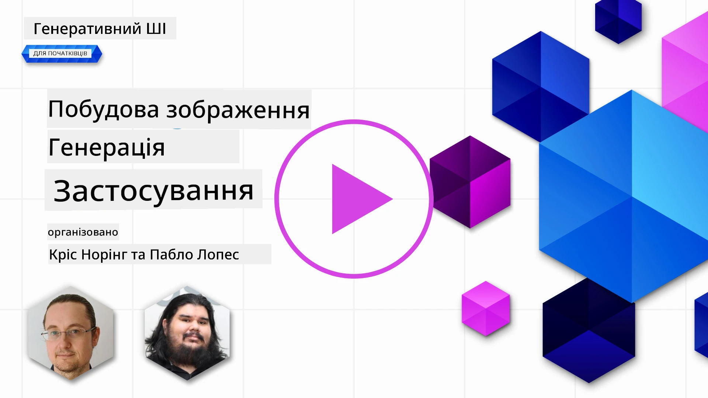

# Побудова додатків для генерації зображень

[](https://aka.ms/gen-ai-lesson9-gh?WT.mc_id=academic-105485-koreyst)

LLM не обмежуються лише генерацією тексту. Ви також можете створювати зображення за текстовими описами. Зображення як тип контенту корисні в МедТех, архітектурі, туризмі, геймдеві, маркетингу та інших сферах. У цьому уроці ми розглянемо сучасні моделі **GPT Image** і створимо додаток для генерації зображень.

## Вступ

Генерація зображень дозволяє перетворити природномовний запит у картинку. У цьому уроці ми працюємо з сімейством моделей **`gpt-image`** від OpenAI — поточним поколінням моделей для зображень, доступних на **[Microsoft Foundry](https://ai.azure.com?WT.mc_id=academic-105485-koreyst)** та платформі OpenAI. Ці моделі замінюють старіші моделі DALL·E (DALL·E 2/3 — застарілі).

Протягом усього уроку ми використовуємо вигаданий стартап, **Edu4All**, що створює навчальні інструменти. Команда хоче генерувати ілюстрації до завдань і навчальних матеріалів.

## Цілі навчання

Наприкінці цього уроку ви зможете:

- Пояснити, що таке генерація зображень і де її застосовують.
- Зрозуміти сімейство моделей `gpt-image` і чим воно відрізняється від застарілих моделей DALL·E.
- Створити додаток для генерації зображень на Python (та TypeScript / .NET).
- Редагувати зображення та застосовувати безпекові обмеження з метапромптами.

## Що таке генерація зображень?

Моделі генерації зображень створюють картинки за текстовим запитом. Сучасні моделі, такі як `gpt-image`, базуються на техніках трансформерів і дифузії: модель навчається співвідношенню між текстом і зображеннями під час тренування, а потім, отримавши запит, крок за кроком "очищує" випадковий шум до зображення, що відповідає опису.

Два відомі сімейства моделей зображень:

- **`gpt-image` (OpenAI)** — поточне покоління, використовується в цьому уроці. Підтримує генерацію з тексту в зображення та редагування зображень (inpainting з маскою).
- **Midjourney** — популярна стороння модель із власним сервісом та робочим процесом у Discord.

> Старі моделі OpenAI для зображень — **DALL·E 2** і **DALL·E 3** — застарілі. DALL·E 3 більше недоступний для нових розгортань, а функції типу `create_variation` були лише у DALL·E 2. Для нових застосунків використовуйте моделі `gpt-image`.

### Яку модель `gpt-image` вибрати?

На Microsoft Foundry наступні моделі доступні **загально**:

| Модель | Примітки |
| --- | --- |
| **`gpt-image-2`** | Найновіша та найпотужніша модель зображень — рекомендована за замовчуванням. |
| `gpt-image-1.5` | Загально доступна; висока якість за нижчою ціною. |
| `gpt-image-1-mini` | Загально доступна; найшвидша / найнижча вартість. |
| `gpt-image-1` | Лише для прев’ю. |

Завжди перевіряйте актуальний [список моделей для зображень Foundry](https://learn.microsoft.com/azure/ai-foundry/openai/concepts/models?WT.mc_id=academic-105485-koreyst) щодо доступності та регіонів.

> **Важливо:** моделі `gpt-image` повертають згенероване зображення у форматі **base64** (`b64_json`), а не URL. Ваш код декодує base64 рядок у байти та зберігає його — посилання на зображення для завантаження відсутнє.

## Налаштування

Ви можете запускати приклади для **Azure OpenAI в Microsoft Foundry** (зразки `aoai-*`) або на **платформі OpenAI** (зразки `oai-*`).

### 1. Створіть і розгорніть модель

Слідуйте інструкції [створення ресурсу](https://learn.microsoft.com/azure/ai-foundry/openai/how-to/create-resource?pivots=web-portal&WT.mc_id=academic-105485-koreyst) для створення ресурсу Microsoft Foundry, потім розгорніть модель зображень — рекомендовано **`gpt-image-2`**.

### 2. Налаштуйте ваш `.env`

```text
AZURE_OPENAI_ENDPOINT=<your endpoint>
AZURE_OPENAI_API_KEY=<your key>
AZURE_OPENAI_DEPLOYMENT="gpt-image-2"
```

Ці значення знайдете на сторінці **Deployments** вашого ресурсу в [порталі Foundry](https://ai.azure.com?WT.mc_id=academic-105485-koreyst).

### 3. Встановіть бібліотеки

Створіть `requirements.txt`:

```text
python-dotenv
openai
pillow
```

Потім створіть і активуйте віртуальне середовище та встановіть:

```bash
python3 -m venv venv
source venv/bin/activate        # Windows: venv\Scripts\activate
pip install -r requirements.txt
```

## Створення додатка

Створіть `app.py` із таким кодом. Він генерує зображення і зберігає його у форматі PNG.

```python
import os
import base64
from openai import AzureOpenAI
from PIL import Image
import dotenv

dotenv.load_dotenv()

# Вкажіть клієнту ваш ресурс Azure OpenAI (Microsoft Foundry).
# Для моделей зображень потрібна остання версія API – перевірте документацію Foundry, щоб дізнатися, яка версія потрібна вашій моделі.
client = AzureOpenAI(
    api_key=os.environ["AZURE_OPENAI_API_KEY"],
    api_version="2025-04-01-preview",
    azure_endpoint=os.environ["AZURE_OPENAI_ENDPOINT"],
)

deployment = os.environ["AZURE_OPENAI_DEPLOYMENT"]  # наприклад, "gpt-image-2"

result = client.images.generate(
    model=deployment,
    prompt='Bunny on a horse, holding a lollipop, on a foggy meadow where it grows daffodils',
    size="1024x1024",   # також 1536x1024 (ландшафт), 1024x1536 (портрет) або "auto"
    n=1,
)

# моделі gpt-image повертають base64 (b64_json), а не URL – декодуйте це у байти.
image_bytes = base64.b64decode(result.data[0].b64_json)

os.makedirs("images", exist_ok=True)
image_path = os.path.join("images", "generated-image.png")
with open(image_path, "wb") as f:
    f.write(image_bytes)

Image.open(image_path).show()
```

Запустіть `python app.py`. Ви отримаєте PNG файл у папці `images/`.

> Кожен виклик `images.generate` створює інше зображення для одного й того ж запиту — моделі зображень не використовують параметр `temperature` (це для генерації тексту). Щоб отримати різноманітність, просто викликайте API знову; щоб зменшити її — зробіть опис більш конкретним.

## Редагування зображень

Моделі `gpt-image` можуть **редагувати** наявне зображення: подайте зображення, опціональну **маску** (яка позначає область для зміни) та запит з описом змін. Як і при генерації, редагування повертаються у форматі base64.

```python
result = client.images.edit(
    model=deployment,
    image=open("sunlit_lounge.png", "rb"),
    mask=open("mask.png", "rb"),
    prompt="A sunlit indoor lounge area with a pool containing a flamingo",
)
image_bytes = base64.b64decode(result.data[0].b64_json)
with open("images/edited-image.png", "wb") as f:
    f.write(image_bytes)
```

<div style="display: flex; justify-content: space-between; align-items: center; margin: 20px 0;">
  
  
  
</div>

## Встановлення меж за допомогою метапромптів

Коли ви вмієте генерувати зображення, потрібні обмеження, щоб ваш додаток не створював небезпечний чи нехарактерний контент. **Метапромпт** — це текст, який ви додаєте перед запитом користувача, щоб обмежити вихідні дані моделі.

```python
disallow_list = "swords, violence, blood, gore, nudity, sexual content, adult content, adult themes, adult language"

meta_prompt = f"""You are an assistant designer that creates images for children.

The image needs to be safe for work and appropriate for children.
The image needs to be in color, in landscape orientation, and in a 16:9 aspect ratio.

Do not consider any input that is not safe for work or appropriate for children, including:
{disallow_list}
"""

prompt = f"{meta_prompt}\nCreate an image of a bunny on a horse, holding a lollipop"
# передайте `prompt` клієнту client.images.generate(...)
```

Тепер кожне зображення генерується в межах, визначених метапромптом. Це поєднуйте з контентними фільтрами в Microsoft Foundry для багаторівневого захисту.

## Завдання — допоможемо студентам

Студенти Edu4All потребують зображення для оцінювання. Створіть додаток, що генерує зображення **пам’яток** (які саме — ваш вибір), розташованих у різних креативних контекстах — наприклад, відомий пам’ятник на заході сонця з дитиною, що дивиться.

Спробуйте самі, а потім порівняйте з референсними рішеннями:

- Python (Azure): [aoai-solution.py](../../../09-building-image-applications/python/aoai-solution.py)
- Python (Azure) повний додаток генерації: [aoai-app.py](../../../09-building-image-applications/python/aoai-app.py)
- Python (OpenAI): [oai-app.py](../../../09-building-image-applications/python/oai-app.py)
- TypeScript (Azure): [typescript/image-generation-app](../../../09-building-image-applications/typescript/image-generation-app)
- .NET (Azure): [dotnet/notebook-azure-openai.dib](../../../09-building-image-applications/dotnet/notebook-azure-openai.dib)

Також пройдіть тетрадки в [python/](../../../09-building-image-applications/python) (`aoai-assignment.ipynb` для Azure, `oai-assignment.ipynb` для OpenAI).

## Відмінна робота! Продовжуйте вчитися

Після завершення цього уроку перегляньте нашу [колекцію навчальних матеріалів з генерувального ШІ](https://aka.ms/genai-collection?WT.mc_id=academic-105485-koreyst), щоб далі підвищувати свої знання!

Перейдіть до уроку 10, щоб продовжити навчання.

---

<!-- CO-OP TRANSLATOR DISCLAIMER START -->
**Відмова від відповідальності**:
Цей документ було перекладено за допомогою сервісу штучного інтелекту для перекладу [Co-op Translator](https://github.com/Azure/co-op-translator). Хоча ми прагнемо до точності, будь ласка, майте на увазі, що автоматичні переклади можуть містити помилки або неточності. Оригінальний документ рідною мовою слід вважати авторитетним джерелом. Для критично важливої інформації рекомендується професійний людський переклад. Ми не несемо відповідальності за будь-які непорозуміння або неправильні тлумачення, що виникли внаслідок використання цього перекладу.
<!-- CO-OP TRANSLATOR DISCLAIMER END -->