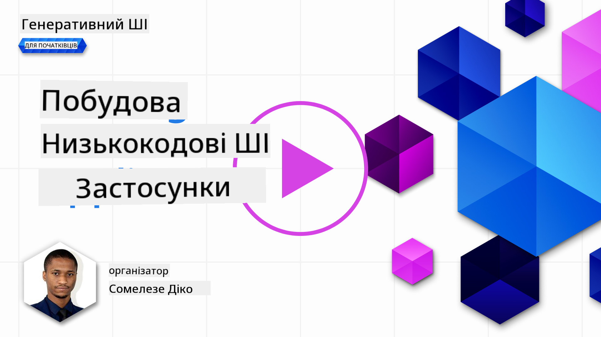
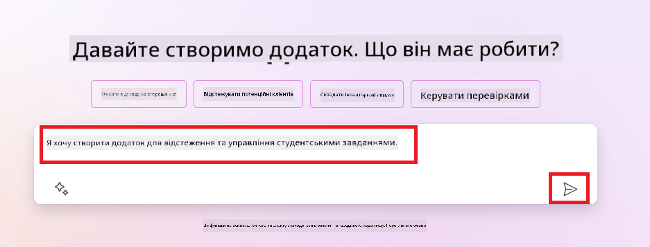
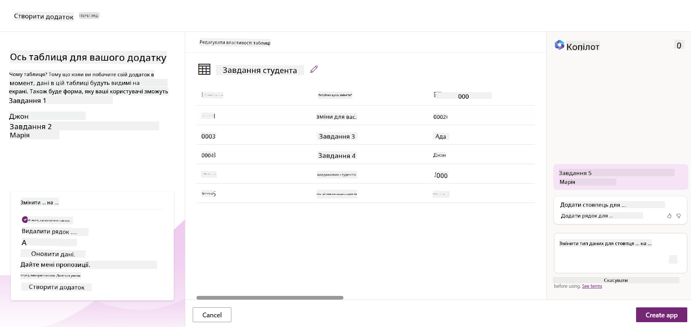
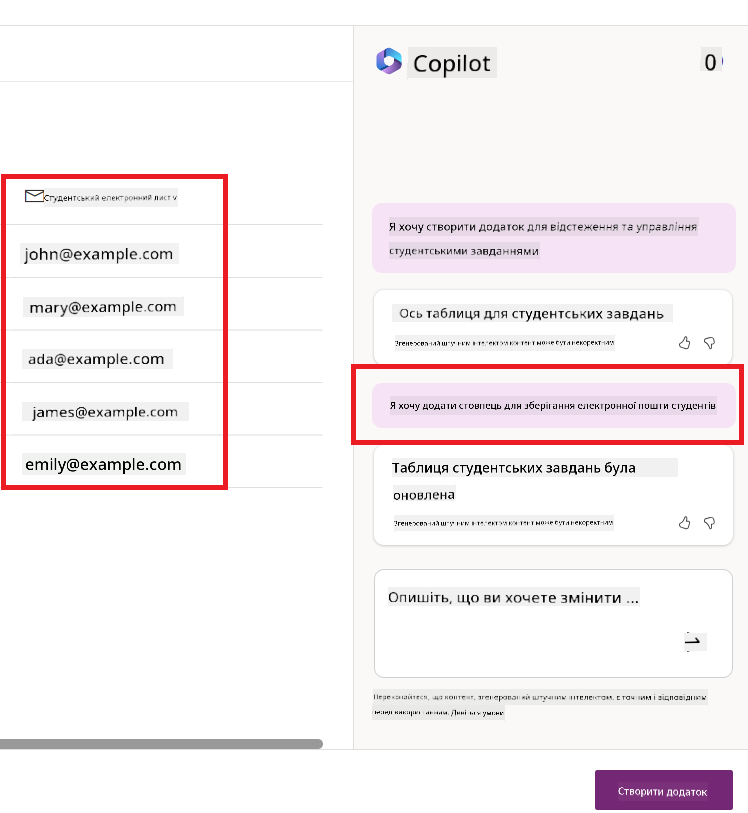
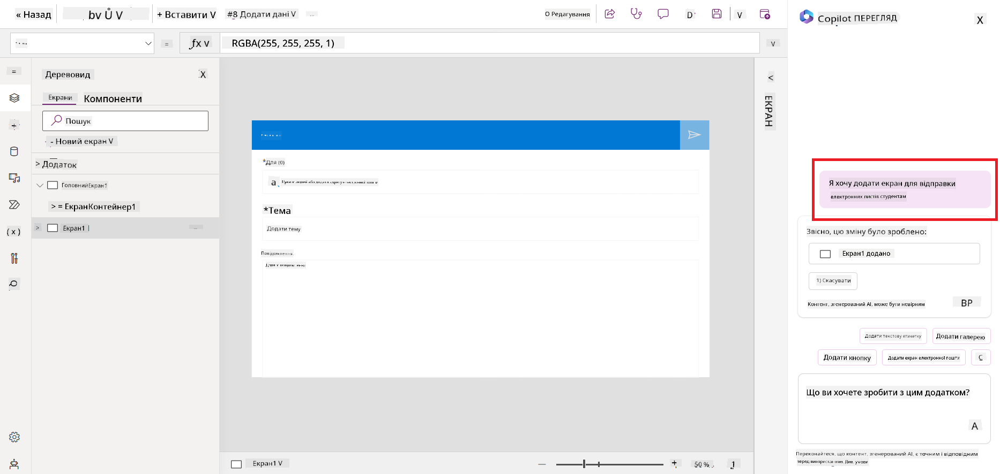
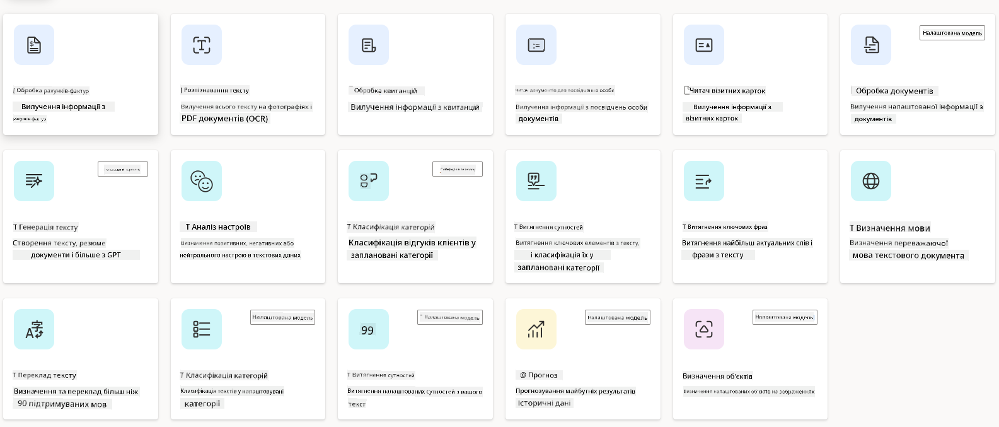
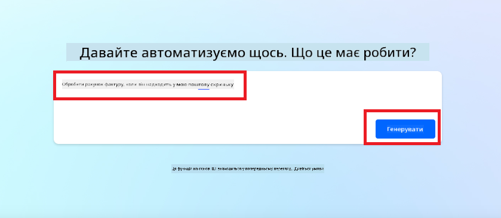
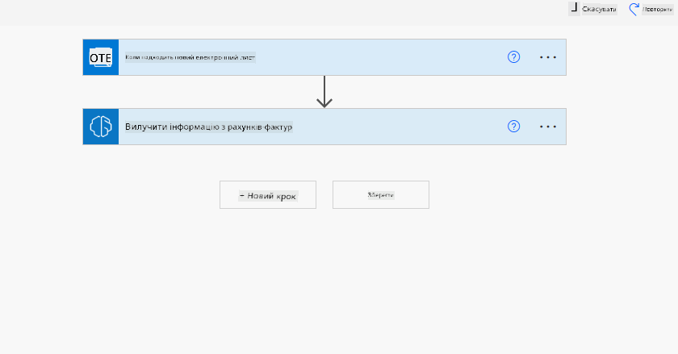
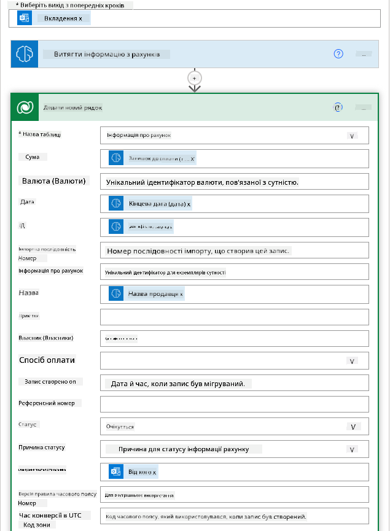
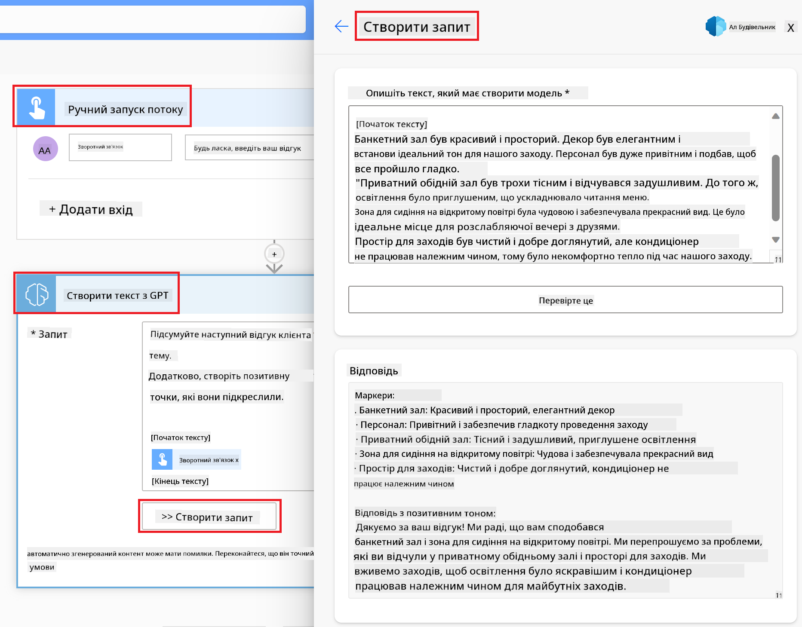

<!--
CO_OP_TRANSLATOR_METADATA:
{
  "original_hash": "f5ff3b6204a695a117d6f452403c95f7",
  "translation_date": "2025-06-25T19:40:11+00:00",
  "source_file": "10-building-low-code-ai-applications/README.md",
  "language_code": "uk"
}
-->
# Створення додатків AI з низьким кодом

> _(Натисніть на зображення вище, щоб переглянути відео цього уроку)_

## Вступ

Тепер, коли ми навчилися створювати додатки для генерації зображень, давайте поговоримо про низький код. Генеративний AI може бути використаний у різних сферах, включаючи низький код, але що таке низький код і як ми можемо додати AI до нього?

Створення додатків і рішень стало легшим для традиційних розробників і не-розробників завдяки використанню платформ розробки з низьким кодом. Платформи розробки з низьким кодом дозволяють створювати додатки і рішення з мінімальним або взагалі без коду. Це досягається шляхом надання візуального середовища розробки, яке дозволяє перетягувати компоненти для створення додатків і рішень. Це дозволяє швидше створювати додатки і рішення з меншими ресурсами. У цьому уроці ми глибше зануримося в те, як використовувати низький код і як покращити розробку з низьким кодом за допомогою AI, використовуючи Power Platform.

Power Platform надає організаціям можливість наділити свої команди можливістю створювати власні рішення через інтуїтивно зрозуміле середовище з низьким кодом або без коду. Це середовище допомагає спростити процес створення рішень. З Power Platform рішення можуть бути створені за дні або тижні, а не місяці або роки. Power Platform складається з п'яти ключових продуктів: Power Apps, Power Automate, Power BI, Power Pages і Copilot Studio.

Цей урок охоплює:

- Вступ до генеративного AI в Power Platform
- Вступ до Copilot і як ним користуватися
- Використання генеративного AI для створення додатків і потоків у Power Platform
- Розуміння AI моделей в Power Platform з AI Builder

## Цілі навчання

До кінця цього уроку ви зможете:

- Розуміти, як працює Copilot в Power Platform.

- Створити додаток для відстеження завдань студентів для нашого освітнього стартапу.

- Створити потік обробки рахунків, який використовує AI для вилучення інформації з рахунків.

- Застосовувати найкращі практики при використанні моделі AI GPT для створення тексту.

Інструменти та технології, які ви будете використовувати в цьому уроці:

- **Power Apps**, для додатку відстеження завдань студентів, який надає середовище розробки з низьким кодом для створення додатків для відстеження, управління та взаємодії з даними.

- **Dataverse**, для зберігання даних додатку відстеження завдань студентів, де Dataverse надасть платформу даних з низьким кодом для зберігання даних додатку.

- **Power Automate**, для потоку обробки рахунків, де ви будете мати середовище розробки з низьким кодом для створення робочих процесів для автоматизації процесу обробки рахунків.

- **AI Builder**, для моделі AI обробки рахунків, де ви будете використовувати попередньо створені моделі AI для обробки рахунків для нашого стартапу.

## Генеративний AI в Power Platform

Покращення розробки та застосування з низьким кодом за допомогою генеративного AI є ключовою областю фокусу для Power Platform. Мета полягає в тому, щоб дати можливість кожному створювати додатки, сайти, інформаційні панелі з AI та автоматизувати процеси з AI, _без необхідності в знаннях у галузі науки про дані_. Ця мета досягається шляхом інтеграції генеративного AI в досвід розробки з низьким кодом у Power Platform у формі Copilot і AI Builder.

### Як це працює?

Copilot - це AI асистент, який дозволяє створювати рішення Power Platform, описуючи ваші вимоги в серії розмовних кроків, використовуючи природну мову. Ви можете, наприклад, доручити вашому AI асистенту вказати, які поля буде використовувати ваш додаток, і він створить як додаток, так і підлягаючу модель даних, або ви можете вказати, як налаштувати потік в Power Automate.

Ви можете використовувати функціональності на основі Copilot як функцію у ваших екранах додатків, щоб дати користувачам можливість виявляти інсайти через розмовні взаємодії.

AI Builder - це можливість AI з низьким кодом, доступна в Power Platform, яка дозволяє використовувати AI моделі, щоб допомогти вам автоматизувати процеси та передбачати результати. З AI Builder ви можете додати AI до ваших додатків і потоків, які підключаються до ваших даних у Dataverse або в різних хмарних джерелах даних, таких як SharePoint, OneDrive або Azure.

Copilot доступний у всіх продуктах Power Platform: Power Apps, Power Automate, Power BI, Power Pages і Power Virtual Agents. AI Builder доступний у Power Apps і Power Automate. У цьому уроці ми зосередимося на тому, як використовувати Copilot і AI Builder у Power Apps і Power Automate для створення рішення для нашого освітнього стартапу.

### Copilot у Power Apps

Як частина Power Platform, Power Apps надає середовище розробки з низьким кодом для створення додатків для відстеження, управління та взаємодії з даними. Це набір послуг для розробки додатків з масштабованою платформою даних і можливістю підключення до хмарних сервісів і даних на місці. Power Apps дозволяє створювати додатки, які працюють у браузерах, на планшетах і телефонах, і можуть бути поділені з колегами. Power Apps полегшує користувачам розробку додатків за допомогою простого інтерфейсу, щоб кожен бізнес-користувач або професійний розробник міг створювати кастомні додатки. Досвід розробки додатків також покращено за допомогою генеративного AI через Copilot.

Функція AI асистента Copilot у Power Apps дозволяє вам описати, який тип додатку вам потрібен і яку інформацію ви хочете, щоб ваш додаток відстежував, збирав або показував. Copilot потім генерує адаптивний Canvas додаток на основі вашого опису. Ви можете потім налаштувати додаток відповідно до ваших потреб. AI Copilot також генерує та пропонує таблицю Dataverse з полями, які вам потрібні для зберігання даних, які ви хочете відстежувати, та деякими зразками даних. Ми розглянемо, що таке Dataverse і як ви можете його використовувати в Power Apps у цьому уроці пізніше. Ви можете потім налаштувати таблицю відповідно до ваших потреб, використовуючи функцію AI Copilot асистента через розмовні кроки. Ця функція доступна з головного екрану Power Apps.

### Copilot у Power Automate

Як частина Power Platform, Power Automate дозволяє користувачам створювати автоматизовані робочі процеси між додатками та сервісами. Це допомагає автоматизувати повторювані бізнес-процеси, такі як комунікація, збір даних і затвердження рішень. Його простий інтерфейс дозволяє користувачам з будь-яким рівнем технічної компетенції (від початківців до досвідчених розробників) автоматизувати робочі завдання. Досвід розробки робочих процесів також покращено за допомогою генеративного AI через Copilot.

Функція AI асистента Copilot у Power Automate дозволяє вам описати, який тип потоку вам потрібен і які дії ви хочете, щоб ваш потік виконував. Copilot потім генерує потік на основі вашого опису. Ви можете потім налаштувати потік відповідно до ваших потреб. AI Copilot також генерує та пропонує дії, які вам потрібні для виконання завдання, яке ви хочете автоматизувати. Ми розглянемо, що таке потоки і як ви можете їх використовувати в Power Automate у цьому уроці пізніше. Ви можете потім налаштувати дії відповідно до ваших потреб, використовуючи функцію AI Copilot асистента через розмовні кроки. Ця функція доступна з головного екрану Power Automate.

## Завдання: Управління завданнями студентів та рахунками для нашого стартапу, використовуючи Copilot

Наш стартап надає онлайн курси для студентів. Стартап швидко зріс і тепер бореться з високим попитом на свої курси. Стартап найняв вас як розробника Power Platform, щоб допомогти їм створити рішення з низьким кодом для управління студентськими завданнями та рахунками. Їх рішення повинно допомогти їм відстежувати та керувати студентськими завданнями через додаток та автоматизувати процес обробки рахунків через робочий процес. Вас попросили використовувати генеративний AI для розробки рішення.

Коли ви починаєте використовувати Copilot, ви можете скористатися [Бібліотекою підказок Power Platform Copilot](https://github.com/pnp/powerplatform-prompts?WT.mc_id=academic-109639-somelezediko), щоб почати з підказок. Ця бібліотека містить список підказок, які ви можете використовувати для створення додатків і потоків з Copilot. Ви також можете використовувати підказки в бібліотеці, щоб отримати уявлення про те, як описати ваші вимоги для Copilot.

### Створення додатку для відстеження завдань студентів для нашого стартапу

Освітяни в нашому стартапі мали труднощі з відстеженням завдань студентів. Вони використовували електронну таблицю для відстеження завдань, але це стало важким для управління, оскільки кількість студентів зросла. Вони попросили вас створити додаток, який допоможе їм відстежувати та керувати студентськими завданнями. Додаток повинен дозволяти їм додавати нові завдання, переглядати завдання, оновлювати завдання та видаляти завдання. Додаток також повинен дозволяти освітянам і студентам переглядати завдання, які були оцінені, і ті, що не були оцінені.

Ви створите додаток, використовуючи Copilot у Power Apps, дотримуючись наведених нижче кроків:

1. Перейдіть на головний екран [Power Apps](https://make.powerapps.com?WT.mc_id=academic-105485-koreyst).

2. Використовуйте текстову область на головному екрані, щоб описати додаток, який ви хочете створити. Наприклад, **_Я хочу створити додаток для відстеження та управління студентськими завданнями_**. Натисніть кнопку **Відправити**, щоб відправити підказку AI Copilot.

3. AI Copilot запропонує таблицю Dataverse з полями, які вам потрібні для зберігання даних, які ви хочете відстежувати, та деякими зразками даних. Ви можете потім налаштувати таблицю відповідно до ваших потреб, використовуючи функцію AI Copilot асистента через розмовні кроки.

   > **Важливо**: Dataverse є підлягаючою платформою даних для Power Platform. Це платформа даних з низьким кодом для зберігання даних додатку. Це повністю керована служба, яка безпечно зберігає дані в Microsoft Cloud і надається в межах вашого середовища Power Platform. Вона має вбудовані можливості управління даними, такі як класифікація даних, лінія даних, контроль доступу на рівні даних та інше. Ви можете дізнатися більше про Dataverse [тут](https://docs.microsoft.com/powerapps/maker/data-platform/data-platform-intro?WT.mc_id=academic-109639-somelezediko).

   

4. Освітяни хочуть надсилати електронні листи студентам, які подали свої завдання, щоб тримати їх в курсі про прогрес їх завдань. Ви можете використовувати Copilot, щоб додати нове поле до таблиці для зберігання електронної пошти студента. Наприклад, ви можете використовувати наступну підказку для додавання нового поля до таблиці: **_Я хочу додати стовпець для зберігання електронної пошти студента_**. Натисніть кнопку **Відправити**, щоб відправити підказку AI Copilot.

5. AI Copilot згенерує нове поле, і ви можете потім налаштувати поле відповідно до ваших потреб.

6. Коли ви закінчите з таблицею, натисніть кнопку **Створити додаток**, щоб створити додаток.

7. AI Copilot згенерує адаптивний Canvas додаток на основі вашого опису. Ви можете потім налаштувати додаток відповідно до ваших потреб.

8. Щоб освітяни могли надсилати електронні листи студентам, ви можете використовувати Copilot, щоб додати новий екран до додатку. Наприклад, ви можете використовувати наступну підказку для додавання нового екрану до додатку: **_Я хочу додати екран для надсилання електронних листів студентам_**. Натисніть кнопку **Відправити**, щоб відправити підказку AI Copilot.

9. AI Copilot згенерує новий екран, і ви можете потім налаштувати екран відповідно до ваших потреб.

10. Коли ви закінчите з додатком, натисніть кнопку **Зберегти**, щоб зберегти додаток.

11. Щоб поділитися додатком з освітянами, натисніть кнопку **Поділитися**, а потім натисніть кнопку **Поділитися** знову. Ви можете потім поділитися додатком з освітянами, ввівши їх електронні адреси.

> **Ваше домашнє завдання**: Додаток, який ви щойно створили, є хорошим початком, але його можна покращити. З функцією електронної пошти освітяни можуть надсилати електронні листи студентам лише вручну, вводячи їх електронні адреси. Чи можете ви використовувати Copilot, щоб створити автоматизацію, яка дозволить освітянам автоматично надсилати електронні листи студентам, коли вони подають свої завдання? Ваша підказка: з правильним підказкою ви можете використовувати Copilot у Power Automate для створення цього.

### Створення таблиці інформації про рахунки для нашого стартапу

Фінансова команда нашого стартапу мала труднощі з відстеженням рахунків. Вони використовували електронну таблицю для відстеження рахунків, але це стало важким для управління, оскільки кількість рахунків зросла. Вони попросили вас створити таблицю, яка допоможе їм зберігати, відстежувати та управляти інформацією про отримані рахунки. Таблиця повинна використовуватися для створення автоматизації, яка буде вилучати всю інформацію про рахунки і зберігати її в таблиці. Таблиця також повинна дозволяти фінансовій команді переглядати рахунки, які були оплачені, і ті, що не були оплачені.

Power Platform має підлягаючу платформу даних під назвою Dataverse, яка дозволяє вам зберігати дані для ваших додатків і рішень. Dataverse надає платформу даних з низьким кодом
текст. - **Аналіз настроїв**: Ця модель визначає позитивний, негативний, нейтральний або змішаний настрій у тексті. - **Читач візиток**: Ця модель витягує інформацію з візитних карток. - **Розпізнавання тексту**: Ця модель витягує текст з зображень. - **Виявлення об'єктів**: Ця модель виявляє та витягує об'єкти з зображень. - **Обробка документів**: Ця модель витягує інформацію з форм. - **Обробка рахунків**: Ця модель витягує інформацію з рахунків. Зі спеціальними моделями AI ви можете додати власну модель в AI Builder, щоб вона могла функціонувати як будь-яка інша спеціальна модель AI Builder, дозволяючи вам навчати модель, використовуючи власні дані. Ви можете використовувати ці моделі для автоматизації процесів та прогнозування результатів як у Power Apps, так і в Power Automate. При використанні власної моделі існують обмеження. Детальніше про ці [обмеження](https://learn.microsoft.com/ai-builder/byo-model#limitations?WT.mc_id=academic-105485-koreyst). 

## Завдання №2 - Створення потоку обробки рахунків для нашого стартапу

Фінансовий відділ стикається з труднощами в обробці рахунків. Вони використовували електронну таблицю для відстеження рахунків, але це стало важко керувати, оскільки кількість рахунків зросла. Вони попросили вас створити робочий процес, який допоможе їм обробляти рахунки за допомогою AI. Робочий процес повинен дозволити їм витягувати інформацію з рахунків та зберігати інформацію в таблиці Dataverse. Також робочий процес повинен дозволити їм надсилати електронний лист до фінансового відділу з витягнутою інформацією.

Тепер, коли ви знаєте, що таке AI Builder і чому варто його використовувати, давайте розглянемо, як ви можете використовувати AI модель обробки рахунків у AI Builder, яку ми розглядали раніше, щоб створити робочий процес, який допоможе фінансовому відділу обробляти рахунки.

Щоб створити робочий процес, який допоможе фінансовому відділу обробляти рахунки, використовуючи AI модель обробки рахунків у AI Builder, виконайте наступні кроки:

1. Перейдіть на головну сторінку [Power Automate](https://make.powerautomate.com?WT.mc_id=academic-105485-koreyst).
2. Використовуйте текстове поле на головній сторінці, щоб описати робочий процес, який ви хочете створити. Наприклад, **_Обробити рахунок, коли він надходить у мою поштову скриньку_**. Натисніть кнопку **Надіслати**, щоб надіслати запит до AI Copilot. 
3. AI Copilot запропонує дії, які вам потрібно виконати для автоматизації завдання. Ви можете натиснути кнопку **Далі**, щоб перейти до наступних кроків.
4. На наступному кроці Power Automate запропонує вам налаштувати з'єднання, необхідні для потоку. Після завершення натисніть кнопку **Створити потік**, щоб створити потік.
5. AI Copilot згенерує потік, і ви зможете налаштувати його відповідно до ваших потреб.
6. Оновіть тригер потоку та встановіть **Папку** на папку, де будуть зберігатися рахунки. Наприклад, ви можете встановити папку на **Вхідні**. Натисніть **Показати додаткові параметри** та встановіть **Тільки з вкладеннями** на **Так**. Це забезпечить запуск потоку лише тоді, коли в папку надходить електронний лист з вкладенням.
7. Видаліть наступні дії з потоку: **HTML до тексту**, **Скласти**, **Скласти 2**, **Скласти 3** і **Скласти 4**, оскільки ви не будете їх використовувати.
8. Видаліть дію **Умова** з потоку, оскільки ви не будете її використовувати. Це має виглядати як на наступному скріншоті: 
9. Натисніть кнопку **Додати дію** та знайдіть **Dataverse**. Виберіть дію **Додати новий рядок**.
10. У дії **Витягнути інформацію з рахунків** оновіть **Файл рахунку**, щоб вказати на **Вміст вкладення** з електронного листа. Це забезпечить витяг інформації з вкладення рахунку.
11. Виберіть **Таблицю**, яку ви створили раніше. Наприклад, ви можете вибрати таблицю **Інформація про рахунки**. Виберіть динамічний вміст з попередньої дії, щоб заповнити наступні поля: - ID - Сума - Дата - Ім'я - Статус - Встановіть **Статус** на **В очікуванні**. - Електронна пошта постачальника - Використовуйте динамічний вміст **Від** з тригера **Коли надходить новий електронний лист**. 
12. Після завершення роботи з потоком натисніть кнопку **Зберегти**, щоб зберегти потік. Потім ви можете протестувати потік, надіславши електронний лист з рахунком у папку, яку ви вказали в тригері.

> **Ваше домашнє завдання**: Потік, який ви щойно створили, є гарним початком, тепер вам потрібно подумати, як ви можете створити автоматизацію, яка дозволить нашій фінансовій команді надіслати електронний лист постачальнику, щоб повідомити його про поточний статус їхнього рахунку. Ваша підказка: потік повинен запускатися, коли статус рахунку змінюється.

## Використання моделі генерації тексту в Power Automate

Модель створення тексту з GPT у AI Builder дозволяє генерувати текст на основі запиту та працює на основі Microsoft Azure OpenAI Service. З цією можливістю ви можете інтегрувати технологію GPT (Generative Pre-Trained Transformer) у свої додатки та потоки, щоб створювати різноманітні автоматизовані потоки та інформативні додатки.

Моделі GPT проходять інтенсивне навчання на величезних обсягах даних, що дозволяє їм створювати текст, який тісно нагадує людську мову, коли їм надається запит. Коли інтегровані з автоматизацією робочих процесів, моделі AI, такі як GPT, можуть бути використані для оптимізації та автоматизації широкого спектру завдань.

Наприклад, ви можете створити потоки для автоматичного створення тексту для різноманітних випадків використання, таких як: чернетки електронних листів, описи продуктів тощо. Ви також можете використовувати модель для створення тексту для різних додатків, таких як чат-боти та додатки для обслуговування клієнтів, які дозволяють агентам обслуговування клієнтів ефективно та швидко відповідати на запити клієнтів.

Щоб дізнатися, як використовувати цю AI модель у Power Automate, пройдіть модуль [Додати інтелект з AI Builder і GPT](https://learn.microsoft.com/training/modules/ai-builder-text-generation/?WT.mc_id=academic-109639-somelezediko).

## Чудова робота! Продовжуйте навчання

Після завершення цього уроку ознайомтеся з нашою [Колекцією навчання з генеративного AI](https://aka.ms/genai-collection?WT.mc_id=academic-105485-koreyst), щоб продовжити підвищувати свої знання з генеративного AI!

Перейдіть до уроку 11, де ми розглянемо, як [інтегрувати генеративний AI з викликом функцій](../11-integrating-with-function-calling/README.md?WT.mc_id=academic-105485-koreyst)!

**Відмова від відповідальності**:  
Цей документ було перекладено за допомогою сервісу автоматичного перекладу [Co-op Translator](https://github.com/Azure/co-op-translator). Хоча ми прагнемо до точності, зверніть увагу, що автоматизовані переклади можуть містити помилки або неточності. Оригінальний документ на рідній мові слід вважати авторитетним джерелом. Для критичної інформації рекомендується професійний людський переклад. Ми не несемо відповідальності за будь-які непорозуміння або неправильні тлумачення, що виникають внаслідок використання цього перекладу.