# Створення додатків AI з низьким рівнем коду

> _(Натисніть на зображення вище, щоб переглянути відео цього уроку)_

## Вступ

Тепер, коли ми навчилися створювати додатки для створення зображень, давайте поговоримо про low code. Генеративний AI можна використовувати в різних сферах, включно з low code, але що таке low code і як можна додати AI до нього?

Створення додатків і рішень стало простішим як для звичайних розробників, так і для тих, хто не є розробниками, завдяки використанню платформ з низьким рівнем коду. Платформи розробки з низьким рівнем коду дозволяють створювати додатки і рішення з мінімальним або нульовим написанням коду. Це досягається шляхом надання візуального середовища розробки, яке дозволяє перетягувати компоненти для створення додатків і рішень. Це дозволяє створювати додатки і рішення швидше і з меншими ресурсами. У цьому уроці ми детально розглянемо, як користуватися low code та як покращити розробку з низьким рівнем коду за допомогою AI із Power Platform.

Power Platform надає організаціям можливість надати своїм командам змогу створювати власні рішення через інтуїтивне середовище з низьким або нульовим кодом. Це середовище допомагає спростити процес створення рішень. За допомогою Power Platform рішення можна створювати за дні або тижні замість місяців або років. Power Platform складається з п’яти ключових продуктів: Power Apps, Power Automate, Power BI, Power Pages та Copilot Studio.

У цьому уроці ми розглянемо:

- Вступ до генеративного AI у Power Platform
- Вступ до Copilot та як ним користуватись
- Використання генеративного AI для створення додатків і потоків у Power Platform
- Розуміння AI моделей у Power Platform за допомогою AI Builder
- Створення інтелектуальних агентів за допомогою Microsoft Copilot Studio

## Цілі навчання

Після завершення цього уроку ви зможете:

- Розуміти, як працює Copilot у Power Platform.

- Створити додаток для відстеження завдань студентів для нашого освітнього стартапу.

- Створити потік обробки рахунків, який використовує AI для вилучення інформації з рахунків.

- Застосовувати найкращі практики при використанні AI моделі Create Text with GPT.

- Розуміти, що таке Microsoft Copilot Studio і як створювати інтелектуальних агентів за його допомогою.

Інструменти та технології, які ви використаєте у цьому уроці:

- **Power Apps**, для створення додатку Student Assignment Tracker, який надає середовище розробки low-code для створення додатків для відстеження, управління та взаємодії з даними.

- **Dataverse**, для зберігання даних для додатку Student Assignment Tracker, де Dataverse надасть low-code платформу для зберігання даних додатку.

- **Power Automate**, для потоку обробки рахунків, де ви матимете середовище розробки low-code для створення робочих процесів автоматизації процесу обробки рахунків.

- **AI Builder**, для AI моделі обробки рахунків, де ви використаєте вже готові AI моделі для обробки рахунків для нашого стартапу.

## Генеративний AI у Power Platform

Покращення розробки та застосування low-code за допомогою генеративного AI є ключовою сферою уваги для Power Platform. Мета — дозволити кожному створювати додатки, сайти, інформаційні панелі з AI та автоматизувати процеси за допомогою AI, _без необхідності володіти знаннями в галузі науки про дані_. Ця мета досягається інтеграцією генеративного AI у досвід розробки low-code у Power Platform у вигляді Copilot і AI Builder.

### Як це працює?

Copilot — це AI асистент, який дозволяє створювати рішення Power Platform, описуючи ваші вимоги у вигляді серії діалогових кроків природною мовою. Ви можете, наприклад, вказати вашому AI асистенту, які поля має використовувати ваш додаток, і він створить як додаток, так і основну модель даних, або ви можете описати, як налаштувати потік у Power Automate.

Ви можете використовувати функції на базі Copilot як особливість у екранах вашого додатка, щоб користувачі могли отримувати інсайти через діалогову взаємодію.

AI Builder — це можливість low-code AI, доступна у Power Platform, яка дозволяє використовувати AI моделі для автоматизації процесів і прогнозування результатів. З AI Builder ви можете додати AI до ваших додатків і потоків, які підключені до даних Dataverse або різних хмарних джерел даних, таких як SharePoint, OneDrive або Azure.

Copilot доступний у всіх продуктах Power Platform: Power Apps, Power Automate, Power BI, Power Pages та Copilot Studio (колишній Power Virtual Agents). AI Builder доступний у Power Apps і Power Automate. У цьому уроці ми зосередимося на використанні Copilot і AI Builder у Power Apps і Power Automate для створення рішення для нашого освітнього стартапу.

### Copilot у Power Apps

Як частина Power Platform, Power Apps надає середовище розробки low-code для створення додатків для відстеження, управління й взаємодії з даними. Це комплекс сервісів розробки додатків зі масштабованою платформою даних і можливістю підключення до хмарних сервісів і локальних даних. Power Apps дозволяє створювати додатки, які працюють у браузерах, на планшетах і телефонах, та можуть бути поширені між колегами. Power Apps допомагає користувачам розпочати розробку додатків за допомогою простого інтерфейсу, щоб будь-який бізнес-користувач або професійний розробник міг створити власні додатки. Досвід розробки також покращено генеративним AI через Copilot.

Функція AI асистента Copilot у Power Apps дозволяє вам описати, який тип додатка ви хочете і яку інформацію ваш додаток повинен відстежувати, збирати або показувати. Copilot тоді створює адаптивний Canvas-додаток на основі вашого опису. Ви можете налаштовувати додаток, щоб він відповідав вашим потребам. AI Copilot також створює і пропонує таблицю Dataverse із полями, необхідними для зберігання даних, які ви хочете відстежувати, та деякими зразками даних. Ми пізніше у цьому уроці розглянемо, що таке Dataverse і як його використовувати у Power Apps. Потім ви можете налаштувати таблицю відповідно до своїх потреб за допомогою функції асистента AI Copilot через кроки діалогового режиму. Ця функція доступна безпосередньо з головного екрану Power Apps.

### Copilot у Power Automate

Як частина Power Platform, Power Automate дозволяє користувачам створювати автоматизовані робочі процеси між додатками та сервісами. Він допомагає автоматизувати повторювані бізнес-процеси, такі як комунікація, збір даних і схвалення рішень. Його простий інтерфейс дозволяє користувачам із будь-яким технічним рівнем (від початківців до досвідчених розробників) автоматизувати робочі завдання. Досвід розробки робочих процесів також покращено генеративним AI через Copilot.

Функція AI асистента Copilot у Power Automate дозволяє описати, який тип потоку вам потрібен і які дії він має виконувати. Copilot тоді генерує потік на основі вашого опису. Ви можете налаштувати потік так, щоб він відповідав вашим потребам. AI Copilot також створює і пропонує дії, необхідні для виконання завдання, яке ви хочете автоматизувати. Ми пізніше у цьому уроці розглянемо, що таке потоки і як їх використовувати у Power Automate. Ви можете налаштувати дії відповідно до своїх потреб за допомогою функції асистента AI Copilot через кроки діалогового режиму. Ця функція доступна безпосередньо з головного екрану Power Automate.

## Створення інтелектуальних агентів за допомогою Microsoft Copilot Studio

[Microsoft Copilot Studio](https://learn.microsoft.com/microsoft-copilot-studio/fundamentals-what-is-copilot-studio?WT.mc_id=academic-105485-koreyst) (раніше Power Virtual Agents) — це учасник Power Platform з низьким рівнем коду для створення **AI агентів** — розмовних копілотів, які можуть відповідати на запитання, виконувати дії та автоматизувати завдання від імені ваших користувачів. Як і решта Power Platform, ви створюєте цих агентів у візуальному середовищі з пріоритетом природної мови: ви описуєте, що ви хочете, щоб агент робив, і Copilot Studio допомагає структурувати його інструкції, знання та дії.

Для нашого освітнього стартапу ви можете створити агента, який відповідає на питання студентів про курси, перевіряє дедлайни завдань і навіть надсилає інструктору електронні листи — усе це без написання коду.

Ось деякі з останніх можливостей, які роблять Copilot Studio потужним:

- **Генеративні відповіді на основі ваших знань**. Замість ручного створення кожної розмови, ви можете підключати **джерела знань** — публічні сайти, SharePoint, OneDrive, Dataverse, завантажені файли або корпоративні дані через конектори — і агент генерує обґрунтовані відповіді з них.

- **Генеративна оркестрація**. Замість використання жорстких тригерних фраз агент використовує AI, щоб зрозуміти запит і динамічно вирішити, які знання, теми й дії поєднати для його виконання, включно з послідовним виконанням декількох кроків.

- **Дії та конектори**. Агенти можуть *робити* речі, а не лише спілкуватися. Ви можете надавати агенту дії, підтримувані 1 500+ вбудованих конекторів Power Platform, потоків Power Automate, власних REST API, підказок або серверів **Model Context Protocol (MCP)**.

- **Автономні агенти**. Агенти не обмежуються відповідями у вікні чату. Ви можете створювати **автономних агентів**, які запускаються подіями — такими як новий електронний лист, новий запис у Dataverse або завантаження файлу — і потім виконують завдання у фоновому режимі.

- **Оркестрація кількох агентів**. Агенти можуть викликати інших агентів. Агент Copilot Studio може передавати задачі іншим агентам або розширюватися іншими агентами, включно з агентами, опублікованими для Microsoft 365 Copilot, і агентами, створеними в Microsoft Foundry.

- **Вибір моделі**. Окрім вбудованих моделей, ви можете додавати моделі зі каталогу моделей Microsoft Foundry, щоб налаштувати логіку й відповіді вашого агента.

- **Публікація в будь-якому місці**. Після створення агент можна публікувати у кількох каналах — Microsoft Teams, Microsoft 365 Copilot, на вебсайт чи власний додаток і більше — із керуванням безпекою, автентифікацією та аналітикою через адмінський досвід Power Platform.

Ви можете розпочати створення свого першого агента на [copilotstudio.microsoft.com](https://copilotstudio.microsoft.com?WT.mc_id=academic-105485-koreyst) і дізнатися більше у [документації Microsoft Copilot Studio](https://learn.microsoft.com/microsoft-copilot-studio/?WT.mc_id=academic-105485-koreyst).

## Завдання: керування завданнями студентів і рахунками для нашого стартапу за допомогою Copilot

Наш стартап надає онлайн-курси студентам. Стартап швидко розрісся і тепер має труднощі з забезпеченням зростаючого попиту на курси. Стартап найняв вас як розробника Power Platform, щоб допомогти створити низькокодове рішення для керування завданнями студентів і рахунками. Їхнє рішення має допомагати відстежувати та керувати студентськими завданнями через додаток і автоматизувати процес обробки рахунків через робочий потік. Вас попросили використати генеративний AI для розробки рішення.

Коли ви починаєте користуватися Copilot, ви можете використати [Power Platform Copilot Prompt Library](https://github.com/pnp/powerplatform-prompts?WT.mc_id=academic-109639-somelezediko), щоб почати з шаблонів підказок. Ця бібліотека містить список підказок, які ви можете використати для створення додатків і потоків із Copilot. Ви також можете скористатись підказками з бібліотеки, щоб зрозуміти, як описувати свої вимоги Copilot.

### Створіть додаток для відстеження завдань студентів для нашого стартапу

Викладачі нашого стартапу мали труднощі з відстеженням завдань студентів. Вони використовували електронну таблицю, але це стало складно керувати в міру зростання кількості студентів. Вони попросили вас створити додаток, який допоможе відстежувати і керувати студентськими завданнями. Додаток має дозволяти додавати нові завдання, переглядати завдання, оновлювати завдання та видаляти завдання. Додаток також має дозволяти викладачам і студентам переглядати завдання, які оцінені, і ті, що не оцінені.

Ви створите додаток, використовуючи Copilot у Power Apps, виконуючи наступні кроки:

1. Перейдіть на домашній екран [Power Apps](https://make.powerapps.com?WT.mc_id=academic-105485-koreyst).

1. Використайте текстове поле на домашньому екрані, щоб описати додаток, який ви хочете створити. Наприклад, **_Я хочу створити додаток для відстеження та керування завданнями студентів_**. Натисніть кнопку **Відправити**, щоб надіслати підказку AI Copilot.

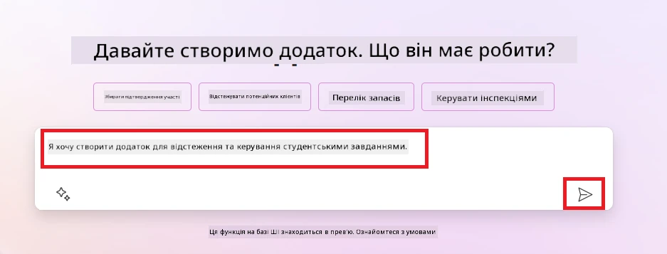

1. AI Copilot запропонує таблицю Dataverse з полями, необхідними для зберігання даних, які ви хочете відстежувати, а також деякими зразками даних. Ви зможете налаштувати таблицю на свій розсуд, використовуючи функцію асистента AI Copilot через кроки діалогового режиму.

   > **Важливо**: Dataverse — це основна платформа даних для Power Platform. Це платформа даних low-code для зберігання даних додатку. Це повністю керована служба, яка безпечно зберігає дані у хмарі Microsoft і розгортається у вашому середовищі Power Platform. Вона підключена до вбудованих можливостей керування даними, таких як класифікація даних, трасування даних, детальний контроль доступу та інше. Більше про Dataverse можна дізнатись [тут](https://learn.microsoft.com/power-apps/maker/data-platform/data-platform-intro?WT.mc_id=academic-109639-somelezediko).

   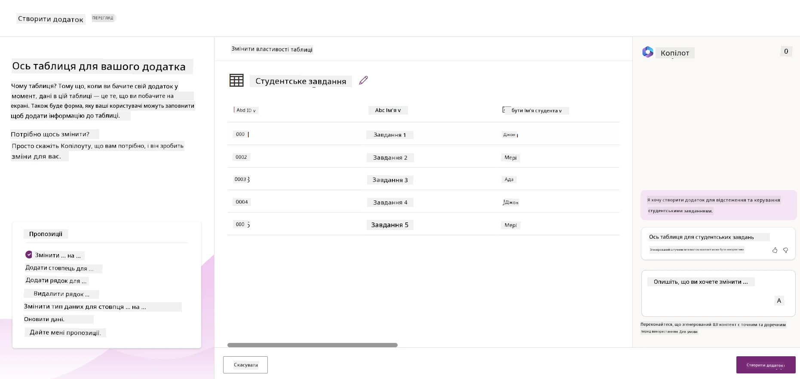

1. Викладачі хочуть надсилати електронні листи студентам, які подали свої завдання, щоб тримати їх у курсі прогресу. Ви можете скористатися Copilot, щоб додати нове поле в таблицю для зберігання електронної пошти студентів. Наприклад, ви можете використати таку підказку: **_Я хочу додати колонку для зберігання електронної пошти студента_**. Натисніть кнопку **Відправити**, щоб надіслати підказку AI Copilot.

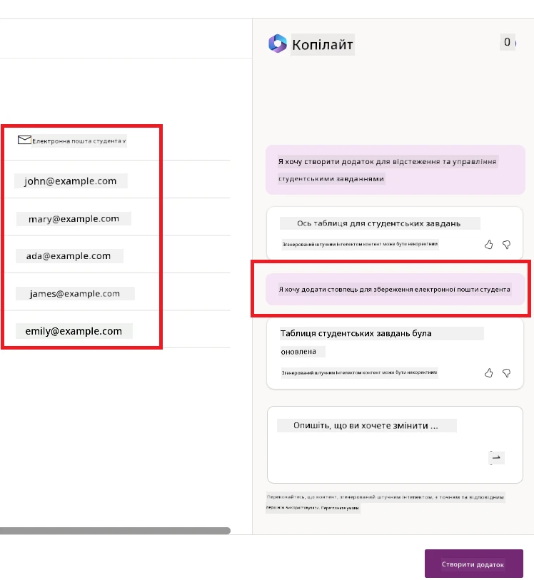

1. AI Copilot створить нове поле, і ви зможете налаштувати поле відповідно до своїх потреб.

1. Коли ви закінчите з таблицею, натисніть кнопку **Створити додаток**, щоб створити додаток.

1. Штучний інтелект Copilot згенерує адаптивний Canvas додаток на основі вашого опису. Потім ви можете налаштувати додаток відповідно до своїх потреб.

1. Для викладачів, які хочуть надсилати електронні листи студентам, ви можете скористатися Copilot, щоб додати новий екран до додатка. Наприклад, ви можете використати наступний запит, щоб додати новий екран до додатка: **_Я хочу додати екран для надсилання електронних листів студентам_**. Натисніть кнопку **Відправити**, щоб надіслати запит Штучному інтелекту Copilot.

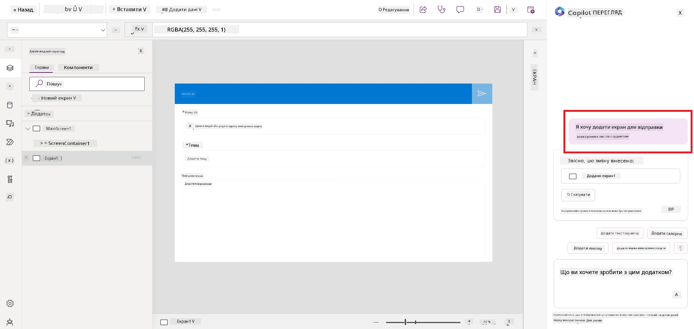

1. Штучний інтелект Copilot згенерує новий екран, і ви зможете налаштувати цей екран відповідно до своїх потреб.

1. Коли ви закінчите з додатком, натисніть кнопку **Зберегти**, щоб зберегти додаток.

1. Щоб поділитися додатком з викладачами, натисніть кнопку **Поділитися**, а потім знову натисніть кнопку **Поділитися**. Потім ви можете поділитися додатком з викладачами, ввівши їхні електронні адреси.

> **Ваше домашнє завдання**: Додаток, який ви щойно створили, є гарним початком, але його можна покращити. За допомогою функції електронної пошти викладачі можуть надсилати листи студентам лише вручну, вводячи їхні адреси. Чи можете ви скористатися Copilot, щоб створити автоматизацію, яка дозволить викладачам надсилати листи студентам автоматично, коли вони здають свої завдання? Підказка: правильний запит дозволить вам використовувати Copilot у Power Automate для створення цієї автоматизації.

### Створення таблиці інформації про рахунки для нашого стартапу

Фінансова команда нашого стартапу мала проблеми з відстеженням рахунків. Вони використовували таблицю для відстеження рахунків, але це стало важко керувати, оскільки кількість рахунків зросла. Вони попросили вас створити таблицю, яка допоможе їм зберігати, відстежувати та управляти інформацією про отримані рахунки. Цю таблицю потрібно використати для створення автоматизації, яка буде витягувати всю інформацію про рахунки й зберігати її в таблиці. Таблиця також має дозволити фінансовій команді переглядати рахунки, що були оплачені, і ті, що ще не сплачені.

Power Platform має базову платформу даних під назвою Dataverse, яка дозволяє зберігати дані для ваших додатків і рішень. Dataverse забезпечує платформу даних з низьким кодом для зберігання даних додатка. Це повністю керована служба, яка безпечно зберігає дані в хмарі Microsoft і розгортається у вашому середовищі Power Platform. Вона має вбудовані можливості керування даними, такі як класифікація даних, відстеження походження даних, точний контроль доступу та інше. Ви можете дізнатися більше [про Dataverse тут](https://learn.microsoft.com/power-apps/maker/data-platform/data-platform-intro?WT.mc_id=academic-109639-somelezediko).

Чому варто використовувати Dataverse для нашого стартапу? Стандартні та користувацькі таблиці в Dataverse забезпечують безпечне та хмарне зберігання ваших даних. Таблиці дозволяють зберігати різні типи даних, подібно до того, як ви можете використовувати кілька аркушів в одній книзі Excel. Ви можете використовувати таблиці для зберігання даних, специфічних для вашої організації чи бізнес-потреб. Деякі переваги, які отримає наш стартап, використовуючи Dataverse, включають, але не обмежуються:

- **Легкість управління**: І метадані, і дані зберігаються в хмарі, тому вам не потрібно турбуватися про те, як вони зберігаються чи керуються. Ви можете зосередитись на створенні своїх додатків і рішень.

- **Безпека**: Dataverse забезпечує безпечне і хмарне зберігання ваших даних. Ви можете контролювати, хто має доступ до даних у ваших таблицях і як вони можуть їх використовувати, застосовуючи безпеку на основі ролей.

- **Багаті метадані**: Типи даних і зв’язки використовуються безпосередньо у Power Apps.

- **Логіка та валідація**: Ви можете використовувати бізнес-правила, обчислювані поля та правила валідації для підтримки бізнес-логіки й точності даних.

Тепер, коли ви знаєте, що таке Dataverse і чому варто його використовувати, давайте подивимось, як ви можете скористатися Copilot для створення таблиці в Dataverse відповідно до потреб нашої фінансової команди.

> **Примітка** : Цю таблицю ви будете використовувати в наступному розділі для створення автоматизації, яка витягуватиме всю інформацію про рахунки й зберігатиме її в таблиці.

Щоб створити таблицю в Dataverse за допомогою Copilot, виконайте наступні кроки:

1. Перейдіть на головний екран [Power Apps](https://make.powerapps.com?WT.mc_id=academic-105485-koreyst).

2. У лівій панелі навігації оберіть **Таблиці**, а потім натисніть **Описати нову таблицю**.

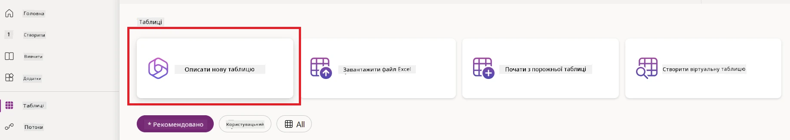

1. На екрані **Описати нову таблицю** використайте текстове поле, щоб описати таблицю, яку хочете створити. Наприклад, **_Я хочу створити таблицю для зберігання інформації про рахунки_**. Натисніть кнопку **Відправити**, щоб надіслати запит Штучному інтелекту Copilot.

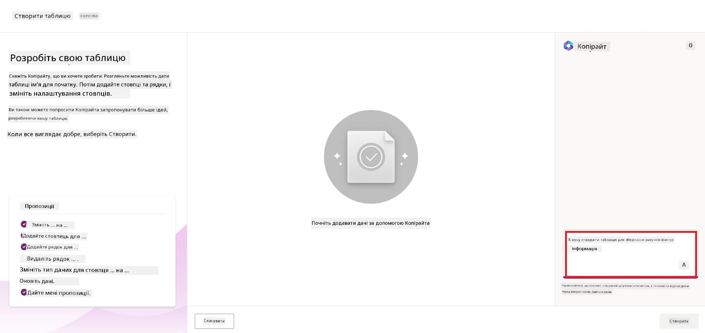

1. Штучний інтелект Copilot запропонує таблицю Dataverse із полями, необхідними для зберігання даних, які ви хочете відстежувати, а також надасть приклади даних. Потім ви можете налаштувати таблицю відповідно до своїх потреб за допомогою функції асистента AI Copilot через розмовні кроки.

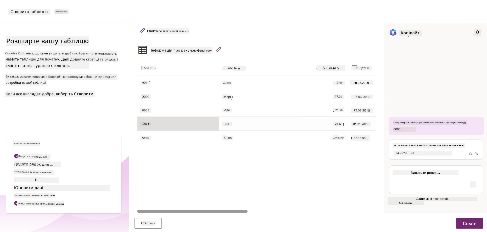

1. Фінансова команда хоче надіслати електронного листа постачальнику, щоб оновити його про поточний статус їхнього рахунку. Ви можете скористатися Copilot, щоб додати нове поле до таблиці для збереження електронної пошти постачальника. Наприклад, ви можете використати наступний запит, щоб додати нове поле: **_Я хочу додати стовпець для збереження електронної пошти постачальника_**. Натисніть кнопку **Відправити**, щоб надіслати запит Штучному інтелекту Copilot.

1. Штучний інтелект Copilot створить нове поле, і ви зможете налаштувати це поле відповідно до своїх потреб.

1. Коли ви закінчите з таблицею, натисніть кнопку **Створити**, щоб створити таблицю.

## AI Моделі в Power Platform з AI Builder

AI Builder — це можливість низькокодового штучного інтелекту в Power Platform, яка дозволяє використовувати AI Моделі, щоб допомогти автоматизувати процеси і передбачати результати. За допомогою AI Builder ви можете додати штучний інтелект у свої додатки та потоки, які підключаються до ваших даних у Dataverse або в різних хмарних джерелах даних, таких як SharePoint, OneDrive або Azure.

## Готові AI Моделі проти Користувацьких AI Моделей

AI Builder надає два типи AI Моделей: Готові AI Моделі та Користувацькі AI Моделі. Готові AI Моделі — це готові до використання AI Моделі, навчання яких проведено компанією Microsoft і які доступні в Power Platform. Вони допомагають додати інтелект до ваших додатків і потоків без необхідності збирати дані, а потім створювати, навчати і публікувати власні моделі. Ви можете використовувати ці моделі для автоматизації процесів і передбачення результатів.

Деякі з Готових AI Моделей, доступних у Power Platform, включають:

- **Виділення ключових фраз**: ця модель вилучає ключові фрази з тексту.
- **Виявлення мови**: ця модель визначає мову тексту.
- **Аналіз настроїв**: ця модель визначає позитивний, негативний, нейтральний або змішаний настрій у тексті.
- **Зчитування візитних карток**: ця модель вилучає інформацію з візитних карток.
- **Розпізнавання тексту**: ця модель вилучає текст із зображень.
- **Виявлення об’єктів**: ця модель виявляє та вилучає об’єкти з зображень.
- **Обробка документів**: ця модель вилучає інформацію з форм.
- **Обробка рахунків**: ця модель вилучає інформацію з рахунків-фактур.

За допомогою Користувацьких AI Моделей ви можете додати власну модель у AI Builder, щоб вона функціонувала як будь-яка користувацька модель AI Builder, що дозволяє вам навчати модель на ваших власних даних. Ви можете використовувати ці моделі для автоматизації процесів і передбачення результатів як у Power Apps, так і в Power Automate. При використанні власної моделі існують обмеження. Детальніше про ці [обмеження](https://learn.microsoft.com/ai-builder/byo-model#limitations?WT.mc_id=academic-105485-koreyst).

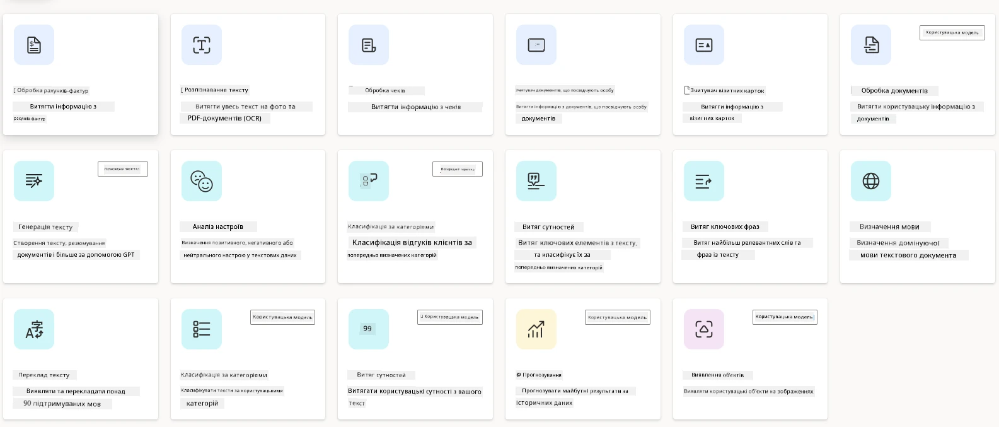

## Завдання №2 - Створення потоку обробки рахунків для нашого стартапу

Фінансова команда мала труднощі з обробкою рахунків. Вони використовували таблицю для відстеження рахунків, але це стало складно керувати, оскільки кількість рахунків зросла. Вони попросили вас створити робочий процес, який допоможе їм обробляти рахунки з використанням ШІ. Робочий процес має дозволяти витягувати інформацію з рахунків і зберігати її в таблиці Dataverse. Також робочий процес має дозволяти надсилати електронного листа фінансовій команді з витягнутою інформацією.

Тепер, коли ви знаєте, що таке AI Builder і чому варто його використовувати, давайте подивимося, як ви можете скористатися моделлю обробки рахунків у AI Builder, яку ми розглянули раніше, для створення робочого процесу, що допоможе фінансовій команді обробляти рахунки.

Щоб створити робочий процес, який допоможе фінансовій команді обробляти рахунки за допомогою моделі обробки рахунків AI Builder, виконайте наступні кроки:

1. Перейдіть на головний екран [Power Automate](https://make.powerautomate.com?WT.mc_id=academic-105485-koreyst).

2. Використайте текстове поле на головному екрані, щоб описати робочий процес, який ви хочете створити. Наприклад, **_Обробляти рахунок, коли він надходить у мою поштову скриньку_**. Натисніть кнопку **Відправити**, щоб надіслати запит Штучному інтелекту Copilot.

   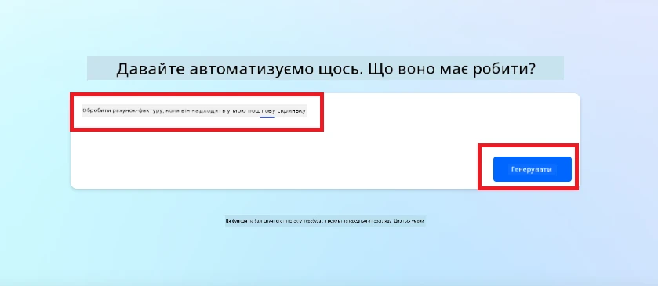

3. Штучний інтелект Copilot запропонує дії, необхідні для автоматизації вашого завдання. Ви можете натиснути кнопку **Далі**, щоб пройти наступні кроки.

4. На наступному кроці Power Automate запропонує налаштувати з’єднання, необхідні для потоку. Коли закінчите, натисніть кнопку **Створити потік** для створення потоку.

5. Штучний інтелект Copilot згенерує потік, і ви зможете налаштувати його відповідно до своїх потреб.

6. Оновіть тригер потоку, встановіть **Папку** на папку, де будуть зберігатися рахунки. Наприклад, ви можете встановити папку **Вхідні**. Натисніть **Показати додаткові параметри** і встановіть **Тільки з вкладеннями** на **Так**. Це гарантує, що потік запускатиметься лише коли до папки надходить лист із вкладенням.

7. Видаліть зі потоку наступні дії: **HTML у текст**, **Compose**, **Compose 2**, **Compose 3** і **Compose 4**, оскільки ви їх не будете використовувати.

8. Видаліть дію **Умова (Condition)**, оскільки вона не буде використовуватися. Потік повинен виглядати, як на знімку екрана нижче:

   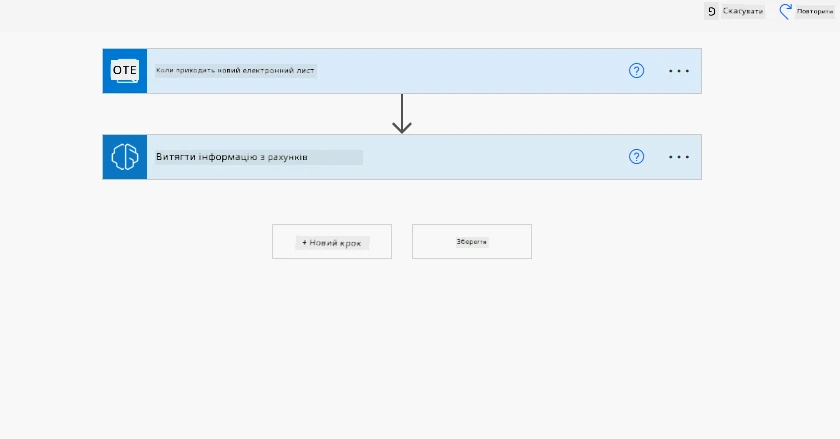

9. Натисніть кнопку **Додати дію** і знайдіть **Dataverse**. Оберіть дію **Додати новий рядок**.

10. У дії **Витягти інформацію з рахунків** оновіть поле **Файл рахунку**, встановивши його на **Зміст вкладення** з листа. Це забезпечить витягнення інформації з вкладення рахунку.

11. Оберіть таблицю, створену раніше. Наприклад, таблицю **Invoice Information**. Використайте динамічний вміст з попередньої дії для заповнення таких полів:

    - ID
    - Сума
    - Дата
    - Ім'я
    - Статус - встановіть **Статус** в **В очікуванні**.
    - Електронна пошта постачальника - використайте динамічний вміст **Від** із тригера **Коли надходить новий лист**.

    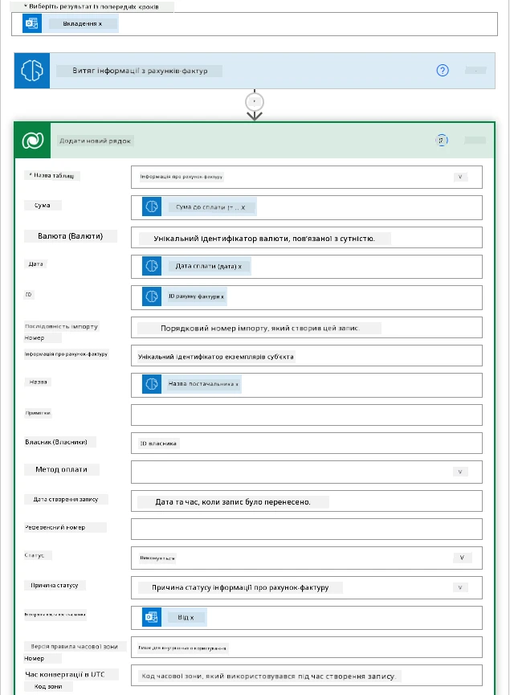

12. Коли ви закінчите з потоком, натисніть кнопку **Зберегти**, щоб зберегти потік. Потім ви можете протестувати потік, надіславши лист з рахунком у вказану папку.

> **Ваше домашнє завдання**: Створений вами потік — хороший початок, тепер подумайте, як створити автоматизацію, яка дозволить нашій фінансовій команді надсилати електронний лист постачальнику з оновленням поточного статусу їхнього рахунку. Підказка: потік має запускатися, коли статус рахунку змінюється.

## Використання AI Моделі генерації тексту в Power Automate

Модель AI Builder «Створити текст за допомогою GPT» дозволяє генерувати текст на основі запиту і працює на базі Microsoft Azure OpenAI Service. З цією функцією ви можете інтегрувати технологію GPT (Generative Pre-Trained Transformer) у свої додатки та потоки, щоб створювати різноманітні автоматизовані процеси та інформативні додатки.

Моделі GPT проходять широке навчання на величезних обсягах даних, що дозволяє їм створювати текст, дуже схожий на людську мову, на основі запиту. Коли інтегровані з автоматизацією робочих процесів, AI-моделі, такі як GPT, можуть бути використані для спрощення та автоматизації широкого спектру завдань.

Наприклад, ви можете створювати потоки для автоматичного генерування тексту для різних випадків, таких як: чернетки електронних листів, описи продуктів тощо. Ви також можете використовувати модель для генерації тексту у різних додатках, таких як чат-боти та додатки обслуговування клієнтів, які дозволяють агентам ефективно й оперативно відповідати на запити клієнтів.

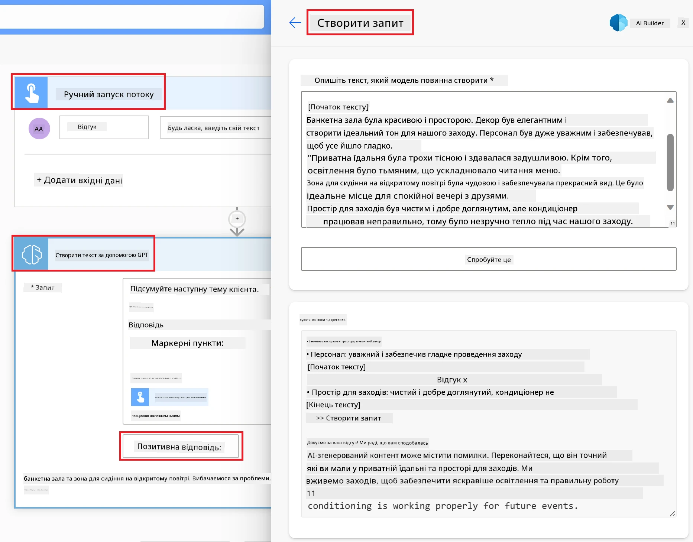

Щоб дізнатися, як використовувати цю модель штучного інтелекту у Power Automate, перегляньте модуль [Додайте інтелект за допомогою AI Builder і GPT](https://learn.microsoft.com/training/modules/ai-builder-text-generation/?WT.mc_id=academic-109639-somelezediko).

## Відмінна робота! Продовжуйте навчання

Після завершення цього уроку ознайомтеся з нашою [колекцією навчання генеративного ШІ](https://aka.ms/genai-collection?WT.mc_id=academic-105485-koreyst), щоб продовжити підвищення своїх знань з генеративного ШІ!

Хочете налаштувати та отримати більше від Copilot? Дослідіть [Awesome Copilot](https://github.com/github/awesome-copilot?WT.mc_id=academic-105485-koreyst) — колекцію інструкцій, агентів, навичок та конфігурацій, створену спільнотою, щоб допомогти вам максимально ефективно використовувати GitHub Copilot.

Перейдіть до Уроку 11, де ми розглянемо, як [інтегрувати генеративний ШІ з викликом функцій](../11-integrating-with-function-calling/README.md?WT.mc_id=academic-105485-koreyst)!

---

<!-- CO-OP TRANSLATOR DISCLAIMER START -->
**Відмова від відповідальності**:
Цей документ було перекладено за допомогою сервісу штучного інтелекту для перекладу [Co-op Translator](https://github.com/Azure/co-op-translator). Хоча ми прагнемо до точності, будь ласка, майте на увазі, що автоматичні переклади можуть містити помилки або неточності. Оригінальний документ рідною мовою слід вважати авторитетним джерелом. Для критично важливої інформації рекомендується професійний людський переклад. Ми не несемо відповідальності за будь-які непорозуміння або неправильні тлумачення, що виникли внаслідок використання цього перекладу.
<!-- CO-OP TRANSLATOR DISCLAIMER END -->