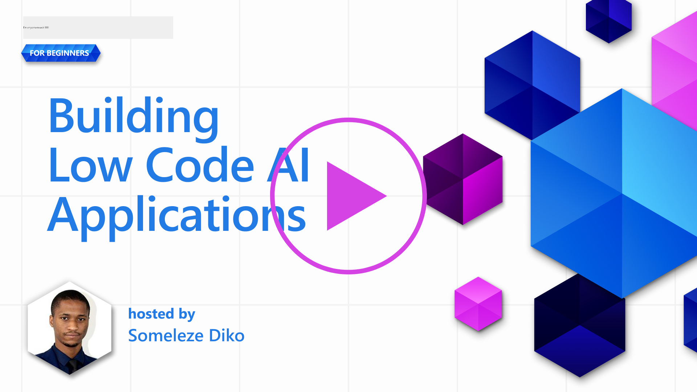
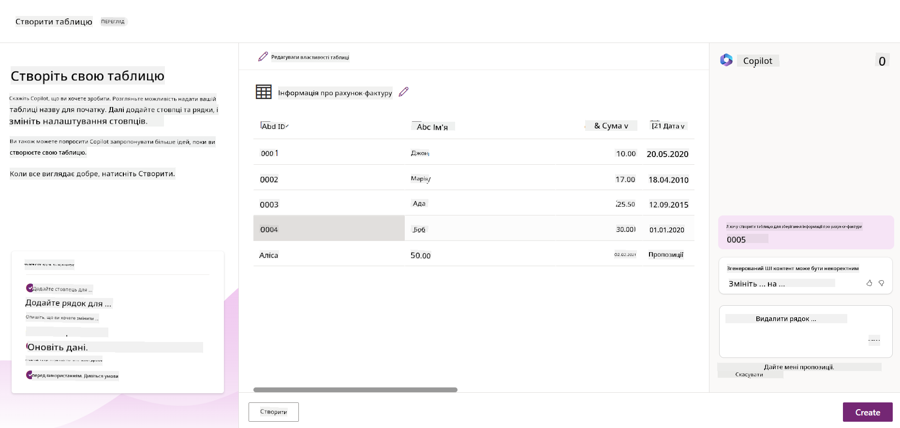
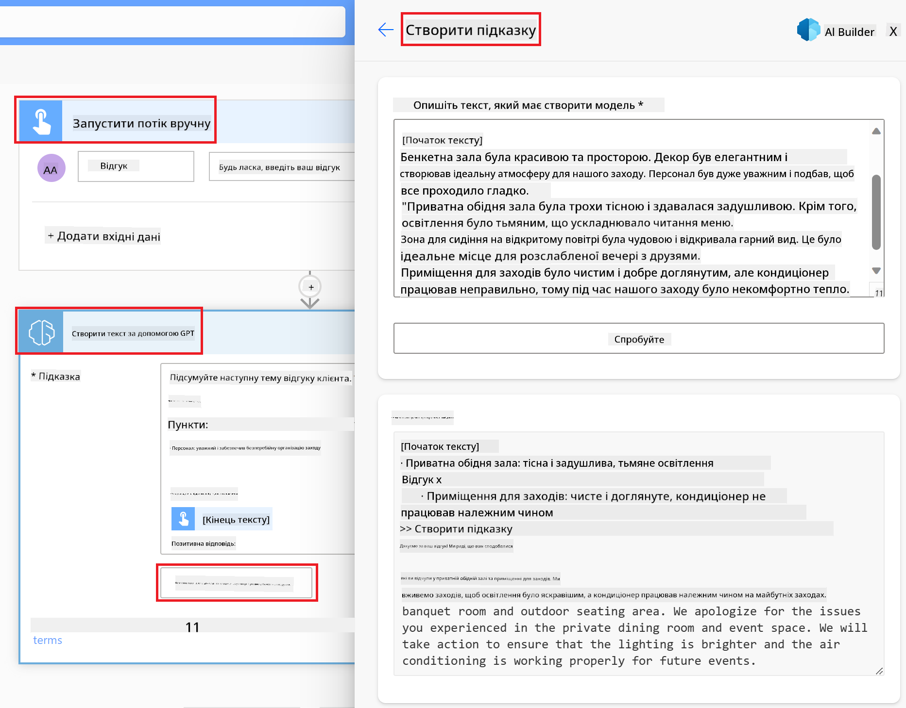

<!--
CO_OP_TRANSLATOR_METADATA:
{
  "original_hash": "846ac8e3b7dcfb697d3309fec05f0fea",
  "translation_date": "2025-10-18T02:15:51+00:00",
  "source_file": "10-building-low-code-ai-applications/README.md",
  "language_code": "uk"
}
-->
# Створення AI-додатків з низьким рівнем кодування

> _(Натисніть на зображення вище, щоб переглянути відео цього уроку)_

## Вступ

Тепер, коли ми навчилися створювати додатки для генерації зображень, поговоримо про низький рівень кодування. Генеративний AI може бути використаний у різних сферах, включаючи низький рівень кодування, але що це таке і як ми можемо додати AI до нього?

Створення додатків і рішень стало простішим для традиційних розробників і тих, хто не є розробниками, завдяки платформам розробки з низьким рівнем кодування. Платформи розробки з низьким рівнем кодування дозволяють створювати додатки та рішення з мінімальним або взагалі без використання коду. Це досягається завдяки наданню візуального середовища розробки, яке дозволяє перетягувати компоненти для створення додатків і рішень. Це дозволяє створювати додатки та рішення швидше і з меншими ресурсами. У цьому уроці ми детально розглянемо, як використовувати низький рівень кодування і як покращити розробку з низьким рівнем кодування за допомогою AI, використовуючи Power Platform.

Power Platform надає організаціям можливість розширити можливості своїх команд для створення власних рішень через інтуїтивно зрозуміле середовище з низьким або без кодування. Це середовище допомагає спростити процес створення рішень. З Power Platform рішення можуть бути створені за дні або тижні, а не за місяці чи роки. Power Platform складається з п'яти ключових продуктів: Power Apps, Power Automate, Power BI, Power Pages і Copilot Studio.

Цей урок охоплює:

- Вступ до генеративного AI у Power Platform
- Вступ до Copilot і як його використовувати
- Використання генеративного AI для створення додатків і потоків у Power Platform
- Розуміння AI-моделей у Power Platform за допомогою AI Builder

## Цілі навчання

До кінця цього уроку ви зможете:

- Зрозуміти, як працює Copilot у Power Platform.

- Створити додаток для відстеження завдань студентів для нашого освітнього стартапу.

- Створити потік обробки рахунків, який використовує AI для вилучення інформації з рахунків.

- Застосовувати найкращі практики при використанні моделі Create Text with GPT AI.

Інструменти та технології, які ви будете використовувати в цьому уроці:

- **Power Apps** для додатку відстеження завдань студентів, який забезпечує середовище розробки з низьким рівнем кодування для створення додатків для відстеження, управління та взаємодії з даними.

- **Dataverse** для зберігання даних додатку відстеження завдань студентів, де Dataverse забезпечить платформу даних з низьким рівнем кодування для зберігання даних додатку.

- **Power Automate** для потоку обробки рахунків, де ви будете мати середовище розробки з низьким рівнем кодування для створення робочих потоків для автоматизації процесу обробки рахунків.

- **AI Builder** для AI-моделі обробки рахунків, де ви будете використовувати попередньо створені AI-моделі для обробки рахунків для нашого стартапу.

## Генеративний AI у Power Platform

Покращення розробки з низьким рівнем кодування та додатків за допомогою генеративного AI є ключовою сферою уваги для Power Platform. Мета полягає в тому, щоб дозволити кожному створювати додатки, сайти, інформаційні панелі та автоматизувати процеси з AI, _без необхідності знань у галузі науки про дані_. Ця мета досягається шляхом інтеграції генеративного AI у середовище розробки з низьким рівнем кодування в Power Platform у вигляді Copilot і AI Builder.

### Як це працює?

Copilot — це AI-асистент, який дозволяє створювати рішення Power Platform, описуючи ваші вимоги у серії розмовних кроків, використовуючи природну мову. Наприклад, ви можете інструктувати вашого AI-асистента, вказуючи, які поля ваш додаток буде використовувати, і він створить як додаток, так і підлеглу модель даних, або ви можете вказати, як налаштувати потік у Power Automate.

Ви можете використовувати функції, керовані Copilot, як функцію на екранах вашого додатку, щоб дозволити користувачам отримувати інсайти через розмовні взаємодії.

AI Builder — це можливість AI з низьким рівнем кодування, доступна в Power Platform, яка дозволяє використовувати AI-моделі для автоматизації процесів і прогнозування результатів. З AI Builder ви можете додати AI до ваших додатків і потоків, які підключаються до ваших даних у Dataverse або в різних хмарних джерелах даних, таких як SharePoint, OneDrive або Azure.

Copilot доступний у всіх продуктах Power Platform: Power Apps, Power Automate, Power BI, Power Pages і Power Virtual Agents. AI Builder доступний у Power Apps і Power Automate. У цьому уроці ми зосередимося на тому, як використовувати Copilot і AI Builder у Power Apps і Power Automate для створення рішення для нашого освітнього стартапу.

### Copilot у Power Apps

Як частина Power Platform, Power Apps забезпечує середовище розробки з низьким рівнем кодування для створення додатків для відстеження, управління та взаємодії з даними. Це набір послуг для розробки додатків зі масштабованою платформою даних і можливістю підключення до хмарних сервісів і локальних даних. Power Apps дозволяє створювати додатки, які працюють у браузерах, на планшетах і телефонах, і можуть бути поділені з колегами. Power Apps спрощує користувачам процес розробки додатків через простий інтерфейс, щоб кожен бізнес-користувач або професійний розробник міг створювати власні додатки. Досвід розробки додатків також покращується за допомогою генеративного AI через Copilot.

Функція AI-асистента Copilot у Power Apps дозволяє описати, який додаток вам потрібен і яку інформацію ви хочете, щоб ваш додаток відстежував, збирав або показував. Copilot потім генерує адаптивний Canvas-додаток на основі вашого опису. Ви можете налаштувати додаток відповідно до ваших потреб. AI Copilot також генерує і пропонує таблицю Dataverse з полями, які вам потрібні для зберігання даних, які ви хочете відстежувати, і деякими зразками даних. Ми розглянемо, що таке Dataverse і як ви можете використовувати його в Power Apps у цьому уроці пізніше. Ви можете налаштувати таблицю відповідно до ваших потреб, використовуючи функцію AI Copilot через розмовні кроки. Ця функція доступна прямо з головного екрану Power Apps.

### Copilot у Power Automate

Як частина Power Platform, Power Automate дозволяє користувачам створювати автоматизовані робочі потоки між додатками та сервісами. Він допомагає автоматизувати повторювані бізнес-процеси, такі як комунікація, збір даних і затвердження рішень. Його простий інтерфейс дозволяє користувачам з будь-яким рівнем технічної компетенції (від початківців до досвідчених розробників) автоматизувати робочі завдання. Досвід розробки робочих потоків також покращується за допомогою генеративного AI через Copilot.

Функція AI-асистента Copilot у Power Automate дозволяє описати, який потік вам потрібен і які дії ви хочете, щоб ваш потік виконував. Copilot потім генерує потік на основі вашого опису. Ви можете налаштувати потік відповідно до ваших потреб. AI Copilot також генерує і пропонує дії, які вам потрібні для виконання завдання, яке ви хочете автоматизувати. Ми розглянемо, що таке потоки і як ви можете використовувати їх у Power Automate у цьому уроці пізніше. Ви можете налаштувати дії відповідно до ваших потреб, використовуючи функцію AI Copilot через розмовні кроки. Ця функція доступна прямо з головного екрану Power Automate.

## Завдання: Управління завданнями студентів і рахунками для нашого стартапу за допомогою Copilot

Наш стартап надає онлайн-курси для студентів. Стартап швидко розвивається і зараз стикається з труднощами у задоволенні попиту на свої курси. Стартап найняв вас як розробника Power Platform, щоб допомогти їм створити рішення з низьким рівнем кодування для управління завданнями студентів і рахунками. Рішення має допомогти їм відстежувати та управляти завданнями студентів через додаток і автоматизувати процес обробки рахунків через робочий потік. Вас попросили використати генеративний AI для розробки рішення.

Коли ви починаєте працювати з Copilot, ви можете скористатися [бібліотекою підказок Power Platform Copilot](https://github.com/pnp/powerplatform-prompts?WT.mc_id=academic-109639-somelezediko), щоб почати роботу з підказками. Ця бібліотека містить список підказок, які ви можете використовувати для створення додатків і потоків за допомогою Copilot. Ви також можете використовувати підказки з бібліотеки, щоб отримати уявлення про те, як описати ваші вимоги Copilot.

### Створення додатку для відстеження завдань студентів для нашого стартапу

Викладачі нашого стартапу стикаються з труднощами у відстеженні завдань студентів. Вони використовували електронні таблиці для відстеження завдань, але це стало складно управляти, оскільки кількість студентів збільшилася. Вони попросили вас створити додаток, який допоможе їм відстежувати та управляти завданнями студентів. Додаток має дозволяти додавати нові завдання, переглядати завдання, оновлювати завдання та видаляти завдання. Додаток також має дозволяти викладачам і студентам переглядати завдання, які були оцінені, і ті, які ще не оцінені.

Ви створите додаток за допомогою Copilot у Power Apps, виконуючи наступні кроки:

1. Перейдіть на головний екран [Power Apps](https://make.powerapps.com?WT.mc_id=academic-105485-koreyst).

1. Використовуйте текстове поле на головному екрані, щоб описати додаток, який ви хочете створити. Наприклад, **_Я хочу створити додаток для відстеження та управління завданнями студентів_**. Натисніть кнопку **Надіслати**, щоб надіслати підказку AI Copilot.

1. AI Copilot запропонує таблицю Dataverse з полями, які вам потрібні для зберігання даних, які ви хочете відстежувати, і деякими зразками даних. Ви можете налаштувати таблицю відповідно до ваших потреб, використовуючи функцію AI Copilot через розмовні кроки.

   > **Важливо**: Dataverse — це основна платформа даних для Power Platform. Це платформа даних з низьким рівнем кодування для зберігання даних додатку. Це повністю керована служба, яка безпечно зберігає дані в хмарі Microsoft і надається у вашому середовищі Power Platform. Вона має вбудовані можливості управління даними, такі як класифікація даних, походження даних, детальний контроль доступу тощо. Ви можете дізнатися більше про Dataverse [тут](https://docs.microsoft.com/powerapps/maker/data-platform/data-platform-intro?WT.mc_id=academic-109639-somelezediko).

   

1. Викладачі хочуть надсилати електронні листи студентам, які подали свої завдання, щоб тримати їх у курсі щодо прогресу їхніх завдань. Ви можете використовувати Copilot, щоб додати нове поле до таблиці для зберігання електронної пошти студента. Наприклад, ви можете використати наступну підказку, щоб додати нове поле до таблиці: **_Я хочу додати стовпець для зберігання електронної пошти студента_**. Натисніть кнопку **Надіслати**, щоб надіслати підказку AI Copilot.

1. AI Copilot створить нове поле, і ви зможете налаштувати його відповідно до ваших потреб.

1. Коли ви закінчите з таблицею, натисніть кнопку **Створити додаток**, щоб створити додаток.

1. AI Copilot створить адаптивний Canvas-додаток на основі вашого опису. Ви можете налаштувати додаток відповідно до ваших потреб.

1. Щоб викладачі могли надсилати електронні листи студентам, ви можете використовувати Copilot, щоб додати новий екран до додатку. Наприклад, ви можете використати наступну підказку, щоб додати новий екран до додатку: **_Я хочу додати екран для надсилання електронних листів студентам_**. Натисніть кнопку **Надіслати**, щоб надіслати підказку AI Copilot.

1. AI Copilot створить новий екран, і ви зможете налаштувати екран відповідно до ваших потреб.

1. Коли ви закінчите з додатком, натисніть кнопку **Зберегти**, щоб зберегти додаток.

1. Щоб поділитися додатком з викладачами, натисніть кнопку **Поділитися**, а потім знову натисніть кнопку **Поділитися**. Ви можете поділитися додатком з викладачами, ввівши їхні електронні адреси.

> **Ваше домашнє завдання**: Додаток, який ви щойно створили, є гарним початком, але його можна вдосконалити. З функцією електронної пошти викладачі можуть надсилати електронні листи студентам лише вручну, вводячи їхні адреси. Чи можете ви використати Copilot, щоб створити автоматизацію, яка дозволить викладачам автоматично надсилати електронні листи студентам, коли вони подають свої завдання? Підказка: за допомогою правильної підказки ви можете використати Copilot у Power Automate для створення цього.

### Створення таблиці інформації про рахунки для нашого стартапу

Фінансова команда нашого стартапу стикається з труднощами у відстеженні рахунків. Вони використовували електронні таблиці для відстеження рахунків, але це стало складно управляти, оскільки кількість рахунків збільшилася. Вони попросили вас створити таблицю, яка допоможе їм зберігати, відстежувати та управляти інформацією про отримані рахунки. Таблиця має бути використана для створення автоматизації, яка буде вилучати всю інформацію про рахунки і зберігати її в таблиці. Таблиця також має дозволяти фінансовій команді переглядати рахунки, які були оплачені, і ті, які ще не були оплачені.

Power Platform має основну платформу даних під назвою Dataverse, яка дозволяє зберіг
Чому варто використовувати Dataverse для нашого стартапу? Стандартні та користувацькі таблиці в Dataverse забезпечують безпечне та хмарне сховище для ваших даних. Таблиці дозволяють зберігати різні типи даних, подібно до того, як ви могли б використовувати кілька аркушів в одному Excel-файлі. Ви можете використовувати таблиці для зберігання даних, які відповідають потребам вашої організації або бізнесу. Деякі переваги, які наш стартап отримає від використання Dataverse, включають, але не обмежуються:

- **Легкість управління**: Метадані та дані зберігаються в хмарі, тому вам не потрібно турбуватися про деталі їх зберігання або управління. Ви можете зосередитися на створенні своїх додатків і рішень.

- **Безпека**: Dataverse забезпечує безпечне та хмарне сховище для ваших даних. Ви можете контролювати, хто має доступ до даних у ваших таблицях і як вони можуть отримувати доступ, використовуючи рольову безпеку.

- **Багаті метадані**: Типи даних і зв’язки використовуються безпосередньо в Power Apps.

- **Логіка та перевірка**: Ви можете використовувати бізнес-правила, обчислювані поля та правила перевірки для забезпечення бізнес-логіки та підтримання точності даних.

Тепер, коли ви знаєте, що таке Dataverse і чому його варто використовувати, давайте розглянемо, як ви можете використовувати Copilot для створення таблиці в Dataverse, щоб задовольнити вимоги нашої фінансової команди.

> **Примітка**: Ви будете використовувати цю таблицю в наступному розділі для створення автоматизації, яка витягне всю інформацію про рахунки-фактури та збереже її в таблиці.

Щоб створити таблицю в Dataverse за допомогою Copilot, виконайте наступні кроки:

1. Перейдіть на головну сторінку [Power Apps](https://make.powerapps.com?WT.mc_id=academic-105485-koreyst).

2. У лівій панелі навігації виберіть **Tables**, а потім натисніть **Describe the new Table**.

3. На екрані **Describe the new Table** використовуйте текстове поле, щоб описати таблицю, яку ви хочете створити. Наприклад, **_Я хочу створити таблицю для зберігання інформації про рахунки-фактури_**. Натисніть кнопку **Send**, щоб надіслати запит AI Copilot.

4. AI Copilot запропонує таблицю Dataverse з полями, які вам потрібні для зберігання даних, які ви хочете відстежувати, і зразковими даними. Ви можете налаштувати таблицю відповідно до ваших потреб за допомогою функції помічника AI Copilot через розмовні кроки.

5. Фінансова команда хоче надіслати електронний лист постачальнику, щоб оновити його щодо поточного статусу його рахунку-фактури. Ви можете використовувати Copilot, щоб додати нове поле до таблиці для зберігання електронної адреси постачальника. Наприклад, ви можете використати наступний запит, щоб додати нове поле до таблиці: **_Я хочу додати колонку для зберігання електронної адреси постачальника_**. Натисніть кнопку **Send**, щоб надіслати запит AI Copilot.

6. AI Copilot створить нове поле, і ви зможете налаштувати його відповідно до ваших потреб.

7. Коли ви закінчите з таблицею, натисніть кнопку **Create**, щоб створити таблицю.

## Моделі AI у Power Platform з AI Builder

AI Builder — це можливість штучного інтелекту з низьким рівнем кодування, доступна в Power Platform, яка дозволяє використовувати моделі AI для автоматизації процесів і прогнозування результатів. Завдяки AI Builder ви можете інтегрувати штучний інтелект у свої додатки та потоки, які підключаються до ваших даних у Dataverse або в різних хмарних джерелах даних, таких як SharePoint, OneDrive або Azure.

## Попередньо створені моделі AI проти користувацьких моделей AI

AI Builder пропонує два типи моделей AI: попередньо створені моделі AI та користувацькі моделі AI. Попередньо створені моделі AI — це готові до використання моделі, які були навчені Microsoft і доступні в Power Platform. Вони допомагають додати інтелект до ваших додатків і потоків без необхідності збирати дані, а потім створювати, навчати та публікувати власні моделі. Ви можете використовувати ці моделі для автоматизації процесів і прогнозування результатів.

Деякі з попередньо створених моделей AI, доступних у Power Platform, включають:

- **Виділення ключових фраз**: Ця модель виділяє ключові фрази з тексту.
- **Визначення мови**: Ця модель визначає мову тексту.
- **Аналіз настрою**: Ця модель визначає позитивний, негативний, нейтральний або змішаний настрій у тексті.
- **Сканер візитних карток**: Ця модель витягує інформацію з візитних карток.
- **Розпізнавання тексту**: Ця модель витягує текст із зображень.
- **Розпізнавання об’єктів**: Ця модель розпізнає та витягує об’єкти із зображень.
- **Обробка документів**: Ця модель витягує інформацію з форм.
- **Обробка рахунків-фактур**: Ця модель витягує інформацію з рахунків-фактур.

З користувацькими моделями AI ви можете інтегрувати власну модель в AI Builder, щоб вона функціонувала як будь-яка користувацька модель AI Builder, дозволяючи вам навчати модель, використовуючи власні дані. Ви можете використовувати ці моделі для автоматизації процесів і прогнозування результатів як у Power Apps, так і в Power Automate. При використанні власної моделі існують обмеження. Детальніше про ці [обмеження](https://learn.microsoft.com/ai-builder/byo-model#limitations?WT.mc_id=academic-105485-koreyst).

## Завдання №2 - Створення потоку обробки рахунків-фактур для нашого стартапу

Фінансова команда стикається з труднощами в обробці рахунків-фактур. Вони використовували електронні таблиці для відстеження рахунків-фактур, але це стало складно управляти через збільшення їх кількості. Вони попросили вас створити робочий процес, який допоможе їм обробляти рахунки-фактури за допомогою AI. Робочий процес повинен дозволяти їм витягувати інформацію з рахунків-фактур і зберігати її в таблиці Dataverse. Робочий процес також повинен дозволяти надсилати електронний лист фінансовій команді з витягнутою інформацією.

Тепер, коли ви знаєте, що таке AI Builder і чому його варто використовувати, давайте розглянемо, як ви можете використовувати модель AI для обробки рахунків-фактур в AI Builder, яку ми розглядали раніше, щоб створити робочий процес, який допоможе фінансовій команді обробляти рахунки-фактури.

Щоб створити робочий процес, який допоможе фінансовій команді обробляти рахунки-фактури за допомогою моделі AI для обробки рахунків-фактур в AI Builder, виконайте наступні кроки:

1. Перейдіть на головну сторінку [Power Automate](https://make.powerautomate.com?WT.mc_id=academic-105485-koreyst).

2. Використовуйте текстове поле на головній сторінці, щоб описати робочий процес, який ви хочете створити. Наприклад, **_Обробити рахунок-фактуру, коли вона надходить у мою поштову скриньку_**. Натисніть кнопку **Send**, щоб надіслати запит AI Copilot.

   

3. AI Copilot запропонує дії, необхідні для виконання завдання, яке ви хочете автоматизувати. Ви можете натиснути кнопку **Next**, щоб перейти до наступних кроків.

4. На наступному етапі Power Automate запропонує вам налаштувати з’єднання, необхідні для потоку. Коли ви закінчите, натисніть кнопку **Create flow**, щоб створити потік.

5. AI Copilot створить потік, і ви зможете налаштувати його відповідно до ваших потреб.

6. Оновіть тригер потоку та встановіть **Folder** на папку, де будуть зберігатися рахунки-фактури. Наприклад, ви можете встановити папку на **Inbox**. Натисніть **Show advanced options** і встановіть **Only with Attachments** на **Yes**. Це забезпечить запуск потоку лише тоді, коли в папці буде отримано електронний лист із вкладенням.

7. Видаліть наступні дії з потоку: **HTML to text**, **Compose**, **Compose 2**, **Compose 3** і **Compose 4**, оскільки ви їх не використовуватимете.

8. Видаліть дію **Condition** з потоку, оскільки ви її не використовуватимете. Потік повинен виглядати, як на наступному скріншоті:

   

9. Натисніть кнопку **Add an action** і знайдіть **Dataverse**. Виберіть дію **Add a new row**.

10. У дії **Extract Information from invoices** оновіть **Invoice File**, щоб вказати на **Attachment Content** з електронного листа. Це забезпечить витягування інформації з вкладення рахунку-фактури.

11. Виберіть таблицю, яку ви створили раніше. Наприклад, ви можете вибрати таблицю **Invoice Information**. Виберіть динамічний вміст із попередньої дії, щоб заповнити наступні поля:

    - ID
    - Amount
    - Date
    - Name
    - Status - Встановіть **Status** на **Pending**.
    - Supplier Email - Використовуйте **From** динамічний вміст із тригера **When a new email arrives**.

    

12. Коли ви закінчите з потоком, натисніть кнопку **Save**, щоб зберегти потік. Потім ви можете протестувати потік, надіславши електронний лист із рахунком-фактурою до папки, яку ви вказали в тригері.

> **Ваше домашнє завдання**: Потік, який ви щойно створили, є хорошим початком, тепер вам потрібно подумати, як ви можете створити автоматизацію, яка дозволить нашій фінансовій команді надсилати електронний лист постачальнику, щоб оновити його щодо поточного статусу його рахунку-фактури. Підказка: потік має запускатися, коли змінюється статус рахунку-фактури.

## Використання моделі AI для генерації тексту в Power Automate

Модель Create Text with GPT AI в AI Builder дозволяє генерувати текст на основі запиту та працює на основі Microsoft Azure OpenAI Service. Завдяки цій можливості ви можете інтегрувати технологію GPT (Generative Pre-Trained Transformer) у свої додатки та потоки, щоб створювати різноманітні автоматизовані потоки та інформативні додатки.

Моделі GPT проходять інтенсивне навчання на величезних обсягах даних, що дозволяє їм створювати текст, який дуже схожий на людську мову, коли їм надається запит. При інтеграції з автоматизацією робочих процесів моделі AI, такі як GPT, можуть бути використані для оптимізації та автоматизації широкого спектру завдань.

Наприклад, ви можете створювати потоки для автоматичного генерування тексту для різних випадків використання, таких як: чернетки електронних листів, описи продуктів тощо. Ви також можете використовувати модель для створення тексту для різних додатків, таких як чат-боти та додатки для обслуговування клієнтів, які дозволяють агентам обслуговування клієнтів ефективно та оперативно відповідати на запити клієнтів.

Щоб дізнатися, як використовувати цю модель AI в Power Automate, ознайомтеся з модулем [Add intelligence with AI Builder and GPT](https://learn.microsoft.com/training/modules/ai-builder-text-generation/?WT.mc_id=academic-109639-somelezediko).

## Чудова робота! Продовжуйте навчання

Після завершення цього уроку ознайомтеся з нашою [колекцією навчальних матеріалів про генеративний AI](https://aka.ms/genai-collection?WT.mc_id=academic-105485-koreyst), щоб продовжити вдосконалювати свої знання про генеративний AI!

Перейдіть до уроку 11, де ми розглянемо, як [інтегрувати генеративний AI із викликом функцій](../11-integrating-with-function-calling/README.md?WT.mc_id=academic-105485-koreyst)!

---

**Відмова від відповідальності**:  
Цей документ був перекладений за допомогою сервісу автоматичного перекладу [Co-op Translator](https://github.com/Azure/co-op-translator). Хоча ми прагнемо до точності, будь ласка, майте на увазі, що автоматичні переклади можуть містити помилки або неточності. Оригінальний документ на його рідній мові слід вважати авторитетним джерелом. Для критичної інформації рекомендується професійний людський переклад. Ми не несемо відповідальності за будь-які непорозуміння або неправильні тлумачення, що виникають внаслідок використання цього перекладу.