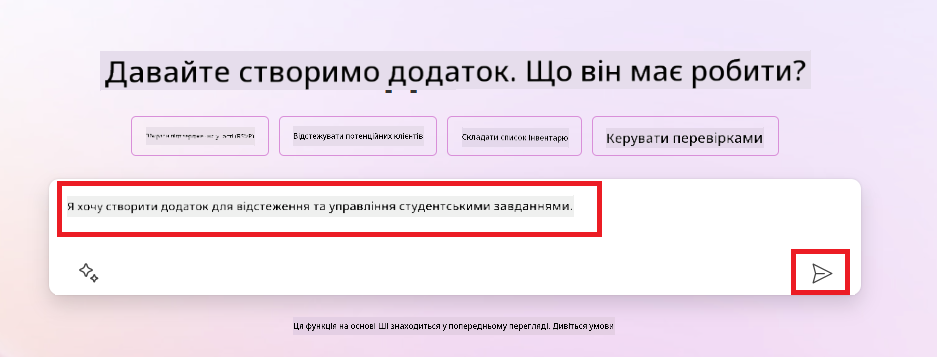
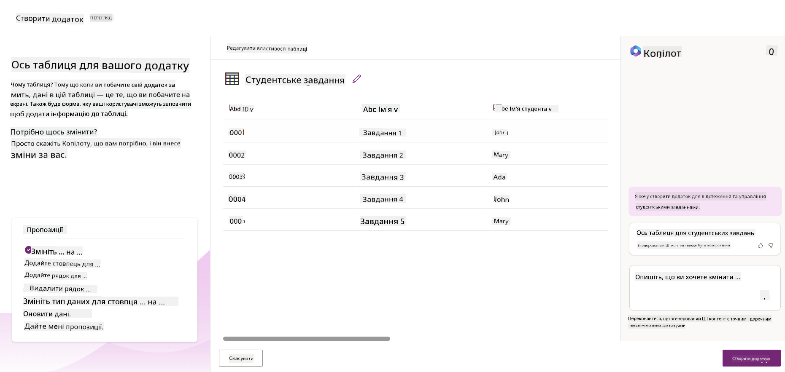
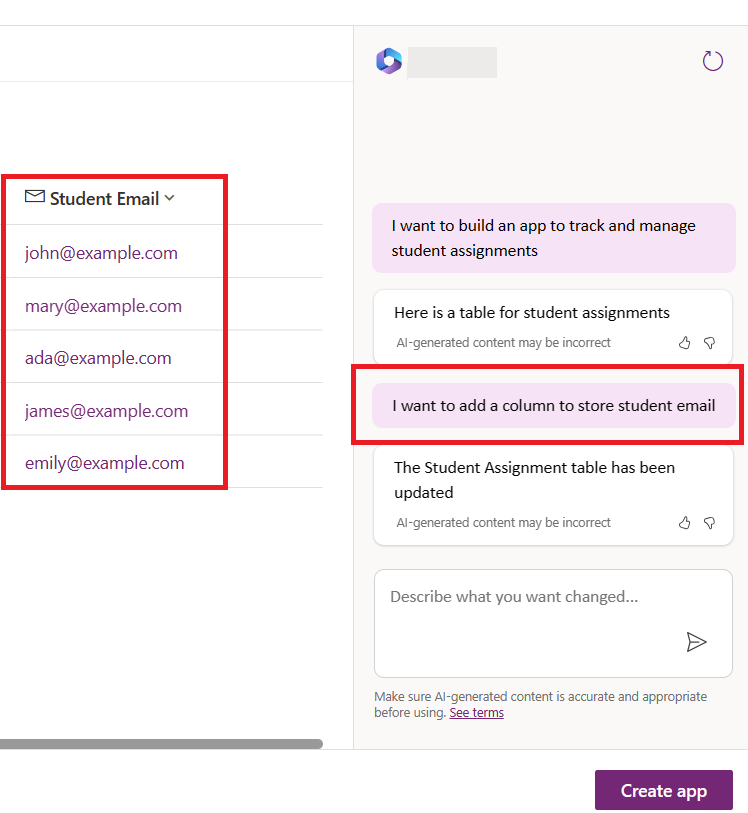
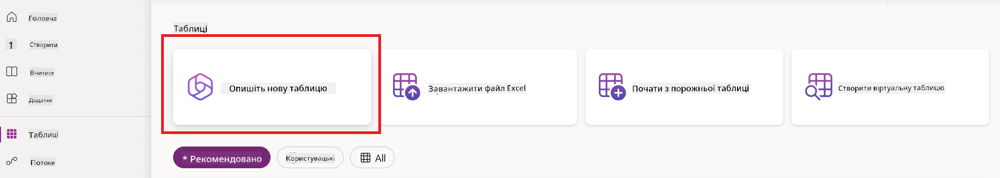
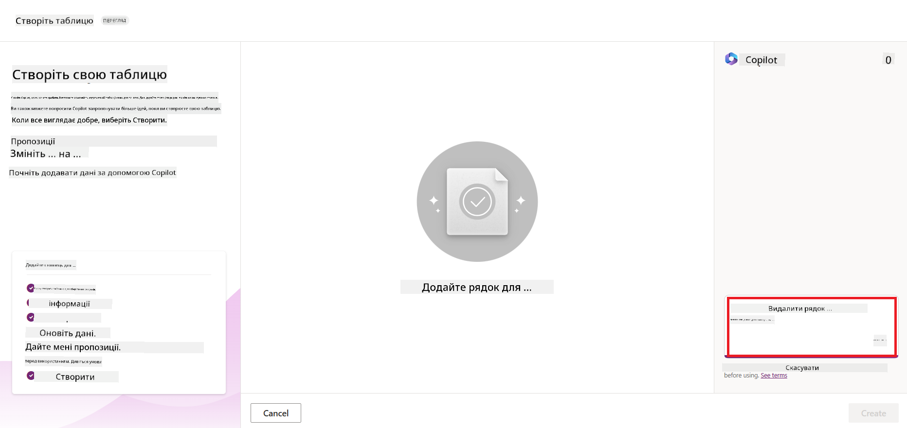
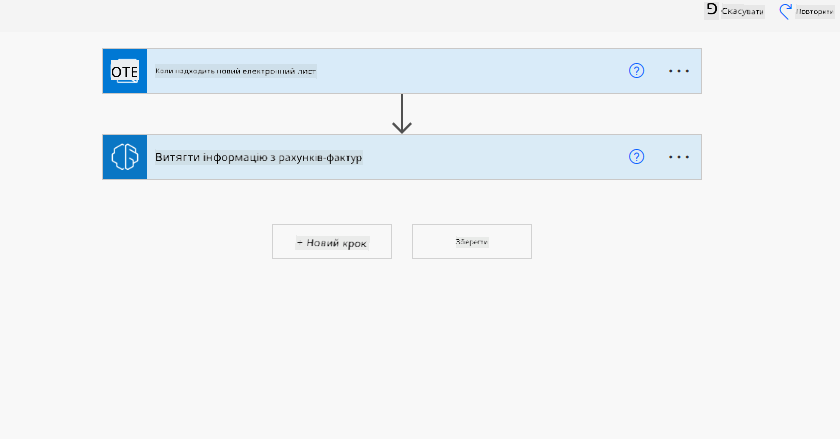
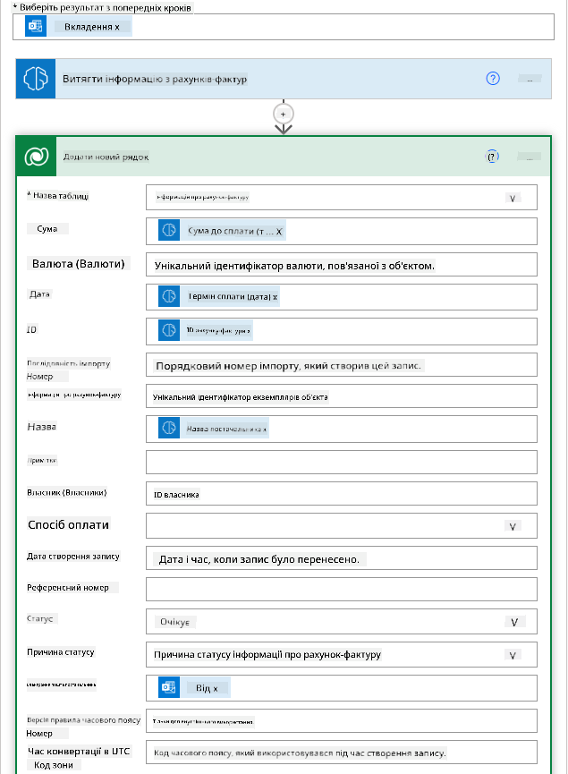

<!--
CO_OP_TRANSLATOR_METADATA:
{
  "original_hash": "f5ff3b6204a695a117d6f452403c95f7",
  "translation_date": "2025-07-09T14:20:05+00:00",
  "source_file": "10-building-low-code-ai-applications/README.md",
  "language_code": "uk"
}
-->
# Створення AI-додатків з низьким рівнем кодування

> _(Натисніть на зображення вище, щоб переглянути відео цього уроку)_

## Вступ

Тепер, коли ми навчилися створювати додатки для генерації зображень, поговоримо про low code. Генеративний AI можна застосовувати у різних сферах, зокрема у low code, але що таке low code і як додати до нього AI?

Створення додатків і рішень стало простішим як для традиційних розробників, так і для користувачів без досвіду програмування завдяки платформам Low Code Development. Ці платформи дозволяють створювати додатки та рішення з мінімальним або без коду. Це досягається за рахунок візуального середовища розробки, де можна перетягувати компоненти для створення додатків і рішень. Це дозволяє розробляти швидше і з меншими ресурсами. У цьому уроці ми детально розглянемо, як використовувати Low Code і як покращити розробку з низьким рівнем коду за допомогою AI на базі Power Platform.

Power Platform дає організаціям можливість надати своїм командам інструменти для створення власних рішень у зручному середовищі low-code або no-code. Це середовище спрощує процес розробки рішень. Завдяки Power Platform рішення можна створювати за дні або тижні замість місяців чи років. Power Platform складається з п’яти ключових продуктів: Power Apps, Power Automate, Power BI, Power Pages та Copilot Studio.

У цьому уроці розглядаються:

- Вступ до генеративного AI у Power Platform
- Вступ до Copilot та як ним користуватися
- Використання генеративного AI для створення додатків і потоків у Power Platform
- Розуміння AI-моделей у Power Platform за допомогою AI Builder

## Цілі навчання

Після завершення цього уроку ви зможете:

- Зрозуміти, як працює Copilot у Power Platform.

- Створити додаток для відстеження студентських завдань для нашого освітнього стартапу.

- Створити потік обробки рахунків, який використовує AI для вилучення інформації з рахунків.

- Застосовувати найкращі практики при використанні моделі Create Text з GPT AI.

Інструменти та технології, які ви використовуватимете в цьому уроці:

- **Power Apps** — для додатку Student Assignment Tracker, що надає середовище low-code для створення додатків для відстеження, управління та взаємодії з даними.

- **Dataverse** — для зберігання даних додатку Student Assignment Tracker, де Dataverse забезпечує платформу low-code для зберігання даних додатку.

- **Power Automate** — для потоку обробки рахунків, де ви матимете середовище low-code для створення робочих процесів автоматизації обробки рахунків.

- **AI Builder** — для AI-моделі обробки рахунків, де ви використовуватимете готові AI-моделі для обробки рахунків нашого стартапу.

## Генеративний AI у Power Platform

Покращення розробки з низьким рівнем коду та застосування додатків за допомогою генеративного AI — ключовий напрямок Power Platform. Мета — дати змогу кожному створювати додатки, сайти, панелі керування та автоматизувати процеси з AI, _не потребуючи експертизи в галузі науки про дані_. Цього досягають шляхом інтеграції генеративного AI у досвід розробки low-code у Power Platform у вигляді Copilot та AI Builder.

### Як це працює?

Copilot — це AI-помічник, який допомагає створювати рішення Power Platform, описуючи ваші вимоги у вигляді серії розмовних кроків природною мовою. Наприклад, ви можете вказати AI-помічнику, які поля має використовувати ваш додаток, і він створить як додаток, так і базову модель даних, або ж ви можете описати, як налаштувати потік у Power Automate.

Ви можете використовувати функції, керовані Copilot, як елемент у ваших екранах додатків, щоб користувачі могли отримувати інсайти через розмовні взаємодії.

AI Builder — це можливість low-code AI у Power Platform, яка дозволяє використовувати AI-моделі для автоматизації процесів і прогнозування результатів. За допомогою AI Builder ви можете додати AI у свої додатки та потоки, що підключаються до даних у Dataverse або в різних хмарних джерелах, таких як SharePoint, OneDrive чи Azure.

Copilot доступний у всіх продуктах Power Platform: Power Apps, Power Automate, Power BI, Power Pages та Power Virtual Agents. AI Builder доступний у Power Apps і Power Automate. У цьому уроці ми зосередимося на використанні Copilot та AI Builder у Power Apps і Power Automate для створення рішення для нашого освітнього стартапу.

### Copilot у Power Apps

Як частина Power Platform, Power Apps надає середовище low-code для створення додатків, які відстежують, керують і взаємодіють з даними. Це набір сервісів для розробки додатків із масштабованою платформою даних і можливістю підключення до хмарних сервісів та локальних даних. Power Apps дозволяє створювати додатки, які працюють у браузерах, на планшетах і телефонах, і їх можна ділитися з колегами. Power Apps полегшує користувачам початок розробки додатків завдяки простому інтерфейсу, щоб кожен бізнес-користувач або професійний розробник міг створювати власні додатки. Досвід розробки додатків також покращується завдяки генеративному AI через Copilot.

Функція AI-помічника Copilot у Power Apps дозволяє описати, який додаток вам потрібен і яку інформацію він має відстежувати, збирати або показувати. Copilot генерує адаптивний Canvas-додаток на основі вашого опису. Потім ви можете налаштувати додаток відповідно до своїх потреб. AI Copilot також створює і пропонує таблицю Dataverse з полями, необхідними для зберігання даних, які ви хочете відстежувати, а також деякі зразки даних. Ми розглянемо, що таке Dataverse і як його використовувати у Power Apps пізніше в цьому уроці. Ви можете налаштувати таблицю відповідно до своїх потреб за допомогою AI Copilot через розмовні кроки. Ця функція доступна безпосередньо на головному екрані Power Apps.

### Copilot у Power Automate

Як частина Power Platform, Power Automate дозволяє користувачам створювати автоматизовані робочі процеси між додатками та сервісами. Він допомагає автоматизувати повторювані бізнес-процеси, такі як комунікація, збір даних і затвердження рішень. Простий інтерфейс дозволяє користувачам з будь-яким рівнем технічної підготовки (від початківців до досвідчених розробників) автоматизувати робочі завдання. Досвід розробки робочих процесів також покращується завдяки генеративному AI через Copilot.

Функція AI-помічника Copilot у Power Automate дозволяє описати, який потік вам потрібен і які дії він має виконувати. Copilot генерує потік на основі вашого опису. Потім ви можете налаштувати потік відповідно до своїх потреб. AI Copilot також створює і пропонує дії, необхідні для виконання завдання, яке ви хочете автоматизувати. Ми розглянемо, що таке потоки і як їх використовувати у Power Automate пізніше в цьому уроці. Ви можете налаштувати дії відповідно до своїх потреб за допомогою AI Copilot через розмовні кроки. Ця функція доступна безпосередньо на головному екрані Power Automate.

## Завдання: Керування студентськими завданнями та рахунками для нашого стартапу за допомогою Copilot

Наш стартап надає онлайн-курси студентам. Стартап швидко розвивається і тепер має труднощі з обробкою зростаючого попиту на курси. Вони найняли вас як розробника Power Platform, щоб допомогти створити low code рішення для керування студентськими завданнями та рахунками. Їхнє рішення має допомагати відстежувати і керувати студентськими завданнями через додаток і автоматизувати процес обробки рахунків через робочий процес. Вас попросили використати генеративний AI для розробки цього рішення.

Починаючи роботу з Copilot, ви можете скористатися [Power Platform Copilot Prompt Library](https://github.com/pnp/powerplatform-prompts?WT.mc_id=academic-109639-somelezediko), щоб отримати підказки. Ця бібліотека містить список підказок, які можна використовувати для створення додатків і потоків з Copilot. Ви також можете використати підказки з бібліотеки, щоб зрозуміти, як описувати свої вимоги Copilot.

### Створення додатку Student Assignment Tracker для нашого стартапу

Викладачі нашого стартапу мали труднощі з відстеженням студентських завдань. Вони використовували таблицю для відстеження завдань, але це стало важко керувати через збільшення кількості студентів. Вони попросили вас створити додаток, який допоможе відстежувати і керувати студентськими завданнями. Додаток має дозволяти додавати нові завдання, переглядати, оновлювати та видаляти завдання. Також додаток має дозволяти викладачам і студентам переглядати завдання, які вже оцінені, і ті, що ще не оцінені.

Ви створите додаток за допомогою Copilot у Power Apps, виконавши такі кроки:

1. Перейдіть на [головний екран Power Apps](https://make.powerapps.com?WT.mc_id=academic-105485-koreyst).

2. Використайте текстове поле на головному екрані, щоб описати додаток, який хочете створити. Наприклад, **_Я хочу створити додаток для відстеження і керування студентськими завданнями_**. Натисніть кнопку **Send**, щоб надіслати підказку AI Copilot.

3. AI Copilot запропонує таблицю Dataverse з полями, необхідними для зберігання даних, які ви хочете відстежувати, а також деякі зразки даних. Ви можете налаштувати таблицю відповідно до своїх потреб за допомогою AI Copilot через розмовні кроки.

   > **Важливо**: Dataverse — це базова платформа даних для Power Platform. Це low-code платформа для зберігання даних додатку. Це повністю керована служба, яка безпечно зберігає дані в хмарі Microsoft і розгортається у вашому середовищі Power Platform. Вона має вбудовані можливості управління даними, такі як класифікація даних, відстеження походження даних, тонке керування доступом тощо. Детальніше про Dataverse можна дізнатися [тут](https://docs.microsoft.com/powerapps/maker/data-platform/data-platform-intro?WT.mc_id=academic-109639-somelezediko).

   

4. Викладачі хочуть надсилати електронні листи студентам, які здали завдання, щоб інформувати їх про прогрес. Ви можете використати Copilot, щоб додати нове поле до таблиці для зберігання електронної пошти студента. Наприклад, використайте таку підказку: **_Я хочу додати стовпець для зберігання електронної пошти студента_**. Натисніть кнопку **Send**, щоб надіслати підказку AI Copilot.

5. AI Copilot створить нове поле, і ви зможете налаштувати його відповідно до своїх потреб.

6. Коли таблиця буде готова, натисніть кнопку **Create app**, щоб створити додаток.

7. AI Copilot згенерує адаптивний Canvas-додаток на основі вашого опису. Ви зможете налаштувати додаток відповідно до своїх потреб.

8. Щоб викладачі могли надсилати електронні листи студентам, ви можете використати Copilot, щоб додати новий екран до додатку. Наприклад, використайте таку підказку: **_Я хочу додати екран для надсилання електронних листів студентам_**. Натисніть кнопку **Send**, щоб надіслати підказку AI Copilot.

9. AI Copilot створить новий екран, і ви зможете налаштувати його відповідно до своїх потреб.

10. Коли додаток буде готовий, натисніть кнопку **Save**, щоб зберегти додаток.

11. Щоб поділитися додатком з викладачами, натисніть кнопку **Share**, а потім знову **Share**. Ви зможете поділитися додатком, ввівши їхні електронні адреси.

> **Домашнє завдання**: Створений вами додаток — це хороший початок, але його можна покращити. З функцією електронної пошти викладачі можуть надсилати листи студентам лише вручну, вводячи їхні адреси. Чи можете ви використати Copilot, щоб створити автоматизацію, яка дозволить викладачам надсилати листи студентам автоматично, коли ті здають завдання? Підказка: з правильною підказкою ви можете використати Copilot у Power Automate для цього.

### Створення таблиці інформації про рахунки для нашого стартапу

Фінансова команда нашого стартапу мала труднощі з відстеженням рахунків. Вони використовували таблицю для відстеження рахунків, але це стало важко керувати через збільшення кількості рахунків. Вони попросили вас створити таблицю, яка допоможе зберігати, відстежувати і керувати інформацією про отримані рахунки. Ця таблиця має використовуватися для створення автоматизації, яка вилучатиме всю інформацію з рахунків і зберігатиме її у таблиці. Таблиця також має дозволяти фінансовій команді переглядати рахунки, які вже сплачені, і ті, що ще не сплачені.

Power Platform має базову платформу даних під назвою Dataverse, яка дозволяє зберігати дані для ваших додатків і рішень. Dataverse забезпечує low-code платформу для зберігання даних додатку. Це повністю керована служба, яка безпечно зберігає дані в хмарі Microsoft і розгортається у вашому середовищі Power Platform. Вона має вбудовані можливості управління даними, такі як класифікація даних, відстеження походження даних, тонке керування доступом тощо. Детальніше про Dataverse можна дізнатися [тут](https://docs.microsoft.com/powerapps/maker/data-platform/data-platform-intro?WT.mc_id=academic-109639-somelezediko).

Чому варто використовувати Dataverse для нашого стартапу? Стандартні та користувацькі таблиці в Dataverse забезпечують безпечне хмарне сховище для ваших даних. Таблиці дозволяють зберігати різні типи даних, подібно до того, як ви можете використовувати кілька аркушів у одній книзі Excel. Ви можете використовувати таблиці для зберігання даних, специфічних для вашої організації або бізнес-потреб. Деякі переваги, які наш стартап отримає від використання Dataverse, включають, але не обмежуються:
- **Легко керувати**: Метадані та дані зберігаються в хмарі, тож вам не потрібно турбуватися про те, як саме вони зберігаються чи керуються. Ви можете зосередитися на створенні своїх додатків і рішень.

- **Безпечно**: Dataverse забезпечує безпечне хмарне сховище для ваших даних. Ви можете контролювати, хто має доступ до даних у ваших таблицях і як саме вони можуть їх використовувати, завдяки безпеці на основі ролей.

- **Багаті метадані**: Типи даних і зв’язки використовуються безпосередньо в Power Apps.

- **Логіка та валідація**: Ви можете застосовувати бізнес-правила, обчислювані поля та правила валідації, щоб забезпечити дотримання бізнес-логіки та підтримувати точність даних.

Тепер, коли ви знаєте, що таке Dataverse і чому варто його використовувати, давайте розглянемо, як за допомогою Copilot створити таблицю в Dataverse, яка відповідатиме вимогам нашої фінансової команди.

> **Note** : Ви будете використовувати цю таблицю в наступному розділі для створення автоматизації, яка витягуватиме всю інформацію про рахунки-фактури та зберігатиме її в таблиці.

Щоб створити таблицю в Dataverse за допомогою Copilot, виконайте наступні кроки:

1. Перейдіть на головний екран [Power Apps](https://make.powerapps.com?WT.mc_id=academic-105485-koreyst).

2. У лівій навігаційній панелі виберіть **Tables**, а потім натисніть **Describe the new Table**.

3. На екрані **Describe the new Table** використайте текстове поле, щоб описати таблицю, яку хочете створити. Наприклад, **_I want to create a table to store invoice information_**. Натисніть кнопку **Send**, щоб надіслати запит AI Copilot.

4. AI Copilot запропонує таблицю Dataverse з полями, необхідними для зберігання потрібних даних, а також прикладом даних. Ви зможете налаштувати таблицю відповідно до своїх потреб за допомогою функції асистента AI Copilot у форматі діалогу.

5. Фінансова команда хоче надіслати електронного листа постачальнику, щоб оновити його щодо поточного статусу рахунку-фактури. Ви можете використати Copilot, щоб додати нове поле до таблиці для зберігання електронної пошти постачальника. Наприклад, використайте такий запит: **_I want to add a column to store supplier email_**. Натисніть кнопку **Send**, щоб надіслати запит AI Copilot.

6. AI Copilot створить нове поле, яке ви зможете налаштувати відповідно до своїх потреб.

7. Коли таблиця буде готова, натисніть кнопку **Create**, щоб створити таблицю.

## AI-моделі в Power Platform з AI Builder

AI Builder — це можливість низькокодового штучного інтелекту в Power Platform, яка дозволяє використовувати AI-моделі для автоматизації процесів і прогнозування результатів. За допомогою AI Builder ви можете додати штучний інтелект у свої додатки та потоки, що підключаються до даних у Dataverse або в різних хмарних джерелах даних, таких як SharePoint, OneDrive або Azure.

## Вбудовані AI-моделі проти користувацьких AI-моделей

AI Builder пропонує два типи AI-моделей: вбудовані (Prebuilt) та користувацькі (Custom). Вбудовані AI-моделі — це готові до використання моделі, які навчені Microsoft і доступні в Power Platform. Вони допомагають додати інтелект у ваші додатки та потоки без необхідності збирати дані, будувати, навчати та публікувати власні моделі. Ви можете використовувати ці моделі для автоматизації процесів і прогнозування результатів.

Деякі з вбудованих AI-моделей, доступних у Power Platform:

- **Key Phrase Extraction**: ця модель витягує ключові фрази з тексту.
- **Language Detection**: ця модель визначає мову тексту.
- **Sentiment Analysis**: ця модель визначає позитивний, негативний, нейтральний або змішаний настрій у тексті.
- **Business Card Reader**: ця модель витягує інформацію з візитних карток.
- **Text Recognition**: ця модель витягує текст з зображень.
- **Object Detection**: ця модель виявляє та витягує об’єкти з зображень.
- **Document processing**: ця модель витягує інформацію з форм.
- **Invoice Processing**: ця модель витягує інформацію з рахунків-фактур.

За допомогою користувацьких AI-моделей ви можете додати власну модель у AI Builder, щоб вона працювала як будь-яка інша користувацька модель AI Builder, дозволяючи навчати модель на власних даних. Ви можете використовувати ці моделі для автоматизації процесів і прогнозування результатів як у Power Apps, так і в Power Automate. При використанні власної моделі діють певні обмеження. Детальніше про них читайте у розділі [обмежень](https://learn.microsoft.com/ai-builder/byo-model#limitations?WT.mc_id=academic-105485-koreyst).

## Завдання №2 — Створити потік обробки рахунків-фактур для нашого стартапу

Фінансова команда має труднощі з обробкою рахунків-фактур. Вони використовували електронну таблицю для відстеження рахунків, але з ростом їх кількості це стало важко керувати. Вони попросили вас створити робочий процес, який допоможе їм обробляти рахунки за допомогою AI. Робочий процес має дозволяти витягувати інформацію з рахунків-фактур і зберігати її в таблиці Dataverse. Також він має надсилати електронного листа фінансовій команді з витягнутою інформацією.

Тепер, коли ви знаєте, що таке AI Builder і чому варто його використовувати, давайте розглянемо, як за допомогою AI-моделі Invoice Processing у AI Builder, яку ми розглядали раніше, створити робочий процес, що допоможе фінансовій команді обробляти рахунки.

Щоб створити робочий процес, який допоможе фінансовій команді обробляти рахунки за допомогою AI-моделі Invoice Processing у AI Builder, виконайте наступні кроки:

1. Перейдіть на головний екран [Power Automate](https://make.powerautomate.com?WT.mc_id=academic-105485-koreyst).

2. Використайте текстове поле на головному екрані, щоб описати робочий процес, який хочете створити. Наприклад, **_Process an invoice when it arrives in my mailbox_**. Натисніть кнопку **Send**, щоб надіслати запит AI Copilot.

   

3. AI Copilot запропонує дії, необхідні для автоматизації вашого завдання. Ви можете натиснути кнопку **Next**, щоб перейти до наступних кроків.

4. На наступному кроці Power Automate запропонує налаштувати з’єднання, необхідні для потоку. Коли закінчите, натисніть кнопку **Create flow**, щоб створити потік.

5. AI Copilot згенерує потік, який ви зможете налаштувати відповідно до своїх потреб.

6. Оновіть тригер потоку, встановивши **Folder** на папку, де зберігатимуться рахунки-фактури. Наприклад, можна встановити папку **Inbox**. Натисніть **Show advanced options** і встановіть **Only with Attachments** у значення **Yes**. Це гарантує, що потік запускатиметься лише при отриманні листа з вкладенням у цю папку.

7. Видаліть із потоку такі дії: **HTML to text**, **Compose**, **Compose 2**, **Compose 3** та **Compose 4**, оскільки вони не будуть використовуватися.

8. Видаліть дію **Condition** із потоку, оскільки вона не потрібна. Потік має виглядати, як на наступному скріншоті:

   

9. Натисніть кнопку **Add an action** і знайдіть **Dataverse**. Виберіть дію **Add a new row**.

10. В дії **Extract Information from invoices** оновіть поле **Invoice File**, вказавши **Attachment Content** з електронного листа. Це забезпечить витяг інформації з вкладення рахунку.

11. Виберіть таблицю, створену раніше. Наприклад, таблицю **Invoice Information**. Використайте динамічний вміст із попередньої дії, щоб заповнити такі поля:

    - ID  
    - Amount  
    - Date  
    - Name  
    - Status — встановіть **Status** у значення **Pending**.  
    - Supplier Email — використайте динамічний вміст **From** із тригера **When a new email arrives**.

    

12. Коли потік буде готовий, натисніть кнопку **Save**, щоб зберегти його. Потім ви можете протестувати потік, надіславши лист із рахунком у вказану папку.

> **Ваше домашнє завдання**: Потік, який ви щойно створили, — це хороший початок. Тепер подумайте, як створити автоматизацію, яка дозволить фінансовій команді надсилати електронні листи постачальникам для оновлення їх щодо поточного статусу рахунку-фактури. Підказка: потік має запускатися, коли змінюється статус рахунку.

## Використання AI-моделі генерації тексту в Power Automate

AI-модель Create Text with GPT у AI Builder дозволяє генерувати текст на основі запиту і працює на базі Microsoft Azure OpenAI Service. Завдяки цій можливості ви можете інтегрувати технологію GPT (Generative Pre-Trained Transformer) у свої додатки та потоки, створюючи різноманітні автоматизовані процеси та корисні застосунки.

Моделі GPT проходять глибоке навчання на великих обсягах даних, що дозволяє їм генерувати текст, який дуже схожий на людську мову, коли їм подають запит. Інтегруючи такі AI-моделі у автоматизацію робочих процесів, можна значно спростити та автоматизувати багато завдань.

Наприклад, ви можете створювати потоки, які автоматично генерують текст для різних випадків використання, таких як чернетки листів, описи продуктів тощо. Також модель можна використовувати для створення тексту в різних додатках, наприклад чатботах або сервісах підтримки клієнтів, що допомагають агентам ефективно відповідати на запити користувачів.

Щоб дізнатися, як використовувати цю AI-модель у Power Automate, пройдіть модуль [Add intelligence with AI Builder and GPT](https://learn.microsoft.com/training/modules/ai-builder-text-generation/?WT.mc_id=academic-109639-somelezediko).

## Чудова робота! Продовжуйте навчання

Після завершення цього уроку ознайомтеся з нашою колекцією [Generative AI Learning collection](https://aka.ms/genai-collection?WT.mc_id=academic-105485-koreyst), щоб продовжити підвищувати свої знання з генеративного штучного інтелекту!

Перейдіть до Уроку 11, де ми розглянемо, як [інтегрувати генеративний AI з викликом функцій](../11-integrating-with-function-calling/README.md?WT.mc_id=academic-105485-koreyst)!

**Відмова від відповідальності**:  
Цей документ було перекладено за допомогою сервісу автоматичного перекладу [Co-op Translator](https://github.com/Azure/co-op-translator). Хоча ми прагнемо до точності, будь ласка, майте на увазі, що автоматичні переклади можуть містити помилки або неточності. Оригінальний документ рідною мовою слід вважати авторитетним джерелом. Для критично важливої інформації рекомендується звертатися до професійного людського перекладу. Ми не несемо відповідальності за будь-які непорозуміння або неправильні тлумачення, що виникли внаслідок використання цього перекладу.