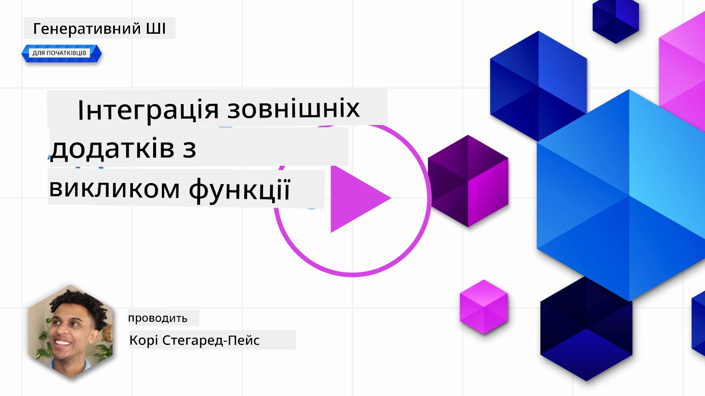
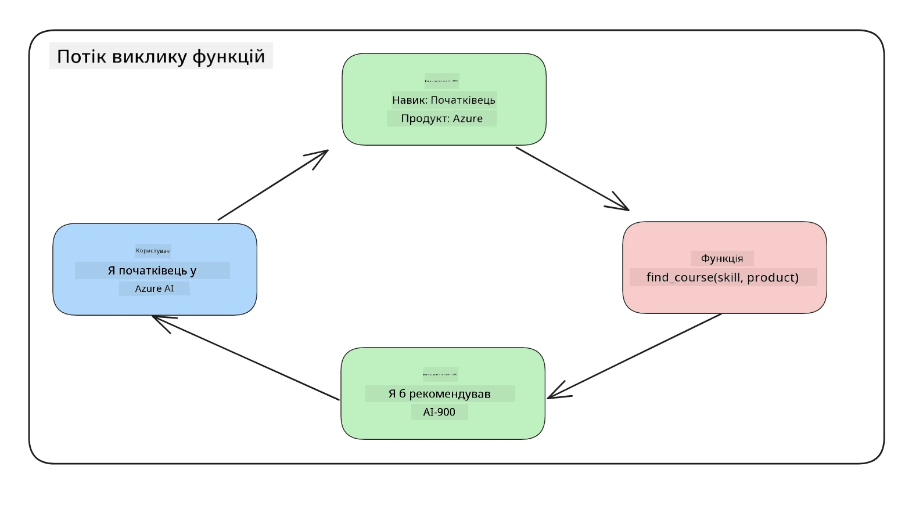
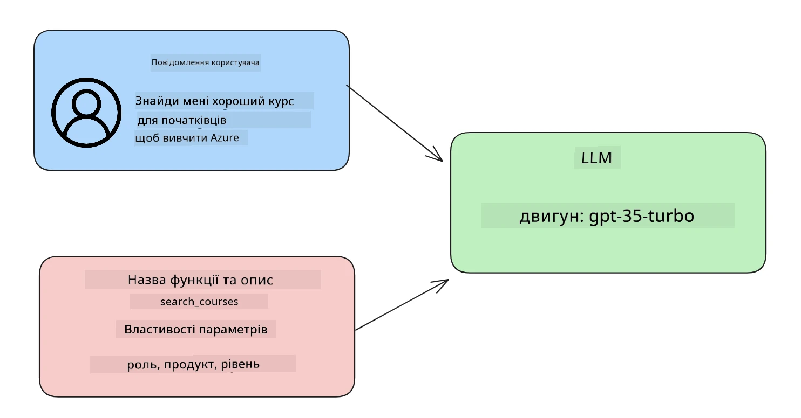

# Інтеграція з викликом функцій

[](https://youtu.be/DgUdCLX8qYQ?si=f1ouQU5HQx6F8Gl2)

Ви вже багато чого дізналися в попередніх уроках. Проте ми можемо вдосконалюватися далі. Деякі речі, які ми можемо розглянути — це як отримати більш послідовний формат відповіді, щоб було легше працювати з нею у наступних кроках. Також ми можемо захотіти додати дані з інших джерел, щоб ще більше збагатити наш додаток.

Вищезазначені проблеми — це те, що покликана розв’язати ця глава.

## Вступ

У цьому уроці буде розглянуто:

- Пояснення, що таке виклик функції та випадки її використання.
- Створення виклику функції за допомогою Azure OpenAI.
- Як інтегрувати виклик функції у додаток.

## Цілі навчання

До кінця цього уроку ви зможете:

- Пояснити призначення використання виклику функцій.
- Налаштувати виклик функції за допомогою Azure OpenAI Service.
- Розробити ефективні виклики функцій для використання у вашій програмі.

## Сценарій: Покращення нашого чатбота за допомогою функцій

Для цього уроку ми хочемо створити функцію для нашого освітнього стартапу, яка дозволить користувачам за допомогою чатбота знаходити технічні курси. Ми рекомендуватимемо курси, що відповідають їхньому рівню навичок, поточній ролі та цікавій технології.

Для завершення цього сценарію ми використаємо комбінацію:

- `Azure OpenAI` для створення чат-інтерфейсу для користувача.
- `Microsoft Learn Catalog API` для допомоги користувачам у пошуку курсів за їхнім запитом.
- `Виклик функції` для отримання запиту користувача та надсилання його в функцію для виконання API-запиту.

Для початку давайте подивимось, навіщо нам потрібен виклик функції:

## Чому Виклик Функції

До введення виклику функції відповіді від LLM були неструктурованими та непослідовними. Розробникам доводилось писати складний код валідації, щоб упоратися з кожною варіацією відповіді. Користувачі не могли отримати відповіді на запитання типу "Яка зараз погода у Стокгольмі?". Це тому, що моделі були обмежені даними, на яких їх тренували.

Виклик функції — це особливість сервісу Azure OpenAI, яка дозволяє подолати такі обмеження:

- **Послідовний формат відповіді.** Якщо ми краще контролюємо формат відповіді, нам легше інтегрувати її у наступні системи.
- **Зовнішні дані.** Можливість використовувати дані з інших джерел застосунку у контексті чату.

## Ілюстрування проблеми на прикладі сценарію

> Рекомендуємо використати [включений ноутбук](./python/aoai-assignment.ipynb?WT.mc_id=academic-105485-koreyst), якщо хочете запустити наведений нижче сценарій. Також можна просто читати далі, оскільки ми намагаємось показати проблему, де функції можуть допомогти її розв’язати.

Розглянемо приклад, що ілюструє проблему формату відповіді:

Припустимо, ми хочемо створити базу даних студентів, щоб радити їм відповідний курс. Нижче наведено два описи студентів, які дуже схожі за вмістом.

1. Створіть підключення до нашого ресурсу Azure OpenAI:

   ```python
   import os
   import json
   from openai import OpenAI
   from dotenv import load_dotenv
   load_dotenv()

   # API відповідей надається з точки доступу Azure OpenAI (Microsoft Foundry) v1
   # тому ми вказуємо клієнту OpenAI адресу <your-endpoint>/openai/v1/.
   endpoint = os.environ['AZURE_OPENAI_ENDPOINT']
   client = OpenAI(
   api_key=os.environ['AZURE_OPENAI_API_KEY'],
   base_url=f"{endpoint.rstrip('/')}/openai/v1/",
   )

   deployment=os.environ['AZURE_OPENAI_DEPLOYMENT']
   ```

   Нижче наведено код Python для налаштування підключення до Azure OpenAI. Оскільки ми використовуємо v1 endpoint, нам достатньо задати `api_key` і `base_url` (параметр `api_version` не потрібен).

1. Створення двох описів студентів за допомогою змінних `student_1_description` і `student_2_description`.

   ```python
   student_1_description="Emily Johnson is a sophomore majoring in computer science at Duke University. She has a 3.7 GPA. Emily is an active member of the university's Chess Club and Debate Team. She hopes to pursue a career in software engineering after graduating."

   student_2_description = "Michael Lee is a sophomore majoring in computer science at Stanford University. He has a 3.8 GPA. Michael is known for his programming skills and is an active member of the university's Robotics Club. He hopes to pursue a career in artificial intelligence after finishing his studies."
   ```

   Ми хочемо надіслати ці описи студентів у LLM для парсингу даних. Ці дані пізніше можна буде використовувати у нашому додатку, надсилати в API або зберігати у базі даних.

1. Створимо два однакові підказки, у яких інструктуємо LLM, яку інформацію потрібно отримати:

   ```python
   prompt1 = f'''
   Please extract the following information from the given text and return it as a JSON object:

   name
   major
   school
   grades
   club

   This is the body of text to extract the information from:
   {student_1_description}
   '''

   prompt2 = f'''
   Please extract the following information from the given text and return it as a JSON object:

   name
   major
   school
   grades
   club

   This is the body of text to extract the information from:
   {student_2_description}
   '''
   ```

   Ці підказки інструктують LLM витягнути інформацію та повернути відповідь у форматі JSON.

1. Після налаштування підказок та підключення до Azure OpenAI надішлемо підказки в LLM за допомогою `client.responses.create`. Ми збережемо підказку в змінну `input` і призначимо роль `user`. Це імітує повідомлення від користувача чатботу.

   ```python
   # відповідь на перший запит
   openai_response1 = client.responses.create(
   model=deployment,
   input = [{'role': 'user', 'content': prompt1}],
   store=False,
   )
   openai_response1.output_text

   # відповідь на другий запит
   openai_response2 = client.responses.create(
   model=deployment,
   input = [{'role': 'user', 'content': prompt2}],
   store=False,
   )
   openai_response2.output_text
   ```

Тепер ми можемо надіслати обидва запити до LLM і переглянути отриману відповідь, звернувшись до неї як `openai_response1.output_text`.

1. Нарешті, ми конвертуємо відповідь у формат JSON, викликавши `json.loads`:

   ```python
   # Завантаження відповіді як JSON-об'єкта
   json_response1 = json.loads(openai_response1.output_text)
   json_response1
   ```

   Відповідь 1:

   ```json
   {
     "name": "Emily Johnson",
     "major": "computer science",
     "school": "Duke University",
     "grades": "3.7",
     "club": "Chess Club"
   }
   ```

   Відповідь 2:

   ```json
   {
     "name": "Michael Lee",
     "major": "computer science",
     "school": "Stanford University",
     "grades": "3.8 GPA",
     "club": "Robotics Club"
   }
   ```

   Хоча підказки однакові, а описи подібні, ми бачимо, що значення властивості `Grades` іноді форматуються по-різному — наприклад, у форматі `3.7` чи `3.7 GPA`.

   Це відбувається тому, що LLM приймає неструктуровані дані у вигляді тексту підказки і також повертає неструктуровані дані. Нам потрібен структурований формат, щоб знати, чого очікувати при збереженні чи використанні цих даних.

То як же вирішити проблему форматування? Використовуючи виклик функції, ми можемо бути впевнені, що отримаємо назад структуровані дані. При функціональному виклику LLM фактично не виконує жодних функцій. Замість цього ми створюємо структуру, за якою LLM має будувати свої відповіді. Потім цими структурованими відповідями керуємо, яку функцію виконувати у додатку.



Далі ми беремо те, що повертає функція, і надсилаємо це назад LLM. LLM тоді відповідає природною мовою, щоб дати відповідь на запит користувача.

## Випадки використання виклику функцій

Існує багато різних випадків, де виклики функцій можуть покращити ваш додаток, наприклад:

- **Виклик зовнішніх інструментів.** Чатботи чудово відповідають на запитання користувачів. Використовуючи виклики функцій, чатботи можуть використовувати повідомлення від користувачів для виконання певних завдань. Наприклад, студент може попросити чатбота "Надіслати електронного листа моєму викладачу з проханням допомогти мені з цим предметом". Це може ініціювати виклик функції `send_email(to: string, body: string)`

- **Створення API або запитів до бази даних.** Користувачі можуть знаходити інформацію за допомогою природної мови, що конвертується у відформатований запит або API-запит. Прикладом може бути викладач, який запитує "Хто зі студентів завершив останнє завдання", що може викликати функцію `get_completed(student_name: string, assignment: int, current_status: string)`

- **Створення структурованих даних.** Користувачі можуть взяти текстовий блок або CSV та використати LLM, щоб витягти з нього важливу інформацію. Наприклад, студент може конвертувати статтю Вікіпедії про мирні угоди для створення AI-флешкарток. Це робиться через функцію `get_important_facts(agreement_name: string, date_signed: string, parties_involved: list)`

## Створення першого виклику функції

Процес створення виклику функції включає 3 основні кроки:

1. **Виклик** API Responses зі списком ваших функцій (інструментів) та повідомленням користувача.
2. **Читання** відповіді моделі для виконання дії, тобто виклик функції або API.
3. **Повторний виклик** API Responses з відповіддю від вашої функції для використання цієї інформації для створення відповіді користувачу.



### Крок 1 — створення повідомлень

Перший крок — створити повідомлення користувача. Його можна динамічно отримувати зі значення текстового поля або задати тут. Якщо ви вперше працюєте з Responses API, потрібно задати `role` і `content` повідомлення.

Роль може бути `system` (створення правил), `assistant` (модель) або `user` (кінець-користувач). Для виклику функцій ми призначимо роль `user` і введемо приклад запитання.

```python
messages= [ {"role": "user", "content": "Find me a good course for a beginner student to learn Azure."} ]
```

Призначення різних ролей допомагає LLM розрізняти, чи це система говорить, чи користувач, що допомагає будувати історію розмови для подальшої роботи моделі.

### Крок 2 — створення функцій

Далі визначимо функцію та її параметри. Тут ми використаємо одну функцію з назвою `search_courses`, але можна створити багато функцій.

> **Важливо**: Функції включаються у системне повідомлення LLM і враховуються у ліміті доступних токенів.

Нижче ми створюємо функції як масив елементів. Кожен елемент — це інструмент у форматі flat Responses API, з властивостями `type`, `name`, `description` і `parameters`:

```python
functions = [
   {
      "type":"function",
      "name":"search_courses",
      "description":"Retrieves courses from the search index based on the parameters provided",
      "parameters":{
         "type":"object",
         "properties":{
            "role":{
               "type":"string",
               "description":"The role of the learner (i.e. developer, data scientist, student, etc.)"
            },
            "product":{
               "type":"string",
               "description":"The product that the lesson is covering (i.e. Azure, Power BI, etc.)"
            },
            "level":{
               "type":"string",
               "description":"The level of experience the learner has prior to taking the course (i.e. beginner, intermediate, advanced)"
            }
         },
         "required":[
            "role"
         ]
      }
   }
]
```

Розглянемо докладніше кожний екземпляр функції:

- `name` — Ім’я функції, яку ми хочемо викликати.
- `description` — Опис того, як працює функція. Тут важливо бути конкретним і чітким.
- `parameters` — Список значень і форматів, які модель має генерувати у відповіді. Масив параметрів складається з елементів, у яких є такі властивості:
  1.  `type` — Тип даних властивостей.
  1.  `properties` — Список конкретних значень, які модель має використовувати у відповіді.
      1. `name` — Ключ, що є назвою властивості у відповіді, наприклад `product`.
      1. `type` — Тип даних цієї властивості, наприклад `string`.
      1. `description` — Опис конкретної властивості.

Існує також необов’язкова властивість `required` — обов’язкова властивість для виконання виклику функції.

### Крок 3 — виконання виклику функції

Після визначення функції нам потрібно включити її у запит до Responses API. Це робиться шляхом додавання `tools` у запит. У нашому випадку `tools=functions`.

Також є опція встановити `tool_choice` у `auto`. Це означає, що ми дозволимо LLM самостійно вирішувати, яку функцію викликати на основі повідомлення користувача, замість призначати її самостійно.

Ось код, де ми викликаємо `client.responses.create`, зверніть увагу, що ми встановили `tools=functions` і `tool_choice="auto"`, даючи LLM можливість вибору, коли викликати функції:

```python
response = client.responses.create(model=deployment,
                                        input=messages,
                                        tools=functions,
                                        tool_choice="auto",
                                        store=False)

print(response.output)
```

Тепер у відповіді є елемент `function_call` у `response.output`, який виглядає так:

```json
{
  "type": "function_call",
  "name": "search_courses",
  "call_id": "call_abc123",
  "arguments": "{\n  \"role\": \"student\",\n  \"product\": \"Azure\",\n  \"level\": \"beginner\"\n}"
}
```

Тут ми бачимо, що функція `search_courses` була викликана з певними аргументами, переліченими у властивості `arguments` JSON-відповіді.

Висновок: LLM знайшла дані, які відповідали параметрам функції, оскільки вона витягувала їх зі значення, переданого параметру `input` при виклику Responses API. Нижче нагадаємо значення `messages`:

```python
messages= [ {"role": "user", "content": "Find me a good course for a beginner student to learn Azure."} ]
```

Як видно, `student`, `Azure` та `beginner` були витягнуті з `messages` і передані як вхідні дані функції. Використання функцій таким чином — це чудовий спосіб отримувати інформацію з підказки, а також структурувати LLM та мати багаторазову функціональність.

Далі потрібно подивитися, як використати це у нашому додатку.

## Інтеграція викликів функцій у додаток

Після тестування форматованої відповіді від LLM тепер ми можемо інтегрувати це у додаток.

### Керування потоком

Щоб інтегрувати це у наш додаток, зробимо такі кроки:

1. Спочатку виконаємо виклик до сервісів OpenAI і вилучимо елементи виклику функції з відповіді `output`.

   ```python
   response_items = response.output
   tool_calls = [item for item in response_items if item.type == "function_call"]
   ```

1. Тепер визначимо функцію, яка викликатиме Microsoft Learn API, щоб отримати список курсів:

   ```python
   import requests

   def search_courses(role, product, level):
     url = "https://learn.microsoft.com/api/catalog/"
     params = {
        "role": role,
        "product": product,
        "level": level
     }
     response = requests.get(url, params=params)
     modules = response.json()["modules"]
     results = []
     for module in modules[:5]:
        title = module["title"]
        url = module["url"]
        results.append({"title": title, "url": url})
     return str(results)
   ```

   Зверніть увагу, що тепер ми створюємо реальну Python-функцію, яка співпадає з іменами функцій із змінної `functions`. Ми також робимо реальні зовнішні API-запити для отримання потрібних даних. У цьому випадку звертаємось до Microsoft Learn API для пошуку тренінгових модулів.

Добре, ми створили змінну `functions` і відповідну Python-функцію, як повідомити LLM, як зіставити їх, щоб була викликана наша Python-функція?

1. Щоб дізнатися, чи потрібно викликати Python-функцію, потрібно перевірити відповідь LLM — чи є у ній елемент `function_call`, і викликати вказану функцію. Ось нижче як провести згадану перевірку:

   ```python
   # Перевірте, чи модель хоче викликати функцію
   if tool_calls:
    for tool_call in tool_calls:
     print("Recommended Function call:")
     print(tool_call.name)
     print()

     # Викликати функцію.
     function_name = tool_call.name

     available_functions = {
             "search_courses": search_courses,
     }
     function_to_call = available_functions[function_name]

     function_args = json.loads(tool_call.arguments)
     function_response = function_to_call(**function_args)

     print("Output of function call:")
     print(function_response)
     print(type(function_response))

     # Додайте виклик функції та її результат назад до розмови.
     # Пункт function_call моделі повинен бути доданий перед її виводом.
     messages.append(tool_call)  # пункт function_call асистента
     messages.append( # результат функції
         {
             "type": "function_call_output",
             "call_id": tool_call.call_id,
             "output": function_response,
         }
     )
   ```

   Ці три рядки забезпечують витяг імені функції, аргументів та виклик функції:

   ```python
   function_to_call = available_functions[function_name]

   function_args = json.loads(tool_call.arguments)
   function_response = function_to_call(**function_args)
   ```

   Нижче наведено результат виконання коду:

   **Результат**

   ```Recommended Function call:
   {
     "name": "search_courses",
     "arguments": "{\n  \"role\": \"student\",\n  \"product\": \"Azure\",\n  \"level\": \"beginner\"\n}"
   }

   Output of function call:
   [{'title': 'Describe concepts of cryptography', 'url': 'https://learn.microsoft.com/training/modules/describe-concepts-of-cryptography/?
   WT.mc_id=api_CatalogApi'}, {'title': 'Introduction to audio classification with TensorFlow', 'url': 'https://learn.microsoft.com/en-
   us/training/modules/intro-audio-classification-tensorflow/?WT.mc_id=api_CatalogApi'}, {'title': 'Design a Performant Data Model in Azure SQL
   Database with Azure Data Studio', 'url': 'https://learn.microsoft.com/training/modules/design-a-data-model-with-ads/?
   WT.mc_id=api_CatalogApi'}, {'title': 'Getting started with the Microsoft Cloud Adoption Framework for Azure', 'url':
   'https://learn.microsoft.com/training/modules/cloud-adoption-framework-getting-started/?WT.mc_id=api_CatalogApi'}, {'title': 'Set up the
   Rust development environment', 'url': 'https://learn.microsoft.com/training/modules/rust-set-up-environment/?WT.mc_id=api_CatalogApi'}]
   <class 'str'>
   ```

1. Тепер надішлемо оновлене повідомлення `messages` в LLM, щоб отримати відповідь природною мовою замість API JSON.

   ```python
   print("Messages in next request:")
   print(messages)
   print()

   second_response = client.responses.create(
      input=messages,
      model=deployment,
      tool_choice="auto",
      tools=functions,
      temperature=0,
      store=False,
         )  # отримати нову відповідь від моделі, де вона може бачити відповідь функції


   print(second_response.output_text)
   ```

   **Результат**

   ```text
   I found some good courses for beginner students to learn Azure:

   1. [Describe concepts of cryptography](https://learn.microsoft.com/training/modules/describe-concepts-of-cryptography/?WT.mc_id=api_CatalogApi)
   2. [Introduction to audio classification with TensorFlow](https://learn.microsoft.com/training/modules/intro-audio-classification-tensorflow/?WT.mc_id=api_CatalogApi)
   3. [Design a Performant Data Model in Azure SQL Database with Azure Data Studio](https://learn.microsoft.com/training/modules/design-a-data-model-with-ads/?WT.mc_id=api_CatalogApi)
   4. [Getting started with the Microsoft Cloud Adoption Framework for Azure](https://learn.microsoft.com/training/modules/cloud-adoption-framework-getting-started/?WT.mc_id=api_CatalogApi)
   5. [Set up the Rust development environment](https://learn.microsoft.com/training/modules/rust-set-up-environment/?WT.mc_id=api_CatalogApi)

   You can click on the links to access the courses.
   ```

## Завдання

Щоб продовжити вивчення Azure OpenAI Function Calling, ви можете розробити:

- Більше параметрів функції, що можуть допомогти учням знаходити більше курсів.

- Створіть ще один виклик функції, який приймає більше інформації від учня, наприклад, їхню рідну мову
- Створіть обробку помилок, коли виклик функції та/або виклик API не повертає жодних підходящих курсів

Підказка: Дотримуйтесь документації [Learn API reference documentation](https://learn.microsoft.com/training/support/catalog-api-developer-reference?WT.mc_id=academic-105485-koreyst), щоб дізнатись, як і де доступні ці дані.

## Відмінна робота! Продовжуйте путь

Після завершення цього уроку ознайомтеся з нашою [колекцією з вивчення генеративного штучного інтелекту](https://aka.ms/genai-collection?WT.mc_id=academic-105485-koreyst), щоб продовжити підвищувати свої знання у цій галузі!

Перейдіть до Уроку 12, де ми розглянемо, як [розробляти UX для AI-додатків](../12-designing-ux-for-ai-applications/README.md?WT.mc_id=academic-105485-koreyst)!

---

<!-- CO-OP TRANSLATOR DISCLAIMER START -->
**Відмова від відповідальності**:
Цей документ було перекладено за допомогою сервісу штучного інтелекту для перекладу [Co-op Translator](https://github.com/Azure/co-op-translator). Хоча ми прагнемо до точності, будь ласка, майте на увазі, що автоматичні переклади можуть містити помилки або неточності. Оригінальний документ рідною мовою слід вважати авторитетним джерелом. Для критично важливої інформації рекомендується професійний людський переклад. Ми не несемо відповідальності за будь-які непорозуміння або неправильні тлумачення, що виникли внаслідок використання цього перекладу.
<!-- CO-OP TRANSLATOR DISCLAIMER END -->