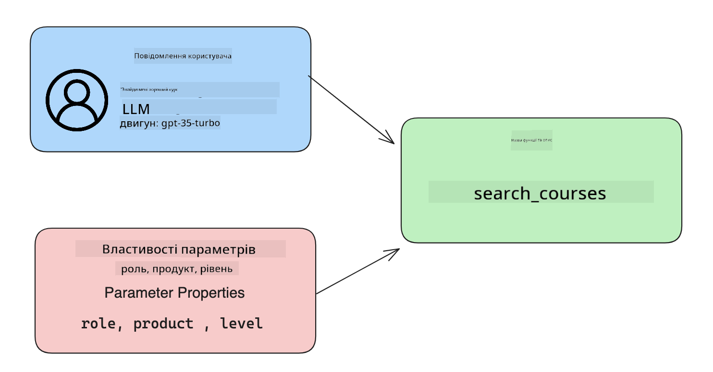

<!--
CO_OP_TRANSLATOR_METADATA:
{
  "original_hash": "77a48a201447be19aa7560706d6f93a0",
  "translation_date": "2025-07-09T14:47:10+00:00",
  "source_file": "11-integrating-with-function-calling/README.md",
  "language_code": "uk"
}
-->
# Інтеграція з викликом функцій

[](https://aka.ms/gen-ai-lesson11-gh?WT.mc_id=academic-105485-koreyst)

Ви вже багато чого дізналися у попередніх уроках. Проте ми можемо покращити наші результати. Одне з питань — як отримати більш послідовний формат відповіді, щоб було легше працювати з нею далі. Також ми можемо додати дані з інших джерел, щоб зробити наш додаток більш насиченим.

Саме ці проблеми розглядаються в цій главі.

## Вступ

У цьому уроці ми розглянемо:

- Що таке виклик функції та де його застосовують.
- Як створити виклик функції за допомогою Azure OpenAI.
- Як інтегрувати виклик функції у додаток.

## Цілі навчання

Після завершення цього уроку ви зможете:

- Пояснити мету використання виклику функцій.
- Налаштувати Function Call за допомогою Azure OpenAI Service.
- Розробляти ефективні виклики функцій для вашого випадку використання.

## Сценарій: Покращення нашого чатбота за допомогою функцій

У цьому уроці ми хочемо створити функцію для нашого освітнього стартапу, яка дозволить користувачам знаходити технічні курси через чатбота. Ми рекомендуватимемо курси, що відповідають їхньому рівню навичок, поточній ролі та зацікавленій технології.

Для реалізації цього сценарію ми використаємо комбінацію:

- `Azure OpenAI` для створення чатового досвіду для користувача.
- `Microsoft Learn Catalog API` для допомоги користувачам у пошуку курсів за їхніми запитами.
- `Function Calling` для обробки запиту користувача та передачі його у функцію, яка робить API-запит.

Для початку розглянемо, чому взагалі варто використовувати виклик функцій:

## Чому Function Calling

До появи виклику функцій відповіді від LLM були неструктурованими та непослідовними. Розробникам доводилося писати складний код для валідації, щоб обробляти всі варіанти відповіді. Користувачі не могли отримати відповіді на запитання типу "Яка зараз погода в Стокгольмі?". Це пов’язано з тим, що моделі обмежені даними, на яких їх навчали.

Function Calling — це функція Azure OpenAI Service, яка допомагає подолати такі обмеження:

- **Послідовний формат відповіді**. Якщо ми краще контролюємо формат відповіді, то легше інтегрувати її в інші системи.
- **Зовнішні дані**. Можливість використовувати дані з інших джерел додатку в контексті чату.

## Ілюстрація проблеми на прикладі

> Рекомендуємо використовувати [включений ноутбук](python/aoai-assignment.ipynb), якщо хочете запустити наведений нижче сценарій. Також можна просто читати далі, адже ми намагаємося показати проблему, яку допомагають вирішити функції.

Розглянемо приклад, що ілюструє проблему формату відповіді:

Припустимо, ми хочемо створити базу даних студентів, щоб пропонувати їм відповідні курси. Нижче наведено два описи студентів, які дуже схожі за змістом.

1. Створюємо підключення до нашого ресурсу Azure OpenAI:

   ```python
   import os
   import json
   from openai import AzureOpenAI
   from dotenv import load_dotenv
   load_dotenv()

   client = AzureOpenAI(
   api_key=os.environ['AZURE_OPENAI_API_KEY'],  # this is also the default, it can be omitted
   api_version = "2023-07-01-preview"
   )

   deployment=os.environ['AZURE_OPENAI_DEPLOYMENT']
   ```

   Нижче наведено Python-код для налаштування підключення до Azure OpenAI, де ми задаємо `api_type`, `api_base`, `api_version` та `api_key`.

1. Створюємо два описи студентів у змінних `student_1_description` та `student_2_description`.

   ```python
   student_1_description="Emily Johnson is a sophomore majoring in computer science at Duke University. She has a 3.7 GPA. Emily is an active member of the university's Chess Club and Debate Team. She hopes to pursue a career in software engineering after graduating."

   student_2_description = "Michael Lee is a sophomore majoring in computer science at Stanford University. He has a 3.8 GPA. Michael is known for his programming skills and is an active member of the university's Robotics Club. He hopes to pursue a career in artificial intelligence after finishing his studies."
   ```

   Ми хочемо надіслати ці описи студентів у LLM для парсингу даних. Ці дані потім можна буде використовувати у додатку, надсилати в API або зберігати в базі даних.

1. Створюємо два однакові запити, в яких інструктуємо LLM, яку інформацію потрібно витягти:

   ```python
   prompt1 = f'''
   Please extract the following information from the given text and return it as a JSON object:

   name
   major
   school
   grades
   club

   This is the body of text to extract the information from:
   {student_1_description}
   '''

   prompt2 = f'''
   Please extract the following information from the given text and return it as a JSON object:

   name
   major
   school
   grades
   club

   This is the body of text to extract the information from:
   {student_2_description}
   '''
   ```

   Ці запити вказують LLM витягти інформацію та повернути відповідь у форматі JSON.

1. Після налаштування запитів і підключення до Azure OpenAI, надсилаємо запити до LLM за допомогою `openai.ChatCompletion`. Зберігаємо запит у змінній `messages` і призначаємо роль `user`. Це імітує повідомлення від користувача чатботу.

   ```python
   # response from prompt one
   openai_response1 = client.chat.completions.create(
   model=deployment,
   messages = [{'role': 'user', 'content': prompt1}]
   )
   openai_response1.choices[0].message.content

   # response from prompt two
   openai_response2 = client.chat.completions.create(
   model=deployment,
   messages = [{'role': 'user', 'content': prompt2}]
   )
   openai_response2.choices[0].message.content
   ```

Тепер ми можемо надіслати обидва запити до LLM і подивитися на отримані відповіді, звернувшись так: `openai_response1['choices'][0]['message']['content']`.

1. Нарешті, конвертуємо відповідь у формат JSON, викликавши `json.loads`:

   ```python
   # Loading the response as a JSON object
   json_response1 = json.loads(openai_response1.choices[0].message.content)
   json_response1
   ```

   Відповідь 1:

   ```json
   {
     "name": "Emily Johnson",
     "major": "computer science",
     "school": "Duke University",
     "grades": "3.7",
     "club": "Chess Club"
   }
   ```

   Відповідь 2:

   ```json
   {
     "name": "Michael Lee",
     "major": "computer science",
     "school": "Stanford University",
     "grades": "3.8 GPA",
     "club": "Robotics Club"
   }
   ```

   Хоча запити однакові, а описи схожі, ми бачимо, що значення властивості `Grades` форматуються по-різному: іноді це `3.7`, іноді `3.7 GPA`.

   Це відбувається тому, що LLM приймає неструктуровані дані у вигляді тексту і повертає також неструктуровані дані. Нам потрібен структурований формат, щоб знати, чого очікувати при збереженні чи використанні цих даних.

Отже, як вирішити проблему з форматуванням? Використовуючи виклик функцій, ми можемо гарантувати отримання структурованих даних. При виклику функцій LLM фактично не виконує функції. Натомість ми створюємо структуру, якої LLM має дотримуватися у своїх відповідях. Потім ці структуровані відповіді допомагають нам визначити, яку функцію викликати у додатку.


Потім ми можемо взяти результат функції і надіслати його назад LLM. LLM відповість природною мовою, щоб дати відповідь на запит користувача.

## Випадки використання виклику функцій

Існує багато випадків, коли виклики функцій можуть покращити ваш додаток, наприклад:

- **Виклик зовнішніх інструментів**. Чатботи чудово відповідають на запитання користувачів. Використовуючи виклик функцій, чатботи можуть виконувати певні завдання на основі повідомлень користувачів. Наприклад, студент може попросити чатбота "Надіслати листа моєму викладачу з проханням про додаткову допомогу з цим предметом". Це може викликати функцію `send_email(to: string, body: string)`.

- **Створення запитів до API або бази даних**. Користувачі можуть знаходити інформацію, використовуючи природну мову, яка конвертується у форматований запит або API-запит. Наприклад, викладач може запитати "Хто з студентів виконав останнє завдання?", що викликає функцію `get_completed(student_name: string, assignment: int, current_status: string)`.

- **Створення структурованих даних**. Користувачі можуть взяти блок тексту або CSV і за допомогою LLM витягти важливу інформацію. Наприклад, студент може перетворити статтю з Вікіпедії про мирні угоди у флеш-картки для навчання. Це можна зробити за допомогою функції `get_important_facts(agreement_name: string, date_signed: string, parties_involved: list)`.

## Створення першого виклику функції

Процес створення виклику функції включає 3 основні кроки:

1. **Виклик** API Chat Completions зі списком ваших функцій і повідомленням користувача.
2. **Читання** відповіді моделі для виконання дії, тобто виклику функції або API.
3. **Здійснення** повторного виклику Chat Completions API з відповіддю від вашої функції, щоб створити відповідь користувачу.



### Крок 1 — створення повідомлень

Перший крок — створити повідомлення користувача. Його можна динамічно призначити, взявши значення з текстового поля, або задати тут вручну. Якщо ви вперше працюєте з Chat Completions API, потрібно визначити `role` і `content` повідомлення.

`role` може бути `system` (створення правил), `assistant` (модель) або `user` (кінцевий користувач). Для виклику функцій ми призначимо роль `user` і наведемо приклад запитання.

```python
messages= [ {"role": "user", "content": "Find me a good course for a beginner student to learn Azure."} ]
```

Призначення різних ролей допомагає LLM розуміти, хто говорить — система чи користувач, що допомагає будувати історію розмови, на якій LLM базується.

### Крок 2 — створення функцій

Далі ми визначимо функцію та її параметри. Тут ми використаємо одну функцію `search_courses`, але можна створити кілька.

> **Важливо**: Функції включаються у системне повідомлення для LLM і враховуються у кількості доступних токенів.

Нижче ми створюємо функції у вигляді масиву об’єктів. Кожен об’єкт — це функція з властивостями `name`, `description` та `parameters`:

```python
functions = [
   {
      "name":"search_courses",
      "description":"Retrieves courses from the search index based on the parameters provided",
      "parameters":{
         "type":"object",
         "properties":{
            "role":{
               "type":"string",
               "description":"The role of the learner (i.e. developer, data scientist, student, etc.)"
            },
            "product":{
               "type":"string",
               "description":"The product that the lesson is covering (i.e. Azure, Power BI, etc.)"
            },
            "level":{
               "type":"string",
               "description":"The level of experience the learner has prior to taking the course (i.e. beginner, intermediate, advanced)"
            }
         },
         "required":[
            "role"
         ]
      }
   }
]
```

Опишемо детальніше кожен елемент функції:

- `name` — ім’я функції, яку потрібно викликати.
- `description` — опис того, як працює функція. Тут важливо бути конкретним і зрозумілим.
- `parameters` — список значень і форматів, які модель має повернути у відповіді. Масив параметрів складається з елементів, які мають такі властивості:
  1. `type` — тип даних, у якому зберігатимуться властивості.
  2. `properties` — перелік конкретних значень, які модель використовуватиме у відповіді.
      1. `name` — ключ, ім’я властивості, яку модель використовуватиме у форматованій відповіді, наприклад, `product`.
      2. `type` — тип даних цієї властивості, наприклад, `string`.
      3. `description` — опис конкретної властивості.

Також є необов’язкова властивість `required` — перелік обов’язкових властивостей для виклику функції.

### Крок 3 — Виконання виклику функції

Після визначення функції потрібно включити її у виклик Chat Completion API. Для цього додаємо параметр `functions` у запит, наприклад, `functions=functions`.

Також можна встановити `function_call` у значення `auto`. Це означає, що LLM сам вирішить, яку функцію викликати на основі повідомлення користувача, замість того, щоб призначати це вручну.

Нижче код, де ми викликаємо `ChatCompletion.create`, зверніть увагу, що ми встановлюємо `functions=functions` і `function_call="auto"`, даючи LLM вибір, коли викликати функції:

```python
response = client.chat.completions.create(model=deployment,
                                        messages=messages,
                                        functions=functions,
                                        function_call="auto")

print(response.choices[0].message)
```

Відповідь виглядає так:

```json
{
  "role": "assistant",
  "function_call": {
    "name": "search_courses",
    "arguments": "{\n  \"role\": \"student\",\n  \"product\": \"Azure\",\n  \"level\": \"beginner\"\n}"
  }
}
```

Тут видно, що була викликана функція `search_courses` з аргументами, які наведені у властивості `arguments` у JSON-відповіді.

Висновок: LLM зміг знайти дані, що відповідають аргументам функції, оскільки витягнув їх зі значення, переданого у параметр `messages` у виклику chat completion. Нижче нагадування про значення `messages`:

```python
messages= [ {"role": "user", "content": "Find me a good course for a beginner student to learn Azure."} ]
```

Як бачите, `student`, `Azure` і `beginner` були витягнуті з `messages` і передані як вхідні дані функції. Використання функцій таким чином — чудовий спосіб витягувати інформацію з запиту, а також надавати структуру LLM і мати повторно використовувану функціональність.

Далі подивимося, як це можна застосувати у нашому додатку.

## Інтеграція викликів функцій у додаток

Після тестування форматованої відповіді від LLM ми можемо інтегрувати це у додаток.

### Керування потоком

Для інтеграції у додаток виконаємо такі кроки:

1. Спочатку зробимо виклик до сервісів OpenAI і збережемо повідомлення у змінній `response_message`.

   ```python
   response_message = response.choices[0].message
   ```

1. Тепер визначимо функцію, яка викликатиме Microsoft Learn API для отримання списку курсів:

   ```python
   import requests

   def search_courses(role, product, level):
     url = "https://learn.microsoft.com/api/catalog/"
     params = {
        "role": role,
        "product": product,
        "level": level
     }
     response = requests.get(url, params=params)
     modules = response.json()["modules"]
     results = []
     for module in modules[:5]:
        title = module["title"]
        url = module["url"]
        results.append({"title": title, "url": url})
     return str(results)
   ```

   Зверніть увагу, що тепер ми створюємо реальну Python-функцію, яка відповідає іменам функцій, визначених у змінній `functions`. Ми також робимо реальні зовнішні API-запити, щоб отримати потрібні дані. У цьому випадку звертаємося до Microsoft Learn API для пошуку навчальних модулів.

Отже, ми створили змінну `functions` і відповідну Python-функцію. Як повідомити LLM, як зіставити їх, щоб викликати нашу Python-функцію?

1. Щоб перевірити, чи потрібно викликати Python-функцію, потрібно подивитися у відповідь LLM і перевірити, чи є там `function_call`, і викликати вказану функцію. Ось як це можна зробити:

   ```python
   # Check if the model wants to call a function
   if response_message.function_call.name:
    print("Recommended Function call:")
    print(response_message.function_call.name)
    print()

    # Call the function.
    function_name = response_message.function_call.name

    available_functions = {
            "search_courses": search_courses,
    }
    function_to_call = available_functions[function_name]

    function_args = json.loads(response_message.function_call.arguments)
    function_response = function_to_call(**function_args)

    print("Output of function call:")
    print(function_response)
    print(type(function_response))


    # Add the assistant response and function response to the messages
    messages.append( # adding assistant response to messages
        {
            "role": response_message.role,
            "function_call": {
                "name": function_name,
                "arguments": response_message.function_call.arguments,
            },
            "content": None
        }
    )
    messages.append( # adding function response to messages
        {
            "role": "function",
            "name": function_name,
            "content":function_response,
        }
    )
   ```

   Ці три рядки забезпечують витягнення імені функції, аргументів і виклик функції:

   ```python
   function_to_call = available_functions[function_name]

   function_args = json.loads(response_message.function_call.arguments)
   function_response = function_to_call(**function_args)
   ```

   Нижче наведено результат виконання нашого коду:

   **Вивід**

   ```Recommended Function call:
   {
     "name": "search_courses",
     "arguments": "{\n  \"role\": \"student\",\n  \"product\": \"Azure\",\n  \"level\": \"beginner\"\n}"
   }

   Output of function call:
   [{'title': 'Describe concepts of cryptography', 'url': 'https://learn.microsoft.com/training/modules/describe-concepts-of-cryptography/?
   WT.mc_id=api_CatalogApi'}, {'title': 'Introduction to audio classification with TensorFlow', 'url': 'https://learn.microsoft.com/en-
   us/training/modules/intro-audio-classification-tensorflow/?WT.mc_id=api_CatalogApi'}, {'title': 'Design a Performant Data Model in Azure SQL
   Database with Azure Data Studio', 'url': 'https://learn.microsoft.com/training/modules/design-a-data-model-with-ads/?
   WT.mc_id=api_CatalogApi'}, {'title': 'Getting started with the Microsoft Cloud Adoption Framework for Azure', 'url':
   'https://learn.microsoft.com/training/modules/cloud-adoption-framework-getting-started/?WT.mc_id=api_CatalogApi'}, {'title': 'Set up the
   Rust development environment', 'url': 'https://learn.microsoft.com/training/modules/rust-set-up-environment/?WT.mc_id=api_CatalogApi'}]
   <class 'str'>
   ```

1. Тепер надішлемо оновлене повідомлення `messages` до LLM, щоб отримати відповідь природною мовою замість JSON-відповіді API.

   ```python
   print("Messages in next request:")
   print(messages)
   print()

   second_response = client.chat.completions.create(
      messages=messages,
      model=deployment,
      function_call="auto",
      functions=functions,
      temperature=0
         )  # get a new response from GPT where it can see the function response


   print(second_response.choices[0].message)
   ```

   **Вивід**

   ```python
   {
     "role": "assistant",
     "content": "I found some good courses for beginner students to learn Azure:\n\n1. [Describe concepts of cryptography] (https://learn.microsoft.com/training/modules/describe-concepts-of-cryptography/?WT.mc_id=api_CatalogApi)\n2. [Introduction to audio classification with TensorFlow](https://learn.microsoft.com/training/modules/intro-audio-classification-tensorflow/?WT.mc_id=api_CatalogApi)\n3. [Design a Performant Data Model in Azure SQL Database with Azure Data Studio](https://learn.microsoft.com/training/modules/design-a-data-model-with-ads/?WT.mc_id=api_CatalogApi)\n4. [Getting started with the Microsoft Cloud Adoption Framework for Azure](https://learn.microsoft.com/training/modules/cloud-adoption-framework-getting-started/?WT.mc_id=api_CatalogApi)\n5. [Set up the Rust development environment](https://learn.microsoft.com/training/modules/rust-set-up-environment/?WT.mc_id=api_CatalogApi)\n\nYou can click on the links to access the courses."
   }

   ```

## Завдання

Щоб продовжити вивчення Azure OpenAI Function Calling, ви можете:

- Додати більше параметрів у функцію, які допоможуть користувачам знаходити більше курсів.
- Створити інший виклик функції, який прийматиме додаткову інформацію від користувача, наприклад, рідну мову.
- Реалізувати обробку помилок, коли виклик функції та/або API не повертає відповідних курсів.
Підказка: Перегляньте сторінку [Learn API reference documentation](https://learn.microsoft.com/training/support/catalog-api-developer-reference?WT.mc_id=academic-105485-koreyst), щоб дізнатися, як і де доступні ці дані.

## Відмінна робота! Продовжуйте шлях

Після завершення цього уроку ознайомтеся з нашою [колекцією для вивчення Generative AI](https://aka.ms/genai-collection?WT.mc_id=academic-105485-koreyst), щоб продовжувати підвищувати свої знання у сфері Generative AI!

Перейдіть до Уроку 12, де ми розглянемо, як [проектувати UX для AI-додатків](../12-designing-ux-for-ai-applications/README.md?WT.mc_id=academic-105485-koreyst)!

**Відмова від відповідальності**:  
Цей документ було перекладено за допомогою сервісу автоматичного перекладу [Co-op Translator](https://github.com/Azure/co-op-translator). Хоча ми прагнемо до точності, будь ласка, майте на увазі, що автоматичні переклади можуть містити помилки або неточності. Оригінальний документ рідною мовою слід вважати авторитетним джерелом. Для критично важливої інформації рекомендується звертатися до професійного людського перекладу. Ми не несемо відповідальності за будь-які непорозуміння або неправильні тлумачення, що виникли внаслідок використання цього перекладу.