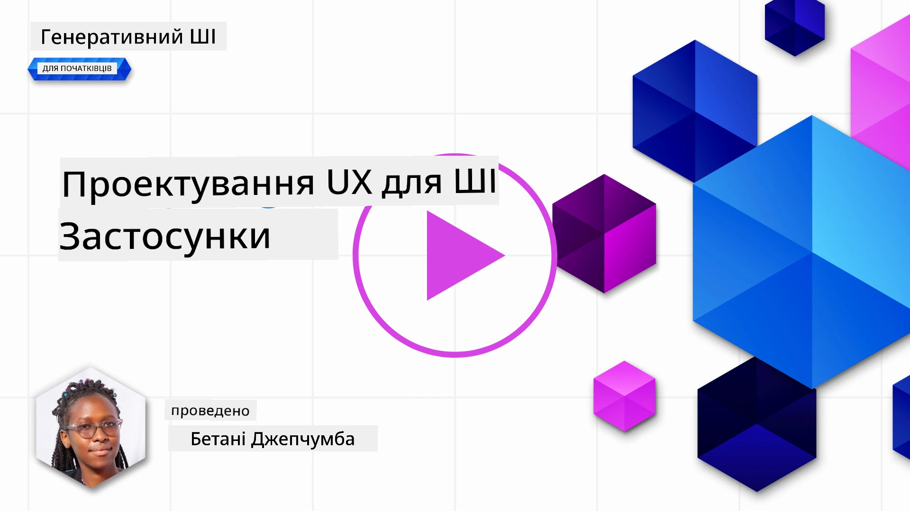
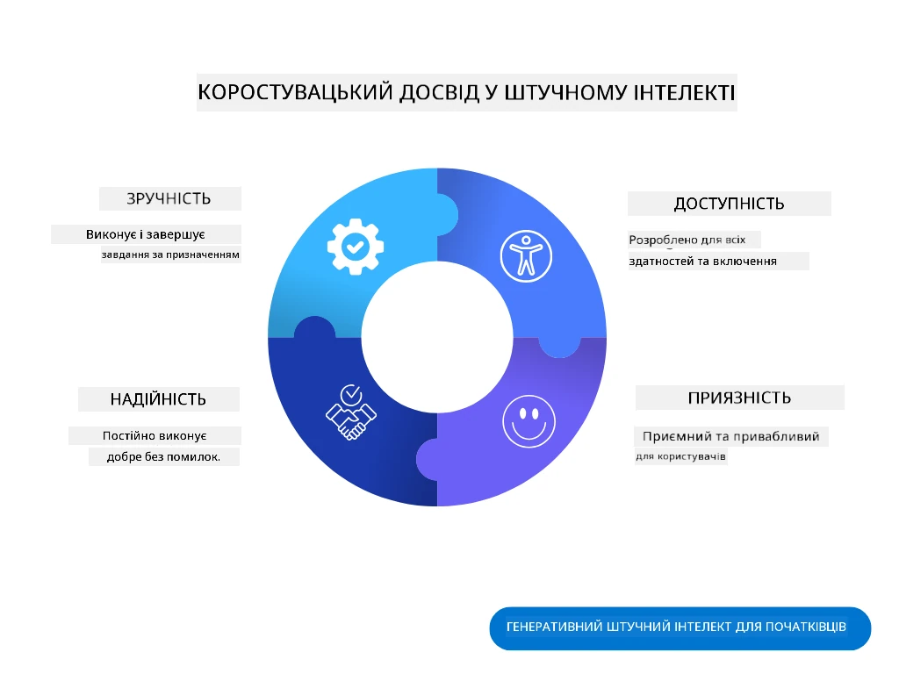
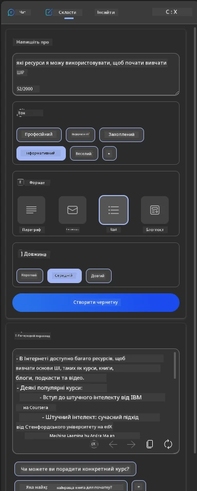
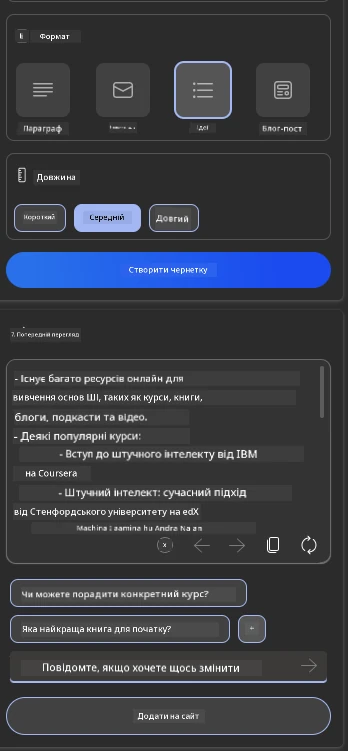

# Проєктування UX для застосунків на основі штучного інтелекту

> _(Натисніть на зображення вище, щоб переглянути відео цього уроку)_

Користувацький досвід є дуже важливим аспектом створення застосунків. Користувачі повинні мати можливість ефективно використовувати ваш застосунок для виконання завдань. Ефективність — це одне, але також важливо створювати застосунки, які можуть використовувати всі, роблячи їх _доступними_. Цей розділ зосереджений на цій темі, щоб ви могли створити застосунок, який люди захочуть і зможуть використовувати.

## Вступ

Користувацький досвід — це те, як користувач взаємодіє з певним продуктом або послугою, будь то система, інструмент чи дизайн. Розробляючи застосунки на основі штучного інтелекту, розробники зосереджуються не лише на забезпеченні ефективності користувацького досвіду, але й на його етичності. У цьому уроці ми розглянемо, як створювати застосунки на основі штучного інтелекту (ШІ), які відповідають потребам користувачів.

Урок охоплює такі теми:

- Вступ до користувацького досвіду та розуміння потреб користувачів
- Проєктування застосунків на основі ШІ для довіри та прозорості
- Проєктування застосунків на основі ШІ для співпраці та зворотного зв’язку

## Цілі навчання

Після проходження цього уроку ви зможете:

- Зрозуміти, як створювати застосунки на основі ШІ, які відповідають потребам користувачів.
- Проєктувати застосунки на основі ШІ, які сприяють довірі та співпраці.

### Попередні знання

Приділіть час і дізнайтеся більше про [користувацький досвід та дизайн-мислення.](https://learn.microsoft.com/training/modules/ux-design?WT.mc_id=academic-105485-koreyst)

## Вступ до користувацького досвіду та розуміння потреб користувачів

У нашому вигаданому освітньому стартапі є два основних типи користувачів: вчителі та учні. Кожен із цих типів має унікальні потреби. Дизайн, орієнтований на користувача, ставить користувача на перше місце, забезпечуючи, щоб продукти були актуальними та корисними для тих, для кого вони призначені.

Застосунок має бути **корисним, надійним, доступним і приємним**, щоб забезпечити хороший користувацький досвід.

### Корисність

Бути корисним означає, що застосунок має функціонал, який відповідає його призначенню, наприклад, автоматизація процесу оцінювання або створення карток для повторення матеріалу. Застосунок, який автоматизує процес оцінювання, має точно та ефективно виставляти оцінки за роботи студентів на основі визначених критеріїв. Аналогічно, застосунок, який створює картки для повторення, має генерувати релевантні та різноманітні запитання на основі своїх даних.

### Надійність

Бути надійним означає, що застосунок може виконувати свої завдання стабільно та без помилок. Однак ШІ, як і люди, не є ідеальним і може бути схильним до помилок. Застосунки можуть стикатися з помилками або непередбаченими ситуаціями, які потребують втручання або корекції людини. Як ви будете справлятися з помилками? У останньому розділі цього уроку ми розглянемо, як системи та застосунки на основі ШІ проєктуються для співпраці та зворотного зв’язку.

### Доступність

Бути доступним означає розширення користувацького досвіду для користувачів з різними можливостями, включаючи людей з інвалідністю, щоб ніхто не залишився осторонь. Дотримуючись принципів доступності, рішення на основі ШІ стають більш інклюзивними, зручними та корисними для всіх користувачів.

### Приємність

Бути приємним означає, що застосунок приносить задоволення від використання. Привабливий користувацький досвід може позитивно вплинути на користувача, спонукаючи його повертатися до застосунку, що збільшує дохід бізнесу.

Не кожну проблему можна вирішити за допомогою ШІ. ШІ використовується для покращення користувацького досвіду, наприклад, автоматизації ручних завдань або персоналізації користувацького досвіду.

## Проєктування застосунків на основі ШІ для довіри та прозорості

Побудова довіри є критично важливим аспектом при проєктуванні застосунків на основі ШІ. Довіра забезпечує впевненість користувача в тому, що застосунок виконає завдання, надасть результати стабільно і ці результати будуть відповідати потребам користувача. Ризиком у цій сфері є недовіра та надмірна довіра. Недовіра виникає, коли користувач має мало або зовсім не довіряє системі ШІ, що призводить до відмови від вашого застосунку. Надмірна довіра виникає, коли користувач переоцінює можливості системи ШІ, що призводить до надмірної довіри до системи. Наприклад, автоматизована система оцінювання у випадку надмірної довіри може призвести до того, що вчитель не перевірить деякі роботи, щоб переконатися, що система оцінювання працює правильно. Це може призвести до несправедливих або неточних оцінок для студентів або втрати можливостей для зворотного зв’язку та покращення.

Два способи забезпечити довіру в центрі дизайну — це пояснюваність і контроль.

### Пояснюваність

Коли ШІ допомагає приймати рішення, наприклад, передавати знання майбутнім поколінням, важливо, щоб вчителі та батьки розуміли, як приймаються рішення ШІ. Це і є пояснюваність — розуміння того, як застосунки на основі ШІ приймають рішення. Проєктування для пояснюваності включає додавання деталей, які підкреслюють, як ШІ дійшов до результату. Аудиторія має бути обізнана, що результат створений ШІ, а не людиною. Наприклад, замість "Почніть спілкуватися зі своїм репетитором зараз" скажіть "Використовуйте ШІ-репетитора, який адаптується до ваших потреб і допомагає вам навчатися у вашому темпі."

Ще один приклад — як ШІ використовує дані користувача та персональні дані. Наприклад, користувач із персоною "студент" може мати обмеження на основі своєї персони. ШІ може не розкривати відповіді на запитання, але може допомогти користувачу подумати, як він може вирішити проблему.

Останній ключовий аспект пояснюваності — це спрощення пояснень. Студенти та вчителі можуть не бути експертами у сфері ШІ, тому пояснення того, що застосунок може або не може зробити, мають бути простими та зрозумілими.

### Контроль

Генеративний ШІ створює співпрацю між ШІ та користувачем, де, наприклад, користувач може змінювати запити для отримання різних результатів. Крім того, після створення результату користувачі повинні мати можливість змінювати результати, отримуючи відчуття контролю. Наприклад, використовуючи Bing, ви можете налаштувати свій запит на основі формату, тону та довжини. Крім того, ви можете внести зміни до свого результату та модифікувати його, як показано нижче:

Ще одна функція Bing, яка дозволяє користувачу контролювати застосунок, — це можливість включати або виключати дані, які використовує ШІ. Для шкільного застосунку студент може захотіти використовувати свої нотатки, а також ресурси вчителя як матеріал для повторення.

> При проєктуванні застосунків на основі ШІ важливо забезпечити, щоб користувачі не надмірно довіряли системі, встановлюючи нереалістичні очікування щодо її можливостей. Один із способів зробити це — створити певний рівень тертя між запитами та результатами, нагадуючи користувачу, що це ШІ, а не інша людина.

## Проєктування застосунків на основі ШІ для співпраці та зворотного зв’язку

Як вже згадувалося раніше, генеративний ШІ створює співпрацю між користувачем та ШІ. Більшість взаємодій відбувається, коли користувач вводить запит, а ШІ генерує результат. Що робити, якщо результат неправильний? Як застосунок справляється з помилками, якщо вони виникають? Чи звинувачує ШІ користувача, чи пояснює помилку?

Застосунки на основі ШІ повинні бути створені для отримання та надання зворотного зв’язку. Це не тільки допомагає системі ШІ вдосконалюватися, але й сприяє довірі користувачів. У дизайн слід включити цикл зворотного зв’язку, наприклад, простий лайк або дизлайк результату.

Ще один спос

---

**Відмова від відповідальності**:  
Цей документ був перекладений за допомогою сервісу автоматичного перекладу [Co-op Translator](https://github.com/Azure/co-op-translator). Хоча ми прагнемо до точності, будь ласка, майте на увазі, що автоматичні переклади можуть містити помилки або неточності. Оригінальний документ на його рідній мові слід вважати авторитетним джерелом. Для критичної інформації рекомендується професійний людський переклад. Ми не несемо відповідальності за будь-які непорозуміння або неправильні тлумачення, що виникають внаслідок використання цього перекладу.