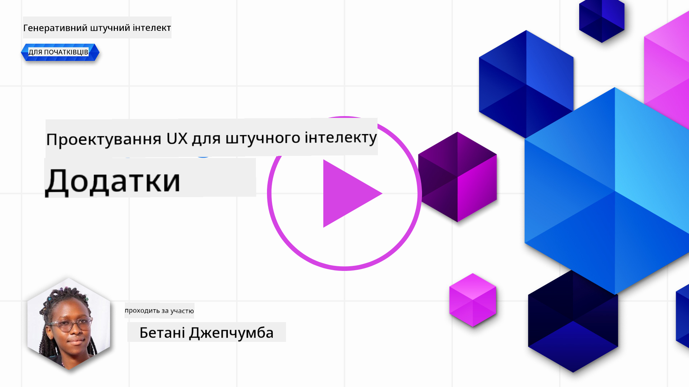
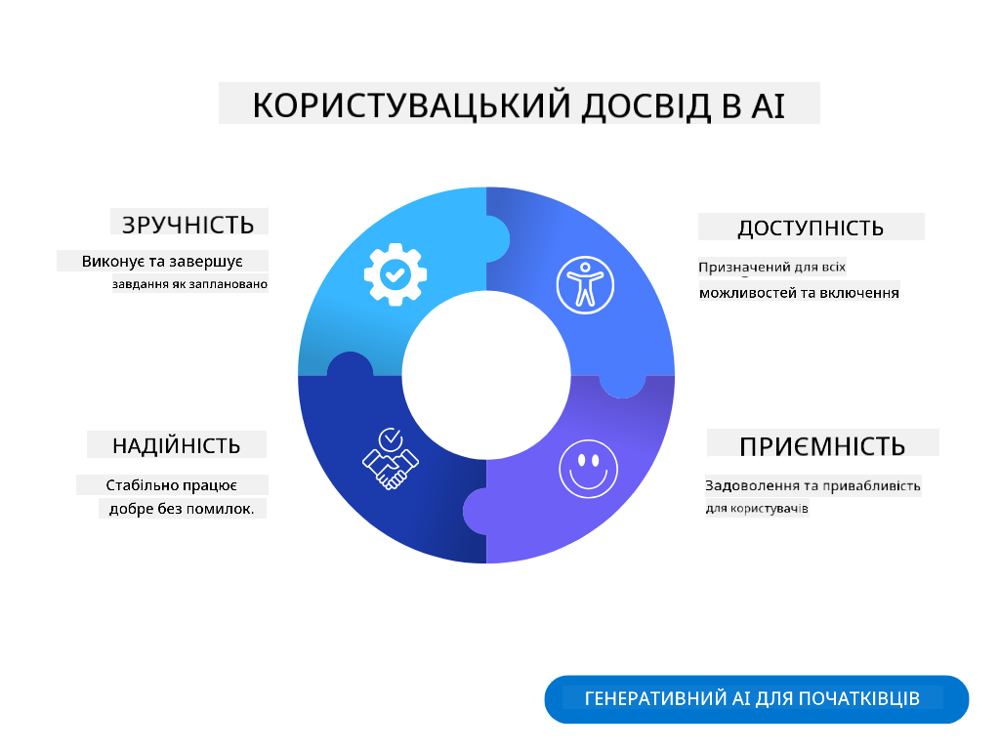
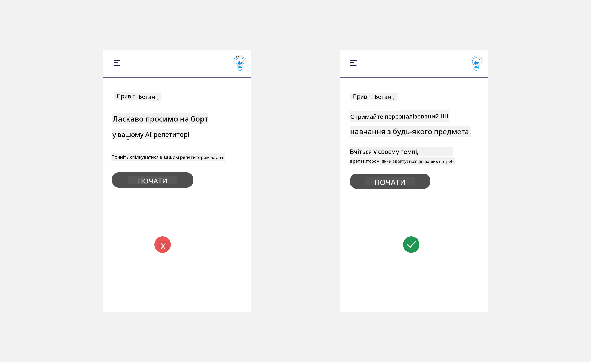
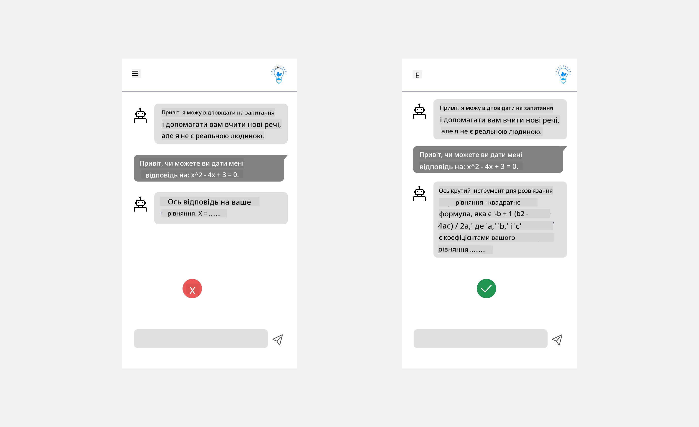
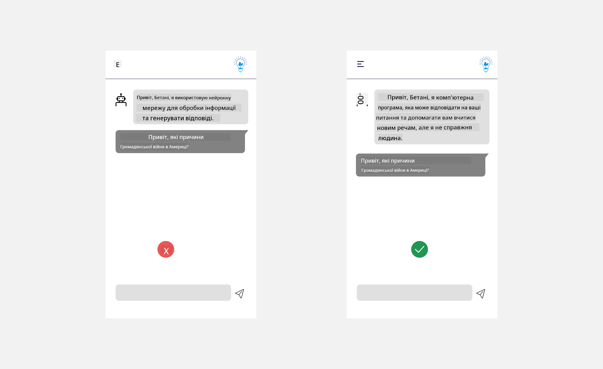
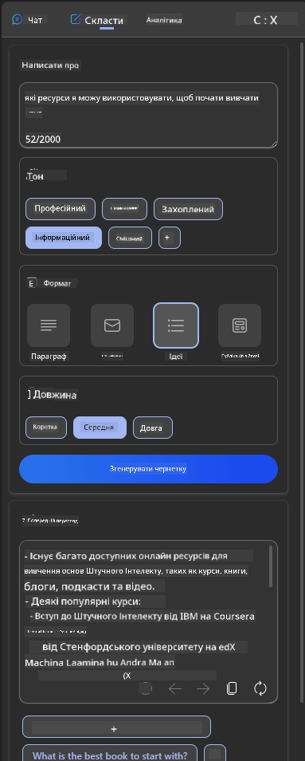
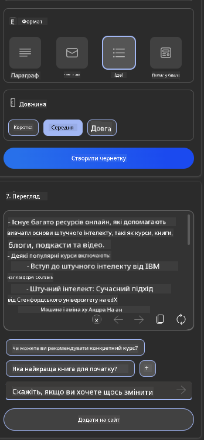

<!--
CO_OP_TRANSLATOR_METADATA:
{
  "original_hash": "ec385b41ee50579025d50cc03bfb3a25",
  "translation_date": "2025-06-25T20:38:18+00:00",
  "source_file": "12-designing-ux-for-ai-applications/README.md",
  "language_code": "uk"
}
-->
# Проектування UX для AI додатків

> _(Натисніть на зображення вище, щоб переглянути відео цього уроку)_

Користувацький досвід - це дуже важливий аспект створення додатків. Користувачі повинні мати можливість ефективно використовувати ваш додаток для виконання завдань. Бути ефективним - це одне, але ви також повинні проектувати додатки так, щоб ними могли користуватися всі, роблячи їх _доступними_. Цей розділ зосередиться на цій області, щоб ви, можливо, закінчили проектування додатку, який люди можуть і хочуть використовувати.

## Вступ

Користувацький досвід - це те, як користувач взаємодіє з і використовує конкретний продукт або послугу, будь то система, інструмент чи дизайн. При розробці AI додатків розробники не тільки зосереджуються на забезпеченні ефективності користувацького досвіду, але й на його етичності. У цьому уроці ми розглянемо, як створювати додатки штучного інтелекту (AI), які задовольняють потреби користувачів.

Урок охоплює такі області:

- Вступ до користувацького досвіду і розуміння потреб користувачів
- Проектування AI додатків для довіри та прозорості
- Проектування AI додатків для співпраці та зворотного зв'язку

## Цілі навчання

Після цього уроку ви зможете:

- Зрозуміти, як створювати AI додатки, які відповідають потребам користувачів.
- Проектувати AI додатки, які сприяють довірі та співпраці.

### Попередні знання

Виділіть час, щоб прочитати більше про [користувацький досвід і дизайн-мислення.](https://learn.microsoft.com/training/modules/ux-design?WT.mc_id=academic-105485-koreyst)

## Вступ до користувацького досвіду і розуміння потреб користувачів

У нашому вигаданому освітньому стартапі ми маємо двох основних користувачів, вчителів і студентів. Кожен з цих двох користувачів має унікальні потреби. Дизайн, орієнтований на користувача, ставить пріоритет на користувача, забезпечуючи, що продукти є актуальними і корисними для тих, для кого вони призначені.

Додаток повинен бути **корисним, надійним, доступним і приємним**, щоб забезпечити хороший користувацький досвід.

### Зручність використання

Бути корисним означає, що додаток має функціональність, яка відповідає його призначенню, наприклад, автоматизація процесу оцінювання або створення карток для повторення. Додаток, який автоматизує процес оцінювання, повинен мати можливість точно і ефективно призначати оцінки роботам студентів на основі визначених критеріїв. Аналогічно, додаток, який генерує картки для повторення, повинен мати можливість створювати актуальні і різноманітні питання на основі своїх даних.

### Надійність

Бути надійним означає, що додаток може виконувати своє завдання постійно і без помилок. Однак, AI, як і люди, не є досконалим і може бути схильним до помилок. Додатки можуть зіткнутися з помилками або несподіваними ситуаціями, які вимагають людського втручання або виправлення. Як ви справляєтеся з помилками? У останньому розділі цього уроку ми розглянемо, як AI системи і додатки проектуються для співпраці та зворотного зв'язку.

### Доступність

Бути доступним означає розширення користувацького досвіду для користувачів з різними можливостями, включаючи тих, хто має обмежені можливості, щоб ніхто не залишався осторонь. Дотримуючись принципів доступності, AI рішення стають більш інклюзивними, зручними і корисними для всіх користувачів.

### Приємність

Бути приємним означає, що додаток приємний у використанні. Привабливий користувацький досвід може мати позитивний вплив на користувача, спонукаючи його повернутися до додатку і збільшуючи дохід бізнесу.

Не кожну проблему можна вирішити за допомогою AI. AI приходить, щоб доповнити ваш користувацький досвід, будь то автоматизація ручних завдань або персоналізація користувацького досвіду.

## Проектування AI додатків для довіри та прозорості

Побудова довіри є критично важливою при проектуванні AI додатків. Довіра забезпечує впевненість користувача в тому, що додаток виконає роботу, постійно надаватиме результати і що результати є саме тим, що потрібно користувачеві. Ризик у цій області - недовіра та надмірна довіра. Недовіра виникає, коли користувач має мало або зовсім не довіряє AI системі, що призводить до відмови користувача від вашого додатку. Надмірна довіра виникає, коли користувач переоцінює можливості AI системи, що призводить до того, що користувачі надто довіряють AI системі. Наприклад, автоматизована система оцінювання у випадку надмірної довіри може призвести до того, що вчитель не перевірить деякі з робіт, щоб переконатися, що система оцінювання працює добре. Це може призвести до несправедливих або неточних оцінок для студентів, або до втрати можливостей для зворотного зв'язку та покращення.

Два способи забезпечення того, щоб довіра була поставлена в центрі дизайну - це пояснюваність і контроль.

### Пояснюваність

Коли AI допомагає приймати рішення, такі як передача знань майбутнім поколінням, важливо, щоб вчителі та батьки розуміли, як приймаються рішення AI. Це пояснюваність - розуміння того, як AI додатки приймають рішення. Проектування для пояснюваності включає додавання деталей прикладів того, що AI додаток може робити. Наприклад, замість "Розпочати з AI вчителя", система може використовувати: "Стисло викласти свої нотатки для легшого повторення за допомогою AI."

Інший приклад - як AI використовує користувацькі і особисті дані. Наприклад, користувач з персоною студент може мати обмеження на основі своєї персони. AI може не бути здатним розкрити відповіді на питання, але може допомогти користувачеві подумати, як він може вирішити проблему.

Остання ключова частина пояснюваності - це спрощення пояснень. Студенти і вчителі можуть не бути експертами в AI, тому пояснення того, що додаток може чи не може робити, повинні бути спрощеними і легкими для розуміння.

### Контроль

Генеративний AI створює співпрацю між AI і користувачем, де, наприклад, користувач може змінювати запити для різних результатів. Крім того, після того, як вихідні дані генеруються, користувачі повинні мати можливість змінювати результати, даючи їм відчуття контролю. Наприклад, при використанні Bing, ви можете налаштувати свій запит на основі формату, тону і довжини. Крім того, ви можете внести зміни у свій вихід і змінити вихід, як показано нижче:

Ще одна функція в Bing, яка дозволяє користувачеві контролювати додаток, - це можливість включати і вимикати дані, які AI використовує. Для шкільного додатку студент може захотіти використовувати свої нотатки, а також ресурси вчителя як матеріал для повторення.

> При проектуванні AI додатків важливо забезпечити, щоб користувачі не надто довіряли, встановлюючи нереалістичні очікування щодо його можливостей. Один зі способів зробити це - створити тертя між запитами і результатами. Нагадування користувачу, що це AI, а не інша людина.

## Проектування AI додатків для співпраці та зворотного зв'язку

Як згадувалося раніше, генеративний AI створює співпрацю між користувачем і AI. Більшість взаємодій відбувається з введенням користувачем запиту і генеруванням AI виходу. Що робити, якщо вихід неправильний? Як додаток справляється з помилками, якщо вони виникають? Чи AI звинувачує користувача або витрачає час на пояснення помилки?

AI додатки повинні бути побудовані для отримання і надання зворотного зв'язку. Це не тільки допомагає AI системі покращуватися, але й будує довіру з користувачами. Петля зворотного зв'язку повинна бути включена в дизайн, прикладом може бути простий палець вгору або вниз на виході.

Інший спосіб справлятися з цим - це чітко повідомляти про можливості і обмеження системи. Коли користувач робить помилку, запитуючи щось за межами можливостей AI, також повинна бути можливість справлятися з цим, як показано нижче.

Системні помилки є звичайними для додатків, де користувач може потребувати допомоги з інформацією за межами можливостей AI або додаток може мати обмеження на кількість питань/предметів, які користувач може генерувати резюме. Наприклад, AI додаток, навчений на даних з обмеженими предметами, наприклад, Історія і Математика, може не бути здатним справлятися з питаннями щодо Географії. Щоб пом'якшити це, AI система може надати відповідь типу: "Вибачте, наш продукт був навчений на даних з наступних предметів....., я не можу відповісти на запитання, яке ви задали."

AI додатки не є досконалими, тому вони обов'язково робитимуть помилки. При проектуванні ваших додатків ви повинні забезпечити створення можливостей для зворотного зв'язку від користувачів і справляння з помилками таким чином, щоб це було просто і легко зрозуміло.

## Завдання

Візьміть будь-які AI додатки, які ви створили до цього часу, і розгляньте можливість впровадження наведених нижче кроків у ваш додаток:

- **Приємність:** Розгляньте, як ви можете зробити ваш додаток більш приємним. Чи додаєте ви пояснення всюди? Чи заохочуєте ви користувача досліджувати? Як ви формулюєте свої повідомлення про помилки?

- **Зручність використання:** Створюючи веб-додаток, переконайтеся, що ваш додаток можна навігувати як за допомогою миші, так і клавіатури.

- **Довіра і прозорість:** Не довіряйте AI повністю і його виходу, розгляньте, як ви могли б додати людину до процесу для перевірки виходу. Також розгляньте і впровадьте інші способи досягнення довіри і прозорості.

- **Контроль:** Дайте користувачу контроль над даними, які вони надають додатку. Впровадьте спосіб, за допомогою якого користувач може включити і вимкнути збір даних у AI додатку.

## Продовжуйте навчання!

Після завершення цього уроку, перегляньте нашу [колекцію навчання Generative AI](https://aka.ms/genai-collection?WT.mc_id=academic-105485-koreyst), щоб продовжити підвищувати свої знання про Generative AI!

Перейдіть до уроку 13, де ми розглянемо, як [забезпечити AI додатки](../13-securing-ai-applications/README.md?WT.mc_id=academic-105485-koreyst)!

**Відмова від відповідальності**:  
Цей документ було перекладено за допомогою сервісу автоматизованого перекладу [Co-op Translator](https://github.com/Azure/co-op-translator). Хоча ми прагнемо до точності, будь ласка, майте на увазі, що автоматизовані переклади можуть містити помилки або неточності. Оригінальний документ на його рідній мові слід вважати авторитетним джерелом. Для критичної інформації рекомендується професійний людський переклад. Ми не несемо відповідальності за будь-які непорозуміння або неправильні тлумачення, що виникають внаслідок використання цього перекладу.