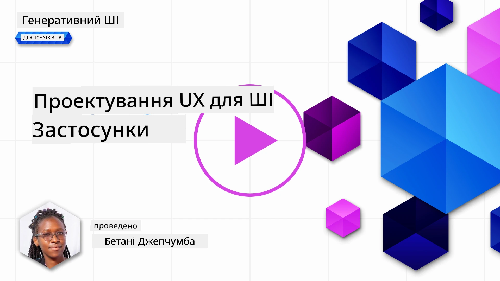
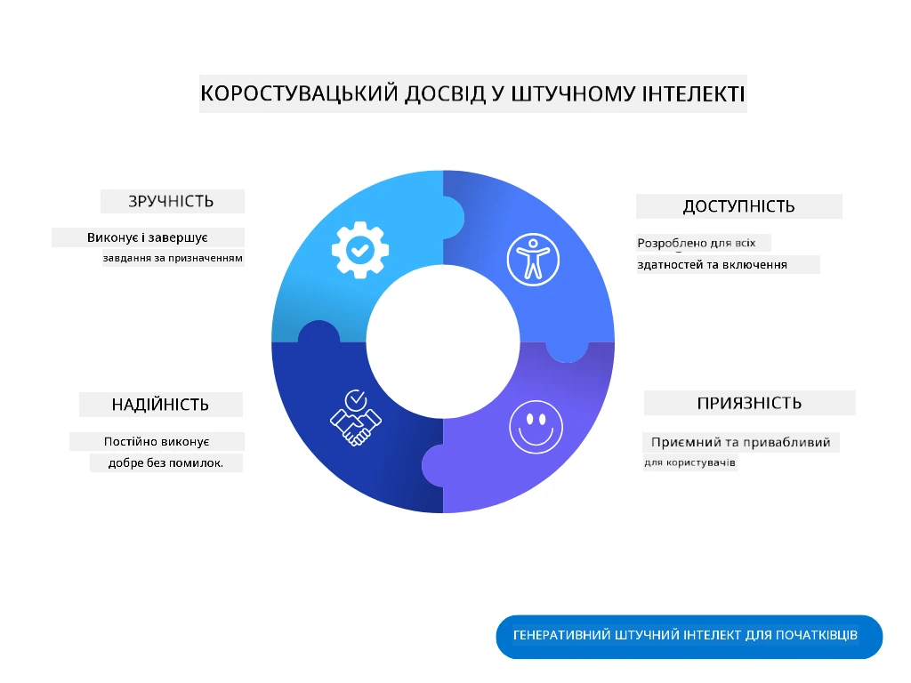
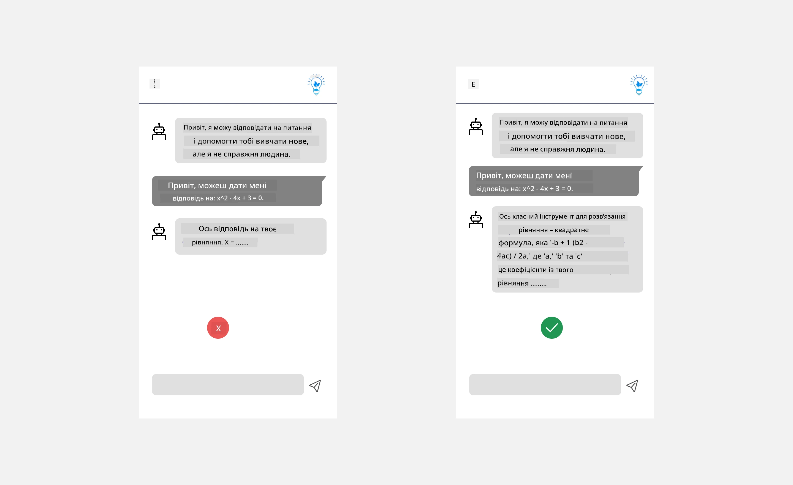
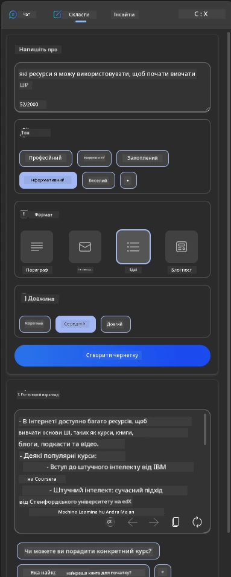
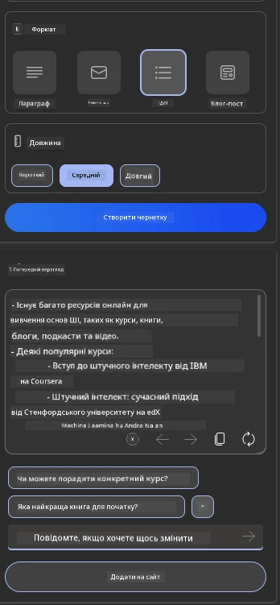
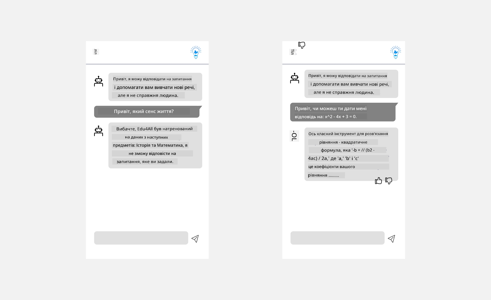

# Проєктування UX для AI-застосунків

> _(Натисніть на зображення вище, щоб переглянути відео цього уроку)_

Користувацький досвід — це дуже важливий аспект створення застосунків. Користувачі повинні мати можливість ефективно використовувати ваш застосунок для виконання завдань. Бути ефективним — це одна справа, але також потрібно проєктувати застосунки так, щоб ними могли користуватися всі, тобто зробити їх _доступними_. Цей розділ буде зосереджений на цій темі, тож сподіваємося, ви створите застосунок, яким люди зможуть і захочуть користуватися.

## Вступ

Користувацький досвід — це те, як користувач взаємодіє та використовує конкретний продукт або послугу, будь то система, інструмент або дизайн. Розробляючи AI-застосунки, розробники зосереджуються не лише на тому, щоб користувацький досвід був ефективним, а й етичним. У цьому уроці ми розглянемо, як створювати застосунки штучного інтелекту (AI), які відповідають потребам користувачів.

Урок охоплює такі теми:

- Вступ до користувацького досвіду та розуміння потреб користувачів
- Проєктування AI-застосунків для довіри та прозорості
- Проєктування AI-застосунків для співпраці та зворотного зв’язку

## Навчальні цілі

Після цього уроку ви зможете:

- Розуміти, як створювати AI-застосунки, що відповідають потребам користувачів.
- Проєктувати AI-застосунки, які сприяють довірі та співпраці.

### Передумови

Приділіть час і прочитайте більше про [користувацький досвід та дизайн мислення.](https://learn.microsoft.com/training/modules/ux-design?WT.mc_id=academic-105485-koreyst)

## Вступ до користувацького досвіду та розуміння потреб користувачів

У нашому вигаданому освітньому стартапі є дві основні категорії користувачів: вчителі та студенти. Кожен із цих користувачів має унікальні потреби. Орієнтоване на користувача проєктування ставить користувача на першому місці, забезпечуючи, щоб продукти були релевантними та корисними для тих, для кого вони призначені.

Застосунок має бути **корисним, надійним, доступним і приємним**, щоб забезпечити хороший користувацький досвід.

### Зручність використання

Бути корисним означає, що застосунок має функціональність, яка відповідає його призначенню, наприклад, автоматизація процесу оцінювання або створення флеш-карток для повторення. Застосунок, який автоматизує оцінювання, повинен точно та ефективно ставити оцінки роботам студентів на основі заздалегідь визначених критеріїв. Аналогічно, застосунок, який створює навчальні флеш-картки, повинен мати змогу генерувати релевантні та різноманітні запитання на основі своїх даних.

### Надійність

Бути надійним означає, що застосунок може виконувати свої завдання послідовно і без помилок. Проте AI, як і люди, не є досконалим і може бути схильним до помилок. Застосунки можуть стикатися з помилками або несподіваними ситуаціями, які потребують втручання або корекції людиною. Як ви обробляєте помилки? У останньому розділі цього уроку ми розглянемо, як AI-системи та застосунки проєктують для співпраці та зворотного зв’язку.

### Доступність

Бути доступним означає розширення користувацького досвіду для користувачів із різними можливостями, включно з людьми з інвалідністю, забезпечуючи, щоб ніхто не був виключений. Дотримуючись рекомендацій та принципів доступності, AI-рішення стають більш інклюзивними, зручними та корисними для всіх користувачів.

### Приємність

Бути приємним означає, що застосунок приносить задоволення під час використання. Привабливий користувацький досвід може позитивно впливати на користувача, спонукаючи його повертатися до застосунку й збільшуючи дохід бізнесу.

Не кожну задачу можна розв’язати за допомогою AI. AI допомагає доповнити користувацький досвід, наприклад, автоматизуючи ручні завдання або персоналізуючи взаємодію користувача.

## Проєктування AI-застосунків для довіри та прозорості

Встановлення довіри має вирішальне значення при проєктуванні AI-застосунків. Довіра гарантує, що користувач упевнений: застосунок виконає роботу, стабільно надаватиме результати, і результати будуть відповідати потребам користувача. Ризиком у цій сфері є недовіра або надмірна довіра. Недовіра виникає, коли користувач має мало або зовсім не має довіри до AI-системи, що призводить до відмови від вашого застосунку. Надмірна довіра виникає, коли користувач переоцінює можливості AI-системи, що призводить до надмірної довіри користувачів до AI. Наприклад, автоматизована система оцінювання у разі надмірної довіри може призвести до того, що вчитель не перевірятиме деякі роботи, щоб упевнитися в коректності оцінювання. Це може спричинити несправедливі або неточні оцінки для студентів або пропуск можливостей для зворотного зв’язку і покращення.

Два способи забезпечити довіру в центрі дизайну — це пояснюваність і контроль.

### Пояснюваність

Коли AI допомагає ухвалювати рішення, наприклад, для передачі знань наступним поколінням, вкрай важливо, щоб вчителі та батьки розуміли, як ухвалюються рішення AI. Це пояснюваність — розуміння, як AI-застосунки приймають рішення. Проєктування з урахуванням пояснюваності включає додавання деталей, які висвітлюють, як AI дійшов до результату. Аудиторія має знати, що результат генерується AI, а не людиною. Наприклад, замість "Почніть спілкуватися з вашим наставником зараз" кажіть "Використовуйте AI-наставника, який адаптується до ваших потреб і допомагає навчатися у вашому темпі."

Ще один приклад — як AI використовує дані користувача та особисті дані. Наприклад, користувач із персоною студента може мати обмеження відповідно до своєї персони. AI може не розкривати відповіді на запитання, але допомагати спрямовувати користувача до обдумування способів розв’язання задачі.

Останньою важливою частиною пояснюваності є спрощення пояснень. Студенти і вчителі можуть не бути експертами з AI, тож пояснення про те, що застосунок може чи не може робити, мають бути спрощеними та легкими для розуміння.

### Контроль

Генеративний AI створює співпрацю між AI і користувачем, де, наприклад, користувач може змінювати підказки для отримання різних результатів. Крім того, після генерації результату користувачі повинні мати змогу змінювати результати, що дає їм відчуття контролю. Наприклад, у Bing ви можете налаштовувати підказку за форматом, тоном і довжиною. Також можна додавати зміни до вашого результату і редагувати його, як показано нижче:

Ще однією функцією Bing, яка дає користувачу контроль над застосунком, є можливість вибору: долучатися або відмовлятися від даних, які AI використовує. Для шкільного застосунку студент може захотіти використовувати свої нотатки, а також матеріали вчителів як навчальний матеріал.

> При проєктуванні AI-застосунків навмисність є ключовою для того, щоб користувачі не переоцінювали можливості та не заводилися нереалістичними очікуваннями. Один зі способів зробити це — створити опір між підказками і результатами. Нагадувати користувачу, що це AI, а не інша людина

## Проєктування AI-застосунків для співпраці та зворотного зв’язку

Як уже згадувалося, генеративний AI створює співпрацю між користувачем і AI. Переважно взаємодія відбувається так: користувач вводить підказку, а AI генерує результат. Що якщо результат неправильний? Як застосунок обробляє помилки, якщо вони виникають? Винен AI користувача чи витрачає час на пояснення помилки?

AI-застосунки мають бути побудовані для отримання і надання зворотного зв’язку. Це не лише допомагає покращувати AI-систему, а й зміцнює довіру користувачів. Петля зворотного зв’язку має бути включена до дизайну, прикладом може бути просте схвалення чи несхвалення результату нажатием на піктограму лайка або дизлайка.

Ще один підхід полягає у чіткому повідомленні про можливості та обмеження системи. Коли користувач робить помилку, запитуючи щось за межами можливостей AI, повинна бути можливість обробки такого запиту, як показано нижче.

Системні помилки є поширеними у застосунках, коли користувачу може знадобитися допомога з інформацією за межами сфери AI або якщо застосунок має обмеження на кількість запитань/предметів для генерування резюме. Наприклад, AI-застосунок, навчений на обмеженому наборі предметів, наприклад історії та математики, може не справлятися із запитаннями з географії. Щоб пом’якшити це, AI-система може відповісти: "Вибачте, наш продукт навчений з даними з наступних предметів..., я не можу відповісти на ваше запитання."

AI-застосунки неідеальні і можуть допускати помилки. При проєктуванні застосунків варто передбачати можливість отримання зворотного зв’язку від користувачів та обробки помилок у простій та зрозумілій формі.

## Завдання

Візьміть будь-який AI-застосунок, який ви створили до цього, і розгляньте можливість впровадження таких кроків у ваш застосунок:

- **Приємність:** Подумайте, як зробити застосунок приємнішим. Чи додаєте ви пояснення всюди? Чи заохочуєте користувача до дослідження? Як ви формулюєте повідомлення про помилки?

- **Зручність використання:** Створюєте вебзастосунок? Переконайтеся, що ним можна керувати і за допомогою миші, і клавіатури.

- **Довіра і прозорість:** Не довіряйте AI та його результатам повністю, подумайте, як можна додати людину в процес для перевірки результатів. Також розгляньте й реалізуйте інші способи забезпечення довіри й прозорості.

- **Контроль:** Надайте користувачу контроль над даними, які він надає застосунку. Впровадьте можливість користувачу долучатися або відмовлятися від збору даних у AI-застосунку.

<!-- ## [Post-lecture quiz](../../../12-designing-ux-for-ai-applications/quiz-url) -->

## Продовжуйте навчання!

Після завершення цього уроку перегляньте нашу [колекцію навчальних матеріалів з генеративного AI](https://aka.ms/genai-collection?WT.mc_id=academic-105485-koreyst), щоб і надалі розвивати свої знання про генеративний AI!

Переходьте до Уроку 13, де ми розглянемо, як [захищати AI-застосунки](../13-securing-ai-applications/README.md?WT.mc_id=academic-105485-koreyst)!

---

<!-- CO-OP TRANSLATOR DISCLAIMER START -->
**Відмова від відповідальності**:
Цей документ було перекладено за допомогою сервісу штучного інтелекту для перекладу [Co-op Translator](https://github.com/Azure/co-op-translator). Хоча ми прагнемо до точності, будь ласка, майте на увазі, що автоматичні переклади можуть містити помилки або неточності. Оригінальний документ рідною мовою слід вважати авторитетним джерелом. Для критично важливої інформації рекомендується професійний людський переклад. Ми не несемо відповідальності за будь-які непорозуміння або неправильні тлумачення, що виникли внаслідок використання цього перекладу.
<!-- CO-OP TRANSLATOR DISCLAIMER END -->