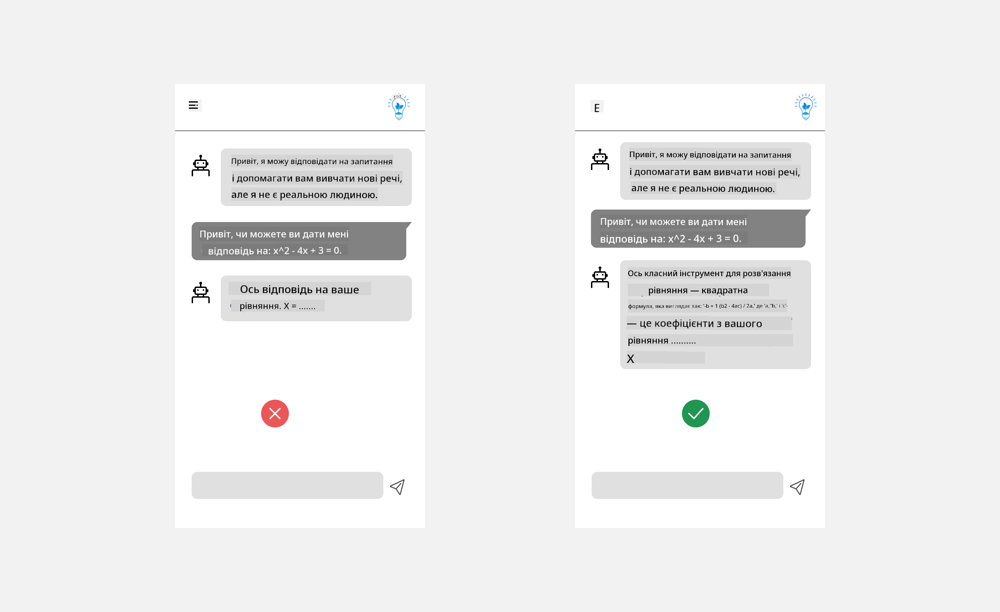
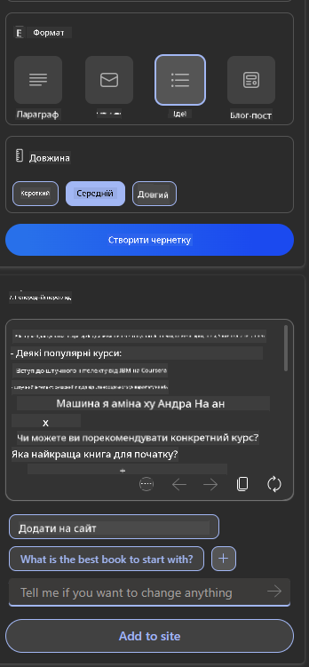

<!--
CO_OP_TRANSLATOR_METADATA:
{
  "original_hash": "747668e4c53d067369f06e9ec2e6313e",
  "translation_date": "2025-08-26T20:12:57+00:00",
  "source_file": "12-designing-ux-for-ai-applications/README.md",
  "language_code": "uk"
}
-->
# Проєктування UX для AI-додатків

> _(Натисніть на зображення вище, щоб переглянути відео цього уроку)_

Досвід користувача — це дуже важливий аспект створення додатків. Користувачі мають змогу ефективно виконувати завдання у вашому додатку. Ефективність — це добре, але потрібно також подбати, щоб додаток був зручним для всіх, тобто _доступним_. У цьому розділі ми зосередимося саме на цьому, щоб ви змогли створити додаток, яким люди захочуть користуватися.

## Вступ

Досвід користувача — це те, як людина взаємодіє з певним продуктом чи сервісом: системою, інструментом або дизайном. Під час розробки AI-додатків розробники зосереджуються не лише на ефективності, а й на етичності досвіду користувача. У цьому уроці ми розглянемо, як створювати додатки зі штучним інтелектом (AI), які відповідають потребам користувачів.

Урок охоплює такі теми:

- Вступ до досвіду користувача та розуміння потреб користувачів
- Проєктування AI-додатків для довіри та прозорості
- Проєктування AI-додатків для співпраці та зворотного зв’язку

## Цілі навчання

Після проходження цього уроку ви зможете:

- Розуміти, як створювати AI-додатки, що відповідають потребам користувачів.
- Проєктувати AI-додатки, які сприяють довірі та співпраці.

### Передумови

Виділіть час і ознайомтеся з [досвідом користувача та дизайн-мисленням.](https://learn.microsoft.com/training/modules/ux-design?WT.mc_id=academic-105485-koreyst)

## Вступ до досвіду користувача та розуміння потреб користувачів

У нашому вигаданому освітньому стартапі є дві основні групи користувачів: викладачі та студенти. Кожна з них має свої унікальні потреби. Дизайн, орієнтований на користувача, ставить користувача в центр, щоб продукт був корисним саме для тих, для кого він створений.

Додаток має бути **корисним, надійним, доступним і приємним**, щоб забезпечити гарний досвід користувача.

### Зручність використання

Корисність означає, що додаток має функціонал, який відповідає його призначенню, наприклад, автоматизація оцінювання чи створення карток для повторення матеріалу. Додаток, який автоматизує оцінювання, повинен точно та швидко виставляти оцінки за заданими критеріями. Аналогічно, додаток для створення карток має генерувати релевантні та різноманітні питання на основі своїх даних.

### Надійність

Надійність означає, що додаток стабільно виконує свої завдання без помилок. Але AI, як і люди, не ідеальний і може помилятися. Додатки можуть стикатися з помилками чи неочікуваними ситуаціями, які потребують втручання людини. Як ви будете обробляти помилки? У останньому розділі цього уроку ми розглянемо, як AI-системи та додатки проєктують для співпраці та зворотного зв’язку.

### Доступність

Доступність — це розширення досвіду користувача для людей з різними можливостями, зокрема для людей з інвалідністю, щоб ніхто не залишився осторонь. Дотримуючись принципів доступності, AI-рішення стають більш інклюзивними, зручними та корисними для всіх.

### Приємність

Приємність — це коли додатком приємно користуватися. Гарний досвід користувача позитивно впливає на людину, мотивує повертатися до додатку та збільшує дохід бізнесу.

Не всі проблеми можна вирішити за допомогою AI. AI допомагає покращити досвід користувача, наприклад, автоматизуючи рутинні завдання чи персоналізуючи взаємодію.

## Проєктування AI-додатків для довіри та прозорості

Побудова довіри — ключовий момент у проєктуванні AI-додатків. Довіра дає користувачу впевненість, що додаток виконає роботу, стабільно видаватиме результати, і ці результати відповідатимуть потребам. Ризики тут — це недовіра та надмірна довіра. Недовіра виникає, коли користувач не довіряє AI-системі, і тоді він відмовляється від додатку. Надмірна довіра — це коли користувач переоцінює можливості AI, надто покладається на нього. Наприклад, автоматизована система оцінювання при надмірній довірі може призвести до того, що викладач не перевіряє роботи, і це може спричинити несправедливі чи неточні оцінки або втрату можливості для зворотного зв’язку.

Два способи поставити довіру в центр дизайну — це пояснюваність і контроль.

### Пояснюваність

Коли AI допомагає приймати рішення, наприклад, у навчанні майбутніх поколінь, важливо, щоб викладачі та батьки розуміли, як AI приймає рішення. Це і є пояснюваність — розуміння, як AI-додатки приймають рішення. Дизайн із поясненнями включає деталі, які показують, як AI отримав результат. Користувач має знати, що результат створено AI, а не людиною. Наприклад, замість "Почніть спілкування з вашим репетитором" краще сказати "Використовуйте AI-репетитора, який підлаштовується під ваші потреби та допомагає навчатися у вашому темпі."

Ще один приклад — як AI використовує персональні дані користувача. Наприклад, студент може мати обмеження через свою роль. AI не може просто видати відповіді на питання, але може допомогти користувачу розібратися, як вирішити задачу.

Ще один важливий аспект пояснюваності — це простота пояснень. Студенти та викладачі можуть не бути експертами з AI, тому пояснення мають бути простими та зрозумілими.

### Контроль

Генеративний AI створює співпрацю між AI і користувачем, наприклад, користувач може змінювати запити для різних результатів. Крім того, після отримання результату користувач має змогу його змінити, що дає відчуття контролю. Наприклад, у Bing ви можете налаштувати запит за форматом, тоном і довжиною. Також можна змінити результат, як показано нижче:

Ще одна функція Bing, яка дає користувачу контроль над додатком — це можливість погоджуватися або відмовлятися від використання даних AI. Для шкільного додатку студент може використовувати свої нотатки та матеріали викладача для повторення.

> Під час проєктування AI-додатків важливо не допускати надмірної довіри та завищених очікувань щодо можливостей AI. Один із способів — створити певне "тертя" між запитами та результатами, нагадуючи користувачу, що це AI, а не людина.

## Проєктування AI-додатків для співпраці та зворотного зв’язку

Як вже згадувалося, генеративний AI створює співпрацю між користувачем і AI. Зазвичай користувач вводить запит, а AI генерує результат. А якщо результат неправильний? Як додаток обробляє помилки? Чи AI звинувачує користувача, чи пояснює причину помилки?

AI-додатки мають бути здатними отримувати та надавати зворотний зв’язок. Це допомагає не лише вдосконалювати AI-систему, а й зміцнює довіру користувачів. У дизайні слід передбачити механізм зворотного зв’язку, наприклад, простий лайк чи дизлайк для результату.

Ще один спосіб — чітко повідомляти про можливості та обмеження системи. Якщо користувач помиляється, запитуючи щось поза межами можливостей AI, має бути спосіб це обробити, як показано нижче.

Системні помилки — поширене явище, коли користувачу потрібна інформація поза межами можливостей AI, або додаток має обмеження щодо кількості питань чи предметів для створення резюме. Наприклад, AI-додаток, навчений лише на даних з історії та математики, не зможе відповісти на питання з географії. Щоб уникнути непорозумінь, AI може відповісти: "Вибачте, наш продукт навчений на даних з таких предметів..., я не можу відповісти на ваше питання."

AI-додатки не ідеальні, вони можуть помилятися. Тому при проєктуванні додатків слід передбачити можливість для зворотного зв’язку та просту, зрозумілу обробку помилок.

## Завдання

Візьміть будь-який AI-додаток, який ви вже створили, і спробуйте реалізувати наступні кроки:

- **Приємність:** Подумайте, як зробити ваш додаток більш приємним. Чи всюди є пояснення? Чи мотивуєте ви користувача досліджувати додаток? Як ви формулюєте повідомлення про помилки?

- **Зручність використання:** Якщо створюєте веб-додаток, переконайтеся, що ним можна користуватися як мишкою, так і клавіатурою.

- **Довіра та прозорість:** Не покладайтеся повністю на AI та його результати, подумайте, як додати людину для перевірки результату. Також реалізуйте інші способи забезпечення довіри та прозорості.

- **Контроль:** Дайте користувачу контроль над даними, які він надає додатку. Реалізуйте можливість погоджуватися або відмовлятися від збору даних у AI-додатку.

## Продовжуйте навчання!

Після проходження цього уроку перегляньте нашу [колекцію навчальних матеріалів з генеративного AI](https://aka.ms/genai-collection?WT.mc_id=academic-105485-koreyst), щоб продовжити поглиблювати свої знання!

Переходьте до уроку 13, де ми розглянемо, як [захищати AI-додатки](../13-securing-ai-applications/README.md?WT.mc_id=academic-105485-koreyst)!

---

**Відмова від відповідальності**:  
Цей документ було перекладено за допомогою сервісу автоматичного перекладу [Co-op Translator](https://github.com/Azure/co-op-translator). Хоча ми прагнемо до точності, звертаємо вашу увагу, що автоматичний переклад може містити помилки або неточності. Оригінальний документ мовою оригіналу слід вважати авторитетним джерелом. Для критично важливої інформації рекомендується професійний людський переклад. Ми не несемо відповідальності за будь-які непорозуміння або неправильне тлумачення, що виникли внаслідок використання цього перекладу.