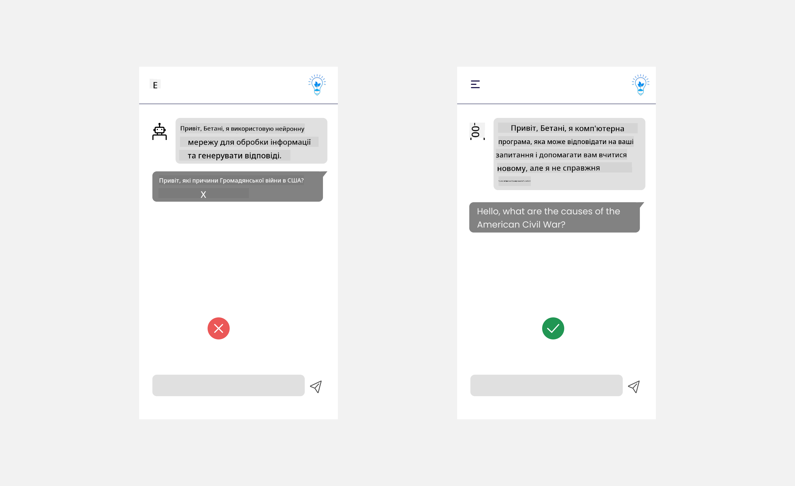

<!--
CO_OP_TRANSLATOR_METADATA:
{
  "original_hash": "ec385b41ee50579025d50cc03bfb3a25",
  "translation_date": "2025-07-09T15:07:59+00:00",
  "source_file": "12-designing-ux-for-ai-applications/README.md",
  "language_code": "uk"
}
-->
# Проєктування UX для AI-додатків

> _(Натисніть на зображення вище, щоб переглянути відео цього уроку)_

Користувацький досвід — це дуже важливий аспект створення додатків. Користувачі повинні мати змогу ефективно використовувати ваш додаток для виконання завдань. Бути ефективним — це одне, але також потрібно проєктувати додатки так, щоб ними могли користуватися всі, роблячи їх _доступними_. Цей розділ зосередиться на цій темі, щоб ви в результаті створили додаток, який люди зможуть і захочуть використовувати.

## Вступ

Користувацький досвід — це те, як користувач взаємодіє з певним продуктом або послугою, будь то система, інструмент чи дизайн. Під час розробки AI-додатків розробники зосереджуються не лише на тому, щоб користувацький досвід був ефективним, а й етичним. У цьому уроці ми розглянемо, як створювати додатки штучного інтелекту (AI), які відповідають потребам користувачів.

Урок охопить такі теми:

- Вступ до користувацького досвіду та розуміння потреб користувачів
- Проєктування AI-додатків для довіри та прозорості
- Проєктування AI-додатків для співпраці та зворотного зв’язку

## Цілі навчання

Після проходження цього уроку ви зможете:

- Розуміти, як створювати AI-додатки, що відповідають потребам користувачів.
- Проєктувати AI-додатки, які сприяють довірі та співпраці.

### Передумови

Приділіть час і прочитайте більше про [користувацький досвід та дизайн-мислення.](https://learn.microsoft.com/training/modules/ux-design?WT.mc_id=academic-105485-koreyst)

## Вступ до користувацького досвіду та розуміння потреб користувачів

У нашому вигаданому освітньому стартапі є дві основні групи користувачів — вчителі та учні. Кожна з цих груп має унікальні потреби. Орієнтований на користувача дизайн ставить користувача на перше місце, забезпечуючи, що продукти є релевантними та корисними для тих, для кого вони призначені.

Додаток має бути **корисним, надійним, доступним і приємним** для забезпечення хорошого користувацького досвіду.

### Зручність використання

Бути корисним означає, що додаток має функціонал, який відповідає його призначенню, наприклад, автоматизація процесу оцінювання або створення флешкарток для повторення матеріалу. Додаток, який автоматизує оцінювання, повинен точно і ефективно виставляти бали за роботи учнів на основі заздалегідь визначених критеріїв. Аналогічно, додаток, що генерує флешкартки для повторення, має створювати релевантні та різноманітні запитання на основі своїх даних.

### Надійність

Бути надійним означає, що додаток може послідовно виконувати свої завдання без помилок. Однак AI, як і люди, не є досконалим і може допускати помилки. Додатки можуть стикатися з помилками або непередбаченими ситуаціями, які потребують втручання або корекції людиною. Як ви обробляєте помилки? У останньому розділі цього уроку ми розглянемо, як AI-системи та додатки проєктуються для співпраці та зворотного зв’язку.

### Доступність

Бути доступним означає розширювати користувацький досвід для користувачів з різними можливостями, включно з людьми з інвалідністю, щоб ніхто не залишався поза увагою. Дотримуючись принципів і рекомендацій з доступності, AI-рішення стають більш інклюзивними, зручними та корисними для всіх користувачів.

### Приємність

Бути приємним означає, що додаток приємно використовувати. Привабливий користувацький досвід може позитивно впливати на користувача, заохочуючи його повертатися до додатка та збільшуючи прибуток бізнесу.

Не кожну проблему можна вирішити за допомогою AI. AI допомагає покращити ваш користувацький досвід, автоматизуючи ручні завдання або персоналізуючи взаємодію.

## Проєктування AI-додатків для довіри та прозорості

Побудова довіри є критично важливою при проєктуванні AI-додатків. Довіра гарантує, що користувач впевнений, що додаток виконає роботу, стабільно надаватиме результати, і ці результати відповідають його потребам. Ризики в цій сфері — це недовіра та надмірна довіра. Недовіра виникає, коли користувач майже не довіряє AI-системі, що призводить до відмови від вашого додатка. Надмірна довіра виникає, коли користувач переоцінює можливості AI-системи, що призводить до надмірної довіри. Наприклад, у випадку надмірної довіри до автоматизованої системи оцінювання вчитель може не перевіряти деякі роботи, щоб переконатися, що система працює правильно. Це може призвести до несправедливих або неточних оцінок для учнів або втрати можливостей для зворотного зв’язку та покращення.

Два способи забезпечити, щоб довіра була в центрі дизайну — це пояснюваність і контроль.

### Пояснюваність

Коли AI допомагає приймати рішення, наприклад, передавати знання майбутнім поколінням, важливо, щоб вчителі та батьки розуміли, як приймаються рішення AI. Це і є пояснюваність — розуміння того, як AI-додатки приймають рішення. Проєктування з урахуванням пояснюваності включає додавання прикладів того, що може робити AI-додаток. Наприклад, замість "Почніть з AI-вчителя" система може використовувати: "Підсумуйте свої нотатки для легшого повторення за допомогою AI."

Інший приклад — як AI використовує дані користувача та персональні дані. Наприклад, користувач із роллю студента може мати обмеження, пов’язані з його роллю. AI може не розкривати відповіді на запитання, але може допомогти користувачу подумати, як розв’язати проблему.

Останній ключовий аспект пояснюваності — спрощення пояснень. Учні та вчителі можуть не бути експертами в AI, тому пояснення того, що додаток може або не може робити, мають бути простими та зрозумілими.

### Контроль

Генеративний AI створює співпрацю між AI та користувачем, де, наприклад, користувач може змінювати запити для отримання різних результатів. Крім того, після генерації результату користувачі повинні мати змогу змінювати його, отримуючи відчуття контролю. Наприклад, у Bing ви можете налаштовувати запит за форматом, тоном і довжиною. Також можна вносити зміни у результат і редагувати його, як показано нижче:

Ще одна функція Bing, що дає користувачу контроль над додатком, — це можливість погоджуватися або відмовлятися від використання даних AI. Для шкільного додатка учень може захотіти використовувати свої нотатки, а також ресурси вчителів як матеріал для повторення.

> При проєктуванні AI-додатків важливо свідомо уникати надмірної довіри, щоб не створювати нереалістичних очікувань щодо їх можливостей. Один зі способів — створити певне тертя між запитами і результатами, нагадуючи користувачу, що це AI, а не інша людина.

## Проєктування AI-додатків для співпраці та зворотного зв’язку

Як уже згадувалося, генеративний AI створює співпрацю між користувачем і AI. Зазвичай користувач вводить запит, а AI генерує результат. Що, якщо результат неправильний? Як додаток обробляє помилки, якщо вони трапляються? Чи звинувачує AI користувача, чи пояснює помилку?

AI-додатки мають бути створені для отримання та надання зворотного зв’язку. Це не лише допомагає системі AI покращуватися, а й будує довіру з користувачами. У дизайні має бути передбачений цикл зворотного зв’язку, наприклад, просте схвалення або несхвалення результату.

Ще один спосіб — чітко комунікувати можливості та обмеження системи. Якщо користувач робить помилку, запитуючи щось поза межами можливостей AI, має бути спосіб це обробити, як показано нижче.

Системні помилки поширені у додатках, де користувачу може знадобитися допомога з інформацією поза межами AI, або додаток може мати обмеження на кількість запитань/предметів, для яких можна створювати підсумки. Наприклад, AI-додаток, навчений на обмеженій кількості предметів, наприклад, історії та математики, може не впоратися з питаннями з географії. Щоб пом’якшити це, AI-система може відповісти так: "Вибачте, наш продукт навчений на даних з таких предметів..., я не можу відповісти на ваше запитання."

AI-додатки не ідеальні, тому вони можуть помилятися. При проєктуванні додатків слід передбачити можливість отримання зворотного зв’язку від користувачів і обробки помилок у простий і зрозумілий спосіб.

## Завдання

Візьміть будь-які AI-додатки, які ви створили досі, і розгляньте можливість впровадження наступних кроків у вашому додатку:

- **Приємність:** Подумайте, як зробити ваш додаток приємнішим. Чи додаєте ви пояснення скрізь? Чи заохочуєте користувача досліджувати? Як ви формулюєте повідомлення про помилки?

- **Зручність використання:** Створюючи веб-додаток, переконайтеся, що ним можна керувати як мишею, так і клавіатурою.

- **Довіра та прозорість:** Не довіряйте AI і його результатам повністю, подумайте, як додати людину до процесу для перевірки результатів. Також розгляньте й впровадьте інші способи забезпечення довіри та прозорості.

- **Контроль:** Дайте користувачу контроль над даними, які він надає додатку. Реалізуйте можливість користувачу погоджуватися або відмовлятися від збору даних у AI-додатку.

## Продовжуйте навчання!

Після завершення цього уроку ознайомтеся з нашою [колекцією навчальних матеріалів з генеративного AI](https://aka.ms/genai-collection?WT.mc_id=academic-105485-koreyst), щоб продовжити підвищувати свої знання з генеративного AI!

Перейдіть до Уроку 13, де ми розглянемо, як [забезпечити безпеку AI-додатків](../13-securing-ai-applications/README.md?WT.mc_id=academic-105485-koreyst)!

**Відмова від відповідальності**:  
Цей документ було перекладено за допомогою сервісу автоматичного перекладу [Co-op Translator](https://github.com/Azure/co-op-translator). Хоча ми прагнемо до точності, будь ласка, майте на увазі, що автоматичні переклади можуть містити помилки або неточності. Оригінальний документ рідною мовою слід вважати авторитетним джерелом. Для критично важливої інформації рекомендується звертатися до професійного людського перекладу. Ми не несемо відповідальності за будь-які непорозуміння або неправильні тлумачення, що виникли внаслідок використання цього перекладу.