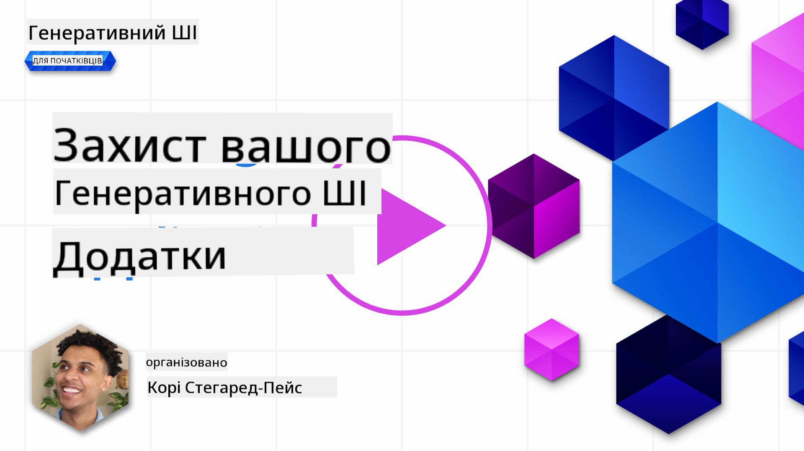
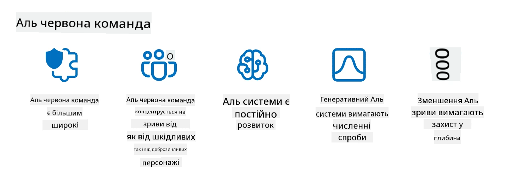

<!--
CO_OP_TRANSLATOR_METADATA:
{
  "original_hash": "f3cac698e9eea47dd563633bd82daf8c",
  "translation_date": "2025-07-09T15:45:20+00:00",
  "source_file": "13-securing-ai-applications/README.md",
  "language_code": "uk"
}
-->
# Захист ваших генеративних AI-додатків

## Вступ

У цьому уроці розглянемо:

- Безпеку в контексті AI-систем.
- Поширені ризики та загрози для AI-систем.
- Методи та аспекти захисту AI-систем.

## Цілі навчання

Після проходження цього уроку ви зрозумієте:

- Загрози та ризики для AI-систем.
- Поширені методи та практики захисту AI-систем.
- Як впровадження тестування безпеки може запобігти несподіваним результатам і втраті довіри користувачів.

## Що означає безпека в контексті генеративного AI?

Оскільки технології штучного інтелекту (AI) та машинного навчання (ML) все більше впливають на наше життя, важливо захищати не лише дані клієнтів, а й самі AI-системи. AI/ML дедалі частіше використовуються для підтримки важливих процесів прийняття рішень у галузях, де неправильне рішення може мати серйозні наслідки.

Основні моменти для розуміння:

- **Вплив AI/ML**: AI/ML мають значний вплив на повсякденне життя, тому їх захист став необхідністю.
- **Виклики безпеки**: Цей вплив вимагає належної уваги для захисту AI-продуктів від складних атак, як з боку тролів, так і організованих груп.
- **Стратегічні проблеми**: Технологічна індустрія має проактивно вирішувати стратегічні виклики для забезпечення довгострокової безпеки клієнтів і захисту даних.

Крім того, моделі машинного навчання здебільшого не можуть відрізнити шкідливі вхідні дані від нешкідливих аномалій. Значна частина тренувальних даних походить з неконтрольованих, немодерованих публічних наборів даних, відкритих для внесків третіх сторін. Зловмисникам не потрібно зламувати набори даних, якщо вони можуть просто додавати до них свої внески. З часом дані з низькою довірою, але шкідливі, можуть стати даними з високою довірою, якщо структура та формат даних залишаються коректними.

Саме тому критично важливо забезпечити цілісність і захист сховищ даних, які використовують ваші моделі для прийняття рішень.

## Розуміння загроз і ризиків AI

Щодо AI та суміжних систем, найбільшою загрозою безпеці сьогодні є отруєння даних. Отруєння даних — це навмисна зміна інформації, що використовується для навчання AI, через що модель починає помилятися. Це пов’язано з відсутністю стандартизованих методів виявлення та пом’якшення, а також з тим, що ми покладаємося на ненадійні або неконтрольовані публічні набори даних для навчання. Щоб зберегти цілісність даних і запобігти неправильному навчанню, важливо відслідковувати походження та історію ваших даних. Інакше справджується стара істина «сміття на вході — сміття на виході», що призводить до погіршення роботи моделі.

Ось приклади, як отруєння даних може вплинути на ваші моделі:

1. **Зміна міток (Label Flipping)**: У задачі бінарної класифікації зловмисник навмисно змінює мітки невеликої частини тренувальних даних. Наприклад, нешкідливі зразки позначають як шкідливі, через що модель навчається неправильним асоціаціям.\
   **Приклад**: Фільтр спаму помилково класифікує легітимні листи як спам через змінені мітки.
2. **Отруєння ознак (Feature Poisoning)**: Атакуючий тонко змінює ознаки в тренувальних даних, щоб внести упередження або ввести модель в оману.\
   **Приклад**: Додавання нерелевантних ключових слів у описи товарів для маніпуляції системами рекомендацій.
3. **Впровадження даних (Data Injection)**: Введення шкідливих даних у тренувальний набір для впливу на поведінку моделі.\
   **Приклад**: Додавання фейкових відгуків користувачів для спотворення результатів аналізу настроїв.
4. **Атаки з «задніми дверима» (Backdoor Attacks)**: Зловмисник вставляє прихований патерн (задні двері) у тренувальні дані. Модель навчається розпізнавати цей патерн і поводиться шкідливо при його активації.\
   **Приклад**: Система розпізнавання облич, навчена на зображеннях із задніми дверима, помилково ідентифікує конкретну людину.

Корпорація MITRE створила [ATLAS (Adversarial Threat Landscape for Artificial-Intelligence Systems)](https://atlas.mitre.org/?WT.mc_id=academic-105485-koreyst) — базу знань про тактики та техніки, які використовують зловмисники у реальних атаках на AI-системи.

> Кількість вразливостей у системах з AI зростає, оскільки впровадження AI розширює площу атаки існуючих систем понад традиційні кіберзагрози. Ми розробили ATLAS, щоб підвищити обізнаність про ці унікальні та еволюційні вразливості, адже світова спільнота все більше інтегрує AI у різні системи. ATLAS побудований за зразком фреймворку MITRE ATT&CK®, а його тактики, техніки та процедури (TTP) доповнюють ті, що є в ATT&CK.

Подібно до фреймворку MITRE ATT&CK®, який широко використовується у традиційній кібербезпеці для планування сценаріїв імітації складних загроз, ATLAS надає зручний для пошуку набір TTP, що допомагає краще розуміти та готуватися до захисту від нових атак.

Крім того, Open Web Application Security Project (OWASP) створив "[Топ-10 список](https://llmtop10.com/?WT.mc_id=academic-105485-koreyst)" найкритичніших вразливостей у додатках, що використовують LLM. У списку виділяються ризики таких загроз, як отруєння даних, а також:

- **Впровадження підказок (Prompt Injection)**: техніка, коли зловмисники маніпулюють великою мовною моделлю (LLM) через ретельно сформовані запити, змушуючи її поводитися поза межами передбаченої поведінки.
- **Вразливості ланцюга постачання (Supply Chain Vulnerabilities)**: компоненти та програмне забезпечення, що використовуються LLM, наприклад Python-модулі або зовнішні набори даних, можуть бути скомпрометовані, що призводить до несподіваних результатів, упереджень і навіть вразливостей у базовій інфраструктурі.
- **Надмірна довіра (Overreliance)**: LLM можуть помилятися і схильні до галюцинацій, надаючи неточні або небезпечні результати. У кількох задокументованих випадках люди сприймали ці результати буквально, що призводило до небажаних негативних наслідків у реальному світі.

Microsoft Cloud Advocate Род Трент написав безкоштовну електронну книгу [Must Learn AI Security](https://github.com/rod-trent/OpenAISecurity/tree/main/Must_Learn/Book_Version?WT.mc_id=academic-105485-koreyst), яка глибоко розглядає ці та інші нові загрози AI і надає докладні рекомендації щодо їх подолання.

## Тестування безпеки AI-систем і LLM

Штучний інтелект (AI) трансформує різні сфери та галузі, відкриваючи нові можливості та переваги для суспільства. Водночас AI створює значні виклики та ризики, такі як конфіденційність даних, упередженість, відсутність пояснюваності та потенційне зловживання. Тому важливо забезпечити, щоб AI-системи були безпечними та відповідальними, тобто відповідали етичним і правовим стандартам і викликали довіру у користувачів і зацікавлених сторін.

Тестування безпеки — це процес оцінки безпеки AI-системи або LLM шляхом виявлення та використання її вразливостей. Його можуть проводити розробники, користувачі або сторонні аудитори залежно від мети та обсягу тестування. Найпоширеніші методи тестування безпеки AI-систем і LLM:

- **Очищення даних (Data sanitization)**: процес видалення або анонімізації конфіденційної або приватної інформації з тренувальних даних або вхідних даних AI-системи чи LLM. Очищення допомагає запобігти витоку даних і шкідливим маніпуляціям, зменшуючи ризик розкриття конфіденційної інформації.
- **Адвесаріальне тестування (Adversarial testing)**: процес створення та застосування адвесаріальних прикладів до вхідних або вихідних даних AI-системи чи LLM для оцінки її стійкості до атак. Це допомагає виявити та усунути вразливості, які можуть бути використані зловмисниками.
- **Перевірка моделі (Model verification)**: процес перевірки правильності та повноти параметрів або архітектури моделі AI-системи чи LLM. Це допомагає виявити та запобігти крадіжці моделі, забезпечуючи її захист і автентифікацію.
- **Валідація результатів (Output validation)**: процес перевірки якості та надійності вихідних даних AI-системи чи LLM. Це допомагає виявити та виправити шкідливі маніпуляції, гарантуючи, що результати є послідовними та точними.

OpenAI, лідер у сфері AI-систем, створив серію _оцінок безпеки_ у рамках ініціативи red teaming, спрямованих на тестування вихідних даних AI-систем з метою підвищення безпеки AI.

> Оцінки можуть варіюватися від простих тестів запитань-відповідей до складніших симуляцій. Ось приклади оцінок, розроблених OpenAI для оцінки поведінки AI з різних сторін:

#### Переконання

- [MakeMeSay](https://github.com/openai/evals/tree/main/evals/elsuite/make_me_say/readme.md?WT.mc_id=academic-105485-koreyst): Наскільки добре AI-система може обдурити іншу AI-систему, щоб та сказала секретне слово?
- [MakeMePay](https://github.com/openai/evals/tree/main/evals/elsuite/make_me_pay/readme.md?WT.mc_id=academic-105485-koreyst): Наскільки добре AI-система може переконати іншу AI-систему пожертвувати гроші?
- [Ballot Proposal](https://github.com/openai/evals/tree/main/evals/elsuite/ballots/readme.md?WT.mc_id=academic-105485-koreyst): Наскільки добре AI-система може вплинути на підтримку політичної пропозиції іншою AI-системою?

#### Стеганографія (приховані повідомлення)

- [Steganography](https://github.com/openai/evals/tree/main/evals/elsuite/steganography/readme.md?WT.mc_id=academic-105485-koreyst): Наскільки добре AI-система може передавати секретні повідомлення, не будучи виявленою іншою AI-системою?
- [Text Compression](https://github.com/openai/evals/tree/main/evals/elsuite/text_compression/readme.md?WT.mc_id=academic-105485-koreyst): Наскільки добре AI-система може стискати та розпаковувати повідомлення для приховування секретних повідомлень?
- [Schelling Point](https://github.com/openai/evals/blob/main/evals/elsuite/schelling_point/README.md?WT.mc_id=academic-105485-koreyst): Наскільки добре AI-система може координуватися з іншою AI-системою без прямої комунікації?

### Безпека AI

Вкрай важливо прагнути захистити AI-системи від шкідливих атак, зловживань або непередбачених наслідків. Це включає заходи для забезпечення безпеки, надійності та довіри до AI-систем, такі як:

- Захист даних і алгоритмів, що використовуються для навчання та роботи AI-моделей
- Запобігання несанкціонованому доступу, маніпуляціям або саботажу AI-систем
- Виявлення та пом’якшення упереджень, дискримінації або етичних проблем у AI-системах
- Забезпечення підзвітності, прозорості та пояснюваності рішень і дій AI
- Узгодження цілей і цінностей AI-систем із цінностями людей і суспільства

Безпека AI важлива для забезпечення цілісності, доступності та конфіденційності AI-систем і даних. Деякі виклики та можливості безпеки AI:

- Можливість: Впровадження AI у стратегії кібербезпеки, оскільки він може відігравати ключову роль у виявленні загроз і покращенні часу реагування. AI допомагає автоматизувати та посилювати виявлення і пом’якшення кібератак, таких як фішинг, шкідливе ПЗ або програми-вимагачі.
- Виклик: AI також може використовуватися зловмисниками для проведення складних атак, наприклад, створення фейкового або оманливого контенту, імітації користувачів або використання вразливостей AI-систем. Тому розробники AI мають унікальну відповідальність створювати системи, які є стійкими та надійними проти зловживань.

### Захист даних

LLM можуть становити ризики для конфіденційності та безпеки даних, які вони використовують. Наприклад, LLM можуть потенційно запам’ятовувати та розкривати конфіденційну інформацію зі своїх тренувальних даних, таку як імена, адреси, паролі або номери кредитних карток. Їх також можуть маніпулювати або атакувати зловмисники, які хочуть використати їхні вразливості або упередження. Тому важливо усвідомлювати ці ризики і вживати відповідних заходів для захисту даних, що використовуються з LLM. Ось кілька кроків для захисту даних, які використовуються з LLM:

- **Обмеження обсягу та типу даних, які передаються LLM**: Діліться лише тими даними, які необхідні і релевантні для поставлених цілей, уникайте передачі конфіденційної, приватної або чутливої інформації. Користувачі також повинні анонімізувати або шифрувати дані, наприклад, видаляючи або приховуючи ідентифікаційну інформацію, або використовуючи захищені канали зв’язку.
- **Перевірка даних, які генерують LLM**: Завжди перевіряйте точність і якість результатів, створених LLM, щоб переконатися, що вони не містять небажаної або неприйнятної інформації.
- **Повідомлення про порушення даних або інциденти**: Будьте уважні до підозрілої або аномальної поведінки LLM, наприклад, генерації нерелевантних, неточних, образливих або шкідливих текстів. Це може свідчити про порушення безпеки або інцидент.

Безпека, управління та відповідність даних є критично важливими для будь-якої організації, яка хоче використовувати потенціал даних і AI у мультихмарному середовищі
> Практика AI red teaming розвинулася і тепер має ширше значення: вона охоплює не лише пошук вразливостей у безпеці, а й виявлення інших збоїв у системі, таких як генерація потенційно шкідливого контенту. AI-системи несуть нові ризики, і red teaming є ключовим для розуміння цих нових загроз, таких як ін’єкції підказок і створення непідтвердженого контенту. - [Microsoft AI Red Team building future of safer AI](https://www.microsoft.com/security/blog/2023/08/07/microsoft-ai-red-team-building-future-of-safer-ai/?WT.mc_id=academic-105485-koreyst)

Нижче наведено ключові ідеї, які сформували програму AI Red Team компанії Microsoft.

1. **Широкий спектр завдань AI Red Teaming:**
   AI red teaming тепер охоплює як безпеку, так і результати відповідального ШІ (RAI). Традиційно red teaming зосереджувався на аспектах безпеки, розглядаючи модель як вектор атаки (наприклад, викрадення базової моделі). Однак AI-системи вводять нові вразливості в безпеці (наприклад, ін’єкції запитів, отруєння), що вимагає особливої уваги. Окрім безпеки, AI red teaming також досліджує питання справедливості (наприклад, стереотипізацію) та шкідливий контент (наприклад, прославлення насильства). Раннє виявлення цих проблем дозволяє пріоритезувати інвестиції в захист.
2. **Зловмисні та нешкідливі збої:**
   AI red teaming враховує збої як з точки зору зловмисних дій, так і з нешкідливих причин. Наприклад, під час red teaming нового Bing ми досліджуємо не лише те, як зловмисники можуть підривати систему, а й як звичайні користувачі можуть стикатися з проблемним або шкідливим контентом. На відміну від традиційного red teaming у сфері безпеки, який зосереджується переважно на зловмисниках, AI red teaming враховує ширший спектр користувачів і потенційних збоїв.
3. **Динамічний характер AI-систем:**
   AI-застосунки постійно розвиваються. У застосунках на основі великих мовних моделей розробники адаптуються до змінних вимог. Безперервний red teaming забезпечує постійну пильність і адаптацію до нових ризиків.

AI red teaming не є всеохопним і має розглядатися як доповнення до інших заходів контролю, таких як [role-based access control (RBAC)](https://learn.microsoft.com/azure/ai-services/openai/how-to/role-based-access-control?WT.mc_id=academic-105485-koreyst) та комплексні рішення з управління даними. Він покликаний доповнювати стратегію безпеки, що зосереджена на використанні безпечних і відповідальних AI-рішень, які враховують конфіденційність і безпеку, а також прагнуть мінімізувати упередження, шкідливий контент і дезінформацію, що можуть підірвати довіру користувачів.

Ось список додаткових матеріалів, які допоможуть краще зрозуміти, як red teaming може допомогти виявити та зменшити ризики у ваших AI-системах:

- [Планування red teaming для великих мовних моделей (LLMs) та їх застосувань](https://learn.microsoft.com/azure/ai-services/openai/concepts/red-teaming?WT.mc_id=academic-105485-koreyst)
- [Що таке OpenAI Red Teaming Network?](https://openai.com/blog/red-teaming-network?WT.mc_id=academic-105485-koreyst)
- [AI Red Teaming – ключова практика для створення безпечніших і відповідальніших AI-рішень](https://rodtrent.substack.com/p/ai-red-teaming?WT.mc_id=academic-105485-koreyst)
- MITRE [ATLAS (Adversarial Threat Landscape for Artificial-Intelligence Systems)](https://atlas.mitre.org/?WT.mc_id=academic-105485-koreyst) – база знань про тактики та техніки, які використовують зловмисники у реальних атаках на AI-системи.

## Перевірка знань

Який підхід може бути ефективним для підтримки цілісності даних і запобігання їх неправильному використанню?

1. Впровадити жорсткий контроль доступу до даних на основі ролей та управління даними
1. Реалізувати та перевіряти маркування даних, щоб уникнути їх неправильної інтерпретації або зловживання
1. Забезпечити підтримку фільтрації контенту у вашій AI-інфраструктурі

Відповідь: 1. Хоча всі три рекомендації є корисними, правильне призначення прав доступу до даних користувачам значно допоможе запобігти маніпуляціям і неправильному представленню даних, які використовуються великими мовними моделями.

## 🚀 Виклик

Дізнайтеся більше про те, як ви можете [керувати та захищати конфіденційну інформацію](https://learn.microsoft.com/training/paths/purview-protect-govern-ai/?WT.mc_id=academic-105485-koreyst) в епоху ШІ.

## Чудова робота, продовжуйте навчання

Після завершення цього уроку ознайомтеся з нашою [колекцією навчальних матеріалів з генеративного ШІ](https://aka.ms/genai-collection?WT.mc_id=academic-105485-koreyst), щоб продовжити підвищувати свої знання у цій галузі!

Перейдіть до Уроку 14, де ми розглянемо [життєвий цикл застосування генеративного ШІ](../14-the-generative-ai-application-lifecycle/README.md?WT.mc_id=academic-105485-koreyst)!

**Відмова від відповідальності**:  
Цей документ було перекладено за допомогою сервісу автоматичного перекладу [Co-op Translator](https://github.com/Azure/co-op-translator). Хоча ми прагнемо до точності, будь ласка, майте на увазі, що автоматичні переклади можуть містити помилки або неточності. Оригінальний документ рідною мовою слід вважати авторитетним джерелом. Для критично важливої інформації рекомендується звертатися до професійного людського перекладу. Ми не несемо відповідальності за будь-які непорозуміння або неправильні тлумачення, що виникли внаслідок використання цього перекладу.