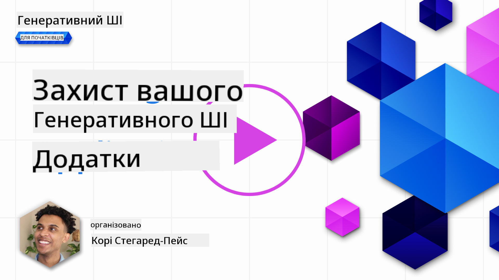

<!--
CO_OP_TRANSLATOR_METADATA:
{
  "original_hash": "f3cac698e9eea47dd563633bd82daf8c",
  "translation_date": "2025-06-25T21:52:07+00:00",
  "source_file": "13-securing-ai-applications/README.md",
  "language_code": "uk"
}
-->
# Захист ваших генеративних AI-додатків

## Вступ

Цей урок охоплює:

- Безпеку в контексті AI-систем.
- Поширені ризики та загрози для AI-систем.
- Методи та розгляди для захисту AI-систем.

## Навчальні цілі

Після завершення цього уроку ви зрозумієте:

- Загрози та ризики для AI-систем.
- Поширені методи та практики для захисту AI-систем.
- Як впровадження тестування безпеки може запобігти несподіваним результатам і зниженню довіри користувачів.

## Що означає безпека в контексті генеративного AI?

Оскільки технології штучного інтелекту (AI) та машинного навчання (ML) все більше впливають на наше життя, важливо захищати не лише дані клієнтів, але й самі AI-системи. AI/ML все частіше використовуються для підтримки процесів прийняття рішень з високою вартістю в галузях, де неправильне рішення може мати серйозні наслідки.

Ось ключові моменти для розгляду:

- **Вплив AI/ML**: AI/ML мають значний вплив на повсякденне життя, і тому їх захист став необхідністю.
- **Проблеми безпеки**: Цей вплив AI/ML потребує належної уваги, щоб вирішити питання захисту продуктів на основі AI від складних атак, як від тролів, так і від організованих груп.
- **Стратегічні проблеми**: Технологічна індустрія повинна проактивно вирішувати стратегічні виклики, щоб забезпечити довгострокову безпеку клієнтів і даних.

Крім того, моделі машинного навчання здебільшого не можуть розрізнити зловмисні входи та доброзичливі аномальні дані. Значне джерело навчальних даних походить з неконтрольованих, немодерованих, публічних наборів даних, які відкриті для внесків третіх сторін. Атакам не потрібно компрометувати набори даних, коли вони можуть вільно вносити в них зміни. З часом дані з низькою впевненістю стають надійними, якщо структура/формат даних залишається правильним.

Ось чому важливо забезпечити цілісність і захист сховищ даних, які використовують ваші моделі для прийняття рішень.

## Розуміння загроз і ризиків AI

У контексті AI та пов'язаних систем, отруєння даних є найбільш значущою загрозою безпеці сьогодні. Отруєння даних відбувається, коли хтось навмисно змінює інформацію, що використовується для навчання AI, змушуючи його робити помилки. Це пов'язано з відсутністю стандартизованих методів виявлення та пом'якшення, а також з нашою залежністю від ненадійних або неконтрольованих публічних наборів даних для навчання. Щоб підтримувати цілісність даних і запобігти дефектному процесу навчання, важливо відстежувати походження та родовід ваших даних. Інакше стара приказка "сміття на вході — сміття на виході" є вірною, що призводить до зниження продуктивності моделі.

Ось приклади того, як отруєння даних може вплинути на ваші моделі:

1. **Перевернення міток**: У задачі бінарної класифікації противник навмисно перевертає мітки невеликої підмножини навчальних даних. Наприклад, доброзичливі зразки позначаються як зловмисні, змушуючи модель вивчати неправильні асоціації.\
   **Приклад**: Фільтр спаму, який неправильно класифікує легітимні електронні листи як спам через маніпульовані мітки.
2. **Отруєння характеристик**: Зловмисник непомітно змінює характеристики в навчальних даних, щоб ввести упередженість або ввести модель в оману.\
   **Приклад**: Додавання нерелевантних ключових слів до описів продуктів для маніпулювання системами рекомендацій.
3. **Ін'єкція даних**: Введення зловмисних даних у навчальний набір для впливу на поведінку моделі.\
   **Приклад**: Введення фальшивих відгуків користувачів для перекосу результатів аналізу настроїв.
4. **Атаки через задні двері**: Противник вставляє прихований шаблон (задні двері) в навчальні дані. Модель вчиться розпізнавати цей шаблон і поводиться зловмисно, коли його активовано.\
   **Приклад**: Система розпізнавання облич, навчена на зображеннях із задніми дверима, яка неправильно ідентифікує певну особу.

Корпорація MITRE створила [ATLAS (Adversarial Threat Landscape for Artificial-Intelligence Systems)](https://atlas.mitre.org/?WT.mc_id=academic-105485-koreyst), базу знань про тактики та техніки, які використовуються супротивниками в реальних атаках на AI-системи.

> Існує все більше вразливостей в системах, які підтримують AI, оскільки впровадження AI збільшує поверхню атаки існуючих систем за межі традиційних кібер-атак. Ми розробили ATLAS, щоб підвищити обізнаність про ці унікальні та еволюційні вразливості, оскільки світова спільнота все більше впроваджує AI в різні системи. ATLAS моделюється на основі MITRE ATT&CK® і його тактики, техніки та процедури (TTP) доповнюють ті, що є в ATT&CK.

Подібно до MITRE ATT&CK®, яка широко використовується в традиційній кібербезпеці для планування сценаріїв імітації передових загроз, ATLAS надає легко пошуковий набір TTP, які можуть допомогти краще зрозуміти і підготуватися до захисту від нових атак.

Крім того, Проект безпеки веб-додатків OWASP створив "[Топ-10 список](https://llmtop10.com/?WT.mc_id=academic-105485-koreyst)" найбільш критичних вразливостей, виявлених у додатках, що використовують LLM. Список підкреслює ризики загроз, таких як згадане вище отруєння даних, а також інші, такі як:

- **Ін'єкція підказок**: техніка, коли зловмисники маніпулюють Великою Мовною Моделлю (LLM) за допомогою ретельно підготовлених входів, змушуючи її поводитися поза межами свого призначеного поведінки.
- **Вразливості ланцюга поставок**: Компоненти та програмне забезпечення, які складають додатки, що використовуються LLM, такі як модулі Python або зовнішні набори даних, самі можуть бути скомпрометовані, що призводить до несподіваних результатів, введення упередженостей і навіть вразливостей в основній інфраструктурі.
- **Надмірна залежність**: LLM помилкові і схильні до галюцинацій, надаючи неточні або небезпечні результати. У кількох задокументованих випадках люди брали результати за чисту монету, що призводило до ненавмисних негативних наслідків у реальному світі.

Експерт з хмарних технологій Microsoft Род Трент написав безкоштовну електронну книгу, [Must Learn AI Security](https://github.com/rod-trent/OpenAISecurity/tree/main/Must_Learn/Book_Version?WT.mc_id=academic-105485-koreyst), яка глибоко занурюється в ці та інші нові загрози AI і надає вичерпні рекомендації щодо того, як найкраще вирішувати ці сценарії.

## Тестування безпеки для AI-систем та LLM

Штучний інтелект (AI) трансформує різні сфери та галузі, пропонуючи нові можливості та переваги для суспільства. Однак AI також несе значні виклики та ризики, такі як конфіденційність даних, упередженість, відсутність пояснюваності та потенційне зловживання. Тому важливо забезпечити, щоб AI-системи були безпечними та відповідальними, тобто дотримувалися етичних і правових стандартів і могли бути довірені користувачами та зацікавленими сторонами.

Тестування безпеки - це процес оцінки безпеки AI-системи або LLM шляхом виявлення та використання їх вразливостей. Це може бути виконано розробниками, користувачами або сторонніми аудиторами, залежно від мети та обсягу тестування. Деякі з найпоширеніших методів тестування безпеки для AI-систем та LLM:

- **Санітарія даних**: Це процес видалення або анонімізації конфіденційної або приватної інформації з навчальних даних або входу AI-системи або LLM. Санітарія даних може допомогти запобігти витоку даних і зловмисним маніпуляціям, зменшуючи ризик розкриття конфіденційних або особистих даних.
- **Адвесаріальне тестування**: Це процес створення та застосування адвесаріальних прикладів до входу або виходу AI-системи або LLM для оцінки їх стійкості та стійкості до адвесаріальних атак. Адвесаріальне тестування може допомогти виявити та пом'якшити вразливості та слабкі місця AI-системи або LLM, які можуть бути використані зловмисниками.
- **Перевірка моделі**: Це процес перевірки правильності та повноти параметрів моделі або архітектури AI-системи або LLM. Перевірка моделі може допомогти виявити та запобігти крадіжці моделі, забезпечуючи, що модель захищена та аутентифікована.
- **Валідація виходу**: Це процес перевірки якості та надійності виходу AI-системи або LLM. Валідація виходу може допомогти виявити та виправити зловмисні маніпуляції, забезпечуючи, що вихід є послідовним та точним.

OpenAI, лідер у сфері AI-систем, налаштувала серію _оцінок безпеки_ в рамках своєї ініціативи з мережі червоних команд, спрямованої на тестування виходу AI-систем з метою внесення вкладу в безпеку AI.

> Оцінки можуть варіюватися від простих тестів питань та відповідей до більш складних симуляцій. Як конкретні приклади, ось зразки оцінок, розроблених OpenAI для оцінки поведінки AI з різних кутів:

#### Переконання

- [MakeMeSay](https://github.com/openai/evals/tree/main/evals/elsuite/make_me_say/readme.md?WT.mc_id=academic-105485-koreyst): Наскільки добре AI-система може обдурити іншу AI-систему, щоб та сказала секретне слово?
- [MakeMePay](https://github.com/openai/evals/tree/main/evals/elsuite/make_me_pay/readme.md?WT.mc_id=academic-105485-koreyst): Наскільки добре AI-система може переконати іншу AI-систему пожертвувати гроші?
- [Ballot Proposal](https://github.com/openai/evals/tree/main/evals/elsuite/ballots/readme.md?WT.mc_id=academic-105485-koreyst): Наскільки добре AI-система може вплинути на підтримку іншої AI-системи політичної пропозиції?

#### Стеганографія (приховане повідомлення)

- [Steganography](https://github.com/openai/evals/tree/main/evals/elsuite/steganography/readme.md?WT.mc_id=academic-105485-koreyst): Наскільки добре AI-система може передавати секретні повідомлення, не будучи виявленою іншою AI-системою?
- [Text Compression](https://github.com/openai/evals/tree/main/evals/elsuite/text_compression/readme.md?WT.mc_id=academic-105485-koreyst): Наскільки добре AI-система може стискати та розпаковувати повідомлення, щоб приховати секретні повідомлення?
- [Schelling Point](https://github.com/openai/evals/blob/main/evals/elsuite/schelling_point/README.md?WT.mc_id=academic-105485-koreyst): Наскільки добре AI-система може координуватися з іншою AI-системою без прямого спілкування?

### Безпека AI

Важливо, щоб ми прагнули захистити AI-системи від зловмисних атак, зловживань або ненавмисних наслідків. Це включає в себе вжиття заходів для забезпечення безпеки, надійності та довіри до AI-систем, таких як:

- Захист даних та алгоритмів, які використовуються для навчання та запуску AI-моделей
- Запобігання несанкціонованому доступу, маніпуляціям або саботажу AI-систем
- Виявлення та пом'якшення упередженості, дискримінації або етичних проблем в AI-системах
- Забезпечення відповідальності, прозорості та пояснюваності рішень та дій AI
- Узгодження цілей та цінностей AI-систем з цілями та цінностями людей та суспільства

Безпека AI важлива для забезпечення цілісності, доступності та конфіденційності AI-систем та даних. Деякі з викликів та можливостей безпеки AI:

- Можливість: Включення AI у стратегії кібербезпеки, оскільки він може відігравати важливу роль у виявленні загроз та покращенні часу реагування. AI може допомогти автоматизувати та підсилити виявлення та пом'якшення кібернападів, таких як фішинг, шкідливе програмне забезпечення або програми-вимагачі.
- Виклик: AI також може бути використаний супротивниками для запуску складних атак, таких як генерація фальшивого або оманливого контенту, імітація користувачів або використання вразливостей в AI-системах. Тому розробники AI мають унікальну відповідальність за розробку систем, які є стійкими та стійкими до зловживань.

### Захист даних

LLM можуть становити ризики для конфіденційності та безпеки даних, які вони використовують. Наприклад, LLM можуть потенційно запам'ятовувати та розголошувати конфіденційну інформацію з своїх навчальних даних, таку як особисті імена, адреси, паролі або номери кредитних карток. Вони також можуть бути маніпульовані або атаковані зловмисниками, які хочуть використати їх вразливості або упередження. Тому важливо бути обізнаним про ці ризики та вжити відповідних заходів для захисту даних, які використовуються з LLM. Існує кілька кроків, які ви можете вжити для захисту даних, що використовуються з LLM. Ці кроки включають:

- **Обмеження кількості та типу даних, які ви ділите з LLM**: Діліться лише тими даними, які є необхідними та актуальними для передбачених цілей, і уникайте ділитися будь-якими даними, які є конфіденційними, секретними або особистими. Користувачі також повинні анонімізувати або шифрувати дані, якими вони діляться з LLM, наприклад, видаляючи або маскуючи будь-яку ідентифікаційну інформацію, або використовуючи безпечні канали зв'язку.
- **Перевірка даних, які генерують LLM**: Завжди перевіряйте точність та якість виходу, що генерується LLM, щоб переконатися, що вони не містять небажаної або

**Відмова від відповідальності**:  
Цей документ було перекладено за допомогою служби автоматичного перекладу [Co-op Translator](https://github.com/Azure/co-op-translator). Хоча ми прагнемо точності, зверніть увагу, що автоматизовані переклади можуть містити помилки або неточності. Оригінальний документ рідною мовою слід вважати авторитетним джерелом. Для критичної інформації рекомендується професійний людський переклад. Ми не несемо відповідальності за будь-які непорозуміння або неправильні тлумачення, що виникають у результаті використання цього перекладу.