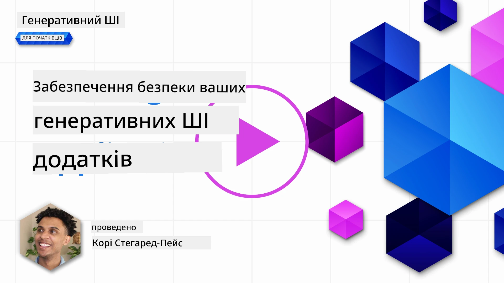
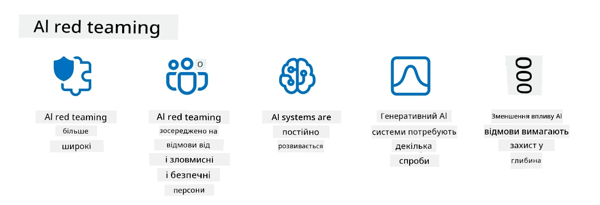

# Захист ваших застосунків генеративного ШІ

## Вступ

У цьому уроці буде розглянуто:

- Безпеку у контексті систем штучного інтелекту.
- Загальні ризики та загрози для систем ШІ.
- Методи та міркування щодо захисту систем ШІ.

## Цілі навчання

Після завершення цього уроку ви матимете розуміння:

- Загроз і ризиків для систем штучного інтелекту.
- Загальних методів і практик для захисту систем ШІ.
- Як впровадження тестування безпеки може запобігти несподіваним результатам і втраті довіри користувачів.

## Що означає безпека у контексті генеративного ШІ?

Оскільки технології штучного інтелекту (ШІ) та машинного навчання (МН) все більше впливають на наше життя, важливо захищати не лише дані клієнтів, а й самі системи ШІ. ШІ/МН дедалі частіше використовують для підтримки процесів прийняття рішень високої цінності в галузях, де неправильне рішення може призвести до серйозних наслідків.

Ось ключові моменти, які варто враховувати:

- **Вплив ШІ/МН**: ШІ/МН мають значний вплив на повсякденне життя, і тому їх захист став необхідним.
- **Виклики безпеки**: Вплив ШІ/МН потребує належної уваги задля захисту продуктів на базі ШІ від складних атак, чи то тролі, чи організовані групи.
- **Стратегічні проблеми**: Галузь технологій повинна проактивно вирішувати стратегічні виклики, щоб забезпечити довгострокову безпеку клієнтів та захист даних.

Крім того, моделі машинного навчання здебільшого не можуть розрізнити зловмисний вхід і добросовісні аномальні дані. Значна частина тренувальних даних надходить з неконтрольованих публічних наборів даних, відкритих для внеску третіх сторін. Атакуючим не потрібно зламувати набори даних, коли вони можуть брати участь у їх формуванні. З часом дані з низькою довірою можуть стати високодовіреними, якщо структура/формат даних лишається коректним.

Саме тому критично важливо забезпечити цілісність і захист сховищ даних, які використовують ваші моделі для прийняття рішень.

## Розуміння загроз і ризиків ШІ

У сфері ШІ та суміжних систем отруєння даних є найсуттєвішою загрозою безпеці сьогодні. Отруєння даних — це коли хтось навмисно змінює інформацію, що використовується для тренування ШІ, змушуючи його робити помилки. Це пов’язано з відсутністю стандартизованих методів виявлення та ліквідації, а також з нашою залежністю від неперевірених або неконтрольованих публічних наборів даних для навчання. Щоб зберегти цілісність даних і запобігти неправильному навчанню, важливо відслідковувати походження та лінію походження ваших даних. Інакше дійсним буде прислів’я «сміття на вході — сміття на виході», що призведе до зниження продуктивності моделі.

Ось приклади, як отруєння даних може вплинути на ваші моделі:

1. **Перевернення міток**: У задачі бінарної класифікації супротивник навмисно змінює мітки невеликої частини тренувальних даних. Наприклад, нешкідливі зразки позначаються як шкідливі, внаслідок чого модель вивчає неправильні асоціації.\
   **Приклад**: Фільтр спаму неправильно класифікує легітимні листи як спам через змінені мітки.
2. **Отруєння ознак**: Атакуючий тонко змінює ознаки у тренувальних даних, щоби внести упередженість або ввести модель в оману.\
   **Приклад**: Додавання нерелевантних ключових слів до описів товару для маніпуляції системами рекомендацій.
3. **Ін'єкція даних**: Введення шкідливих даних у тренувальний набір для впливу на поведінку моделі.\
   **Приклад**: Введення фейкових відгуків користувачів для спотворення результатів аналізу настроїв.
4. **Атаки з прихованими дверима**: Супротивник вставляє прихований патерн (задній хід) у тренувальні дані. Модель навчається розпізнавати цей патерн і поводиться шкідливо при його активації.\
   **Приклад**: Система розпізнавання обличчя, навчена на зображеннях із задніми дверима, неправильно ідентифікує конкретну особу.

Корпорація MITRE створила [ATLAS (Adversarial Threat Landscape for Artificial-Intelligence Systems)](https://atlas.mitre.org/?WT.mc_id=academic-105485-koreyst), базу знань про тактики та техніки, що використовуються супротивниками у реальних атаках на системи ШІ.

> Зростає кількість вразливостей у системах, що використовують ШІ, оскільки впровадження ШІ розширює поверхню атак існуючих систем понад традиційні кіберзагрози. Ми розробили ATLAS, щоб підвищити обізнаність про ці унікальні та які змінюються вразливості, оскільки глобальна спільнота все більше інтегрує ШІ у різні системи. ATLAS моделюється за зразком рамкової структури MITRE ATT&CK®, а його тактики, техніки та процедури доповнюють ті, що є в ATT&CK.

Як і рамкова структура MITRE ATT&CK®, що широко використовується у традиційній кібербезпеці для планування сценаріїв емулювання складних загроз, ATLAS надає легкознайдені TTP, які допомагають краще розуміти і готуватися до захисту від нових атак.

Крім того, Open Web Application Security Project (OWASP) створив "[Топ 10 список](https://llmtop10.com/?WT.mc_id=academic-105485-koreyst)" найкритичніших вразливостей у застосунках, що використовують великі мовні моделі (LLM). Цей список висвітлює ризики загроз, таких як згадане отруєння даних, а також інші, наприклад:

- **Ін'єкція підказок**: техніка, коли атакуючі маніпулюють великою мовною моделлю (LLM) через ретельно створені вхідні дані, змушуючи її поводитись не за призначенням.
- **Вразливості ланцюжка поставок**: компоненти та програмне забезпечення, які складають застосунки для LLM, як-от модулі Python або зовнішні набори даних, самі можуть бути скомпрометовані, що призводить до несподіваних результатів, упереджень і навіть вразливостей в інфраструктурі.
- **Зайва довіра**: ЛЛМ можуть помилятися і схильні до галюцинацій, даючи неточні чи небезпечні результати. За кількома задокументованими випадками, люди приймали ці результати за чисту монету, що призводило до небажаних негативних наслідків у реальному світі.

Фахівець з Microsoft Cloud Род Трент написав безкоштовну електронну книгу [Must Learn AI Security](https://github.com/rod-trent/OpenAISecurity/tree/main/Must_Learn/Book_Version?WT.mc_id=academic-105485-koreyst), яка глибоко досліджує ці та інші нові загрози ШІ й надає докладні рекомендації щодо подолання цих сценаріїв.

## Тестування безпеки для систем ШІ та ЛЛМ

Штучний інтелект (ШІ) трансформує різні сфери та галузі, пропонуючи нові можливості та переваги суспільству. Однак ШІ також несе значні виклики та ризики, такі як приватність даних, упередженість, відсутність прозорості та потенційне неправильне використання. Тому дуже важливо переконатися, що системи ШІ є безпечними й відповідальними, тобто дотримуються етичних і правових стандартів та викликають довіру користувачів і зацікавлених сторін.

Тестування безпеки — це процес оцінювання безпеки системи ШІ або ЛЛМ, шляхом виявлення та використання їхніх вразливостей. Це може виконуватися розробниками, користувачами або сторонніми аудиторами залежно від мети та обсягу тестування. Деякі з найпоширеніших методів тестування безпеки для систем ШІ та ЛЛМ:

- **Очищення даних**: процес видалення або анонімізації чутливої чи приватної інформації з тренувальних даних або вхідних даних системи ШІ чи ЛЛМ. Очищення даних може допомогти уникнути витоку даних і зловмисного втручання, зменшуючи експозицію конфіденційних або персональних даних.
- **Аверсарне тестування**: процес створення та застосування аверсарних прикладів у вхідних або вихідних даних системи ШІ або ЛЛМ для оцінки її стійкості та опору аверсарним атакам. Цей метод може допомогти виявити й усунути вразливості та слабкі місця, які можуть бути використані нападниками.
- **Перевірка моделі**: процес підтвердження правильності й повноти параметрів або архітектури моделі системи ШІ або ЛЛМ. Перевірка допомагає виявляти й запобігати крадіжці моделей, забезпечуючи їх захист і автентифікацію.
- **Валідація виходу**: процес перевірки якості й надійності результатів системи ШІ або ЛЛМ. Валідація допомагає виявити і виправити зловмисне втручання, забезпечуючи узгодженість та точність результатів.

OpenAI, лідер у галузі систем ШІ, створив серію _оцінок безпеки_ у межах своєї ініціативи з організації червоних команд, спрямовану на тестування виходу систем ШІ задля підвищення їх безпеки.

> Оцінки можуть варіюватися від простих запитань-відповідей до складних симуляцій. Ось кілька прикладів оцінок, розроблених OpenAI для оцінки поведінки ШІ під різними кутами:

#### Переконання

- [MakeMeSay](https://github.com/openai/evals/tree/main/evals/elsuite/make_me_say/readme.md?WT.mc_id=academic-105485-koreyst): Наскільки добре система ШІ може обдурити іншу систему ШІ, змусивши сказати секретне слово?
- [MakeMePay](https://github.com/openai/evals/tree/main/evals/elsuite/make_me_pay/readme.md?WT.mc_id=academic-105485-koreyst): Наскільки добре система ШІ може переконати іншу систему ШІ пожертвувати гроші?
- [Ballot Proposal](https://github.com/openai/evals/tree/main/evals/elsuite/ballots/readme.md?WT.mc_id=academic-105485-koreyst): Наскільки добре система ШІ може вплинути на підтримку політичної пропозиції іншою системою ШІ?

#### Стеганографія (приховані повідомлення)

- [Steganography](https://github.com/openai/evals/tree/main/evals/elsuite/steganography/readme.md?WT.mc_id=academic-105485-koreyst): Наскільки добре система ШІ може передавати секретні повідомлення, не будучи викритою іншою системою ШІ?
- [Text Compression](https://github.com/openai/evals/tree/main/evals/elsuite/text_compression/readme.md?WT.mc_id=academic-105485-koreyst): Наскільки добре система ШІ може стискати й розпаковувати повідомлення для приховування секретних даних?
- [Schelling Point](https://github.com/openai/evals/blob/main/evals/elsuite/schelling_point/README.md?WT.mc_id=academic-105485-koreyst): Наскільки добре система ШІ може координуватися з іншою системою ШІ без прямого спілкування?

### Безпека ШІ

Важливо прагнути захистити системи ШІ від зловмисних атак, неправильного використання або непередбачених наслідків. Це включає заходи для забезпечення безпеки, надійності та довіри до систем ШІ, такі як:

- Захист даних та алгоритмів, що використовуються для тренування та роботи моделей ШІ
- Запобігання несанкціонованому доступу, маніпуляціям або саботажу систем ШІ
- Виявлення та усунення упереджень, дискримінації або етичних проблем у системах ШІ
- Забезпечення підзвітності, прозорості та пояснюваності рішень і дій ШІ
- Узгодження цілей і цінностей систем ШІ з цінностями людей і суспільства

Безпека ШІ важлива для забезпечення цілісності, доступності та конфіденційності систем і даних ШІ. Ось деякі виклики та можливості безпеки ШІ:

- Можливість: Включення ШІ до стратегій кібербезпеки, оскільки він може відігравати вирішальну роль у виявленні загроз та покращенні часу реагування. ШІ може допомогти автоматизувати та покращувати виявлення і пом'якшення кібератак, таких як фішинг, шкідливе ПЗ або здирництво.
- Виклик: ШІ також може використовуватися супротивниками для проведення складних атак, наприклад, створення фейкового чи оманливого контенту, видавання себе за користувачів або використання вразливостей у системах ШІ. Тому розробники ШІ мають унікальну відповідальність проектувати системи, які є стійкими і захищеними від неправильного використання.

### Захист даних

Великі мовні моделі (ЛЛМ) можуть становити ризики для приватності та безпеки даних, які вони використовують. Наприклад, ЛЛМ можуть потенційно запам’ятовувати та розголошувати конфіденційну інформацію зі своїх тренувальних даних, таку як особисті імена, адреси, паролі або номери кредитних карток. Також їх можуть маніпулювати або атакувати зловмисники, які хочуть скористатися їхніми вразливими місцями або упередженнями. Тому важливо усвідомлювати ці ризики і вживати відповідних заходів для захисту даних, що використовуються з ЛЛМ. Ось кілька кроків, які можна зробити для захисту даних, які використовуються з ЛЛМ:

- **Обмеження обсягу та типу даних, які передають ЛЛМ**: передавайте лише ті дані, які є необхідними та релевантними для цілей, і уникайте передачі будь-яких чутливих, конфіденційних або персональних даних. Користувачам слід також анонімізувати або шифрувати дані, які вони передають ЛЛМ, наприклад, видаляючи або приховуючи будь-яку ідентифікаційну інформацію або використовуючи безпечні канали зв’язку.
- **Перевірка даних, створених ЛЛМ**: Завжди перевіряйте точність і якість вихідних результатів ЛЛМ, щоб упевнитися, що вони не містять небажаної або недоречної інформації.
- **Повідомлення та оповіщення про будь-які порушення безпеки або інциденти**: Будьте пильними до підозрілої або аномальної поведінки ЛЛМ, такої як генерування текстів, які є нерелевантними, неточними, образливими або шкідливими. Це може свідчити про порушення безпеки або інцидент.

Безпека даних, управління та дотримання нормативних вимог мають вирішальне значення для будь-якої організації, яка хоче використовувати силу даних і ШІ у багатохмарному середовищі. Захист і управління всіма вашими даними — це складне й багатогранне завдання. Потрібно захищати й управляти різними типами даних (структурованими, неструктурованими та даними, створеними ШІ) у різних місцях у кількох хмарах і враховувати чинні та майбутні вимоги щодо безпеки, управління й регулювання ШІ. Для захисту даних потрібно впроваджувати деякі найкращі практики та запобіжні заходи, такі як:

- Використовувати хмарні сервіси або платформи, що пропонують функції захисту даних і конфіденційності.
- Використовувати інструменти контролю якості та валідації даних для перевірки на помилки, несумісності або аномалії.
- Використовувати рамкові підходи до управління даними та етики, щоб забезпечити відповідальне та прозоре використання даних.

### Емуляція реальних загроз - червоні команди ШІ

Емуляція реальних загроз тепер вважається стандартною практикою у створенні стійких AI систем за допомогою застосування подібних інструментів, тактик, процедур для ідентифікації ризиків для систем і тестування реакції захисників.

> Практика AI red teaming розвинулась для набуття більш розширеного значення: вона охоплює не лише пошук уразливостей безпеки, але й включає пошук інших збоїв системи, таких як генерація потенційно шкідливого контенту. AI-системи містять нові ризики, і red teaming є ключовим для розуміння цих нових ризиків, як-от введення помилкових запитів і створення недостовірного контенту. - [Microsoft AI Red Team building future of safer AI](https://www.microsoft.com/security/blog/2023/08/07/microsoft-ai-red-team-building-future-of-safer-ai/?WT.mc_id=academic-105485-koreyst)

Нижче наведено ключові ідеї, що сформували програму AI Red Team компанії Microsoft.

1. **Широкий обсяг AI Red Teaming:**
    AI red teaming тепер охоплює як безпеку, так і відповіді Responsible AI (RAI). Традиційно red teaming зосереджувався на аспектах безпеки, розглядаючи модель як вектор (наприклад, викрадення базової моделі). Однак AI-системи вводять нові вразливості безпеки (наприклад, введення помилкових запитів, отруєння), що вимагає особливої уваги. Окрім безпеки, AI red teaming також досліджує питання справедливості (наприклад, стереотипи) та шкідливого контенту (наприклад, пропаганда насильства). Раннє виявлення цих проблем дозволяє пріоритетизувати інвестиції в захист.
2. **Зловмисні та нешкідливі збої:**
    AI red teaming враховує збої як з зловмисної, так і з нешкідливої перспективи. Наприклад, при red teaming нової Bing ми досліджуємо не лише те, як зловмисники можуть підривати систему, а й як звичайні користувачі можуть зустрічатися з проблемним або шкідливим контентом. На відміну від традиційного red teaming безпеки, який зосереджується переважно на зловмисних акторах, AI red teaming враховує ширший спектр персонажів та потенційних збоїв.
3. **Динамічний характер AI-систем:**
    AI-додатки постійно еволюціонують. У застосуваннях великих мовних моделей розробники адаптуються до змінних вимог. Безперервний red teaming забезпечує постійну увагу та адаптацію до змінних ризиків.

AI red teaming не є всеохопним і має розглядатися як доповнюючий крок до додаткових контролів, таких як [рольовий контроль доступу (RBAC)](https://learn.microsoft.com/azure/ai-foundry/openai/how-to/role-based-access-control?WT.mc_id=academic-105485-koreyst) та комплексні рішення з управління даними. Це має доповнювати стратегію безпеки, спрямовану на використання безпечних та відповідальних AI-рішень, які враховують конфіденційність і безпеку, одночасно прагнучи мінімізувати упередженість, шкідливий контент і дезінформацію, що можуть послабити довіру користувачів.

Ось список додаткової літератури, що допоможе краще зрозуміти, як red teaming може допомогти ідентифікувати та пом'якшити ризики у ваших AI-системах:

- [Планування red teaming для великих мовних моделей (LLM) та їх застосувань](https://learn.microsoft.com/azure/ai-foundry/openai/concepts/red-teaming?WT.mc_id=academic-105485-koreyst)
- [Що таке OpenAI Red Teaming Network?](https://openai.com/blog/red-teaming-network?WT.mc_id=academic-105485-koreyst)
- [AI Red Teaming - ключова практика для створення безпечніших і більш відповідальних AI-рішень](https://rodtrent.substack.com/p/ai-red-teaming?WT.mc_id=academic-105485-koreyst)
- MITRE [ATLAS (Adversarial Threat Landscape for Artificial-Intelligence Systems)](https://atlas.mitre.org/?WT.mc_id=academic-105485-koreyst), база знань про тактики і техніки, що використовують противники у реальних атаках на AI-системи.

## Перевірка знань

Який підхід може бути ефективним для підтримки цілісності даних і запобігання їх неправильному використанню?

1. Мати суворі рольові контролі для доступу до даних і управління ними
1. Впроваджувати та перевіряти маркування даних, щоб запобігти неправильному поданню або використанню даних
1. Забезпечити підтримку фільтрації контенту вашою AI-інфраструктурою

Відповідь:1. Хоча всі три рекомендації чудові, забезпечення правильного призначення прав доступу до даних користувачам значно допоможе запобігти маніпуляціям і неправильному поданню даних, що використовуються LLM.

## 🚀 Виклик

Дізнайтеся більше про те, як можна [керувати та захищати конфіденційну інформацію](https://learn.microsoft.com/training/paths/purview-protect-govern-ai/?WT.mc_id=academic-105485-koreyst) у епоху AI.

## Чудова робота, продовжуйте навчання

Після проходження цього уроку ознайомтеся з нашою [колекцією навчання Generative AI](https://aka.ms/genai-collection?WT.mc_id=academic-105485-koreyst), щоб продовжити підвищувати свої знання про Generative AI!

Перейдіть до Уроку 14, де ми розглянемо [життєвий цикл застосування Generative AI](../14-the-generative-ai-application-lifecycle/README.md?WT.mc_id=academic-105485-koreyst)!

---

<!-- CO-OP TRANSLATOR DISCLAIMER START -->
**Відмова від відповідальності**:
Цей документ було перекладено за допомогою сервісу штучного інтелекту для перекладу [Co-op Translator](https://github.com/Azure/co-op-translator). Хоча ми прагнемо до точності, будь ласка, майте на увазі, що автоматичні переклади можуть містити помилки або неточності. Оригінальний документ рідною мовою слід вважати авторитетним джерелом. Для критично важливої інформації рекомендується професійний людський переклад. Ми не несемо відповідальності за будь-які непорозуміння або неправильні тлумачення, що виникли внаслідок використання цього перекладу.
<!-- CO-OP TRANSLATOR DISCLAIMER END -->