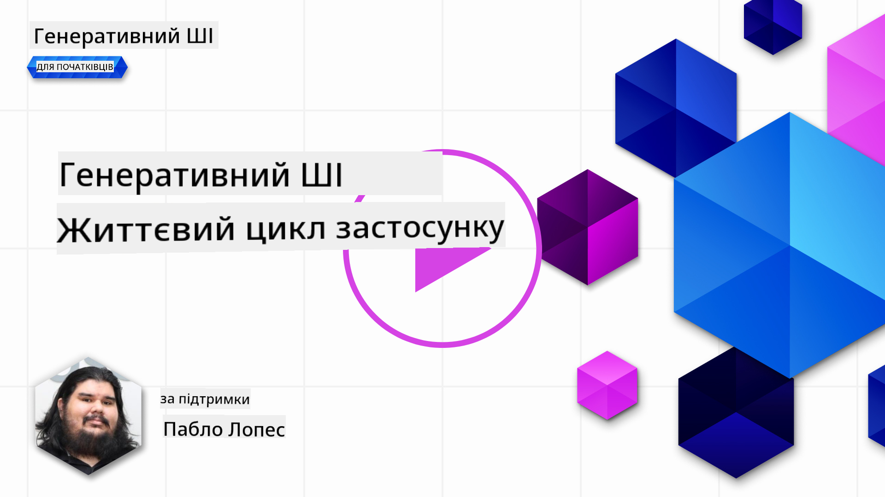
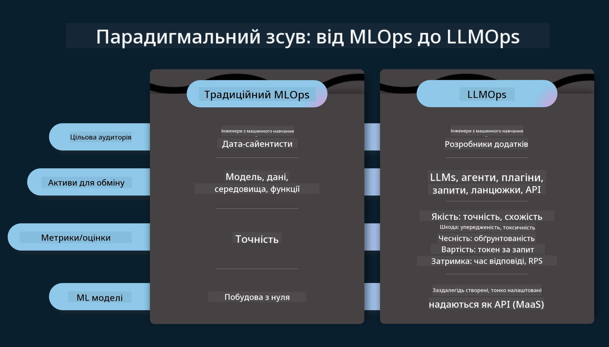
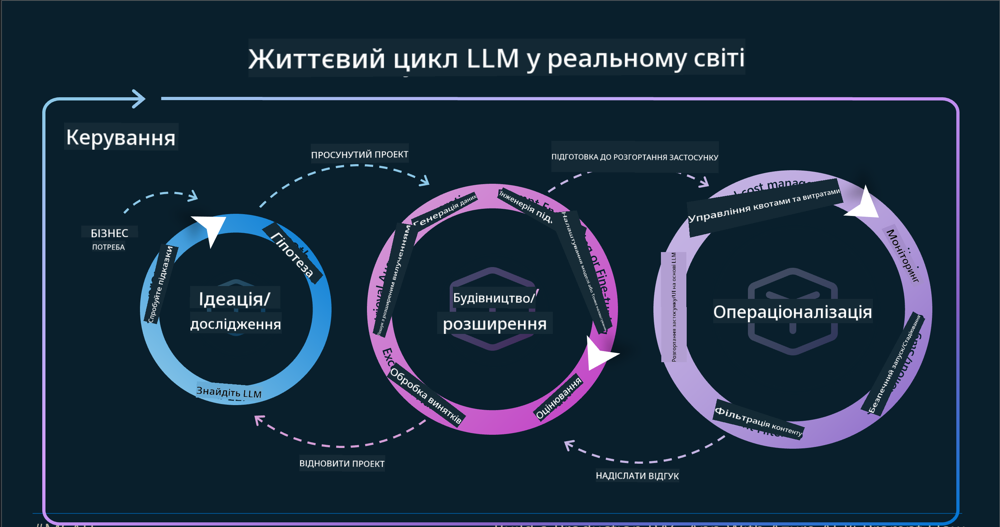
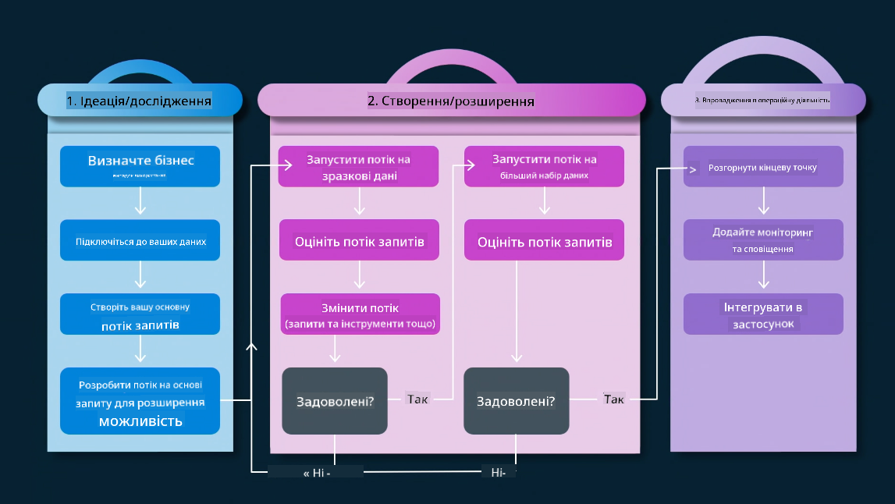
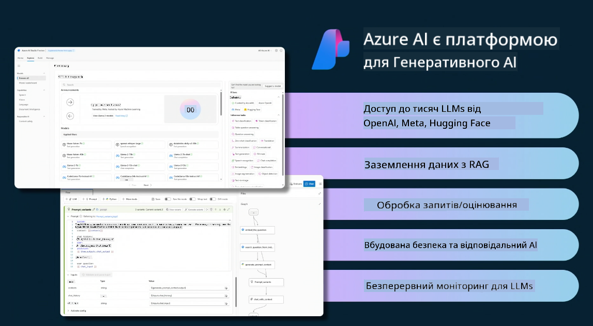
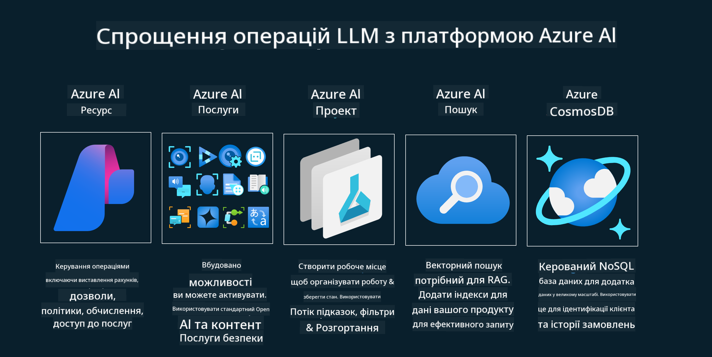
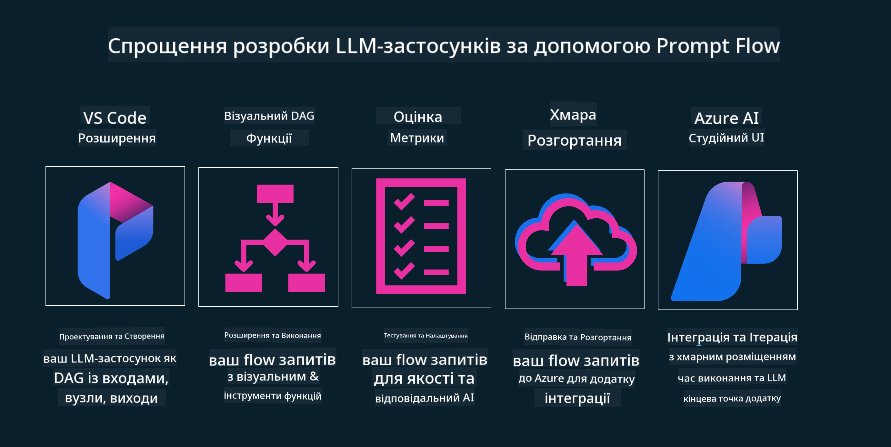

<!--
CO_OP_TRANSLATOR_METADATA:
{
  "original_hash": "27a5347a5022d5ef0a72ab029b03526a",
  "translation_date": "2025-07-09T16:00:38+00:00",
  "source_file": "14-the-generative-ai-application-lifecycle/README.md",
  "language_code": "uk"
}
-->

# Життєвий цикл застосунку генеративного ШІ

Важливе питання для всіх застосунків ШІ — актуальність функцій ШІ, адже ця сфера швидко розвивається. Щоб ваш застосунок залишався актуальним, надійним і стійким, потрібно постійно його моніторити, оцінювати та вдосконалювати. Саме тут на допомогу приходить життєвий цикл генеративного ШІ.

Життєвий цикл генеративного ШІ — це рамкова модель, яка допомагає пройти всі етапи розробки, розгортання та підтримки застосунку генеративного ШІ. Вона допомагає визначити цілі, вимірювати продуктивність, виявляти проблеми та впроваджувати рішення. Також вона допомагає узгодити застосунок з етичними та правовими стандартами вашої сфери та зацікавлених сторін. Дотримуючись життєвого циклу генеративного ШІ, ви можете бути впевнені, що ваш застосунок завжди приносить користь і задовольняє користувачів.

## Вступ

У цьому розділі ви:

- Зрозумієте парадигмальний зсув від MLOps до LLMOps
- Ознайомитеся з життєвим циклом LLM
- Дізнаєтеся про інструменти життєвого циклу
- Розглянете метрики та оцінювання життєвого циклу

## Зрозумійте парадигмальний зсув від MLOps до LLMOps

LLM — це новий інструмент у арсеналі штучного інтелекту, вони надзвичайно потужні для завдань аналізу та генерації в застосунках, проте ця потужність має свої наслідки для оптимізації завдань ШІ та класичного машинного навчання.

У зв’язку з цим нам потрібна нова парадигма, щоб адаптувати цей інструмент динамічно та з правильними стимулами. Ми можемо класифікувати старі застосунки ШІ як "ML Apps", а нові — як "GenAI Apps" або просто "AI Apps", що відображає основні технології та методи, які використовувалися на той час. Це змінює наш підхід у кількох аспектах, подивіться на наступне порівняння.

Зверніть увагу, що в LLMOps ми більше орієнтуємося на розробників застосунків, використовуючи інтеграції як ключовий момент, застосовуємо "Models-as-a-Service" і думаємо про такі метрики:

- Якість: якість відповіді
- Шкода: відповідальний ШІ
- Чесність: обґрунтованість відповіді (Чи має сенс? Чи правильна вона?)
- Вартість: бюджет рішення
- Затримка: середній час відповіді на токен

## Життєвий цикл LLM

Спершу, щоб зрозуміти життєвий цикл і зміни, зверніть увагу на наступну інфографіку.

Як ви можете помітити, це відрізняється від звичних життєвих циклів MLOps. LLM мають багато нових вимог, таких як промптінг, різні техніки покращення якості (Fine-Tuning, RAG, Meta-Prompts), інші підходи до оцінки та відповідальності з урахуванням відповідального ШІ, а також нові метрики оцінювання (Якість, Шкода, Чесність, Вартість і Затримка).

Наприклад, подивіться, як ми генеруємо ідеї. Використовуємо інженерію промптів, щоб експериментувати з різними LLM і досліджувати можливості, перевіряючи, чи може їхня гіпотеза бути правильною.

Зверніть увагу, що це не лінійний процес, а інтегровані цикли, ітеративні та з загальним циклом.

Як ми можемо дослідити ці кроки? Розглянемо детальніше, як побудувати життєвий цикл.

Це може виглядати трохи складно, спочатку зосередимося на трьох основних кроках.

1. Ідеація/Дослідження: дослідження, тут ми можемо вивчати відповідно до бізнес-потреб. Прототипування, створення [PromptFlow](https://microsoft.github.io/promptflow/index.html?WT.mc_id=academic-105485-koreyst) і перевірка, чи достатньо це ефективно для нашої гіпотези.
1. Побудова/Розширення: впровадження, тепер ми починаємо оцінювати на більших наборах даних, застосовуємо техніки, як Fine-tuning і RAG, щоб перевірити стійкість нашого рішення. Якщо ні, повторна реалізація, додавання нових кроків у наш потік або реструктуризація даних можуть допомогти. Після тестування потоку і масштабування, якщо все працює і метрики відповідають вимогам, можна переходити до наступного кроку.
1. Впровадження в експлуатацію: інтеграція, тепер додаємо системи моніторингу та оповіщень, розгортання та інтеграцію застосунку.

Потім у нас є загальний цикл управління, зосереджений на безпеці, відповідності та управлінні.

Вітаємо, тепер ваш застосунок ШІ готовий до роботи та експлуатації. Для практичного досвіду ознайомтеся з [демо Contoso Chat.](https://nitya.github.io/contoso-chat/?WT.mc_id=academic-105485-koreys)

А які інструменти ми можемо використовувати?

## Інструменти життєвого циклу

Для інструментів Microsoft пропонує [Azure AI Platform](https://azure.microsoft.com/solutions/ai/?WT.mc_id=academic-105485-koreys) та [PromptFlow](https://microsoft.github.io/promptflow/index.html?WT.mc_id=academic-105485-koreyst), які полегшують і роблять ваш цикл простим для впровадження.

[Azure AI Platform](https://azure.microsoft.com/solutions/ai/?WT.mc_id=academic-105485-koreys) дозволяє використовувати [AI Studio](https://ai.azure.com/?WT.mc_id=academic-105485-koreys). AI Studio — це веб-портал, який дає змогу досліджувати моделі, приклади та інструменти, керувати ресурсами, розробляти UI-потоки та використовувати SDK/CLI для розробки з пріоритетом коду.

Azure AI дозволяє використовувати різноманітні ресурси для управління операціями, сервісами, проектами, пошуком за векторами та базами даних.

Створюйте від Proof-of-Concept (POC) до масштабних застосунків з PromptFlow:

- Проєктуйте та створюйте застосунки у VS Code з візуальними та функціональними інструментами
- Тестуйте та тонко налаштовуйте застосунки для якісного ШІ легко
- Використовуйте Azure AI Studio для інтеграції та ітерацій у хмарі, швидкого розгортання та інтеграції

## Чудово! Продовжуйте навчання!

Відмінно, тепер дізнайтеся більше про те, як ми структуруємо застосунок, щоб використовувати ці концепції на прикладі [Contoso Chat App](https://nitya.github.io/contoso-chat/?WT.mc_id=academic-105485-koreyst), щоб побачити, як Cloud Advocacy демонструє ці ідеї. Для додаткового контенту перегляньте нашу [сесію Ignite!](https://www.youtube.com/watch?v=DdOylyrTOWg)

Тепер перейдіть до уроку 15, щоб зрозуміти, як [Retrieval Augmented Generation та векторні бази даних](../15-rag-and-vector-databases/README.md?WT.mc_id=academic-105485-koreyst) впливають на генеративний ШІ та допомагають створювати більш захопливі застосунки!

**Відмова від відповідальності**:  
Цей документ було перекладено за допомогою сервісу автоматичного перекладу [Co-op Translator](https://github.com/Azure/co-op-translator). Хоча ми прагнемо до точності, будь ласка, майте на увазі, що автоматичні переклади можуть містити помилки або неточності. Оригінальний документ рідною мовою слід вважати авторитетним джерелом. Для критично важливої інформації рекомендується звертатися до професійного людського перекладу. Ми не несемо відповідальності за будь-які непорозуміння або неправильні тлумачення, що виникли внаслідок використання цього перекладу.