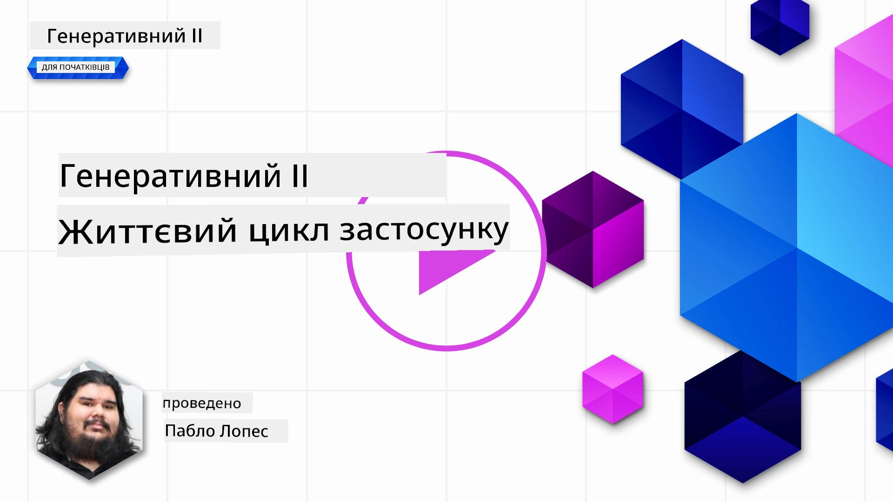
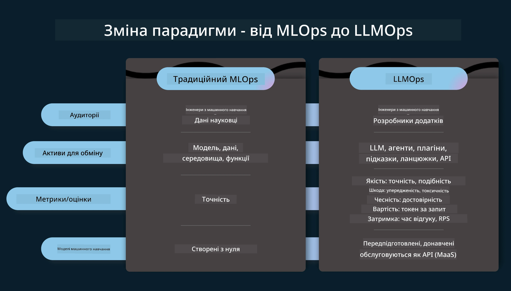
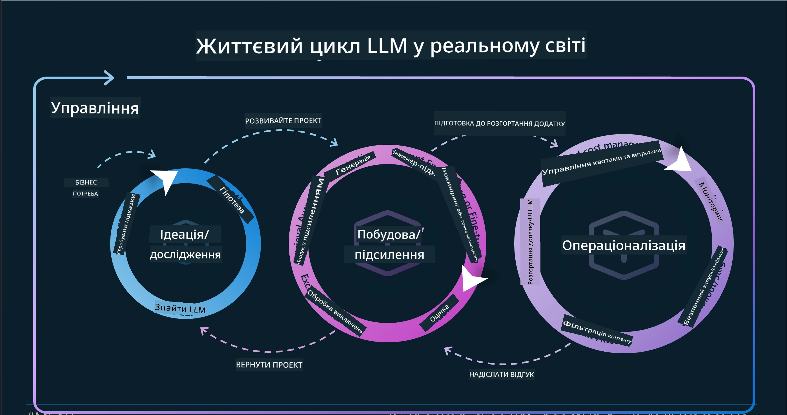
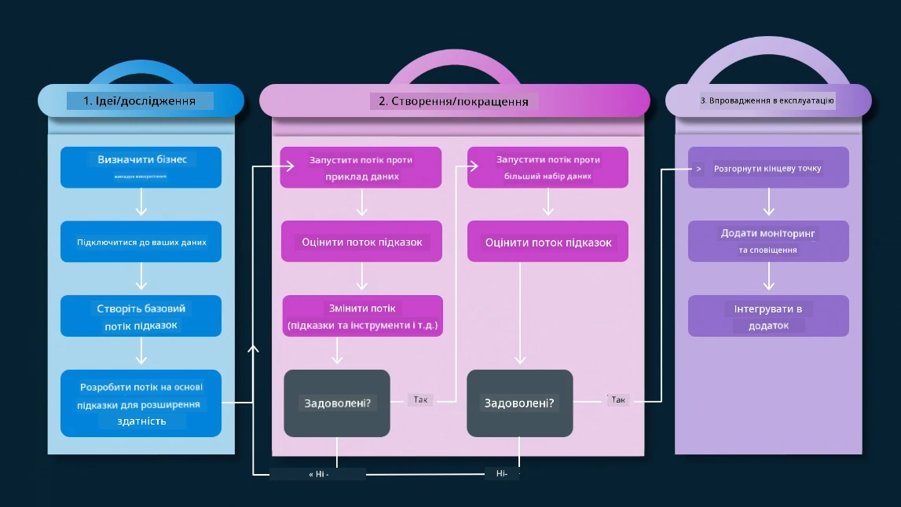
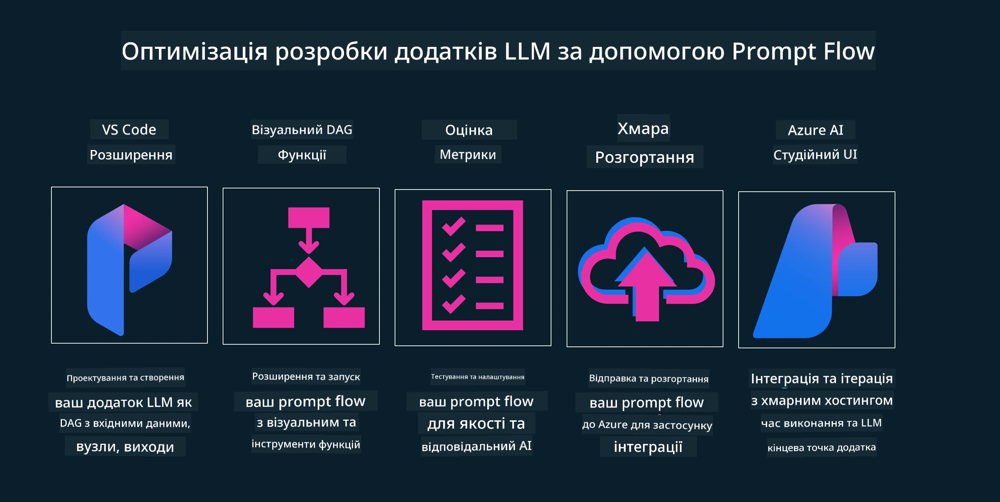

# Життєвий цикл генеративного ШІ додатка

Важливою проблемою для всіх додатків ШІ є релевантність функцій ШІ, оскільки ШІ – це швидкозмінна галузь, щоб забезпечити, що ваш додаток залишається релевантним, надійним та стійким, вам потрібно постійно контролювати, оцінювати та вдосконалювати його. Саме тут у гру вступає життєвий цикл генеративного ШІ.

Життєвий цикл генеративного ШІ — це рамка, яка проводить вас через етапи розробки, розгортання та підтримки генеративного ШІ додатка. Вона допомагає вам визначати ваші цілі, вимірювати вашу продуктивність, ідентифікувати ваші виклики та впроваджувати ваші рішення. Вона також допомагає вам узгодити ваш додаток з етичними та юридичними стандартами вашої галузі та ваших стейкхолдерів. Слідуючи життєвому циклу генеративного ШІ, ви можете гарантувати, що ваш додаток завжди приносить користь і задовольняє ваших користувачів.

## Вступ

У цьому розділі ви дізнаєтеся:

- Розуміння зсуву парадигми від MLOps до LLMOps
- Життєвий цикл LLM
- Інструменти життєвого циклу
- Метрики та оцінювання життєвого циклу

## Розуміння зсуву парадигми від MLOps до LLMOps

LLM — це новий інструмент в арсеналі штучного інтелекту, вони надзвичайно потужні у завданнях аналізу та генерації для додатків, однак ця потужність має певні наслідки для того, як ми оптимізуємо завдання штучного інтелекту та класичного машинного навчання.

У зв’язку з цим нам потрібна нова парадигма, щоб адаптувати цей інструмент динамічно з правильними стимулами. Ми можемо категоризувати старіші ШІ додатки як "ML Apps", а новіші ШІ додатки як "GenAI Apps" або просто "AI Apps", відображаючи домінуючі технології та техніки, що використовувалися на той час. Це змінює наш наратив у декількох аспектах, подивіться на наступне порівняння.

Зауважте, що в LLMOps ми більше орієнтовані на розробників додатків, використовуючи інтеграції як ключову точку, застосовуючи "Моделі як сервіс" та розглядаючи наступні точки для метрик.

- Якість: Якість відповіді
- Шкода: Відповідальний ШІ
- Чесність: Обґрунтованість відповіді (Чи має сенс? Чи правильна вона?)
- Вартість: Бюджет рішення
- Затримка: Середній час відповіді на токен

## Життєвий цикл LLM

Спершу, щоб зрозуміти життєвий цикл і зміни, ознайомтеся з наступною інфографікою.

Як ви можете помітити, це відрізняється від звичних життєвих циклів у MLOps. LLM мають багато нових вимог, таких як промптинґ, різні техніки для покращення якості (тонке налаштування, RAG, мета-промпти), різна оцінка та відповідальність з урахуванням відповідального ШІ, і нарешті, нові метрики оцінки (Якість, Шкода, Чесність, Вартість і Затримка).

Наприклад, подивіться, як ми ідеюємо. Використання інженерії промптів для експериментів із різними LLM, щоб дослідити можливості і перевірити, чи може їхня гіпотеза бути правильною.

Зауважте, що це не лінійний процес, а інтегровані цикли, ітеративні та з загальним циклом.

Як ми можемо дослідити ці кроки? Розглянемо детальніше, як можна побудувати життєвий цикл.

Це може виглядати трохи складно, давайте зосередимося спочатку на трьох великих кроках.

1. Ідеювання/Дослідження: Дослідження, тут ми можемо досліджувати відповідно до наших бізнес-потреб. Прототипування, створення [PromptFlow](https://microsoft.github.io/promptflow/index.html?WT.mc_id=academic-105485-koreyst) і тестування, чи є він достатньо ефективним для нашої гіпотези.
1. Збудування/Доповнення: Впровадження, тепер ми починаємо оцінювати для більших наборів даних, впроваджуємо техніки, як тонке налаштування і RAG, щоб перевірити стійкість нашого рішення. Якщо ні, повторна реалізація, додавання нових кроків у нашому потоці або реорганізація даних можуть допомогти. Після тестування нашого потоку і масштабування, якщо все працює і метрики задовільні, він готовий до наступного кроку.
1. Операційна робота: Інтеграція, тепер додаємо системи моніторингу та оповіщення до нашої системи, розгортання і інтеграцію додатку.

Після цього у нас є загальний цикл управління, орієнтований на безпеку, відповідність та керування.

Вітаємо, тепер ваш ШІ-додаток готовий до роботи та експлуатації. Для практичного досвіду подивіться [Contoso Chat Demo.](https://nitya.github.io/contoso-chat/?WT.mc_id=academic-105485-koreyst)

Які інструменти ми можемо використати?

## Інструменти життєвого циклу

Для інструментів Microsoft пропонує [Azure AI Platform](https://azure.microsoft.com/solutions/ai/?WT.mc_id=academic-105485-koreyst) та [PromptFlow](https://microsoft.github.io/promptflow/index.html?WT.mc_id=academic-105485-koreyst), що полегшують та роблять ваш життєвий цикл простим для впровадження і готовим до роботи.

[Azure AI Platform](https://azure.microsoft.com/solutions/ai/?WT.mc_id=academic-105485-koreyst) дозволяє використовувати [AI Studio](https://ai.azure.com/?WT.mc_id=academic-105485-koreyst). AI Studio — це веб-портал, який дає змогу досліджувати моделі, зразки та інструменти. Керуйте своїми ресурсами, UI-розробкою потоків і варіантами SDK/CLI для розробки переважно через код.

Azure AI дозволяє використовувати різноманітні ресурси для керування вашими операціями, сервісами, проектами, потребами у векторному пошуку та базами даних.

Створюйте, від концепції(Proof-of-Concept, POC) і до масштабних додатків із PromptFlow:

- Проєктуйте та створюйте додатки із VS Code, з візуальними та функціональними інструментами
- Тестуйте і тонко налаштовуйте ваші додатки для якісного ШІ легко.
- Використовуйте Azure AI Studio для інтеграції та ітерацій у хмарі, швидкого розгортання і впровадження.

## Чудово! Продовжуйте навчання!

Вражаюче, тепер дізнайтеся більше про те, як структурувати додаток для використання концепцій на прикладі [Contoso Chat App](https://nitya.github.io/contoso-chat/?WT.mc_id=academic-105485-koreyst), щоб побачити, як Cloud Advocacy додає ці концепції в демонстраціях. Для більшої кількості контенту перегляньте наш [Ignite breakout session!
](https://www.youtube.com/watch?v=DdOylyrTOWg)

Тепер переходьте до Уроку 15, щоб зрозуміти, як [Retrieval Augmented Generation і векторні бази даних](../15-rag-and-vector-databases/README.md?WT.mc_id=academic-105485-koreyst) впливають на генеративний ШІ та допомагають створювати більш захопливі додатки!

---

<!-- CO-OP TRANSLATOR DISCLAIMER START -->
**Відмова від відповідальності**:  
Цей документ було перекладено за допомогою сервісу автоматичного перекладу [Co-op Translator](https://github.com/Azure/co-op-translator). Хоча ми прагнемо до точності, просимо враховувати, що автоматичні переклади можуть містити помилки або неточності. Оригінальний документ рідною мовою слід вважати авторитетним джерелом. Для критично важливої інформації рекомендується звертатись до професійного людського перекладу. Ми не несемо відповідальності за будь-які непорозуміння чи неправильні тлумачення, що виникли унаслідок використання цього перекладу.
<!-- CO-OP TRANSLATOR DISCLAIMER END -->