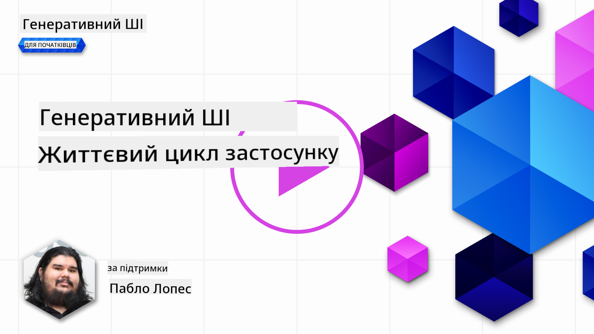
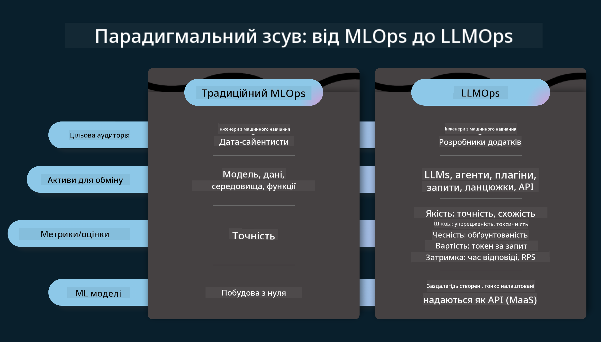
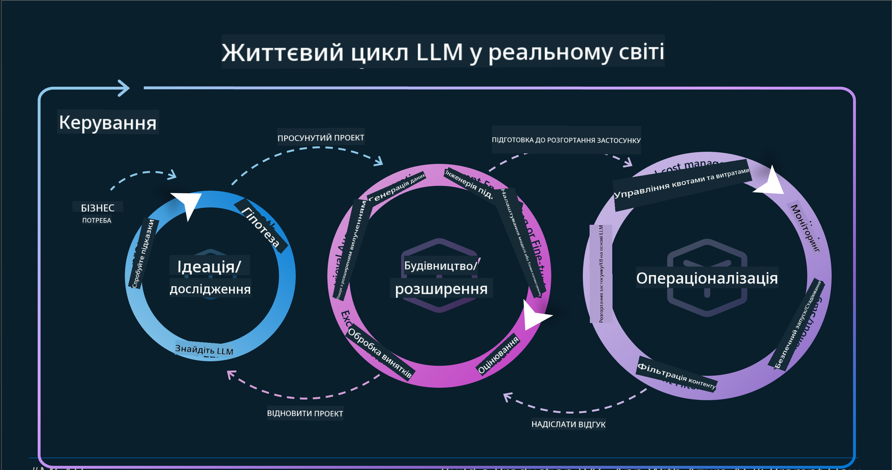
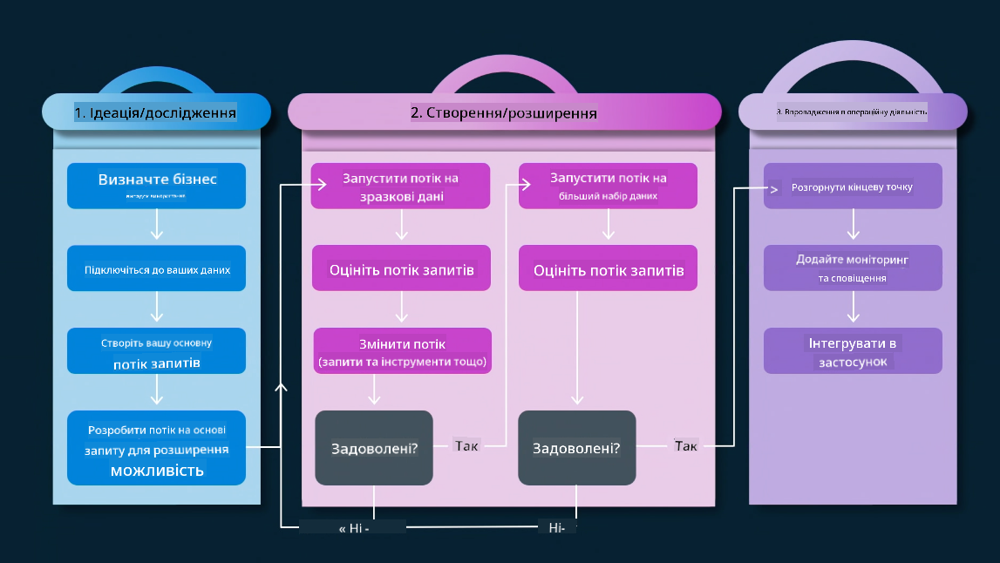
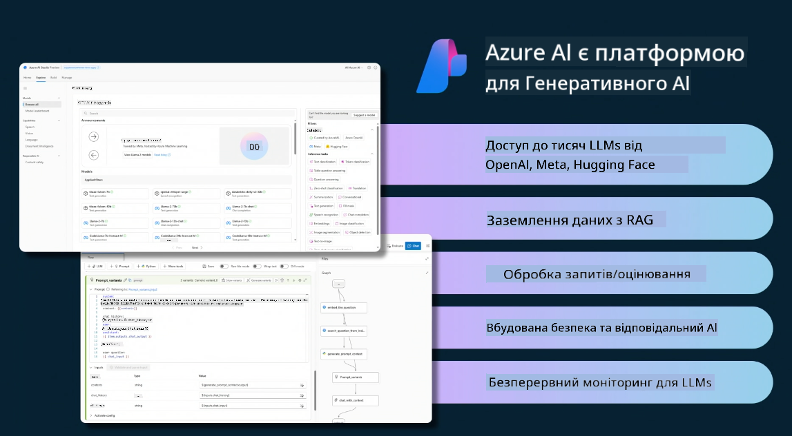
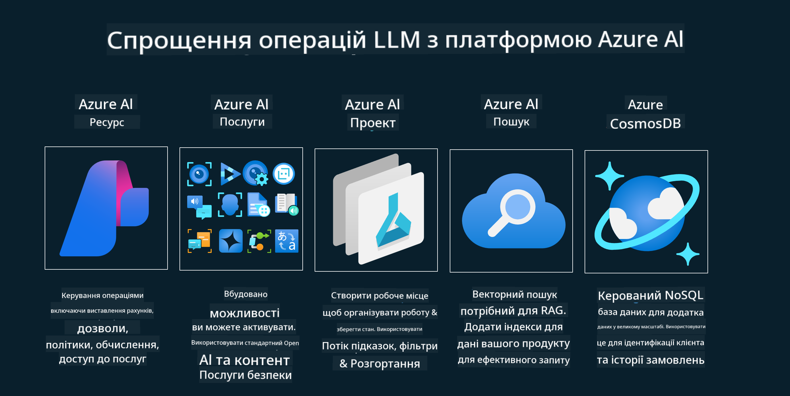
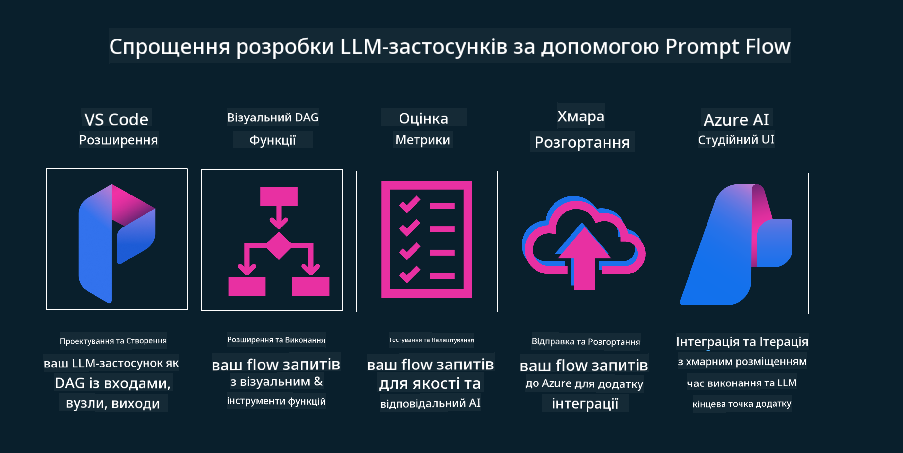

<!--
CO_OP_TRANSLATOR_METADATA:
{
  "original_hash": "27a5347a5022d5ef0a72ab029b03526a",
  "translation_date": "2025-06-25T22:13:36+00:00",
  "source_file": "14-the-generative-ai-application-lifecycle/README.md",
  "language_code": "uk"
}
-->

# Життєвий цикл застосунків генеративного штучного інтелекту

Важливе питання для всіх AI-застосунків — це актуальність AI-функцій, оскільки AI — це швидко розвиваючася галузь. Щоб ваш застосунок залишався актуальним, надійним і міцним, потрібно постійно його контролювати, оцінювати та вдосконалювати. Тут вступає в гру життєвий цикл генеративного AI.

Життєвий цикл генеративного AI — це рамка, яка допомагає вам пройти етапи розробки, розгортання та підтримки генеративного AI-застосунку. Вона допомагає вам визначити ваші цілі, виміряти вашу продуктивність, виявити ваші виклики та реалізувати ваші рішення. Вона також допомагає вам узгодити ваш застосунок з етичними та юридичними стандартами вашої галузі та ваших зацікавлених сторін. Дотримуючись життєвого циклу генеративного AI, ви можете гарантувати, що ваш застосунок завжди приносить цінність і задовольняє ваших користувачів.

## Вступ

У цьому розділі ви:

- Зрозумієте зміщення парадигми від MLOps до LLMOps
- Життєвий цикл LLM
- Інструменти життєвого циклу
- Метрики та оцінка життєвого циклу

## Зрозумійте зміщення парадигми від MLOps до LLMOps

LLM — це новий інструмент в арсеналі штучного інтелекту, вони неймовірно потужні в завданнях аналізу та генерації для застосунків, проте ця потужність має певні наслідки в тому, як ми оптимізуємо завдання AI та класичного машинного навчання.

З цим нам потрібна нова парадигма, щоб адаптувати цей інструмент динамічно, з правильними стимулами. Ми можемо класифікувати старі AI-застосунки як "ML-застосунки", а нові AI-застосунки як "GenAI-застосунки" або просто "AI-застосунки", відображаючи основні технології та техніки, що використовувалися в той час. Це зміщує наш наратив у кількох аспектах, погляньте на наступне порівняння.

Зверніть увагу, що в LLMOps ми більше зосереджені на розробниках застосунків, використовуючи інтеграції як ключовий момент, використовуючи "Моделі як послугу" та обдумуючи наступні моменти для метрик.

- Якість: Якість відповіді
- Шкода: Відповідальний AI
- Чесність: Обґрунтованість відповіді (Чи має сенс? Чи правильна?)
- Вартість: Бюджет рішення
- Затримка: Середній час для відповіді токена

## Життєвий цикл LLM

Спочатку, щоб зрозуміти життєвий цикл та модифікації, давайте звернемо увагу на наступну інфографіку.

Як ви можете помітити, це відрізняється від звичайних життєвих циклів MLOps. LLM мають багато нових вимог, таких як підказки, різні техніки для покращення якості (Тонке налаштування, RAG, Мета-підказки), різні оцінки та відповідальність з відповідальним AI, нарешті, нові метрики оцінки (Якість, Шкода, Чесність, Вартість і Затримка).

Наприклад, погляньте на те, як ми ідеюємо. Використовуючи інженерію підказок для експериментів з різними LLM, щоб дослідити можливості перевірки, чи їхні гіпотези можуть бути правильними.

Зверніть увагу, що це не лінійно, а інтегровані цикли, ітеративні та з загальним циклом.

Як ми можемо дослідити ці кроки? Давайте детально розглянемо, як ми можемо побудувати життєвий цикл.

Це може виглядати трохи складно, давайте зосередимося на трьох великих кроках спочатку.

1. Ідеяція/Дослідження: Дослідження, тут ми можемо досліджувати відповідно до наших бізнес-потреб. Прототипування, створення [PromptFlow](https://microsoft.github.io/promptflow/index.html?WT.mc_id=academic-105485-koreyst) та перевірка, чи достатньо ефективний для нашої гіпотези.
2. Побудова/Розширення: Реалізація, тепер ми починаємо оцінювати для більших наборів даних, впроваджувати техніки, такі як тонке налаштування та RAG, щоб перевірити міцність нашого рішення. Якщо ні, повторне впровадження, додавання нових кроків у наш потік або реструктуризація даних може допомогти. Після тестування нашого потоку та нашої масштабованості, якщо це працює і перевіряє наші метрики, готово до наступного кроку.
3. Операціоналізація: Інтеграція, тепер додавання систем моніторингу та оповіщень до нашої системи, розгортання та інтеграція застосунку до нашого застосунку.

Потім ми маємо загальний цикл управління, зосереджуючись на безпеці, відповідності та управлінні.

Вітаємо, тепер ваш AI-застосунок готовий до запуску та роботи. Для практичного досвіду погляньте на [демо-версію чату Contoso.](https://nitya.github.io/contoso-chat/?WT.mc_id=academic-105485-koreys)

Тепер, які інструменти ми можемо використовувати?

## Інструменти життєвого циклу

Для інструментів Microsoft надає [Azure AI Platform](https://azure.microsoft.com/solutions/ai/?WT.mc_id=academic-105485-koreys) та [PromptFlow](https://microsoft.github.io/promptflow/index.html?WT.mc_id=academic-105485-koreyst), які полегшують та роблять ваш цикл легким для реалізації та готовим до запуску.

[Azure AI Platform](https://azure.microsoft.com/solutions/ai/?WT.mc_id=academic-105485-koreys) дозволяє вам використовувати [AI Studio](https://ai.azure.com/?WT.mc_id=academic-105485-koreys). AI Studio — це веб-портал, який дозволяє вам досліджувати моделі, зразки та інструменти. Управління вашими ресурсами, розробка UI та варіанти SDK/CLI для розробки Code-First.

Azure AI дозволяє використовувати кілька ресурсів для управління вашими операціями, сервісами, проектами, пошуком векторами та потребами баз даних.

Конструюйте, від доказу концепції (POC) до великих масштабних застосунків з PromptFlow:

- Проектуйте та створюйте застосунки з VS Code, з візуальними та функціональними інструментами
- Тестуйте та тонко налаштовуйте ваші застосунки для якісного AI, з легкістю.
- Використовуйте Azure AI Studio для інтеграції та ітерації з хмарою, Push та Deploy для швидкої інтеграції.

## Чудово! Продовжуйте навчання!

Дивовижно, тепер дізнайтеся більше про те, як ми структуруємо застосунок для використання концепцій з [Contoso Chat App](https://nitya.github.io/contoso-chat/?WT.mc_id=academic-105485-koreyst), щоб перевірити, як Cloud Advocacy додає ці концепції в демонстрації. Для більшого контенту, перегляньте нашу [сесію на конференції Ignite!
](https://www.youtube.com/watch?v=DdOylyrTOWg)

Тепер, перегляньте урок 15, щоб зрозуміти, як [Отримання збагаченої генерації та векторні бази даних](../15-rag-and-vector-databases/README.md?WT.mc_id=academic-105485-koreyst) впливають на генеративний AI і створюють більш захоплюючі застосунки!

**Відмова від відповідальності**:  
Цей документ було перекладено за допомогою служби автоматичного перекладу [Co-op Translator](https://github.com/Azure/co-op-translator). Ми прагнемо до точності, але звертаємо вашу увагу на те, що автоматичні переклади можуть містити помилки або неточності. Оригінальний документ рідною мовою слід вважати авторитетним джерелом. Для отримання важливої інформації рекомендується професійний людський переклад. Ми не несемо відповідальності за будь-які непорозуміння або неправильні тлумачення, що виникають внаслідок використання цього перекладу.