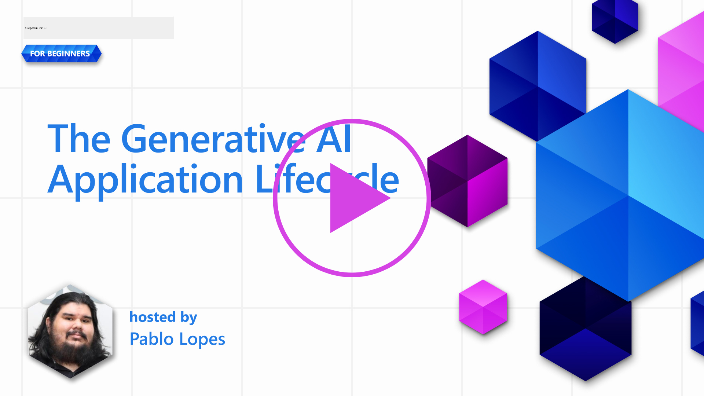
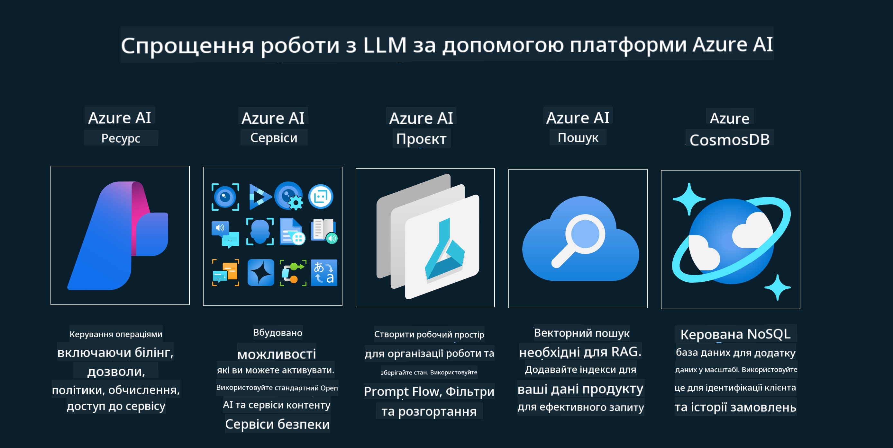
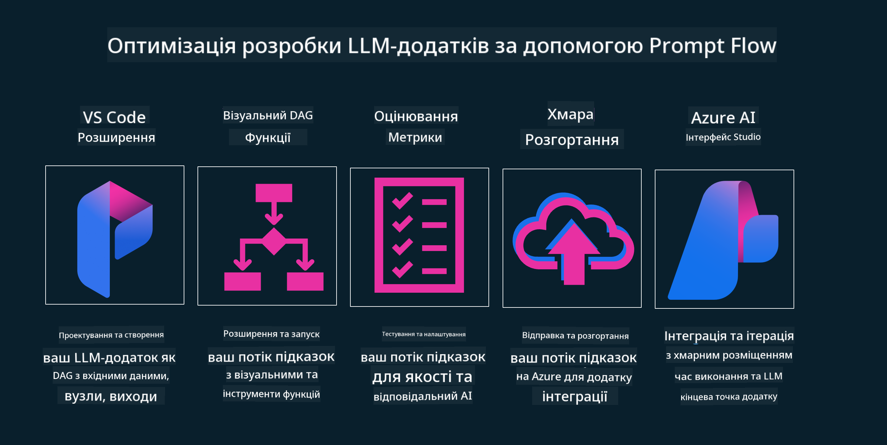

<!--
CO_OP_TRANSLATOR_METADATA:
{
  "original_hash": "b9d32511b27373a1b21b5789d4fda057",
  "translation_date": "2025-10-18T02:17:07+00:00",
  "source_file": "14-the-generative-ai-application-lifecycle/README.md",
  "language_code": "uk"
}
-->

# Життєвий цикл застосунків генеративного штучного інтелекту

Важливе питання для всіх застосунків штучного інтелекту — це актуальність функцій штучного інтелекту, оскільки ця галузь швидко розвивається. Щоб ваш застосунок залишався актуальним, надійним і ефективним, необхідно постійно його моніторити, оцінювати та вдосконалювати. Саме тут вступає в дію життєвий цикл генеративного штучного інтелекту.

Життєвий цикл генеративного штучного інтелекту — це структура, яка допомагає вам пройти етапи розробки, впровадження та підтримки застосунку генеративного штучного інтелекту. Вона допомагає визначити ваші цілі, оцінити продуктивність, виявити виклики та впровадити рішення. Також вона сприяє узгодженню вашого застосунку з етичними та правовими стандартами вашої галузі та зацікавлених сторін. Дотримуючись життєвого циклу генеративного штучного інтелекту, ви можете бути впевнені, що ваш застосунок завжди приносить користь і задовольняє потреби користувачів.

## Вступ

У цьому розділі ви:

- Зрозумієте зміну парадигми від MLOps до LLMOps
- Ознайомитеся з життєвим циклом LLM
- Дізнаєтеся про інструменти для життєвого циклу
- Оціните метрики та методи оцінювання життєвого циклу

## Зрозумійте зміну парадигми від MLOps до LLMOps

LLM — це новий інструмент в арсеналі штучного інтелекту, який має надзвичайну потужність для аналізу та генерації даних у застосунках. Однак ця потужність має свої наслідки для оптимізації завдань штучного інтелекту та класичного машинного навчання.

У зв’язку з цим нам потрібна нова парадигма, щоб адаптувати цей інструмент динамічно та з правильними стимулами. Ми можемо класифікувати старі застосунки штучного інтелекту як "ML-застосунки", а нові — як "GenAI-застосунки" або просто "AI-застосунки", що відображає основні технології та методи, які використовуються на даний момент. Це змінює наш підхід у багатьох аспектах, погляньте на наступне порівняння.

Зверніть увагу, що в LLMOps ми більше зосереджені на розробниках застосунків, використовуючи інтеграції як ключовий момент, застосовуючи "Моделі як послугу" та враховуючи наступні аспекти для метрик:

- Якість: якість відповіді
- Шкода: відповідальний штучний інтелект
- Чесність: обґрунтованість відповіді (Чи має сенс? Чи це правильно?)
- Вартість: бюджет рішення
- Затримка: середній час відповіді на токен

## Життєвий цикл LLM

Спочатку, щоб зрозуміти життєвий цикл і його модифікації, зверніть увагу на наступну інфографіку.

Як ви можете помітити, це відрізняється від звичайних життєвих циклів MLOps. LLM мають багато нових вимог, таких як створення запитів, різні техніки для покращення якості (Fine-Tuning, RAG, Meta-Prompts), різні оцінки та відповідальність у рамках відповідального штучного інтелекту, а також нові метрики оцінювання (якість, шкода, чесність, вартість і затримка).

Наприклад, зверніть увагу на те, як ми генеруємо ідеї. Використовуючи інженерію запитів, ми експериментуємо з різними LLM, щоб дослідити можливості та перевірити, чи може їхня гіпотеза бути правильною.

Зверніть увагу, що це не лінійний процес, а інтегровані цикли, ітеративні та з загальним циклом.

Як ми можемо дослідити ці етапи? Давайте детальніше розглянемо, як можна побудувати життєвий цикл.

Це може виглядати трохи складно, але спочатку зосередимося на трьох основних етапах.

1. Генерація ідей/Дослідження: На цьому етапі ми досліджуємо відповідно до наших бізнес-потреб. Прототипування, створення [PromptFlow](https://microsoft.github.io/promptflow/index.html?WT.mc_id=academic-105485-koreyst) і тестування ефективності гіпотези.
2. Побудова/Розширення: Реалізація. Тепер ми починаємо оцінювати великі набори даних, впроваджувати техніки, такі як Fine-tuning і RAG, щоб перевірити надійність нашого рішення. Якщо це не працює, повторна реалізація, додавання нових етапів у наш потік або реструктуризація даних можуть допомогти. Після тестування нашого потоку та масштабу, якщо це працює і відповідає нашим метрикам, ми готові до наступного етапу.
3. Операціоналізація: Інтеграція. Тепер ми додаємо системи моніторингу та сповіщень до нашої системи, впроваджуємо та інтегруємо застосунок.

Потім ми маємо загальний цикл управління, зосереджений на безпеці, відповідності та управлінні.

Вітаємо, тепер ваш AI-застосунок готовий до роботи та впровадження. Для практичного досвіду ознайомтеся з [демо-версією Contoso Chat.](https://nitya.github.io/contoso-chat/?WT.mc_id=academic-105485-koreys)

Тепер, які інструменти ми можемо використовувати?

## Інструменти для життєвого циклу

Для інструментів Microsoft пропонує [Azure AI Platform](https://azure.microsoft.com/solutions/ai/?WT.mc_id=academic-105485-koreys) та [PromptFlow](https://microsoft.github.io/promptflow/index.html?WT.mc_id=academic-105485-koreyst), які спрощують впровадження вашого циклу та роблять його готовим до використання.

[Azure AI Platform](https://azure.microsoft.com/solutions/ai/?WT.mc_id=academic-105485-koreys) дозволяє використовувати [AI Studio](https://ai.azure.com/?WT.mc_id=academic-105485-koreys). AI Studio — це веб-портал, який дозволяє досліджувати моделі, зразки та інструменти. Управляти вашими ресурсами, розробляти інтерфейси користувача та використовувати SDK/CLI для розробки з акцентом на код.

Azure AI дозволяє використовувати різні ресурси для управління вашими операціями, сервісами, проєктами, пошуком векторами та потребами баз даних.

Створюйте від Proof-of-Concept (POC) до масштабних застосунків за допомогою PromptFlow:

- Проектуйте та створюйте застосунки у VS Code за допомогою візуальних та функціональних інструментів
- Тестуйте та налаштовуйте ваші застосунки для якісного штучного інтелекту з легкістю
- Використовуйте Azure AI Studio для інтеграції та ітерації з хмарою, розгортання та швидкої інтеграції

## Чудово! Продовжуйте навчання!

Чудово, тепер дізнайтеся більше про те, як ми структуруємо застосунок, щоб використовувати ці концепції, з [Contoso Chat App](https://nitya.github.io/contoso-chat/?WT.mc_id=academic-105485-koreyst), щоб побачити, як Cloud Advocacy додає ці концепції в демонстрації. Для отримання додаткового контенту перегляньте нашу [сесію на конференції Ignite!
](https://www.youtube.com/watch?v=DdOylyrTOWg)

Тепер перейдіть до уроку 15, щоб зрозуміти, як [Retrieval Augmented Generation і векторні бази даних](../15-rag-and-vector-databases/README.md?WT.mc_id=academic-105485-koreyst) впливають на генеративний штучний інтелект і допомагають створювати більш захоплюючі застосунки!

---

**Відмова від відповідальності**:  
Цей документ був перекладений за допомогою сервісу автоматичного перекладу [Co-op Translator](https://github.com/Azure/co-op-translator). Хоча ми прагнемо до точності, будь ласка, майте на увазі, що автоматичні переклади можуть містити помилки або неточності. Оригінальний документ на його рідній мові слід вважати авторитетним джерелом. Для критичної інформації рекомендується професійний людський переклад. Ми не несемо відповідальності за будь-які непорозуміння або неправильні тлумачення, що виникають внаслідок використання цього перекладу.