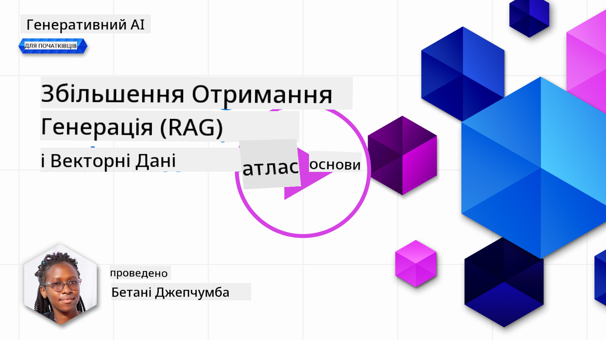
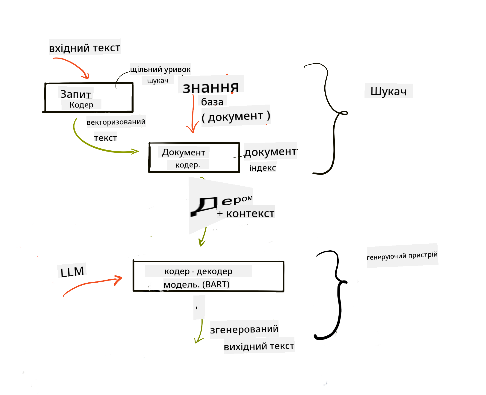
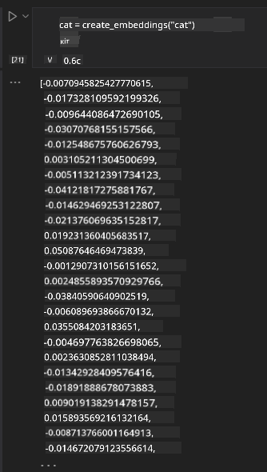

<!--
CO_OP_TRANSLATOR_METADATA:
{
  "original_hash": "e2861bbca91c0567ef32bc77fe054f9e",
  "translation_date": "2025-07-09T16:23:34+00:00",
  "source_file": "15-rag-and-vector-databases/README.md",
  "language_code": "uk"
}
-->
# Retrieval Augmented Generation (RAG) та векторні бази даних

[](https://aka.ms/gen-ai-lesson15-gh?WT.mc_id=academic-105485-koreyst)

У попередньому уроці про пошукові застосунки ми коротко ознайомилися з тим, як інтегрувати власні дані у великі мовні моделі (LLM). У цьому уроці ми детальніше розглянемо концепції прив’язки ваших даних у застосунку на основі LLM, механіку цього процесу та методи зберігання даних, включно з ембедингами та текстом.

> **Відео скоро з’явиться**

## Вступ

У цьому уроці ми розглянемо:

- Вступ до RAG: що це таке і чому його використовують в штучному інтелекті (AI).

- Розуміння векторних баз даних та створення такої для нашого застосунку.

- Практичний приклад інтеграції RAG у застосунок.

## Цілі навчання

Після проходження цього уроку ви зможете:

- Пояснити значення RAG у пошуку та обробці даних.

- Налаштувати застосунок RAG і прив’язати ваші дані до LLM.

- Ефективно інтегрувати RAG та векторні бази даних у застосунки на основі LLM.

## Наш сценарій: покращення LLM за допомогою власних даних

Для цього уроку ми хочемо додати власні нотатки до освітнього стартапу, що дозволить чатботу отримувати більше інформації з різних предметів. Використовуючи ці нотатки, учні зможуть краще вивчати матеріал і розуміти різні теми, що полегшить підготовку до іспитів. Для створення нашого сценарію ми використаємо:

- `Azure OpenAI:` LLM, який ми застосуємо для створення чатбота

- `Урок AI для початківців про нейронні мережі:` це будуть дані, на яких ми базуватимемо наш LLM

- `Azure AI Search` та `Azure Cosmos DB:` векторна база даних для зберігання наших даних і створення індексу пошуку

Користувачі зможуть створювати практичні тести з нотаток, картки для повторення та стислий огляд матеріалу. Для початку розглянемо, що таке RAG і як він працює:

## Retrieval Augmented Generation (RAG)

Чатбот на основі LLM обробляє запити користувачів для генерації відповідей. Він створений для інтерактивної взаємодії та охоплює широкий спектр тем. Проте його відповіді обмежені контекстом, який йому надають, та базовими навчальними даними. Наприклад, знання GPT-4 обмежені вереснем 2021 року, тобто він не знає про події, що сталися після цього часу. Крім того, дані, на яких навчають LLM, не включають конфіденційну інформацію, таку як особисті нотатки або інструкції до продуктів компанії.

### Як працюють RAG (Retrieval Augmented Generation)


Припустимо, ви хочете запустити чатбота, який створює тести з ваших нотаток — вам потрібне підключення до бази знань. Саме тут на допомогу приходить RAG. RAG працює так:

- **База знань:** Перед пошуком документи потрібно завантажити та обробити, зазвичай розбиваючи великі документи на менші частини, перетворюючи їх у текстові ембедінги та зберігаючи у базі даних.

- **Запит користувача:** користувач ставить запитання

- **Пошук:** коли користувач ставить запитання, модель ембедингів знаходить релевантну інформацію у базі знань, щоб надати більше контексту, який буде включено у запит.

- **Покращена генерація:** LLM покращує свою відповідь на основі отриманих даних. Це дозволяє відповідям базуватися не лише на попередньо навчених даних, а й на релевантній інформації з доданого контексту. Отримані дані використовуються для доповнення відповідей LLM. Потім LLM повертає відповідь на запит користувача.



Архітектура RAG реалізована за допомогою трансформерів, що складаються з двох частин: енкодера та декодера. Наприклад, коли користувач ставить запитання, вхідний текст «кодується» у вектори, які відображають значення слів, а вектори «декодуються» у наш індекс документів і генерують новий текст на основі запиту користувача. LLM використовує модель енкодер-декодер для генерації відповіді.

Існують два підходи до реалізації RAG згідно з пропонованою статтею: [Retrieval-Augmented Generation for Knowledge intensive NLP Tasks](https://arxiv.org/pdf/2005.11401.pdf?WT.mc_id=academic-105485-koreyst):

- **_RAG-Sequence_** — використання отриманих документів для прогнозування найкращої можливої відповіді на запит користувача

- **RAG-Token** — використання документів для генерації наступного токена, а потім їх повторний пошук для відповіді на запит користувача

### Чому варто використовувати RAG?

- **Багатство інформації:** забезпечує актуальність текстових відповідей. Це покращує продуктивність у завданнях, що потребують спеціалізованих знань, за рахунок доступу до внутрішньої бази знань.

- Зменшує вигадки, використовуючи **перевірені дані** з бази знань для надання контексту запитам користувачів.

- Це **економічно вигідно**, оскільки дешевше, ніж тонке налаштування LLM.

## Створення бази знань

Наш застосунок базується на особистих даних, а саме — уроці про нейронні мережі з курсу AI для початківців.

### Векторні бази даних

Векторна база даних, на відміну від традиційних, — це спеціалізована база, призначена для зберігання, керування та пошуку векторних ембедингів. Вона зберігає числові представлення документів. Розбиття даних на числові ембедінги полегшує нашій AI-системі розуміння та обробку інформації.

Ми зберігаємо ембедінги у векторних базах даних, оскільки LLM мають обмеження на кількість токенів, які вони можуть прийняти на вхід. Оскільки неможливо передати весь ембединг цілком, їх потрібно розбивати на частини, і коли користувач ставить запитання, найбільш релевантні ембедінги повертаються разом із запитом. Розбиття також знижує витрати на кількість токенів, що передаються через LLM.

Деякі популярні векторні бази даних: Azure Cosmos DB, Clarifyai, Pinecone, Chromadb, ScaNN, Qdrant та DeepLake. Ви можете створити модель Azure Cosmos DB за допомогою Azure CLI командою:

```bash
az login
az group create -n <resource-group-name> -l <location>
az cosmosdb create -n <cosmos-db-name> -r <resource-group-name>
az cosmosdb list-keys -n <cosmos-db-name> -g <resource-group-name>
```

### Від тексту до ембедингів

Перед збереженням даних їх потрібно конвертувати у векторні ембедінги. Якщо ви працюєте з великими документами або довгими текстами, їх можна розбити на частини відповідно до очікуваних запитів. Розбиття можна робити на рівні речень або абзаців. Оскільки розбиття враховує значення слів навколо, можна додати додатковий контекст до частини, наприклад, назву документа або текст перед чи після неї. Розбиття даних можна зробити так:

```python
def split_text(text, max_length, min_length):
    words = text.split()
    chunks = []
    current_chunk = []

    for word in words:
        current_chunk.append(word)
        if len(' '.join(current_chunk)) < max_length and len(' '.join(current_chunk)) > min_length:
            chunks.append(' '.join(current_chunk))
            current_chunk = []

    # If the last chunk didn't reach the minimum length, add it anyway
    if current_chunk:
        chunks.append(' '.join(current_chunk))

    return chunks
```

Після розбиття ми можемо вбудувати текст за допомогою різних моделей ембедингів. Деякі з них: word2vec, ada-002 від OpenAI, Azure Computer Vision та інші. Вибір моделі залежить від мов, які ви використовуєте, типу контенту (текст/зображення/аудіо), розміру вхідних даних і довжини вихідного ембединг-вектора.

Приклад ембедингів тексту за допомогою моделі OpenAI `text-embedding-ada-002`:


## Пошук і векторний пошук

Коли користувач ставить запитання, ретрівер перетворює його у вектор за допомогою енкодера запитів, потім шукає у нашому індексі документів релевантні вектори, пов’язані з вхідним запитом. Після цього обидва вектори — вхідний і документів — конвертуються у текст і передаються у LLM.

### Пошук

Пошук відбувається, коли система намагається швидко знайти документи в індексі, які відповідають критеріям пошуку. Мета ретрівера — отримати документи, які будуть використані для надання контексту і прив’язки LLM до ваших даних.

Існує кілька способів пошуку у базі даних:

- **Пошук за ключовими словами** — використовується для текстового пошуку

- **Семантичний пошук** — враховує семантичне значення слів

- **Векторний пошук** — перетворює документи з тексту у векторні представлення за допомогою моделей ембедингів. Пошук здійснюється за документами, векторні представлення яких найближчі до запиту користувача.

- **Гібридний** — поєднання пошуку за ключовими словами та векторного пошуку.

Проблема пошуку виникає, коли у базі немає схожої відповіді на запит — система поверне найкращу доступну інформацію. Ви можете використовувати такі методи, як встановлення максимальної відстані для релевантності або гібридний пошук, що поєднує ключові слова і вектори. У цьому уроці ми використаємо гібридний пошук — комбінацію векторного та пошуку за ключовими словами. Дані ми збережемо у датафреймі з колонками, що містять частини тексту та ембедінги.

### Векторна схожість

Ретрівер шукає у базі знань ембедінги, які розташовані близько один до одного — найближчого сусіда, оскільки це схожі тексти. Коли користувач ставить запит, він спочатку перетворюється у ембединг, а потім порівнюється з подібними ембедингами. Найпоширеніша метрика для визначення схожості векторів — косинусна схожість, що базується на куті між двома векторами.

Інші альтернативи для вимірювання схожості — евклідова відстань (пряма лінія між кінцями векторів) та скалярний добуток (сума добутків відповідних елементів двох векторів).

### Індекс пошуку

Для пошуку нам потрібно створити індекс для бази знань перед виконанням пошуку. Індекс зберігатиме ембедінги і швидко знаходитиме найбільш схожі частини навіть у великій базі. Індекс можна створити локально за допомогою:

```python
from sklearn.neighbors import NearestNeighbors

embeddings = flattened_df['embeddings'].to_list()

# Create the search index
nbrs = NearestNeighbors(n_neighbors=5, algorithm='ball_tree').fit(embeddings)

# To query the index, you can use the kneighbors method
distances, indices = nbrs.kneighbors(embeddings)
```

### Пересортування (re-ranking)

Після запиту до бази даних може знадобитися відсортувати результати за релевантністю. LLM для пересортування використовує машинне навчання, щоб покращити релевантність результатів, впорядковуючи їх від найбільш релевантних. Використовуючи Azure AI Search, пересортування виконується автоматично за допомогою семантичного ранжування. Приклад роботи пересортування за допомогою найближчих сусідів:

```python
# Find the most similar documents
distances, indices = nbrs.kneighbors([query_vector])

index = []
# Print the most similar documents
for i in range(3):
    index = indices[0][i]
    for index in indices[0]:
        print(flattened_df['chunks'].iloc[index])
        print(flattened_df['path'].iloc[index])
        print(flattened_df['distances'].iloc[index])
    else:
        print(f"Index {index} not found in DataFrame")
```

## Об’єднуємо все разом

Останній крок — додати наш LLM, щоб отримувати відповіді, прив’язані до наших даних. Це можна реалізувати так:

```python
user_input = "what is a perceptron?"

def chatbot(user_input):
    # Convert the question to a query vector
    query_vector = create_embeddings(user_input)

    # Find the most similar documents
    distances, indices = nbrs.kneighbors([query_vector])

    # add documents to query  to provide context
    history = []
    for index in indices[0]:
        history.append(flattened_df['chunks'].iloc[index])

    # combine the history and the user input
    history.append(user_input)

    # create a message object
    messages=[
        {"role": "system", "content": "You are an AI assistant that helps with AI questions."},
        {"role": "user", "content": history[-1]}
    ]

    # use chat completion to generate a response
    response = openai.chat.completions.create(
        model="gpt-4",
        temperature=0.7,
        max_tokens=800,
        messages=messages
    )

    return response.choices[0].message

chatbot(user_input)
```

## Оцінка нашого застосунку

### Метрики оцінки

- Якість відповідей: чи звучать вони природно, плавно і людяно

- Прив’язка даних: чи відповіді базуються на наданих документах

- Релевантність: чи відповіді відповідають і пов’язані з поставленим запитанням

- Плавність — чи граматично коректна відповідь

## Варіанти використання RAG та векторних баз даних

Існує багато випадків, де виклики функцій можуть покращити ваш застосунок, наприклад:

- Питання та відповіді: прив’язка даних компанії до чату, який можуть використовувати співробітники для запитань.

- Рекомендаційні системи: створення системи, що підбирає найбільш схожі значення, наприклад, фільми, ресторани тощо.

- Чатботи: зберігання історії чатів і персоналізація розмови на основі даних користувача.

- Пошук зображень на основі векторних ембедингів, корисний для розпізнавання зображень і виявлення аномалій.

## Підсумок

Ми розглянули основні аспекти RAG: додавання даних у застосунок, запит користувача та отримання відповіді. Для спрощення створення RAG можна використовувати фреймворки, такі як Semantic Kernel, Langchain або Autogen.

## Завдання

Щоб продовжити вивчення Retrieval Augmented Generation (RAG), ви можете:

- Створити фронтенд для застосунку, використовуючи обраний вами фреймворк

- Використати фреймворк, наприклад LangChain або Semantic Kernel, і відтворити ваш застосунок

Вітаємо з завершенням уроку 👏.

## Навчання не зупиняється, продовжуйте свій шлях

Після проходження цього уроку ознайомтеся з нашою [колекцією з навчання Generative AI](https://aka.ms/genai-collection?WT.mc_id=academic-105485-koreyst), щоб продовжувати підвищувати свої знання у сфері генеративного штучного інтелекту!

**Відмова від відповідальності**:  
Цей документ було перекладено за допомогою сервісу автоматичного перекладу [Co-op Translator](https://github.com/Azure/co-op-translator). Хоча ми прагнемо до точності, будь ласка, майте на увазі, що автоматичні переклади можуть містити помилки або неточності. Оригінальний документ рідною мовою слід вважати авторитетним джерелом. Для критично важливої інформації рекомендується звертатися до професійного людського перекладу. Ми не несемо відповідальності за будь-які непорозуміння або неправильні тлумачення, що виникли внаслідок використання цього перекладу.