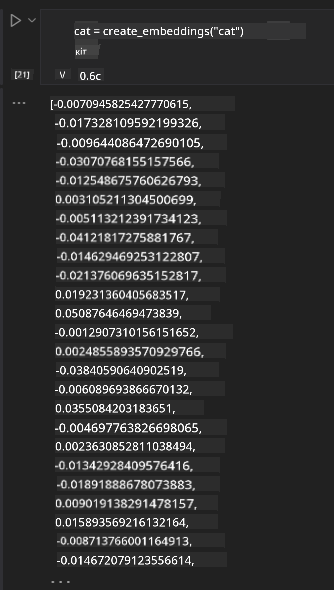

<!--
CO_OP_TRANSLATOR_METADATA:
{
  "original_hash": "e2861bbca91c0567ef32bc77fe054f9e",
  "translation_date": "2025-06-25T22:51:12+00:00",
  "source_file": "15-rag-and-vector-databases/README.md",
  "language_code": "uk"
}
-->
# Генерація з розширеним отриманням (RAG) та векторні бази даних

У уроці про пошукові застосунки ми коротко дізналися, як інтегрувати власні дані у великі мовні моделі (LLMs). У цьому уроці ми заглибимося в концепції закріплення ваших даних у застосунку LLM, механіку процесу та методи зберігання даних, включаючи вектори та текст.

> **Відео скоро з'явиться**

## Вступ

У цьому уроці ми розглянемо наступне:

- Вступ до RAG, що це таке і чому використовується в AI (штучний інтелект).

- Розуміння, що таке векторні бази даних, і створення однієї для нашого застосунку.

- Практичний приклад інтеграції RAG у застосунок.

## Навчальні цілі

Після завершення цього уроку ви зможете:

- Пояснити значення RAG у отриманні та обробці даних.

- Налаштувати застосунок RAG і закріпити свої дані в LLM.

- Ефективна інтеграція RAG і векторних баз даних у застосунках LLM.

## Наш сценарій: покращення наших LLM за допомогою власних даних

Для цього уроку ми хочемо додати наші власні нотатки в освітній стартап, що дозволить чат-боту отримувати більше інформації про різні предмети. Використовуючи наші нотатки, учні зможуть краще вчитися та розуміти різні теми, що полегшить підготовку до іспитів. Щоб створити наш сценарій, ми будемо використовувати:

- `Azure OpenAI:` LLM, який ми будемо використовувати для створення нашого чат-бота

- `AI for beginners' lesson on Neural Networks`: це будуть дані, на яких ми закріпимо наш LLM

- `Azure AI Search` та `Azure Cosmos DB:` векторна база даних для зберігання наших даних і створення пошукового індексу

Користувачі зможуть створювати практичні тести зі своїх нотаток, картки для повторення та підсумовувати їх до стислих оглядів. Щоб розпочати, давайте подивимося, що таке RAG і як він працює:

## Генерація з розширеним отриманням (RAG)

Чат-бот на основі LLM обробляє запити користувачів для генерації відповідей. Він призначений для інтерактивності та взаємодії з користувачами з широкого спектра тем. Однак його відповіді обмежені контекстом, що надається, та основними даними навчання. Наприклад, знання GPT-4 обмежуються вереснем 2021 року, тобто йому бракує знань про події, що сталися після цього періоду. Крім того, дані, що використовуються для навчання LLM, виключають конфіденційну інформацію, таку як особисті нотатки або керівництво з продукту компанії.

### Як працюють RAG (Генерація з розширеним отриманням)

Припустимо, ви хочете розгорнути чат-бота, який створює тести з ваших нотаток, вам знадобиться підключення до бази знань. Ось тут на допомогу приходить RAG. RAG працює наступним чином:

- **База знань:** Перед отриманням ці документи потрібно завантажити та попередньо обробити, зазвичай розбиваючи великі документи на менші частини, перетворюючи їх на текстові вектори та зберігаючи в базі даних.

- **Запит користувача:** користувач задає питання

- **Отримання:** Коли користувач задає питання, модель векторизації отримує релевантну інформацію з нашої бази знань, щоб надати більше контексту, який буде включено в запит.

- **Розширена генерація:** LLM покращує свою відповідь на основі отриманих даних. Це дозволяє відповіді, що генеруються, бути не лише на основі попередньо навчених даних, але й на основі релевантної інформації з доданого контексту. Отримані дані використовуються для розширення відповідей LLM. Потім LLM повертає відповідь на запитання користувача.

Архітектура RAG реалізується за допомогою трансформерів, що складаються з двох частин: енкодера та декодера. Наприклад, коли користувач задає питання, вхідний текст "кодується" у вектори, що захоплюють значення слів, і вектори "декодуються" в наш документний індекс та генерують новий текст на основі запиту користувача. LLM використовує як модель енкодера-декодера, щоб згенерувати вихід.

Два підходи до реалізації RAG згідно з запропонованою статтею: [Генерація з розширеним отриманням для знання інтенсивних NLP (програмне забезпечення для обробки природної мови) завдань](https://arxiv.org/pdf/2005.11401.pdf?WT.mc_id=academic-105485-koreyst) це:

- **_RAG-Sequence_** використання отриманих документів для передбачення найкращої можливої відповіді на запит користувача

- **RAG-Token** використання документів для генерації наступного токена, потім отримання їх для відповіді на запит користувача

### Чому ви б використовували RAG?

- **Інформаційна насиченість:** забезпечує актуальність та оновленість текстових відповідей. Це, отже, підвищує продуктивність у завданнях, специфічних для домену, отримуючи доступ до внутрішньої бази знань.

- Зменшує вигадки, використовуючи **перевірені дані** в базі знань, щоб надати контекст до запитів користувача.

- Це **економічно ефективно**, оскільки вони є більш економічними порівняно з тонким налаштуванням LLM.

## Створення бази знань

Наш застосунок базується на наших особистих даних, тобто на уроці про нейронні мережі в навчальному плані AI для початківців.

### Векторні бази даних

Векторна база даних, на відміну від традиційних баз даних, є спеціалізованою базою даних, призначеною для зберігання, керування та пошуку векторів. Вона зберігає числові представлення документів. Розбиття даних на числові вектори полегшує розуміння та обробку даних нашою AI системою.

Ми зберігаємо наші вектори у векторних базах даних, оскільки LLM мають обмеження на кількість токенів, які вони приймають як вхідні дані. Оскільки ви не можете передати всі вектори до LLM, нам потрібно буде розбити їх на частини, і коли користувач задає питання, вектори, найбільш схожі на питання, будуть повернуті разом із запитом. Розбиття також знижує витрати на кількість токенів, переданих через LLM.

Деякі популярні векторні бази даних включають Azure Cosmos DB, Clarifyai, Pinecone, Chromadb, ScaNN, Qdrant та DeepLake. Ви можете створити модель Azure Cosmos DB за допомогою Azure CLI за допомогою наступної команди:

```bash
az login
az group create -n <resource-group-name> -l <location>
az cosmosdb create -n <cosmos-db-name> -r <resource-group-name>
az cosmosdb list-keys -n <cosmos-db-name> -g <resource-group-name>
```

### Від тексту до векторів

Перед тим як зберегти наші дані, нам потрібно буде перетворити їх у векторні вектори перед тим, як вони будуть збережені в базі даних. Якщо ви працюєте з великими документами або довгими текстами, ви можете розбити їх на частини на основі запитів, які ви очікуєте. Розбиття можна виконати на рівні речення або на рівні абзацу. Оскільки розбиття виводить значення з слів навколо них, ви можете додати інший контекст до частини, наприклад, додавши назву документа або включивши деякий текст до або після частини. Ви можете розбити дані наступним чином:

```python
def split_text(text, max_length, min_length):
    words = text.split()
    chunks = []
    current_chunk = []

    for word in words:
        current_chunk.append(word)
        if len(' '.join(current_chunk)) < max_length and len(' '.join(current_chunk)) > min_length:
            chunks.append(' '.join(current_chunk))
            current_chunk = []

    # If the last chunk didn't reach the minimum length, add it anyway
    if current_chunk:
        chunks.append(' '.join(current_chunk))

    return chunks
```

Після розбиття ми можемо потім векторизувати наш текст, використовуючи різні моделі векторизації. Деякі моделі, які ви можете використовувати, включають: word2vec, ada-002 від OpenAI, Azure Computer Vision та багато інших. Вибір моделі для використання залежатиме від мов, які ви використовуєте, типу вмісту, що кодується (текст/зображення/аудіо), розміру вхідних даних, які вона може кодувати, та довжини виходу векторизації.

Приклад векторизованого тексту, використовуючи модель OpenAI `text-embedding-ada-002`:


## Отримання та векторний пошук

Коли користувач задає питання, система перетворює його у вектор, використовуючи енкодер запиту, потім здійснює пошук у нашому індексі пошуку документів для релевантних векторів у документі, які пов'язані з вхідними даними. Після завершення вона перетворює як вхідний вектор, так і вектори документів у текст і передає їх через LLM.

### Отримання

Отримання відбувається, коли система намагається швидко знайти документи з індексу, які задовольняють критеріям пошуку. Мета отримувача - отримати документи, які будуть використані для надання контексту та закріплення LLM на ваших даних.

Існує кілька способів виконання пошуку в нашій базі даних, таких як:

- **Пошук за ключовими словами** - використовується для текстових пошуків

- **Семантичний пошук** - використовує семантичне значення слів

- **Векторний пошук** - перетворює документи з тексту у векторні представлення, використовуючи моделі векторизації. Отримання буде здійснено шляхом запиту документів, чиї векторні представлення найближчі до запитання користувача.

- **Гібридний** - комбінація як пошуку за ключовими словами, так і векторного пошуку.

Проблема з отриманням виникає, коли у базі даних немає подібної відповіді на запит, система тоді поверне найкращу інформацію, яку вона може отримати, однак, ви можете використовувати такі тактики, як встановлення максимальної відстані для релевантності або використання гібридного пошуку, який поєднує як ключові слова, так і векторний пошук. У цьому уроці ми будемо використовувати гібридний пошук, комбінацію як векторного, так і пошуку за ключовими словами. Ми зберігатимемо наші дані у фреймі даних з колонками, що містять частини, а також вектори.

### Векторна схожість

Отримувач буде шукати у базі знань вектори, які розташовані близько один до одного, найближчий сусід, оскільки це тексти, які схожі. У випадку, коли користувач задає запит, він спочатку векторизується, потім порівнюється з подібними векторами. Звичайною мірою, яка використовується для визначення, наскільки схожі різні вектори, є косинусна схожість, яка базується на куті між двома векторами.

Ми можемо вимірювати схожість, використовуючи інші альтернативи, які ми можемо використовувати, такі як евклідова відстань, яка є прямою лінією між кінцевими точками векторів, і скалярний добуток, який вимірює суму добутків відповідних елементів двох векторів.

### Пошуковий індекс

Під час виконання отримання нам потрібно буде створити пошуковий індекс для нашої бази знань перед виконанням пошуку. Індекс буде зберігати наші вектори та зможе швидко отримати найбільш схожі частини навіть у великій базі даних. Ми можемо створити наш індекс локально, використовуючи:

```python
from sklearn.neighbors import NearestNeighbors

embeddings = flattened_df['embeddings'].to_list()

# Create the search index
nbrs = NearestNeighbors(n_neighbors=5, algorithm='ball_tree').fit(embeddings)

# To query the index, you can use the kneighbors method
distances, indices = nbrs.kneighbors(embeddings)
```

### Пересортування

Після того, як ви запитали базу даних, можливо, вам знадобиться відсортувати результати від найбільш релевантних. Пересортовувач LLM використовує машинне навчання, щоб покращити релевантність результатів пошуку, впорядковуючи їх від найбільш релевантних. Використовуючи Azure AI Search, пересортування виконується автоматично для вас, використовуючи семантичний пересортувач. Приклад того, як працює пересортування, використовуючи найближчих сусідів:

```python
# Find the most similar documents
distances, indices = nbrs.kneighbors([query_vector])

index = []
# Print the most similar documents
for i in range(3):
    index = indices[0][i]
    for index in indices[0]:
        print(flattened_df['chunks'].iloc[index])
        print(flattened_df['path'].iloc[index])
        print(flattened_df['distances'].iloc[index])
    else:
        print(f"Index {index} not found in DataFrame")
```

## Збираємо все разом

Останнім кроком є додавання нашого LLM до процесу, щоб мати можливість отримувати відповіді, що закріплені на наших даних. Ми можемо реалізувати це наступним чином:

```python
user_input = "what is a perceptron?"

def chatbot(user_input):
    # Convert the question to a query vector
    query_vector = create_embeddings(user_input)

    # Find the most similar documents
    distances, indices = nbrs.kneighbors([query_vector])

    # add documents to query  to provide context
    history = []
    for index in indices[0]:
        history.append(flattened_df['chunks'].iloc[index])

    # combine the history and the user input
    history.append(user_input)

    # create a message object
    messages=[
        {"role": "system", "content": "You are an AI assistant that helps with AI questions."},
        {"role": "user", "content": history[-1]}
    ]

    # use chat completion to generate a response
    response = openai.chat.completions.create(
        model="gpt-4",
        temperature=0.7,
        max_tokens=800,
        messages=messages
    )

    return response.choices[0].message

chatbot(user_input)
```

## Оцінка нашого застосунку

### Метрики оцінки

- Якість наданих відповідей, забезпечуючи, щоб вони звучали природно, вільно та по-людськи

- Закріпленість даних: оцінка, чи відповідь походить з наданих документів

- Релевантність: оцінка, чи відповідає відповідь і чи пов'язана з поставленим запитанням

- Вільність - чи має сенс відповідь граматично

## Випадки використання RAG (Генерація з розширеним отриманням) та векторних баз даних

Існує багато різних випадків використання, де функціональні виклики можуть покращити ваш застосунок, наприклад:

- Запитання та відповіді: закріплення даних вашої компанії для чату, який можуть використовувати співробітники для запитів.

- Системи рекомендацій: де ви можете створити систему, що співставляє найбільш схожі значення, наприклад, фільми, ресторани та багато іншого.

- Послуги чат-ботів: ви можете зберігати історію чатів та персоналізувати розмову на основі даних користувача.

- Пошук зображень на основі векторних векторів, корисний при розпізнаванні зображень та виявленні аномалій.

## Підсумок

Ми розглянули основні аспекти RAG від додавання наших даних до застосунку, запиту користувача та виходу. Щоб спростити створення RAG, ви можете використовувати фреймворки, такі як Semanti Kernel, Langchain або Autogen.

## Завдання

Щоб продовжити вивчення Генерації з розширеним отриманням (RAG), ви можете створити:

- Створити фронтенд для застосунку, використовуючи обраний вами фреймворк

- Використовувати фреймворк, або LangChain, або Semantic Kernel, та відтворити ваш застосунок.

Вітаємо з завершенням уроку 👏.

## Навчання не закінчується тут, продовжуйте подорож

Після завершення цього уроку перегляньте нашу [Колекцію навчання з генеративного AI](https://aka.ms/genai-collection?WT.mc_id=academic-105485-koreyst), щоб продовжити підвищувати свої знання в галузі генеративного AI!

**Відмова від відповідальності**:  
Цей документ було перекладено за допомогою служби автоматичного перекладу [Co-op Translator](https://github.com/Azure/co-op-translator). Хоча ми прагнемо до точності, зверніть увагу, що автоматизовані переклади можуть містити помилки або неточності. Оригінальний документ на його рідній мові слід вважати авторитетним джерелом. Для отримання важливої інформації рекомендується професійний людський переклад. Ми не несемо відповідальності за будь-які непорозуміння або неправильні тлумачення, що виникають внаслідок використання цього перекладу.