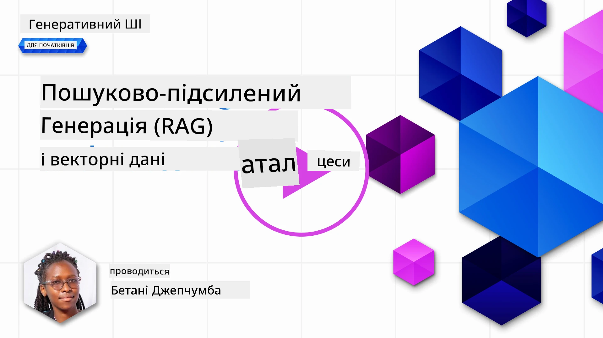
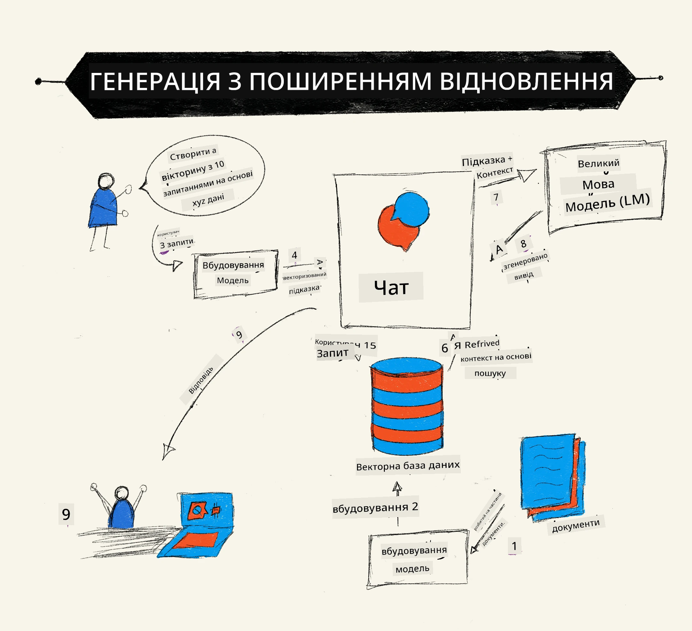
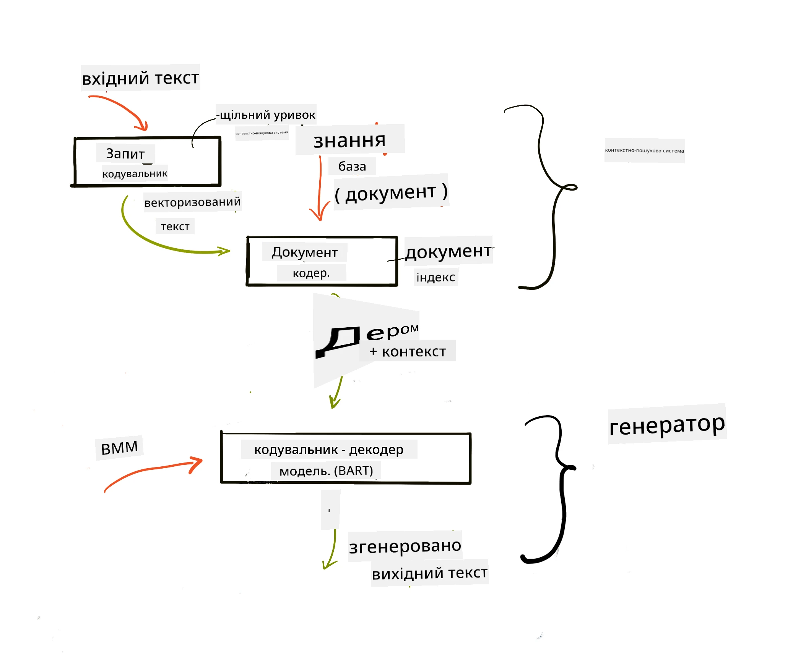
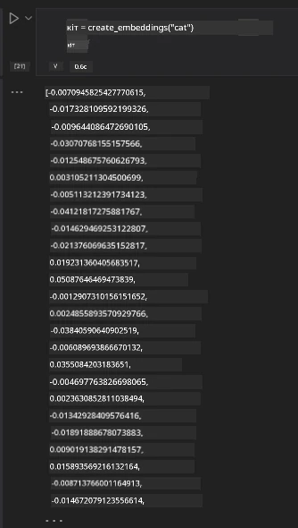

# Генерація з підсиленням пошуком (RAG) та векторні бази даних

[](https://youtu.be/4l8zhHUBeyI?si=BmvDmL1fnHtgQYkL)

У уроці про застосунки пошуку ми коротко розглянули, як інтегрувати власні дані в великі мовні моделі (LLM). У цьому уроці ми детальніше розглянемо концепції закріплення ваших даних у застосунку LLM, механіку цього процесу та методи зберігання даних, включаючи як ембеддинги, так і текст.

> **Відео скоро з’явиться**

## Вступ

У цьому уроці ми розглянемо наступне:

- Вступ до RAG, що це таке і навіщо воно використовується в ШІ (штучному інтелекті).

- Розуміння, що таке векторні бази даних і створення такої для нашого застосунку.

- Практичний приклад інтеграції RAG у застосунок.

## Цілі навчання

Після завершення цього уроку ви зможете:

- Пояснити значення RAG у вилученні та обробці даних.

- Налаштувати застосунок RAG та закріпити ваші дані до LLM

- Ефективно інтегрувати RAG і векторні бази даних у застосунки LLM.

## Наш сценарій: покращення наших LLM власними даними

Для цього уроку ми хочемо додати власні нотатки в освітній стартап, що дозволить чат-боту отримувати більше інформації про різні теми. Використовуючи наші нотатки, учні зможуть краще вивчати матеріал і розуміти різні теми, що полегшить підготовку до іспитів. Для створення нашого сценарію ми використаємо:

- `Azure OpenAI:` LLM, який ми використовуватимемо для створення чат-бота

- `Урок "ШІ для початківців" про нейронні мережі`: це будуть дані, на яких ми закріпимо наш LLM

- `Azure AI Search` та `Azure Cosmos DB:` векторна база даних для зберігання наших даних і створення пошукового індексу

Користувачі зможуть створювати практичні тести зі своїх нотаток, флеш-картки для повторення та стислий огляд. Щоб розпочати, давайте розглянемо що таке RAG і як воно працює:

## Генерація з підсиленням пошуком (RAG)

Чат-бот на базі LLM обробляє запити користувача для генерації відповідей. Він призначений для інтерактивного спілкування та відповідає на широкий спектр тем. Однак його відповіді обмежені наданим контекстом і базовими навчальними даними. Наприклад, знання GPT-4 окінчуються вереснем 2021 року, тобто він не знає про події, що відбулися після цього періоду. Крім того, дані, що використовуються для навчання LLM, не включають конфіденційну інформацію, таку як особисті нотатки або інструкції компанії.

### Як працює RAG (Генерація з підсиленням пошуком)



Припустимо, ви хочете розгорнути чат-бота, який створює тести на основі ваших нотаток, вам буде потрібне з'єднання з базою знань. Саме тут на допомогу приходить RAG. RAG працює наступним чином:

- **База знань:** перед вилученням ці документи потрібно імпортувати і обробити, зазвичай розбиваючи великі документи на менші шматки, перетворювати їх у текстові ембеддинги та зберігати в базі даних.

- **Запит користувача:** користувач ставить питання

- **Вилучення:** коли користувач задає питання, модель ембеддингу вилучає релевантну інформацію з нашої бази знань, щоб надати більший контекст, який буде включений до запиту.

- **Генерація з підсиленням:** LLM покращує свою відповідь на основі вилучених даних. Це дозволяє відповідь формуватися не лише на основі попередньо навчених даних, але й релевантної інформації з доданого контексту. Вилучені дані використовуються для підсилення відповідей LLM. Потім LLM повертає відповідь на запит користувача.



Архітектура RAG реалізована з використанням трансформерів, що складаються з двох частин: енкодера та декодера. Наприклад, коли користувач ставить питання, вхідний текст «кодується» у вектори, які захоплюють значення слів, потім ці вектори «декодуються» в індекс документів і генерують новий текст на основі запиту користувача. LLM використовує модель енкодер-декодер для генерації результату.

Існують два підходи до імплементації RAG згідно з пропонованою статтею: [Retrieval-Augmented Generation for Knowledge intensive NLP (natural language processing software) Tasks](https://arxiv.org/pdf/2005.11401.pdf?WT.mc_id=academic-105485-koreyst):

- **_RAG-Sequence_** — використання вилучених документів для прогнозування найкращої відповіді на запит користувача

- **RAG-Token** — генерує наступний токен, використовуючи документи, а потім вилучає їх для відповіді на питання користувача

### Чому варто використовувати RAG?

- **Насиченість інформації:** гарантує, що текстові відповіді є актуальними та сучасними. Це покращує продуктивність у завданнях зі спеціалізованої області, отримуючи доступ до внутрішньої бази знань.

- Зменшує вигадки, використовуючи **перевірені дані** в базі знань для надання контексту запитам користувачів.

- Це **економічно ефективно**, оскільки вартість таких рішень нижча, ніж тонка настройка LLM.

## Створення бази знань

Наш застосунок базується на наших особистих даних, тобто уроці про нейронні мережі з курсу «ШІ для початківців».

### Векторні бази даних

Векторна база даних, на відміну від традиційних баз, — це спеціалізована база, призначена для зберігання, управління та пошуку ембеддингів. Вона зберігає числові представлення документів. Розбивка даних на числові ембеддинги полегшує розуміння і обробку даних нашим ШІ.

Ми зберігаємо ембеддинги у векторних базах даних, оскільки LLM має обмеження на кількість токенів, які він приймає на вхід. Оскільки не можна передати повний ембеддинг до LLM, нам потрібно розбивати їх на частини, і коли користувач ставить питання, ембеддинги, найближчі до запиту, повернуться разом із запитом. Розбивка також знижує витрати на кількість токенів, переданих через LLM.

Деякі популярні векторні бази включають Azure Cosmos DB, Clarifyai, Pinecone, Chromadb, ScaNN, Qdrant і DeepLake. Ви можете створити модель Azure Cosmos DB за допомогою Azure CLI з такими командами:

```bash
az login
az group create -n <resource-group-name> -l <location>
az cosmosdb create -n <cosmos-db-name> -r <resource-group-name>
az cosmosdb list-keys -n <cosmos-db-name> -g <resource-group-name>
```

### Від тексту до ембеддингів

Перед збереженням даних потрібно конвертувати їх у векторні ембеддинги. Якщо у вас великі документи або довгий текст, їх можна розбити на частини залежно від очікуваних запитів. Розбивка може бути на рівні речень або абзаців. Оскільки значення частинок визначаються словами навколо них, можна додати додатковий контекст, наприклад, заголовок документа або текст перед чи після частини. Розбивку можна виконати так:

```python
def split_text(text, max_length, min_length):
    words = text.split()
    chunks = []
    current_chunk = []

    for word in words:
        current_chunk.append(word)
        if len(' '.join(current_chunk)) < max_length and len(' '.join(current_chunk)) > min_length:
            chunks.append(' '.join(current_chunk))
            current_chunk = []

    # Якщо останній шматок не досяг мінімальної довжини, додайте його все одно
    if current_chunk:
        chunks.append(' '.join(current_chunk))

    return chunks
```

Після розбивки ми можемо вбудувати текст, використовуючи різні моделі ембеддингів. Серед моделей, які можна використовувати: word2vec, ada-002 від OpenAI, Azure Computer Vision та багато інших. Вибір моделі залежить від мови, типу коду вмісту (текст/зображення/аудіо), розміру вхідних даних для кодування і довжини вихідного ембеддингу.

Приклад вбудованого тексту, створеного моделлю OpenAI `text-embedding-ada-002`:


## Вилучення та векторний пошук

Коли користувач ставить питання, ретрівер перетворює його у вектор за допомогою енкодера запиту, потім шукає у нашому індексі документів релевантні вектори, пов’язані з вхідними даними. Після цього він конвертує і вхідний вектор, і вектори документів у текст і подає їх у LLM.

### Вилучення

Вилучення відбувається, коли система намагається швидко знайти документи з індексу, що відповідають критеріям пошуку. Завдання ретрівера — отримати документи, які будуть використані для надання контексту і закріплення LLM на ваших даних.

Існує декілька способів пошуку у базі даних, таких як:

- **Пошук за ключовими словами** – використовується для текстових пошуків

- **Векторний пошук** – перетворює документи з тексту у векторні представлення за допомогою моделей ембеддингів, що дозволяє виконувати **семантичний пошук** на основі значення слів. Пошук здійснюється за запитами документів, векторні представлення яких найближчі до запиту користувача.

- **Гібридний** – комбінація пошуку за ключовими словами та векторного пошуку.

Виклик вилучення складний, коли в базі немає схожої відповіді на запит; в такому випадку система поверне найкращу доступну інформацію. Ви можете використовувати такі прийоми, як встановлення максимальної відстані релевантності або гібридний пошук, що поєднує ключові слова та векторний пошук. У цьому уроці ми використаємо гібридний пошук, комбінуючи векторний та текстовий пошук. Дані збережемо у датафреймі з колонками для шматків тексту та ембеддингів.

### Векторна подібність

Ретрівер шукатиме з ембеддингів у базі знань найближчі один до одного, оскільки такі тексти подібні. У сценарії користувач спочатку задає запит, який ембеддиться, а потім співвідноситься із подібними ембеддингами. Звичайним методом вимірювання подібності векторів є косинусна подібність, основана на куті між двома векторами.

Ми можемо також вимірювати подібність іншими способами, такими як евклідова відстань (пряма лінія між кінцями векторів) або скалярний добуток (сумарне добуток відповідних елементів двох векторів).

### Пошуковий індекс

Для вилучення нам потрібно створити пошуковий індекс для нашої бази знань перед проведенням пошуку. Індекс зберігатиме ембеддинги і зможе швидко вилучати найбільш подібні шматки навіть у великій базі даних. Ми можемо створити індекс локально за допомогою:

```python
from sklearn.neighbors import NearestNeighbors

embeddings = flattened_df['embeddings'].to_list()

# Створити пошуковий індекс
nbrs = NearestNeighbors(n_neighbors=5, algorithm='ball_tree').fit(embeddings)

# Щоб виконати запит до індексу, ви можете використовувати метод kneighbors
distances, indices = nbrs.kneighbors(embeddings)
```

### Повторне ранжування

Після отримання результатів запиту можливо доведеться відсортувати їх за релевантністю. LLM для повторного ранжування використовує машинне навчання, щоб підвищити релевантність результатів, впорядковуючи їх від найбільш релевантних. При використанні Azure AI Search повторне ранжування виконується автоматично за допомогою семантичного повторного ранжувальника. Приклад роботи повторного ранжування з найближчими сусідами:

```python
# Знайти найбільш схожі документи
distances, indices = nbrs.kneighbors([query_vector])

index = []
# Вивести найбільш схожі документи
for i in range(3):
    index = indices[0][i]
    for index in indices[0]:
        print(flattened_df['chunks'].iloc[index])
        print(flattened_df['path'].iloc[index])
        print(flattened_df['distances'].iloc[index])
    else:
        print(f"Index {index} not found in DataFrame")
```

## Об’єднання всього разом

Останній крок — додати наш LLM до ланцюга, щоб отримувати відповіді, закріплені на наших даних. Ми можемо реалізувати це так:

```python
user_input = "what is a perceptron?"

def chatbot(user_input):
    # Перетворити питання у вектор запиту
    query_vector = create_embeddings(user_input)

    # Знайти найбільш схожі документи
    distances, indices = nbrs.kneighbors([query_vector])

    # додати документи до запиту для надання контексту
    history = []
    for index in indices[0]:
        history.append(flattened_df['chunks'].iloc[index])

    # об’єднати історію та введення користувача
    history.append(user_input)

    # створити об’єкт повідомлення
    messages=[
        {"role": "system", "content": "You are an AI assistant that helps with AI questions."},
        {"role": "user", "content": "\n\n".join(history) }
    ]

    # використовувати Responses API для генерації відповіді
    response = client.responses.create(
        model="gpt-5-mini",
        max_output_tokens=800,
        input=messages,
        store=False,
    )

    return response.output_text

chatbot(user_input)
```

## Оцінка нашого застосунку

### Метрики оцінки

- Якість відповідей, якість звучання: природно, плавно й людськоподібно

- Закріпленість даних: оцінка, чи відповідь була сформована на основі наданих документів

- Релевантність: оцінка відповідності та пов’язаності відповіді із заданим запитом

- Плавність - чи граматично осмислена відповідь

## Випадки використання RAG (Генерація з підсиленням пошуком) та векторних баз даних

Існує багато випадків використання, де функціонал викликів може покращити ваш застосунок, наприклад:

- Питання та відповіді: закріплення даних компанії в чаті, щоб співробітники могли ставити питання.

- Рекомендаційні системи: створення системи, що підбирає найбільш подібні значення, наприклад, фільми, ресторани тощо.

- Чат-боти: зберігання історії чатів та персоналізація розмови на основі даних користувача.

- Пошук зображень на основі векторних ембеддингів, корисний при розпізнаванні зображень і виявленні аномалій.

## Підсумок

Ми розглянули основні аспекти RAG — від додавання даних у застосунок, запиту користувача до отримання відповіді. Для спрощення створення RAG ви можете використовувати фреймворки, такі як Semantic Kernel, Langchain або Autogen.

## Завдання

Щоб продовжити вивчення Генерації з підсиленням пошуком (RAG), ви можете:

- Створити front-end для застосунку з використанням обраного вами фреймворку

- Використати фреймворк, LangChain або Semantic Kernel, і відтворити ваш застосунок

Вітаємо з завершенням уроку 👏.

## Навчання не закінчується тут, продовжуйте шлях

Після завершення цього уроку перегляньте нашу [колекцію навчання з генеративного ШІ](https://aka.ms/genai-collection?WT.mc_id=academic-105485-koreyst), щоб продовжувати розвивати свої знання з Генеративного ШІ!

---

<!-- CO-OP TRANSLATOR DISCLAIMER START -->
**Відмова від відповідальності**:
Цей документ було перекладено за допомогою сервісу штучного інтелекту для перекладу [Co-op Translator](https://github.com/Azure/co-op-translator). Хоча ми прагнемо до точності, будь ласка, майте на увазі, що автоматичні переклади можуть містити помилки або неточності. Оригінальний документ рідною мовою слід вважати авторитетним джерелом. Для критично важливої інформації рекомендується професійний людський переклад. Ми не несемо відповідальності за будь-які непорозуміння або неправильні тлумачення, що виникли внаслідок використання цього перекладу.
<!-- CO-OP TRANSLATOR DISCLAIMER END -->