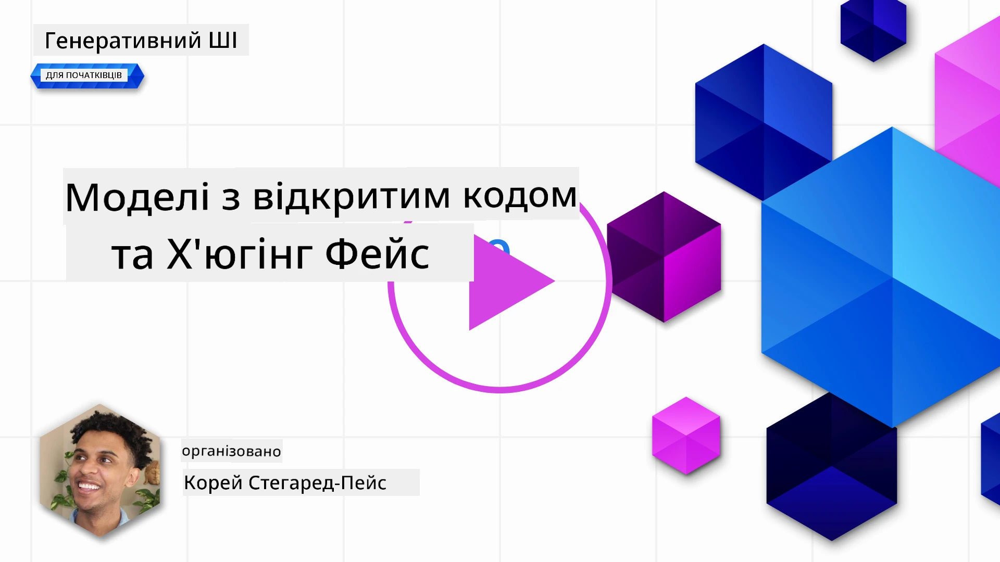
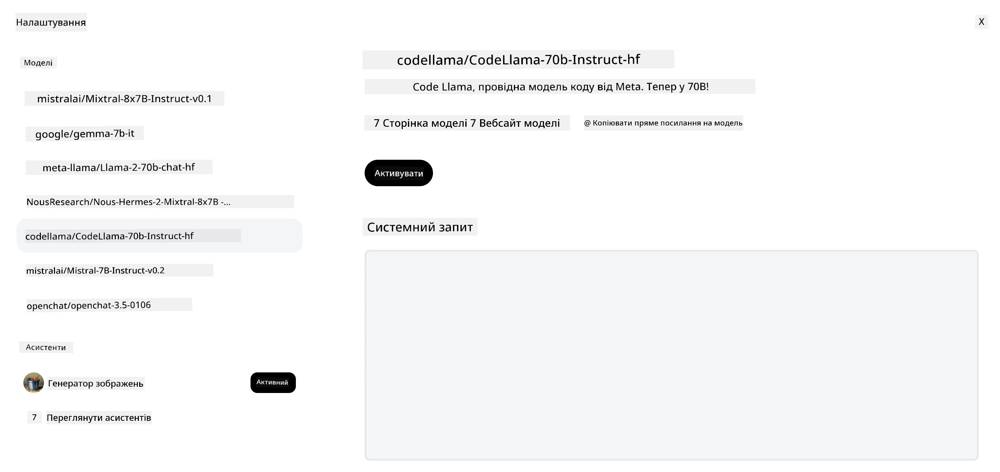
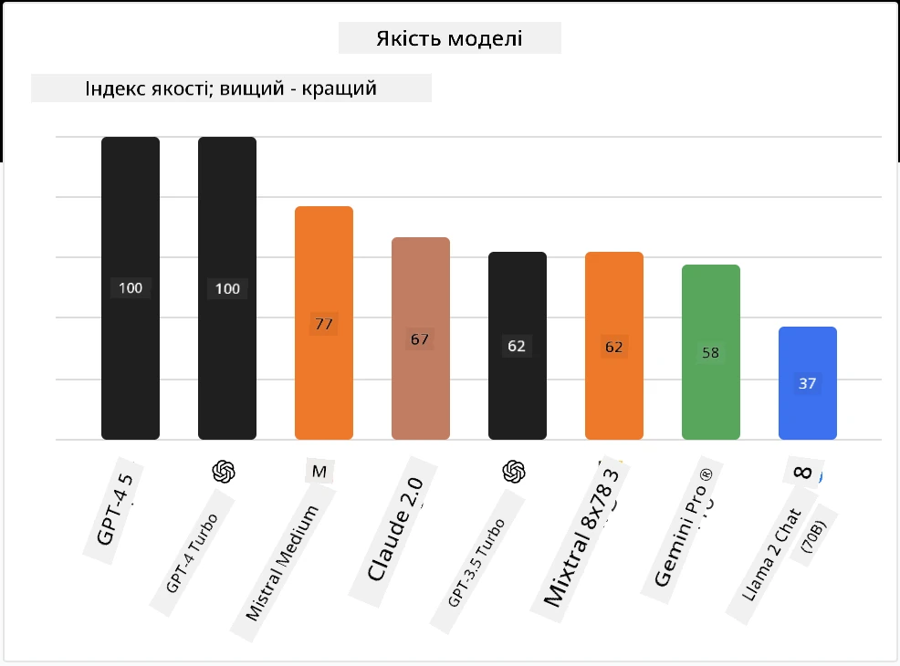

<!--
CO_OP_TRANSLATOR_METADATA:
{
  "original_hash": "85b754d4dc980f270f264d17116d9a5f",
  "translation_date": "2025-12-19T17:45:08+00:00",
  "source_file": "16-open-source-models/README.md",
  "language_code": "uk"
}
-->

## Вступ

Світ відкритих LLM захоплюючий і постійно розвивається. Цей урок має на меті надати глибокий огляд відкритих моделей. Якщо ви шукаєте інформацію про те, як пропрієтарні моделі порівнюються з відкритими моделями, перейдіть до уроку ["Дослідження та порівняння різних LLM"](../02-exploring-and-comparing-different-llms/README.md?WT.mc_id=academic-105485-koreyst). Цей урок також охоплює тему тонкого налаштування, але більш детальне пояснення можна знайти в уроці ["Тонке налаштування LLM"](../18-fine-tuning/README.md?WT.mc_id=academic-105485-koreyst).

## Цілі навчання

- Отримати розуміння відкритих моделей
- Зрозуміти переваги роботи з відкритими моделями
- Ознайомитися з відкритими моделями, доступними на Hugging Face та в Azure AI Studio

## Що таке відкриті моделі?

Відкрите програмне забезпечення відіграло ключову роль у розвитку технологій у різних сферах. Ініціатива Open Source (OSI) визначила [10 критеріїв для програмного забезпечення](https://web.archive.org/web/20241126001143/https://opensource.org/osd?WT.mc_id=academic-105485-koreyst), щоб його можна було класифікувати як відкрите. Вихідний код має бути відкрито доступним за ліцензією, затвердженою OSI.

Хоча розробка LLM має схожі елементи з розробкою програмного забезпечення, процес не є ідентичним. Це викликало багато дискусій у спільноті щодо визначення відкритого коду в контексті LLM. Для того, щоб модель відповідала традиційному визначенню відкритого коду, наступна інформація має бути публічно доступною:

- Набори даних, використані для навчання моделі.
- Повні ваги моделі як частина навчання.
- Код оцінювання.
- Код тонкого налаштування.
- Повні ваги моделі та метрики навчання.

Наразі існує лише кілька моделей, які відповідають цим критеріям. [Модель OLMo, створена Allen Institute for Artificial Intelligence (AllenAI)](https://huggingface.co/allenai/OLMo-7B?WT.mc_id=academic-105485-koreyst) є однією з таких.

У цьому уроці ми надалі будемо називати моделі "відкритими моделями", оскільки вони можуть не відповідати вищезазначеним критеріям на момент написання.

## Переваги відкритих моделей

**Висока налаштовуваність** – Оскільки відкриті моделі випускаються з детальною інформацією про навчання, дослідники та розробники можуть змінювати внутрішні частини моделі. Це дозволяє створювати високоспеціалізовані моделі, які тонко налаштовані для конкретного завдання або сфери дослідження. Прикладами є генерація коду, математичні операції та біологія.

**Вартість** – Вартість за токен при використанні та розгортанні цих моделей нижча, ніж у пропрієтарних моделей. При створенні додатків Generative AI слід враховувати співвідношення продуктивності та ціни при роботі з цими моделями для вашого випадку використання.

Джерело: Artificial Analysis

**Гнучкість** – Робота з відкритими моделями дозволяє бути гнучким у використанні різних моделей або їх поєднанні. Прикладом є [HuggingChat Assistants](https://huggingface.co/chat?WT.mc_id=academic-105485-koreyst), де користувач може вибрати модель безпосередньо в інтерфейсі користувача:

## Ознайомлення з різними відкритими моделями

### Llama 2

[LLama2](https://huggingface.co/meta-llama?WT.mc_id=academic-105485-koreyst), розроблена Meta, є відкритою моделлю, оптимізованою для чат-додатків. Це завдяки методу тонкого налаштування, який включав велику кількість діалогів і людський зворотний зв’язок. Завдяки цьому модель генерує результати, які більше відповідають очікуванням людини, що забезпечує кращий користувацький досвід.

Прикладами тонко налаштованих версій Llama є [Japanese Llama](https://huggingface.co/elyza/ELYZA-japanese-Llama-2-7b?WT.mc_id=academic-105485-koreyst), яка спеціалізується на японській мові, та [Llama Pro](https://huggingface.co/TencentARC/LLaMA-Pro-8B?WT.mc_id=academic-105485-koreyst), покращена версія базової моделі.

### Mistral

[Mistral](https://huggingface.co/mistralai?WT.mc_id=academic-105485-koreyst) — відкрита модель з сильним акцентом на високу продуктивність і ефективність. Вона використовує підхід Mixture-of-Experts, який поєднує групу спеціалізованих експертних моделей в одну систему, де залежно від вхідних даних вибираються певні моделі для використання. Це робить обчислення більш ефективними, оскільки моделі працюють лише з тими вхідними даними, у яких вони спеціалізовані.

Прикладами тонко налаштованих версій Mistral є [BioMistral](https://huggingface.co/BioMistral/BioMistral-7B?text=Mon+nom+est+Thomas+et+mon+principal?WT.mc_id=academic-105485-koreyst), орієнтована на медичну сферу, та [OpenMath Mistral](https://huggingface.co/nvidia/OpenMath-Mistral-7B-v0.1-hf?WT.mc_id=academic-105485-koreyst), яка виконує математичні обчислення.

### Falcon

[Falcon](https://huggingface.co/tiiuae?WT.mc_id=academic-105485-koreyst) — LLM, створена Technology Innovation Institute (**TII**). Falcon-40B була навчена на 40 мільярдах параметрів і показала кращу продуктивність, ніж GPT-3, при меншому бюджеті обчислень. Це завдяки використанню алгоритму FlashAttention і multiquery attention, що дозволяє зменшити вимоги до пам’яті під час інференсу. Завдяки скороченому часу інференсу Falcon-40B підходить для чат-додатків.

Прикладами тонко налаштованих версій Falcon є [OpenAssistant](https://huggingface.co/OpenAssistant/falcon-40b-sft-top1-560?WT.mc_id=academic-105485-koreyst), асистент, побудований на відкритих моделях, та [GPT4ALL](https://huggingface.co/nomic-ai/gpt4all-falcon?WT.mc_id=academic-105485-koreyst), який забезпечує вищу продуктивність, ніж базова модель.

## Як обрати

Однозначної відповіді на вибір відкритої моделі немає. Хорошим початком є використання функції фільтрації за завданнями в Azure AI Studio. Це допоможе зрозуміти, для яких типів завдань модель була навчена. Hugging Face також підтримує таблицю лідерів LLM, яка показує найкращі моделі за певними метриками.

Для порівняння LLM різних типів [Artificial Analysis](https://artificialanalysis.ai/?WT.mc_id=academic-105485-koreyst) є ще одним чудовим ресурсом:

Джерело: Artificial Analysis

Якщо ви працюєте над конкретним випадком використання, пошук тонко налаштованих версій, орієнтованих на ту ж сферу, може бути ефективним. Експерименти з кількома відкритими моделями, щоб побачити, як вони працюють відповідно до ваших і користувацьких очікувань, також є доброю практикою.

## Наступні кроки

Найкраще у відкритих моделях те, що ви можете почати працювати з ними досить швидко. Ознайомтеся з [Azure AI Foundry Model Catalog](https://ai.azure.com?WT.mc_id=academic-105485-koreyst), який містить спеціальну колекцію Hugging Face з моделями, про які ми тут говорили.

## Навчання не закінчується тут, продовжуйте подорож

Після завершення цього уроку ознайомтеся з нашою [колекцією навчання Generative AI](https://aka.ms/genai-collection?WT.mc_id=academic-105485-koreyst), щоб продовжувати підвищувати свої знання у сфері Generative AI!

---

<!-- CO-OP TRANSLATOR DISCLAIMER START -->
**Відмова від відповідальності**:  
Цей документ було перекладено за допомогою сервісу автоматичного перекладу [Co-op Translator](https://github.com/Azure/co-op-translator). Хоча ми прагнемо до точності, будь ласка, майте на увазі, що автоматичні переклади можуть містити помилки або неточності. Оригінальний документ рідною мовою слід вважати авторитетним джерелом. Для критично важливої інформації рекомендується звертатися до професійного людського перекладу. Ми не несемо відповідальності за будь-які непорозуміння або неправильні тлумачення, що виникли внаслідок використання цього перекладу.
<!-- CO-OP TRANSLATOR DISCLAIMER END -->