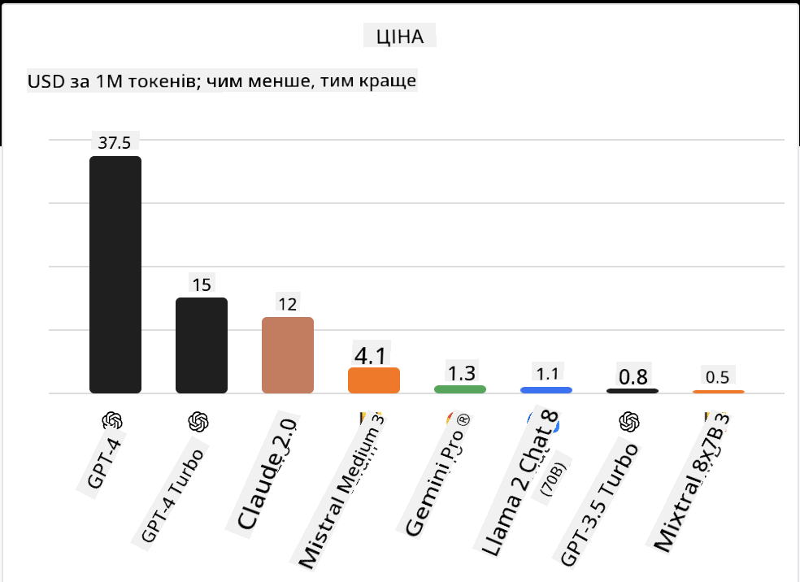
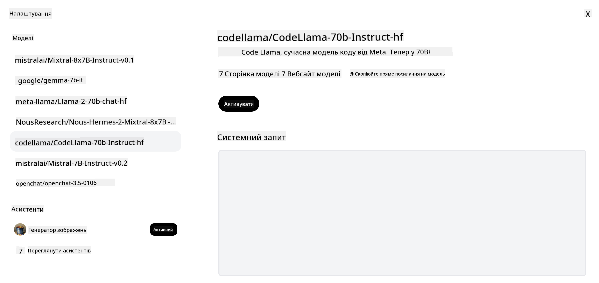

<!--
CO_OP_TRANSLATOR_METADATA:
{
  "original_hash": "0bba96e53ab841d99db731892a51fab8",
  "translation_date": "2025-07-09T17:16:54+00:00",
  "source_file": "16-open-source-models/README.md",
  "language_code": "uk"
}
-->

## Вступ

Світ відкритих LLM захоплюючий і постійно розвивається. Цей урок має на меті надати глибоке розуміння відкритих моделей. Якщо ви шукаєте інформацію про те, як пропрієтарні моделі порівнюються з відкритими, перейдіть до уроку ["Дослідження та порівняння різних LLM"](../02-exploring-and-comparing-different-llms/README.md?WT.mc_id=academic-105485-koreyst). У цьому уроці також розглядається тема донавчання, але детальніше про це можна дізнатися в уроці ["Донавчання LLM"](../18-fine-tuning/README.md?WT.mc_id=academic-105485-koreyst).

## Цілі навчання

- Отримати розуміння відкритих моделей
- Зрозуміти переваги роботи з відкритими моделями
- Ознайомитися з відкритими моделями, доступними на Hugging Face та в Azure AI Studio

## Що таке відкриті моделі?

Відкрите програмне забезпечення відіграло ключову роль у розвитку технологій у різних сферах. Ініціатива Open Source (OSI) визначила [10 критеріїв для програмного забезпечення](https://web.archive.org/web/20241126001143/https://opensource.org/osd?WT.mc_id=academic-105485-koreyst), щоб його можна було класифікувати як відкрите. Вихідний код має бути відкрито доступним під ліцензією, затвердженою OSI.

Хоча розробка LLM має схожі елементи з розробкою програмного забезпечення, процес не є ідентичним. Це викликало багато дискусій у спільноті щодо визначення відкритого коду в контексті LLM. Щоб модель відповідала традиційному визначенню відкритого коду, наступна інформація має бути публічно доступною:

- Дані, використані для навчання моделі.
- Повні ваги моделі, отримані під час навчання.
- Код для оцінки моделі.
- Код для донавчання.
- Повні ваги моделі та метрики навчання.

Наразі лише кілька моделей відповідають цим критеріям. [Модель OLMo, створена Allen Institute for Artificial Intelligence (AllenAI)](https://huggingface.co/allenai/OLMo-7B?WT.mc_id=academic-105485-koreyst) є однією з таких.

У цьому уроці ми надалі будемо називати моделі "відкритими моделями", оскільки вони можуть не повністю відповідати вищезазначеним критеріям на момент написання.

## Переваги відкритих моделей

**Висока налаштовуваність** – Оскільки відкриті моделі публікуються з детальною інформацією про навчання, дослідники та розробники можуть змінювати внутрішні компоненти моделі. Це дозволяє створювати високоспеціалізовані моделі, які донавчаються для конкретного завдання або сфери досліджень. Прикладами є генерація коду, математичні операції та біологія.

**Вартість** – Вартість за токен при використанні та розгортанні цих моделей нижча, ніж у пропрієтарних моделей. При створенні додатків на основі генеративного ШІ варто враховувати співвідношення продуктивності та ціни для вашого конкретного випадку.

  
Джерело: Artificial Analysis

**Гнучкість** – Робота з відкритими моделями дає змогу бути гнучким у виборі різних моделей або їх поєднанні. Прикладом є [HuggingChat Assistants](https://huggingface.co/chat?WT.mc_id=academic-105485-koreyst), де користувач може обрати модель безпосередньо в інтерфейсі:

## Огляд різних відкритих моделей

### Llama 2

[LLama2](https://huggingface.co/meta-llama?WT.mc_id=academic-105485-koreyst), розроблена Meta, є відкритою моделлю, оптимізованою для чат-додатків. Це завдяки методу донавчання, який включав велику кількість діалогів і людський зворотний зв’язок. Завдяки цьому модель генерує результати, які краще відповідають очікуванням користувачів, забезпечуючи кращий досвід.

Прикладами донавчених версій Llama є [Japanese Llama](https://huggingface.co/elyza/ELYZA-japanese-Llama-2-7b?WT.mc_id=academic-105485-koreyst), що спеціалізується на японській мові, та [Llama Pro](https://huggingface.co/TencentARC/LLaMA-Pro-8B?WT.mc_id=academic-105485-koreyst), покращена версія базової моделі.

### Mistral

[Mistral](https://huggingface.co/mistralai?WT.mc_id=academic-105485-koreyst) — відкрита модель з акцентом на високу продуктивність і ефективність. Вона використовує підхід Mixture-of-Experts, який об’єднує групу спеціалізованих експертних моделей в одну систему, де залежно від вхідних даних вибираються певні моделі. Це робить обчислення більш ефективними, оскільки моделі працюють лише з тими даними, у яких вони спеціалізовані.

Прикладами донавчених версій Mistral є [BioMistral](https://huggingface.co/BioMistral/BioMistral-7B?text=Mon+nom+est+Thomas+et+mon+principal?WT.mc_id=academic-105485-koreyst), орієнтована на медичну сферу, та [OpenMath Mistral](https://huggingface.co/nvidia/OpenMath-Mistral-7B-v0.1-hf?WT.mc_id=academic-105485-koreyst), що виконує математичні обчислення.

### Falcon

[Falcon](https://huggingface.co/tiiuae?WT.mc_id=academic-105485-koreyst) — LLM, створена Technology Innovation Institute (**TII**). Falcon-40B була навчена на 40 мільярдах параметрів і показала кращу продуктивність, ніж GPT-3, при меншому обсязі обчислень. Це стало можливим завдяки використанню алгоритму FlashAttention та multiquery attention, що знижує вимоги до пам’яті під час роботи. Завдяки скороченому часу обробки Falcon-40B підходить для чат-додатків.

Прикладами донавчених версій Falcon є [OpenAssistant](https://huggingface.co/OpenAssistant/falcon-40b-sft-top1-560?WT.mc_id=academic-105485-koreyst), асистент на основі відкритих моделей, та [GPT4ALL](https://huggingface.co/nomic-ai/gpt4all-falcon?WT.mc_id=academic-105485-koreyst), що демонструє вищу продуктивність, ніж базова модель.

## Як обрати

Однозначної відповіді на вибір відкритої моделі немає. Хорошим початком буде використання функції фільтрації за завданнями в Azure AI Studio. Це допоможе зрозуміти, для яких типів завдань модель була навчена. Hugging Face також підтримує LLM Leaderboard, де можна побачити найкращі моделі за певними метриками.

Для порівняння LLM різних типів корисним ресурсом є [Artificial Analysis](https://artificialanalysis.ai/?WT.mc_id=academic-105485-koreyst):

  
Джерело: Artificial Analysis

Якщо ви працюєте над конкретним кейсом, пошук донавчених моделей, орієнтованих на ту ж сферу, може бути ефективним. Експерименти з кількома відкритими моделями, щоб оцінити їхню продуктивність відповідно до ваших і користувацьких очікувань, також є хорошою практикою.

## Наступні кроки

Найкраще у відкритих моделях те, що з ними можна почати працювати досить швидко. Ознайомтеся з [Azure AI Studio Model Catalog](https://ai.azure.com?WT.mc_id=academic-105485-koreyst), де є спеціальна колекція Hugging Face з моделями, про які ми тут говорили.

## Навчання не закінчується тут, продовжуйте свій шлях

Після завершення цього уроку перегляньте нашу [колекцію Generative AI Learning](https://aka.ms/genai-collection?WT.mc_id=academic-105485-koreyst), щоб продовжувати підвищувати свої знання у сфері генеративного ШІ!

**Відмова від відповідальності**:  
Цей документ було перекладено за допомогою сервісу автоматичного перекладу [Co-op Translator](https://github.com/Azure/co-op-translator). Хоча ми прагнемо до точності, будь ласка, майте на увазі, що автоматичні переклади можуть містити помилки або неточності. Оригінальний документ рідною мовою слід вважати авторитетним джерелом. Для критично важливої інформації рекомендується звертатися до професійного людського перекладу. Ми не несемо відповідальності за будь-які непорозуміння або неправильні тлумачення, що виникли внаслідок використання цього перекладу.