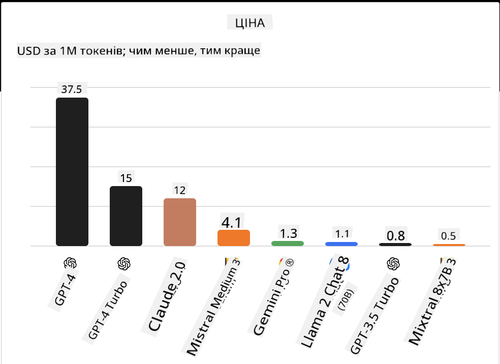
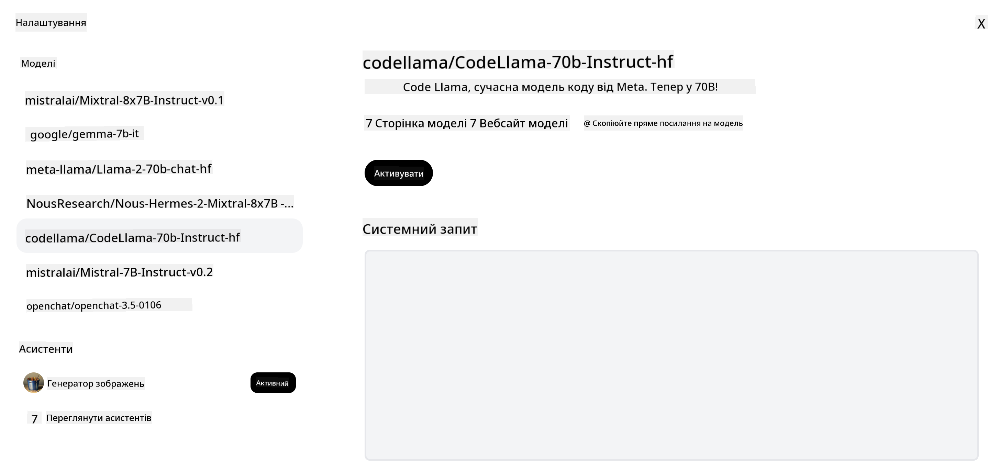

<!--
CO_OP_TRANSLATOR_METADATA:
{
  "original_hash": "0bba96e53ab841d99db731892a51fab8",
  "translation_date": "2025-06-26T00:06:45+00:00",
  "source_file": "16-open-source-models/README.md",
  "language_code": "uk"
}
-->

## Вступ

Світ відкритих LLM моделей є захоплюючим і постійно розвивається. Цей урок має на меті надати детальний огляд відкритих моделей. Якщо ви шукаєте інформацію про те, як власницькі моделі порівнюються з відкритими моделями, перейдіть до ["Дослідження та порівняння різних LLM моделей"](../02-exploring-and-comparing-different-llms/README.md?WT.mc_id=academic-105485-koreyst). У цьому уроці також буде розглянута тема тонкого налаштування, але більш детальне пояснення можна знайти в уроці ["Тонке налаштування LLM моделей"](../18-fine-tuning/README.md?WT.mc_id=academic-105485-koreyst).

## Навчальні цілі

- Зрозуміти відкриті моделі
- Зрозуміти переваги роботи з відкритими моделями
- Дослідити відкриті моделі, доступні на Hugging Face та Azure AI Studio

## Що таке відкриті моделі?

Відкрите програмне забезпечення відіграло важливу роль у розвитку технологій у різних сферах. Ініціатива з відкритого програмного забезпечення (OSI) визначила [10 критеріїв для програмного забезпечення](https://web.archive.org/web/20241126001143/https://opensource.org/osd?WT.mc_id=academic-105485-koreyst), щоб класифікувати його як відкрите. Вихідний код має бути відкрито поширений під ліцензією, затвердженою OSI.

Хоча розробка LLM моделей має подібні елементи до розробки програмного забезпечення, процес не зовсім однаковий. Це викликало багато обговорень у спільноті щодо визначення відкритого програмного забезпечення у контексті LLM моделей. Щоб модель відповідала традиційному визначенню відкритого програмного забезпечення, повинна бути доступна наступна інформація:

- Набори даних, використані для навчання моделі.
- Повні ваги моделі як частина навчання.
- Код для оцінки.
- Код для тонкого налаштування.
- Повні ваги моделі та метрики навчання.

Наразі існує лише кілька моделей, що відповідають цим критеріям. [Модель OLMo, створена Інститутом штучного інтелекту Аллена (AllenAI)](https://huggingface.co/allenai/OLMo-7B?WT.mc_id=academic-105485-koreyst) є однією з них.

Для цього уроку ми будемо називати моделі "відкритими моделями", оскільки на момент написання вони можуть не відповідати наведеним критеріям.

## Переваги відкритих моделей

**Висока налаштовуваність** - Оскільки відкриті моделі випускаються з детальною інформацією про навчання, дослідники та розробники можуть змінювати внутрішню структуру моделі. Це дозволяє створювати високо спеціалізовані моделі, які тонко налаштовані для конкретного завдання або області дослідження. Деякі приклади цього - генерація коду, математичні операції та біологія.

**Вартість** - Вартість за токен для використання та розгортання цих моделей є нижчою, ніж у власницьких моделей. Під час створення додатків Generative AI слід звертати увагу на продуктивність відносно ціни, працюючи з цими моделями для вашого випадку використання.

 Джерело: Artificial Analysis

**Гнучкість** - Робота з відкритими моделями дозволяє бути гнучким у використанні різних моделей або їх комбінуванні. Прикладом цього є [HuggingChat Assistants](https://huggingface.co/chat?WT.mc_id=academic-105485-koreyst), де користувач може вибрати модель, що використовується, безпосередньо в інтерфейсі користувача:

## Дослідження різних відкритих моделей

### Llama 2

[LLama2](https://huggingface.co/meta-llama?WT.mc_id=academic-105485-koreyst), розроблена Meta, є відкритою моделлю, оптимізованою для додатків на основі чату. Це завдяки методу тонкого налаштування, який включав велику кількість діалогів та зворотного зв'язку від людей. Завдяки цьому методу модель генерує більше результатів, які відповідають очікуванням людей, що забезпечує кращий користувацький досвід.

Деякі приклади тонко налаштованих версій Llama включають [Japanese Llama](https://huggingface.co/elyza/ELYZA-japanese-Llama-2-7b?WT.mc_id=academic-105485-koreyst), яка спеціалізується на японській мові, та [Llama Pro](https://huggingface.co/TencentARC/LLaMA-Pro-8B?WT.mc_id=academic-105485-koreyst), яка є покращеною версією базової моделі.

### Mistral

[Mistral](https://huggingface.co/mistralai?WT.mc_id=academic-105485-koreyst) є відкритою моделлю з сильним акцентом на високу продуктивність та ефективність. Вона використовує підхід Mixture-of-Experts, який поєднує групу спеціалізованих експертних моделей в одну систему, де в залежності від вхідних даних, вибираються певні моделі для використання. Це робить обчислення більш ефективними, оскільки моделі обробляють лише ті вхідні дані, в яких вони спеціалізуються.

Деякі приклади тонко налаштованих версій Mistral включають [BioMistral](https://huggingface.co/BioMistral/BioMistral-7B?text=Mon+nom+est+Thomas+et+mon+principal?WT.mc_id=academic-105485-koreyst), яка зосереджена на медичній сфері, та [OpenMath Mistral](https://huggingface.co/nvidia/OpenMath-Mistral-7B-v0.1-hf?WT.mc_id=academic-105485-koreyst), яка виконує математичні обчислення.

### Falcon

[Falcon](https://huggingface.co/tiiuae?WT.mc_id=academic-105485-koreyst) є LLM, створеною Інститутом технологічних інновацій (**TII**). Falcon-40B була навчена на 40 мільярдах параметрів, що дозволило їй перевершити GPT-3 з меншими витратами на обчислення. Це завдяки використанню алгоритму FlashAttention та багатозапитної уваги, що дозволяє зменшити вимоги до пам'яті під час виведення. Завдяки цьому скороченому часу виведення, Falcon-40B підходить для чат-додатків.

Деякі приклади тонко налаштованих версій Falcon включають [OpenAssistant](https://huggingface.co/OpenAssistant/falcon-40b-sft-top1-560?WT.mc_id=academic-105485-koreyst), асистента, побудованого на відкритих моделях, та [GPT4ALL](https://huggingface.co/nomic-ai/gpt4all-falcon?WT.mc_id=academic-105485-koreyst), яка забезпечує вищу продуктивність, ніж базова модель.

## Як вибрати

Немає однозначної відповіді на вибір відкритої моделі. Хорошим місцем для початку є використання функції фільтрації за завданнями в Azure AI Studio. Це допоможе вам зрозуміти, для яких типів завдань модель була навчена. Hugging Face також підтримує Лідерборд LLM, який показує найкращі моделі за певними метриками.

Коли ви хочете порівняти LLM між різними типами, [Artificial Analysis](https://artificialanalysis.ai/?WT.mc_id=academic-105485-koreyst) є ще одним чудовим ресурсом:

 Джерело: Artificial Analysis

Якщо ви працюєте над конкретним випадком використання, пошук тонко налаштованих версій, що зосереджені на тій самій області, може бути ефективним. Експериментування з кількома відкритими моделями, щоб побачити, як вони працюють відповідно до ваших і очікувань ваших користувачів, є ще однією гарною практикою.

## Наступні кроки

Найкраща частина відкритих моделей полягає в тому, що ви можете почати працювати з ними досить швидко. Ознайомтеся з [Каталогом моделей Azure AI Studio](https://ai.azure.com?WT.mc_id=academic-105485-koreyst), в якому представлена спеціальна колекція Hugging Face з цими моделями, які ми обговорили тут.

## Навчання не зупиняється тут, продовжуйте подорож

Після завершення цього уроку ознайомтеся з нашою [Колекцією навчання Generative AI](https://aka.ms/genai-collection?WT.mc_id=academic-105485-koreyst), щоб продовжити вдосконалювати свої знання про Generative AI!

**Відмова від відповідальності**:  
Цей документ було перекладено за допомогою сервісу автоматичного перекладу [Co-op Translator](https://github.com/Azure/co-op-translator). Хоча ми прагнемо до точності, будь ласка, зверніть увагу, що автоматичні переклади можуть містити помилки або неточності. Оригінальний документ на рідній мові слід вважати авторитетним джерелом. Для критичної інформації рекомендується професійний людський переклад. Ми не несемо відповідальності за будь-які непорозуміння або неправильні інтерпретації, що виникають внаслідок використання цього перекладу.