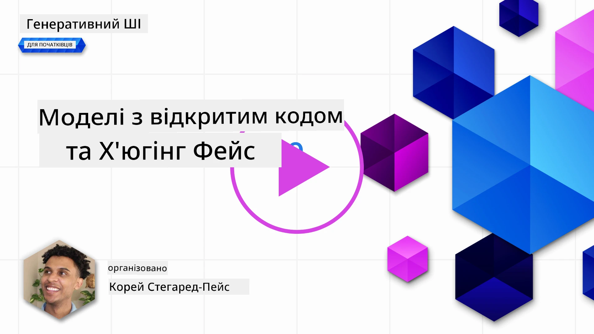
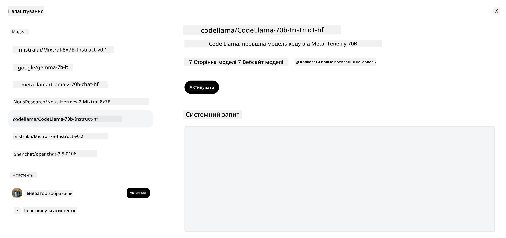
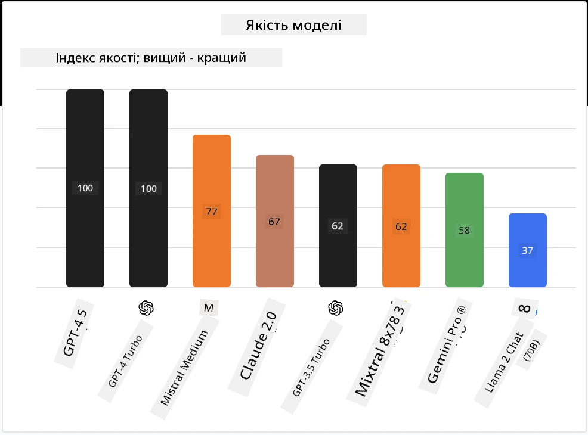

## Вступ

Світ відкритих моделей великих мовних моделей (LLM) є захоплюючим і постійно розвивається. Цей урок має на меті надати глибокий огляд відкритих моделей. Якщо ви шукаєте інформацію про те, як пропрієтарні моделі порівнюються з відкритими моделями, перейдіть до уроку ["Дослідження та порівняння різних LLM"](../02-exploring-and-comparing-different-llms/README.md?WT.mc_id=academic-105485-koreyst). У цьому уроці також буде розглянуто тему тонкого налаштування, але більш детальне пояснення можна знайти в уроці ["Тонке налаштування LLM"](../18-fine-tuning/README.md?WT.mc_id=academic-105485-koreyst).

## Цілі навчання

- Отримати розуміння відкритих моделей
- Зрозуміти переваги роботи з відкритими моделями
- Дослідити відкриті моделі, доступні на Hugging Face та у каталозі моделей Microsoft Foundry

## Що таке відкриті моделі?

Відкрите програмне забезпечення відіграло вирішальну роль у розвитку технологій у різних галузях. Ініціатива Open Source Initiative (OSI) визначила [10 критеріїв для програмного забезпечення](https://web.archive.org/web/20241126001143/https://opensource.org/osd?WT.mc_id=academic-105485-koreyst), щоб його можна було вважати відкритим. Вихідний код повинен бути відкрито доступним за ліцензією, схваленою OSI.

Хоча розробка великих мовних моделей має схожі елементи з розробкою програмного забезпечення, процес не є ідентичним. Це викликало багато дискусій у спільноті щодо визначення відкритості у контексті LLM. Для того, щоб модель відповідала традиційному визначенню відкритої, має бути опублікована наступна інформація:

- Набори даних, які використовувалися для навчання моделі.
- Повні ваги моделі як частина навчання.
- Код для оцінки.
- Код для тонкого налаштування.
- Повні ваги моделі та метрики навчання.

Наразі є лише кілька моделей, які відповідають цим критеріям. Модель [OLMo, створена Allen Institute for Artificial Intelligence (AllenAI)](https://huggingface.co/allenai/OLMo-7B?WT.mc_id=academic-105485-koreyst) є однією з таких.

У цьому уроці ми надалі будемо називати моделі "відкритими моделями", оскільки вони можуть не відповідати вказаним вище критеріям на момент написання.

## Переваги відкритих моделей

**Висока настройка** - Оскільки відкриті моделі публікуються з детальною інформацією про навчання, дослідники і розробники можуть модифікувати внутрішню структуру моделі. Це дозволяє створювати високоспеціалізовані моделі, тонко налаштовані для конкретного завдання або галузі досліджень. Прикладами можуть бути генерація коду, математичні операції та біологія.

**Вартість** - Вартість за токен використання та розгортання цих моделей є нижчою, ніж у пропрієтарних моделей. При розробці застосунків Генеративного ШІ доцільно оцінювати співвідношення продуктивності та вартості під час використання цих моделей у вашому випадку.

Джерело: Artificial Analysis

**Гнучкість** — Робота з відкритими моделями дозволяє бути гнучким у виборі різних моделей чи їх поєднанні. Прикладом цього є [HuggingChat Assistants](https://huggingface.co/chat?WT.mc_id=academic-105485-koreyst), де користувач може безпосередньо у інтерфейсі вибрати модель, що використовується:

## Дослідження різних відкритих моделей

### Llama 2

[LLama2](https://huggingface.co/meta-llama?WT.mc_id=academic-105485-koreyst), розроблена Meta, є відкритою моделлю, оптимізованою для чат-застосунків. Це завдяки методу тонкого налаштування, що включав велику кількість діалогів і відгуків від людей. Цей метод дозволяє моделі видавати результати, що більше відповідають людським очікуванням, забезпечуючи кращий користувацький досвід.

Деякі приклади тонко налаштованих версій Llama включають [Japanese Llama](https://huggingface.co/elyza/ELYZA-japanese-Llama-2-7b?WT.mc_id=academic-105485-koreyst), спеціалізовану на японській мові, та [Llama Pro](https://huggingface.co/TencentARC/LLaMA-Pro-8B?WT.mc_id=academic-105485-koreyst), покращену версію базової моделі.

### Mistral

[Mistral](https://huggingface.co/mistralai?WT.mc_id=academic-105485-koreyst) є відкритою моделлю із сильним акцентом на високу продуктивність та ефективність. Вона використовує підхід Mixture-of-Experts, що об'єднує групу спеціалізованих експертних моделей у одну систему, де залежно від вхідних даних вибираються потрібні моделі. Це робить обчислення більш ефективними, оскільки моделі працюють лише з тими вхідними даними, у яких вони спеціалізовані.

Прикладами тонко налаштованих версій Mistral є [BioMistral](https://huggingface.co/BioMistral/BioMistral-7B?text=Mon+nom+est+Thomas+et+mon+principal?WT.mc_id=academic-105485-koreyst), орієнтована на медичну сферу, та [OpenMath Mistral](https://huggingface.co/nvidia/OpenMath-Mistral-7B-v0.1-hf?WT.mc_id=academic-105485-koreyst), що виконує математичні обчислення.

### Falcon

[Falcon](https://huggingface.co/tiiuae?WT.mc_id=academic-105485-koreyst) — це великий мовний модель, створена Technology Innovation Institute (**TII**). Falcon-40B була навчена на 40 мільярдах параметрів і показала кращу продуктивність, ніж GPT-3, з меншими обчислювальними ресурсами. Це завдяки використанню алгоритму FlashAttention та multiquery attention, що дозволяє зменшити вимоги до пам’яті під час інференсу. З цим скороченим часом інференсу Falcon-40B підходить для чат-застосунків.

Прикладами тонко налаштованих версій Falcon є [OpenAssistant](https://huggingface.co/OpenAssistant/falcon-40b-sft-top1-560?WT.mc_id=academic-105485-koreyst), помічник, створений на базі відкритих моделей, та [GPT4ALL](https://huggingface.co/nomic-ai/gpt4all-falcon?WT.mc_id=academic-105485-koreyst), що забезпечує кращу продуктивність, ніж базова модель.

## Як обрати

Однозначної відповіді на вибір відкритої моделі немає. Хорошим початком є використання функції фільтрації за завданням у каталозі моделей Microsoft Foundry. Це допоможе зрозуміти, для яких типів завдань навчена модель. Hugging Face також підтримує таблицю лідерів LLM, яка показує найкращі моделі за певними метриками.

Для порівняння LLM різних типів ресурсом є [Artificial Analysis](https://artificialanalysis.ai/?WT.mc_id=academic-105485-koreyst):

Джерело: Artificial Analysis

Якщо працюєте над конкретним випадком використання, ефективним може бути пошук тонко налаштованих версій, орієнтованих на ту саму сферу. Також корисним є експериментування з кількома відкритими моделями, щоб побачити, як вони працюють з урахуванням ваших та очікувань користувачів.

## Наступні кроки

Найкраща частина відкритих моделей — ви можете почати працювати з ними досить швидко. Ознайомтеся з [каталогом моделей Microsoft Foundry](https://ai.azure.com?WT.mc_id=academic-105485-koreyst), що містить спеціальну колекцію Hugging Face з моделями, про які ми тут говорили.

## Навчання не завершується тут, продовжуйте шлях

Після завершення цього уроку перегляньте нашу [колекцію навчальних матеріалів з Генеративного ШІ](https://aka.ms/genai-collection?WT.mc_id=academic-105485-koreyst), щоб продовжувати підвищувати свої знання з Генеративного ШІ!

---

<!-- CO-OP TRANSLATOR DISCLAIMER START -->
**Відмова від відповідальності**:
Цей документ було перекладено за допомогою сервісу штучного інтелекту для перекладу [Co-op Translator](https://github.com/Azure/co-op-translator). Хоча ми прагнемо до точності, будь ласка, майте на увазі, що автоматичні переклади можуть містити помилки або неточності. Оригінальний документ рідною мовою слід вважати авторитетним джерелом. Для критично важливої інформації рекомендується професійний людський переклад. Ми не несемо відповідальності за будь-які непорозуміння або неправильні тлумачення, що виникли внаслідок використання цього перекладу.
<!-- CO-OP TRANSLATOR DISCLAIMER END -->