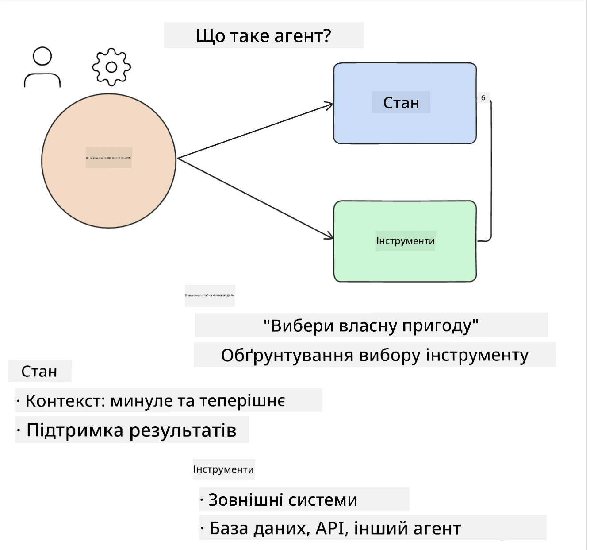
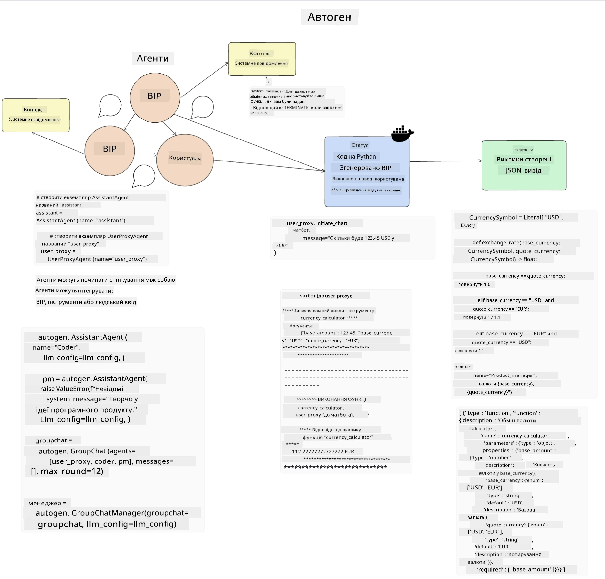
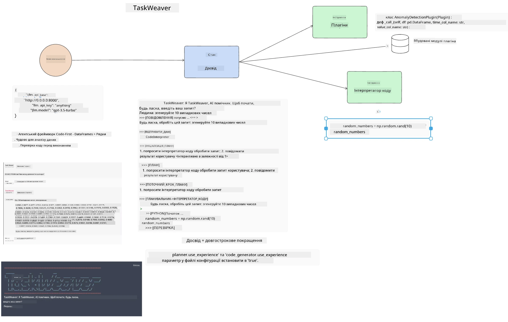
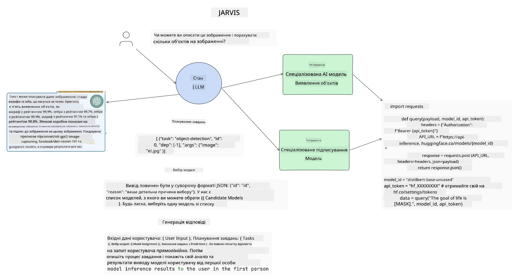

[](https://youtu.be/yAXVW-lUINc?si=bOtW9nL6jc3XJgOM)

## Вступ

AI-Агенти представляють захопливий розвиток у галузі Генеративного ШІ, дозволяючи Великим Мовним Моделям (LLM) еволюціонувати від асистентів до агентів, здатних виконувати дії. Фреймворки AI-Агентів дають розробникам можливість створювати застосунки, які забезпечують LLM доступ до інструментів та управління станом. Ці фреймворки також підвищують видимість, дозволяючи користувачам та розробникам відслідковувати плановані LLM дії, тим самим покращуючи управління досвідом.

Урок охопить наступні теми:

- Розуміння, що таке AI-Агент — Що саме є AI-Агентом?
- Огляд чотирьох різних фреймворків AI-Агентів — Що робить їх унікальними?
- Застосування цих AI-Агентів до різних випадків використання — Коли слід використовувати AI-Агентів?

## Цілі навчання

Після проходження цього уроку ви зможете:

- Пояснити, що таке AI-Агенти і як їх можна використовувати.
- Мати розуміння відмінностей між деякими популярними фреймворками AI-Агентів і їх особливостей.
- Розуміти, як функціонують AI-Агенти для побудови додатків з їх використанням.

## Що таке AI-Агенти?

AI-Агенти — це дуже захоплива сфера у світі Генеративного ШІ. З цим захопленням часом з’являється плутанина у термінах та їх застосуванні. Щоб усе було просто і включало більшість інструментів, що називають AI-Агентами, ми будемо використовувати таке визначення:

AI-Агенти дозволяють Великим Мовним Моделям (LLM) виконувати завдання, надаючи їм доступ до **стану** та **інструментів**.



Давайте визначимо ці терміни:

**Великі Мовні Моделі** — це моделі, про які йде мова у цьому курсі, такі як GPT-3.5, GPT-4, Llama-2 тощо.

**Стан** — це контекст, у якому працює LLM. LLM використовує контекст своїх минулих дій та поточний контекст, що керує прийняттям рішень для наступних дій. Фреймворки AI-Агентів полегшують розробникам підтримку цього контексту.

**Інструменти** — щоб виконати завдання, яке користувач запросив і яке LLM запланував, LLM потрібен доступ до інструментів. Прикладами інструментів можуть бути база даних, API, зовнішній додаток або навіть інший LLM!

Ці визначення мають допомогти вам краще орієнтуватися в темі далі, коли ми розглядатимемо, як вони реалізовані. Давайте розглянемо кілька різних фреймворків AI-Агентів:

## LangChain Agents

[LangChain Agents](https://python.langchain.com/docs/how_to/#agents?WT.mc_id=academic-105485-koreyst) — це реалізація наведених вище визначень.

Для керування **станом** використовується вбудована функція під назвою `AgentExecutor`. Вона приймає визначений `agent` та доступні для нього `tools`.

`Agent Executor` також зберігає історію чату, щоб надати контекст розмови.


LangChain пропонує [каталог інструментів](https://integrations.langchain.com/tools?WT.mc_id=academic-105485-koreyst), які можна імпортувати у ваш застосунок, до яких LLM може отримати доступ. Ці інструменти створені спільнотою та командою LangChain.

Ви можете визначити ці інструменти та передати їх до `Agent Executor`.

Видимість — це ще один важливий аспект, коли йдеться про AI-Агентів. Для розробників застосунків важливо розуміти, який інструмент LLM використовує і чому. Для цього команда LangChain створила LangSmith.

## AutoGen

Наступний фреймворк AI-Агентів, який ми розглянемо, — це [AutoGen](https://microsoft.github.io/autogen/?WT.mc_id=academic-105485-koreyst). Головна увага AutoGen — на розмовах. Агенти є як **спроможними до бесіди**, так і **налаштованими**.

**Спроможні до бесіди** — LLM можуть починати й продовжувати розмову з іншим LLM для виконання завдання. Це реалізується створенням `AssistantAgents` та наданням їм конкретного системного повідомлення.

```python

autogen.AssistantAgent( name="Coder", llm_config=llm_config, ) pm = autogen.AssistantAgent( name="Product_manager", system_message="Creative in software product ideas.", llm_config=llm_config, )

```

**Налаштовувані** — Агенти можуть визначатися не лише як LLM, але і як користувач або інструмент. Як розробник, ви можете визначити `UserProxyAgent`, відповідального за взаємодію з користувачем для отримання зворотного зв’язку про виконання завдання. Цей зворотний зв’язок може продовжити виконання завдання або зупинити його.

```python
user_proxy = UserProxyAgent(name="user_proxy")
```

### Стан і Інструменти

Для зміни та керування станом асистент-агент генерує Python-код для виконання завдання.

Приклад процесу:



#### LLM визначено системним повідомленням

```python
system_message="For weather related tasks, only use the functions you have been provided with. Reply TERMINATE when the task is done."
```

Це системне повідомлення вказує цьому конкретному LLM, які функції релевантні для його задачі. Пам’ятайте, що в AutoGen можна мати кілька визначених AssistantAgents з різними системними повідомленнями.

#### Розмова ініціюється користувачем

```python
user_proxy.initiate_chat( chatbot, message="I am planning a trip to NYC next week, can you help me pick out what to wear? ", )

```

Це повідомлення від user_proxy (людини) запускає процес, під час якого агент досліджує можливі функції, які він має виконати.

#### Виконується функція

```bash
chatbot (to user_proxy):

***** Suggested tool Call: get_weather ***** Arguments: {"location":"New York City, NY","time_periond:"7","temperature_unit":"Celsius"} ******************************************************** --------------------------------------------------------------------------------

>>>>>>>> EXECUTING FUNCTION get_weather... user_proxy (to chatbot): ***** Response from calling function "get_weather" ***** 112.22727272727272 EUR ****************************************************************

```

Після обробки першого повідомлення агент надсилає пропозицію виклику інструменту. У цьому випадку це функція під назвою `get_weather`. Залежно від вашої конфігурації, ця функція може виконуватись автоматично та читатись агентом, або виконуватись на основі введення користувача.

Ви можете знайти список [прикладів коду AutoGen](https://microsoft.github.io/autogen/docs/Examples/?WT.mc_id=academic-105485-koreyst) для додаткового ознайомлення з початками розробки.

## Taskweaver

Наступний фреймворк, який ми розглянемо — це [Taskweaver](https://microsoft.github.io/TaskWeaver/?WT.mc_id=academic-105485-koreyst). Він відомий як агент «спершу код», оскільки замість роботи виключно зі `строками` може оперувати DataFrame в Python. Це надзвичайно корисно для завдань аналізу даних та генерації, таких як створення графіків і діаграм або генерація випадкових чисел.

### Стан і Інструменти

Для керування станом розмови TaskWeaver використовує концепцію `Planner`. `Planner` — це LLM, який приймає запит користувача і планує завдання, які потрібно виконати, щоб задовольнити цей запит.

Для виконання завдань `Planner` має доступ до набору інструментів, які називаються `Plugins`. Це можуть бути класи Python або загальний інтерпретатор коду. Ці плагіни зберігаються у вигляді ембеддингів, щоб LLM легше шукав необхідний плагін.



Ось приклад плагіна для обробки виявлення аномалій:

```python
class AnomalyDetectionPlugin(Plugin): def __call__(self, df: pd.DataFrame, time_col_name: str, value_col_name: str):
```

Код перевіряється перед виконанням. Ще одна функція для керування контекстом у Taskweaver — це `experience`. Досвід дозволяє зберігати контекст розмови на довший термін у YAML-файлі. Це можна налаштувати так, щоб LLM з часом покращувався у певних завданнях за умови, що він має доступ до попередніх розмов.

## JARVIS

Останній фреймворк, який ми розглянемо, — це [JARVIS](https://github.com/microsoft/JARVIS?tab=readme-ov-file&WT.mc_id=academic-105485-koreyst). Унікальність JARVIS у тому, що він використовує LLM для керування `станом` розмови, а `інструментами` є інші AI-моделі. Кожна з AI-моделей спеціалізується на певних завданнях, таких як розпізнавання об’єктів, транскрипція чи опис зображень.



LLM, будучи універсальною моделлю, отримує запит від користувача, ідентифікує конкретне завдання та будь-які аргументи/дані, необхідні для його виконання.

```python
[{"task": "object-detection", "id": 0, "dep": [-1], "args": {"image": "e1.jpg" }}]
```

LLM потім форматує запит у спосіб, який спеціалізована AI-модель може інтерпретувати, наприклад, у JSON. Після того, як AI-модель повертає свій прогноз на основі завдання, LLM отримує відповідь.

Якщо для виконання завдання потрібно декілька моделей, LLM також інтерпретує відповіді від цих моделей, перш ніж об’єднати їх для формування відповіді користувачу.

Приклад нижче показує, як це працюватиме, коли користувач запитує опис та підрахунок об’єктів на зображенні:

## Завдання

Щоб продовжити навчання AI-Агентів, ви можете створити з AutoGen:

- Застосунок, що імітує бізнес-зустріч різних відділів освітнього стартапу.
- Створити системні повідомлення, які направляють LLM у розумінні різних персон і пріоритетів, та дозволяють користувачу презентувати нову ідею продукту.
- LLM має потім генерувати подальші питання від кожного відділу, щоб уточнити і покращити презентацію та ідею продукту.

## Навчання не завершується, продовжуйте подорож

Після завершення цього уроку ознайомтесь з нашою [колекцією для навчання Генеративному ШІ](https://aka.ms/genai-collection?WT.mc_id=academic-105485-koreyst), щоб продовжити підвищувати свої знання у Генеративному ШІ!

---

<!-- CO-OP TRANSLATOR DISCLAIMER START -->
**Відмова від відповідальності**:  
Цей документ було перекладено за допомогою сервісу автоматичного перекладу [Co-op Translator](https://github.com/Azure/co-op-translator). Хоч ми і прагнемо до точності, будь ласка, майте на увазі, що автоматичний переклад може містити помилки або неточності. Оригінальний документ рідною мовою слід вважати авторитетним джерелом. Для критичної інформації рекомендується звертатися до професійного перекладу, виконаного людиною. Ми не несемо відповідальності за будь-які непорозуміння чи неправильне тлумачення, що можуть виникнути внаслідок використання цього перекладу.
<!-- CO-OP TRANSLATOR DISCLAIMER END -->